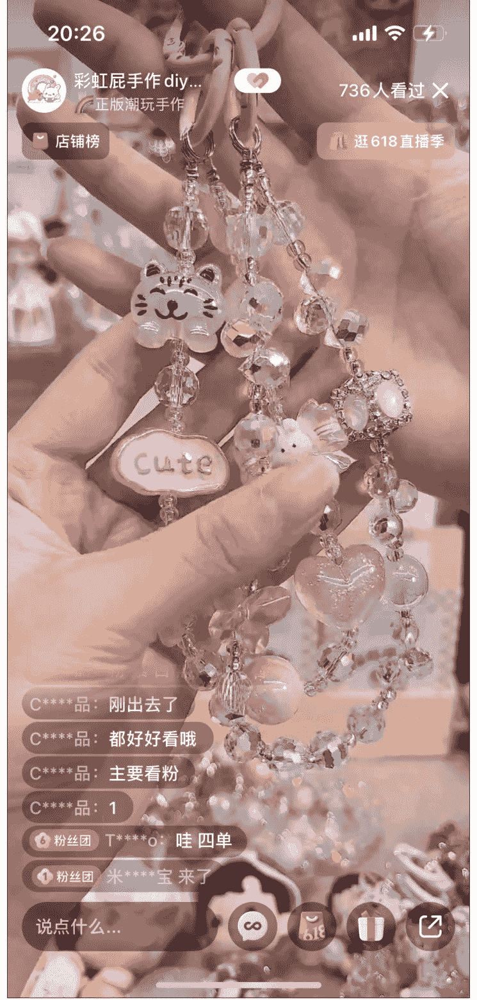
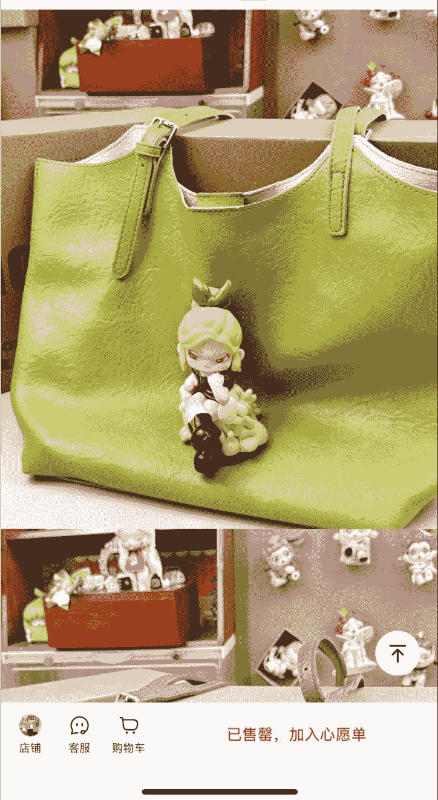
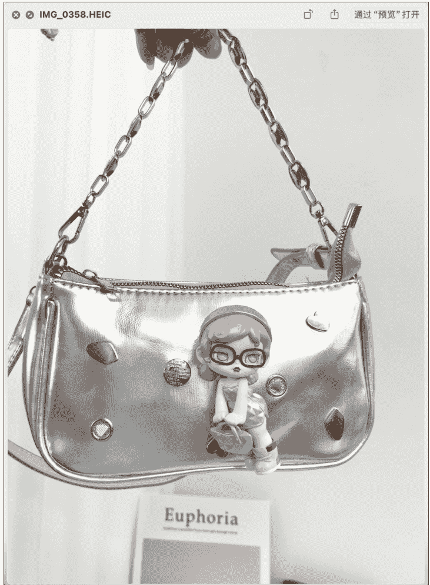
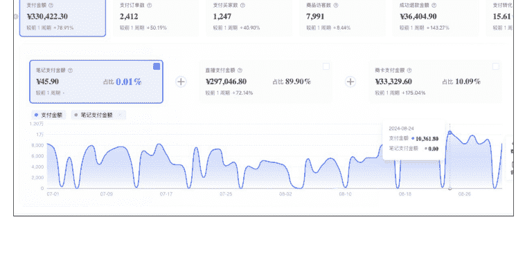
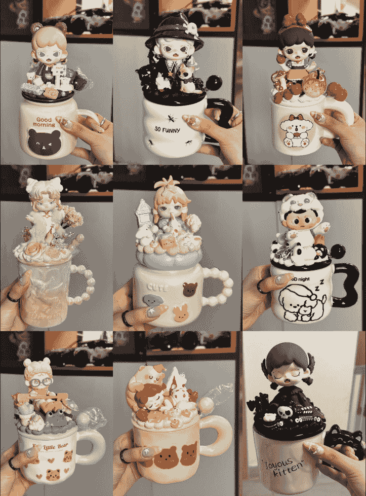
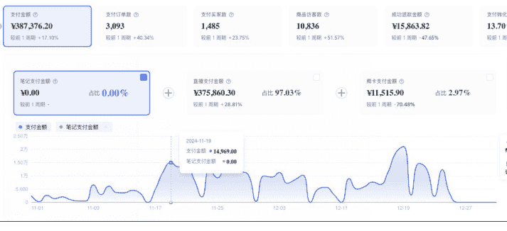
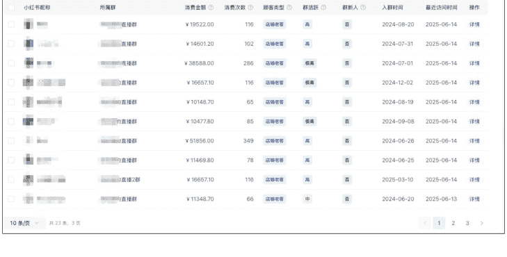
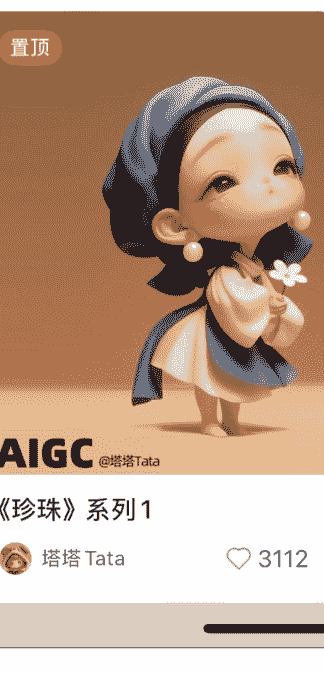
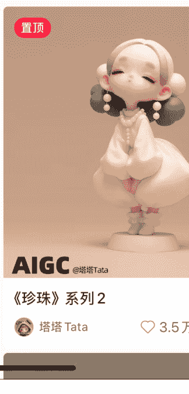

# 潮玩直播项目，如何从起号到放大，做到月入 20 w 后退出的项目复盘

## 250710 生财精华
公众号懒人搜索，懒人专属群
懒人微信：lazyhelper

哈喽，我是生财 9 期老圈友阿莫。18 年开始做抖音短视频带货，最高单个视频佣金 40w。2020 年做女装直播，月销售额 200w，但 2022 年后就一直比较颓，月赚几万的项目看不上，月赚几十万的项目觉得麻烦不想做。直到去年才收拾好状态，再次认真创业。

最近 PPMT 股价暴涨，Labubu 风靡全球，关注潮玩的人越来越多。趁着这个热点，跟大家分享我去年开始做的项目：潮玩直播。

从 0 到 1 起号，再到放大运营，最后主动退出，整个过程踩了不少坑，也有一些收获。写这篇复盘主要想和大家交流实操中的关键点，希望能给准备入局或正在探索的朋友一些参考。

## 一、为什么选择潮玩赛道

### 机缘巧合的发现
去年春节后，老婆经常在看潮玩直播，还买了个温度SP车挂。作为直男，我对这些IP完全不感冒，但只要我一问，老婆就能给我讲半小时。看老婆确实很感兴趣，就随口问"你想不想也来卖"。没想到她真的想做，于是我俩开始研究这个方向。

### 三个维度的判断逻辑
- 趋势判断：我一直认同一个观点：随着中国人均GDP超过1万美元，会涌现新的消费机会——国产品牌崛起，精神性需求增加。潮玩正是其中一类，个人长期看好这个方向。这里挖个坑，有机会给大家分享几个面对00后甚至05后的项目，年轻人的市场大但是对应的产品和服务少，而且他们的付费意愿强，是有蛮多机会的。
- 变现能力：当时预估了小红书一个头部直播间，月利润有20w，成功吸引了我的注意力。当时判断思路是这样的：
  - 选平台：我们做了多年抖音，知道抖音比较卷，所以决定先做小红书，新人好起号。准备业务跑通了，再去做抖音。
  - 选对标：看了几个头部直播间，最后选了一个对标，主要考虑了这几个方面：她是头部直播间，在线人数、销量和销售额都不错（当时小红书盲盒直播间不多，我们没用第三方平台工具，最好还是通过新红之类的工具来验证销售数据，更准确）；她的产品我们能搞定；她的直播逻辑我们能看懂，觉得自己也能做到（这里踩了一个坑，选对标不能只看她现在已经做出来的直播逻辑，要验证出起号的直播逻辑）。
  - 分析数据：刷了各种小红书帖子，判断小红书盲盒退货率比较低。去1688看她主卖品的成本，算出单件利润，跟踪她单日和一个月的销售量，算出毛利。最后减去估算的她房租成本和人员成本。
- 竞争壁垒：老婆觉得对标主播能力不错，但自己也能做到。而我做过女装直播，看了她们的模式，确实门槛不高。

去年4月份对标的截屏找不到了，我今天重新找了个直播间作为例子，大体讲下我的判断方法：
- 找对标先找榜单：从第三方平台或者平台的榜单找，这个是从小红书艺术潮玩榜找的。
- 看她做了多久：像这个号五月份正式做，到今天（6月29号）也就播了25场。五月份有断播，要么在测品换品，要么是某个团队孵化的新账号。
- 判断收入：去 1688 看下类似的链子多少钱（大概 10 块左右），去千岛看下类似的萌粒多少钱（大概 8 块左右），再算上包装和快递（3 块左右），一单利润 10 块左右。播了 25 天毛利五万多。
- 可复制性：判断对标的人货场三个维度自己能不能搞定。
  - 人：主播不需要出镜，不需要高颜值，招聘成本低，或者自己就可以上。重点放在话术上，用 get 笔记直接把对标主播话术录下来，整理出来自己背熟练。
  - 货：自己 1688 买几条看下质量，千岛买几个萌粒，再学习下打孔等技巧，基本就没问题了。
  - 场：只需要一个桌子，场地要求低，重点放在桌面布置以及灯光上。
- 赛道竞争程度：盲盒有各种类别，有非常多的品：手串、萌粒、盲盒、娃包、奶油胶；玩法更是千奇百怪：大转盘、猜颜色、对对碰。找到一个对标后，要去看下有没有其他类似直播间，看这几个数据：有多少同款对标、他们做了多久、销售额情况、销售额是上升还是下降。判断竞争度低更适合切入。

[平台免责声明]
Kuffskein 色情低俗等不良内容 严禁未成年打赏或进行直播。购买商品请谨慎判断，切勿轻信可疑广告信息，谨防网络诈骗，理性消费。如发现违规行为请及时举报！
可以换主播得展示款 极速退款 ¥29.9 懒人微信：lazyhelper
12:06猫屋DIY潮... 2.6万赞关注 艺术潮玩榜第12名
电商购物 友好市集开业 领惊喜大额券 视频图片款式 共2款> ¥39.9 到手价¥29.9 已售5791 商家券满30减10先用后付
萌粒重油手机链挂件钥匙链包挂DIY H17 100+人好评 100+人加购 3个月内5000+人购买 预计26小时发货承诺48小时内发货，晚发必赔> 浙江金华包邮 极速退款不支持无理由退换晚发必赔> 店铺客服购物车 加入购物车 领券购买 懒人微信：lazyhelper

直播预告 下次开播提醒我
直播回顾 2025年6月（共16场）
- 6月28日 11:43
- 6月28日 7:35
- 6月27日 7:13
- 6月25日 7:51
- 6月24日 7:08

## 二、如何起号（0-1阶段）

### 公司化运营的思路
由于之前6年创业基本都是个体模式，这次想通过公司化运营减少自己在具体执行上的精力。就在良渚租了写字楼，去年四月份开始招聘主播。当时怕不好招人，租的良渚那边的写字楼。但其实现在就业环境不好，招人很好招，BOSS 一打开职位全是打招呼。完全可以租个更便宜的办公场地，创业前期能省就省。

### 第一次直播踩坑
人员配置：我、老婆、主播
5 月 12 号主播到位，起号我们选的手串盲盒，当时一个是考虑这个品比较便宜适合尝试，再就是觉得老婆能搭配出更好看的款。下图是老婆搭配的款：

老婆搭配出来的款确实不错，但实际播的过程中，我们发现对标是通过做假单拉人气，我们平播根本播不起来。这里解释一下：当时手串盲盒玩法是，一单 39.9 元 买家从 10 个颜色里猜 2 个颜色。保底拆两个手串盲盒，每次拆盲盒只要拆出来手串的颜色跟猜的一致就加拆一串。这样算下来，平均每单是拆 2.5 个盲盒。

遇到的问题：
当我们老老实实平播的时候，同行通过做假单，一个订单加拆七八次（概率远低于万分之一）。这样不断拆盲盒很吸引人，直播间停留高；又刺激赌徒心理，粉丝觉得自己也行也跟着下单提高了下单率，这样成功拉起在线。我们不愿意做假单，平播一天只能卖几十单。

这里踩的坑：
- 手链这个品，做得好的直播间，买家不是为了手链好看买单，而是为了连续赌中颜色的爽感买单。
- 手链这个方向做的人太多，路子不野很难跑起来。前期创业适合选竞争小的方向切入。
- 盲盒直播，考验的不只是选品，玩法也非常重要。
- 前期调研不细致，直播的三要素人货场只看了表面。前期调研越细，后期能少走弯路，不能想当然。
- 实体创业选品要慎重，手链踩坑换品后，产生一些库存，花了两个月才清完。

解决方案：
先找我们的优势，老婆的优势是审美好，做出来的款更好看。那我们先找竞争小的、更依赖选品的直播间来模仿。我们找到一个做娃包的直播间，一个月销量 1000+，客单价 138，月销售额 10w+，销售额能达到我们的预期。毛利接近 50%，利润也还不错。而且这个品是新品，预期是还有更大的市场。它还没有竞品：老婆经常刷盲盒直播间，自己很喜欢这个品，然后在小红书没有找到类似的直播间。而老婆觉得她做的品会更好：包选的更好看，搭配更热门的娃，娃和包搭配的更和谐。他们也是平播。

15:08 搜索更多好物 商品 评价 详情 推荐

已售罄，加入心愿单

于是开始切换成这个品。老婆审美确实不错，新品上线后开始出单， 5月场均就能过 2000。
懒人微信：lazyhelper

## 三、如何放大(1-10阶段)
人员配置：我、老婆、主播、打包

### 找到爆品密码
开始做娃包时，考虑实用性，我们选的是大多是小娃。因为娃的体型小，加在包上不会很沉。

但到6月初，根据实际销售数据以及直播间粉丝的询问，我们发现粉丝对单个IP的喜欢高于整体搭配的美观和娃包的实用性。很多粉丝基于对某个 IP 的喜欢，会收集她的 IP 的相关产品。很多粉丝买娃包，根本不背，买的那一刻爽了就够了。好看更重要，沉一点很多粉丝也能接受。

基于上面的判断，我们开始增加娃包中 IP 的种类，根据卖的情况调整各个 IP 的占比，最后细分到某 IP 哪个款卖的好。当时发现 Zoraa 这个 IP 粉丝很喜欢（粉丝会直接在直播间点名要这个款，我们上了后确实很多粉丝会抢），我们就把用她做的娃包做成惊喜款（一端 4 个娃包里有一个是 Zoraa 款），加上第一名超级铁粉的支持，日销售额达到八九千，开始盈利。

### 第一次数据回落
6 月底，铁粉已经买的差不多，没有她的带动，直播间平播吸引不到新粉，数据下降。应对策略：不断测试其他 IP，增加产品丰富度（最开始只有 Zoraa、爆米花、卓大王、安妮塔几个 IP，之后把 Dora、SP、dimoo、拉布布等更多 IP 加了进来）。运营上娃包改成一端一个大惊喜，一个小惊喜（一端 4 个娃包，两个普通款，剩下两个用的大热款和小热款的娃）。到八月底数据恢复到八九千。

### 产能瓶颈
核心问题： 七八月份，我们一直卡在制作产出上。由于我们是自己做原创，自己买盲盒，买包，再搭配，制作。我还要带娃，每天订单根本做不过来。七八月份销量不高也有我们做的量不够的原因,基本都是当天做的都会卖完。

解决方案:
- 招聘助理。拓品奶油胶方向（就是把盲盒通过奶油胶粘在日常使用的各种物价上，杯子、音响、置物架、充电宝等等），边招制作人员边跟小工作室合作测试。我们粉丝的粘性很高，只要我们出的新品不错，她们也都会冲。拓品奶油胶，能提高单个粉丝产出。通过跟工作室合作可以减低我们自己制作压力，这样即使我们自己的娃包制作量提升不上来，销售额也能提升。
- 当时估算我们自己制作一个奶油胶杯子利润50，找工作室合作利润35。考虑不需要我们自己制作，少了人工和备货成本，利润是可以接受的。

## 四、遇到的瓶颈期
人员配置：我、老婆、主播、打包、场控、直播助理、运营助理

### 流量瓶颈
10月份 Zoraa 新款粉丝已经冲得差不多，而且业绩受双11影响非常大，利润被员工成本吃掉。双11结束业绩仍无起色。盲盒是标准的兴趣电商，当双11时，很多粉丝都把预算放在了囤日常必需品上了，平时也开始去刷李佳琦等各大双11直播间。看我们直播间、买我们产品变少。双11期间，各大直播间加大投流，我们这种靠自然流的直播间流量也会明显下滑。

### 模式复盘与突破
说实话，整个项目起步比较顺，第一个月就能打平支出，之后就开始盈利。虽然盈利不多，但是业绩是不断往上走的，还积累一批忠诚粉丝。本来想招人、拓产品线，再复制直播间做大做强的。没想到双11 一下子业绩这么差，自己花了一周把头部直播间看了一遍，认真分析人货场，总结出潮玩直播的核心模式：
- 需要不断有新鲜感 - 不断拆盲盒才能拉起场观（增加新粉）。小直播间在那平播，停留低，根本做不大。大直播间在那哐哐的拆，看起来很过瘾，停留和转化都好。那就得舍得投入，要么备多货，没人拍就自己拆。要么优质低价把人气拉起来，直播间拆不起来就做不起来。
- 产品更新频率 - 需要不断更新新款，老粉才会持续冲（老粉激活）。只要你产品做的不错，会积累一批忠诚粉丝，她们是真的舍得花钱。我们有一二十个在我们这边消费过万的粉丝，一个人买几十几百个包。
- 隐藏款设置 - 不能卖明盒，要设置吸引人的隐藏款让用户一直冲。越是小直播间，为了转化就搞明盒，越搞明盒吸引的就是精打细算的人（像我这种，只买喜欢的）。要想做大，要的是冲盲盒的人，要上头，非要抽到。
- 盲盒玩法很重要 - 这是盲盒跟其他直播间非常大的一个区别。盲盒玩法是盲盒的一部分。玩法特别就会吸引这批盲盒玩家，他们本身爱玩。上头的机制，有时一场直播一个粉丝就能贡献几千销售额。

### 模式调整
基于这些判断我对直播间做了调整：
- 拉场观： 从当天做多少卖多少，改成备货 300 多件库存，这样直播间没订单也要做假单一直拆。
- 上新品：奶油胶供应商不靠谱，手工娘招不到合适的。那就自己做简单的镜子、梳子、手机支架，开播秒一波先把人气拉上来。
- 产品策略： 我们一端 4 个，两个普通款（普通娃+包），一个大惊喜（热款娃+包），一个小惊喜（小热款娃+包）。大惊喜选更高价的娃让粉丝冲起来，小惊喜降低价格保证利润。

效果： 场观翻了两番，新模式第二天就干到1万5。

基于对未来预期，我开始考虑拓新直播间，增加直播场次，开拓抖音放大销量。但是还没一周，我们就准备停掉这个项目。

## 五、为什么选择退出

### 身体和家庭因素
新的助理刚招过来，开始下午、晚上都开播，再加上尝试抖音直播，整个工作量不断增加。加上对业绩的焦虑，人员管理的压力，这时老婆已经撑不住了：长时间熬夜、劳累导致老婆咳嗽性哮喘发作。我们没有老人帮带娃，都是自己带，精力跟不上，而且顾不上孩子教育。项目变现达不到我们的标准（做这个项目的预期是月赚 10w+，而且团队基本能自给自足）。

### 放大路径分析
其实我们当时已经摸清项目如何放大：降成本、增收入。
具体路径：
- 几个月利润几十万的对标都在二三线城市，她们的人工和房租成本比我们低一半多。如果我们搬到三线城市,单个直播间有更多利润,可以多复制直播间。面对业绩起伏也有更大的抗风险性。另外可以培养几个管理人员,减少我和老婆的工作量。
- 产销分开：一个产品团队对接多个直播间,可以降低边际成本。最后拓展抖音,通过投放放大。
为什么不做：不想为了这个项目换城市,再加上之前三个点的考量,最后放弃了这个思路。

### 退出策略
知道我们要清货,老婆闺蜜很感兴趣,跑来学习后成功被种草,我们清了大部分后她把剩下的货盘了回去。现在她自己做,婆婆过来帮打包下,播的比较佛系,每个月赚一两万。

补充个数据：没想到业绩最高点，是主播已经离职，我一个 i 人被赶鸭子上架去清货的时候 （上图）。老板播的效果完胜普通主播，我自己知道直播间推流逻辑，并且可以自己做决策。根据直播推流情况可以立马调整策略拉高在线和引导成交。

最简单的讲，平台根据一个直播间过去 5 分钟、半小时、一小时的人均停留和成交额来推流。
货分为三类：
- 秒杀款（限量、高转化、低利润）
- 走量款（不限量、中高转化、中等利润）
- 利润款（不限量、中低转化、高利润）
直播就是通过秒杀款拉人气，用走量款拉成交，然后再用利润款提升利润。成交低了就从利润款转成走量款，人气低了就转成秒杀款。

现在，自己在做新的项目，自己每天直播。创业真的是每天都是惊喜，i 人直播，真是未曾设想的道路。

## 六、复盘总结

### 核心经验总结
潮玩直播的三大核心：
- 持续新鲜感 - 不断拆盲盒才能维持场观
- 产品更新频率 - 盲盒买家喜新厌旧，有很强的购买欲。不断更新新品，新粉感兴趣，老粉无脑冲
- 隐藏款机制 - 不能卖明盒，利用人性，用隐藏款驱动用户持续消费

运营关键点：
- 备货比现做效果好，库存深度影响场观
- 老板直播效果比主播好，节奏控制更精准
- 成本控制是盈利关键，地域成本差异巨大

再给大家展示一个数据：我们的铁粉一个人能买 300 多个娃包，在我们直播间消费过万的粉丝有二三十个。这是一个非常有复利的生意。

### 项目适合的人群
个人/夫妻档：
- 成本控制能力强
- 目标收入 1-2 万/月
- 适合佛系播放模式

团队化运营:
- 多直播间复制
- 配合投流放大
- 需要在低成本城市运营
- 适合追求更高收入的团队

### 给准备入局朋友的建议
- 选对城市 - 成本结构直接决定项目可行性
- 找准定位 - 个人副业和规模化运营是完全不同的路径
- 身体是本钱 - 直播强度很大，要考虑长期可持续性

### 小结
纯个人判断，即使国内经济继续保持这种低增长状态，个别行业如潮玩依然会加速增长。小可以做潮玩直播，大可以做潮玩 IP、潮玩公司。依托于 AI 和新媒体，个人都能搞个 IP 出来。见下图：
塔塔 Tata 小红书号：3821868234 IP 属地：湖北 AIGC设计 | IP 落地中 原创作品，转载说明出处 版权均已注册，禁 禁止商用，盗图 商务合作 @Tata

《珍珠》系列1
《珍珠》系列2

希望这些经验能给正在探索或准备入局的朋友一些参考，少走一些弯路。

最后，安利小懒的付费群：
懒人专属群 懒人微信：lazyhelper

## 公众号：懒人搜索 / 懒人专属群

微信：lazyhelper

📚 懒人专属群持续更新中，已持续运营 6 年，整理超 3000 份各类精选付费文章 & 年费社群干货，全部开放下载。

本资料为付费群内部分享，仅供真实有需要的朋友查阅 🤫

- **懒人专属群更新记录：** https://lazy2025.top/#/blog/record2
- **懒人专属群更新记录（需梯子，备用）：** https://lazybook.fun/#/blog/record2