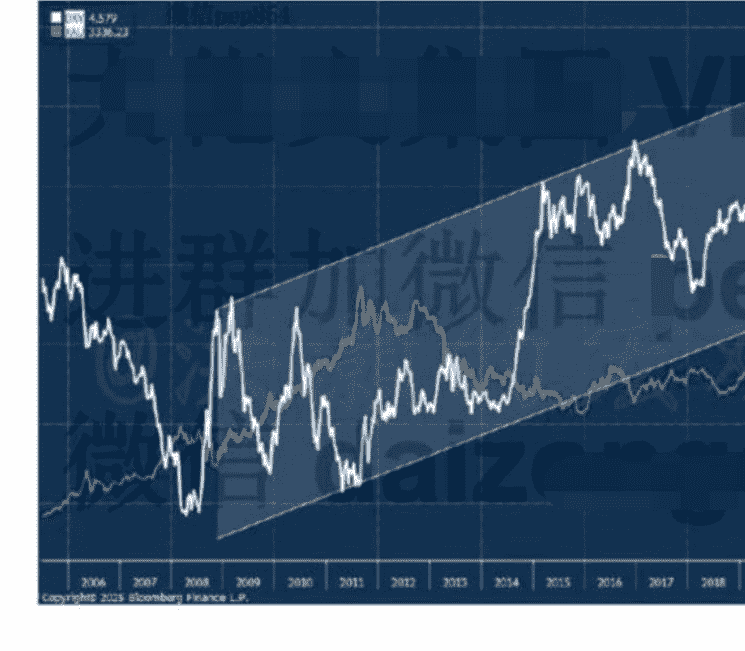
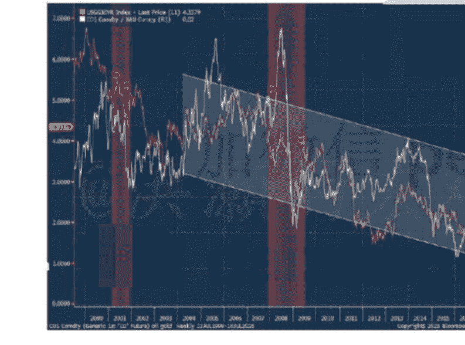
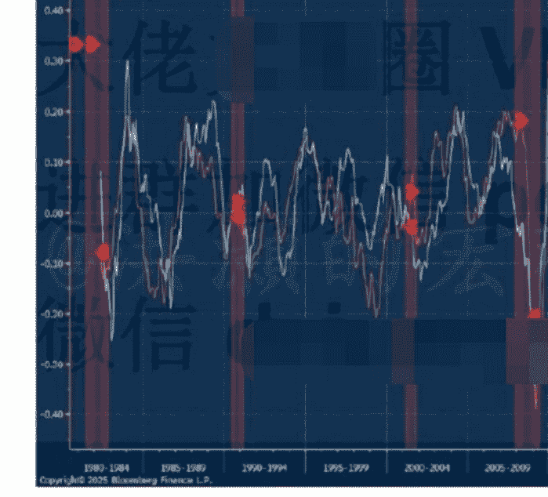
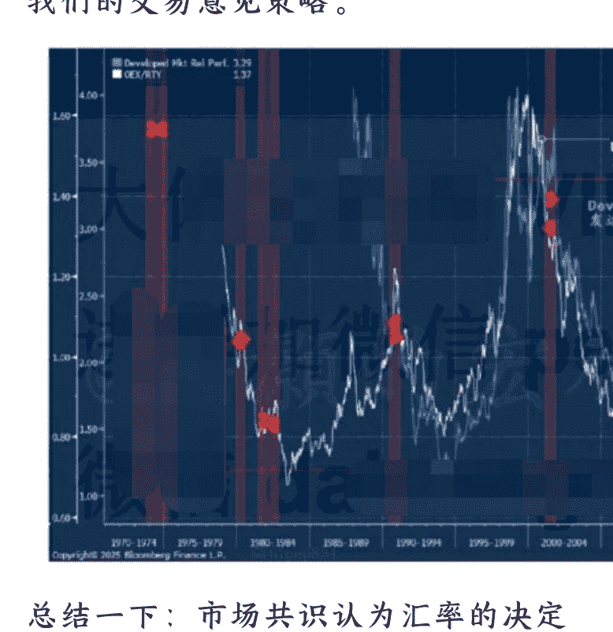

## 上证重返 3,500 一伟大的轮动

2025.07.11 洪灝的宏观策略
整理：公众号懒人搜索，懒人专属群独享
懒人微信：lazyhelper

全球股市新高，连A股也没有拉下。周三夜晚，美股再创历史新高。英伟达成为了人类历史上第一个市值达到四万亿的公司。元宇宙小扎继续高薪挖角，把苹果的一位重要的AI工程师“Pang”以超两亿美元的天价薪酬挖走了。传闻苹果企图高薪挽留，并还了一个全苹果公司除了库克以外最高的数字，但终无果。过去几周，小扎斥巨资从AI同行里高薪挖角，很多顶尖的工程师都收到了首年一亿美元的薪酬包。小扎还花了140亿美元买下了Scale AI。这一系列的动作，都把美国高科技巨头的股价推向了新高潮。

当下，英伟达、微软和苹果三家公司的股票市值之和就已经约11万亿美元，比中国在岸市场的市值都大。仅仅五年前，他们的总市值才3.5万亿美元，而今已经翻了三倍。这次美股从特朗普“解放日”历史性暴跌后反弹，超过一大半都是科技七雄的贡献。

简言之，美股的市场集中度已经达到了前所未有的地步——这是本世纪以来市值最集中的市场。我们在六月发表的下半年展望《洪灝：周期与博弈》中已经讨论了这种现象的成因，并预测了其趋势的延续。

很多人把周三晚美股的表现归因为美联储议息会议的纪要。纪要显示，部分美联储官员认为 7 月就应该降息。而特朗普则不断施压，反复地在自己的社交媒体上强调美国应该拥有所有发达国家里最低的利息。

甚至，一则来自币圈的小作文称鲍威尔将很快辞职。因此，市场认为以上与美联储基准利率相关的消息和美国科技股的强势造就了美股的新高。当然，我们在六月的深圳和上海两地的读者见面会上就与读者分享了“美股新高毫无悬念”的预测。

其实，周三晚更重要的消息，是总值为 390 亿美元的美国国债拍卖反应良好，美债上涨，打破了最近美国国债被抛售的短期趋势。周三夜，美国 10 年期收益率下跌 7 个基点至 4.33%。这次债券拍卖的收益率为 4.362%，略低于竞标截止前的拍卖前交易的收益率，表明对于美国国债的需求其实是超预期的。

昨晚，美国财政部还发行了价值 220 亿美元的 30 年期国债。这次反响良好的美国国债拍卖，部分打消了市场对于美国财政债务问题的忧虑。之前市场认为六月份集中到期的大量美国国债再融资的挑战，现在看来应该是不会有太大的问题的。与此同时，昨天日本政府长债的拍卖情况也超出了市场的预期，平抚了市场的忧虑。

在经历了周三冲击 3500 不果之后，上证昨日在银行和地产等板块的带领下，终于站上了 3500。虽然技术上二十来个点的“突破”并不是能够确认“突破”的幅度，同时今天周五的一周收盘价技术上更重要，但是 3500 依然是一个久违了的整数关口，令人欢呼雀跃。一则关于房地产再次棚改的小作文吸引了交易员的注意。毕竟，上一次棚改，还是 2015 年 A 股 5000 点牛市之际，引人遐想。

在这个全球市场关键的位置，市场的内部结构也出现了重要的变化。

以下内容仅 V+会员可见

在上一篇专属报告里，我们讨论了尽管美元周期已经进入了长期衰退的阶段，但是短期逆趋势的技术性反弹还是很有可能的。毕竟，我们观察到美元汇率已经快速地贬值到过去十多年上升趋势的下沿（图一），对冲基金投机做空头寸已经非常极致，而美元偏离其 200 天长期均线的程度也到了近十几年之最。简言之，短期已经没有人看多美元了。

如果短期美元技术性走强，那么其契机很可能是市场对于特朗普的“大而美”法案重新审视。这个法案利好美国未来几年的资本支出计划，尤其是美国的基建投资。

当下，NFIB 美国小企业的资本开支计划已经降到了五年以来最低。这很可能是因为在特朗普政策的不确定性让美国的小企业无法计划未来的资本开支。然而，特朗普的“大而美”法案对于资本支出有许多鼓励的措施和减税的计划。因此，美国未来几年随着制造业的回归，资本支出将大幅上升。或者说，美国又开始投资自己了。这对于美国经济并不是一个利空。

另外一个美元短期“松口气反弹”的催化剂，也可能是因为全球风偏暂时因超买条件成熟而导致交易员获利了结。毕竟，我们观察到，美国、欧洲、中国等市场都出现超买的现象。这种因为短期交易性动机而出现的市场回调往往不深。而且，很多错过了这次历史性反弹、还没有仓位的交易员还在等待市场回调而建仓。因此，有时候，市场也可以用“超买化解超买”。

石油和黄金的比率往往是实体经济资本开资信心的指标。我们的数据显示，当下油金比率已经下降到了25年最低（图二）。上一个低点，是2020年一季度疫情引发的美国经济衰退。也即是说，美国的实体经济资本开支的意愿非常低迷。这与上述的NFIB资本开支预期指标的低落吻合。

同时，油金比率一反常态，不再与美国十年国债收益率齐头并进，而早已分道扬镳（图二）。如果十年国债收益率的飙升是因为美国通胀预期的升温，而油金比率的低迷则是对于经济前景的担忧，那么它们历史性的背离，显示的就是一种滞涨的市场预期。然而，在财政和货币双宽松的环境里，美国经济的增长速度很难大幅放缓，更有可能出现高增长、高通胀的组合。油金比率和美债收益率的这个巨大的裂口，就是一个巨大的、可交易的预期差。

与此同时，我们的数据分析还发现，金属和黄金的比率已经暴跌至历史最低水平之一。前两次金属和黄金的比例暴跌到这样的水平，那还是2008年金融危机导致的大衰退，以及2020年疫情导致的美国经济衰退（图三）。

这个观察，和油金比率的观察而得到的结论是一致的——市场对于增长异常悲观，已经到了历史上两次大衰退的水平。然而，实际观察也告诉了我们，其实美国乃至全球的增长并没有那么差，而在特朗普“大而美”法案的推动下，增长反而还可能加速。如是，普通金属和其它贵金属将跑赢黄金。这也和我们在下半年展望《洪灝：周期与博弈》报告中对于黄金的展望相吻合。

公众号: 懒人微信: lazyhelper

如果市场对于增长的预期过分地悲观，那么美股在创了历史新高之后应该怎么走？

我们在本文的开篇已经讨论了美股市场的集中效应。标普指数已经连续几天触及了 Bollinger Band 的上沿，显示了美股价格的动能强势。一般来说，如此的强势往往将让投资者开始考虑短期的交易性风险和汇率的变动。因此，虽然指数在 Bollinger 上沿运行显示美股短期超买的情况，这个现象本身对于指数本身的前瞻性信号是有限的，但是对于美股市场里的小盘股则往往是一个利好的数据。

从图四看，美股大盘股长期相对于小盘股的表现，也逐步趋向于极致。和发达国家市场相对于新兴市场的长期相对表现也是一致的。市场对于美股长期的回报预期过高，而对于美国以外的市场的回报预期则过分担忧。

其实，如果美国经济不出现大型衰退，中国经济韧性十足，那么全球的经济都不会太差。同时，市场对于美国大盘股极致的表现也没有正确的风险评估，而忽略了对于小盘股非常扎实的基本面和技术面的结构。这时候，数据模型将让我们更客观地审视我们的交易意见策略。

总结一下：市场共识认为汇率的决定性因素是商品的跨境流动，比如贸易盈余、赤字等。其实，如果真是这样的话，那么人民币早应该由于中国每年天量的贸易盈余而大幅走强了。然而，虽然美国贸易赤字天量，但美元短期技术上暴跌到了一个关键的技术位置，有短期技术性修复的需要。

这时候，美元的逆趋势技术反弹很可能是因为在特朗普“大而美”法案的理解而导致资本流动方向的短期的改变，以及资本支出信心的回暖。如是，这种由于对于美国乃至全球增长预期的改变在短期内让美元短期反弹，而资本流向的变化更多地是轮动到美国小盘股，令小盘股跑赢。

石油黄金比率运行到了历史性低点，并与美国国债收益率分道扬镳，则说明了市场非常担心美国增长的前景。这个数据组合显示了市场担心美国经济陷入滞胀的可能性。金属和黄金的比例也达到了历史最低，释放出了同样的信号。

然而，虽然美股短期的情绪、仓位和技术结构都令人很难下手做多，但短期内我们不应该过分担心美国增长的前景。这是因为财政货币双宽松则将保证美国未来几个月内很难衰退。如果增长不太需要担心，那么在这样的环境里，小盘股反而是最受益（图四）。如是，资金在大盘股和小盘股之间的轮动也应该逐步展开。长期看，由于市场对于风险预期过高，导致发达国家作为一种相对安全的资产对于新兴市场的相对表现也运行到了极致。如是，长期资金从发达国家向新兴市场轮动也将逐步展开（图四）。

洪灝 2025.07.11
发布于中国香港

最后，安利小懒的付费群：

# 懒人专属群

- 📚 懒人专属群持续更新中，已持续运营6年，整理超3000份各类精选付费文章&年费社群干货，全部开放下载。
- 本资料为付费群内部分享，仅供真实有需要的朋友查阅🕵️
- 懒人专属群更新记录：https://lazy2025.top/#/blog/record2
- 懒人专属群更新记录（需梯子，备用）：https://lazybook.fun/#/blog/record2