# Youtube 小白如何从 0 到 1 做到月入 3W

250711 生财精华

公众号懒人搜索，懒人专属群独享

懒人微信：lazyhelper


## 前言

我目前一直是在做 Youtube 的 Shorts 视频，没有做过长视频。所以这一篇关于如何做 Shorts 的复盘帖。

如果让我回到今年的 3 月份重新开始，我依然会是文章中这套打法，所以这也是一篇我写给自己的 Shorts 游戏攻略。

另外我觉得这套打法在许多项目中都是通用的，如果有圈友觉得我的想法是对的或者是错的都可以给我留言。

这篇文章中的内容都是我自己的经验之谈，难免想法会有些片面，如果有圈友有不一样的想法，或者有一些数据的反例，欢迎和我交流。

文章中的内容会更偏向思路，但是我也会写出实操的具体步骤，希望能做到，哪怕是刚做 Youtube 的小白，看了这篇文章也知道从哪里开始。

这篇文章我分为了两个部分写：

第一个部分：做爆款的正确姿势，如何快速在 Youtube 上开通 YPP 并且变现。

第二个部分：如何设计自己的提效流程以及我目前的提效脚本分享。

下面我先给大家展示一下我目前取得的成绩。

## 自我介绍

大家好，我是大臣，在参加生财今年3月份的Youtube航海之后，就一直在做Youtube。

我目前开通了8个高级YPP以及2个初级YPP账号，上个月总共盈利4500刀，单号盈利3000刀。当然这些都是估算收益，由于7-12号才会拨款到ads，我目前也不知道具体能有多少收益。

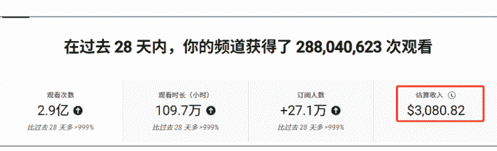

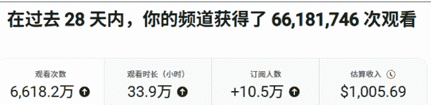

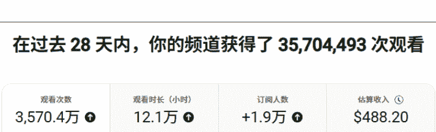

就在前天，我也收到了Youtube的银牌，不过我有两个10万粉以上的号，却只有一个号能领银牌，另外一个号不能领取的理由是：内容原创度不够。

## 如何快速在 Youtube 上开通 YPP 并且变现

### 心法

在开始写具体怎么做之前，我得先和大家分享几条指导我行动心法，以及我为什么会想到这点。

### 搞流量就是在搞钱

#### 解释

不管是开 YPP 也好，通过 YPP 变现也好，靠的都是流量，所以搞流量就是在搞钱。

什么东西有流量我就要搞什么，但是它有两个前提：

违反 Youtube 规则的我不搞，因为搞了也开不了 YPP，白搞。

让我感到生理不适的我不搞，因为太恶心了做不下去。

#### 我的案例

克服偏见：就拿鱿鱼游戏来举例子，鱿鱼游戏在 Youtube 上是一个非常爆款的话题，这点我之前是知道的，但是我一直没有去尝试，因为我讨厌追热点，我觉得这件事很low。

跳出舒适圈：当我做多了某一个赛道之后，尝试换赛道的时候，我会觉得特别难受，特别不想学，我举个直观的例子。

找茬游戏：
https://www.youtube.com/shorts/xMLTJfuqBV8

猫猫故事：
https://www.youtube.com/shorts/LYEkg7rHhy8

由于我自己做的最多的就是故事赛道的视频，所以当我挖掘到这样一个有流量的找茬赛道时，哪怕他是单图，我觉得做起来也没故事简单。很多时候换赛道我都会遇到这个问题，所以我就会告诉自己，我是来搞钱的，别想太多。

### 预期要足够低

足够低的预期，才能让你坚持把这个项目做下去，一口吃不成一个胖子。

我4月份和5月份都是在摸索怎么开YPP，真正开始做视频赚钱是在6月份，我当时对这个月的赚钱预期是赚500刀。结果如你所见，这个月超额完成任务。

但是在6月底的时候，我非常焦虑，如果我七月份无法保持这个成绩怎么办？于是我和自己说，你能接受自己最少赚多少钱，我的答案是 3000 块，那 500 刀就够了。不过咱们也不能一直是 500 刀，所以我这个月给自己定的目标是 1000 刀。

> 在项目没有跑通之前，不要考虑任何长期的问题

#### 解释

长期坚持其实没有任何问题，但是长期坚持有一个前提，就是你真的赚到了钱。因为长期的前提是你现在能够活下去。

#### 我的案例

我最开始做的就是故事赛道，当时想着我要长期做下去，那我肯定要懂故事，然后开始阅读罗伯特・麦基的《故事》，但是看了一天我就感觉不对劲了，时间成本太高了，而且这个方法对不对，能不能成还是一个题，现在最重要的是我做这个能不能赚到钱，下大功夫在这上面肯定不行。

到这里心法就说完，下面可以开始讲实操了。

## 做爆款的正确姿势

### 第一步：找赛道

想在 Shorts 上做爆款，选对赛道最重要，所以第一件事就是找赛道。你要让自己看到足够多的赛道，这样你才能知道，目前 Shorts 上什么火，同行们都在做什么。记住同行就是最好的老师。

- 我找赛道的方法有下面几种

#### Youtube APP

手机上下个 Youtube APP，不要登录，直接刷 Shorts。需要自己解决手机魔法问题。

#### Youtube 网页的首页刷新

浏览器上打开 Youtube 的首页，不停的刷新首页，看首页的 Shorts 推荐视频。(我挖到很多很好的赛道都是靠这个方法搞出来的，用浏览器直接刷 Shorts 反而不行)。


这里分享一个小技巧，如果你是再挖更多的赛道，你最好是不要关注任何频道，也不要点进去看你感兴趣的视频，你复制到其他浏览器去看。

如果你是 是想挖某一个赛道的爆款视频，那你就使劲关注这个赛道的账号，使劲看这个赛道的视频。

#### 使用第三方网站。

我目前用的就是这个：
https://www.viewstats.com。

#### 点击 Top Videos，它会列出前 100 条播放量最高的视频。

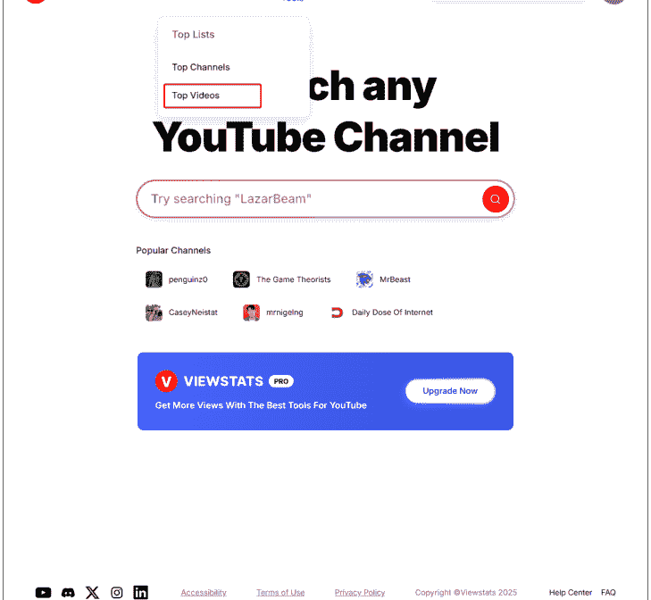

点击 shorts，然后左边有筛选时间的选项，你可以把昨天，近七天，近 28 天，近三个月的都看一遍。

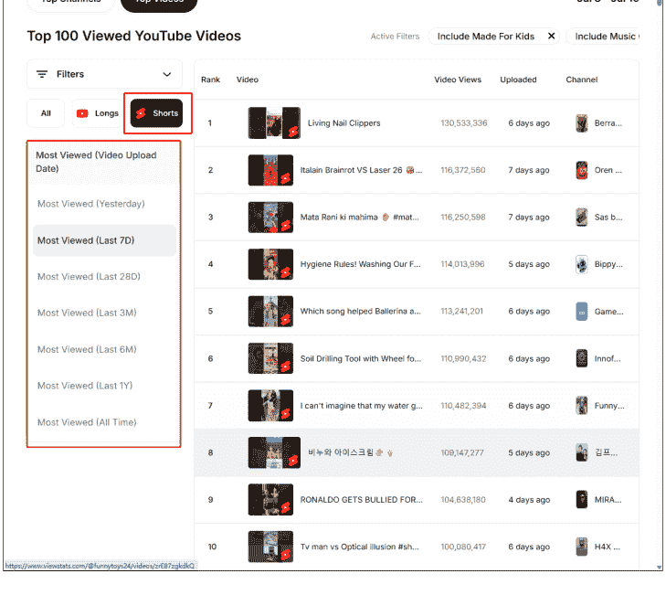

Filters 这里可以还可以选国家还有类型，你可以组合不同的国家和类型，然后再重新选昨天，近七天，近 28 天，近三个月等，你就可以挖出很多不同赛道的爆款视频。

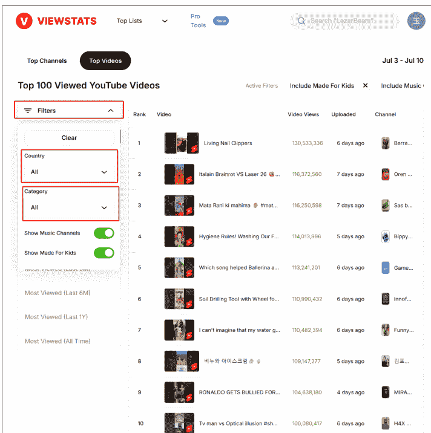

#### 例如美国+动物类型。

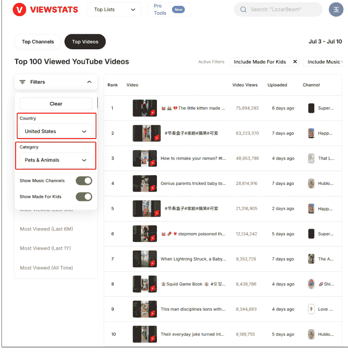

#### 关键词搜索

这个关键词不是视频的关键词，因为我们目前是在扩展宽度而不是深度，要做的是让自己看到足够的不同类型的赛道，而不是找某个赛道的一堆对标账号。这个关键词可以让 AI 帮你出，比如舞蹈，历史，音乐等等。可以先搞一堆一级词，然后看到有意思的可以组合二级词，慢慢缩小范围。

### 第二步：判断赛道是否还能做

经过上一步的收集，现在你手上应该挖掘到了一大堆不同赛道了。接下来要做的就是判断这个赛道，是否还能做。

先说一个认知 Shorts 赛道的内容都是有生命周期的。我感觉说赛道不合适，所以我说的是赛道的内容。

其实很多赛道都很长青，比如说我现在一直在做的故事赛道，有生命周期的其实是这个赛道的内容，也就是我们做的视频，这个周期不是说过了某个时间这个赛道就死了，再也做不了了。而是需要出现一个创新思路，来开始新的周期。至于为什么会有生命周期，我认为是供应饱和(做的人太多了，大家都在发)和用户审美疲劳(用户看的太多了，看腻了)的问题。这件事会明显的反馈在播放量上，如果你播放量一直是几万，那么很有可能就是这个内容已经饱和了，当然也不排除是你做的烂。

至于案例我推荐大家看下面这两个视频：
https://www.youtube.com/watch?v=LAn78RHRLYI
https://www.youtube.com/watch?v=4CH7SFCaejA

他用了一个账号的内容来说明举例，并且我当时用他的思路也分析一些账号，发现都是这样。

明白了这个点，我们就可以开始判断某个赛道是否还能做了。我自己的判断依据如下(参考航海手册中的思路)：

在这个赛道中，看到过的视频最高的播放量是多少？我的标准是最少不能低于一个亿，最好是能有两个亿以上。

发布时间越近越好，最少近一个月爆过上亿的视频。

近一个礼拜还有千万级别的出现，最好是有五千万以上的或者有4条以上的千万也行。

### 第三步：这个赛道我是否能做

筛选出还存活的赛道之后，就要思考这个赛道在技术上自己能不能做。

由于我目前就是用AI去制作视频，所以这个问题可以换个问法：我是否可以用AI复刻？

如果可以那我就做，如果不行那我就不做。

在做内容的时候要学会扬长避短，我举个例子，如果你的对标的账号是一个真人博主，但是你制作内容的工具是AI，那你就很难做到角色的动作能和真人一样流畅，如果你费劲心思去研究怎么用AI做到和真人一样动作流畅，就纯粹是在浪费时间，懒人微信：lazyhelper

因为别人拍摄的时候轻易就能做到的事情, 而你要花大把的时间。

可以思考一下 AI 的优势是什么? 它可以做出真人拍摄搞不出来, 或者很难搞出来的东西。

我以这个视频为例：
https://www.youtube.com/shorts/vQTwWTV86o0

主角每开一扇门, 后面就会出现一个东西, 可以看到, 他这个视频中, 门后面有马, 跑车之类的, 那如果我们用 AI 来复刻, 我们能不能让门后面出现异形怪物, UFO, 甚至他一开门, 后面就是一片星际战场等等, 当然我说的这些例子不一定是爆款, 重点是这个思路。

AI, 真人拍摄, 3D 建模, 甚至开放世界游戏等等, 这些都是表现形式, 但不是核心, 核心是它们要表达的内容。所以只要这个内容你能用 AI 复刻出来, 别管对方用什么做的, 你尽管去复刻去尝试。

### 第四步: 测试赛道

赛道判断完了, 现在就是要下场测试了。

一个赛道是不是真的能做, 不是靠看和想出来的, 而是你要真的去测试, 亲自下场才行。我自己的话一般是测一个礼拜, 如果不行就换。一个号可以测多个不同的赛道, 测完一个觉得不行, 换另外一个测就完事了。

测试是否可行还有一个前提: 你的内容得是没问题的, 怎么算没问题呢? 质量做到和你的对标一样，不然你无法判断是你的内容问题，还是赛道问题。

那怎么样算这个赛道能做呢，我的标准是能出百万播放。

### 第五步：如何把视频做爆

事实上不是你发现一个有流量的赛道，你去做你就一定能爆，其实大概率是爆不了的，接下来我要教你的就是如何在这个赛道做出你自己的第一个大爆款。

先说一下我对爆款的定义：爆指的是 100万以上播放，大爆指的是 1000 万以上播放。

就两个方法矩阵和微创，这两个方法不是互斥的，我非常建议你搭配使用。

下面我会先简单讲一下这两个方法怎么用，后面我会详细讲如何具体实践。

矩阵：我会告诉你制作脚本或者工作流提效的思路。

微创：我会告诉你怎么样正确的微创，如何提高你的视频成为爆款的概率。

#### 矩阵

矩阵的话，我建议你搞三个号，去测同一个赛道。

做 Shorts 爆款是有一定运气成分在的，所以你想要提高你成功的概率，你就得多发。

我之前有一个爆款脚本，发了 10 个号，结果只有一个号爆了千万，这还算运气好的，运气不好，那就是一个爆的都没有。

我当时制作矩阵视频的方法很简单，保留生图和图生视频的提示词，然后替换掉视频里面的主角就行了。但是2025年7月15日 Youtube 会出一个新规，开始打击AI制作的矩阵化垃圾内容，其实这个打击早就开始了，所以我现在也不确定这种方法还行不行，它规则的定义特别模糊，我正在观望中。

但是就算真的不行，也有解法。

另外我再给大家看一个我自己的视频案例，选择观看率81.4%，完播率也是100%以上，结果就跑了5W的播放，互动观看是2.6W。从数据上看这个视频是有大爆潜力的，结果就跑了5W，所以我说做爆款是由运气成分的。

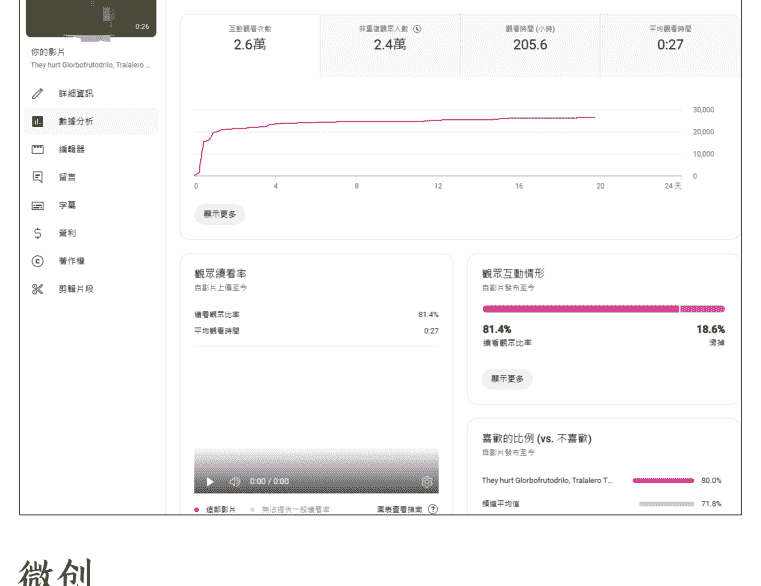

#### 微创

这个微创不是乱创，而是爆款元素的重组，是爆款+爆款的结果。

比如鱿鱼游戏在 Youtube 是一个爆款，AI山海经角色在 Youtube 是一个爆款，那么你就可以微创出 鱿鱼游戏 + AI山海经这个爆款。这个我自己是验证过的，我一个做动物故事赛道的老号，发的第一个鱿鱼游戏+AI山海经的视频直接爆了300W播放，此前我那个号就出过一次300W。


#### 如何正确的微创

首先由于我目前一直是在做故事赛道，所以我的例子会以故事赛道来举例，但是我相信多数的赛道逻辑是一样的。

之前我说了，微创就是爆款元素的重组，是爆款+爆款的结果。

那么我们就得在 Shorts 中去识别爆款，收集爆款，我当时也很苦恼这件事要怎么做，后来我想到了一个非常简单的方法。

我把爆款元素分为了爆款脚本和爆款IP，这两者可以单独存在，也可以组合出现，多数情况下是两者一起出现。

然后你还要明白，有些爆款是存在时效性的。

例如在今年4月初彻底爆火的AI山海经角色，这个就属于爆款IP，但是它明年很可能就不火了，别说明年，现在的流量就开始下滑了。

明白了这些之后，你就可以在看视频的时候，去收集这些元素了。

我举个例子：
https://www.youtube.com/shorts/Co7_pyl9I50，这条视频就是一个爆款剧情(嘲笑逆袭)+爆款IP(C罗+梅西)
https://www.youtube.com/shorts/BO-jbdT6wmo，这条视频是上面那条视频的微创，沿用了它的爆款剧情，但是把爆款IP换成拟人化猫猫，注意拟人化猫猫在Youtube 上是一个很爆的形象。

OK，那基于这一点，咱们是不是也可以换个爆款IP来做这个剧情，例如AI山海经角色，鱿鱼游戏角色等等

另外提醒一下，最好不要用C罗和梅西去做视频，很容易吃警告，已经有人吃了。

明白了这一点之后，你就可以去收集自己的爆款IP库和爆款脚本库，然后随意的组合微创出新的爆款了。

注意一定不要自己去原创IP，除非你已经赚到钱了，想打造一个IP尝试长久的变现，因为你原创的IP大概率是火不起来的，试错成本会很高。

举例完替换爆款IP进行微创的例子后，我再给大家举例一个爆款剧情重组的案例。

首先下面这个是原版视频（这个剧情有爆过上亿的，但是我找不到那个视频了，所以我放了一个剧情一样的）：
https://www.youtube.com/shorts/4KQ2vDTuYmg

下面这个是微创后的视频：
https://www.youtube.com/shorts/kjdph7YNhHw

如果你做的也是故事赛道，那么你肯定知道，嘲笑逆袭的剧情在 Youtube 上是非常火的，如果你不知道，那你可以看 https://www.youtube.com/@MysteriousKitenn/shorts，这个号的其他视频。

看了剧情后可以发现，微创后的视频只是借用了猫妈妈被剃头的这个爆款开头，后面衔接上了一个被嘲笑然后逆袭的故事。

### 同行是最好的老师

如何做爆款这件事，我就是从同行身上学到的，我之前一直都知道同行是最好的老师，但是如何像同行学习，我却是不太清楚，所以在这里，我给大家展示一下我像同行学习的思路。

其实这个思路在如何正确的微创的这一节中已经写出来了，发现同行通过换 IP 的形式爆了，那我们做的时候也可以换 IP，发现同行用爆款剧情重组后爆了，那我们也可以重组爆款剧情。

重点是你要看的够多，这样你才能知道这个同行，它是以哪个视频为基础改过来的。

比如剧情的反转就是一个很爆款的元素，那么具体怎么做呢？

下面有两个同行的案例

### AI 山海经剧情反转：
https://www.youtube.com/shorts/nTTDG_TkI-TI

### 耶稣反转：
https://www.youtube.com/shorts/6RmwT_WGb2rU

从这里面我就可以分析出一个反转模板，即开局做坏事，结果是好结局。那后面我看到某个爆款剧情，我就可以按照这个思路去改。

到这里整个做爆款的流程就结束了，接下来就是需要你亲自下场去实践和验证了。

### 如何设计出自己的提效流程

首先这件事一定是在你跑通了一个赛道后，再去做的事情，在没有跑通之前，你不要考虑这个问题，如果你觉得手搓太慢了，你可以直接找别人的脚本或工作流先用着。

像我目前的流程，也是确定了我制作素材的流程后，才搞出来的。

为什么这样说呢？其实脚本也好工作流也好，这些都不是重点，重点是你在做视频的过程中，你知道了你会经历哪些过程，你明确的知道你要什么。

只要你清晰的知道你要什么，脚本也好，工作流也好，你用 AI 自己开发也行，你找专业的人给你开发也行，这都是小事。

下面我给大家分享一下我自己整理出的工作流程的过程。用 AI 制作视频，要解决的问题主要是下面这些

- 文生图提示词
- 文生图
- 图生视频提示词
- 图生视频

我重点说一下文生图提示词和文生图，因为我目前只给这两个做了提效脚本，其他的我目前都是手搓的。

#### 文生图提示词

我通过和 Gemini 聊天设计出了一个文生图提示词的模板，我说的 Gemini 都是指 Google ai studio 中的 Gemini pro 模型。

当时的聊天记录我找不到了，大概的开头就是：“请你帮我设计一个 sora 出图提示词的模板”，但是光这一句肯定不行，还是那句话，你得自己知道你想要什么，然后和他交流，让它不断的修改。

我知道自己的角色都是用参考图，所以我不需要角色的任何外观描述，除了表情。并且我发现，我做的图片中，其实经常需要修改的也就是角色的表情，动作还有环境这几个元素，所以经过不断的和 gemini 交流以及测试优化，也就有了下面这个模板。

#### sora 文生图提示词模板

- [主体]
- 角色：
##### 表情:
##### 动作:
##### [环境]
##### [时间]
##### [天气]
##### [视角]
##### [景别]
##### [风格]

追求极致的超写实主义照片风格。画面呈现出高度的真实感,如同顶级数码单反相机(例如佳能EOS R5或索尼Alpha 1级别)搭配高质量定焦镜头(例如50mm f/1.2或85mm f/1.4)在专业布光或完美自然光条件下精心拍摄的照片。

##### [光照]

自然光照,柔和且均匀,微妙且真实的光影。

##### [色彩]

写实色调,自然色彩。逼真的色彩,准确的白平衡,避免偏黄色调。干净且平衡的色彩,不要过度饱和。

## 画质

画面高度细腻，细节极其丰富，达到照片级真实感。追求极致的清晰度和纹理表现，所有物体的材质质感都应逼真呈现。光影过渡自然平滑，色彩还原准确，无噪点，无失真，无数字感。8K 分辨率视觉效果。

风格、光照、色彩和画质这几个模组的内容是不用变的，它们控制了画风。

有了这个模板之后，再出图的过程中，我又发现一个问题，就是我经常需要修改某个分镜的画面内容，以及提示词出好后，我会手动调优一些地方。但是这些活在表格里干太麻烦了，一个是看起来不舒服，第二个是修改分镜画面的时候，我要看着图片去写，一边要打开文档，一边要打开图片，切换图片，太麻烦了。

我就在想，我能不能开发一个 Gemini 的插件来实现这一点，然后我就用 Cursor 做出了 Gemini 分镜提示词助手。至于为什么要做插件，答案就是为了白嫖，API 虽然有免费调用额度，但是很可能不够用，并且当时 Gemini PRO 也不支持免费调用了。

## 文生图

我自己一直是在做 AI 山海经的这个 IP，但是这个 IP 中的角色靠提示词很难画出来，所以要靠参考图。我测试了即梦和 Sora，发现只有 Sora 可以很好的做到这一点，那么我的出图工具就确定了，那就是 Sora。然后再用的过程中，我还发现这个方法的一个优点，那就是它能保证角色的一致性，所以后面我做其他视频的图片也都是用的 Sora 出图。

但是在使用 Sora 的过程中，我发现一个问题，那就是太慢了。当时我出图买的是共享号，一个号可以同时排两个队列，也就是一次可以出两个分镜的图片。我买了 2 个号一起出，一次可以出 4 个分镜的图片，但是它还是慢，因为 Sora 出图一般要等个 2-3 分钟最少，如果遇到了提示词违规或者效果不理想的情况，可能一个分镜的图片要做半个小时。

所以我就在想能不能通过 API 实现批量出图，这样至少可以节省多张图的出图等待时间。但是在开始之前，我需要算一笔账，就是用 API 出图的成本我是否能够接受。最开始找到的 API 平台是云雾 API，它的成本是 0.175 元一张图，我一个视频的分镜大概是 25 个左右，4 块钱左右一个视频，这个成本我当时也是可以接受的，于是也就有了我的 Sora 出图脚本。

目前这个脚本支持用书虫大佬的 API 了，2 分钱一张图，成本巨低。

## 图生视频提示词和图生视频

我目前是图生视频用的都是即梦，可以给大家分享我在使用即梦过程中发现的一些小技巧。

### 即梦图生视频提示词技巧

在提示词的结尾加上“视频画面连贯、流畅，符合现实运动规则，不要出现其他角色。”这句话，效果会好很多。

提示词里面可以加上执行动作的时间，例如前 3 秒干嘛，后 2 秒干嘛，这个可以解决生成视频的角色前几秒不动的问题。

### 即梦积分不够用怎么办

多用：一个即梦的账号积分初始是 66，如果你每天都用完，它是会给你提升到 100 分的，我已经有几个号，现在每天都是 100 积分了。

多号：抖音的老号可以直接辅助创建一个新号，不需要任何验证，也不需要手机号，这样一个抖音号可以搞两个即梦号。

进入抖音的切换账号页面：

#### 切换账号

大大
0粉丝

用户12583874477
0粉丝

用户13702720705
0粉丝

添加或注册新账号

点击添加新账号

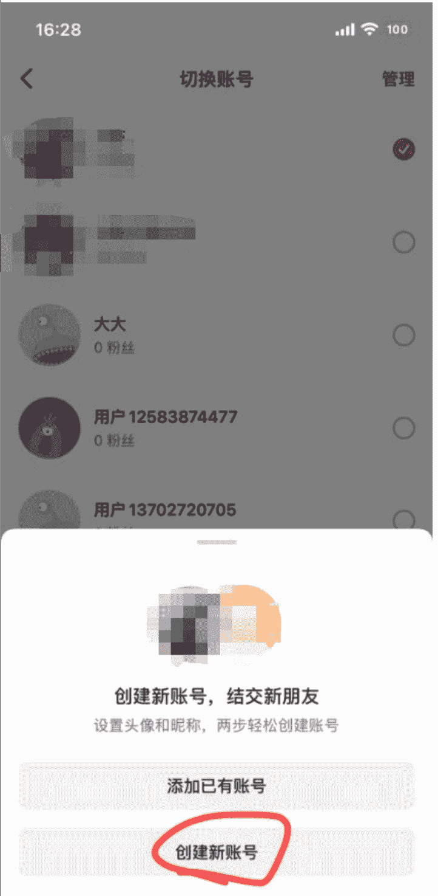

选择当前账号辅助创建就行了。

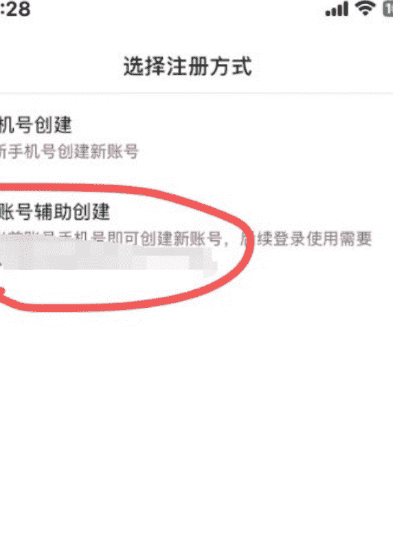

我非常建议在安卓手机上弄，因为新号在安卓手机是有1块钱买200积分活动的，苹果上是没有的。另外如果你的手机是第一次下载即梦，那么你可以自己邀请自己，也会送积分。

多个即梦账号可以使用指纹浏览器登录，这样就不用重复的扫码登录了，我推荐用下面这个指纹浏览器：

```
https://www.ixbrowser.com/code/BK85
```

（不是广告），这个指纹浏览器每天都可以创建10个新的窗口，并且他每天都有100次打开次数。

## 我目前的提效脚本分享

### Gemini 分镜提示词助手

插件安装包我放下面了，导入到 Chrome 就行了。

> 懒人微信：lazyhelper

使用这个脚本前要注意一点，由于我都是用 Sora 的参考图在控制角色，所以这个提示词分析出来的分镜提示词，并不会有角色的详细描述，而是用图一、图二代替。如果你有指定角色的名称，那么你可以填在自定义内容的说明框中，提示词我放在下面了，它会用名称来代替。

#### 角色名称替换提示词：

这次所有分镜里面有 X 个主角，注意我的角色名字描述，要一模一样：

- XXX 用：XXX
- XXX 用：XXX

#### 案例：

这次所有分镜里面有两个主角，注意我的角色名字描述，要一模一样：

- 猫爸爸用：Ballerina Cappuccina-7
- 小猫用：pup

下面我介绍一下这个插件怎么用。

先点击右下角的分镜。

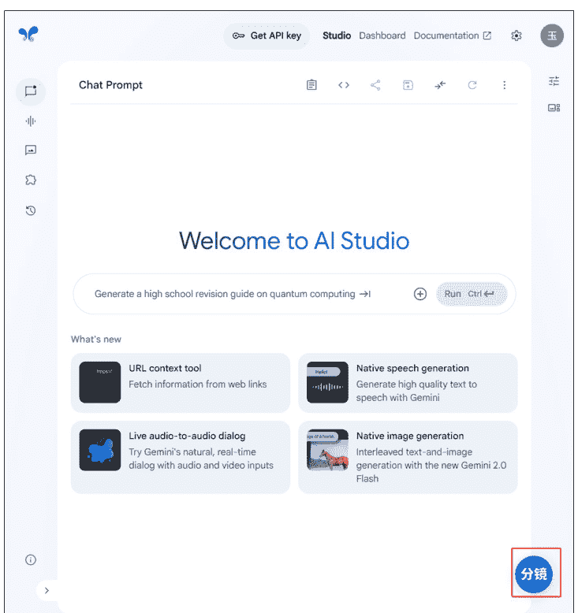

然后点击发送指令提示词，它就会发送我提前写好的分镜分析的指令给 GEMINI。

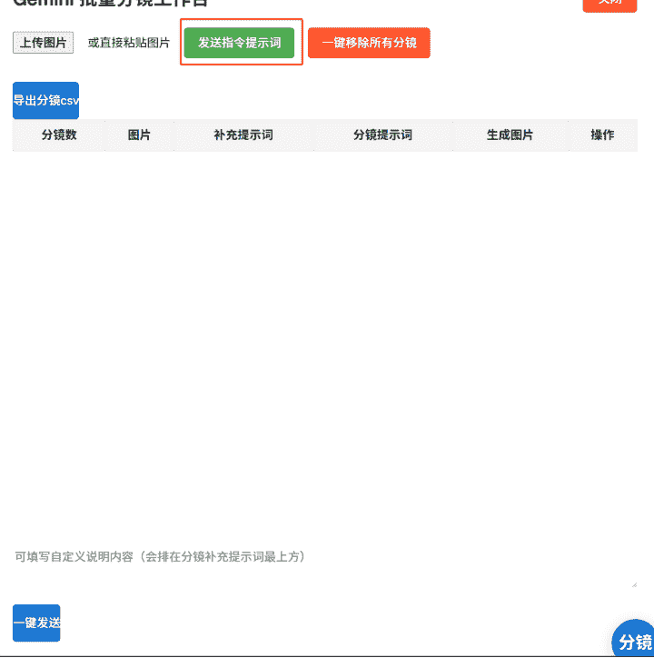

然后你就可以上传你要分析的图片了，可以点击上传图片，一键上传本地你要分析的所有图片。也可以直接复制粘贴图片，截图粘贴也行。但是注意当你已经粘贴了一个图片时，你要粘贴第二个图片，需要点击补充提示词的输入框，然后再粘贴。

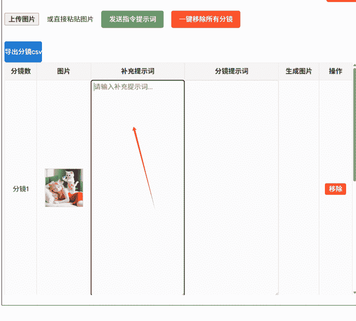

如果你想修改某个分镜的内容，你也可以直接在补充提示词里面写，例如下面这样：

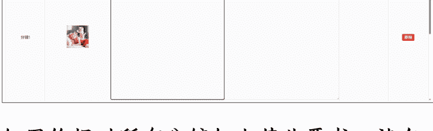

如果你想对所有分镜加上某些要求，就在最下面的输入框里面写。

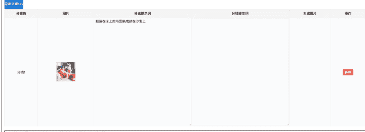

弄好之后，点击一键发送，然后点击右上角的关闭，等待 GEMINI 出完提示词。

> 懒人微信：lazyhelper

#### 提示词出来后，点击导入分镜到插件按钮。

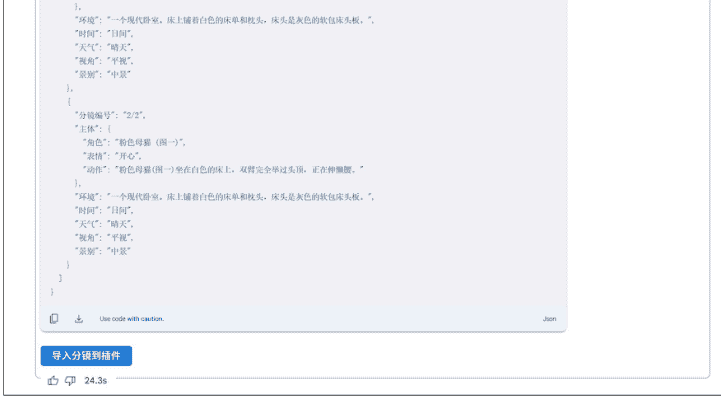

#### 提示词就被导入进来了，你可以直接在里面修改提示词部分内容。

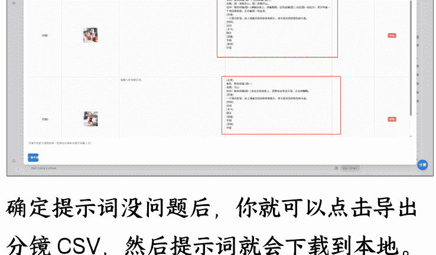

#### 确定提示词没问题后，你就可以点击导出分镜 CSV，然后提示词就会下载到本地。

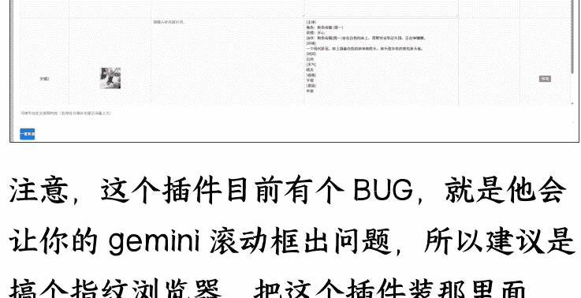

#### 注意，这个插件目前有个 BUG，就是他会让你的 Gemini 滚动框出问题，所以建议是搞个指纹浏览器，把这个插件装那里面。

## sora 出图脚本

这个脚本我之前有过分享，直接看这个链接就行： 。

Gemini 插件导出的 CSV 文件可以直接导入到这个脚本中。

## 最后

希望文章中的内容能对大家有所启发，也希望这篇文章做到了我开头说的，哪怕是刚做 YouTube 的小白，看了这篇文章也知道从哪里开始。

不过我这篇文章提供的更多的是思路，技能上的内容，例如剪辑、怎么样做的视频更好、怎么样做的图片更好，就需要自己去研究了。我也非常欢迎大家和我链接，交流，相互交流，相互成长。

最后，安利小懒的付费群：

## 懒人专属群


懒人专属群持续更新中，已持续运营 6 年，整理超 3000 份各类精选付费文章 & 年费社群干货，全部开放下载。

本资料为付费群内部分享，仅供真实有需要的朋友查阅 🙏

> 懒人微信：lazyhelper

## 懒人专属群更新记录：

https://lazy2025.top/#/blog/record2

## 懒人专属群更新记录（需梯子，备用）：

https://lazybook.fun/#/blog/record2