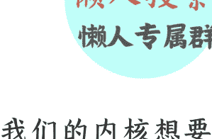
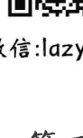
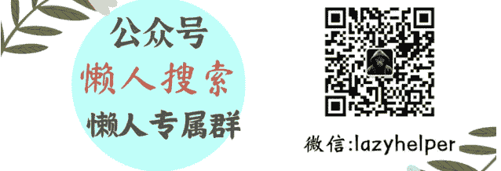

# 稳定内核四要素：情感

250714 《蔡钰 · 商业参考 4》节选

整理：公众号懒人搜索，懒人专属群独享

懒人微信：lazyhelper

微信:lazyhelper

我们的内核想要稳定，第三个要素是，要拥有稳定的、正向的情感。

我们的情感对象可以是人、组织，也可以是兴趣爱好和社会活动，它们都能帮我们跟更广阔的事物和人群建立情感，增加负熵来源。

在大原则上，我们既需要多多为自己建立情感输入回路，确保自己能从周围获得足够的理解、安全感与共鸣；我们也需要多多搭建情感输出回路，让他人感受到我们的关怀、支持与温度，形成互惠的关系网。

但在内心深处，我们对不同情感关系是有亲疏之分的。我们只要问问自己，哪些情感关系的存在，会让我们感到安心、愿意牺牲利益去捍卫，通常就能找到自己的情感内核。

如何稳住情感内核？从最小系统观出发，有几个原则值得用作自我提醒。

## 情感系统的嵌套

第一，我们与情感对象的关系往往是复合的，情感只是关系系统当中的一个子系统，它跟别的子系统互相嵌套、互相作用。这意味着，别的子系统变化也会影响情感系统的稳态。

拿最常见的家庭关系举例子。王富贵和王娘子因爱成婚，组成了家庭。那么，王家系统里至少包含一个情感子系统和一个事业子系统。

情感系统的目标可能是“永结同心”，运行的是双方的向往、信赖和守护；而事业系统的目标应该更明确，比如降低双方的生活成本，推动家庭生活水平蒸蒸日上，或者托举儿子王元宝实现阶层跃迁，等等。

如果王富贵只在情感系统里当情圣，但在事业系统里贡献不足，收入有限、家务看不见、养孩子也缺位，那久而久之，他在事业系统里制造的负外部性，也会动摇王娘子的信任和归属感，冲击情感系统。

当然，双方关系是对等的，换过来也是一样。

类似的逻辑，也可以用来梳理商业品牌与用户之间的关系。我们去分拆任意一个关系系统时，也可以参照内核系统的四大核心要素，把它分拆成功能、利益、情感、信念四个核心子系统。刚才讲到的王家事业系统，其实是把家庭的机能、利益、信念都整合在一起了。

在品牌与用户的关系系统里，双方关系就不那么对等了，四个子系统分别对应什么内涵呢？

品牌通过产品与服务，向用户提供需求满足的基本能力，可以看作关系中的机能子系统。

用户在品牌关系中消费，为品牌承担“财务供养者”的角色，可以看作利益子系统。

用户对品牌的喜欢、偏爱，当然就是情感子系统。

品牌所建构起来的价值观与世界观，比如环保、极致创新、消费平权等等，是信念子系统。

我们在《情绪价值30讲》里讨论过耐克的经典案例。耐克的用户关系系统，是以信念为核心。它把自己打造成体育精神的狂热信徒，用户们因为认同这种信念，也愿意跟它建构利益和情感关系、把它的logo穿在身上。但如果耐克的体育精神信念弱化，又没有坚固的情感系统来维系用户，用户可能就会“下头”，转投别的信念系统，也就会动摇耐克的利益。

耐克自己有没有强势的情感系统呢？也有，在职业运动员人群当中。它在很多顶级运动员还籍籍无名时，就坚定支持对方的生活和训练，建立了深厚的情感关系，这导致它这几年遇到某些舆论危机的时候，有些运动员哪怕跟它信念不合，也不愿意站出来背刺它。这是情感系统在危机时刻，起到了黏合与缓冲的作用。

类似的，小米 SU7 Ultra 遭遇舆论危机的时候，靠雷军情感系统维系起来的米粉当中，相当一部分仍然选择支持小米。

这两个案例给我们的教训都是：信念能赋予品牌独特定位，而情感则是信念动摇时的“安全阀”，能够暂时稳住用户；但任何一个子系统的长期掉队，都会动摇大系统的稳定状态。

## 明确使命与角色

顺着这个逻辑，我们的第二个提醒也就出来了：为了维持稳态，我们在内核级别的情感关系里，应当梳理清楚各个子系统的目标、明确成员们在各个子系统内的角色和使命，并且跟对方达成共识。

这能帮我们稳定情感内核。

还拿王家举例子。如果王家最关键的两个子系统分别是情感系统和事业系统，那么，王富贵想要稳住情感内核，就需要跟王娘子去商量确认，谁养家、谁管家、谁负责跟学校联系、年内谁应该安排两次家庭出游，怎么认可与感谢完成了使命的成员……

孩子王元宝，可能当下没法给家庭带来利益增量，也承担不了家务机能，但他可能是家庭当中最关键的信息和情感源头，是王富贵和王娘子的奋斗动力所在，他代表了系统的“长期正确”，这个概念我们后面会专门解释。

这些课题放在公司里，都是最基础的对齐行动，但放在情感关系里往往会被遮蔽。我们在第三季说“把自己当作公司”，内核其实就是我们休戚与共的主场、我们的公司生态，我们必须像操心公司一样操心整个内核系统，也操心系统里的其他成员。

退一万步说，即便我们跟情感对象实在难以启齿，那么，也可以把对方当作一把吉他、一项运动，或者一群消费者。单方面把问题在心里过一遍，明确自己对这项“爱好”的目标是什么，愿意付出什么努力，最大能承受怎样的打击，要不要设计止损线，比如“练一个暑假的篮球还不能 10 投 9 中，就再也不打了”。

这个过程，我们其实就是在给自己画预期图景，这能在我们情感受挫时，成为缓冲垫，稳住我们的内核。

4 月份以来，胖东来遭受了好几个网红的恶意中伤。虽然它随后都证明了自己的清白，但创始人于东来好几次发表了情绪化的公开言论，流露出要关掉胖东来，或离开胖东来的意图。于东来，可能也需要类似的情感缓冲垫，来冲抵他面对复杂人群时受到的心理伤害。懒人微信：lazyhelper

## 耗散结构

第三个提醒，仍然从最小系统观出发：对内核级别的情感关系，我们要有意识地给它搭建耗散结构，来保证情感的生命力。

在这里，亲密关系仍然是一个好例子。恋人们在亲密关系里经常会出现两种相处思路——

第一种是“咱俩互相是对方的全世界，你的注意力只能放在我身上”，听上去很美好，但这是种封闭的关系系统，俩人自带的信息和能量资源很容易耗尽，陷入所谓的“新鲜感困境”。

但由于情感系统嵌套着其他系统，所以有时两人感情转淡却难以分开，外人往往以为情感基础仍在，而当事人通常是在顾虑生活秩序的坍塌。

另一种思路是“咱俩一致向外，各自拓展新世界并保持共享，不断为共同系统注入新的能量与信息”。这种思路显然更容易维系关系，让情感历久弥新。

在商业领域，消费品牌们也很困扰用户们的喜新厌旧，而这恰恰是耗散结构理论在起作用：一个品牌借助单一事件成为网红，确实能吸引来客流，但用户跟品牌之间的情感关系只能封闭对流，消耗完就结束了。

今天我们看见一些长红的 IP，比如《盗墓笔记》，明明已经完结多年，却还有强悍的粉丝和生命力。这背后，粉丝们不断自制的二创作品，也是维持情感关系存续的增量。今天你再去 B 站打开 40 年前的《西游记》，仍然能看出新意、看出共情，这是因为弹幕是当下的，年轻的弹幕在不断为老作品注入生命力。

过去三五年，乳制品品牌伊利在文娱行业里拥有了特别称号，叫“综艺界的救世主”，原因是，它几乎每年都是国内综艺市场上的头号赞助商，2020 年赞助了超过 20 档综艺，2021 年大概 20 档，2022 年上半年就超过了 15 档，为各路综艺的制作和播出提供了强大的资金保障。它赞助的综艺类型也非常丰富，恋爱、音乐、舞蹈、推理、旅行等有什么题材都有。跟伊利思路类似的，还有它的竞争对手蒙牛，和手机行业的 vivo 和 OPPO。

为什么伊利们热衷于赞助综艺节目？它们也是为了增加用户关系里的“耗散机能”。它们自己虽然不善于直接整活儿，但通过站到年轻人关心的时尚、潮流内容旁边，能够借助热门综艺的信息和情感增量，来不断刷新自己跟用户的关系系统。

# 总结

这一讲我们讨论的是，想要让我们内核系统里的情感要素维持在稳态，需要注意三个问题：

- 第一，情感系统与其他系统互相嵌套，会受到其他系统的影响；
- 第二，跟情感对象在各自的目标和使命上达成共识，有助于稳定情感；
- 第三，情感系统也要保持开放，保持能量和信息的流动。

能被我们装进内核的情感关系，可能不止一种。我们可能同时爱篮球、爱家人、爱事业、爱祖国。所以我们还要稍微做一下分类，问自己，哪些关系里，我得到了情感盈余？哪些关系里，我得到了情感赤字？

问这个问题，不是要让你扔掉那些赤字类的情感关系。更值得我们追问的是，我们愿意承担这些情感赤字的背后动力是什么？答案可能指向利益，指向系统机能，更可能指向信念。

下一讲，我们来讨论内核系统的第四个核心要素，也是最有意思的要素，信念。

拜了个拜。

最后，安利小懒的付费群：

- 懒人专属群

懒人专属群持续更新中，已持续运营6年，整理超3000份各类精选付费文章&年费社群干货，全部开放下载。

本资料为付费群内部分享，仅供真实有需要的朋友查阅

懒人专属群更新记录：
https://lazy2025.top/#/blog/record2

懒人专属群更新记录（需梯子，备用）：
https://lazybook.fun/#/blog/record2