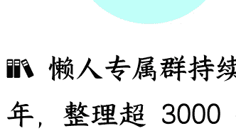

# 特朗普又打关税战，与之前有何不同？

250714 文/卢克文工作室嘉宾 Hex

整理：公众号懒人搜索，懒人专属群独享

懒人微信：lazyhelper

7月9日，特朗普又出招了。他通过社交媒体发布了第二批关税信，宣布对8个国家征收20%到50%的关税。

其中，巴西：50%（从4月2日的10%提高到50%，是本轮最狠的出手）；菲律宾：20%；文莱、摩尔多瓦：25%；阿尔及利亚、伊拉克、利比亚、斯里兰卡：30%。

接下来咱们就看看，特朗普又在搞什么幺蛾子。

特朗普针对巴西下狠手，理由是巴西正在审判前总统博索纳罗，指控他发动政变，试图阻止卢拉在2023年1月就职，就像民主党想要起诉他与“国会山事件”有关一样，是一场彻头彻尾的政治迫害！

然而，博索纳罗可是在2022年10月竞选失利后，煽动支持者冲击了国会、总统府和联邦最高法院，还在2025年6月的审判中承认了部分指控。

当然，他否认 2022 年大选失利后企图推动军事干预以推翻选举结果，但承认参与了旨在逆转选举结果的会议等等。

但特朗普非要认为博索纳罗遭遇了不公，试图用美国的关税政策干涉巴西的司法程序和内政。

特朗普在 Truth Social 写道：“唯一应该进行的审判是巴西选民的审判——就是那场选举。别碰博索纳罗！”
问题是，那场选举也是卢拉赢了……这很没有逻辑，反倒很有特朗普的无厘头特色风格。

其实对巴西，特朗普更讨厌其刚刚在里约热内卢举办了金砖国家峰会。

在他眼里，金砖国家峰会不是讨论去美元化，就是讨论金砖货币，分明就是反美大会。他此前曾发出威胁，要对所有与金砖国家“反美政策”保持一致的国家，额外征收 10% 的关税。

巴西总统卢拉则回应说，“世界已经变了。我们不需要皇帝。”
“世界必须找到一种方式，使我们的贸易关系不必非要通过美元来进行……”

特朗普这人睚眦必报，受不了别人批评，一定找机会骂回去！

因此，特朗普才要用加关税的方法，给巴西总统点颜色瞧瞧，以证明自己的“皇帝权威”。

但问题是，在双边贸易方面，巴西并不怕美国，因为美国才是顺差国，去年顺差达到 68 亿美元，过去 15 年顺差了 4100 多亿美元。

所以，巴西总统卢拉很快强硬回击，表示巴西将对美国政府向巴西输美产品加征关税的做法作出“对等回应”。

他在回应中强调，巴西是一个司法独立的主权国家，绝不接受任何形式的外国干涉。

卢拉对特朗普发起的关税战早有准备。2023 年 4 月，卢拉就开始推进《经济对等法案》的立法。该法案授权巴西政府在本国贸易利益受损时，可以立刻采取反制措施，无需经过参议院全体会议表决，直接提交给众议院审议。

原本吧，巴西议会斗争激烈，《经济对等法案》一度进展缓慢。但特朗普上台后，一切发生了改变。

2025 年 2 月 10 日，特朗普政府宣布对所有进口至美国的钢铁和铝产品征收 25%的关税，并在 3 月 12 日实行。

美国是巴西钢铝产品的主要出口市场。2024 年，巴西向美国出口了价值 57 亿美元的钢铁和铁矿石等产品，以及价值 2.67 亿美元的铝制品。

此举严重损害了巴西的利益，巴西急需能够威慑美国的法律武器。于是，4月1日，巴西参议院经济事务委员会全票通过《经济对等法案》，几乎与特朗普宣布征收“对等关税”同时，交给卢拉签字生效。

不过，巴西只是在所谓对等关税中 10%税率的最低档，而且特朗普很快暂停了关税政策，所以巴西就一直没有动用这张王牌。

如果这次美国真的对巴西进口产品实行 50%的关税，那巴西也会动用现成的法律武器予以对等反制。反正巴西并不怕买不到什么工业品，比如机械设备、电子设备、汽车和零部件。

正好有一个东方大国能够提供。

## 2

特朗普是在 7 月 7 日发出的第一批关税信。他在信中宣布，将从 8 月 1 日起对日本、韩国等 14 个国家的进口产品分别征收 25%至 40%不等的关税。

除了巴西，两批关税信的内容基本相同，都是标准的“恐吓信”。

首先，除了对方国家的名称，对方国家元首的名字和税率不同之外，几乎完全相同，敷衍和傲慢的感觉拉满，甚至弄错了波黑主席团轮值主席热莉卡·茨维亚诺维奇的性别，将一位女士当成了先生。

其次，前半部分是谈了两句贸易不平衡，所以美国要给你加关税。“请你理解，（关税税率）这一数字远远低于消除我们与贵国之间贸易逆差所需的水平。”

除此之外，后半部分全都是威胁——你要敢反抗，那就不要怪山姆大叔下手太狠！

“任何试图通过第三国转运来规避该关税的做法，也将被征以更高的关税。若你国决定提高对美关税，则美国将在现有税率基础上追加同等幅度关税。”

税率变动非常儿戏，4月2日时装模作样地公布了一个公式，说经过精心的计算，将对美出口除以对美进口，再打5折，就是所谓对等关税。这次连解释都不解释了。

当然也不可能解释清楚，毕竟全看特朗普心情。

有人说，税率反映了双边贸易关税谈判的结果，那柬埔寨已经在7月5日宣布跟美国达成协议，特朗普还要威胁给柬埔寨加36%的高额关税，就显得十分搞笑。

如果36%关税，就是柬埔寨和美国达成的关税谈判结果，那就有种小国任美国宰割的屈辱和悲凉了。柬埔寨是一个穷国，全靠出口赚取外汇，2024年向美国出口了99.2亿美元的商品，只进口了2.6亿美元，不是不想买美国货，而是真的买不起。

说这些信像是恐吓信，最后也是最重要的一点原因，就是特朗普延后了高额关税实行的时间，只是威胁这些国家在跟美国谈判时妥协，而不是宣布执行惩罚性关税。

这是一种谈判策略。

特朗普通过强硬的表态，将其包装为“胜利”的一种，成为“皇帝权力”的展示，换取粉丝的开心。

据媒体报道，特朗普原本倾向于让关税自动生效，但在听到贝森特表示一些协议接近达成但需要更多时间后，才改变了想法。

贝森特指的是美国与欧盟、印度贸易谈判。

特朗普显然要玩杀鸡儆猴的把戏。

虽然特朗普表示，8月1日是新的对等关税最后期限，不会再次推迟这个实行该关税的最后期限——“他们将于8月1日开始支付关税。不管发生什么，这笔钱都会在8月1日开始进入美国”。

但很多人依旧将特朗普的这次延期解读为又一次TACO。

特朗普又退缩了——只要谈判对手能够顶住明暗压力，不作出妥协退让，特朗普又不肯在最后期限到来时接受掀桌子的损失，就会在最后时刻找借口延期。

就像特朗普已经三次延长对 TikTok 的“不卖就禁”法案执行宽限期。

而且，特朗普也已经是第三次拖延收关税了。

俗话说得好，逢三必变。

这次特朗普发通知信并设定的最后期限的背景，与 4 月 2 日有巨大不同。

特朗普已经完成了最重要的内政任务：

通过大而美法案，一次性完成了多方面的政策制定，提高了美国政府的债务上限，缩减了福利支出，通过减税拉拢到了大批富豪，并与军工军队、传统能源等大资本集团达成妥协，在美国国内形成了合力，短期内不需要投入大量资源和精力在国内事务上。

让美国最高法通过了一项裁决，限制了联邦法官颁布全国性禁令以阻止总统推行行政命令的权力。这让特朗普彻底摆脱了民主党最后的司法制衡手段。

这让特朗普得到了“解放”，重新将征收关税作为工作重点——为美国政府赚钱，弥补大而美法案带来的大笔政府赤字。

从关税信里满是语法错误来看，这封信很可能是特朗普在百忙之中亲自起草的，也就是说特朗普现在是美国关税政策的决定者。

这标志着特朗普又插手了已经交给贝森特的工作。

特朗普分批发信，也许只是因为他没有时间，也没有足够的精力一次发太多。

他完全不在乎那些无法在经济上真正反制美国的国家。

前面提到，他连波黑领导人是男的，还是女的，都懒得了解。

7月9日，他在会见五位非洲国家领导人时，连对方的话都不想听。

当毛里塔尼亚总统开始描述他们国家的战略位置和投资机会时，特朗普开始变得不耐烦。他做了一个催进度的手势，然后摇了摇头说，“我不想在这件事上花太多时间”，“也许我们得快一点，因为后面还有满满的行程安排”“如果各位能只告诉我你的名字和国家，那就太好了”。

市侩到极致，这就是特朗普的风格。

这些国家被他挑出来，就只有两种可能，要么有美国驻军，不管怎么闹，最后一定会低头认怂，要么无法有效反制美国，会被毫不犹豫地杀鸡儆猴（征收关税）。

特朗普发动关税战的真正目的就是收关税，而不是所谓的平衡贸易或拉动美国制造业，那不是一年两年就能改变的，只有收钱填补政府赤字是特朗普能够拿到的短期结果。

欧洲和印度，也许还有中国，这次是“杀鸡儆猴”中的猴，将在一边观看美国如何“完虐对手”，将某些国家打得投降认输。

所以，这次特朗普订立的8月1日最后期限，有很大概率不会继续延期，而是选择部分或是全部没有谈妥的国家收取关税。

与此同时，特朗普还表示要对铜和医药收取关税。这是特朗普对关税收入预估不足的解决办法，也是特朗普在金融市场牟利的方式之一。

以现在的关税谈判情况，尤其是被中国教育后，美国的关税收入肯定不及预期。

即便不及预期，2025年前七个月，特朗普已经收了超过1000亿美元的关税。

美国财长贝森特在白宫会议上预测，8月1日的关税政策生效后，到今年年底，这一数字将超过3000亿美元。

他敢公开做这样的预测，意味着美国下半年的关税KPI翻倍!

想要得到3000亿美元关税收入，美国就有很大概率会在8月1日对一些国家下狠手收取超高的关税。

甚至为了完成关税KPI，特朗普会再扩大关税战的规模。

虽然特朗普和贝森特声称，加关税不仅能增加财政收入，还能刺激国内生产，保护战略性产业，减少对竞争对手的依赖，缓解减税政策带来的财政压力。

但实际上，美国关税的增收，意味着进口商品成本的增加，导致消费品价格上涨，还会让依靠全球化产业链的企业痛不欲生，削弱企业利润空间和投资意愿，最终会刺激通货膨胀。

特朗普不怕通胀。

一方面，他现在拿到了极大的权力，自认为可以在形势失控之前，下令撤销部分行政令；另一方面，在降息的同时加快速通胀，就是变相赖账，能够减轻美国的债务压力。

特朗普当然知道通胀会让底层民众的生活进一步困难，尤其是在他刚通过大而美法案砍掉部分福利的情况下，但他不在乎。

因为美国没有出过陈胜吴广，只有轻易被镇压的谢斯起义，人民的力量从来没被正视过。

他以为自己手握 MAGA 粉丝就能高枕无忧，他不知道水能载舟亦能覆舟。

所以，我们将在短期内看到一片混乱！

特朗普用第二轮关税战扰乱全球经济！

但混乱也不是绝对的负面消息。

长远来看，美国的高关税政策将迫使全球大市场重新整合，并将美国排除在外；美元霸权也将随着美国被孤立，逐渐走下神坛；美债不再是避险天堂，国际支付体系也将多元化。

美国也不想霸权褪色，但意外总会发生。特朗普试图改变一切，但一切似乎又没有改变。

他不可能 Make America Great Again，收多少关税也不行。

最后，安利小懒的付费群：

懒人专属群

微信:lazyhelper

懒人专属群持续更新中，已持续运营 6 年，整理超 3000 份各类精选付费文章 & 年费社群干货，全部开放下载。

本资料为付费群内部分享，仅供真实有需要的朋友查阅

懒人专属群更新记录：

https://lazy2025.top/#/blog/record2

懒人专属群更新记录（需梯子，备用）：

https://lazybook.fun/#/blog/record2