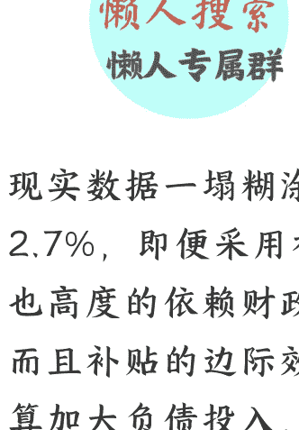
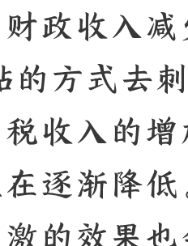

## 切忌冲动，尽量保持谨慎！

250714 守夜人总司令
整理：公众号懒人搜索，懒人专属群独享
懒人微信：lazyhelper

现实数据一塌糊涂，财政收入减少了2.7%，即便采用补贴的方式去刺激，也高度的依赖财政，税收收入的增加，而且补贴的边际效益在逐渐降低。就算加大负债投入，刺激的效果也会逐渐弱化，规模以上工业的销售额在增加，但利润在减少，这意味着大家感受到了未来的寒气，供应链体系中的各环节都在加大去库存回笼资金。

在企业收入降低的过程中，以国企为代表的社会基础服务垄断型企业下滑的最明显。这意味着什么呢？意味着去年推行的CPI涨价让价格传导到末端去激活经济的策略，没有达到预期，目前CPI是下降的！这一点大家应该从日常生活中的成本降低可以看出来。所有的工业品都在打折出售，所以官方才出台政策不许内卷，要涨价不许降价，这种号召与现实生存处境比起来，整个经济体系中各环节会根据自己的状况作出决策，并不是说你发一个公告就可以改变。发公告的目的只是为了延缓进度并不改变趋势，因为经济行为有其自身的规律和逻辑，只要你不掏钱去填他的亏损窟窿，所有干预手段的最终作用都非常有限。

无法避免那些为社会经济提供基础服务的垄断性国企未来收益的大幅下降，这种性质的企业，规模非常大。在需求水涨船高的阶段，日进斗金坐地收钱，正因为规模非常大，但需求大幅萎缩的时候，亏损的规模也与之成正比，甚至调整都来不及。就拿与基础建筑有关的企业来说，上半年的收入率减少了48%以上，因为没有工程可做，不管你内部如何调整都弥补不上这么大的亏损，所以，很多设计院开始由事业单位转为企业，许多原有的体制单位开始转为事业单位，就是为了压缩成本，甩包袱。

我有一个初步的判断：官方会试图想办法让那些在国民经济中占据核心位置的上市企业搞一笔钱。然而，一个存在明显问题的局，很容易搞不好就被埋掉，因为，市场是互通的，外面的鳄鱼也要吃肉，而且这个是有先例的，到时候恐慌起来是撑不住的。因为确实存在问题，那些报告一旦发出去，各大企业面对现实数据是圆不回去的！

最后，安利小懒的付费群：
懒人专属群 懒人微信：lazyhelper

微信:lazyhelper
懒人专属群持续更新中，已持续运营 6 年，整理超 3000 份各类精选付费文章 & 年费社群干货，全部开放下载。

本资料为付费群内部分享，仅供真实有需要的朋友查阅 🙇‍

懒人专属群更新记录：
- https://lazy2025.top/#/blog/record2
懒人专属群更新记录（需梯子，备用）：
- https://lazybook.fun/#/blog/record2