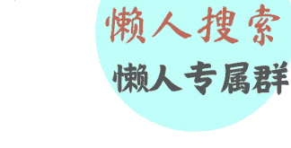
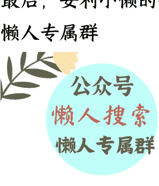

# 如何看待美企绕过禁令，偷拿中国关键矿物？

250715 文/卢克文工作室嘉宾 老纪扶犁

整理：公众号懒人搜索，懒人专属群独享

懒人微信：lazyhelper



微信:lazyhelper

7 月 9 日，路透社披露，美国企业通过第三国转运的方式，绕过中方管制，偷偷拿到了战略资源锑。

报道援引的美国海关数据显示，2024 年 12 月至 2025 年 4 月，美国从泰国和墨西哥进口了 3834 吨锑氧化物。而中国海关也记录，自禁止向美国出口锑以来，泰国和墨西哥已经跃升为中国锑的前三大出口市场。

很明显，有大量中国锑经泰国和墨西哥“洗澡”后，源源不断地涌入美国。

自美国发动芯片战、贸易战和关税战以来，限制稀土和关键矿产出口，已经是咱们的重要反制手段，而这些内外勾结的规避操作，不仅削弱了反制效果，更可能导致前期努力功亏一篑。

那么，美企能绕过禁令，偷拿中国关键矿物的根源在哪里？该如何看待？

## 壹

首先，咱们扒一扒路透社到底讲了些什么。

原文很长，咱们归纳一下，有四点。

- 其一，自中国禁止向美国出口锑以来，美国开始大量从泰国和墨西哥进口锑，其实这两个国家并没有大规模生产锑的能力，但在5个月时间里，美国就进口了三年的量。同时，两家美国企业高管还称，他们还进口到了镓。
- 其二，详细介绍了中国锑“洗澡”全流程，中国锑先出口至泰国或墨西哥，经简单包装后重新贴标为“泰国制造”或“墨西哥制造”，并谎报为“铁”“锌”“艺术品”或“医疗器械”等普通货物，再转运至美国。为避免审查，大批量货物拆分为小批量运输（如镓分批次伪装成“电子元件”），甚至通过越南、香港等亚洲地区二次转运，进一步模糊来源。
- 其三，中资企业深度参与，广西日星金属化工通过其泰国子公司 Unipet 工业公司，半年内向美国出口 3,366 吨锑产品。而 Unipet 的买家是得克萨斯州 Youngsun & Essen 公司（日星化工与美国 Essen 公司的合资企业），相当于全程自己卖给自己，“在规避监管方面极具创造力”。
- 其四，禁令让稀土和关键矿产价格上涨很大，但整体保持乐观，中美谈判出现缓和，有助于价格回落。

一句话，路透社像个卧底，曝光了卖家、买家和中间商，揭露了交易过程，明显是一副讨打的样子。

其次，这起事件，毫无疑问是真实的。

这种通过第三国转运规避贸易管制的行为，是国际贸易中常见的灰色操作模式。更关键的是，此类案例并非孤例，而是系统性存在，在国际贸易中，某些国家和企业非常善于破坏规则。

比如，印度。

俄乌冲突爆发以来，趁着西方制裁俄罗斯，印度大量进口石油，然后转手卖给欧洲，数钱数到手抽筋。

这个德性在稀土上一样也有展现。

印度汽车零部件巨头 SonaComstar，长期为特斯拉提供速齿轮、刹车部件、电动座椅等关键组件，在 2024-2025 财年，该公司从中国进口了约 120 吨稀土永磁体，并计划 2025 年再进口 200 吨。

不过去年的禁售令，让印度嗅到了商机。

Sona Comstar 向中国提交 30 份伪造的《最终用途承诺书》，声称稀土“仅用于印度本土电动车”，结果却将其中 35%加价转卖给美国雷神和洛克希德·马丁公司，用于导弹元件和无人机发动机，其余倒卖给国内军用无人机厂商。

咱们通过嵌入稀土的电子标签和光谱分析，发现货物在孟买港滞留，转运至马来西亚、越南，最终流向欧美军工产业链后，立即撤销 Sona Comstar 的出口许可，冻结其在华资产，并将其列入“不可靠实体清单”，永久禁止稀土进口，后续 200 吨订单也被取消。

这让莫老仙很着急，提出了“国家关键矿产使命”计划，不过现在印度汽车工厂即将陷入停产，他更希望咱们能够高抬贵手。

除了印度，还有韩国和越南，依靠地理位置优势，也当“中转站”，曾被逮过“现形”。

7 月 10 日，商务部发布声明，明确表示将加强对稀土等关键矿产的出口监管，并特别提到将打击通过第三国转运稀土的行为。

这也算是对此事真实性的印证。

## 贰

最后，分析一下能够绕过禁令的根源在哪里。

根源在于两点：

- 其一，美国对中国关键矿物的刚性需求。

美国军工和高科技产业对锑、镓、稀土等关键矿物有着不可替代的依赖。以锑为例，它是国防工业中制造弹药、夜视设备、激光器等不可或缺的材料；镓则是半导体工业和 5G 通信的关键元素；稀土更是从精确制导武器到电动汽车的核心材料。

尽管美国一直试图建立自己的关键矿物供应链，但在短期内无法摆脱对中国的依赖。其国内的矿产开发受环保法规限制，冶炼分离技术落后，人力成本高昂，导致无法在短期内建立可行的替代方案。

这种刚性需求，迫使美国企业不惜通过灰色渠道获取中国资源。

- 其二，除有愿意挣差价的中介外，国内铤而走险的内鬼也不少。

泰国、墨西哥、印度等国家愿意充当“洗澡国”，深层原因在于巨大的经济利益，仅通过转运和重新包装，就能获取 50%的差价，某些高端稀土材料的差价甚至高达 200%。

此外，帮助美国获取关键资源，拍这个马屁，可以换取美国在其他领域的支持或优惠。

当然，国外的灰色链条，必定得有国内内鬼支持，广西日星金属化工就是例子。

5月9日起，商务部、公安部、国安部、海关总署等七大部门联合开展打击稀土等战略矿产走私专项行动。

5月13日，内蒙古、江西、湖南等七大稀土主产省联合管控，覆盖开采、冶炼、运输、出口全流程。

5月16日，中央纪委国家监委通报，原广西自治区主席蓝天立因涉嫌严重违纪违法接受审查调查。

路透社敢于披露这条走私渠道，并且事件止于4月份，就是因为5月份后“洗澡”难度极大，走私渠道基本被掐断。

说实话，美国是这个星球上横着走惯了的，从来只有制裁别人，逼得伊朗、朝鲜偷偷摸摸搞走私，而今变成美国偷偷走私关键矿产，有点戏剧性。

那么，怎么看这事呢？

- 第一，反制让美国真疼了。

这种疼痛，不仅仅是采购成本的增加，更是美国对供应链产生了强烈无助感。

要理解这点，得先知道稀土和稀有金属的核心作用。

现在科普的很多，大家通常从提炼技术、储存量等方面，认为咱们能够卡美国脖子。

其实，不是这样。

稀土和稀有金属是两类东西，都非常重要，现代高科技基本离不开，但需求量都不大，就像炒菜时，只能加点味精，不加不好吃，加多了会难吃。

从储存量上看，咱们是有，但全世界也很多，比如美国也很多，他们挖出来后，全运到中国，咱们提炼完了后，又卖给他们。

从技术上看，咱们提纯达到 6N，就是 6 个 9，即 99.9999%，但美国实验室水平也差不多，他们只是无法工业化而已。

核心点来了，美国无法制造稀土和稀有金属，根本原因在于，市场经济不允许。

这么说吧，就算美国全部垄断了全世界稀土生产，每年的产值也就 26 亿，而投入需要 300 亿，同时每年运营还需 29 亿，也就是每年还要亏损 3 亿。

市场经济允许美国这么干吗？这就是“无助感”的根源，不是做不到，而是算不过账，资本永不妥协。

而中国恰恰相反。举个例子。

咱们经常能够看到烤鸭店，价格便宜的让人感动，9.9元半只。怎么把价格压下来的？靠偷工减料？才不是呢。靠的是全过程成本控制。一只鸭子喂多少天，是有定数的，精确到送屠宰场的时候，绝不超过30天；杀了以后，从鸭毛、鸭血到鸭爪，都有准确销路，全身没有浪费，从养殖户到终端烤鸭店，都有利润。

稀土和稀有金属也是这样。

镓是炼铝的产物，锗是炼锌的产物，而开采稀土也能顺便提炼提炼钍，咱们也正在大力推进钍基熔盐堆，用来搞核电站。

在技术上，咱们掌握了绝大多数专利；在人才上，90%的相关专业工程师在中国；甚至在电价上，咱们也便宜一大截，这些成本让任何国家都难以撼动。

稀土和稀有金属开采加工，不但有钱赚，甚至部分利润可以达到30%，这才是咱们让美国肉疼的根本原因。

- 第二，也不要过于激动。

有些人觉得，反正损失有限，还不如直接“卡死美国”，这种情绪令人激动，但战略上有问题，2010年时，咱们试过，但失败了。

当时，因为钓鱼岛问题，咱们削减稀土出口配额，导致全球稀土价格暴涨，一度引起国际恐慌。

但这一策略最终效果有限，美国、澳大利亚等国迅速重启废弃矿场，日本加大回收力度并寻找替代材料，同时多国联合向 WTO 提出申诉。

结果 2012 年咱们被判败诉，主导地位被削弱，稀土价格在随后几年大幅回落，反而促进了对手发展替代方案。

要知道，稀土和稀有金属需求量其实很小，咱们的出口，也并非单纯是经济原因，而是适当给着点，不能断了美国的念想。

因为哪怕美国再不想造，但是彻底断了的话，美国一大片高精尖工业会玩不转，美国就会拼了命也要造出来的。

所以说，真正的卡脖子，就是最好让它躺平，有口饭吃就行了。

因此，资源博弈的胜负，从不取决于“是否断供”，而在于“何时断供、何时放水”的节奏操控。

- 第三，措施会越来越有力。

既然是明牌，措施就得细致，让美国不是无路可走，而是条条大路都通向咱们的牢笼。

首先，从法律角度构建全链条防护网。

当前，《出口管制法》《矿产资源法》和《稀土管理条例》等关键法规已经出台，规范了从开采、冶炼到流通的全过程。

这套法律体系将稀土定位为战略资源，不再单纯视为普通商品，任何违规出口都将面临严厉制裁。

更重要的是，在此基础上形成了完整的部门协作机制，从矿山到港口，构建起多层次监管体系。

2025年5月甘肃稀土集团向泰国转口镓矿，被国资委会同地方政府收回其酒泉矿开采权，实控人王建军被捕。

路透社报道中涉及的广西日星金属化工，目前被暂停矿权，其董事长刘春作为实控人可能面临10年基准刑期，若涉及军工材料（如锑用于导弹），则刑期大概率突破12年。

其次，精细化配额管理，实现军民两用稀土分流。

通过对稀土产品进行精确分类，建立了“军用级”和“民用级”两套配额系统。对可能流向军工领域的高纯度稀土实施更严格的审查，而对民用稀土则保持适度供应，既能满足正常贸易需求，又能防止敏感技术外流。

在技术层面，通过添加示踪元素等手段，使稀土产品具有“身份证”，一旦流向非授权用途，可迅速溯源并采取反制措施。

为了确保不将稀土和稀有金属用于军事目的，购买需要提供技术方案，或者购买相关设备，这对咱们掌握使用方向和技术有极大的帮助。

2025 年 3 月，德国巴斯夫以向中国授权“高温质子交换膜专利使用权”（限定 15 年）为代价，换取 200 吨镓出口配额，确保其芯片与汽车产业链稳定。

最后，坚决打击内鬼。

内鬼是咱们打明牌最大的隐患，特朗普在前期关税战中有恃无恐，就是对这条走私渠道判断有误，一旦掐断，就得上桌谈。

除了走私外，技术泄密和情报泄密危害也很大，会直接导致整个稀土牌失效。

有趣的是，此次报道的案件，其实是美国锑业集团告的密，因为咱们禁令一出，美国锑的价格上涨 150%，美国自身是可以生产锑的，好不容易可以发点“国难财”，结果被走私搞得焦头烂额，一怒就把这群中间商给举报了。

从这点上看，虽然打击内鬼的方法很多，但鼓励举报最有效。

2025 年 6 月，海关总署破获北部湾稀土走私案，对举报者给予 6000 万奖励。

2024 年，深圳海关破获锑矿走私案，对举报者奖励 4500 万。

所以说，咱们要发动起全民缉私，让内鬼们个个无处藏身。

总而言之,经过40年布局,咱们已经把稀土和稀有金属打造成了“强力武器”,这其中并非单纯技术难度大,或者储量大的原因,而是资本不会投资这类“难挣钱”的产业,西方虽然现在抱团取暖,但现实终会让他们妥协的。

稀土这张王牌,咱们一定打得越来越漂亮。

## 最后，安利小懒的付费群:

### 懒人专属群




懒人专属群持续更新中,已持续运营6年,整理超3000份各类精选付费文章&年费社群干货,全部开放下载。

本资料为付费群内部分享,仅供真实有需要的朋友查阅

### 懒人专属群更新记录:

```
https://lazy2025.top/#/blog/record2
```

### 懒人专属群更新记录(需梯子,备用):

```
https://lazybook.fun/#/blog/record2
```