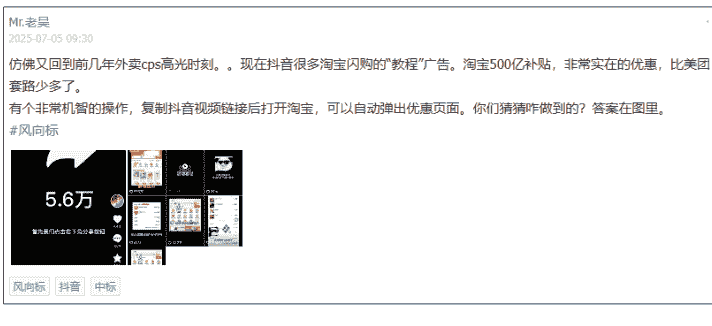
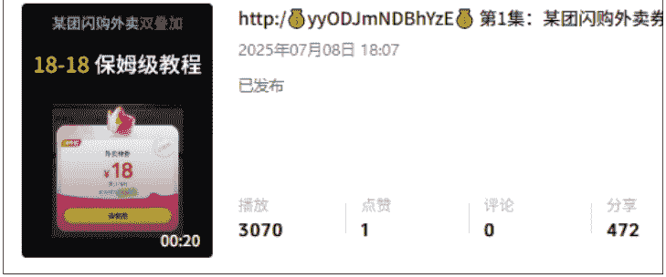
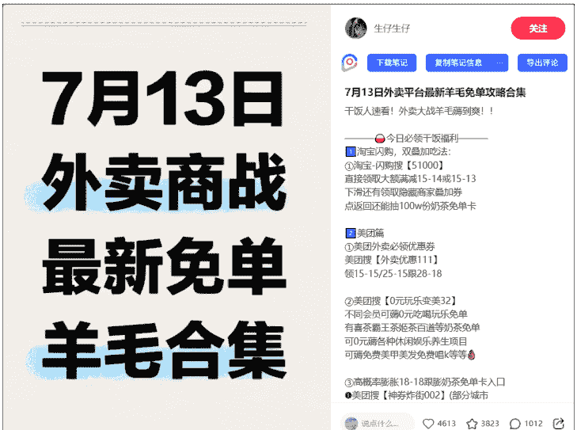
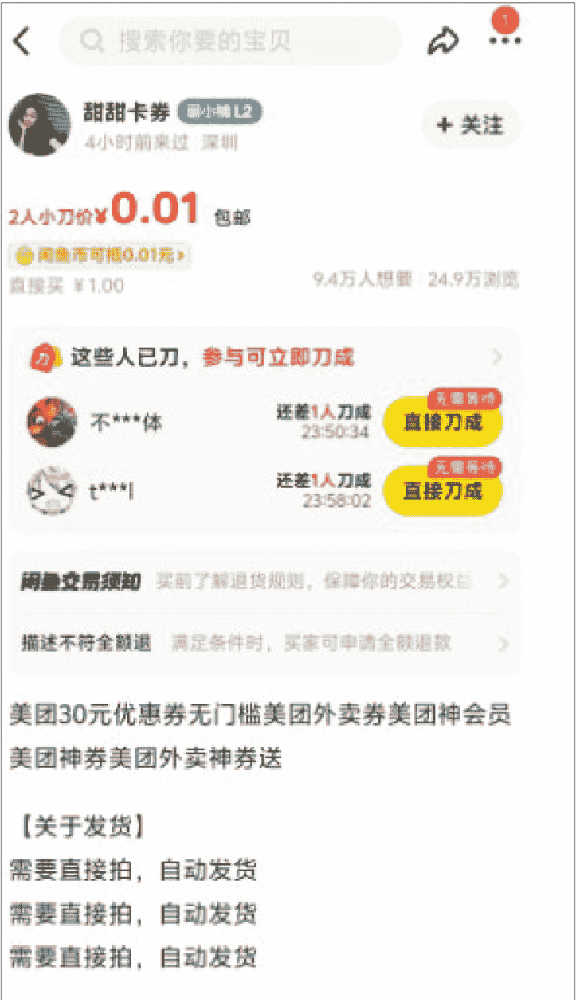
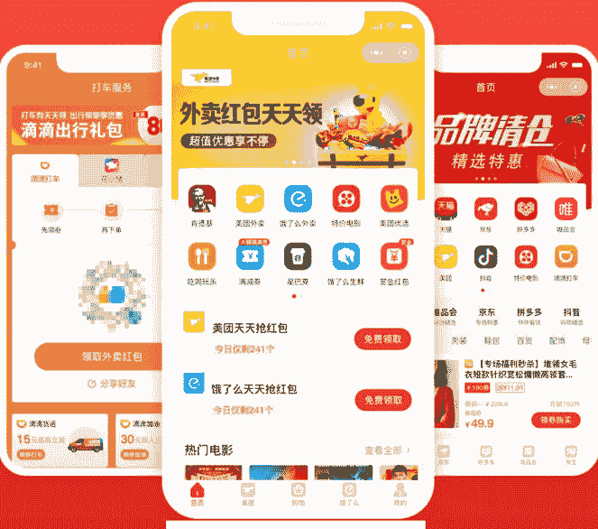

# 上线即出单，5天收益累计800+的外卖CPS新手指南
250715 生财精华

## 公众号懒人搜索，懒人专属群独享

## 懒人微信：lazyhelper

## 前言

圈友们好，当我在7月8日刷到以下这个中标帖的时候，我是非常激动的，我猛的发现，用户只需点击视频下方的链接，就能在打开外卖App时自动弹出优惠券。这种“丝滑”的转化路径，让我意识到一个巨大的机会可能就在眼前。我感觉发现了一个宝藏。我仿佛看到了几年前的流量风口。

我决定立刻行动。当晚，用最简单的方式剪辑并发布了第一条测试视频。很快，系统就给了我正反馈，结果远超预期，当晚成交4单，虽然佣金只有1.42元，但这证明了整个流程是完全跑得通的。视频内容如下：

虽然跑通了最小 MVP，但对于接触过好几个项目的我而言，它算不算一个好项目还为时过早。项目能做多大，天花板多高，值不值的做？适不适合我？能做多久？还需要继续调研。

为了验证这不是偶然，我第二天立刻加开了一个新账号，继续测试，剪辑视频，发布视频，统计播放量，分享数，订单数等数据。

同时观察同行，出单的平台如闲鱼，小红书，快手，视频号，抖音的优秀案例，了解官方平台的推广链接，对接第三方分佣平台，与同行交流，力争快速了解。

而在这时，亦仁也发了一个针对这个项目的超级标，给了我更多的信心。

经过几天的调研和测试，我也拿到了一些小结果，累计播放量 3w，订单量 1000+，收益 800+，也对这个项目有了更深刻的理解和思考。

## 经营数据

- 可提现余额(元)：0.00
- 提现：余额明细>
- 本次结算金额(元)：0.00
- 下次预估结算金额(元)：168.85

## 效果报表
截至今日13时

- 今日
- 昨日
- 近7日
- 近30日

## 订单收入

- 付费订单(笔)：484
- 付费预估收入(元)：162.03
- 结算预估收入(元)：152.58

## 其他收入

- 完成预估收入(元)：0.00
- 结算预估收入(元)：0.00

## 分享效果

- 点击数(次)：2286

- 首页
- 活动
- 经营
- 订单
- 我的

## 推广明细
* 订单有1-2小时延迟

| 下单日期 | 下单商品 | 支付金额 | 订单状态 |
| :--- | :--- | :--- | :--- |
| 2025-07-13 06:22:47 | 满杯百香果(升级版)等2件商品 | 7.2 | 已收货 |
| 2025-07-13 06:14:30 | 杨枝甘露经典版-大杯 | 5.9 | 已收货 |
| 2025-07-13 01:16:39 | 千层豆腐等2件商品 | 62.13 | 已收货 |
| 2025-07-13 00:22:43 | 烤猪肉串 (5串) | 15.0 | 已收货 |
| 2025-07-12 22:53:51 | 多肉葡萄冰柠茶-常规 | 5.4 | 已收货 |
| 2025-07-12 21:44:15 | 轻卡无面包蛋魂牛肉堡 | 8.9 | 已收货 |
| 2025-07-12 21:28:23 | 满杯百香果(升级版)等2件商品 | 0.01 | 已付款 |
| 2025-07-12 21:23:48 | 双汇 香辣香脆肠32g/根等3件商品 | 6.03 | 已收货 |
| 2025-07-12 21:21:07 | 【单一小包】百草味 香弹面筋卷(烧烤味)23g/袋 | 6.38 | 已收货 |
| 2025-07-12 20:53:52 | 百事可乐 碳酸饮料 (新老包装随机发货) 330ml/罐 | 9.0 | 已收货 |

共查询 220 条结果
导出Excel

## 推广明细
* 订单有1-2小时延迟

| 下单日期 | 下单商品 | 支付金额 | 订单状态 |
| :--- | :--- | :--- | :--- |
| 2025-07-13 08:55:30 | 初恋玫瑰青提-大杯 | 8.0 | 已收货 |
| 2025-07-13 08:43:41 | 【打卡必点】PT咖椰黄油多士1份(4块) | 8.8 | 已收货 |
| 2025-07-13 08:40:59 | 鲜肉汤汁笼屉小笼包(8个) | 27.77 | 已收货 |
| 2025-07-13 08:38:38 | 手工奥尔良鸡肉包等2件商品 | 22.95 | 已收货 |
| 2025-07-13 08:22:11 | 精品牛肉胡辣汤+葱油饼半张+牛肉盒半个+茶叶蛋 | 8.5 | 已收货 |
| 2025-07-13 08:19:44 | 3牛肉煎包+1现磨豆浆 | 17.5 | 已收货 |
| 2025-07-13 08:12:37 | 【尝鲜】杨梅3粒(限一份，多点不送) | 19.79 | 已收货 |
| 2025-07-13 07:18:09 | 现磨豆浆 | 8.61 | 已收货 |
| 2025-07-13 06:58:16 | 酱肉包特色等3件商品 | 3.0 | 已收货 |
| 2025-07-13 04:53:14 | 三拼霸霸奶茶(升级) | 6.8 | 已收货 |

共查询 415 条结果
导出Excel

这篇文章不长，总计 3000 字，文中主要提到了我对这个项目的调研可行性。如果你对外卖 CPS 也感兴趣；或者从未接触过 CPS 项目、但希望快速起号变现的个人；或者有一定剪辑经验、想要批量放大的团队。相信我，完整看完，会有很大收获的。核心内容如下：

## 一、判断项目是否可行（Why?）

一个项目值不值得做，需要从赛道、市场和时机三个维度来判断。

### 赛道 & 平台机会：巨头补贴，流量红利窗口期

风口趋势：美团、淘宝、京东三家巨头正在大力补贴外卖零售市场，这场“战争”刚开始，短期内补贴不会结束。对于推广者来说，这就是最直接的红利。

核心赛道聚焦：私域归集，只要补贴还在，消费习惯养成，项目会一直在，只是到后面，随着各方平台的稳固，佣金会有所下降。但这不是当下唯一考虑的，目前只需要解决流量问题，如何获取更大的流量。后续才将流量转到私域，获得长期收益。

### 市场规模 & 竞争格局：天花板极高，普通人仍有机会

项目天花板：目前我在群里看到的圈友最高的日均 3W 单。

#### 以周六冲锋日的淘宝闪购—超级品牌日第三方平台的佣金为例：
平日淘宝闪购新客：0.8/单，淘宝闪购老客：0.3/单，周六激励翻倍，同时每2000单奖励188.8，算上高额cps，一单佣金可以达到1.6/单，也就是说昨天那个圈友入账了4.8W。已经是很高的天花板了。

#### 竞争结构：
这个项目还算分散红海赛道，头部还未完全垄断，而且根据我测试的结果，入场的都是可以的挣到钱的，只是挣多挣少而已。所以对普通人是比较友好的，当然，如果能通过手段放大，撬动杠杆，收益更可观。

#### 细分赛道增速：
美团外卖，淘宝闪送，京粉，也许下一个是拼多多，都会下场，且每个平台活动多样化，补贴也多样化，当下根本做不完。目前大部分推广者都是哪家平台佣金高，对哪家平台规则更熟悉，就主推哪家。

#### 时机窗口：现在进入，就是第一波吃螃蟹的人
目前市场还处于分散的“红海”阶段，头部并未完全垄断。根据我的测试，新入场者只要执行，都能赚到钱，区别只在于多少。这对普通人非常友好。

## 二、判断适不适合做

### 资源与能力匹配度：门槛极低，执行力是关键

核心资产复用度：
我简单的测试，就能取得这样的成绩，还是比较乐观的，至少在操作上没有碰到难点。跟我们原来的创业的经验比较融合，不管是矩阵，还是投流，我们相对普通人会擅长一点，这点我们还是有信心的。这也是下一步我们重点的发力点。

学习 / 迭代能力：
模式简单粗暴，流量完全溢出，只要发布，就可以获取到流量。只要微升级，就可以获取到大量流量。你们看到的 1 天转发几万的基本都是投千川出来的。

### MVP 可执行性：半小时上手，当晚见效

3-6 周能否跑通：我是 7.8 晚上剪辑了第一条视频发布到抖音，当晚就出了 4 单。制作一个爆款视频非常简单，几乎可以套用公式。

以这条视频为例：2.58 iCh:/ l2/3l Y@m.Qk http:/kxMjc3MTkxY2l 美团外卖优惠券领取入口 美团大额优惠券最新教程 # 省钱技巧 # 外卖优惠券 # 美团外卖优惠券 # 薅羊毛 # 省钱攻略

https://v.douyin.com/9vVBnKo8kkc/ 复制此链接，打开 Dou 音搜索，直接观看视频！

### 视频文案构成：

开场白：美团外卖优惠券领取十八减十八保姆级教程来了。主播昨天已经把冰箱存满了奶茶，话不多说，教程开始。

领取步骤：现在点击视频右下角的分享按钮，复制成功后打开美团就可以进入美团外卖优惠券领取入口，进来立即领取就可以拿到大额外卖券了。美团首页搜索八二五五，进入内部折扣页面。神券界面，低价买。这几种券包都很划算，券到手后，切换大城市地址更容易获得十八无门槛券。

收尾：券全部领完之后，就可以实现奶茶外卖自由了。

核心逻辑：你会发现，中间的“领取步骤”是固定的，你只需要不断更换“开场白”和“结尾”，就可以无限生成新的原创视频。

### 多渠道玩法拆解：一鱼多吃，收益最大化

抖音直播间：可以所有平台通吃，单粉产值更高，难点就是要有一个人一直坐在屏幕前解答问题，后期看有没有机会无人直播。

### 三王争霸 谁是老大
- 1. 闪购几率拿16-16券
- 2. 某团0米拿奶茶或汉堡券
- 3. 小美几率拿25-20通用券

小红书：仅需一张图片搞定，接着是笔记内容。可以无限重复发，比抖音更简单一点。

懒人微信：lazyhelper

同时，小红书一篇笔记可以做到通吃所有外卖平台的佣金，平台上所有的活动，投产比更好。和抖音的直播间有异曲同工之妙。

闲鱼：发布的内容模板可以重复套用，难度不高。核心是如何通过擦亮功能，获取更多曝光的问题。

### 公众号懒人搜索，懒人专属群分享

其他平台就不赘述了，方法也是很粗暴简单的。

可投现金：无需资金投入，除非投流。

初步投产比：以抖音为例，我跑通下来的情况下，自然流平日万播放收益在200-300，如果是冲锋日可翻倍。而且，剪辑的视频和文案可以一鱼多吃，可同步发布到视频号，快手，抖音，图文类的可发布到小红书，闲鱼，如果还有能力的情况下，还可以在淘宝拼多多发布，形式也很简单，直接卖 0.01 元，不考虑收益，我们只赚佣金。

## 三、判断值不值、能做多久

### 扩张性 & 护城河

这个项目我个人判断有很大的扩张性的，矩阵放大，一鱼多吃多平台放大，投流放大，团队放大，工作流放大。我个人认为都有机会。目前市场上主流的方式就是铺量和投流，其中投流就是你们看到的 1 天分享量达到几万的。我也和同行交流了下，投流难度不大，有投流过的简单学习下就会了。

目前我已经实现了快速剪辑的工作流，可以无限产出视频，关于工作流放大，可以参考文锴的精华帖《一个人，一套自动化流程，如何玩转 100 个中老年书法视频号矩阵？》

而矩阵放大，多平台放大，和投流放大，也是我接下来的重点。如果有机会叠加私域，效果会更好。毕竟，公域平台的流量是暂时的，只有把用户引导到自己的微信群或企业微信，才能实现长期、稳定的复利。这是对抗风险最有效的手段。

### 风险管理

任何项目都有风险，提前规划才能走得更远。过度营销或内容同质化，可能导致账号被限流或封禁。所以，如何去重，降低过度营销，也是我们需要思考的。

## 四、总结

通过各个方面的判断，在目前，我觉得这个项目是有很大机会的，就像亦仁说的。这条超级标，非常适合普通人，可能是最不需要技术含量只需要无脑执行力的超级标项目。以我这么粗糙的剪辑，都可以快速拿到结果，生财有术的圈友们，能力远在我之上，一定可以拿到更大的结果。

## 五、其他补充及答疑

- 1. 关于官方链接和第三方平台链接取舍的问题。
目前我了解到的情况，基本活动，官方就有，直接申请提报就行。美团的直接搜索美团联盟，淘宝闪购的搜索一起赚。比如美团外卖节3%的佣金，长期活动。

一些冲锋日的活动和激励，只有第三方平台才有。如周日的淘宝闪购超级品牌日的翻倍补贴。目前我对接的2个平台是圈内大佬黄老板的云瞻平台和云众推客。

官方的优势：系统稳定，资金绝对安全。

懒人微信：lazyhelper

第三方相比官方的优势：活动多，结算快，基本达到T+1，部分补贴力度大，除了官方的返利之外，还有额外激励政策。客服反应速度快。劣势是有些第三方平台系统不稳定，时不时崩溃一下，订单同步也没官方那么及时。

有感兴趣的小伙伴也可以直接扫码分佣，会有工作人员对接。代理分佣的佣金不高，我了解到的情况是，代理分佣只能拿到达人佣金的1%-2%，佣金实在有点低。所以想做代理的，前期不如自己做达人先跑起来，更实在。

云瞻
YUNZHAN
云瞻开放平台

## 免费领取

外卖cps系统、打车系统、淘宝客系统等

一万+流量主都在使用

- 2. 各个平台活动的推广取舍问题。
目前各大平台都在各显神通，努力拉单子。也推出了不少活动，从这几天的观察看，平台有活动有激励，我们就跟着第三方平台走。

平日没活动的，算下来佣金差不多，就提报官方的活动。一般，平台都会主推 1-2 个基础活动，平时推这个就行了。

懒人微信：lazyhelper

各个第三方平台活动和激励政策都有所差异，可以自己多了解关注一下，哪边佣金高，就推哪边。

- 3. 批量剪辑问题。
前面我讲过抖音和小红书的优秀案例，构成都是很简单，我也拆解出来了，通过工作流，批量剪辑软件，如剪大神，批量上传软件，就可以实现了。

- 4. 项目评估的基础标准。
这是我结合生财有术的文章，自己思考的对项目评估的总结的初稿，不完全正确，仅供大家参考，也欢迎感兴趣的圈友提意见，一起优化。

| 分项 | 细分项 | 总分 | 备注 |
| :--- | :--- | :--- | :--- |
| 赛道 & 平台机会 (14分) | 风口&趋势 | 8 | 超级标&中标帖&搜索指数环比 |
|  | 核心赛道聚焦 | 6 | 长期复利的事情 |
| 市场规模 & 竞争格局 (11分) | 项目天花板 | 4 | TAM(大盘/小盘) |
|  | 竞争结构 | 3 | 寡头&分散&假蓝海（伪需求） |
|  | 细分赛道增速 | 2 |  |
|  | 同行商业化样本（Top 收入/利润） | 2 |  |
| 判断做不做 (30分)（外部指标） | 时机窗口 (5分) | 存续时间（过去） | 2 | 市场已存在多久？是不是快到红海晚期？ |
|  |  | 升级强度（现在） | 1 | 过去有没有明显升级（技术、玩法、商业模式） |
|  |  | 剩余窗口（未来） | 2 | 还剩多长热度？平台封杀、价格战 |
|  | 资源与能力匹配度 (20分) | 核心资产复用度 | 10 | 玩法/能力迁移 |
|  |  | 既有流量 / 客户池 | 6 |  |
|  |  | 学习 / 迭代能力 | 4 |  |
| 判断适不适合做 (40分)（内部指标） |  | 3-6周能否跑通 | 5 |  |
|  | MVP 可执行性 (20分) | 可投现金（MVP 周期×预算） | 5 | 前投入（启动门槛） |
|  |  | 初步投产比（ROI 估算） | 5 | 后收益（经济价值） |
|  |  | 复盘&可执行颗粒度 | 5 |  |
|  | 经济模型 (18分) | 目标毛利 | 6 |  |
|  |  | 回本周期（月） | 6 | 连续 3 个月可保本得满分 |
| 判断值不值、能做多久 (30分)（内部指标） |  | LTV/CAC（倍） | 6 | 拉来一个客户能赚几倍于获客成本？ |
|  | 扩张性 & 护城河 (12分) | 矩阵/投流/团队/AI工作流放大（降本） | 6 |  |
|  |  | 成本壁垒（增效） | 6 |  |
| 一票否决 | 风险 / 合规 | 法规/TP/版权/资金安全/声誉风险 | 通过/不通过 | 70分 |
| 总分 |  |  | 100 |  |

感谢亦仁的超级标，如果觉得内容对你有价值或启发，希望能点个赞，投个锚支持一下。

欢迎对外卖 cps 好物感兴趣的或者已经在跑的一起交流，抓住这波红利！

## 最后，安利小懒的付费群：

### 懒人专属群

懒人专属群持续更新中，已持续运营6年，整理超3000份各类精选付费文章&年费社群干货，全部开放下载。

本资料为付费群内部分享，仅供真实有需要的朋友查阅

### 懒人专属群更新记录：
https://lazy2025.top/#/blog/record2

### 懒人专属群更新记录（需梯子，备用）：
https://lazybook.fun/#/blog/record2