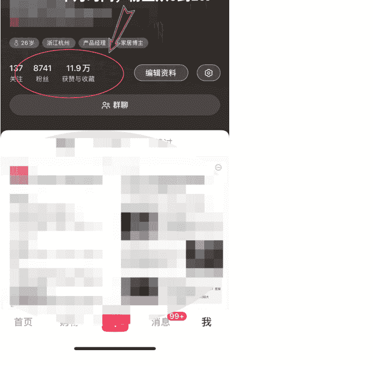
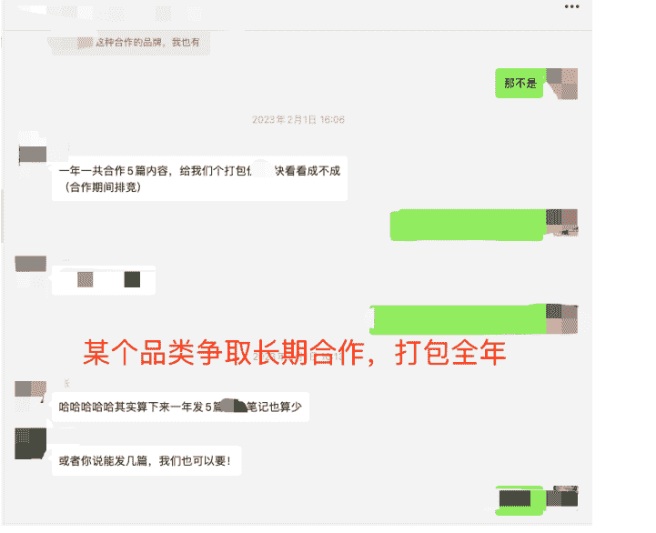
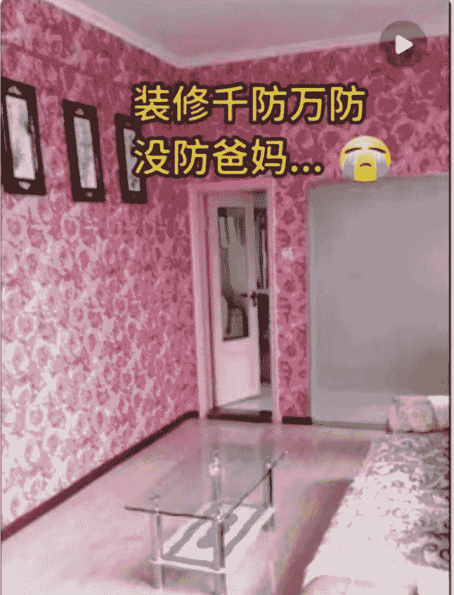
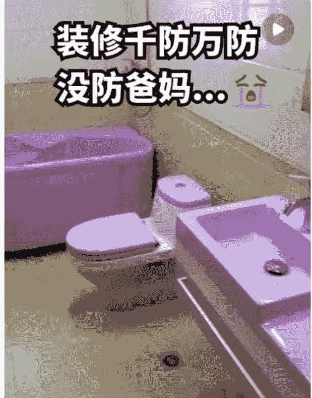
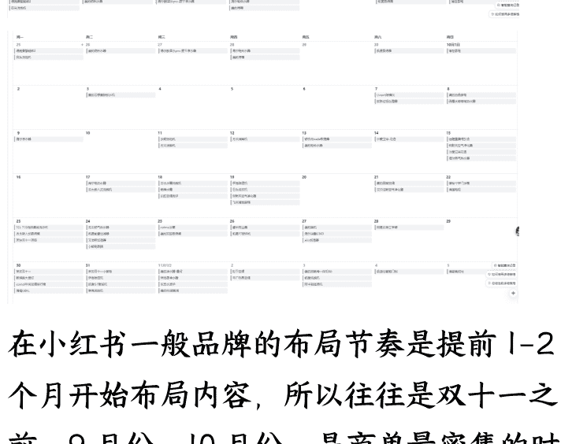
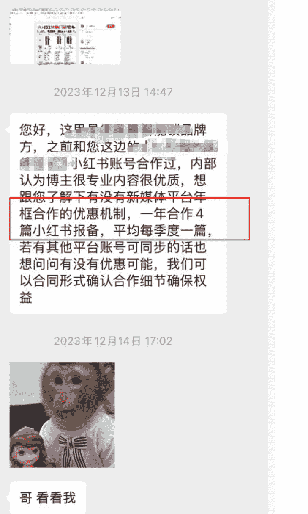
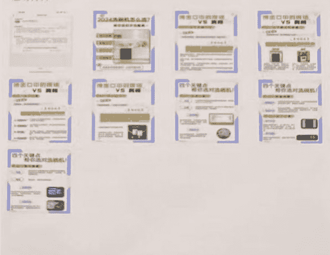

# 从零开始做小红书账号到最高月入 10 万，再到收入归零，我经历了什么？3 年创业复盘

250715 生财精华

公众号懒人搜索，懒人专属群独享
懒人微信：lazyhelper

hello，大家好，我是七天假，生财航海家。18 年开始做互联网产品经理，是一款百万流量的产品负责人。我在 2022 年开始裸辞创业，专注小红书平台。

写过两篇文章，均获得了精华帖，具体可以看：

做小红书半年盈利 20w+，切入品牌视角做流量实现爆商单：https://tniprOo2tc.feishu.cn/docx/Xnu7d1TT5ofSknxGXqUcNStxnGd

这篇文章，讲讲：

- 1、我是如何走上小红书商单变现之路？
- 2、又如何做到月入 10 万的？
- 3、为什么现在收入归零，我做错了什么？

## 一、我是如何走上小红书商单变现之路？

起因是我在小红书分享自己家里的装修经验，然后无意中一篇帖子爆了，然后就开始一发不可收拾...

### 当时做到了一个什么程度呢？

半年时间小红书粉丝量2W+，收获赞藏30W+，变现超过10W+。

总计发文80篇，千赞以上笔记27篇，千赞率为33.7%，百赞以上笔记75篇（含千赞），百赞率93.7%。

因为这个数据，引来了超过100个品牌的合作邀请。

但是精力有限，拒绝了很多，后来只合作自己喜欢的品牌，会和他们多次合作。有些品牌害怕我跟他们的竞品合作，还会签署全年的合作协议~~~

### 这是当时的一些截图和数据

懒人微信：lazyhelper

| 品牌名 | 产品 | 合作类型 | 价格 | 内容类型 |
|---|---|---|---|---|
| | | 置换 | 0 | 图文集合 |
| | | 一口价 | 2500 | 图文单篇 |
| | | 一口价 | 3500 | 视频单篇 |
| | | 一口价 | 2000 | 图文单篇 |
| | | 一口价 | 2500 | 视频单篇 |
| | | 一口价 | 2500 | 图文单篇 |
| | | 一口价 | 2700 | 图文集合 |
| | | 一口价 | 1700 | 带货 |
| | | 一口价 | 2500 | 图文单篇 |
| | | 赠送 | 0 | 无 |
| | | 一口价 | 3500 | 视频单篇 |
| | | 赠送 | 0 | 无 |
| | | 一口价 | 1699 | 无 |
| | | 一口价 | 29868 | 无 |
| | | 一口价 | 400 | 带货 |
| | | 一口价 | 3000 | 视频单篇 |
| | | 一口价 | 2000 | 图文单篇 |
| | | 一口价 | 2900 | 图文单篇 |
| | | 一口价 | 3200 | 视频单篇 |
| | | 一口价 | 2000 | 图文单篇 |
| | | 一口价 | 2900 | 图文单篇 |
| | | 一口价 | 3800 | 图文单篇 |
| | | 一口价 | 2400 | 图文单篇 |
| | | 一口价 | 1000 | 图文单篇 |
| | | 一口价 | 4600 | 带货 |
| | | 一口价 | 2000 | 图文单篇 |
| | | 一口价 | 2800 | 图文单篇 |
| | | 一口价 | 2900 | 图文单篇 |
| | | 一口价 | 2800 | 图文单篇 |
| | | 一口价 | 2800 | 图文单篇 |
| | | 一口价 | 3000 | 图文单篇 |

### 商单记录，一屏都截不下~

### 某个品类争取长期合作，打包全年

现在回想起来，我其实是无意中踩中了小红书当时的几个风口：

流量风口和平台红利。

22-23 年的时候，正是小红书 C 端用户流量开始起量，但是创作者/商家还没有大批量跟进的时间点。

利他的真诚分享很重要！！！
懒人微信：lazyhelper

我为什么能把装修账号做起来？根本原因是，我当时真的在装修，我分享的，真的是我的所见所闻，所思所想，并且毫无保留。用户其实不傻，用户能感知到这个博主到底是忽悠人的营销号，还是真的在分享干货。

小红书本身又是一个活人感很强的社区，所以那段时间，涨粉涨的飞快～

那段时间，被突如其来的流量和品牌方打乱了阵脚，也迷失在每篇 2-3k 的商单当中，犯了一些现在回想起来不该犯的错误：

赚到钱后，没有梳理 SOP，没有请助手，就自己一个人，一头扎进繁琐的工作中，包括对接商单、写笔记、账号维护等等。当时，就应该请人，把 80%重复繁琐的工作交出去，自己专注那 20%的最重要的工作。也是认知不足，当时并没有这个意识。

满足于小富即安，赚到钱了就开始沾沾自喜，没有抓紧机会进行放大。

## 二、我又是如何做到月入 10 万的?

可能确实是，站在风口，猪也能飞起来。

我当时不是没有意识到需要把这套赚钱的路径放大，但是我很懒！！！我把成功经验，复制到了 2-3 个账号上，也起号成功，并且开始爆商单。

这里的重点应该是，只复制了 2-3 个账号。嗯☺，当时应该复制 20-30，甚至 200 个的，但是我没有...

这里顺带分享下我的起号方法。在生财，关于如何在小红书起号的方法有很多，我聊点那些帖子没聊到，或者没说透的东西。

### 2.1 商单号起号经验分享

- 1、人设！人设！人设！

这里的人设，指的是不是说，给自己安排一个身份，把简介编一下这么简单。而是可以把你这个人设要经历的 所有的事，跟用户相关，对用户有帮助的，都可以分享一下。加强人设，让用户共情。

大家都知道，小红书起号，可以发一些互动贴。但是互动贴其实也不是乱发的，也是需要根据你的人设进行发。

我拿装修账号举例，我一般是怎么起号的：

- 1、可以从买房开始，社会现象层面的互动贴话题，比如《杭州买房，男方希望我一起出首付，这种男朋友还能要吗？》《杭州 XXX 小区好，还是 XXX 好？》
- 2、买完房，再到装修《一人说一个你们装修踩的坑》、《一人说一个你们装修中最后悔的决定》
- 3、然后就到选装修公司了，准备怎么装修，找了哪些装修公司，发现里面的套路是什么，这些都可以总结。教姐妹们避坑。
- 4、这种装修前准备了解的帖子发完后，正式开始装修，就可以发自己做的装修攻略贴了。分享自己装修过程中，踩了哪些坑，学到了什么，总结了什么，给姐妹们准备了什么…等等。

这4个过程，爆2-3篇，基本上就起号成功了，人群会很精准，吸粉率也很高，因为大家看到的，是你这个活生生的人，陪你一起从买房开始，到选装修公司，到装修踩坑，再到顺利入住美美的家。

懒人微信：lazyhelper

- 2、一定学会抓热点！

我发现基本没有人讲过小红书搜索框下面的：小红书热点。

但是，这个东西真的是小红书实时的热点事件的数据，时间不会超过24小时。是最新的，大家都在关注的东西。我建议小红书创作者每天都逛至少2-3遍小红书热点。

#### 小红书热点

- 1. Labubu: 跟对主人很重要[热]912.4万
- 2. 宋雨琦金卷发油画少女[独家]777万
- 3. 第一次尝试就爱上的苹果夹奶酪[热]691万
- 4. 贵州榕江全城紧急撤离[热]687.6万
- 5. 成都暴雨685.7万
- 6. 章若楠薄荷少女636万
- 7. 起猛了在故宫看到真来上朝的了[梗]623.2万
- 8. 檀健次芭莎红毯上开起车了616.4万
- 9. 李雪琴真的瘦了593.1万
- 10. 拍毕业照时被初中生当厉害大人552.9万
- 11. 我很少用震撼来形容一次晚霞[热]549.6万
- 12. 伊朗举行国葬520.7万
- 13. 宋雨琦获国际影响力艺人509.1万
- 14. 跟我的充电宝宝宝告别[热]498.1万
- 15. 鹿晗我们的明天大合唱481.2万
- 16. 金曲奖年度歌曲星期五晚上469.2万
- 17. 想去巴黎的欲望达到了顶峰[热]443.7万
- 18. 百香果在蛋糕里开派对[梗]427.2万

#### 三、更新规则

- 热点榜单实时计算热点数据，每分钟更新一次。
- 热点榜单中的热点词条的排序每分钟更新一次，你的小红书热点榜单将随着你的刷新而同步更新。
- 由于排序的实时变化或功能内测，不同用户展示的榜单内容可能会有差异。

#### 四、排序规则

榜单的排序会考察热点的搜索、传播、互动等数据。热度计算公式：

搜索热度+传播热度+互动热度+点击率

- 搜索热度：指搜索量，基于用户对热点的搜索行为建立的热度模型。
- 传播热度：指曝光量，基于热词结果的关联笔记在平台内的曝光情况建立的热度模型。
- 互动热度：指互动量，基于热词结果的关联笔记在平台内的转赞评收藏等互动情况建立的热度模型。
- 点击率：指用户在热点榜单页面对热词的点击情况。

看榜单，就去思考一件事情，和你的业务能不能搭上边。强行蹭热点没意思，但是如果能搭上边，必须蹭！当天出笔记，当天爆的概率很大。

我当时在小红书热点榜上发现一个热点话题：#父母参与装修，有多惨？

我就搜索了这个话题，发现大家都在吐槽父母的审美，会买一些稀奇古怪的灯、家具和一些乱七八糟的配色，比如粉色的马桶等等。

我把大家讨论的有爆点的东西，都提取了出来，糅合成了一个视频。当天出的，当天就爆了。

后来又发了一篇类似的，也爆了。这两篇直接涨了2000多粉。

不多，因为没做人设，3w点赞那个，是新号的第一篇笔记...（视频我放下面了，大家可以看看）

装修时一定要
1.1万

装修千防万防
没防爸妈…😭

3.1万

- 3、从爆款中找到异常值，并复制

抄爆款，并且抄低粉爆款，这些话都被说烂了，我想大家都知道。但是真抄出结果的，还是少数。

原因是：

- 1、爆款被人抄烂了，用户审美疲劳，不再感兴趣。
- 2、低粉爆款具有偶然性。
- 3、爆款对内容或者素材有高要求，模仿难。

那我们应该抄怎么样的爆款呢？

- 1、这个爆款应该是一个可扩展的内容形式，并且有人通过这种内容形式持续获得爆款
- 2、爆的时间还比较短，市面上模仿的人还比较少
- 3、模仿成本低，内容制作成本相对来说不高

要具备这三个条件，很难！如果不是泡在行业里，并且对行业的内容有持续的观察，很难发现的。

而恰好，我们当时发现了！

已经不是什么秘密了，给大家看看内容形式。

...着实有点考古了，只找到内容形式，没找到那个博主和他爆的视频。

我当时的步骤是：

- 1、我看到这条视频，数据特别好（大概10w赞），然后点击主页看这个博主
- 2、这个博主的主页，都是这种内容形式的视频，并且流量都很好。我觉得可能是个可以抄的内容形式
- 3、然后我又搜了关键词，发现底下，就他发了这种内容形式，还没有人跟进，于是我第一个跟进。

然后就出爆款了，一条视频涨了 3w粉~~

一共发了 2-3 次，全是爆款。

#### 绿植避坑 6种网红绿植

15万
懒人微信：lazyhelper

#### 绿植避坑 6种网红绿植 1802320

这种笔记，在当时：

- 1、流量大，已经有人成功验证，并持续拿到结果
- 2、好复制，成本很低

当然，现在已经行不通了，大家主要学习一下思路～

- 4、送资料！送资料！送资料！

如果是做服务的，引流私域的，其实送资料不是一个好的选择。

但是如果你是当博主，涨粉变现的，送资料绝对是一个不错的方法！！！

- 1、送资料真的很容易涨粉，别人愿意为了你的资料关注你（前提是资料有价值哈）
- 2、来的也都是精准粉，不是假粉。比如我送装修资料，来的确实是正在装修的人，人群很精准。等你下次发装修的内容，推送给粉丝，他们也愿意看，能进一步加速笔记的流量。

### 2.2 通过测评矩阵号，让我月入10万

就这样，我又成功起了3个号。（当然大概做了4个号，成功了3个，成功率75%）

我上面说的这种内容有流量，适合起号。但是品牌方大概率还是不会来找你，因为你的内容形式没有种草属性，没办法勾起用户的购买欲。

所以，我们起号之后，开始做测评内容。什么是测评内容，给大家看下（现在也是随处可见的）

#### 4款美的冰箱对比测评

| 型号 | 550 | 541 | 536 | 535 |
| :--- | :--- | :--- | :--- | :--- |
| 外观 | (Image) | (Image) | (Image) | (Image) |
| 价格 | 9179 | 6399 | 5279 | 5699 |
| 尺寸 | 833*600*1910 | 833*600*1910 | 833*600*1910 | 833*600*1910 |
| 门体 | 法式门 | 十字门 | 法式门 | 十字门 |
| 容积 | 523L | 515L | 511L | 510L |
| 制冷系统 | 双系统双循环 | 双系统双循环 | 双系统双循环 | 双系统双循环 |
| 冷藏净味 | PST +全净保鲜科技（净味进程显示） | PST +全净保鲜科技（净味进程显示） | 全舱PT净味 | 全舱PT净味 |
| 冷冻净味 | PT净味 | PT净味 | 全舱PT净味 | 全舱PT净味 |
| 噪音值(dB(A)) | 35 | 35 | 34 | 34 |
| 冷冻能力 | 8Kg/12h | 8Kg/12h | 8kg/12h | 8kg/12h |
| 深冷 | -30 | -30 | / | / |
| 亮点 | 60cm纯平全嵌双循环系统PST + 全净保鲜科技-30°深冷速冻背板面光 + 把手氛围灯一键自动制冰 | 60cm纯平全嵌双循环系统PST + 全净保鲜科技-30°深冷速冻背板面光 + 把手氛围灯 | 60cm纯平全嵌双循环系统全舱PT净味三档变温空间 + 高保湿空间 | 60cm纯平全嵌双循环系统全舱PT净味三档变温空间 + 高保湿空间 |

#### 4款热门空调综合测评

跟着买，不踩坑

| 品牌 | 海尔 | 美的 | 小米 | 海信 |
| :--- | :--- | :--- | :--- | :--- |
| 产品 | (Image) | (Image) | (Image) | (Image) |
| 型号 | KFR-35GW | 酷金 | N1A1 | X690 |
| 匹数 | 1.5匹 | 1.5匹 | 1.5匹 | 大3匹 |
| 制冷量 | 3500W | 3500W | 3500W | 3500W |
| 制热量 | 5100W | 4400W | 4200W | 5000W |
| 能效 | 新一级 | 一级 | 新一级 | 一级 |
| 适用面积 | 15-24㎡ | 16-20㎡ | 10-15㎡ | 32-48㎡ |
| 循环风量 | 760m³/h | 630m³/h | 680m³/h | 700m³/h |
| 扫风方式 | 上下左右扫风 | 上下左右扫风 | 上下扫风 | 上下左右扫风 |
| 噪音 | 17-37-41 | 18-36-38 | 23-40-42 | 16-36-40 |
| 防止吹 | √ | √ | √ | √ |
| 功能 | App远程开关除菌长效除醛可变分流科技 | 智能操控自清洁除湿 | App远程控制自清洁柔风模式 | App远程控制自清洁 除湿柔风模式 |

#### 美的空调 三款3匹柜机测评

| 产品名称 | 无风感 | 全面风 | 酷省电Ultra |
| :--- | :--- | :--- | :--- |
| 适用人群 | 老人小孩 | 多口之家 | 经济实用 |
| 适用面积 | 35 - 50m² | 40 - 60m² | 35 - 50m² |
| 能效等级 | 新一级能效 | 新一级能效 | 新一级能效 |
| APF | 4.63 | 4.70 | 5.16 |
| 制冷量 | 7330W | 7350W | 7370W |
| 制热量 | 9870W | 9850W | 10510W |
| 循环风量 | 1800m³/h | 1800m³/h | 1760m³/h |
| 产品特色 | AI无风感 冷暖双出风 温湿风黄金配比 四重母婴级净护 | 全面屏全面风 23片全面屏隔栅 15片放生鹰翼柔性百叶 5向瞬时出风 | 15米超远距离送风 150°超广域覆盖 上下左右扫风 OTA自进化 |
| 总结 | 够舒适无风感空调 | 够全面送风无死角 | 闭眼入省电空调 |

大概形式就是，首页是多款产品的测评表格，副图是选购攻略，最后做产品推荐。这种内容形式，在当时的小红书超级火，而且种草效率很高！

我当时起号之后，就会联系相熟的品牌方，让他们来投我新号的广告，也就是这种测评内容，就比如我找了美的的品牌方，写了一篇美的空调的横测，而且品牌方都是会投流的。

一旦小爆一篇（100 赞以上），我的账号就会暴露在各大品牌方眼前。做空净的，做净水器的，做冰箱的，都会来联系我进行商单合作。

我用类似的方法，把3个号都做起来了，

做到了商单接不过来的地步，

其中：

一个号 3.6w 粉的号，单篇报价 5k，到手 3.5k。

一个号 3w 粉，单篇报价 4k，到手 2.8k

一个号 8k 粉，单篇报价 2k，到手 1.4k

下图是当时每天的排期表~

在小红书一般品牌的布局节奏是提前1-2个月开始布局内容，所以往往是双十一之前，9月份、10月份，是商单最密集的时候，11月份反而会比较空。

很多品牌都有要求一个号一天只能发一篇笔记（害怕自然流减少），我们有时候实在排不过来，会偷偷的一个号发两篇~

当时在10月份的时候，流水最高达到了15.7w，净利润达到了11w左右。

我们当时有方法，能起号，还有品牌方资源，但是因为商单接不过来，就没想过再去起新的号...这种现在看来，实在是蠢的可怜。

### 2.3 三大异常值分享

当时，每天都在写笔记，泡在小红书里写商单。

我起码意识到了3个异常值，这3个异常值都有机会年入百万-千万，不过我没把握

- 1、家居/装修号很容易起号成功，流量很大，并且竞争很小。

很多人还没意识到小红书的家居赛道的机会，博主少，但是品牌方多。那个时候我认识的一些小红书家居博主，大家都是商单接不过来的情况。这是第一个异常值，在上面已经有详细介绍过了。

- 2、我仅靠一篇笔记带货，变现了10w+

形式是这样的：当时是空气净化器，多品牌横测，然后展示测评结果，突出某一个品牌的产品。接下来，在评论区带货。

我的粉丝报我的暗号，可以在京东官方旗舰店领取优惠券，特价购买。领取优惠券并购买后，我还能拿返佣。

当时我那篇笔记霸榜空气净化器的搜索（在小红书搜空气净化器，我的笔记排第一和第二）什么都不干的情况下，每个月拿返佣能拿 2-3w，持续了 4-5 个月。

这个在当时其实是一个巨大的机会。类似于知乎好物和现在的 B 站好物，用户在平台种草后，有去电商平台购物的需求，只不过在小红书比较原始，需要报暗号，而不是一键跳转。

可惜的是，这种带货的方式，我也没多尝试，因为收入的不确定。当时比较确定的是，写一篇商单，就有 3000 的收入...所以主要精力投入在那上面了。

- 3、品牌方为我的笔记投了超 20w，带来了 47%的进店转化。

2023年10月30日 14:53
哥 又跑二十万了
双11智能门锁选购攻略！避坑不迷路
笔记ID:651132ab000000001e
咱真的能跑
very good
2023年10月30日 14:54
一赞一个稳
收益怎么样
进店转化 40%

这篇一天消耗两万
太能占位了
2023年11月2日 17:31
我每天看到日报都要感叹一下
进店转化率 47% 了

当时嚣张到什么程度，他要跟我签年框，一年合作四篇，我都不带理他的...

他们是智能锁品牌方，每一个客单价在 2500 以上的。进店转化率 40%的意思是，100个人看过我的笔记，就会有 40个人主动去淘宝搜索他们的品牌，并且进入他们的店铺。

这个转化率，做过电商和种草的小伙伴会知道有多恐怖~~

### 做什么内容？
是图文的同品牌横测。也是横测表格，然后是同一个品牌的不同产品进行横测对比，把用户聚焦在品牌上。

### 这个错过的是什么？
其实，以我的内容能力和测评能力，找一个非标的品类，完全可以自己去起一个品牌，为自己的品牌去做横测去投流。效果应该会非常不错。（我现在有业务就在做这一块）

但是，当时还是满脑子都是商单。。。嗯，再次错过红利期。

ps：现在这个玩法还能不能做？我的答案是能做！这三个异常值，第三个，是现在还能玩的，还有一定的红利。想了解的也可以看我的一篇精华帖。

## 三、为什么现在收入归零，我做错了什么？

### 3.1 平台严打矩阵测评，无备选方案，没快速转型
23 年底，到 24 年，小红书平台开始严打图文横测。

从刚开始的卡报备审核开始，一篇报备横测图文需要靠运气才能过审。

到后来直接蒲公英异常，限流。

#### 申诉材料
| 项目 | 内容 |
|---|---|
| 申诉编号 | 320115672002 |
| 申诉标签 | 账号认证/权益 |
| 申诉时间 | 2024-10-04 09:24:26 |
| 申诉理由 | 账号被永久限制流量和商业权益，因误操作触碰了平台的规则，希望小红书给个机会努力改正，创作出更优质得笔记!博主的笔记全部出自原创，希望薯队长再给博主一个机会，共同创作出更优质的内容，祝小红书更上一层楼! |
| 证明材料 |  |

一方面，明知道违规，但是因为品牌方要求，还是不停的写横测商单。

另一方面，不停的申诉，希望能把账号的异常申诉回来。

错就错在明知道违规的情况下，还硬着头皮在那写横测商单。没有考虑转型，也没有考虑账号的权重、限流等问题。满脑子想的就是趁着最后的机会，把商单的钱赚了再说。有种竭泽而渔的意思。

ps： 23、24 年的时候，小红书对待横测的态度是卡审，是蒲公英异常。但是现在对待图文横测的态度很宽松，只是不给流量。不伤账号，也能进行聚光投流。

所以我说，上面说的异常值 3，目前还能做。只要横测内容做的好，通过投流，能有一个非常不错的 ROI。

### 3.2 收入降低，开始焦虑，无思考，只行动，最后一事无成
当博主矩阵开始封号、限流的时候，我不是没有考虑过转型，甚至尝试过 3-4 个项目，但是最后都以失败而告终。有趣的是，每一个都踩的是不一样的坑！

#### 3.2.1 错误的方法+错目标用户，导致家电团购业务失败
上面有说过异常值 2，也就是笔记评论区底下留暗号，让用户去天猫、京东报暗号下单。当时我其实有把握住这个异常的，有做一定范围的尝试，但是走错了方向。

当时的想法：

用户有优惠购买家电的需求，但是如果一直是按照评论区留暗号的形式，我没办法监控带货数量，不知道具体的带货效果（数据需要找品牌方拉取，并且不是实时的，基本是一月一次）

我没有主动权，具体带了多少完全由品牌方说了算，我也没办法通过投流等手段去放大业务，所以我当时的想法是，这种方式不可持续。

但是用户的需求是真实存在的，那我是不是可以通过另一种形式去满足用户需求？

我的方案是：家电团购。

我通过账号的流量优势，往微信导了将近 1000 人（3 个群），引导大家通过团购购买家电。

但是折腾了几个月，就赚了 5000 块钱左右的利润...

后来复盘，分析原因才发现：

- 1、目标用户错了。我拉的虽然都是正在装修的用户，但是装修本身是一件周期很长的事，我的那批用户只是在装修，还没到购买家电的时候，所以导致家电团购的转化周期也很长。而我希望他们能尽快产生利润，这本身不合理。（意识到这一点是，我不做这个业务了，陆陆续续群里有人在问家电怎么买的。聊了之后才发现，之前他们不是不买或者不相信，只是还不需要。）

- 2、家电的客单价太高了。好一点的家电，都是 5k，1w 的。而且我们是通过微信转账交易的，需要很大的信任基础才行。信任成本过高。

- 3、家电型号太多了，每个用户需要的型号和功能都各不相同。当时对接用户和聊天花了我大量的时间，还转化不了...

事实上，我们在做项目的时候，一个形式跑通了，千万别自作聪明的基于用户需求颠覆整一个流程，优化也应该慢慢来。

##### 当时的异常值2，能轻松赚钱的主要原因：
- 1、评论区的氛围和引导做的很好，让用户觉得是被种草的，而不是广告强营销的。
- 2、去京东、天猫的官方旗舰店下单，用户放心，没有信任成本

而我的方案家电团购，基本上把这2个优势，都给整没了~

#### 3.2.2 没做市场调研+项目前景预估，导致小红书简历项目失败
商单做多了，总想着能不能自己有一个业务，能直接对接客户，一篇笔记爆了就能给我带来大量的💰。

当时正值就业困难季，我们瞄准就业市场，想提供简历、面试辅导、工作陪跑等服务，而我们当时选的切入点就是从简历修改和卖简历模版开始。

看不上卖简历模版的收入，所以一开始，我们的目标就是吸引那些想要做简历修改的人群。

不出意外，账号做了1-2个礼拜，就有一篇笔记爆了，每天开始有5-10个人进微信。这个时候，其实已经开始忙不过来了。

因为我需要销售，虽然客单价只有200-300，但是每个人的问题都很多，有问题会问自己职业相关的，还会描述自己的经历，我还需要给人家做简历诊断等等。每一个人要成交，聊天至少需要半小时，慢的需要1-2个小时才有可能成交。

销售了1-2个礼拜之后，我的成交率已经能做到30-50%左右了，不缺单子，每天成交金额在600-1500之间。

但是坚持了一段时间后，还是放弃了。

##### 放弃原因：
- 1、妄图一个人扛下所有，引流、销售、交付都一个人来，本身客单价就不高，把自己搞的身心俱疲

- 2、这个项目对销售能力和改简历能力要求高，我项目期间也试着找过别人来帮忙销售和简历修改，但是对于销售：需要一眼看明白对方的职业、所处的阶段和遇到的问题。这个能力对于普通销售来说，要求过高。有这个能力的，也不愿意干销售的活。

对于改简历：需要有一定的文案功底和行业理解力，最好是hr出身和高管出身。这个也是对人能力要求过高，和销售一样，看的上这个活的没能力，有能力的看不上。

而我又不愿意随便找个人将就，尤其是改简历，如果改不好，会有很多客诉和售后，很麻烦。

#### 3.2.3 不规范的代运营合作，最终血本无归
上述，一个销售，一个交付，都太依赖我的个人能力，我当时判断整个项目的天花板有限，而且能把我耗死。我就当机立断的把项目暂停了。

归根到底，还是我在项目前期的时候，没有做市场调研和项目前景预估。

只想着这个项目能赚钱，就干了，纯愣头青一个~

上面简历的项目给了我启发，不能妄图一个人吃下所有利润，只能把自己耗死。于是我开始找项目，想找到靠谱的后端资源。

这个时候，有一个熟人找上门，他有个朋友是做全屋智能的，希望能通过小红书获客合作。

初步聊了之后，达成合作，我负责小红书内容制作和引流，他们负责销售和交付，成交后给我返佣10%。

合作意向均是口头达成，没有签任何协议，也没有针对账号、内容等财产归属的说明。不明不白就开始干了~

账号还用的是他们的。

这个项目我大概做了3个月，已经能做到通过投流稳定20-30元一个客资(全屋智能的客单价在5000-2w)

我确认客资没有问题的情况下，他们的销售转化能力大概只有3-5%，他们觉得转化率太低了，要求降返佣，降的也不多，就从10%下降到3%。。。

一下子把我气笑了~直接终止合作。

但是存在一些纠纷，因为账号是他们的，内容在账号上，虽然内容均由我产出，但是最后还是没谈拢，最后不了了之。

后来，他们还是用我搭建的账号和创作的内容，在获客和投流。只不过和我就没什么关系了~~

我猜测，应该是他们觉得返佣太高，内容和模式也已经搭建完成，都是现成的。只需要持续对现有内容进行投流，就能源源不断的获客了，也就不需要我了。所以直接把我踢出局。

现在我也还在做代运营，但是不会像之前那么不规范了:

- 1、合作之前，我们就会谈妥账号归属、内容归属、分佣返点等等
- 2、会谈清楚退出机制和违约机制
- 3、会落实到白纸黑字，保障双方利益。

## 四、创业总结
很高兴你能看到这里，看了这么多，不知道我的一些踩坑经历，能不能对你有一些帮助？

最后，说一些这些年的创业心得。

下面这些话，有些大而广、甚至有些轻飘飘，可能只有经历过的人才懂

- 1、顺势而为，不要逆势。
- 2、选择比努力更重要，去选正在风口上的项目
- 3、不要再说自媒体卷了，任何时代，都缺真正优质的利他内容。
- 4、一定要学会梳理 SOP，把 80%重复繁琐的工作交出去，自己专注那 20%的最重要的工作。
- 5、在已经成功的路径里小步快跑优化，切勿“自作聪明”地颠覆已验证的流程
- 6、不要吃着碗里的，看着锅里的。你已经跑通的业务才是真正适合你的好业务。不要羡慕别人，任何项目都会遇到很多问题和坑，只是没跟你说而已。
- 7、当你有一定结果之后，千万不要一直埋头苦干。有时候，市场调研、项目前景预估、算账、商业模式设计等等，都比埋头苦干更重要。这些不想清楚，只会白白浪费时间。
- 8、如果碰到和别人合作的项目，一定要谈好退出机制和违约条款，避免被别人白嫖！

## 最后，安利小懒的付费群：

#### 懒人专属群

懒人专属群持续更新中，已持续运营 6 年，整理超 3000 份各类精选付费文章 & 年费社群干货，全部开放下载。

本资料为付费群内部分享，仅供真实有需要的朋友查阅

#### 懒人专属群更新记录：
https://lazy2025.top/#/blog/record2

#### 懒人专属群更新记录（需梯子，备用）：
https://lazybook.fun/#/blog/record2