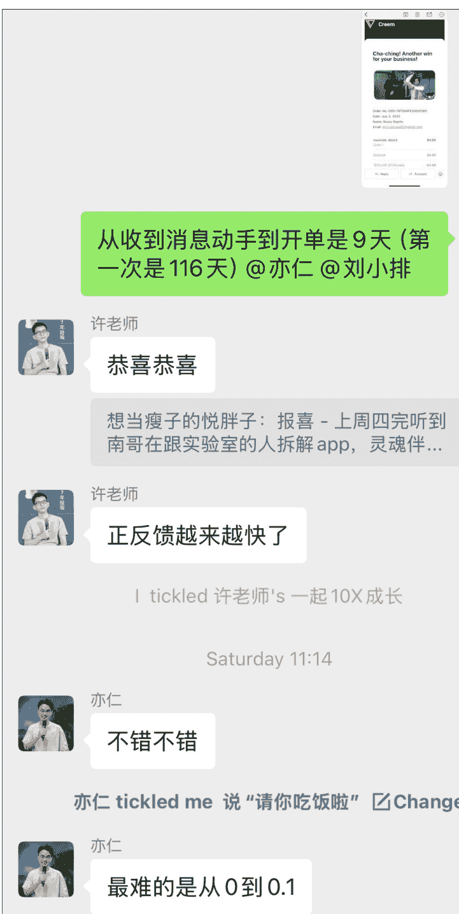
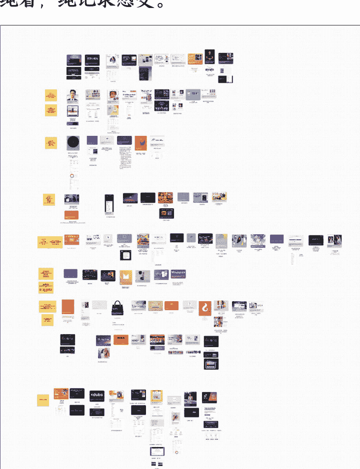
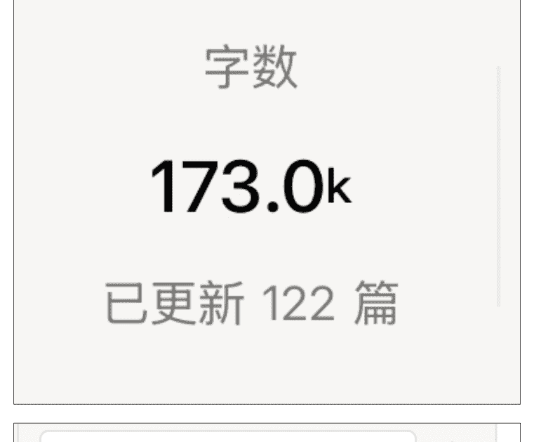
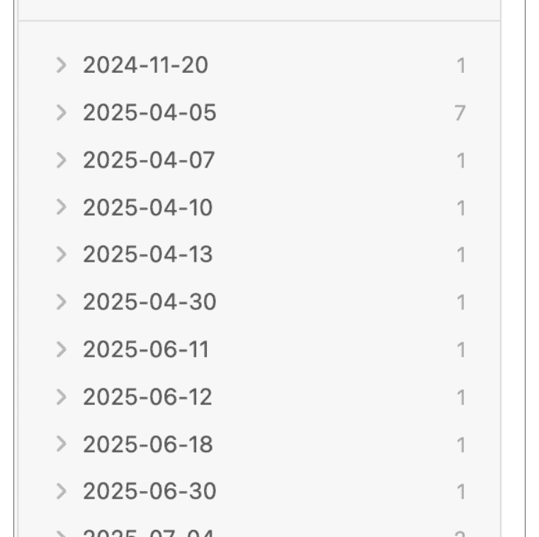
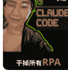

# 深海圈直播答疑 | 9 天出单之 10 倍速增长！

250715 生财精华

公众号懒人搜索，懒人专属群独享

懒人微信：lazyhelper

第一个项目《聊天记录分析》代码 coding 时间超过 800 小时，历时 116 天拿到第一笔订单 9.9 刀。

第二个项目从收到 idea → 制作 → 推广 → 第一笔订单，一共是 9 天时间，说十倍速增长真的不为过。

感谢老师邀约，感谢大家的时间，不过度整理，大家体会精神。关于第一个项目的心酸历程，难产中，估计很快就出来了，3 个多月的日更，整理起来确实有点费时间。

## 1、需求挖掘 / 产品方向

### 1.1 产品需求怎么来的？

新产品的方向是如何选择的？流量是怎么来的？你是如何找到这个需求的？第二个网站是怎么确定产品方向的？上线后，是如何运营推广的？

A: 我自己的第二个产品 idea 是我偷听来的……

其实是亦仁海外团队负责人，我们 SCAI 的一个外援大佬，跟 SCAI 的伙伴拆解一个 APP……

我好奇，就问大哥，刚刚拆的是什么？

他就跟我讲了一下……他说现在这个在 TikTok 上非常火，而且这两个产品疯狂地在投广告，花钱投广告，我就搜了一下，确实非常火。

他就说你可以尝试做一下……

但是如果下个星期三之前你做不出来，我就要在生财里面发帖子了。

我说你不许发😭，我这个周末我就做出来……

时间线如下：

周四的晚上，他跟我说，

我周五的晚上就上了我自己的网站。

周六改 bug。

周日的时候我买了一个新的域名，上了一个新的网站。

上线完之后我就疯狂发视频。我星期天上完了网站之后，我就疯狂地发视频，疯狂地拍视频，疯狂地发视频。

第二个周六凌晨出了第一单。

#### Creem

Cha-ching! Another win for your business!

| 字段 | 内容 |
|---|---|
| Order No | ORD-197D84FE3050F0B9 |
| Date | July 5, 2025 |
| Name | Bruno Duarte |
| Email | brunoetrauda02@gmail.com |
| 商品 | soulmate sketch $4.99 |
| 数量 | 1 |
| 小计 | $4.99 |
| 折扣 | 1DOLLAR (0702code) -$4.49 |
| 操作 | Reply Forward |

#### 日常获取产品需求点子信息的渠道有哪些？在找产品方向的不同来源上，花的时间分配，觉得哪些方法更有效？

A: 这个是 418 的时候，我跟老师见面的时候，老师告诉我的。就是你脑子里面有任何想法、有灵感，你都把它记录下来；你看到了一个新的东西、新的产品或者任何东西，只要有想法，你就立刻记下来，这是一个点。第二个点的话，我自己是每天会看 20 个 Toolify 的产品，做记录。就是纯看，纯记录感受。

#### 灵感记录示例

- **15:39 solo trip** (Notes)
- **15:39 Ai 旅游攻略** (Notes)
- **2025/7/1** 场景：社群运营 (Notes)
- **2025/6/23** Toolify 的 top1000 榜单 (Notes)
- **2025/6/21** 谐音背单词 (Notes)
- **2025/6/21** 我写完的脚本 (Notes)
- **2025/6/21** 快速吧所有的组件全部显 (Notes)
- **2025/6/11** 场景：我要发 reddit，直 (Notes)
- **2025/6/11** 控评区回复 (Notes)

### 1.2 需求验证

> 中外文化差异很大，如何才能找到外国的 “真需求”，并且验证？怎么判断的需求可以做的，验证的指标数据是什么呢？

A: 我其实想说大家可以去看一下我之前的一条帖子《30 分钟验证 idea 是不是需求》，就是怎么快速验证自己的需求。你 30 分钟，你就可以验证你自己的 idea 是不是一个需求。

首先你得描述你的 idea 是什么，你就找到你的 keywords，找到 keywords 之后你就要去榜单里面搜索竞品。搜索到了竞品之后你应该能够看到一些产品。

找到竞品之后你就看他们的核心数据：下载量和收入。

怎么搜索？有七麦、Sensor Tower，这个还挺多的。

看完了核心数据之后，你就大概知道你这个想法有没有人做？他做了之后他的收入如何？……

你还可以去看社交媒体的流量。比如说你找到了那个竞品，你去看看他发的一些内容，他应该有官方号。

### 1.3 第一个产品

第一个站在出单前有一直对这个站进行优化吗？

A: 我做了三次重构。不是我做了，我一共做了三次，重构了两次，一直都有修改，我不停地修改，同时我的推广也在做。

《web 出海建站，小白必学》

## 2、流量获取 / 推广 / 冷启动

第一个产品是通过哪些策略获取到用户/流量吗？SEO 方面如何做的？

A: 我第一个产品其实是因为 TikTok 的一个热度起来的。

但是那个时候我不知道……它 1 月份的时候在那个 TikTok 上爆了、爆火，于是就产生了这个 chat recap 这个词……

1 月份的热点，5 月份我上线了。那明显就是这个热度已经过去了。

我 5 月份上线的时候，我社媒推广也做，SEO 也做，Discord 也做，评论区截流也做。但是就是因为它的热度已经过去了，人已经被人家的网站吃完了，我的网站一直就起不来。

请问两个网站都做了哪些冷启动？

A: 我的冷启动？这些就是社媒推广。所有的社媒，我说的是所有你能够想象得到的所有，Discord 私信。你去潜入所有的竞争对手的 Discord，你每天私信 10 个人。评论区截流就是因为我自己是社交媒体偏 C 端类的，我会去对方发的那些内容底下去截流……

你就是你做一切你能够做的事情。我说的是一切你能做的事情，不管是 SEO 也好，还是社交媒体也好，当然这些都是不花钱的。

## 3、支付 / 定价 / 商业模式

做每个网站都会通过 Creem 接入支付吗？还是先做免费，等有流量后再设计支付功能？

A: 是我每一个网站。因为我只有 Creem，我没有 Stripe，也没有 PayPal，也没有 PayPro，我只有 Creem。我第一个产品有做免费功能，付费解锁；我第二个产品直接是付费解锁。

你已经盈利的产品，是订阅制（月或年套餐）还是一次性付费？对于新手，你更建议哪种方式？

A: 我自己的第一个产品是积分制，第二个产品的话是一次性付费。这个根据产品来的吧，建议可以问 GPT。

### 定价策略

看您第二个产品定价大概是 3 刀每单，请问这个定价是怎么来的呢？用到了什么策略，后续考虑涨价吗？

A: 因为我的产品是一张图，一开始的时候我定价 9 块 9。因为我的那个对标是一个 APP，它的产品定价大概是 10 刀和 15 刀每个月……

结果我再去看人家的 APP，人家的 APP 还有很多附加功能……

我就把价格降到了最低，但是 Creem 价格最低的是 4.49。在 4.49 和 4.99 之间，我让 GPT 给我做了一个抉择，GPT 给我选择了 4.99……

> 在网站上直接用 $ 4.49 最合适。为什么：
> 1. 心理定价效应更强。“4.49”让访客第一眼把价格锚定在“4 美元”，而不是“5 美元”。即使差 41 美分，这种“4-字头”感觉对冲动购买特别有效。
> 2. 跨平台、跨币种都显自然。美元区：$ 4.49 常见于 SaaS、小额订阅、数字商品。英镑区：£ 4.49 也符合当地零售习惯。欧元区：€ 4.49（若想完全本地化，可显示为“€ 4,49”）同样不会违和；欧洲零售既用 .99 也用 .49/.90。如果后续想做本地化 A/B 测试，再把欧元价格改成 € 4.90 或 € 4.99 都很容易。
> 3. 没有平台层级限制。既然是你自己的网站，定价自由度更高，不用担心 App Store 等强制的 0.99 阶梯。保留 4.49 的“9 尾数优势”，又避开最常见的 4.99，让价格看起来“刚好少一点”。

但是我觉得 4.99 刀还是太贵了。因为只出一张图，为了出第一单，我把我的优惠券设置到了一折，也就是说 0.5 美元……

后来我就改了一下我的那个优惠券策略。就是你第一次点击付费的时候不会给你弹优惠券，它如果第二次再点付费的时候，就会给他弹一个优惠券去挽留他。（APP 的挽留策略）

懒人微信：lazyhelper

## 4、心力和坎坷（重点讲）

过去的这 100 多天上线了多少个产品？都有哪些类型？除了上线产品还做了哪些事情？

A: 100 天只上线了两个产品。

我第一个产品做了 116 天出单……第二个产品是 9 天出第一单。

其实因为我真的是一个零基础的……其实在过去的 116 天里面，我学了怎么编程……学习了怎么去看产品、对标产品……推广这一块也是……

那你 AI 编，就是你做产品出海，技术、产品、流量，就其实就是这三块。我过去的 116 天里面这三块我自己全部都摸到了。

第二个产品比第一个产品快了 10 倍，这种巨大提升的最核心原因是什么？是技术能力的纯熟，还是市场和需求的判断力提升？还是工作流程的优化？

A: 那必须得说，肯定第一个是技术。从 idea 到完成上站是 coding 时间 24 个小时……

第二个就是我第一次吃了亏。我第一个产品是 1 月份的热点，3 月份我开始做，5 月份我才做完开始推广。现在就是它正在热点，因为第一次吃了这个亏，这一次我不能吃亏……

工作流的话，我觉得应该是重要紧急 Todo 的一个排序。（我以前会花很多时间在一些并不那么重要和紧急的事情上。）

如何找到用户的？有没有根据用户的反馈做过重大调整？两个产品在找用户的思路上有啥不一样的地方？

A: 首先你得知道你的用户是谁。你发现你描述不出来你的用户是谁的时候就有问题。精准描述。

重大调整倒没有，除非是有 bug，小调整。但是小调整我会先记下来……

两个产品在找用户的思路上有什么不同？

我都是 C 端，我都是去那个 TikTok、YouTube 和 Instagram 上发。

你认为第二个产品比第一个产品出单速度快了那么多的关键原因是什么？

A: 速度快！

快的原因其实是“快”。

### 怎么快？

从 idea 到上站快。从发推广快。

为什么能快？是因为我进步了，我的技术有提升……

热点也是快，你慢的话它就不热了，趁热打铁。

第一个产品的 116 天里做的事情里，哪些是建议新手必做的？

A: 就是三个东西，我都学：技术、产品、流量这三个东西……就在这第一个项目里面，我学习了怎么写代码……

你产品推做完了之后，你一定会学怎么推广……在你去找竞品的时候你会学习怎么去找产品……其实我觉得正经来说其实有点按照项目进程去学习，就是你到了什么时间点，你就会学到什么内容。

请问你觉得自己在做第一个产品和第二个产品之间，在哪些能力上有了明显的提升？哪些是靠实战踩坑提升的，哪些是你自己刻意去学的？

A: 都有……

踩坑其实不会成长，只有复盘以后才会成长。

刻意去学，当然。那比如说我现在刻意去看产品，每天看 20 个产品，那就是在刻意去学……

反正就是你，你没有办法一天成为一个 master，这东西就是你得花时间去积累，去刻意练习。包括我觉得就是这个 Todo 这个重要紧急，这个其实也是你都要刻意去练习的。

请问你觉得自己在 Web 出海这条路上，和其他开发者相比，最大的优势是什么？

A: 我不能跟别人比……但是你找到自己的优势确实很重要。我觉得现在我找稍微找到了一点，我的优势就是公开表达这件事情对于我来说毫无压力。（直播简直易如反掌）

自己毫无压力的东西，做起来毫不费劲的事情，而且自己做起来还挺喜欢的东西，就是自己的优势。

而对于一个项目来说，你觉得能拿到结果最关键的因素是什么？

A: 我觉得是看你目的，看你阶段……

第一个项目，其实我就是学习……闭环就是真正的拿到第一单……第一个项目对于我来言就是学习拿到验证闭环……

那第二个项目的话对于我而言就是先赚到 100 刀……我第二个项目我的关键结果就是 100 刀和 1,000 刀，就是钱。

116 天对你来说有过至暗时刻么？如何调节自己的心态？这几个月的经历中遇到的最大的问题以及如何解决的？在持续看好并优化和看不到结果换方向之间是怎么坚持下来的，信心在哪里？

A: 其实我很多的崩溃时间是，就是你自己其实写日更，就是你自己在创业的过程中你会知道自己其实很多很 down 的时间。很多崩溃的时间是其他人完全感知不到的……

我记得一开始崩溃的时候，是因为我的那个网站怎么都部署不上去，就很想哭……

> 三、无力感+崩溃10086次
> 早上得知自己发布的 TikTok 和 IG 浏览量是 0，明显就是被关小黑屋了。一直都知道需要养号，无论是什么平台，哪怕是微信，其实都需要的养的，但是“知道”真的就是停留在“知道这个信息”的层面上，到自己真的被关小黑屋以后，才后悔，为什么之前不养，明明有一些时间是可以准备的。
>
> 崩溃的瞬间
> 当我以为我只剩最后一步时，求助葱哥，葱哥花了俩小时帮我看代码部署上线……结果当然部署成功了，但是代码有问题啊！还代码太多太乱，连我自己都不知道 AI 到底写了什么、写到了哪里。在葱哥帮我操作的过程中，我回答最多的就是一句话：“我不知道”。那一刻，我突然明白：我想做一个好厨师，却连美味的菜肴是什么味道都不知道，怎么可能成功？离开葱哥那儿回到工位时，我几乎忍不住眼泪。那种感觉太痛苦了：我真的好差，为什么这么差，为什么这么不争气？为了不让看到狼狈的样子，我立刻收拾电脑，坐上回家的出租车。看着葱哥发来的消息，我开始深刻反思……

崩溃是正常的，feel down 也很正常……

我一点不稳定，我天天发疯，原地发疯，真的崩溃会睡不着……

### 写日更真的是一个很好的记录自己的当下的情况的方式，当下的情绪……

### 崩溃记录

96 results

File name (A to Z)

- 2025-03-24 1
- 2025-03-27 12
- 2025-04-01 4
- 2025-04-03 1
- 2025-04-04 1
- 2025-04-10 2
- 2025-04-11 9
- 2025-04-18 1
- 2025-04-19 1
- 2025-04-20 1
- 2025-04-23 1
- 2025-04-26 6
- 2025-05-03 2
- 2025-05-04 4
- 2025-05-05 8
- 2025-05-07 6
- 2025-05-08 1
- 2025-05-10 1
- 2025-05-16 1
- 2025-05-17 1

日更在林悦己的创业实验室，当时是跟着航海的养成系 IP 开始，一直到现在，不知不觉，记录了很多创业心酸史……

### 快问快答

是总共就做了 2 个产品都盈利了吗？还是做了很多个产品，这 2 个开始盈利了？现阶段做多个产品是面对不同人群还是同一批人群？如果我们现阶段也想做多个产品的话，有没有什么建议？

A: 我只做了两个产品，这两个产品是指我上线了两个产品，推广了两个产品。

但是我自己有一些很小的 idea 什么的，我自己有做着玩，那些可能有十几个，但是真正是上线和推广的只有两个，这两个都开单了，第一个是 9 块 9 刀，第二个是已经开了 18 单，66 刀吧。

我的产品人群是不同人群还是同一批人群？因为我做的都是 C 端的产品，而且都是跟情侣相关的，其实算是一批人群。

阶段想做很多产品，有什么建议？我的建议是你可以问老师。

做好产品和追热点找新词哪个更重要一些？

A: 我觉得是看你的阶段。

如果说你的阶段是你出海要挣钱，那么挣钱来说的话，你找新词就容易，有流量……

有流量就更容易。有更大的概率变现。你如果是变现，你也可以找新词追热点，因为他们自带流量。

如果说你是本来就已经财富自由了，但是你有一颗产品的心，比如说你像老师这种，你就可以慢慢做好产品，打磨一个世界上最的产品，中国 XXX 最牛的产品，就类似这种就可以。

如何找到关键词或者新词，这两个产品的关键词来源，怎么找到的？

A: 我没有找，不好意思，我真的没有找，我没有找。

在做一个产品，这产品能满足我的需求，我每天都用，但还没做产品调研。这算是 eat your own dog food 还是算自嗨？

A: 我觉得是 OK 的，没问题。

在我看来就是你，只要是你这个产品能满足你自己的需求，那就是能帮助你自己提效，等于赚钱。

为什么呢？因为你也会去花钱买其他的工具，你给自己解决了这个需求，相当于省钱。反正你买你都要花钱买工具的，你自己做了一个工具，立省 100 刀！

### 后续规划

12 单以后，后续是继续推广这个网站呢，还是继续上新站？有没有什么规划？

A: 我这个产品的热度还没有过，我会继续考虑。不是，我会继续发我的社交媒体。一会直播结束之后，我就会开始继续发我那些很尬的视频。

产品优化：你的产品冷启动后，后续有运营种子用户的社群吗？进行产品的优化和升级吗？你的后续产品规划是怎样的？是继续拓展网站功能还是在做新的网站？

A: 关于种子用户这一块，我自己是有学 Discord 去建立 Discord 的。我两个网站都有，但是没有一个人加。

我第一个产品其实是不停地在改，我重构了两次；第二个产品的话就是我快速地把这个产品的 MVP 做出来了，就是用户能用、能支付流畅，我就开始疯狂地发社交媒体。

你的流量到达了一定的级别，比如说你每天有 1000 个人访问。当有超过 1,000 个用户使用过了，那你这个时候就可以开始考虑你迭代你的产品了。

还没找到需求，一个多礼拜没上站了，不知道要怎么破，请您指导一下，谢谢。

A: 可能是你理解为那种很大的需求。我的建议就是从现在开始，你每天把你所有的想法都记下来，把你所有遇到的困难都记下来。

你每天记10个，一周以后你就会找到50个需求啊。

我说的是工作日，那你周六、周日的时候，你会有50个需求以及难点。

那这个时候你不要说自己没需求了。一个礼拜没上站，我觉得就是你对自己一开始的要求太高了。

## 这些途径中你觉得最快见效的是什么方法？两个产品引流方式一样吗？

A: 因为我两个产品都是针对C端的，我都是去做社交媒体的一些推广。如果是你们来说的话，我觉得是得看你的产品是什么，你这个产品的用户人群是哪些人群？

这些人会出现在哪里？

比如说你的产品如果是卖铲子，那这些人都是程序员，那程序员会出现在哪里？可能是GitHub，可能是大家的群里面，可能是哥飞老师的群里面。那你这个时候你就先加入哥飞老师的群里，是吧？

你就展示你自己就好了，是吧？

“钓鱼法则”的第一条，你得去有鱼的地方钓鱼。

你得去你用户出现的地方，你去那个地方蹲他们，你才可能找到你的用户。

## 做出产品以后，为了出单，做了哪些事情？您认为对于出单来说，重要的事情是什么？

A: 我觉得对于出单来说最重要的事情就是搞流量。流量大了，你转化率再低，你想你1000万的流量，你转化率只有千分之一，你也有1万个用户。我觉得最重要的事就是搞流量，找用户让人看见，其实这三个就是一个点，就是搞流量。

## 如何综合学习知识和上站做产品的？这么长的时间只上两个产品么？

A: 是的。

## 产品开发完发布到 Product Hunt 等进行冷启动，如果没启动成功（每天 UV 50 以内），是不是该放弃了？你是怎么判断产品该继续优化或者推广，还是该放弃的？/ 第一个产品坚持了那么久，期间你是怎么判断应该坚持还是应该换其它产品的？

A: 你问我该不该放弃，我只能说是你得自己决定。就是首先你问我，那我问你几个问题：
- 你的冷启动你做了什么东西？
- 你发了多少评论？
- 上了多少外链？
- 你私信了多少人？

就是你说你冷启动没启动成功，不是说发那个 Product Hunt，就算是进行冷启动成功了，不是你打榜了就是启动了的。

就是你得看你自己做了什么事，该不该放弃，我觉得是你自己的选择。

你给自己一个时间期限，就是在这个时间期限内我希望能够达到一个什么样子的标准。你可以是赚钱的标准，可以是用户量，当然你也可以是访问量……

## 请问您为什么一直坚持做工具站，有没有考虑做游戏站？

A: 我没有做工具站，也没有做游戏站，我做的两个都是跟社交有关的。

## 悦己师姐已经上岸了，为啥还在做短视频博主？/ 在学习和做产品之余，看到您还发视频。在这样一堆事情摆在面前的时候，您是如何判断哪件事是当下最重要的？

A: 我做国内的自媒体纯属于练手……我做国内自媒体就是随便做的，一个是练手，一个是找体感。因为我抖音起号了之后，我这一次再做我第二个产品的 social media 的时候，我就觉得是我的体感上来了。我在做那个 TikTok、还有 YouTube，包括那个 Instagram 的时候，发视频怎么去对标、怎么去找，我觉得就有体感了，这个是国内自媒体练手带来的。

## 数据分析

更多数据

RPA怎么也没想到，自己是被claude code干掉的吧？一句话完成小红书自动创作和发布...

2025年07月05日 10:30

| 数据类别 | 指标 | 数值 |
|---|---|---|
| 播放数据 | 播放量 | 119,243 |
| 播放数据 | 完播率 | 23.22% |
| 播放数据 | 平均播放时长 | 31.85秒 |
| 播放数据 | 3s以上播放率 | 70.26% |
| 互动数据 | （未标注） | 428 |
| 互动数据 | （未标注） | 1,802 |
| 互动数据 | 评论 | 90 |
| 互动数据 | 新增关注 | 37 |
| 分享数据 | 转发总量 | 4,538 |
| 分享数据 | 转发到聊天 | 4,511 |
| 分享数据 | 转发到朋友圈 | 27 |
| 分享数据 | 设为铃声 | 0 |

（视频很糙，但是也有人看。2小时整4条视频，从拍摄到剪辑……那条视频号10万播放的套壳刘小排就是快速拍的~）

## 如何才能进 SCAI 实验室？

A: 写申请给许老师。

懒人微信：lazyhelper

这两个网站都是接入的 Creem 支付吗？接入 Creem 过程中最想提醒我们避的坑有哪些？如果被 Creem 拒绝短时间内无法恢复的话，最推荐新手用哪个平台？

A: 是啊。新手最推荐哪个平台？你能用哪个平台就用哪个平台。如果你能上 Stripe，你当然上 Stripe。因为 Creem 我接得很早，我大概是3月份就接了，我没有怎么遇到坑。

平时需求的发掘、整理，以及开发后网站运营、用户管理都是怎么做的？

A: 我目前没有留存任何海外用户。我第一个产品是有留邮箱，我收到了我的用户，就在我用户注册之后我会给他发邮件。我第二个产品是没有留任何东西，我只有在数据库里记录他们填的信息，但是没有留他们的任何联系方式。压根没有用户，怎么管理呢？对吧？

## 碎碎念

感谢亦仁的支持，感谢老师的邀约，感谢大家的时间看我的2小时直播，感谢大黄哥帮我拥有一个干净的环境能疯狂发视频，感谢二哥葱哥的技术支持，感谢 SCAI 小伙伴的陪伴和鼓励，感恩遇到的一切，包括那些让我崩溃的bug！

崩溃常在，总会过去。

林悦己：0基础出海，没有技术，没有产品经验，不是互联网运营出身，但是只要我足够努力，持续成长，总有一天能干翻大家！

最后，安利小懒的付费群：

### 懒人专属群

懒人专属群持续更新中，已持续运营6年，整理超3000份各类精选付费文章&年费社群干货，全部开放下载。

本资料为付费群内部分享，仅供真实有需要的朋友查阅

懒人专属群更新记录：
https://lazy2025.top/#/blog/record2

懒人专属群更新记录（需梯子，备用）：
https://lazybook.fun/#/blog/record2