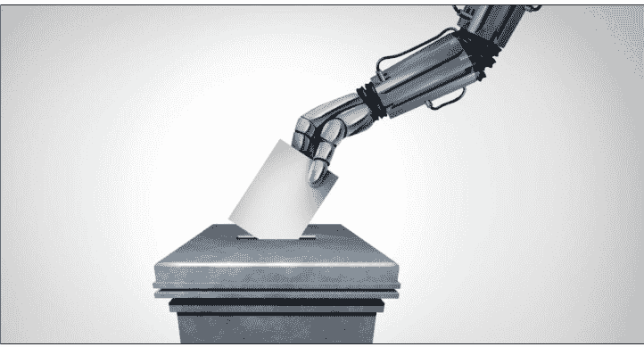

# AI 如何影响选举

250717 新闻实验室

整理：公众号懒人搜索，懒人专属群独享

懒人微信：lazyhelper

69%的案例都是 AI 发挥了有害作用，只有 16%是良性的使用。

## 新闻实验室会员通讯（855）AI 如何影响选举

去年（2024 年）被称为“史上最大选举年”，全球超过 60 个国家/地区举行了国家级选举，涉及世界一半以上的人口。而这一年也标志着生成式人工智能技术首次在选举中发挥巨大影响力。

根据由全球信息环境研究专家组成的国际信息环境委员会（IPIE）发布的最新研究报告，在 2024 年举行了竞争性国家级选举的国家/地区中，有 80%都出现了生成式 AI 的使用案例。这项全球性研究收集了 215 个 AI 应用于大选的案例，并揭示了一个令人不安的趋势：在这些案例中，69%都是 AI 发挥了有害作用，只有 16%是良性的使用，其余 15%属于影响不明确。

本期会员通讯，我们就来了解这份研究报告的内容。

## AI 对选举的影响遍布全球

在报告收集的案例中，最引人注目、也最戏剧化的例子之一来自罗马尼亚。

在该国去年的总统选举第一轮投票中，一名此前鲜为人知的极右翼候选人克林·杰奥尔杰斯库（Calin Georgescu）异军突起。他的崛起，很大程度上要归功于在 TikTok 上获得的超高人气。他发布短视频讨论罗马尼亚普通民众的困境，比如经济危机和通货膨胀，并将自己塑造为能够对抗精英的草根，引发许多共鸣。

然而，第一轮投票结束、克林·杰奥尔杰斯库取得领先优势后，罗马尼亚宪法法院取消了该轮结果，理由是选举过程受到俄罗斯的干涉，其中就包括俄方使用水军推广克林·杰奥尔杰斯库的 TikTok 账号。根据罗马尼亚外国情报局的说法，俄方使用了 AI 技术来影响罗马尼亚国内舆论。而欧盟也对 TikTok 发起了调查，指控其未能遏制罗马尼亚的选举干预行为。

戏剧性的是，在几个月后举行的重新投票中，类似的虚假内容再次涌现。

这一次，38 岁的极右翼候选人乔治·西米翁（George Simion）在第一轮投票中获得了高达 41% 的选票。此人年轻时曾是一名足球流氓，竞选时以川普粉丝的形象示人，他同样是利用民众对经济困境的不满，发表民粹言论，并非常亲俄。

在有利于该候选人的社交媒体宣传中，就包括 AI 制作的假视频，让特朗普似乎在批评罗马尼亚现任领导人。不过，在第二轮投票中，乔治·西米翁败给了亲欧洲的中间派候选人尼库绍尔·达恩（Nicușor Dan）。

OpenAI 在德国 2 月份的选举期间也检测到俄罗斯的干预行动，其中一个机器人账户在 X 平台上积累了 27000 名粉丝，发布支持德国另类选择党（AfD）的内容。

在波兰，社交媒体上出现了一些捏造的帖子，声称恐怖袭击可能会迫使波兰取消选举。这些帖子后来也被认为与俄罗斯有关。

印度和美国是记录大选中 AI 使用案例最多的国家，各有 30 则案例。

在印度的选举中，AI 被用来“复活”已故政治家，制作虚假的音频和视频背书，并通过打电话播放录音，以及利用社交媒体发送视频的方式进行传播。当地科技公司利用 AI 技术向印度南部两个州的选民拨打了 2500 万个个性化 AI 电话。

在美国，由伊朗支持的干预者开展了“Storm-2035”计划，使用 ChatGPT 生成长篇文章和短篇社交媒体评论。长篇文章发布在伪装成进步派和保守派新闻机构的五个网站上，短评论以英语和西班牙语发布在 X 和 Instagram 等社交媒体平台，部分评论通过改写其他用户的帖子生成。这些内容主要涉及加沙冲突、以色列参加奥运会和美国总统大选，次要主题包括委内瑞拉政治、美国拉丁裔群体权利和苏格兰独立。为增加真实性或吸引关注，政治内容中还穿插了时尚和美容话题。

在加拿大 4 月的大选之前，X 频道上出现了一张 AI 生成的照片，照片中显示总理候选人之一马克·卡尼（Mark Carney）与声名狼藉的金融大亨、性侵犯杰弗里·爱泼斯坦（Jeffrey Epstein）在一起游泳。

在韩国大选中，一段 AI 生成的虚假视频内容是：时任韩国总统候选人的李在明假装绝食，从病床上生龙活虎地坐起来。

在巴基斯坦，一个涉及川普的伪造视频流传。在视频中，川普说如果他重新当选，将“尽力让伊姆兰·汗（前巴基斯坦总理）尽快出狱。他是我的朋友。我爱他。我将支持他重新接管政府”。

台湾地区的选举中也出现了 AI。在一个 AI 伪造的视频中，一名女性声称民进党候选人赖清德有三个情妇和私生子。

孟加拉国选举日当天，AI 生成的视频在社交媒体上传播，其中一个深度伪造视频中，一位独立候选人宣布退出选举。

在纳米比亚，AI 生成的语音声称：美国总统拜登支持当地的某个政治党派。

如此种种，AI 对大选的影响已经遍布全世界。

## AI 操纵的主要形式和幕后推手

IPIE 的研究报告显示，90% 的 AI 使用案例涉及内容创作，包括图像、音频、视频和社交媒体帖子的生成。这种现象的普及，当然是因为 ChatGPT 等大型语言模型和 MidJourney 等图像生成工具在 2022 年发布后迅速普及，使有关方面能够轻松制造逼真的虚假内容。

另外，有 24% 的案例涉及使用 AI 来放大传播某些政治信息，为其造势。例如，在加纳，一个由 171 个虚假机器人账户组成的网络在 X 平台上使用 ChatGPT 生成内容来推广执政党。在印度，九个 AI 语音克隆被用来在全国选举期间传播虚假信息。

令人担忧的是，在 46% 的案例中，AI 使用者的身份无法确定。这种匿名性为恶意行为者提供了掩护，使他们能够在相对不受惩罚的情况下传播虚假信息。

在能够确定身份的案例中，外国干预者占 20%，本国政治候选人和政党占 25%。而其中已知的外国干预案例 100% 都具有恶意目的。

特别值得注意的是，女性政治家面临着不成比例的 AI 攻击。在多个国家，AI 技术被用来制作贬低或诽谤女性候选人的内容，试图损害她们的声誉。例如，在墨西哥，AI 技术被用来诋毁和骚扰两名竞选总统的女性候选人。

当然，并非所有的使用都是邪恶的。比如，有候选人使用 AI 将演讲和政纲翻译成各地方言，以服务于多元化的选民群体。又比如，在日本，政治候选人使用聊天机器人代表候选人回答问题，与选民沟通。

实际上，在政治候选人和政党使用生成式 AI 的案例中，有 38% 都被认为是良性的。

还有的案例很难说是好还是坏。比如，在英国，一个名为“AI Steve”的 AI 候选人正式出现在国会选举的选票上——当然，它并未当选。

## 对民主制度的深远威胁与应对挑战

AI 给民主选举带来的挑战是前所未有的。过去，外国干预依赖于“网络水军工厂”的工作人员在社交媒体上生成账户和内容，通常使用生硬的语言，也根本不了解当地文化。而 AI 技术使得这些工作可以用此前无法想象的速度和规模完成。

智库 Institute for Strategic Dialogue 的研究员 Isabelle Frances-Wright 在接受《纽约时报》采访时说：“在人工智能出现之前，希望干预选举的人必须在质量和规模之间做出选择——如果要质量，就要依靠人类水军；如果要规模，则要依靠机器人，它们可以为你提供大量内容，但质量不高。而现在，AI 可以让你两者兼得，这真是一种可怕的现实。”

AI 的威胁还体现在“说谎者红利”（liar's dividend）现象上：当人们了解到 AI 生成的内容越来越逼真时，那些声称“真实内容是 AI 生成”的说法也就变得更具说服力。换言之，既然假的这么像真的，那么撒谎的人也就可以更加放肆地把真的说成假的。

这已经在发生了——人权组织 WITNESS 的执行董事 Sam Gregory 向《连线》杂志透露，在他们收集的案例中，大约三分之一是政客借 AI 之名来否认真实事件——许多都是他们否认被泄露出来的对话等资料，声称它们是被伪造的。

社交媒体平台虽然制定了管理 AI 滥用的政策，但研究人员认为，它们应该做更多工作来限制误导性或有害内容。在印度的选举中，Meta 平台上大部分 AI 内容都没有按照公司要求进行标记。圣母大学的研究人员发现，AI 工具生成的虚假账户能够轻易规避八个主要社交媒体平台的检测，包括 LinkedIn、Mastodon、Reddit、TikTok、X 以及 Meta 旗下的 Facebook、Instagram 和 Threads。

面对这一挑战，各国政府和国际组织正在探索应对措施。欧盟除了对 TikTok 在罗马尼亚选举期间的角色进行调查之外，也在调查该平台在爱尔兰和克罗地亚选举活动中的作用。

AI 技术对选举的影响远不止表面的虚假信息传播。专家警告，这项技术正在削弱对选举完整性的信心，侵蚀民主社会运作所必需的政治共识。

正如研究 AI 的能力和危险的非营利组织 CiVAI 的创始人 Lucas Hansen 在接受《纽约时报》采访时说的，他担心的不仅仅是 AI 欺骗选民的潜力，更是 AI 正在混淆公共辩论，使人们变得幻灭。“信息生态系统的污染将是最难解决的问题之一，我不确定有什么方法可以回头。”

最后，安利小懒的付费群：
懒人专属群 懒人微信：lazyhelper

微信:lazyhelper

📖 懒人专属群持续更新中，已持续运营 6 年，整理超 3000 份各类精选付费文章 & 年费社群干货，全部开放下载。

本资料为付费群内部分享，仅供真实有需要的朋友查阅 🙇

懒人专属群更新记录：
https://lazy2025.top/#/blog/record2

懒人专属群更新记录（需梯子，备用）：
https://lazybook.fun/#/blog/record2