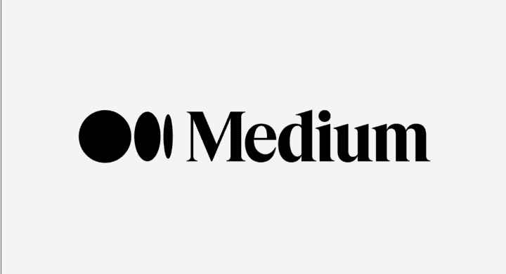

# Medium 绝地求生

250717 新闻实验室

整理：公众号懒人搜索，懒人专属群独享

懒人微信：lazyhelper

微信:lazyhelper

做支持优质内容生产和消费的平台，又多了一个未能实现野心的案例。

## 新闻实验室会员通讯（856）Medium 绝地求生

你还记得 Medium 这个网站吗？

它曾经是互联网上最纯粹、最优质的写作平台之一。大概在 2012-2017 年间，Medium 经历了它最辉煌的几年，一度成为那些有重要信息和观点分享的写作者们的网上家园。

然而，近些年来，Medium 却陷入了前所未有的困境。你可能也已经很久没有听说过这个网站的名字了。

好在，正如现任 CEO Tony Stubblebine 在几天前的一篇长文中所写，Medium 已经走出了危机，算是活过来了。

这家公司的起起落落，也是互联网内容生态及商业困局的一个缩影。本期新闻实验室会员通讯，我们就基于这篇长文，对Medium绝地求生的过程做一番深入了解。

## 「从辉煌到困境：Medium 如何掉进深坑」

Medium 创立于2012年，创始人Evan Williams 还曾是 Blogger 和 Twitter 的联合创始人。他创立 Medium 的最初动机，正是希望在140个字母的Twitter 之外，建立一个可以进行长文写作和分享的平台。

按照Tony Stubblebine 的说法，Evan Williams 在 Medium 带领过两个重要时期。第一个是“设计时代”，也即从无到有创造了一个写作平台，让写作、发表和阅读的体验得到了极大的简化和美化，很多人使用Medium 正是因为它提供了一种美好的用户体验。第二个时期是“新商业模式时代”，也即2017年开始建立付费墙，在广告模式之外寻求更能激发优质内容生产的商业模式。

推出付费墙的时候，Medium 给出的定价是5美元一个月，可以通览全站所有文章。而发布文章的作者，每篇文章得到的报酬是一个固定的数额，与阅读量无关。

为了让 Medium 上有足够多吸引人订阅的文章，公司雇佣了一支经验丰富的媒体高管和编辑大军，然后联系撰稿人创作了几千篇专业制作的文章。在这种模式的激励下，付费会员数量一度增长到超过 76 万。

然而，正是这种商业模式让公司开始滑入深坑。Tony Stubblebine 总结说：事实证明，既要让互联网变得更好，又要服务读者和作者，还要成为一桩可持续的生意，同时抵制骗子、营销号和网络喷子，这实在是一件几乎不可能完成的任务。

一个重要的原因当然是钱：会员的付费无法支撑巨大的内容生产开销。

更何况，这种模式还打击了 Medium 上原有的一群写作者的士气。

那是因为，在这种付费商业模式下，公司的战略逻辑是：只有最高质量的内容，才会吸引人们付费，因此 Medium 应该通过付费给大量专业作者，来提供这种高质量内容。

可是，当时的 Medium 已经有 5 年的积累，有一批非专业写作者在上面活跃贡献内容，尽管这些内容可能质量参差不齐，但这种社区氛围是良好的。有了付费墙之后，这些非专业写作者们感到：专业人士把“氧气”都吸光了，所有的注意力、资源都分配到了他们身上。

回头看，Tony Stubblebine 认为，Medium 最好的时候，是为那些不试图成为专业内容创作者的人提供平台，这些非专业的声音往往能讲出最有价值的故事。他觉得，互联网不能只为媒体专业人士、网红、骗子和营销号服务，也必须有一个地方供普通用户分享自己的所思所想和日常偶得。

烧钱雇佣专业人士撰写高质量内容的模式，到 2022 年左右再也无以为继了。Medium 当时的做法是：向站内的内容生产者撒钱，激励他们出产优质内容。可是，这样的内容激励计划同样行不通，因为它吸引了大量来骗钱的营销号，它们让 Medium 变成了一个充斥着标题党和低质内容的平台。

Tony Stubblebine 的文章中甚至提到了当时的营销号们流行的一种做法：找一篇维基百科文章，给它加上一个耸人听闻的标题，将内容改写成煽情的、几个字就另起一段的脑残体，这样一篇文章甚至可以在 Medium 上赚到 2 万美元。

这样的状况当然更令 Medium 的员工们绝望，大家一度怀疑：如果只是给这种营销号送钱，我们为什么还要来上班？

## 「破产边缘的挣扎」

2022 年 7 月，Tony Stubblebine 从 Evan Williams 手中接过 CEO 的职位——后者成为董事会主席。

新上任的 CEO 面临着双重任务：修复内容质量和修复财务状况。当时，Medium 的财务状况岌岌可危，每月亏损 260 万美元，而且还在不断失去付费会员。也就是说，亏钱不是因为公司在发展业务，而是一边亏钱一边业务萎缩。

投资者当时基本上对 Medium 已经放弃了——对他们来说，投资失败是很正常的事情，所以他们也没什么兴趣要让 Medium 爬出深坑。公司当时欠着这些投资者 3700 万美元的逾期贷款，这意味着公司在纸面上资不抵债。

投资者还持有额外的 2.25 亿美元清算优先权——这是最常见的创业投资条款，目的是让投资者在员工得到任何回报之前先收回他们的投资资金。对于当时的 Medium 来说，这等于告诉员工：即使你们继续努力工作多年，终于让 Medium 赚钱了，赚来的钱也都会 100%流向什么事都不用再干的投资者，而不是累死累活的员工。

这显然是一件需要改变的事情。不然，员工们不会有士气去努力工作。

身为 CEO，Tony Stubblebine 还继续受到投资人的掣肘——对于重大决策，他需要获得五个不同投资者群体的多数票，即便这些投资者早已放弃这家公司，甚至正在考虑将他们的持股出售给那些专门收购垃圾股份的人。更复杂的是，Medium 还拥有并运营着另外三家公司。

面对如此复杂且令人绝望的局面，Tony Stubblebine 得到了一个最好的建议：不要做英雄。也就是说，不要去发明新东西、新方法，因为即便有再好的新东西，即便有超强的执行力，也可能被这些投资者中的任何一个突然破坏。

总之，Medium 自救的方法不是推出新的商业模式、新的产品，而是在目前的窘境下小心腾挪，寻找爬出来的可能。

## 「绝地重生：从月亏 260 万美元到盈利 7000 美元」

2024 年 8 月，Medium 实现了 7000 美元的月盈利。自此之后，公司一直保持盈利，他们将小部分利润用于应急储备，而大部分则重新投资于改善 Medium 的产品。

在 2 年时间里，从月亏 260 万美元扭转为盈利，Medium 是怎样做到的？

首先是重新调整公司的资本结构（recapitalization）。简单来说，就是要投资者们同意放弃自己的一些特殊权利，如清算优先权和治理决策中的角色，只有这样，员工们才会有动力带着公司向前。他们的贷款还被要求转化成股权。此外，投资者们的股份还会被大幅度稀释——比如，如果他们曾经拥有公司 10%的股份，之后可能只拥有 1%。当原有投资者的股份被挤压到一个更小的池子里，现有的团队和新的投资者才能有前进的空间。

显然，recapitalization 是要让投资者们“割肉”。那么，他们为什么会同意呢？

原因有三。第一，当时的 Medium 看上去已经是死局，不割肉的话，可能公司整个就灰飞烟灭，什么都没有了。割肉的话，起码还能留点股份，留点希望。

第二，Tony Stubblebine 威胁投资者说：你们不接受割肉的话，管理层就会集体辞职，那样的话，Medium 灰飞烟灭就是几乎马上要发生的事情了。

第三，当时创业市场很低迷。如果市场好的话，投资者其实可以逼迫 Medium 出售，然后他们套现走人。但是，因为市场不好，投资者们也知道，根本就卖不出去。所以，也就没有别的选项，只有两种选择：不割肉，公司灰飞烟灭；或者割肉，让员工们放手一搏。

投资 Medium 的都是一些大牌的 VC。Tony Stubblebine 说，其实他们都很好说话，谈判过程并不艰难。

值得一提的是，在这个过程中，持有股权的初始员工也被迫割肉了。所以，Tony Stubblebine 打电话给他们每一个人，告诉他们：其实你们手上的股权很可能是一文不值，割肉的话还可能让它有一点点价值，更重要的是，这样做意味着他们建设 Medium 的工作不会白费。

这个 recapitalization 的过程就好像是一轮融资。Medium 此前经历了无数轮融资，多到字母都不够用了，甚至用上了 “XX 轮” 和 “Z 轮”。他们的律师将这次 recapitalization 命名为 “A prime 轮”，代表公司的全新开始。

除了重组之外，公司走出困境还必须实现日常经营的扭亏为盈。他们做了三件事：更多会员、更低成本、更少员工。

- 首先，他们通过内容质量上的控制，止住了订阅用户数量下跌的趋势。
- 其次，他们租用云服务器的成本从每月 150 万美元削减到了 90 万美元，这是通过大量的工程优化和内部纪律完成的。在 Medium 内部，员工们的目标围绕着一个阶梯展开，每一步代表多赚或者多省 1 万美元。
- 第三，Medium 的员工数从最高峰的 250 人减少到了现在的 77 人。

他们还退掉了在旧金山的一个 120 个座位的办公室，租金是每月 14.5 万美元。但是退租的过程并不容易，因为经过疫情，包括 Medium 在内的很多科技公司都转向了远程办公。这样一来，就根本没有人接手这个办公室。所以房东坚决拒绝 Medium 提前退租。Medium 方面一度提出：能不能把余下的租金都提前付了以退租，这样起码不用再付水电费和维护费用，但房东依然拒绝。直到过了很长一段时间，大概是房东那边和自己的投资人谈好了条件，Medium 才得以退租成功，如今是一家完全远程协作的公司。

总结而言，Medium 绝地求生的故事不是什么英雄大片，没有什么石破天惊的产品创新或商业模式创新，而是一个如何兢兢业业把烂摊子收拾好的故事。在最辉煌的时候，Medium 的估值曾经高达 6 亿美元，而现在，Tony Stubblebine 拒绝透露公司的估值，他只是表示：Medium 已经盈利了，而其他很多高估值的创业公司都还在亏损。

这的确已经是了不起的成就了。当然，它也是一个有些苦涩的成就，毕竟，Medium 的影响力已经大幅萎缩，也不再被视为某种成功模式的代表。在这个时代的互联网上，做支持优质内容生产和消费的平台，又多了一个未能实现野心的案例。

最后，安利小懒的付费群:

## 懒人专属群

公众号：懒人搜索
懒人专属群

微信:lazyhelper

懒人专属群持续更新中，已持续运营 6 年，整理超 3000 份各类精选付费文章 & 年费社群干货，全部开放下载。

本资料为付费群内部分享，仅供真实有需要的朋友查阅

懒人专属群更新记录：
https://lazy2025.top/#/blog/record2

懒人专属群更新记录（需梯子，备用）：
https://lazybook.fun/#/blog/record2