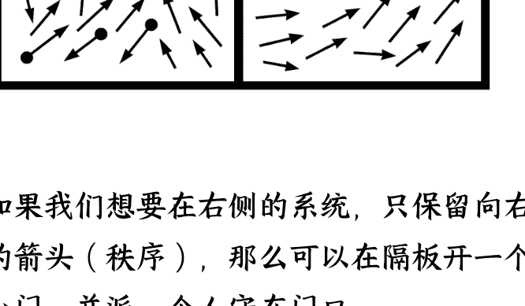
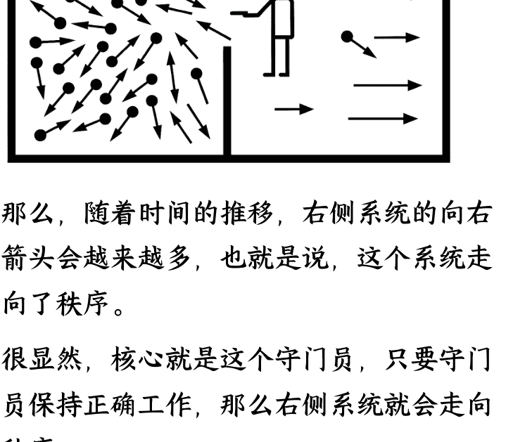
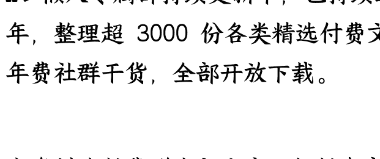

# 如何系统的提高成功概率?

## 250717 生财精华

公众号懒人搜索，懒人专属群独享

懒人微信:lazyhelper

有没有一个公式，可以帮助创业全过程的决策？

大家好，我是包子

在过去的两年，我裸辞转行到了一个完全陌生的领域，一个人在家里做到了赛道头部IP，具体的心路历程可以参考生财的这篇文章

## AI+IP,一人公司,如何狂奔到垂类赛道TOP10

https://mp.weixin.qq.com/s/C2DTG9WobnlPwM2eeTsncA

创业中找方向和坚持是最难的，所以大家都强调早点取得正反馈，而在高考志愿这条赛道，高考每年就一次，填志愿也就几天，其他时间别说正反馈了，连反馈都没有。

其他时间，全靠自已不断的调试方向，那么如何持续修正方向？做出合理的决策呢？

作为一个理科生，我希望找到一个公式或者思维框架，能够应对创业中的全部情况。

没想到还真被我找到了！这个公式不仅可以应对创业，我已经把它运用在了生活的方方面面，都取得了很好的效果。

那就是【熵增定律】的麦克斯韦版。

# 系统为何走向衰败/成功

任何系统，在没有外界干预的情况下，都会走向混乱，混乱导致衰败。

这个世界的大大小小，都是系统。“管理一个集团”，“做出一桌好菜”，“养成一个好习惯”，都是系统。

放在户外的自行车，过一年车身就会锈迹斑斑，轮胎会漏气干瘪。

公司无论大小，只要没人干预，放任自如，就会走向混乱，走向破产。

孩子的学习，如果没有自己、老师和父母的刻意干预，就会越来越糟。

房间只要没人收拾，就会越来越乱。

......

可能很多朋友讲，这就是中学物理，基本常识而已，没什么特别的啊。其实这条定律也可以反过来。

任何系统，在合理干预下，都可以走向秩序，秩序通向成功。

把自行车放进室内，定期维护，过几年都可以保持很新的状态，甚至会更好骑。

公司上下团结一心，目标明确，不断学习，迭代SOP，业绩大概率会变好。

孩子和父母沟通顺畅，学习认真，作业工整，成绩大概率会提高。

定期打扫整理房间，屋子就会很整洁。

......

我用这个视角观察世界已经两年多了，还没有发现任何例外。毕竟是基本物理定律，人类认知世界的巅峰。如果你发现了例外，一定和我说一说。

创业也是一个系统，如果这个系统的秩序程度不断增加，那么成功的概率就会增加。

那么问题来了，既然系统会自发的走向混乱，这和我们的预期恰好相反，如何避免混乱，走向秩序呢？

通过阅读科学史，我找到了物理巨佬麦克斯韦的思维实验。这个实验极大的震撼了我，时隔两年都还记得当时内心的澎湃，这就是我一直寻找的“成事心法”。

# 麦克斯韦的思想实验

整个宇宙也是一个系统，根据熵增定律，宇宙的熵就在走向热寂和衰败，这让物理学家无法接受。

如何让系统走向秩序呢？麦克斯韦提出了他的想法。

（以下叙述经过我的加工，更容易理解，并非麦克斯韦的表达原版）

这是一个混乱的系统，系统中的箭头方向各异，随机移动，毫无秩序。

我们在系统中间增加分隔，左侧是外界，右侧是内部系统。虽然增加了分隔，目前左侧的外界系统和右侧的内部系统都是同样混乱的。

如果我们想要在右侧的系统，只保留向右的箭头（秩序），那么可以在隔板开一个小门，并派一个人守在门口。

当“守门员”发现了来自左侧的【向右的箭头】想要去右侧系统，就放它通过。

当“守门员”发现了来自右侧的【不是向右的箭头】想去左侧，也放它通过。

其他情况都不予放行。

那么，随着时间的推移，右侧系统的向右箭头会越来越多，也就是说，这个系统走向了秩序。

很显然，核心就是这个守门员，只要守门员保持正确工作，那么右侧系统就会走向秩序。

守门员代表了各种身份，创业者是事业的守门员，父母是孩子的守门员，自己是健康的守门员，只要有系统，就有守门员。守门员通常不一定是某个具体的人，当做一个在系统前的“自动门禁系统”更好理解。

守门员想要【正确】工作，只需要四个动作：

获取正能量：有正能量才能干活。薪酬、流量、吃饱饭、好情绪，都是正能量，反之坏情绪、生病，都是负能量。

## 生财的运动航海，推荐大家都参加

获取正信息：知道什么箭头是对的，什么是错的。判断信息质量很难，总体来讲，付费信息比免费信息质量更高，大佬的信息质量更高。

判断：判断的箭头是哪种。这一步在创业圈一般称为“认知”或“决策”，判断质量非常依赖前两步。

行动：放行/不放行。执行计划。

# 守门员四步法

获取正能量 > 获取正信息 > 判断 > 行动

说起来容易，这其中坑也挺多，正能量让人充满动力，负能量就不想干活了，正信息帮助正确判断，负信息导致错误判断。讲得太抽象，用案例来解释吧。

# 案例

## 做 IP 过程中的一些决策

一个人在家做 IP，每天都在做决策，怎么根据这套框架来做决策呢？

## 视频如何做到行业标杆

自媒体都想做爆款，那么如何做出爆款视频呢？

从麦克斯韦的角度出发，怎样让【做爆款视频】这个系统更加秩序？

系统名称：做爆款视频

获取能量
能涨粉，有认可，有正反馈，自然有能量做这事。

获取信息
拆解赛道头部 IP 的知识结构，我也要掌握拆解全平台最优秀的视频表达形式。

判断
哪些是我能做到的。

行动
调研了全部专业，写了 30 万字的稿子，做了全专业讲解视频。

通过不断重复着几个步骤，我的视频做成了行业教材。

当然，这个系统还可以细分，怎么做好调研是系统，怎么写稿子是系统，怎么做视频也是系统。

## 直播起号过程中的决策

在我的直播间起号过程中，有不少机构来招募，甚至开出了百万薪资，当时我的收入是0，那么该怎么做决策呢？

从麦克斯韦的角度出发，如果帮机构带货，会让【直播间做到头部】这个系统，更加秩序，还是更加混乱？

系统名称：直播间目标赛道头部，是否帮机构带货

能量判断
过早的进入机构的商业逻辑，会消磨直播的热情，属于负能量。

信息判断
帮机构带货，对直播间没有正信息输入。

判断
帮机构带货，对直播间做到赛道头部是负面作用。

行动
婉拒机构的邀约。

于是我婉拒了机构的邀约，按照自己思路打造直播间，三个月就做到了赛道头部，收入也超过了机构的大饼。这也仅仅是直播起号过程中的一个决策而已。

## 和生财合作 AI 课程

在今年3月30的大会，上午做完分享，下午许老师就找到我，聊了聊能不能开一门线下的 AI 课程，讲一讲自己是怎么一个人做到这么多事情的。我快速在脑海里过了一遍思维框架，对自己的高报 IP 主业有什么影响？

从麦克斯韦的角度出发，如果和生财合作 AI 课程，会让【高报 IP】这个系统，更加秩序，还是更加混乱？

系统名称：高报 IP，是否应该做 AI 课程

能量判断
做 AI 课程会倒逼我把 AI 用得更好，对于超级个体肯定是正能量的。
如果我能把 AI 课程教好，根据费曼学习法，那我对 AI 的理解就更深入，也是正能量。
如果在 AI 课程上花费太多时间，可能会影响今年的内容创作，这个是负能量。

信息判断
AI 是一个趋势，也是高校的短板，家长和同学都很关心，做 AI 课程需要主动摄入很多 AI 信息，对高报 IP 打造属于正信息。
做 AI 课程，对于我的高报 IP 打造是有好处的。
如果花太长时间备课，可能会影响今年的内容创作。

行动
高报 IP 应该开展 AI 课程。

通过顺利开展了两期线下课，同时我也成了家长眼中的【AI 高手】，又给高报 IP 叠了一层 BUFF。

很多家长想让孩子跟着我学 AI，我又判断了一下，觉得目前不值得，所以婉拒了家长们的想法。

## 刚进生财，自己单干，还是参加航海？

既然航海手册都是公开的，为什么要参加航海呢？为什么不自己单干？

从麦克斯韦视角出发：自己单干，还是参加航海，让系统的秩序速度更快？

系统名称：创业初期，让系统的秩序速度更快

能量比较
航海：参加航海有教练带领，有干活氛围，有相互鼓励，即使没有正反馈也更容易坚持。
单干：需要持续的给自己鼓劲，需要独自在没有正反馈的情况下坚持。
结论：在获取能量方面，参加航海当然比单干更好。

信息比较
航海：在群里的信息更多，有教练、助教帮忙，大家也能相互答疑，信息质量比单看航海手册当然更好。
单干：没有答疑，没有群友互助。
结论：在获取信息方面，参加航海当然比单干好。

在小排老师的《加入生财第一周，做什么最重要？》，提出的「全覆盖级阅读生财有术」，实际上也是获取足够多的信息，只有信息足够多，判断和行动才不会走偏。

判断比较
航海：做得好不好，问题出在哪，有教练和助教帮你判断，有同一条船的圈友作为对比。
单干：全靠自己判断，如果是行业小白，判断质量不会偏离平均值。
结论：参加航海的判断质量远远高于自己单打独斗。

行动比较
航海：需要打卡干活，需要交作业，划水的概率比自己单干要小很多。
单干：执行力看自己了，呵呵。
结论：参加航海的行动质量一般会高于单干。

所以，刚进生财，应该积极参加航海，而不是自己单干。

## 根据趋势干活，还是优势干活？

在《如何提高做产品的成功率？》中，小排已经给出了答案：

## 二、顺势而为

这里有两个势，一个是你的优势，一个是趋势。

哪个更重要？与很多人想的不同，杜国楹先生认为优势更重要。我完全同意他的看法。

从麦克斯韦的视角出发，按照哪个势干活，能让你的系统秩序化更高，就按哪个走。

什么是优势？就是你在这个系统中，秩序的程度已经很高了，成功概率更高。如果贸然进入一个陌生的行业，那么你的这个系统就是一片混乱，积累秩序的过程很慢的。

什么是趋势？就是这个系统，会持续不断地迎来正能量，秩序程度也在不断提高。哪怕躺平也可以跑过行业平均水平，但是同体系中，比不过有优势的系统。

所以，在大部分情况下，应该根据优势干活。毕竟已经有一定秩序了。

那么，如果要根据趋势干活，要注意什么呢？

某个行业有势不可挡的正能量输入，按部就班的工作，这个系统都会额外的走向秩序。比如2005年的房地产，2010年的移动互联网，现在的自动化+AI。

相反，如果你的系统，正在迎来持续的、不可抗力的负能量，那就赶紧撤吧。比如 2018 年后的房地产、基础建设、教培，就被一大坨不可抗力的负能量打趴下来。老龄化和低生育率，未来也会在部分行业持续注入负能量。

## 如何让自己精力充沛

创业这个过程，精力充沛是最基本的要求，通过这套思维框架，可以更好地提升精力状态，也是我自己实践的成果。

系统名称：如何让自己精力充沛

获取能量
正能量：吃高纤维、高蛋白食物，多吃蔬菜，少吃碳水，多运动，充足睡眠，保持积极情绪（这些都可以单独作为系统）。
负能量：高糖高油食品，不规律作息，负面情绪，不运动。

获取信息
正信息：大佬的健康计划，精力管理、健康睡眠的书籍，资深的运动教练。
负信息：咖啡续命，乱七八糟的保健品。

判断
根据以上内容制作出精力管理计划。

行动
坚持执行计划。

按照这个框架，【让自己精力充沛】这个系统会不断秩序化，精力会越来越好。

## 新事业从0到1怎么做

开启新事业，从零到一是最难的，很多圈友也困在这个环节，要怎么做呢？

系统名称：如何完成新事业的从0到1

获取能量
找到赚钱的圈子，会发现形形色色的人们在包罗万象的世界赚钱，让自己也充满能量。
参加航海，先赚到1块钱，获取正反馈，就有正能量了。

获取信息
先浏览生财的全部内容，重点关注官方内容，因为官方内容是经过筛选的，信息质量更好。
找到每个赛道，有哪些取得成果的大佬，向他们请教。

判断
找几个自己适合的项目。

行动
多参加航海，躬身入局，把手弄脏。

新事业=混乱，要经过长时间的秩序化，才能获得成果，所以往往出成果比较慢。

## 线下课 VS 线上课

线下课舟车劳顿，线上也能找到大部分信息，要不要去线下呢？

系统名称：学一门课程，线下 VS 线上，哪个更好？

能量比较
线下：大家聚在一起攻关，能量更强。
线上：自己干活，能量稍弱。

信息比较
线下：有老师和助教，可以听同学的提问，面对面交流，更容易获取信息。
线上：信息没那么及时。

判断比较
线下：可以让助教帮忙判断。
线上：基本上靠自己。

行动比较
线下：集体上课，必须行动。
线上：收藏夹吃灰概率大。

结论：线下课对于学习的秩序化程度，各方面领先线上课。如果想要快速掌握，当然优选线下。

## 生活中常见的系统

在更多的情况下，我们只是系统中的一员，只需要向系统注入正能量和正信息就可以了，简单展开一下。

## 家庭氛围

家庭氛围是多人之间的关系组成，自己只是家庭中的一员。如果所有家庭成员，都向系统注入正能量和正信息，家庭氛围自然会更好。

系统名称：保持更好的家庭氛围
注入正能量：好好挣钱，好好说话，积极乐观，饮食健康食物，正确的三观。反之，不好好挣钱，整天抱怨，消极生活，就是负能量。
注入正信息：如何家庭分工，如何沟通，如何做教育……好的家庭应该是怎样的，就是正信息。反之，没法沟通，打骂式教育，一人独断，就是负信息。
持续注入正能量和正信息，系统守门员会让家庭氛围变得更好，反之亦然。

## 公司运营

公司是更多人和业务的集合，如果希望公司不断成长，需要更多的人注入正能量和正信息。

系统名称：公司成长
注入正能量：薪资合理，赛道前景看好，合伙人团结一心，团队氛围融洽。反之，发不出工资，赛道持续被打压，合伙人南辕北辙，各小组剑拔弩张。
注入正信息：团队持续学习，不断迭代打法，向新技术靠拢。反之，故步自封，墨守成规，“关我月薪3000什么事？”
为什么很多公司只招985/211？因为这帮人在正能量和保持学习上，已经经过筛选了。
我是个体，没有公司，这一段只是纯粹的公式推导，欢迎大佬补充。

## 小孩教育

小孩教育主要依靠父母的认知和分工，两者一起注入正能量和正信息。

系统名称：小孩教育
注入正能量：家长沟通融洽，目标一致，理性引导，家庭氛围和谐。反之，家长无法沟通，情绪上头，目标不同，对小孩教育就是负能量。
注入正信息：学习教育大佬的思路，学习儿童和青少年心理学，知道每个年龄阶段怎么沟通，知道好的家庭教育方法，懂得情绪引导，学习沟通技巧，向孩子输入正面信息（鼓励、引导）。反之，家长凭感觉做教育，总觉得自己是对的孩子是错的，向孩子输入负面信息（打骂、贬低）。
这个框架会让教育更简单，系统守门员会持续让小孩教育秩序化。坚持了两年，家里的教育矛盾很少，我女儿今年暑假没有任何补习班，奥数每天自己自学，不会做就自己找资料，问AI。

## 某个事情/项目/技能值不值得上？

那么，你的目标系统有哪些？

如果这个事情做了，项目上了，对自己的系统注入了正能量和正信息，哪怕没有成果也无所谓，因为各个系统都秩序化了，离成功又近了一步。

最常见的就是表达、写作、沟通、拍摄、剪辑、AI、RPA、运动、情绪、睡眠等等，只要学习了，对自己的系统都是正能量和正信息，怎么都是赚的。

考虑能量和信息的时候，要估摸一下自己的机会成本。

## 最后简单拆解一下航海手册

### 小红书电商 - 虚拟产品

| 阶段/步骤 | 核心动作/类型 |
|---|---|
| **第一阶段** | 完成定位、开店、上架（约3天） |
| 1 对10个竞品进行调研，挖掘细分需求（约2天） | 信息 |
| 2 确定1个适合自己的赛道和品（约1天） | 判断 |
| 3 准备至少2个小红书账号和1个店铺（约0.5天） | 行动 |
| 4 完成账号与店铺的定位与包装（约0.5天） | 行动 |
| 5 获取虚拟产品，并上架到店铺（约1天） | 行动 |
| **第二阶段** | 制作爆款带货笔记（约4天） |
| 1 参考对标，制作爆款笔记（约1天） | 信息，判断，行动 |
| 2 持续更新，每天每个账号发布3篇笔记（约0.5天） | 行动 |
| 3 笔记挂商品链接，引导成交（约0.5天） | 信息，行动 |
| **第三阶段** | 持续运营，并尝试开发产品（约14天） |
| 1 店铺运营与优化（约14天） | 数据分析-信息，判断，行动 |
| 2 有持续流量后，用AI开发虚拟资料产品（约3天） | 信息，判断，心动 |
| 3 日更至少3篇笔记，持续获取流量（约14天） | 能量，心动 |

### YouTube AI Shorts

| 阶段/步骤 | 核心动作/类型 |
|---|---|
| 第一阶段 | 了解平台，准备 YouTube 账号（约 2 天） |
| 1 了解 YouTube 平台以及主要变现路径（约 1 小时） | 信息 |
| 2 了解 YPP 开通规则与门槛（约 1 小时） | 信息 |
| 3 准备网络工具，注册 YouTube 账号（约 1 小时） | 行动 |
| 4 完成账号基础设置，了解视频发布流程（约 1 小时） | 行动，信息 |
| 第二阶段 | 确定赛道，掌握 AI 创作技巧，发布首个视频（约 2 天） |
| 1 了解 AI Shorts 热门赛道，确定要做的方向（约 2 小时） | 信息，能量，判断 |
| 2 学习 AI 提示词编写技巧与内容构思方法（约 3 小时） | 信息，判断，行动 |
| 3 在对应赛道找到对标账号并进行分析（约 3 小时） | 信息，判断 |
| 4 使用 AI 工具创作第一个 Shorts 视频（约 1 天） | 行动 |
| 第三阶段 | 持续优化，开通 YPP，获取收益（约 12 天） |
| 1 建立 AI 创作流程，每天更新 1~2 个视频（约 8 天） | 行动 |
| 2 优化 AI 内容质量，提升观看完成率（约 3 天） | 信息，判断，行动 |
| 3 达到 YPP 开通条件后，完成开通（约 1 小时） | 能量，信息，判断，心动 |
| 4 了解银行卡绑定与回款流程（约 2 小时） | 信息 |

所以，我们的航海手册，会让你的创业系统更加秩序化。

# 行动建议

这套思维框架，我已经用了两年，定期会记录近期的秩序/混乱变化。

今日熵-（秩序+）：信息、能量、判断、行动
今日熵+（混乱+）：信息、能量、判断、行动

如果发现近期信息摄入不足，就会主动获取信息。

如果在某个事情是想太多，做得太少，那就多行动。

如果是能量问题，那就好好的调整饮食，运动，睡眠和情绪。

如果是判断失误，那么大概率是正面信息摄入不足，还不足以支撑判断，也就是认知问题，多摄入信息吧。

懒人微信：lazyhelper
19 / 20不想记录也没事，在生活中的大大小小决策中，哪怕是说一句话，也可以想想，这会为我的系统注入正能量还是负能量，会带来正信息还是负信息？

荣格说，当你的潜意识还没有进入意识，那就是你的命运。

我的理解：生活由无数个下意识的行为组成，这些行为会对各项系统输入能量/信息，命运的车轮就此而转动。

感谢阅读，对你有帮助就更好啦☺️

最后，安利小懒的付费群：

# 懒人专属群

- 🗞️ 懒人专属群持续更新中，已持续运营 6 年，整理超 3000 份各类精选付费文章 & 年费社群干货，全部开放下载。

本资料为付费群内部分享，仅供真实有需要的朋友查阅 🙇

# 懒人专属群更新记录：

https://lazy2025.top/#/blog/record2

# 懒人专属群更新记录（需梯子，备用）：

https://lazybook.fun/#/blog/record2