# 开了对公账户的个体/公司营业执照0成本注销攻略

## 250717 生财精华

公众号懒人搜索，懒人专属群独享

懒人微信：lazyhelper

个体营业执照注销，最低要500？公司最低要1500？土豪老板不用看，执照不在自己本地/附近地区的也不用看，今天完整讲解如何0成本注销已经开了对公账户的个体/公司营业执照。

我知道这篇揭秘文章会对各位财务公司圈友（帮别人代注销）造成一定损失，但是我还是得写出来，在生财，就不应该有信息差。

## 前言

今年1月底，要注销个体与公司时，我就在生财（目前付费星球我只在生财）专门搜索 个体注销 公司注销 执照注销等。但是除了代注销广告外，我没有获得任何注销指导全流程的帖子（可能我太弱，没搜到核心词）。

我那时候就暗暗发誓，我必须自己全程跑出结果，然后写个和我一样的新手看了就能自己去操作注销的帖子，省下一笔钱。时隔几个月，我的 2 个执照都已经注销成功，我有资格写了！

## 一、我曾经花 1500 注销了公司营业执照（我是大冤种）

我第一个公司是 2020 年办理与开对公，为了可以批量注册 50 个公众号（需要时间，累计近半年），找的杭州比较大的财务公司 0 办理 + 付费代记账。2 年后，我觉得不需要了，想注销，咨询了要 1500，于是就让他们代注销了。

信息茧房：注意：我当时根本没有意识到，其实个人是可以自己去注销的，根本不需要别人来代劳（土豪或不在本城市 不方便过去的除外）。（没想过 也没人告诉我）

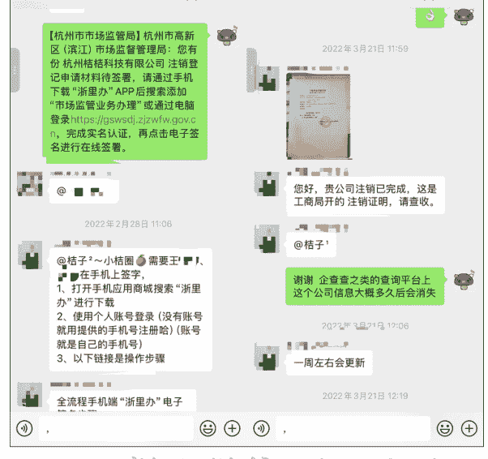

懒人微信: lazyhelper

## 二、新办的个体与人力资源公司营业执照需要注销

因为业务需要，我办了杭州的个体执照与杭州的人力资源公司执照。

其一，这个杭州个体，开了对公账户，开过发票，交过社保，后来转移到我其他公司了。

其二，这个杭州人力资源公司，开了对公账户，有人力资源资质。

今年 2025 年 2 月份，因为业务探索失败，执照挂靠地址又需要续费了（好多钱）。这 2 个执照用不到了，都需要注销。如果是你，你是不是和我一样，觉得自己的执照有过那么多东西（对公 发票 社保）存在，只会找财务代注销？

没错，这就是我当时的想法。

### 注销价格

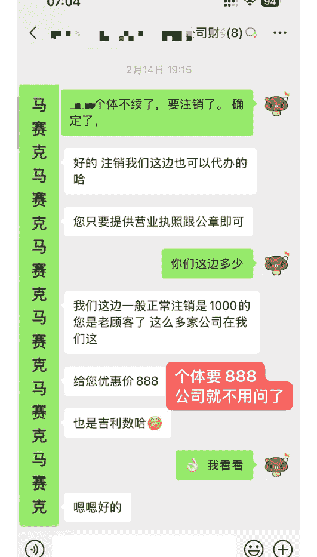

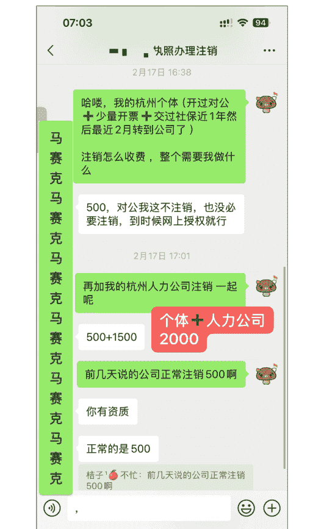

我咨询了公司与个人，这是分别的报价，2个加起来最低2000，（我第一次公司注销1500，所以这次报价我也能接受）。但是，我当时时间比较空，突然灵光一闪，我为什么不自己去注销？？？！！！

PS：当你想不到或无人告诉你的时候，这就是信息差。

于是我直接先AI查询，然后小红书查询【杭州个体开了对公账户如何注销】【杭州人力资源公司执照怎么注销】之类的，然后尝试了下，只花了自己的路费就搞定了（相当于省了至少2000💰）。

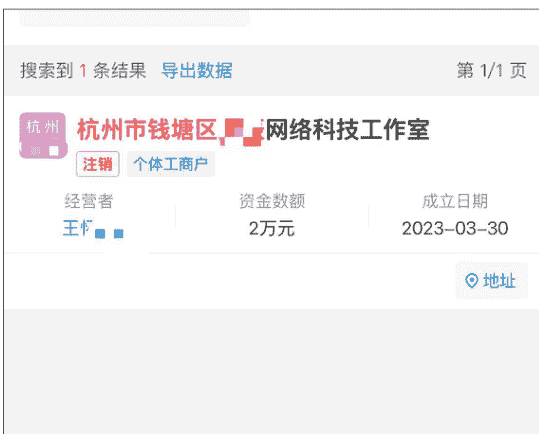

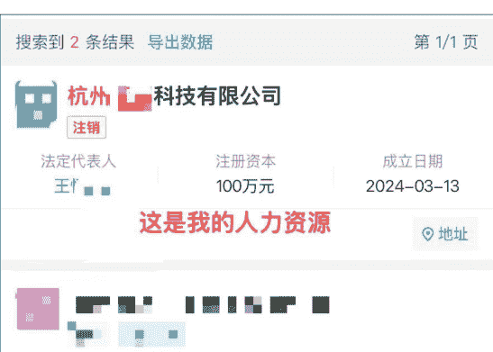

### 具体怎么做

时间太久了，有些和AI的聊天内容找不到了，我的方式就是先问AI，再查小红书或抖音，相互印证，还有疑问就打对应区域的工商类如市民之家的电话。

以上这些都是2月份不懂测试的我操作的，现在看了帖子的不用重视这些啦，看下面。

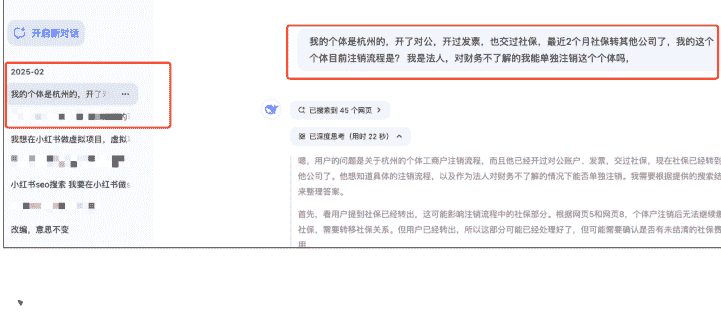

#### 杭州个体营业执照开了对公账户 线上如何注销个体

杭州个体营业执照开设对公账户后，要注销个体工商户，需要先处理银行账户，然后再办理注销。以下是线上注销流程：

- 第一步：处理银行对公账户
  - 需要先到银行网点或通过银行的企业网银办理对公账户销户
  - 准备好营业执照、法人身份证、银行开户许可证等材料
  - 确保账户内资金已清零，无未处理的业务

- 第二步：线上注销个体工商户
  - 浙江政务服务网办理：
  - 登录"浙江政务服务网"(www.zjzwfw.gov.cn)
  - 选择"杭州市"→"个体工商户注销登记"
  - 填写《个体工商户注销登记申请书》
  - 上传所需材料：营业执照正副本
  - 对公账户先不用管，直接线上注销

#### 杭州公司营业执照开了对公账户 线上如何注销公司执照

在杭州注销公司营业执照，特别是已经开设了对公账户的情况下，需要按照规定的流程进行。

基于搜索结果，我为您整理了杭州公司营业执照注销的线上办理流程。由于您的公司已经开设了对公账户，需要按照完整的注销流程进行：

## 杭州公司注销完整流程（已开对公账户）

- 一、线上办理平台
  - 杭州企业简易注销全流程网办正式上线，可以在浙江省企业登记全程电子化平台进行线上办理，从“最多跑一次”变成“跑零次”。
  - 主要平台：浙江省企业登记全程电子化平台（浙江企业在线）、浙江政务服务网 https://www.zjzwfw.gov.cn/zjservice-fe/#/home （其他城市的伙伴，问 AI 你们城市的）

记住，想注销的伙伴，先去线上体验流程。你写错了、填错了没关系，会有专门审核辅助你的人，给你驳回提交，并告诉你哪里有问题。如果你看不懂，可以直接打对方电话。（全程你不用咨询任何一个做财务、懂财务的人）

我的个体，线上提交一次，遇到清税证明问题，跑去钱塘区那边税务局，服务人员帮我一次搞定，全程我只负责签字~

回家等提交注销的网站上更新了信息，再提交一次搞定（提交后公示 20 天）。也就是个体注销提交公示后，20 天就注销了。

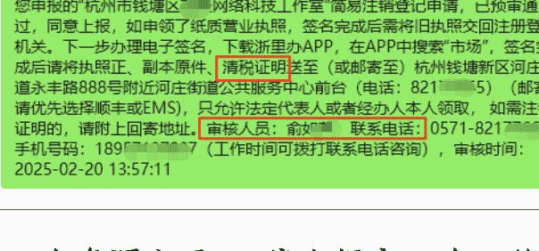

我的人力资源公司，线上提交一次，简易注销，公示 20 天后，因为地址异常（没续费），所以只能走一般注销（公示 45 天）。去了 2 次临平区的市民之家（主要是税务问题和改一般注销）搞定。

PS：税务区有几个辅助工作人员，说是解答辅助，其实全程帮我们操作。

我问：代注销的人会操作流程吗？
对方：哪里会，都是我们操作的。

明白了吧，代注销，只是跑腿（税务有问题，必须到现场解决），适合土豪老板和其他地方的执照（自己过去不划算）。

这是公司的：

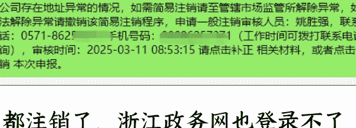

因为都注销了，浙江政务网也登录不了了，所以没法截图相关的了。真的不用担心，直接干，按照我说的流程走就行，只要你提交了线上，就会有人审核指导你。所以，你不用去咨询任何人。

只要你要注销，不管你的个体或公司因为有啥问题（地址过期、执照异常、税务异常等等），直接先线上提交，专业的人来辅助我们。要不然你去问财务或代注销公司，他们都会说，这个问题比较严重，注销要加钱之类的，不信你去问哈哈。

前天周六去生财总部参加组局，回来路上和小伙伴聊起了这事，没想到他俩都不知道自己可以注销个体/公司的事，都以为得财务公司代注销。所以，我这2天赶紧写出文章，希望帮助更多像我一样资金比较薄弱的伙伴，把钱花在项目上不香吗？

PS：已经写得很详细，不用专门找我咨询哈哈。感觉对自己有用的伙伴点个赞吧~

## 增加个体注销实操（新鲜版）

我的杭州个体/公司都注销了，还有一个杭州的公司目前在减资，无法演示注销。我用一个之前网上办的几十块的海南省海口的个体来注销，今天是7月15日。

- 1、先问 AI
  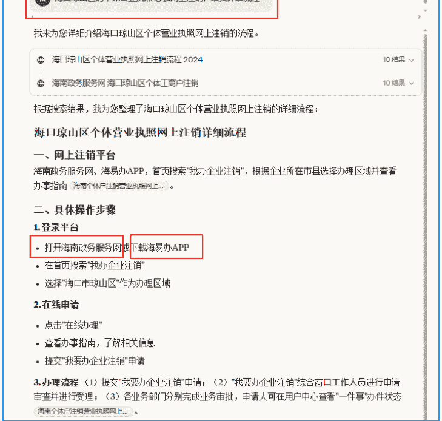

- 2、登陆
  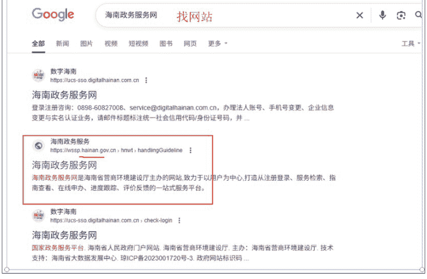
  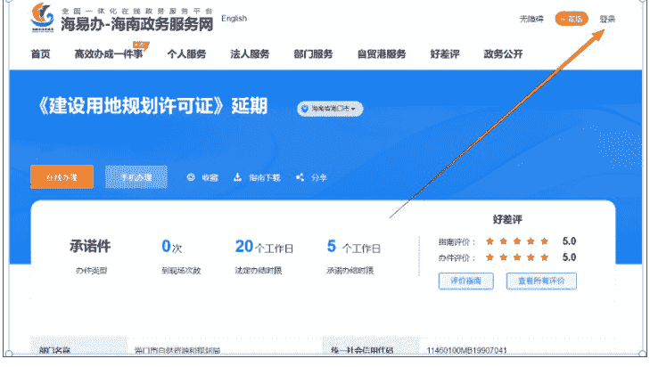
  懒人微信：lazyhelper

- 3、我选择电子营业执照 登陆
  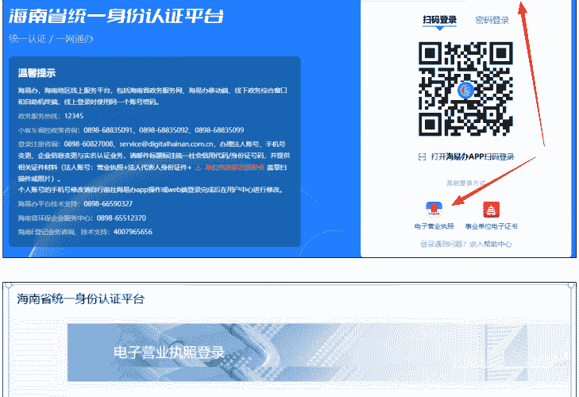
  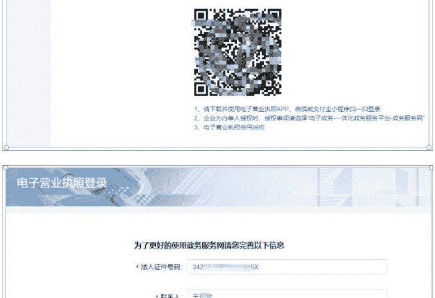
  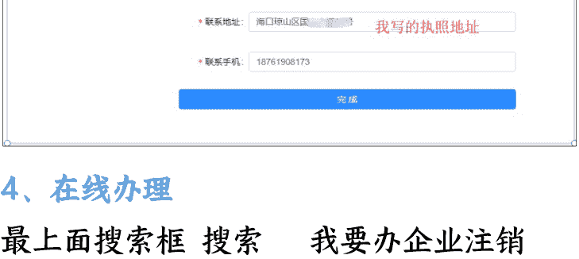

- 4、在线办理
  最上面搜索框搜索“我要办企业注销”

## 海口琼山区个体营业执照网上注销详细流程

- 一、网上注销平台
  - 海南政务服务网、海易办APP，首页搜索“我办企业注销”，根据企业所在市县选择办理区域并查看办事指南。

- 二、具体操作步骤
  - 1. 登录平台：打开海南政务服务网或下载海易办APP，在首页搜索“我办企业注销”，选择“海口市琼山区”作为办理区域。
  - 2. 在线申请：点击“在线办理”，查看办事指南，了解相关信息，提交“我要办企业注销”申请。
  - 3. 办理流程：(1)提交“我要办企业注销”申请；(2)“我要办企业注销”综合窗口工作人员进行申请审查并进行受理；(3)各业务部门分别完成业务审批，申请人可在用户中心查看“一件事”办件状态。

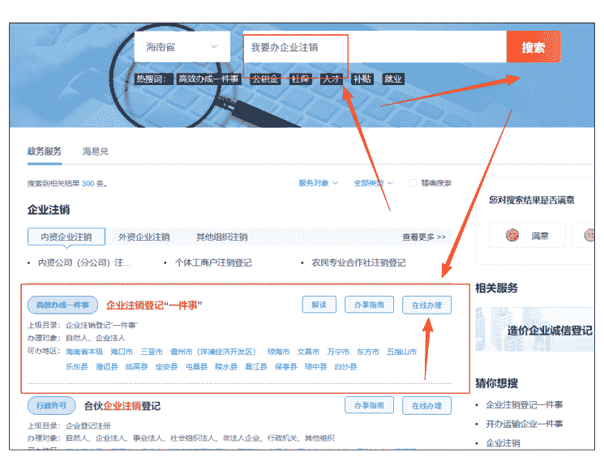

- 5、我的区域-海口
  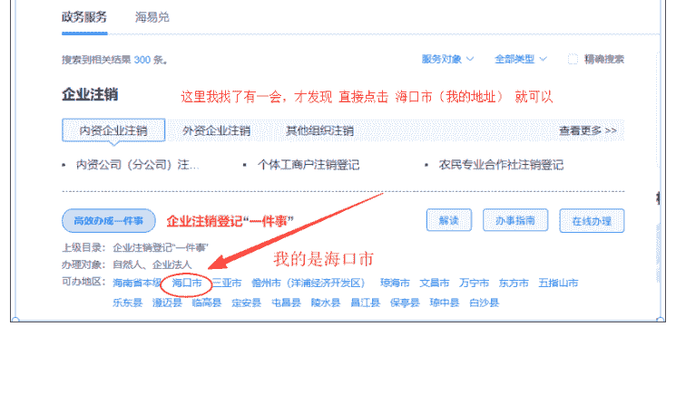

- 6、在线办理
  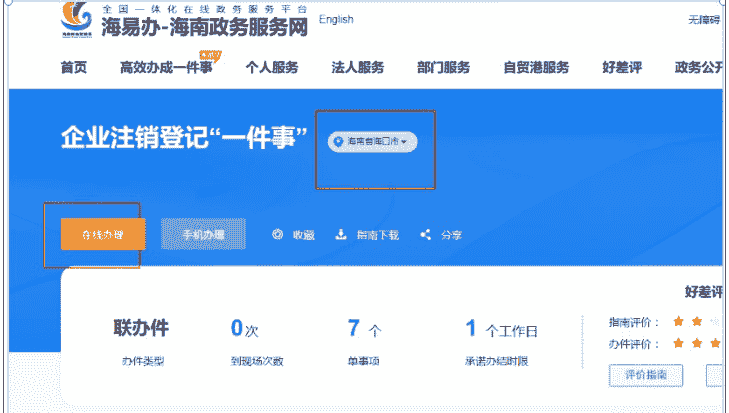
  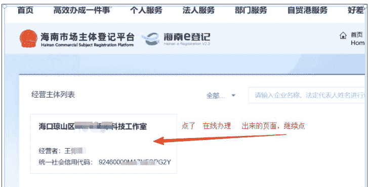

- 7、开始
  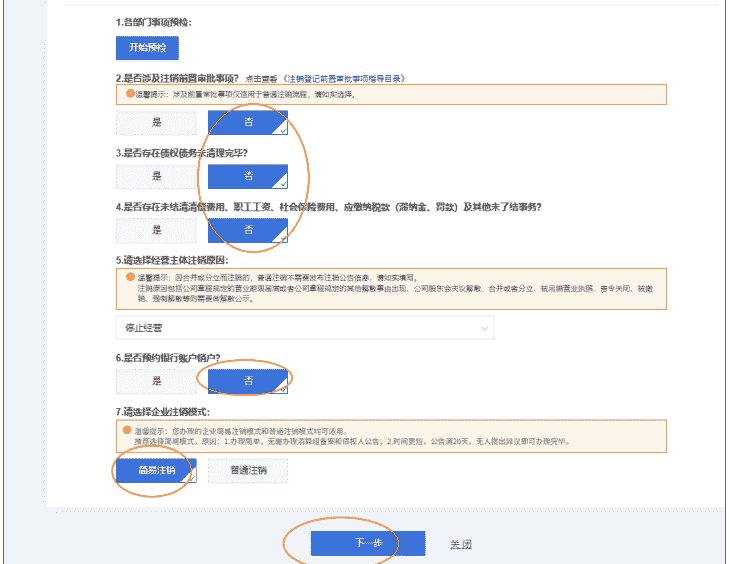

- 8、基本信息
  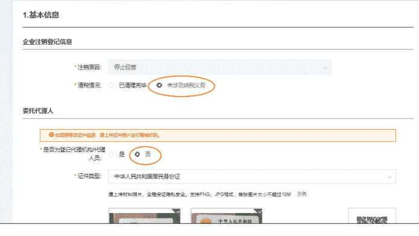
  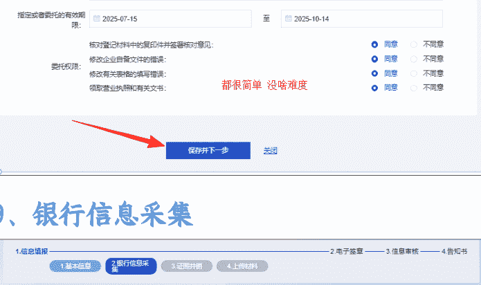

- 9、银行信息采集
  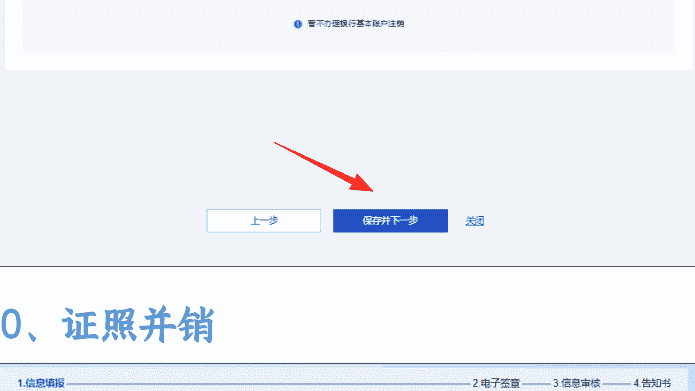

- 10、证照并销
  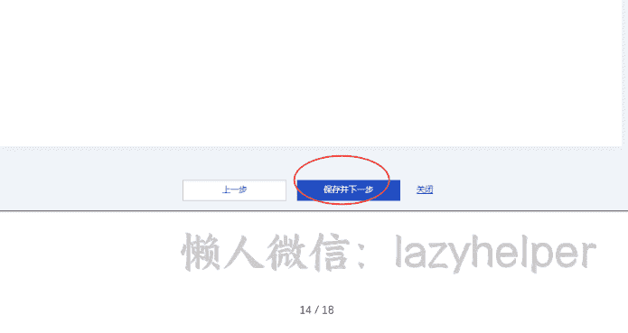

- 11、上传资料
  

- 12、电子签章
  

- 13、提交
  

我从来没有提交过海南个体注销，我也是第一次，刚刚找 AI 才知道的海南执照注销的网站。

整个过程我就花了 10 多分钟吧，不用怕自己提交信息对不对，会有审核人员给你反馈的，哪里需要调整再去调整就行，主要是大胆的去做。

其他地方的伙伴，和我一样，去 AI 搜索当地的网站，然后操作就行，各个地方注销流程都是差不了太多~

### 14、注销成功

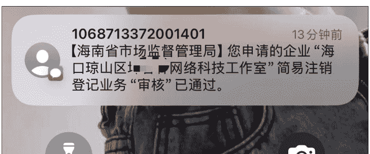

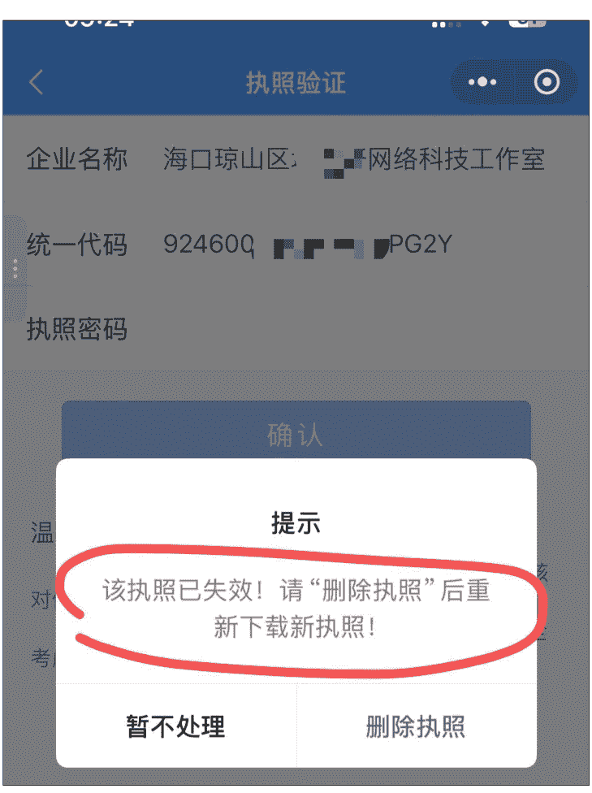

昨天晚上提交注销，今天上午就注销通过了，想登陆看看直接显示失效了（这个是网上的普通个体，没有开对公账号）。

刚被注销，是查不到的，我们可以3-7天后去查询：

- 微信小程序：企查查（免费）或
- 国家企业信用信息公示系统：https://shiming.gsxt.gov.cn/（这个我的谷歌浏览器查询不了，能进去不刷新，我用的其他浏览器查的）

## 公司减资预告

PS：公司减资外面起码要500-800以上，我也提交了公示，已经45天满了，下面流程也跑通了，在整理书写中~

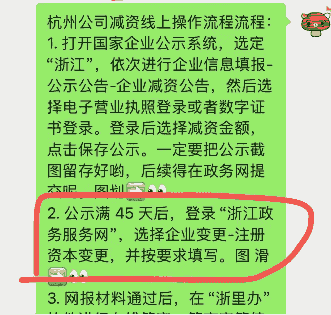

最后，安利小懒的付费群：

## 懒人专属群

微信:lazyhelper

📚 懒人专属群持续更新中，已持续运营 6 年，整理超 3000 份各类精选付费文章 & 年费社群干货，全部开放下载。

本资料为付费群内部分享，仅供真实有需要的朋友查阅 🙇‍♂️

懒人专属群更新记录：
https://lazy2025.top/#/blog/record2

懒人专属群更新记录（需梯子，备用）：
https://lazybook.fun/#/blog/record2

懒人微信：lazyhelper