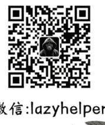
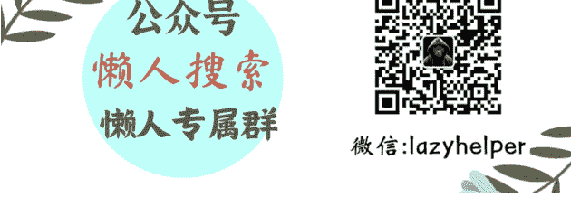

# 你只管努力，剩下的交给“多巴胺”

2025.07.18

整理：公众号懒人搜索，懒人专属群独享

懒人微信：lazyhelper

年中期间，不少机构发布了半年度的消费报告。而在这批报告中，普遍提到了一个趋势，这就是，人们开始注重服务、精神体验、情绪价值这样的软价值。

比如，中国（海南）改革发展研究院发布的《2025年中国消费研究报告》，里面提到，国人的耐用品消费趋于稳定，而服务消费正在猛增，到2030年，国人服务消费占比将超过所有消费的一半，我们将会进入服务型消费社会。

中央广播电视总台研究院，发布了《2025中国居民消费特点及趋势报告》，主题是“美好生活大调查”，消费正在从“物质满足”向“品质生活”转型，服务消费中，“情绪消费”又是新热点，有四成受访者说，需要高情绪价值服务。

中信智库发布了《中国消费领域八大趋势前瞻》，里面提到，消费者一手要平替，一手要快乐，在消费中更重视精神体验，会偏向休闲、娱乐、康养这样的精神满足类消费。

我们经常提到“情绪价值”，过去这好像只是商家锦上添花的手段，但是发展到现在，它已经成了刚需，人人都需要一点情绪价值。上半年最火的消费，不管是泡泡玛特盲盒、LABUBU玩偶、老铺黄金，还是各种旅行、音乐节、演唱会，本质都是为了愉悦自己，获得情绪上的享受。

这背后还隐隐体现出一个趋势，这就是，消费的重点，正在从“物质性价比”转向“情绪性价比”。消费者开始追求用更少的钱换回更多的情绪价值，什么商品能最快地调动人的情绪系统，什么就会走红。

比如泡泡玛特，“盲盒+IP”的玩法，能够非常高效地刺激你的多巴胺，每次抽盒的小惊喜都能让你非常兴奋。

再比如，今年最火的黄金品牌老铺黄金，价格比奢侈品低，既让人觉得买黄金不会亏，又能像奢侈品一样“晒出去”，很多人表示从中获得了双倍的情绪满足。

再比如，现在香薰经济也很流行，一块售价60元的香薰蜡烛可能只够点两个晚上，但它带来的放松感、仪式感，还有拍照分享价值，远远超过一个同样是60块钱的电风扇。

总之，人们在消费中，越来越喜欢用一些“低成本、强刺激”的方式来获得快乐。

但是，在这个现象背后，还有一个值得留意的生理学视角。

从生理上看，我们获取的情绪价值，主要来自多巴胺的奖赏机制。因为多巴胺的分泌，我们才感觉到了快乐。但当需求逐渐增长，大脑就会陷入“刺激—耐受—再刺激”的循环，一次两次还觉得开心，时间长了就没感觉了，除非看到更稀有的盲盒、花样更多的商品，以及其他更强烈的刺激。

我们可以把这种现象命名为“情绪价值的通胀”。相同的刺激带来的愉悦感会随着频率提升而递减。我们需要付出更多的时间、金钱、注意力，不断升级刺激强度，才能获得我们想要的情绪满足。

原来看一集电视剧就很开心，现在可能需要连刷三个小时才能获得差不多的感觉。还有很多人刷短视频都不过瘾，要同时打开几个屏幕，一边2倍速刷短视频、一边玩游戏、一边跟人聊天。但是，长此以往，多巴胺会变得越来越难以调动，人的快乐成本也会越来越高。

换句话说，在充满情绪刺激的环境里，我们需要主动管理自己的多巴胺。

具体怎么做，最近我在一些文章、课程里看到了几个方法，或许可以试试。

## 第一，你可以试试多巴胺戒断。

这是从前年开始，就在硅谷创业者和教育界流行的方法。具体方法是，戒断手机、酒精、社交媒体、网络游戏等等容易“产生满足感”的东西。当然，也包括戒断太高频的抽盲盒、频繁购物、暴饮暴食这些高刺激行为，通过这种戒断来“重置”大脑中多巴胺受体的刺激阈值，让大脑不那么容易释放多巴胺。

一段时间后，你的大脑就会忘记原本的上头体验，发展出一个新的多巴胺适应模式，这时候，你再去做一些愉快的小事，比如看看风景，吃点美食，这种微小的新刺激，也会让你重新感受到细微的快乐。

这个戒断时间不需要很长，快的话，只需24小时，大脑的多巴胺受体就会重置。换句话说，每一个新的一天，你都会迎来一个重启状态，你都有机会重新塑造自己的快感体系。

得到的 CEO 脱不花老师，还介绍过一个“无痛戒断多巴胺”的小技巧，只需要把手机切换成黑白模式，色彩天然反馈就会帮你对抗一次刷手机的冲动。

## 第二，有意识地去获取慢多巴胺，避免沉迷快多巴胺。

没错，多巴胺也分快慢。前不久，万维钢老师在专栏专门解读这两个概念，它们传递的都是多巴胺，但行为模式和作用机理很不一样。

快多巴胺来得快去得也快，刷两个小时的视频，下单买一大堆东西，看似很快乐，但很容易感觉到空虚麻木，迫切渴望更多刺激。它的特点是，波动很短暂，迅速冲上波峰之后很快就会落下波谷。

慢多巴胺是来得慢去得也慢，而且波谷没有惩罚。可能你非常努力才看进去几页书，但只要看进去了，你就能获得快乐。一小时后把书放下，多巴胺会消退，但你并不会失落，这就是慢多巴胺。

快多巴胺只会让你上瘾，慢多巴胺才会给你的大脑赋能。因此，答案很明确，我们应该防止沉溺于快多巴胺，多来点慢多巴胺。这也是可以积极主动创造的。

你可以给自己设置一个纪律。每当你想要拿起手机的时候，你都可以给自己一个暗示，“是不是又想要快多巴胺了?”以此提醒自己克制这个冲动。

大脑中有一个关键区域，叫“前中扣带皮层”，每当你抵抗了一次上瘾行为，并转向一个健康行为，它就会被激活。而且，这个区域像肌肉一样，越使用，越强壮。因此，我们的每一次自我暗示，都是一次对意志力的训练。

慢多巴胺同样可以用非常微小的行动开启。

比如，每天刷社交媒体之前，要求自己先看到阳光。那你就不会醒来就刷手机，而是会先动一动，收拾好一切，并且出门走走。

再比如，要求自己，起床一定要整理好床铺，这个动作会给你一个暗示，你做了事，看到了进展，你会得到一点慢多巴胺。

### 放弃易得的快乐，用微小的动作开启慢多巴胺，你就有机会进入一个正反馈的循环。

## 第三，重建自己的快乐回路。到底什么样的事情能让我们快乐，这是自己能够决定的。

前不久，卓克老师刚刚解读过科学家对情绪的新理解。简单说，情绪不是天生就有的，而是我们的大脑根据经验加工出来的。

比如，一个人夜晚走在没人的小巷子里，突然听到“哗啦”的一声响动，他就会产生恐惧的情绪。大多数时候，黑暗里的响动都没好事，这是人们从小学会的“恐惧”模板。反过来，如果一个人经历过其他的情况，比如“哗啦”一声后，总是惊喜出现，那么他在这种情况下，可能不太会觉得恐惧，而会觉得激动、兴奋。

再比如，一个成年人站在海边看日落的时候，会感到平静和安宁，这也是由他的个人经验决定的，也许是从小看过很多关于日落的浪漫电影，也许是他家正好住在能看到日落的海边。这些经验让他的大脑中形成了“日落等于浪漫，等于内心安静”的回路。

换句话说，决定情绪感受的，不是多巴胺本身，而是你的大脑怎么“解释”它。比如熬夜刷视频，同样大量分泌了多巴胺，有人觉得放松，有人觉得愧疚，这也是大脑的解释不同。

从这个角度看，我们或许可以试试，把“正确的事”和“快乐的事”绑定在一起。比如，坚持看书之后给自己一点小奖励。久而久之，大脑可能就会把看书和奖励联系到一起。看书可能就从一件煎熬的事变成了快乐的事。

前段时间刘润老师说过一句话，“所谓的自律，就是驾驭好你的多巴胺”，去控制那些短暂的冲动，并且告诉自己“等一等，那个更大的、更长远的快乐，才是我真正想要的”。

坏消息是，我们可能得放弃一点简单易得的快乐，要从眼前的“小确幸”里跳出来，去追求“大满足”。好消息是，我们大脑的天然设置决定了，只要稍稍努努力，这件事的成功率几乎是百分百。

公众号懒人搜索，懒人专属群分享

最后，安利小懒的付费群：

懒人专属群

📖 懒人专属群持续更新中，已持续运营 6 年，整理超 3000 份各类精选付费文章 & 年费社群干货，全部开放下载。

本资料为付费群内部分享，仅供真实有需要的朋友查阅 🕵️

懒人专属群更新记录：
https://lazy2025.top/#/blog/record2

懒人专属群更新记录（需梯子，备用）：
https://lazybook.fun/#/blog/record2

懒人微信：lazyhelper