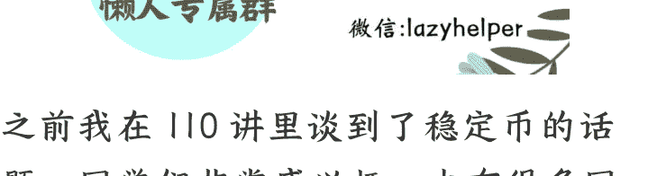
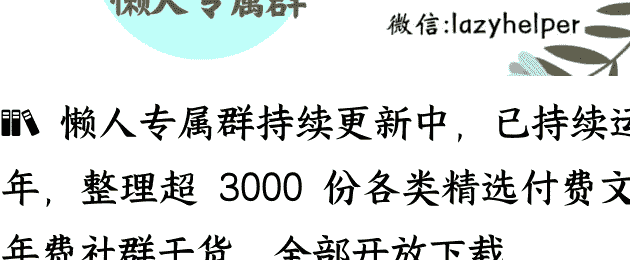

# 中美加速争夺，稳定币和资产代币化浪潮升级
## 250721《政经参考》节选

整理：公众号懒人搜索，懒人专属群独享

懒人微信：lazyhelper

之前我在110讲里谈到了稳定币的话题，同学们非常感兴趣，也有很多同学想让我再多讲讲。

正好最近政策信号进展迅速，7月10日，上海市国资委召开中心组学习会，专题研究加密货币和稳定币的发展趋势，明确了要探索区块链技术在跨境贸易、供应链金融、资产数字化等领域的运用。

这是一个非常重要的信号，代表了中国对稳定币的关键态度。

今天我就借着这个话题，和你进一步谈谈稳定币和RWA等一系列新事物到底是什么，以及中美两国在这些领域的最新布局进展，带你看懂背后的角力方向。

## 资产代币化（RWA）到底是什么？

关于稳定币，我在第110讲介绍过，这里我们简单复习一下。稳定币其实就是类似于游戏厅中的“游戏币”，我们把现实中的美元或者人民币，换成这个“游戏币”，就可以玩各种“游戏”，比如比特币、以太坊、NFT等，感兴趣的同学可以再复习下第110讲。

这次我们重点谈谈这段时间特别热的新词RWA。所谓的RWA，就是真实世界的资产代币化，比如把现实世界中的资产，像房地产、股票、债券、黄金、大宗商品、艺术品等等，通过区块链技术“上链”，变成可以交易的数字代币。这里的“上链”，是指上到区块链中的公链，你可以理解成把这些现实资产，做成游戏厅中一个个“游戏项目”的过程。

听到这里有的同学要问了，稳定币是不是也是一种“代币化”呢？是的，稳定币是把现实存在的货币，直接给“上链”了，形成了对应的“数字美元”，像USDT、USDC、PUSD等；而资产的代币化，则是把各种各样的资产搬上区块链，这些资产的所有权或收益权，将会被分割成可交易的数字代币，并在区块链上记录和流通。这里我再举几个例子，帮你加深理解。

对个人来说，可以用RWA转卖资产。比如你在美国有一套价值1000万美元的房产，你想把它卖出去，传统模式下可能需要经历漫长的交易流程，包括资产评估、法律登记、买家结算等，甚至你还要亲自到场。而通过RWA，把这套房产“上链”，你就可以把这栋楼的所有权，拆分成 1000 个代币，每个代币代表 0.1%的产权。你可以在区块链上，把这些房产代币出售给全世界的投资者，不仅提升了资产的流动性，还提升了时效，几分钟内就能完成交易。以此类推，转卖国债、大宗商品等资产，也是类似的逻辑。

不仅如此，个人还能发行 RWA。比如之前爆火的非同质化代币 NFT，其实就是把个人的“符号资产”上链，是一种个人化的 RWA。比如你有著作、油画、彩绘、个人设计，甚至是你自己的照片，你都可以通过 NFT 的方式来上链，然后卖给别的投资者，艺术家、作家可以用这种方式，转让自己的作品和著作权。

同样的，企业也可以使用 RWA 来盘活资产。比如 2024 年 8 月，蚂蚁集团旗下的科技商业化公司蚂蚁数科就和专注电力能源的能源科技企业朗新集团，完成了一次充电桩 RWA，它们把朗新拥有的部分充电桩作为底层资产，搬上了区块链，变成了一个个“代币”，而每一个代币，对应的就是充电桩产生的充电收益，然后卖给全球的投资者。这样一来，投资者享受了未来收益，而朗新则拿到了融资。这件事的厉害之处在于，通过这种模式，朗新把大量重资产，直接变成了现金流，然后拿着这些现金流投资布局更多的充电桩。

再比如对出海企业来说，以往只有少部分出海企业，可以通过当地银行贷款完成海外融资。现在更多企业可以通过 RWA，把海外业务打包上链，用未来的现金流，换取当前的海外融资。

还比如，企业可以把自家公司的股票进行 RWA，在链上发行代币，在区块链上进行融资，这相当于是数字世界进行另一场“IPO”，比现实的 IPO 更加方便、流动性更好，这对很多投资基金来说，也是一个很好的退出渠道。

此外，很多地方政府现在有大量盘活闲置沉睡资产的需求，而 RWA 或许是一个可能的解决办法，既能换取现金流，又能避免土地、房产等资产集中入市，形成“砸盘”效应，打破市场供需平衡。

总结来说，RWA 解决了传统金融体系的几个核心痛点：

首先，传统资产的流动性，往往受限于市场结构和监管框架。比如，私募股权、房地产或大宗商品通常需要长期持有，退出渠道有限，而代币化可以让这些资产在二级市场上自由交易，甚至实现全球交易。

其次，传统金融的参与门槛极高，普通投资者很难接触到优质资产，比如那些顶级私募基金或高端房地产。而 RWA 通过碎片化所有权，让小额资金也能参与过去仅限机构或高净值人群的投资机会，这本身降低了很多资产的投资门槛，是个关键的进步。

最后，RWA 还代表了一种“效率革命”。在传统金融中，资产的登记、清算、结算，需要依赖大量中介机构，流程冗长且成本高昂。而区块链的智能合约，可以自动化执行许多环节，包括托管银行和支付系统这种中间环节，租金分配、利息支付甚至违约处理这种尾部环节，让整个金融交易模式的效率，得到极大提升。

可以想象，RWA 的终极目标，是让全球资产自由流动。

## 中美强势竞争 RWA

中美两国自然都看到了稳定币和 RWA 所蕴含的巨大价值潜力，所以纷纷加速布局，抢滩新一代的金融生态。

我们先看美国的布局情况。

美国的房地产金融巨头房利美（ Fannie Mae ）和房地美（ Freddie Mac ），目前已经得到官方指令，把加密货币作为储备资产，购房者可以用加密货币作为抵押资产，来申请住房贷款。

美国国会方面，众议院在本周会最终审议《GENUIS 法案》，也就是稳定币监管法案，为美国的加密货币合法性和合规性铺路；而特朗普政府还进一步修改了会计准则，把加密货币正式列为“资产项”，这等于是正式承认了加密货币的合格储备地位；而美国证券交易委员会（SEC，也就是“美国证监会”）则宣布，美国企业可以通过 STO，就是证券型代币发行等方式，把资产代币化，还可以向美国以外的投资者发行代币，简化跨境融资流程。这相当于为美国企业的代币化打开了正式通道。

这些举措，意味着美国在推进加密货币、稳定币、RWA 等一系列事项上，已经扫除了制度层面和法理层面的障碍。

而在市场方面，摩根大通、高盛等金融机构，已经在 2022 年启动 RWA 试点，RWA 联盟同期成立，并在最近两年制定了一系列的 RWA 发行标准。摩根大通还与贝莱德等资产管理巨头，持续布局 RWA 项目，进行代币化债券和房地产资产的试点。就在最近的 6 月 30 日，美国知名在线券商和知名加密货币交易所，也同日宣布启动美股代币化服务。

而中国也在加紧布局，争夺未来金融的话语权。

就在6月18日的陆家嘴论坛上，央行行长潘功胜明确表示，“积极发展RWA模式，拓宽实体经济融资渠道”，这是首次从中央层面表态支持RWA的发展。

7月10日，上海市国资委召开中心组学习会，专题研究加密货币和稳定币的发展趋势，作为金融开放的试验田，上海的动作极具风向标意义。

而作为对外桥头堡的香港，动作更加值得我们注意。政策方面，香港在6月26日发布了《香港数字资产发展政策宣言2.0》，提出了新型“LEAP”框架，这份文件的核心其实就是三点：第一，将稳定币纳入监管，积极推进稳定币事业发展；第二，RWA代币化被列为重点产业，要重点发展，不仅推动债券代币化的常态化发行，还计划把黄金、绿色能源等纳入代币化范围；第三，代币化ETF、数字资产基金，将享受税务豁免。

而在市场方面，2024年8月，香港金管局公布Ensemble项目第一阶段进展，这是一个探索代币化技术应用的沙盒项目，其中一个重要案例，就是朗新科技与蚂蚁数科合作完成国内首单基于新能源实体资产的RWA，将用于新能源储能和充电桩产业。到了2025年3月，巡鹰集团在香港完成全球首单低速电动车换电资产的RWA项目。这都是RWA市场化探索的重要实践进展。此外，香港金管局推动“两链一桥”架构，就是搭建“资产链”、“交易链”及“蚂蚁链可信跨链桥”，促进资产跨境流通。

看得出来，香港是下定决心要争夺稳定币和 RWA 产业的发展优先权了。

## 中美竞争背后

最后，我简单讲讲中美金融布局背后的角力方向。

中美在稳定币和 RWA 领域的布局，表面上是技术路径的差异，实则是两种金融范式的话语权之争——就是，谁能为全球资产流动制定规则，以及，谁能在下一代金融基础设施中占据主导地位。

美国希望维持“美元稳定币+私有链”的开放生态，意图通过美债、美股代币化，吸引全球资本，进一步巩固美元地位；中国更倾向于“主权数字货币+许可链”的可控路径，比如通过 RWA 推动人民币计价的黄金、锂矿、电力代币化，这样也能增强中国大宗商品的话语权。

总的来说，这场竞争的结果并不是“赢家通吃”，但输家一定无缘参与下一代金融体系的规则制定。限于篇幅，关于新一代金融模式的影响，以及普通人怎么抓住这轮财富浪潮的问题，我们后面找机会再说。

最后，欢迎你把《政经参考》转发推荐给更多人，让我们一起聚焦政经，举重若轻。我是马江博，下期见。

## 延伸学习：
- 1、证券日报：稳定币概念热度持续升温 行业迎来发展新机遇
- 2、香港就数字资产发展发表第二份政策宣言

最后，安利小懒的付费群：

### 懒人专属群

懒人专属群持续更新中，已持续运营6年，整理超3000份各类精选付费文章&年费社群干货，全部开放下载。

本资料为付费群内部分享，仅供真实有需要的朋友查阅🤫

### 懒人专属群更新记录：
https://lazy2025.top/#/blog/record2

懒人专属群更新记录（需梯子，备用）：
https://lazybook.fun/#/blog/record2

懒人微信：lazyhelper