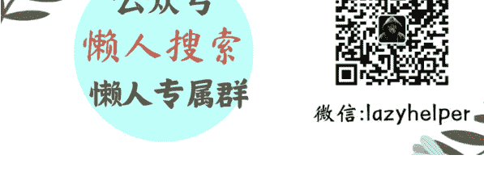

# 从 SU7 到 YU7，小米汽车为何“总是做对”

250721《蔡钰·商业参考4》节选

整理：公众号懒人搜索，懒人专属群独享

懒人微信：lazyhelper

你肯定知道，2025年6月底，在市场尚未平息的巨大争议和质疑声中，小米集团董事长雷军登上发布会讲台，发布了第二台小米汽车，结果又卖爆了。这台车的型号叫YU7，是一台中大型SUV轿跑。YU7开启预定3分钟后，大定订单突破20万台，1小时后突破28.9万台。18小时后，锁单量突破了24万台。

所谓“锁单”，对用户来说意味着不能再改配置，也不能撤单了，买定离手，代表了最真实的销量数据。

24万辆什么概念？“整个汽车工业史上从来没有过这么高的订单”。小米不到一天卖掉的车，超过新势力当中的蔚来汽车上一年全年的交付量，也刷新了一年前小米自己创下的最快订单纪录。

当时小米发布第一辆汽车SU7，24小时大定超过8.8万辆，就已经让新能源汽车行业乃至整个汽车行业瞳孔地震。就连小米自己的汽车产品团队都很震惊，当时还找我去做过一次分享。因为小米的汽车工程师们很多是传统汽车行业出身，自己也没见过 SU7 这种卖法和势头。雷军告诉工程师们：“这就是情绪价值”，让他们去研究研究，于是工程师们找到了我。

而到了发布 YU7 这次，雷军自己都震惊了。YU7 的成绩几乎是一年前 SU7 成绩的 3 倍。雷军在事后的返场直播里说，他在看到 3 分钟大定数据的第一瞬间也愣住了，“看了好几遍才跟现场的人分享。”

市场对 YU7 的狂热，对小米自己、对汽车行业，甚至对整个中国市场都是个强悍的信号，它让大量制造业和消费服务业的创业者不同程度地怀疑起了人生：说好的消费降级呢？为什么到了小米这里就失灵了？小米究竟做对了什么？

这个问题，没准在过去两个礼拜也是你和朋友见面或在微信群里的热议话题。我也听到和聊出了几个有意思的观察角度。这一讲，先来跟你分享。

## 年轻=“入门级认知”

第一个视角是关于，小米所吸引的“年轻人”，而年轻到底意味着什么。

人们的第一个归因，基本还是会落到小米的营销能力：雷军太会讲故事了。

确实，在 YU7 的发布会上，雷军不光是介绍产品的性能和参数，更善于去描绘用户能体会的感性场景：电机控制算法，起名叫“晕车舒缓模式”；天幕玻璃的透光率，解释成“SPF100+防晒护甲”。

说到 YU7 跑测试，雷军说“工程师们开着 YU7 把祖国的边境线走了一遍，用 YU7 的车轮来丈量祖国的边境线，这是小米工程师的浪漫”；说到目标用户，他又说 YU7 “也是为那些双肩扛着责任，内心仍有远方的人设计的，就是那些清晨送孩子上学，顺路也给自己买束花的妈妈们，那些周末带着全家去露营，也在后备箱里为自己留一条钓具的爸爸们；那些在柴米油盐的烟火气中，内心仍有星辰大海的人”。

你有没有发现，这就是房屋中介们带人看房时最常用的策略——这不是介绍一套房，而是描绘一个“家”，替用户描绘他将来的生活：孩子在哪里玩耍，父母在哪里阅读，老人在哪里小憩……把用户对“家”的想象和认同转移成对“房子”的想象和认同。

这套方法，也是从 2024 年小米发布 SU7 以来，其它的汽车厂商们在努力学习的。

不过这次讨论 YU7 的时候，我听到一个有意思的看法：小米在叙事、在营销上的成功，对其它汽车厂商并不适用。这是我要跟你分享的第一个视角。

因为小米的成功，不在于它掌握了某一套叙事方法，而是因为它首先是小米。在小米造车之前和之后，很多汽车厂商在发布新车的时候，也尝试过把汽车的性能、参数、场景掰开揉碎、讲得很细，但这个操作对它的受众可能是无意义，甚至反效果的。

为什么？因为其它厂商大多是专业垂直的汽车品牌，在新能源汽车行业里已经发展了五六年，甚至十来年，这个过程中，吸引来的是一群高收入、思想进取、风险偏好强的科技爱好者。这个人群本身至少是汽车爱好者或半专业人士，把他们当成入门级人群，去从零开始讲车，反而是增加噪音，阻碍他们直接注意到真正的产品亮点。

而小米，2021 年才正式决定造车，此前在手机、数码硬件市场用“年轻人的第一台手机”“年轻人的第一台冰箱”等等概念，攒了一大群入门级用户。

这样一个人群在启动对“年轻人的第一台汽车”的想象时，确实需要可信的大哥从基础开始讲起，带他们去想象还未曾体验过的生活画面。这就像购房者越没有买过房，就越容易被房屋中介描绘的生活场景所打动。

这个人群的“年轻”未必体现在生理年龄上，而是体现在对电动车的入门级认知上。他们在过去十多年里，通过在其它领域的消费，对雷军和小米攒下了一种招商银行式的信任。

出于这种信任，他们观看了 YU7 的“科技春晚”，获得了“小米比美国的特斯拉更强更便宜”的认知，激动地打开手机，提交了不可撤回的订单。他们未必知道也未必关心的是，这个行业十年发展下来，各家的产品都已经很强，“比特斯拉 Model Y 强”这句话，在小米之前，很多车企也已经说过了。

而雷军在这个维度上也相当诚实。雷军在返场直播里主动帮友商打广告，说“如果大家急着用车，我觉得国产新能源车都还不错，比如明天将发布的小鹏 G7、月底将发布的理想 i8，当然，Model Y 也不错。”

这种气度在某种程度上，又让人们决定要真金白银地信任雷军。在心力不足的时代，人们一旦形成某种可以“闭眼买”的信任，下意识会希望把它无限复用到所有消费领域。这也是为什么这些年，网友们甚至呼吁过雷军去开发房地产、去研发卫生巾。

所以，其它汽车厂商们，如果没有这类信任储备，就简单去套用小米的叙事策略来做营销，很可能既给专业老用户增加了噪音，又没能说服新的入门级用户“闭眼买”，适得其反。

## 体制外的主流人群

第二个是，小米汽车抓住了“体制外的主流人群”。

什么意思？这个观点，把中国市场上的汽车用户做了高度抽象，分成三类：

- 第一类，市场化科技精英，归特斯拉、新势力等等新能源先锋品牌；
- 第二类，心怀民族认同的“体制内”主流人群，归华为的5界（问界、智界、享界、尊界、尚界）；
- 第三类，心怀民族认同的“体制外”主流人群，归小米。

我们来看三种人群的气质差异。

首先，科技精英人群，是新能源汽车的第一批吃螃蟹者。他们往往是互联网大厂员工、AI创业者、金融分析师、极客玩家，重视技术感、驾驶体验、智能系统迭代，对电动车的性能、算法、智能辅助、软件系统能如数家珍。

其次，“体制内”的主流人群，可能是公务员、事业编、央企国企员工以及对应的家庭网络。“体制内”，更多指的是一种精神认同，他们追求稳健、安全、体面，重视系统的认可，有明确的中国制造与民族情结偏好。

这个人群是华为手机和华为汽车的基本盘，比亚迪也吃到了一部分。

第三种人群，“体制外”的主流人群。这个人群，既不属于“体制”，也不在“极客圈”，他们可能是指中产白领、新锐创业者、小镇青年、销售、自由职业者等等，他们同样有明确的中国制造与民族情结偏好，同样追求体面，但在精神上，对“系统认可”的诉求稍弱，更追求性价比和个性化。他们需要“可承受的好产品”，也渴望通过消费实现心理意义上的阶层跃迁。

这个人群，更容易被雷军的创业初心和小米的消费平权理念打动，把小米汽车，当作自己的情感避风港与阶层敲门砖。

这是第二个有意思的视角。

## 总结

所以我们回头看，小米汽车“总是做对”，与其说是战术上的精准，不如说是它恰好站在了一个独特的人群结构交汇点上。毕竟，不是谁都能意识到“体制外的主流人群”这个画像的存在，也不是谁都能先拥有一群高信任度的“年轻”用户再造车。

而更值得关注的是：这可能还只是开始。如果说SU7抓住了“精神跃迁的单身年轻人”，YU7承接了“扛着责任的普通家庭”，那么，小米接下来的考验是：能否用自己的用户洞察能力和工程能力，让“体制外的体面人群”当中的下一个细分圈层，感觉自己“被看见”“被点亮”。

之前有网友发照片说，拍到了小米第三款车 YU9 的路测照片。根据照片来看，YU9 像是一台中大型增程 SUV，外形跟路虎揽胜和问界 M9 有相似之处。我们可以等到 2026 年看看，小米能否承受住正在定型的叙事期望，继续“总是做对”。

而在这之前，小米可能还要面对一个更现实的困境：产能瓶颈。这个问题又能延展出一个有趣的脑洞：小米和雷军强悍的叙事能力，会不会成为整个中国汽车行业的公共资源？

我们下一讲来解释为什么会有这样一个脑洞。我是蔡钰，下一讲见。

## 最后，安利小懒的付费群：

### 懒人专属群

懒人专属群持续更新中，已持续运营 6 年，整理超 3000 份各类精选付费文章 & 年费社群干货，全部开放下载。

本资料为付费群内部分享，仅供真实有需要的朋友查阅

### 懒人专属群更新记录：

https://lazy2025.top/#/blog/record2

懒人专属群更新记录（需梯子，备用）：

https://lazybook.fun/#/blog/record2