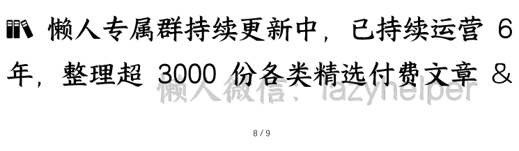

# 外卖大战暑期升级：各方影响

250721《蔡钰·商业参考4》节选

整理：公众号懒人搜索，懒人专属群独享

懒人微信：lazyhelper

微信：lazyhelper

上一讲我们说，2025年暑期，疯狂星期四的热闹被疯狂星期六抢走了，肯德基的“疯四文学”输给了互联网平台之间的外卖大战。

## 美团的重视

我们要关注的下一个问题是，美团对阿里入场外卖又是什么态度呢？

从7月5号开始，美团向阿里这个对手给出了最大的重视。

美团在7月5日下午才拍板要迎战，并临时召集了几十名业务骨干，组建了作战中心。

而行业里有消息说，在这之前，美团是乐于见到阿里入场制衡京东的。媒体36氪从一位美团中高层那里听到的说法是：“客观上，美团还是挺感谢阿里的。一般而言，应该是老大出钱制衡住老三，没想到老二很快出手了。”

在外卖行业里，老大当然是说美团自己，老三是引战的京东，老二则是饿了么与它所在的阿里系。

但没想到，淘宝一参战，几天内订单量就直接1000万单、2000万单的增加，比京东几个月的增长快多了。这才让美团的许多人第一次意识到，淘宝不光是在制衡老三，更想要挑战老大。

所以到了7月份，美团内部的迎战口号，已经变成了“战一夏，定乾坤”。你听这个口号也能听出来，美团也认为，这个暑期的外卖大战，能决定即时零售的行业格局。这跟开始我们提到的淘宝闪购计划2-3个月内追平美团订单量，对战期的预判类似。

从我们作为用户的观感来看，美团到了7月份直面淘宝闪购时，反击的动作比前两个月“费心”了不少。美团推了两个动作，都差异化地打在淘宝闪购的痛点上：

一个是，推出了“社交赠礼”的创新功能，也就是借用了微信的流量，鼓励用户们在微信小程序点外卖送朋友，通过送礼再次吸引新的人群加入点单。7月12日这一天，到晚上7:30的时候，美团的“神抢手”功能下的赠礼订单量就突破了1000万。

这个流量资源，是淘宝闪购不方便借用的。

另一个是，美团委任了上万名“外卖运营师”，在暑期的外卖大战里，跟AI联手识别被“差评”冤枉的商家，来给它们豁免责任、顺畅接单。这项能力，目前已经覆盖了 110 万商家，日均拦截 7.9 万条冤枉型的差评。这个能力，也是淘宝闪购一时间难以追上的。

## 战局如何影响各方

再下一个问题：这场外卖大战会给市场带来哪些影响？

在短期，第一个维度，对消费者来说，这当然是利好。抖音、微博、小红书和微信朋友圈里，都有大量网友晒出了自己薅羊毛的照片和心得。网友们玩出了两个著名的梗，一个是“周五别吃饭，因为疯狂星期六要来了”；另一个是“外卖大战差不多得了呗，我要喝出糖尿病了”。

第二个维度，对外卖骑手也是利好。在这几个周末，只要骑手们愿意，就有接不完的订单，和平台为了争夺运力发给他们的补贴。饿了么给外卖员发送了“超时 10 分钟以上不扣钱”的通知，美团也给自己的乐跑骑手发布了“跑够 40 单奖励 180 块”的活动。

但第三个维度，对同样被卷入战局的商家们来说，事情就不那么美好了：有位米粉店的老板娘，加入促销活动后，每天过得跟打仗一样，店里来自单个平台的外卖单量一度暴涨 10 倍，忙得她常常脚不沾地，自己吃饭的时间都抽不出来。

有位奶茶店老板，周末早上一开张，打印机里就源源不断吐订单，店里的6个员工连轴转到凌晨2点多。结果一算账，发现扣完商家补贴、平台服务费、配送费等等，到手流水砍半；再减去物料等各项成本，利润也只剩400元，这点钱刚够给6个员工发辛苦红包的。

到了这里，我们要联动一下以前讲过的盒马订制精酿啤酒的故事。

在第三季我们说，湖州有家啤酒厂商，接受了盒马的OEM（代工生产）订单，把净利率从5%降到了1%。但因为盒马销售能力强，它一年总销量上涨了50倍，一乘一除，仍然获得了10倍的利润增长（《特思拉精酿：把盒马当作考卷》）。

那么类似的，超级平台们打外卖大战，拉出了一天8000万、1.5亿的订单，这些订单当然也是分发给大大小小的餐饮门店们，为什么小老板们不开心？

因为零售服务业，无法简单复制啤酒代工商的增长逻辑。零售服务业在很大程度上仍然需要依靠人力，比如做奶茶、炒菜、封装、打包，而人力的单位产能是有限的，没法做到工业程度的降本增效。所以，一个小店如果要短期内满足更多订单，只能通过卷员工、卷自己，通过增加工作量来增收。更何况，如果平台的外卖大战要求小店共担促销成本，那结果很可能是，小店得通过工作量翻倍来维持原本的利润。

更重要的是，外卖的天量补贴会直接影响消费者的行为偏好，这给实体门店们带来了巨大的负面冲击：一份小炒套餐，到线下吃28块钱；在线上走补贴下单只要18，还有人给送上门，谁还去堂食？线下餐饮门店在外卖大战的冲击下，逐渐失去了高毛利的堂食客单。

过去两年，你可能听说了很多餐饮门店生计艰难的故事。其实从宏观数据上，2024年全年和2025年上半年，餐饮收入在社会消费零售总额当中的占比，重新回到了11.4%、11.2%的位置，相当于回到了2018、2019年的水平。

为什么餐饮业一边增速高涨、一边难做？现在你知道了，因为它们被动卷入了超级平台们的外卖战争里。

第四个维度，资本市场对开战的超级平台们也忧心忡忡。

摩根大通发了一份研报说，阿里投入的500亿补贴，把即时零售行业的竞争激烈程度推向了新高，也因此夺取了竞争的主动权。但是在短期内，这场补贴战对阿里、美团和京东等参与者的盈利影响都是负面的，预计未来3到6个月，三家公司的股价都会面临压力。摩根大通因此下调了阿里和美团的目标股价。

那在长期看，这场烧钱大战值得吗？摩根大通推算之后的结论是，如果即时零售市场能在 2030 年达到 4 万亿人民币的规模，那么目前的投入是合理、值得的。但是如果未来市场规模只有预期的一半，也就是 2 万亿，那么当前的投资强度就显得“过于激进”。

跟高盛相比，高盛倒是更乐观一些。高盛对外卖配送和即时零售市场的未来格局，进行了三种想象。

第一种情形是美团最争气的情形。假设美团成功捍卫领先地位，那跟阿里、京东的市场格局占比将会是55%、35%、10%。

要实现这种格局，美团得牺牲短期的盈利能力，外卖和即时零售业务的每单利润分别要降至 0.7 元和 0 元，但在长期有望恢复到 1 块钱的水平。

第二种情形是阿里最争气的情形。阿里巴巴通过 500 亿元的巨额补贴，夺得大比例的市场份额。

在这种情形里，借助淘宝闪购跟饿了么整合后的协同效应，以及淘宝平台 2 倍于美团和京东的日活用户优势，阿里跟美团将形成即时零售双寡头格局，各自获得 45%的市场份额，京东则吃到剩下的 10%，排在第三。

第三种情形是京东最争气的情形。假设京东改善了商户覆盖规模，并改善了自己对 15 万全职骑手的投入，那么有望拿到市场份额的 20%，那么即时零售市场格局将会是美团 50%、阿里 30%、京东 20%。

在这种情形下，京东虽然仍然排在第三，但它外卖业务的每单利润能从 2025 年的负 6.2 元，改善成未来的 0.5 元。

不过高盛也认为，各家打外卖价格战的根本目标都不是借外卖赚钱，而是获得外卖业务的高频流量，来交叉电商和旅行业务，从而获利。

基于这个逻辑，几个平台的外卖亏损，应该看作“营销支出”。这虽然会让平台们在 2025 年到 2026 年上半年给各家带来财务阵痛，但中期有望提升营销效率。

不管怎么说，投行们形成的共识是：在短期，平台们都会因为这场大战而盈利受损。摩根士丹利把阿里巴巴美股目标价从 180 美元下调到了 150 美元。不过在电商业务预期排序上，摩根士丹利仍然认为，阿里优于美团，优于京东。

## 总结

以上，是中国 2025 三大商战之一的即时零售大战在暑期的最新进展。你认为谁会胜出？我个人暂时更看好美团。

我的理由主要来自单量。如上一讲所说，两个周末的过招当中，淘宝方维持了 8000 多万单的成绩，而美团的单量一再创下新高，先是 1.2 亿单，再是 1.5 亿单。

单量不仅仅意味着流水，还意味着更高的订单密度和更低的履约成本，这会在长期吸引来并稳住更多的顾客和骑手规模。毕竟，开一个 App 能点 1 单还是 5 单，顾客是会权衡的；跑一条线路能送 1 单还是 5 单，骑手也是会权衡的。订单密度的高低，当然会影响顾客和骑手的站队偏好。

我把这个猜测放在这里，过段时间，看看猜得对不对。

请教你：你认为，这场外卖大战值得打吗？它给你带来的好处多还是坏处多？期待在留言区看到你的思考。

我是蔡钰，下一讲再见。

最后，安利小懒的付费群：

懒人专属群

懒人专属群持续更新中，已持续运营 6 年，整理超 3000 份各类精选付费文章 & 年费社群干货，全部开放下载。

本资料为付费群内部分享，仅供真实有需要的朋友查阅 🙇‍♂️

懒人专属群更新记录：

https://lazy2025.top/#/blog/record2

懒人专属群更新记录（需梯子，备用）：

https://lazybook.fun/#/blog/record2