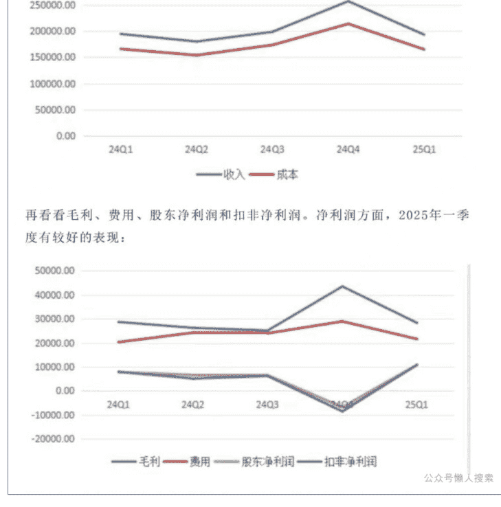
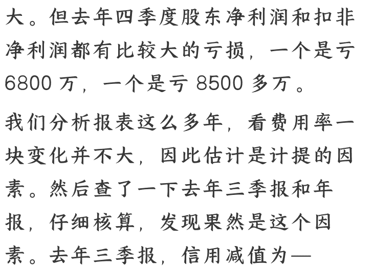
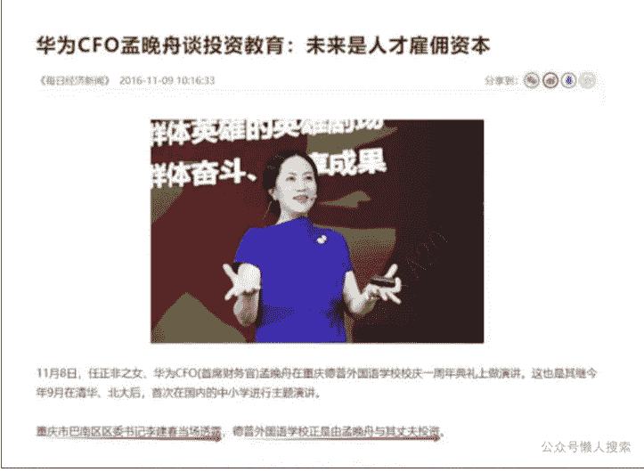
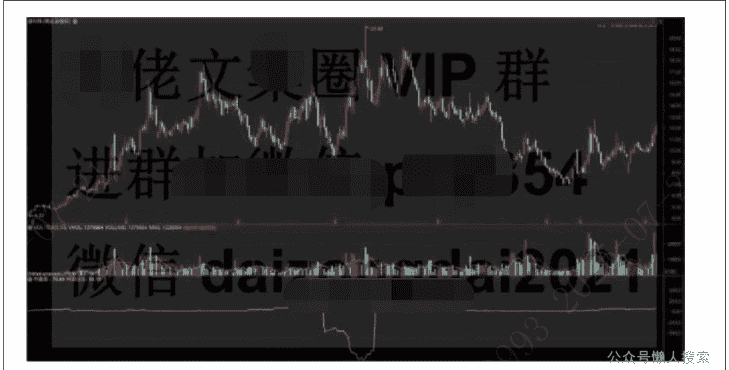
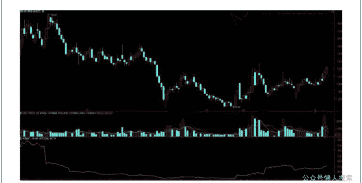
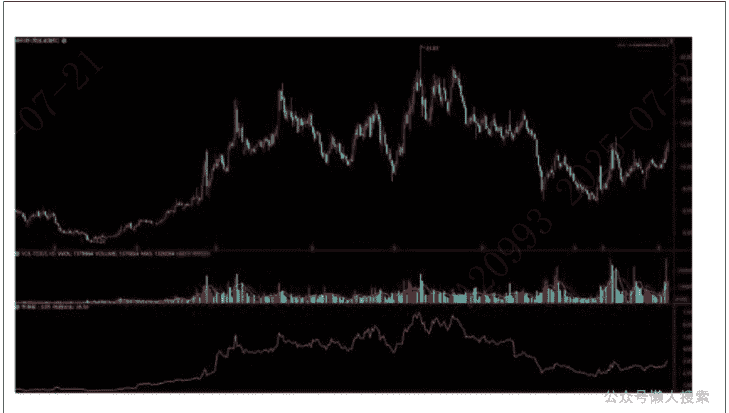

## 公司分析19：看有钱人的思路，这家公司将进入新能源汽车、飞行汽车、智能驾驶、固态电池、人形机器人赛道

250721 安民 Anmin0001 深度分析
整理：公众号懒人搜索，懒人专属群独享
懒人微信：lazyhelper

这段时间以来，很多读者发来私信，希望我们从发布的行业分析中择出一些公司分析。这项工作早就开始了。从今天起，我们团队会涉足行业分析4、行业分析2中的好些公司。我们会尽量全面地扫描并分析清楚，讲清楚每家公司的优缺点。希望大家可以从中筛选到适合自己投资风格的投资对象。也即我们的研究，会涉及到那些行业不同风格的公司。就是我们团队在面对大机会时，我们要下大功夫，坚决要抓住。

今天分析的这家主板公司，真的费了老鼻子的劲。跟当初分析券商的那家一样，完全是探案，找到一个线索的头子，再一点一滴地摸进去，然后一环扣一环，顺藤摸瓜，最后一环解开，才终于看清了它的全貌，而且好多东西都在水下。最后那个部分，它一共有10环（最后一环中有很多环节），一环连一环，一环套一环。我们团队一点点地将它拆解出来，非常不易。

我们做投资这么些年，感受最深的是散户们的想法，甚至是天真。很多散户都以为挣钱很容易，特别是挣大钱容易。这真的是奇了怪了。这导致他们很少为挣钱去想办法，下功夫，也可能他们像很多人一样，离了单位就挣不到钱，然后又不想吃苦，又不想劳神费力，不想用心去挣钱。这就导致他们缺少那种有钱人面对世界搞钱的眼光、思路和办法，而是用他们自以为是的眼光、思路和办法，以为那样就可以成为天之骄子，肯定可以实现财务自由。

那么我们团队是怎么看这件事呢？我们的观点是，在未来社会分层的情况下，您要想能挣到钱，或者是能挣到大钱，要么您是有核心竞争力的，要么您是跟定了有核心竞争力的人。比如要么您是王兴兴一类的人，要么您是他团队的成员。这类人在这个社会上之所以能发大财，是因为他有核心竞争力。

要么您有一些资源，有一些能力，那个资源尽管不大，能力尽管不是特别强，但是足够让您一辈子吃喝不愁，甚至发点小财。比如今年我们在中医院旁边看到一家小门面，就卖面、卖粉、卖豆浆啥的，早上看了大概半小时，数了数，他们一共卖了 42 碗，210 元，加上豆浆大概 220 元。

如果上面两类都跟您的情况不一样，那么您得想心思布局，您没有核心竞争力，也不想做小生意一个月挣点小钱，那么您就得提前布局，然后要提前拿到那时别人还意识不到的资源，然后做资源的整合去挣大钱。简单地讲，这类人发财，是专门有策划和布局的。这是中国社会上的另一类人，他们在为自己的富贵，在资本市场上成为一类玩家，您可能成不了那类人，但一定要知道人家是怎么玩儿的。那样的话，您就能找到自己在这个市场上的玩儿法。像以前，我们分析某公司控股券商，那是一种玩儿法，那种玩儿法有它的价值，现在这家公司分析的文章里，有一类玩家他们是另一种玩儿法。

这篇文章会让您开眼界，睁眼看这个市场上的各类角色，看他们如何表演，看他们的表演如何干净利落。然后不同人依靠他们不同的资源去挣自己的富贵，而不是叫化子认为皇上每餐吃两大碗豆腐，皇上问大臣为什么饿肚子的老百姓不食肉糜。

所以，这篇文章的后半部分，您可以当故事读，是三个男人在商言商在资本市场上的故事，或者是四个男人的故事。当然，其中某个男人的背后，还有一位全国人人共知的中美之战聚光灯下的英雄人物。大家可以看看人家是怎么创造关系，怎么利用他们的关系发自己的财的。就是，我们不要觉得发财是很简单的事情，不要用普通人的眼光看别人如何发财，而要用能发财的人的眼光，去看待这个世界。看他们在这个世界上是怎么思考，怎么操作的。因为这些是实实在在的案例，生动，鲜活，可以让很多人醒悟。

回到这家公司，这家公司是做汽车用材料的，还有通信材料，然后进入到锂电领域。当然，他们很聪明，不做普通材料，而是对材料进行改造，学术一点叫做改性，如用改性塑钢做保险杠，再改性 PEEK，改性树脂，改性碳纤维，这些都是高科技的玩意儿。正因为如此，这家公司就进入了几个很大的行业，未来还会进入好几个大行业，如新能源汽车、半固态电池和固态电池、机器人和人形机器人、飞行汽车、航空航天、5.5G 和 6G、智能驾驶等。也就是说，公司已经有了很好的基础，而且都快要站到风口边了。但最终会如何，一看公司的研发，二看公司的营销。当然，我们的分析会很深入。

全文两万多字，写时却给人连绵不绝、无穷无尽的感觉，很是无望，总觉得这篇文章怎么也分析不完。直到最后一个环节拆解完毕，才终于有穿过长长的隧道见到阳光的感觉，人一下子就轻松了许多。您在其他地方，未必能够看到；或者即使看到，也未必有它深入。文中有比较多的图表，建议您用电脑版微信阅读会更清晰一些。

（声明：本文只为开拓视野、引导思路，并非择时、亦非荐股。股市有风险，入市需谨慎，本文不构成投资建议或意见，我们无力为大家的投资负责，请大家注意投资风险）

## 一、公司原有业务与前两年经营情况

我们要先看公司 2024 年和 2023 年的经营情况，从中可以看到公司的经营到底有多大的成绩。本着深入算细账的精神，我们先看公司的各项业务和财务情况，掰开了揉碎了，一个环节一个环节算它的收成，以免被人卖了还帮人去数钱。

### (一) 公司各项业务

公司的产品，应用范围非常广泛。传统的如数据中心、手机、电脑、光模块、燃油汽车、家电，新的应用领域，如钠离子电池、光传输、5.5G 基站、新能源汽车、智能驾驶、航空航天、机器人和人形机器人、飞行汽车、各类动力电池和固态电池。这一段，建议大家好好看看。

#### 1. 改性材料

改性材料是什么呢，就是原来的某种普通材料性能达不到要求，那么人们就通过物理或化学的方法，改变材料的性能，从而获得高性能的材料。

比如一般的钢，在制作电机的铁芯时性能不够，于是人们就改性，在钢里加一定比例的硅，制作成硅钢。硅钢有高磁导率特性，在 0.5T 磁场强度下，磁感强度可达 1.6T 以上，是普通碳钢的 3 倍。如某电机厂采用 3.2%硅含量的冷轧无取向硅钢，使电机铁芯体积缩小 20%，转矩密度提升 15%。

再如我们以前研究过的一家公司新瀚新材，放在免费文章里，就有 PEEK 材料即工程塑料业务。和普通塑料相比，工程塑料有什么优势呢？工程塑料具有更高的热稳定性、机械强度和耐化学腐蚀性。所谓的热稳定性，是指工程塑料的熔融温度和热变形温度通常高于普通塑料，能在高温环境下保持稳定性能，简单地说即耐高温；机械强度方面，普通塑料的拉伸强度与相对密度的比值为 1500-1700MPa/g/cm3，部分高性能工程塑料可达 4000MPa/g/cm3。因此，工程塑料可在汽车制造中替代金属材料减轻重量，或者用于电子设备中做绝缘材料，还可用于化工领域抵抗酸碱腐蚀。这家公司不仅是工程塑料，还做改性工程塑料，即把工程塑料的性能再提高一个档次。

因此，改性材料中，塑料最常见。如将聚丙烯(PP)、尼龙(PA)、聚碳酸酯(PC)等通用塑料进行改性。比如聚碳酸酯改性后，用改性PC/ABS合金制作汽车保险杠、仪表盘，耐高温性能好；阻燃聚碳酸酯亦可用于手机外壳、充电器，安全性好，能防火；还可以将镀膜聚碳酸酯用于镜片、头盔面罩，起到防刮透光的作用。

当然，改性不只是塑料，还有金属，典型的如硅钢，再如各种合金，像飞机上用得很多的钛合金，汽车的铝合金等。除了塑料和金属，树脂、沥青、陶瓷等也常被改性。而公司的改性PEEK、改性PPS、改性PA、热塑性弹性体等材料，可用于机器人和人形机器人等相关行业；碳纤维增强系列材料、PC合金等材料可用于低空飞行如飞行汽车等相关领域。

材料的改性化率从 2010 年的 16.2% 提升至 2024 年的近 30%，未来还会进一步提升。从传统家电到智能家电，从燃油车到新能源车，从扫地机器人到人形机器人，改性材料的应用场景在不断升级，对高性能材料的要求在不断提高。未来改性材料将朝着轻量化、高性能化、功能集成化、绿色化和智能化方向发展。

这块业务主要产品包括改性聚烯烃材料（改性PP）、改性工程塑料（改性PA、改性PC/ABS）、改性聚苯乙烯（改性ABS）产品，主要应用于汽车内外饰、电子电器、航空航天、动力和储能电池周边等领域，亦可用于人形机器人和飞行汽车。

#### 2. ICT 材料

ICT 材料是信息通信技术材料，是指支撑信息通信技术（ICT）产业发展的各类关键物理材料。根据应用场景和技术特性，可分为：
- 半导体材料，用于制造芯片、集成电路等核心电子元件，如硅片、化合物半导体（砷化镓 GaAs、氮化镓 GaN）等，是通信技术行业硬件的基础材料。
- 高频通信材料。低介电损耗材料（如 LCP 液晶聚合物），主要用于 5G/5.5G 基站天线、高频电路板、手机射频模块等，以满足高速率信号传输需求。公司 ICT 材料业务主要围绕工业化液晶聚合物（LCP）的合成和应用展开，LCP 材料属于特种工程塑料，包括改性 LCP 树脂、LCP 薄膜、LCP 纤维，主要应用于信息通信等相关行业，例如 5G 高频高速高通量信号传输领域、高频电子连接器、声学线材、毫米波通讯等。
- 光学与显示材料。包括发光材料，如基于分子内电荷转移态的有机磷光材料、光纤材料等，应用于显示屏、光通信器件及防伪技术。

ICT 材料的典型应用，比如 5.5G 基站天线材料、光纤传输系统中应用于 400G/800G 光模块。再比如用于手机、电脑高频电路板、钠离子电池通信备电材料。再如用作工业机器人传感器材料、自动化产线核心元件。再比如用于算力网络光传输材料、数据中心服务器组件等等。

这段文字也来自于公司年报，公司继续在光学材料领域开发和拓展多系列新产品，包括光散射、高透光、选择性透光等材料，结合不同的零件设计，可以给用户带来不同的感官效果，尤其适用于新能源新势力车企注重个性化视觉体验的造型设计要求。

LCP 材料的基础材料是羟基羧酸类、联苯二酚类、芳香二酸类三种。它们通过缩聚反应将单体拼接成高分子链，形成 LCP 材料。简单地讲，主要是树脂。如果大家理解不了，就把它当成松树伤口流出来的松脂好了。松脂可以做成松香，拉二胡的人要用，要抹到那个弦上。

LCP 即液晶聚合物，是一种在特定温度下呈现液晶态的高分子材料，兼具流动性和晶体结构的特性。具体地，它在加热时会形成液晶态，就是介于固体和液体之间的状态，此时既具有流动性，又有晶体结构的刚性。这就让它在保持高强度的同时，具备可加工性，冷却后材料会恢复晶体结构，强度得到较大的提升。这类产品应用于航空航天、工业输送、光缆电缆及高端绳缆，它耐 350℃高温，具有高强度、低膨胀系数等特性，成为 5G 通信、防弹衣等产品的关键材料。还有速接器、线圈、开关、插座、泵零件、阀零件、汽车燃料外围零件、电子炉用容器等要用到。

公司的 LCP 业务，即树脂聚合产业化，已经干了近 20 年，2018 年开始着力研发 LCP 薄膜产品，2019 年布局 LCP 纤维产品并与核心客户共同申请专利，产品实现注塑级、薄膜级、纤维级树脂全覆盖。包括 LCP 树脂、LCP 复合材料、LCP 薄膜、LCP 纤维。有网友向公司提问，问核心客户是否为华为，公司回复，公司与核心客户签有保密协议，因此不便透露。华为 CN117510938A 专利。该专利涉及一种包含 LCP 纤维丝的半固化片、基板及印刷电路板制备方法。LCP 纤维丝介电常数为 2.5~4.5，介质损耗因子低于 0.005@10GHz，可优化高频电子产品的信号传输性能并降低成本。申请日期，2022年7月。公开日期，2024年2月6日，通过国家知识产权局公告。授权状态，截至2025年7月，该专利仍处于“发明公布”阶段，尚未显示授权信息。而普利特是否与华为有共同开发LCP纤维专利，具体专利号及授权状态目前并没有公开披露，但华为的确有LCP纤维方面的研发，公司在前几年也有这方面的研发项目。

#### 3. 锂电业务

这一块不深讲，后面会很具体地讲到各类产品。

关于公司的产品，可以看下面一段话，来自于公司的年报：公司主要从事高分子新材料产品及其复合材料的研发、生产、销售和服务。公司明确了主要经营发展的三大产业板块：改性材料产业、ICT材料产业和特殊化学品产业。公司改性聚烯烃材料（改性PP）、改性ABS材料、改性聚碳酸酯合金材料（改性PC合金）、改性尼龙材料（改性PA）产品主要应用于汽车内外饰材料、电子电器材料、军工航天材料等；公司的ICT材料，主要有LCP树脂、LCP复合材料、LCP薄膜、LCP纤维，其中LCP复合材料应用于高频高速连接器、散热风扇（注意，很多通信器材空间不大，必然要用到散热风扇）等，LCP薄膜应用于柔性电路板基材、耳机振膜等，LCP纤维应用于高速电路板基材、线缆等。同时，公司光刻胶、高分子助剂、气凝胶等产品也在积极研发或批量供货中。公司的三元锂离子电池、磷酸铁锂锂离子电池、钠离子电池应用于电动工具、智能家电、通信、储能、轨道交通、航空航天等领域。

### (二) 公司业务情况

#### 1. 通用改性塑料（单位：万元）

| 项目 | 2023 年 | 2024 年 | 增速% | 增量 |
|---|---|---|---|---|
| 收入 | 334758.08 | 379970.5 | 13.51 | 45212.42 |
| 成本 | 285701.83 | 318744.73 | 11.57 | 33042.90 |
| 毛利 | 49056.25 | 61225.77 | 24.81 | 12169.52 |
| 毛利率% | 14.65 | 16.11 |  | 1.46 |

收入中速增长，增量 4.52 亿；毛利中高速增长，增量 12169.52 万。成本增速低于收入增速 1.94 个百分点，带动毛利率提升 1.46 个百分点，正面影响毛利 5543.98 万，占毛利增量的 45.56%。

#### 2. 工程改性塑料（单位：万元）

| 项目 | 2023 年 | 2024 年 | 增速% | 增量 |
|---|---|---|---|---|
| 收入 | 165450.86 | 162953.67 | -1.51 | -2497.19 |
| 成本 | 122924.79 | 121719.03 | -0.98 | -1205.76 |
| 毛利 | 42526.07 | 41234.64 | -3.04 | -1291.43 |
| 毛利率% | 25.70 | 25.30 |  | -0.40 |

收入略有下滑，同比减少 2500 万；毛利个位数下滑，同比减少 1291.43 万元。成本增速高于收入增速 0.53 个百分点，带动毛利率下滑 0.40 个百分点，负面影响毛利 649.57 万元。这项业务，2024 年一般般。这两类改性塑料，一共增加毛利 10878.09 万元。

#### 3. 其他类产品（单位：万元）

| 项目 | 2023 年 | 2024 年 |
|---|---|---|
| 改性和 ICT 材料中的其他 | 166761.86 | 89840.5 |
| 锂电中的其他 | 6804.62 | 4206.01 |

公司把其他类产品放到最后，我们把它提前到这里讲。原因就在于，它主要是比较边缘的改性材料或比较边缘化的ICT材料。其中也含有少量的边缘化的电池类产品。收入超高速下滑，同比减少7.95亿；毛利中速下滑，同比减少3183.24万；成本增速低于收入增速3.36个百分点，带动毛利率提升5.56个百分点，正面影响毛利5228.01万元。也即这项业务2024年做得并不好。

然后我们看看这类产品中，改性材料和ICT材料中的其他，以及锂电中的其他，看看它们的收入构成（单位：万元）：

| 项目 | 2023年 | 2024年 | 增量 |
|---|---|---|---|
| 收入 | 166761.86 | 89840.5 | -76921.36 |
| 成本 | 151850.88 | 74333.39 | -77517.49 |
| 毛利 | 14910.98 | 15507.11 | 596.13 |
| 锂电中的其他 |  |  |  |
| 收入 | 6804.62 | 4206.01 | -2598.61 |
| 成本 | 3356.56 | 4537.32 | 1180.76 |
| 毛利 | 3448.06 | -331.31 | -3779.37 |

改性材料和ICT材料中的其他，收入下降7.69亿；毛利增量596.13万；锂电中的其他，收入减少2600万，毛利减少3779.37万，下降得厉害，而且2024年毛利是负的，售价比成本还低。这两项业务都做得不咱地。而且这里出了个特别典型的低于成本销售的例子。上述三类业务，共产生毛利增量7694.85万元。

#### 4. 三元圆柱锂电池（单位：万元）

公司的子公司江苏海四达电源及其控股的湖南海四达是生产锂电池的。三元圆柱锂电池是其中的一种。

| 项目 | 2023年 | 2024年 | 增速% | 增量 |
|---|---|---|---|---|
| 收入 | 77860.71 | 117438.11 | 50.83 | 39577.40 |
| 成本 | 67475.83 | 112138.33 | 66.19 | 44662.50 |
| 毛利 | 10384.88 | 5299.78 | -48.97 | -5085.10 |
| 毛利率% | 13.34 | 4.51 |  | -8.82 |

收入超高速增长，增量3.96亿；毛利超高速下滑，同比减少5085.10万元。成本增速高于收入增速15.36个百分点，带动毛利率下滑8.82个百分点，毛利率降到了4.51%。这是内卷，同行相互卷收入和毛利率。三元圆柱电池尽管收入增长快，但是毛利却高速下滑。这是很坏的结果。至此，上述4项业务共带来毛利增量2609.75万元。

#### 5. 磷酸铁锂电池（单位：万元）

| 项目 | 2023年 | 2024年 | 增速% | 增量 |
|---|---|---|---|---|
| 收入 | 116500.36 | 73897.11 | -36.57 | -42603.25 |
| 成本 | 93876.11 | 73843.93 | -21.34 | -20032.18 |
| 毛利 | 22624.25 | 53.18 | -99.76 | -22571.07 |
| 毛利率% | 19.42 | 0.07 |  | -19.35 |

收入超高速下滑，同比减少4.26亿；毛利更是超高速下滑，同比减少22571.07万元。成本增速高于收入增速15.23个百分点，带动毛利率下滑19.35个百分点，毛利率降到了0.07%，已经聊胜于无了。这自然更是内卷。这是最坏的结果，收入降得很，毛利快都没有了。7个多亿的收入，53.18万的毛利，净利润铁定亏损。我们前面讲了个例子，做食品生意1亿多的销售，最后亏损，年底一结账，盈利55万，是靠广告盈利的。

这里终于找到更有代表性的一个例子了。收入7.39亿，毛利53.18万。

至此，上述5项业务共减少毛利19961.32万元。

| 聚合物软包锂电 | 2023年 | 2024年 | 增速% | 增量 |
|---|---|---|---|---|
| 收入 | 738.47 | 326.57 | -55.78 | -411.90 |
| 成本 | 315.1 | 108.3 | -65.63 | -206.80 |
| 毛利 | 423.37 | 218.27 | -48.44 | -205.10 |
| 毛利率% | 57.33 | 66.84 |  | -9.51 |

收入超高速下滑，同比减少400多万；毛利超高速下滑，同比减少205.10万；成本增速低于收入增速9.85个百分点，带动毛利率提升9.51个百分点，正面影响毛利31.05万元。也即这项刚开始做不久的业务也不咋样，估计主要是大气候的影响。

至此，上述6项业务共减少毛利20166.42万元。

#### 7. 镍系电池（单位：万元）

| 镍系电池 | 2023年 | 2024年 | 增速% | 增量 |
|---|---|---|---|---|
| 收入 | 2062.49 | 2721.22 | 31.94 | 658.73 |
| 成本 | 1743.32 | 2622.16 | 50.41 | 878.84 |
| 毛利 | 319.17 | 99.06 | -68.96 | -220.11 |
| 毛利率% | 15.47 | 3.64 |  | -11.83 |

收入超高速增长，增量600多万；毛利超高速下滑，同比减少220.11万元。成本增速高于收入增速18.47个百分点，带动毛利率下滑11.83个百分点，毛利率降到了3.64%。从数据看，高镍电池业务开展的时间并不太长，但是也卷得很。跟三元圆柱电池类似，毛利也快没了。由此可以看出，公司为啥要搞半固态电池了，为啥那么快地地上马，因为没有办法了。

然后公司下马了100多亿的传统锂电投资，这是有原因的。总体上是反应快，转身还比较快。

至此，全部7项业务同比减少毛利20386.53万元。

#### 8. 全部业务（单位：万元）

| 全部业务 | 2023年 | 2024年 | 增速% | 增量 |
|---|---|---|---|---|
| 收入 | 870937.45 | 831353.69 | -4.54 | -39583.76 |
| 成本 | 727244.42 | 708047.19 | -2.64 | -19197.23 |
| 毛利 | 143693.03 | 123306.5 | -14.19 | -20386.53 |
| 毛利率% | 16.50 | 14.83 |  | -1.67 |

收入个位数下滑，同比减少3.96亿元；毛利中速下滑，同比减少20386.53万元。成本增速高于收入增速1.90个百分点，带动毛利率下滑1.67个百分点，负面影响毛利13855.74万元。主要是电池业务影响的结果。2024年，因为整个锂电池行业内卷影响，公司的业务表现，上面已经很清楚。

### （二）各财务环节的影响

#### 1. 费用对营业利润的影响（单位：万元）

| | 2023年 | 2024年 | 增量 | 影响 |
|---|---|---|---|---|
| 税金及附加 | 4430.21 | 3464.68 | -965.53 | 965.53 |
| 销售费用 | 11400.4 | 13765.69 | 2365.29 | -2365.29 |
| 管理费用 | 23903.82 | 21656.18 | -2247.64 | 2247.64 |
| 财务费用 | 8863.75 | 9339.08 | 475.33 | -475.33 |
| 研发费用 | 51419.13 | 49045.61 | -2373.52 | 2373.52 |
| 小计 | | | | 2746.07 |

除了税金及附加、财务费用，其他影响都大。销售费用还增长了快2400万，好在管理费用减少了2200多万。5个环节共增加营业利润2746.07万。经过这5个环节，公司营业利润同比减少17640.46万元。

#### 2. 利得和损失对营业利润的影响（单位：万元）

| | 2023年 | 2024年 | 增量 | 影响 |
|---|---|---|---|---|
| 其他收益 | 12444.1 | 13488.5 | 1044.4 | 1044.4 |
| 投资收益 | -485.87 | -13.35 | 472.52 | 472.52 |
| 公允价值变动收益 | 4.33 | 28.76 | 24.43 | 24.43 |
| 信用减值损失 | 776.06 | -4120.3 | -4896.36 | -4896.36 |
| 资产减值损失 | -6814.39 | -21085.36 | -14270.97 | -14270.97 |
| 资产处置收益 | 11.91 | 0 | -11.91 | -11.91 |
| 小计 | | | | -17640.46 |

影响大的就资产减值和信用减值。资产减值包括固定资产折旧、存货计提等。信用减值主要是应收和其他应收计提。

#### 3. 营业外收支、所得税等的影响（单位：万元）

| | 2023年 | 2024年 | 增量 | 影响 |
|---|---|---|---|---|
| 营业外收入 | 677.8 | 85.4 | -592.4 | -592.4 |
| 营业外支出 | 667.9 | 870.54 | 202.64 | -202.64 |
| 所得税费用 | 2333.94 | 4718.02 | 2384.08 | -2384.08 |
| 少数股东损益 | 450.48 | -5284.19 | -5734.67 | 5734.67 |
| 小计 | | | | 2555.55 |

6个环节共减少营业利润17637.89万元。经过这6个环节，公司营业利润同比减少35278.35万元。

所得税费用和少数股东损益影响都大。4个环节共增加股东净利润2555.55万元。2024年少数股东亏损5284.19万元，而恒信睿远就是少数股东，3亿入股湖南海四达，加上公司对江苏海四达电源是控股，据2022年报道，普利特购买海四达集团所持海四达电源79.7883%股权，转让对价为11.41亿元。股权转让完成后，公司有权向海四达电源增资不超过8亿元。股权转让及未来增资8亿元完成后，普利特将持有海四达电源87.0392%股权。因此，这5284.19万元有可能不光是恒信睿远的亏损。

经过全部业务环节和全部财务环节，公司股东净利润同比减少32722.80万元，为超高速下滑。

### （三）2024年公司股东净利润影响因素及其排序

影响公司2024年股东净利润的因素一共有22个，其中正面影响因素8个，负面影响因素14个。各个因素及其影响排序见下表（单位：万元）：

| 排序 | 正面影响 | 影响额 | 负面影响 | 影响额 | 合计 |
|---|---|---|---|---|---|
| 1 | 通用改性塑料 | 12169.52 | 磷酸铁锂电池 | -22571.07 |  |
| 2 | 少数股东损益 | 5734.67 | 资产减值 | -14270.97 |  |
| 3 | 研发费用 | 2373.52 | 三元圆柱电池 | -5085.1 |  |
| 4 | 管理费用 | 2247.64 | 信用减值 | -4896.36 |  |
| 5 | 其他收益 | 1044.4 | 其他类 | -3183.24 |  |
| 6 | 税金及附加 | 965.53 | 所得税费用 | -2384.08 |  |
| 7 | 投资收益 | 472.52 | 销售费用 | -2365.29 |  |
| 8 | 公允价值变动 | 24.43 | PEEK | -1291.43 |  |
| 9 |  |  | 营业外收入 | -592.4 |  |
| 10 |  |  | 财务费用 | -475.33 |  |
| 11 |  |  | 镍系电池 | -220.11 |  |
| 12 |  |  | 聚合物软包电池 | -205.1 |  |
| 13 |  |  | 营业外支出 | -202.64 |  |
| 14 |  |  | 资产处置 | -11.91 |  |
| 小计 | | 25032.23 | | -57755.03 | -32722.8 |

至此，我们可以对公司2024年的工作进行全面而较为深入透彻的总结。

2024年，公司的业务表现不好，承受了很大的压力。

有6项业务毛利下滑，其中磷酸铁锂电池减少毛利2.26亿，三元圆柱电池减少5100万，锂电中的其他和改性PEEK共下滑5100万。镍系电池和聚合物软包电池下滑量不大，但幅度大。电池毛利全线告急，只剩下1890.92万元，降下来的有31860.75万，降幅高达94.40%，差不多一年降完。

很显然，这是行业极度内卷的结果，卷市场，表现出来是卷价格，然后毛利率下降，毛利大降。锂电中的其他，已经是亏着成本在卖货了。

然后5类锂电和一个改性PEEK共计减少毛利3.32亿。但有两种材料毛利增加，一种是通用改性塑料，一种是改性中的其他，共增加毛利1.28亿，主要是通用改性塑料带来的毛利增量。全部业务共计减少毛利20386.53万。费用节约了2746.01万元，利得和损失减少营业利润17637.89万元，营业外收支、所得税费用和少数股东损益等共增加利润2555.55万。经过全部业务环节和全部财务环节，公司股东净利润同比减少32722.80万，是一种超高速下滑。

### （四）公司基本情况（单位：万元）

| | 2023年 | 2024年 | 增速% | 增量 |
|---|---|---|---|---|
| 收入 | 870937.45 | 831353.69 | -4.54 | -39583.76 |
| 股东净利润 | 46837.36 | 14114.53 | -69.86 | -32722.83 |
| 扣非净利润 | 43302.7 | 10646.47 | -75.41 | -32656.23 |
| 经营性现金流 | 83571.95 | -19680.96 | -123.55 | -103252.91 |
| 净资产收益率% | 13.32 | 3.28 |  | -10.04 |
| 总资产 | 1190720.98 | 1170894.28 | -1.67 | -19826.70 |
| 净资产 | 431624.98 | 431019.16 | -0.14 | -605.82 |
| 非经常性损益 | 3534.66 | 3468.06 |  | -66.60 |

这个看看就好。收入减少3.96亿，股东净利润同比减少32722.83万，同比下降近7成，这个前面仔细计算过了。扣非以后降幅更大，超过3/4。经营性现金流量净额为—1.97亿，同比下降10.33亿，表明利润尽管少，还在途，挂账没有收回。净资产收益率下滑10.04个百分点，总资产减少1.98亿，净资产减少600万，非经常性损益突然变得重要起来，占股东净利润比例为24.57%，接近1/4。

在锂电池杀价影响下，公司2024年经营表现是很不好看。

### （五）子公司情况（单位：万元）

| 子公司 | 2023年收入 | 2023年净利润 | 2024年收入 | 2024年净利润 |
|---|---|---|---|---|
| 浙江普利特 | 384292.27 | 10823.25 | 407127.34 | 18424.43 |
| 重庆普利特 | 71669.42 | 527.38 | 78810.55 | 354.9 |
| 上海普利特化工 | 7228.22 | 2404.41 | 5243.39 | -1100.06 |
| 浙江燕华供应链 | 104825.22 | 304.6 | 43672.12 | 155.84 |
| 上海普利特伴泰 | 4373.56 | 258.46 | 4715.4 | 437.92 |
| 浙江普利特供应链 | 33197.37 | 1863 | 20028.89 | 1500.04 |
| 天津普利特 | 0 | 25.72 | 0 | 364.01 |
| 上海翼鹏投资 | 69163.65 | 7641.85 | 60937.95 | 1683.08 |
| 江苏海四达电源 | 229636.21 | 5576.11 | 209039.2 | 37918.23 |

这些一样，看看就好。只是比较奇怪，江苏海四达电源 2024 年居然净利润有 37918.23 万，原本以为搞错了，再查了一遍，发现没有错。我们前面判断它应该是亏损的，因此觉得少数股东损益中，海四达电源的少数股东损益也应该亏损。但公司公布的数据就是这样，我们将前面的计算分析判断和这里的数据都保留下来。未来我们将会随时跟踪这方面的变化情况。

## 二、公司 2025 年一季度和二季度经营情况（单位：万元）

| | 24Q1 | 增速 | 24Q2 | 增速 | 24Q3 | 增速 | 24Q4 | 增速 | 25Q1 | 增速 | Q2最低 | Q2最高 |
|---|---|---|---|---|---|---|---|---|---|---|---|---|---|
| 收入 | 194741.79 | 2.04 | 180245.43 | -15.71 | 198807.04 | -18.87 | 257559.43 | 16.44 | 193408.04 | -0.68 | | |
| 成本 | 166110.74 | 1.07 | 154062.16 | -13.26 | 173698.77 | -11.40 | 214175.52 | 13.19 | 165144.15 | -0.58 | | |
| 毛利 | 28631.05 | 8.04 | 26183.27 | -27.72 | 25108.27 | -48.75 | 43383.91 | 35.66 | 28263.89 | -1.28 | | |
| 毛利率% | 14.70 | | 14.53 | | 12.63 | | 16.84 | | 14.61 | | | |
| 费用 | 20265.31 | 14.07 | 24204.20 | 10.49 | 23931.68 | -8.86 | 28870.06 | -15.31 | 21551.36 | 6.35 | | |
| 费用率% | 10.41 | | 13.43 | | 12.04 | | 11.21 | | 11.14 | | | |
| 股东净利润 | 7845.26 | -24.25 | 6555.78 | -32.95 | 6514.11 | -67.56 | -6800.62 | -202.72 | 10901.33 | 38.95 | 9098.67 | 13098.67 |
| 净利率% | 4.03 | | 3.64 | | 3.28 | | -2.64 | | 5.64 | | | |
| 扣非净利润 | 7893.45 | -9.83 | 5126.64 | -42.26 | 6160.92 | -68.90 | -8534.54 | -245.69 | 10796.36 | 36.78 | 8703.64 | 12403.64 |
| 扣非净利率% | 4.05 | | 2.84 | | 3.10 | | -3.31 | | 5.58 | | | |

我们看下它 5 个季度的收入和成本:

再看看毛利、费用、股东净利润和扣非净利润。净利润方面，2025年一季度有较好的表现：

上图中，去年四季度毛利是最高的，费用虽然也上升，但和毛利之间的差距拉大，表明利润空间其实应该扩大。但去年四季度股东净利润和扣非净利润都有比较大的亏损，一个是亏6800万，一个是亏8500多万。

我们分析报表这么多年，看费用率一块变化并不大，因此估计是计提的因素。然后查了一下去年三季报和年报，仔细核算，发现果然是这个因素。去年三季报，信用减值为—107.92万，年报为—4120.3万，相差4012.38万。资产减值损失，三季度为正346.41万，年报为—21085.36万，相差21431.77万。再加上信用减值的因素，就有25444.15万。

再看毛利率、费用率、股东净利率和扣非净利率。这个图和上个图比较相似。

同样的道理，今年一季度股东净利润和扣非净利润增速都不错，查收入和毛利率，变化都不大。收入略低，毛利率略低，费用略高，因此利润增长只能是计提的因素，查了下报表，果然。然后公司公布了今年半年报业绩增长。按最低算，只看今年二季度，股东净利润最低增长38.79%，最高增长99.80%；扣非净利润最低增长69.77%，最高增长141.94%。扣非净利润最低增长69.77%，表明公司业务的确有好转。

然后公司讲了两条业绩向好的原因：

- 一是公司加大改性业务市场的开拓，推动公司改性材料业务继续增长（表明改性材料销售增加了，体现在汽车领域和非汽车领域）。在汽车领域，新增产能释放下，推动业务稳定增长；在非汽车领域，受益于新客户的突破和新市场的开拓，业务增长迅速。注意这第二句，中报时大家可以仔细核对，看是真是假。
- 二是新能源业务经营情况持续好转，同时公司钠离子电池和半固态电池产品出货增加，对公司半年度业绩起到积极作用。

也就是新能源行业，传统电池的情况有改善，然后钠离子电池和半固态电池起到了比较好的作用。

当然，这是公司的解释，具体要到半年报出来后跟踪，看看到底是什么原因起到的作用比较大。也就是，我们需要半年报来确认半固态电池、钠离子电池和整个电池的情况。包括前面新市场的开拓，可以看看是哪类市场的开拓，是机器人吗？是飞行汽车吗？是智能驾驶吗？

## 三、公司的内在投资逻辑

这家公司是普利特，代码是 002324，需要讲清楚，本文是分析这家公司的基本面，并不是讲它的技术面的，而是结合行业大势分析公司基本面上未来是否有投资机会的。这篇文章并不能保证您进入市场就能挣钱，那不是本文的范畴。我们做公司分析，但不荐股。具体怎么买，如何买，您最好还是要懂点技术，知道买卖点。

还有，我们对本公司好些方面的挖掘是根据线索一点点摸进去的，跟探案类似。因此，对这类挖掘您最好要仔细看，深入地看，因为这后面可能水比较深。

这些材料，有的人可能觉得是大机会，但有的人也可能觉得是风险。有好些方面我们只讲事实，您得自己判断自己下结论，免得您读后还觉得我们误导您。

公司未来的机会，主要缘于公司的产品布局及其他种种资源。比如和中科院物理所的关系（卫蓝新能源），和华为的关联与背后的业务合作，也包括浏阳市政府已经介入成湖南海四达的股东，未来那家公司极有可能分拆上市。

### （一）公司的产品与业务布局

这篇文章，我们对公司产品介绍得比较详细，比以前的文章要详细得多。为什么呢？正是为了看清楚公司的业务布局。如果大家忘记了，可以回头去看看。

从前面的产品来看，公司未来会涉及到很多个大行业。如新能源汽车、自动驾驶、机器人和人形机器人、飞行汽车、固态电池。当然还有其他一些行业如5.5G和6G、航空航天。为什么要谈这几个大行业呢？因为我们今年有4篇行业分析文章，如果您不清楚，建议去看看。看了那些文章，您就知道这些行业的增量市场会是个什么情况。

所以，这家公司的投资逻辑第一条，就是它的未来面临好几个大行业，其中每一个行业都足够大，都是几万亿到十几万亿的市场，特别是，有几个大行业都是增量大市场。当然，公司能够从中挣到多少收入和利润，还得公司自己努力。

#### 1. 汽车和新能源汽车、智能驾驶

普利特是小鹏汽车的核心材料供应商之一，有汽车内外饰、热管理及三电类材料、热塑性弹性体、再生低碳材料、特种工程材料等新技术，包括有系统解决方案。2021年年报披露，公司累计共21款材料进入戴姆勒全球采购清单；累计有23款材料进入宝马集团标准材料平台；累计共80款材料通过认证进入福特全球采购清单。

新能源汽车领域，公司有轻量化、高性能、低碳环保的材料。如透光 PP、软触感材料、仿植绒材料、注塑表皮材料、碳纤维增强材料等。透光 PP 材料用于汽车内外饰，体验感非常好。软触感材料体验感好，注塑成型优越，还环保回收。碳纤维增强材料是飞机和高端新能源汽车的常用材料，也是飞行汽车要用到的，可以大大减轻飞行汽车重量，使得电池维持飞行和行驶的时间更长。TPE 弹性体材料用于软质表皮的注塑成型，效果极好，还可回收。改性 PEEK 材料在人形机器人上要用到，因为减轻重量，节约电池能量。增强 PPS、PPA、PPO、PEEK、LCP 等各类高性能材料，可以用于汽车热管理和三电领域，如电磁水泵、冷却液管道、电磁阀、散热器、电池壳体、电芯支架等，还有用作保险杠的。它们亦是电子通讯行业的关键材料。LCP 薄膜产品用于智能驾驶和手机通信等领域。

在智能化座舱材料方面，公司成功开发了具有低摩擦系数，具备吸波降噪特性的软触感材料，并积极与客户合作进行配方设计到注塑工艺优化，已经形成一套完整的材料解决方案并应用于知名合资品牌的部分零件中。

#### 2. 人形机器人和飞行汽车

我们要注意一点，就是能用于汽车的材料，很多都可用于飞行汽车。人形机器人领域，普利特投资10亿元建设的广州南沙新材料基地的二期项目生产改性聚醚醚酮（PEEK）、改性聚苯硫醚（PPS）、液晶聚合物（LCP）和碳纤维增强材料等，就是针对低空经济产业链如飞行汽车和人形机器人的。

- 改性聚醚醚酮（PEEK）：应用部位就是关节齿轮与轴承，用在谐波减速器上，还有骨架、躯体、四肢、丝杠、传感器外壳、执行器、电机部件。比强度约是铝合金的8倍，密度仅为1.3—1.5g/cm³，可以显著地减轻重量；长期使用温度250℃，耐高温；耐磨，有优异的自润滑特性。
- 改性聚苯硫醚（PPS）：应用部位，关节连接件、传动齿轮、轴承组件、辅助关节。热变形温度≥260℃，具有自阻燃性和优异耐磨性，可延长高频摩擦部件的使用寿命。
- 液晶聚合物（LCP）：应用部位，伺服电机连接器、高频信号连接器。耐200℃以上的高温，尺寸稳定性好，兼具电绝缘性。这个材料还是5.5G和6G通信中要用到的材料。
- 碳纤维增强材料：应用部位，机械臂、结构件、骨架、关节部件，也可用于飞行汽车和汽车外壳以替代金属。较铝合金减重30%，同时强度更高，提升运动灵活性和能效。

#### 3. 半固态电池和固态电池

公司本来就生产锂电池，海四达 2002 年即开始动力锂电池相关技术的研发和储备，2009 年完成产业化，面向电动工具、通信基站、储能等领域逐步推出锂离子电池产品，是国内较早实现锂电池技术产业化的企业之一。钠离子电池研发，海四达已与中科海钠形成全方位战略合作。公司 2025 年 3 月投产广东省首条半固态储能电池专用产线，半固态电池已通过梅赛德斯—奔驰测试车验证，珠海基地已建成产能为 6GWh，是国内首家从实验室到量产全线打通的企业；公司正在规划全固态电池的中试生产线。

公司 2020 年年报披露，伴泰导电聚苯硫醚复合材料和绝缘聚苯硫醚复合材料进入新能源动力电池巨头体系并实现量产；2022 年年报披露，多款阻燃聚酰胺材料在新能源汽车动力电池系统得到应用；同时开发耐高温聚酰胺材料、长碳链聚酰胺材料应用在电子电器、汽车等领域。2023 年年报披露，控股子公司江苏海四达电源有限公司与北京卫蓝新能源科技有限公司达成战略合作，共同携手在新一代电池上迅速导入固态电解质体系，快速研发高可靠、高安全的新一代电池进行推广应用，并同时在市场端开展合作。

当然，公司在 5.5G 通信和 6G 通信方面还有布局，大家可以在后面的专利，还有公司股权变化中看到。

### 4. 公司的研发投入与专利

#### （1）公司的研发投入（单位：万元）

| 研发投入 | 金额 | 占收入比例% |
|---|---|---|
| 2019年 | 18049.41 | 5.01 |
| 2020年 | 21285.9 | 4.79 |
| 2021年 | 24854.27 | 5.1 |
| 2022年 | 35770.66 | 5.29 |
| 2023年 | 51419.13 | 5.9 |
| 2024年 | 49045.61 | 5.9 |

#### （2）公司的研发项目

2021 年，公司 3 个研发项目都是车子的，当然也包括新能源汽车。

2022 年研发，有 5 项都是汽车和新能源汽车的。有 1 项人工智能的，就是基于人工智能环境设计的长碳链尼龙材料国产化开发。有 3 项是通信的，如 5G 用低介电液晶高分子（LCP）复合材料的研发、高电导率液晶高分子（LCP）复合材料的研发，48V 系列通讯后备电源，都是通信行业的，第二项也能应用到新能源汽车，第 3 项也属于锂电。有 4 项是电池方面的。其中 FP73173200—280M3（卷绕）项目，公司描述为高容量产品，为公司利润创造新的增长极，小批量试产电池制作中，满足 0.5C 循环 6000 次 80%，据此推测为半固态电池研发。还有一个为半固态储能源电池，属于家用储能领域。再有一个钠离子电池项目，一个为动力电池和储能方形电池方面的复合材料。

2023年的研发项目共16项，其中仿金属色免喷涂ABS材料，可用于汽车、家电、机器人、通信和消费电子、医疗器械、无人机、智能家居。新能源汽车方面的有6项研发，通信方面的为3项，电池领域是6项，其中4项是储能的，1项为半固态的。另有1项为钠电池或者是半固态的，年报披露信息太少，不太好确定。

2024年，公司的研发项目为13个，其中通信行业1个，汽车行业5个（其内有1个亦可应用于电子行业），3个为半固态和固态电池、聚合物软包电池项目，4个储能和户外备电、启停产品项目。很明显，重点转到电池和汽车。电池行业达到7项，通信行业技术布局已经基本完成。

2023年年报，截至2023年12月31日，海四达电源及其子公司已获得知识产权73项，其中发明专利30项，实用新型62项，外观专利1项，软件著作权登记21项。公司在固态电池研发方面，携手卫蓝新能源在新一代电池上迅速导入固态电解质体系，这个前面讲到过。讲这段文字，是讲公司年报中有确认。

#### （3）公司的专利

下表是到2024年底公司各类产品的专利数量（单位：项）：

| 类别 | 授权专利数 | 专利类型 |
|---|---|---|
| 改性聚烯烃类 | 74 | 通用材料类 |
| 改性ABS类 | 24 | 工程材料类 |
| 塑料合金类 | 40 | 特种工程材料类 |
| LCP类 | 14 | LCP类 |
| 其他类 | 52 | 其他类 |
| 圆柱锂电类 | 38 | 圆柱锂电类 |
| 方型锂电类 | 59 | 其他类 |
| 钠电池类 | 9 | 其他类 |

| 年份 | 中国专利累计 | 发明专利 | 实用新型 | 软件著作权 | 在申请专利 |
|---|---|---|---|---|---|
| 2020年 | 154 | 148 | 6 | 1 | 217 |
| 2021年 | 155 | 149 | 6 | 1 | 194 |
| 2022年 | 179 | 167 | 12 | 1 | 156 |
| 2023年 | 197 | 184 | 13 | 1 | 153 |
| 2024年 | 298 | 222 | 64 | 21 | 122 |

需要说明的是，2024年底在申请专利数122项，它是6月底的数据，年报中没有公布这个数据，正常估计会在110到230项。

### （二）投资逻辑二：公司背后的大戏

这场大戏，涉及到三家公司，卫蓝新能源和中科海钠，它们是中科院物理所的背景，可以看成一家公司。再就是华为；再就是江苏海四达和湖南海四达，也可以看成一家公司，湖南海四达背后还涉及到浏阳市人民政府。此外，有几个重要角色要登场了。

- 第一个，周文，是公司董事长。
- 第二个，吴昊，公司副董事长、恒信华业董事长，浏阳市人民政府投资3亿到湖南海四达，就是通过他的基金入局，因此，他的故事还没有讲完。
- 第三个，于勇，他和吴昊共同创办恒信华业，他持股55%，吴昊持股45%，恒信华业通过平潭华业受让周文转让的5%的股权，于2023年底之前已经退出。于勇和普利特的故事是否已经讲完，至少2023年底已暂时告一段落。
- 第四个，刘晓棕。刘晓棕早年在华为工作，后来离开华为，原因是为他所钟爱的女人。那个女人也是我们心目中的偶像，姓孟，人称长公主，我们都喜欢她，她是中国人民心目中的女英雄。对了，她丈夫和于勇们的合作，都是很正常的合作关系。这一点先要讲清楚，且重点强调一下。不能做了她的丈夫就什么都不能做，凡是做点什么都是干坏事对吧。

就是我们做任何事情，都不能先预设立场，或者是先下结论再去找证据。那样的话，我们就是戴着有色眼镜看待这个世界，那样的话，会扭曲这个世界也扭曲自己的。

这后面的研究，主要是定性研究，用的是探案的手法。叫探案，并不是说它们是案件，只是因为这里所用的办法和探案的手法一样，延着线索一路追踪过去，就是这个办法和思路跟探案一样而已。这是要特别说明的。

我们将追踪隐藏在公司背后的蛛丝马迹，把一些有意思的东西展开在大家面前。这些内容会涉及到好些公司的股权，包括令人眼花缭乱的手法。您千万看清楚，最好用纸条记录下重点，不然您会看错的，闹不好就把您绕糊涂了。这并不是我们不想好好讲清楚，而是事情本来就是如此迷离。

注意图中最后一句话，巴南区委书记讲的，该学校是孟晚舟和她的丈夫投资的。

11 月 8 日，任正非之女、华为 CFO（首席财务官）孟晚舟在重庆德普外国语学校校庆一周年典礼上做演讲。这也是其继今年 9 月在清华、北大后，首次在国内的中小学进行主题演讲。

重庆市巴南区区委书记李建春当场透露，德普外国语学校正是由孟晚舟与其丈夫投资。

#### 2. 德普外国语学校投资背景

德普外国语学校由重庆德普教育投资有限公司投资，而德普教育成立于 2013 年，法定代表人为雷鸣，股东有 7 人，孟晚舟丈夫刘晓棕为股东之一，且为公司董事。学校于 2015 年 9 月正式建成开学。

记者注意到，德普教育成立于 2013 年，注册资金 1.86 亿元。现在变成了 31841.6 万元。

这家公司正是重庆德普教育投资有限公司。另有报道讲德普教育的另一股东重庆加中投资有限公司的股东名单中，亦有刘晓棕的名字，因为关系不大，我们没有追踪。

重庆德普教育投资有限公司股东名单是：董事长刘斌，董事甘意、谭启、汤月生（3人在这里与刘晓棕产生交集）；经理相磊磊，是法定代表人，监事刘晓棕。也就是股东有变化，法定代表人变了，刘晓棕从董事变成了监事。这家公司由德普教育（深圳）有限公司全资控股。

上面这段，是我们结合《每日经济新闻》2016年11月9日的报道重新进行梳理的结果。换句话讲，区委领导的话并不严谨，孟晚舟并没有投资那所学校，她的丈夫有投资。

#### 3. 德普教育（深圳）有限公司的股东构成

德普教育投资控股（深圳）有限公司持股74.5988%；自然人股东刘晓棕持股25.4012%。

该公司的法定代表人、董事长和总经理叫于勇。于勇与刘晓棕的交集在这里。

#### 4. 德普教育投资控股（深圳）有限公司

于勇同时还是德普教育投资控股（深圳）有限公司的法定代表人，持有该公司34.4259%的股份，他通过德普教育投资控股（深圳）有限公司间接控制德普教育（深圳）有限公司。德普教育投资控股（深圳）有限公司的股东中，还有谭启（持股17.9755%）、汤月生（持股14.9495%）、甘意（持股9.5466%），他们同时是重庆德普教育投资有限公司的股东；此外还有刘力（持股比例12.7847%）、蔡政宁（持股5.6613%）、汪文政（持股4.6565%）。这家公司，刘晓棕没有持股。

如果站在旁观者的角度，于勇通过德普教育投资控股（深圳）有限公司控制德普教育（深圳）有限公司；通过德普教育（深圳）有限公司，再控制重庆德普教育投资有限公司；再通过该公司创办重庆德普外国语学校。

第一家公司，包括他在内有4个股东和刘晓棕在2家公司产生了交集。于老板做这么复杂的3家公司1所学校的股权安排，层层套嵌，那是为了啥？

这就是没有核心竞争力的人，一定要搞到一流的人脉资源。是很典型的富人思维。

基于此，他们还有后来的安排、布局和行动，当然就是为了把好产品销向华为。在美国制裁之下，华为也急需好产品。

#### 5. 吴昊出场，恒信华业

2021年1月18日，普利特与恒信华业正式签署《战略合作协议》，明确双方将在5G通信设备、智能汽车、半导体等上游材料领域建立全面合作，并依托恒信华业在ICT领域的产业资源拓展核心客户。就是华为。

吴昊持有恒信华业45%的股份，于勇持有55%。吴昊与于勇，2020年两人共同参与福日电子非公开发行，签署战略合作协议；并参与ST凡谷的战略投资，吴昊曾担任ST凡谷的副董事长。

深圳市恒信华业股权投资基金管理有限公司成立于2014年，是一家私募股权、创业投资基金管理人。公司注册资本1亿元，实缴2600万，注册地址位于深圳市前海深港合作区前湾一路1号A栋201室13。截至2024年，公司员工人数为25人，对外投资了19家企业，拥有行政许可5个。

吴昊投资范围以通信、电子、半导体为主，涉及多个行业。普利特2024年年报介绍副董事长吴昊，任期为2022年9月13日至2025年9月12日。文字为：男，1975年出生，中国国籍，无境外永久居住权。本科学历，毕业于对外经济贸易大学金融学院；曾任深圳前海股权交易中心副总裁、世纪证券公司资产管理部总经理、国海富兰克林基金公司交易总监。现任恒信华业基金董事长、公司副董事长。

也即他是券商背景，主要是股权交易和资产管理方面的。

此外，他还是深圳市恒信华业股权投资基金管理有限公司执行董事、总经理，平潭华业信通投资有限责任公司经理，深圳市华业聚焦投资合伙企业（有限合伙）执行事务合伙人。从名字看，这三家公司的背景应该是比较一致的，跟他和于勇有关。

他还是海南恒晔投资有限公司执行董事、总经理，海南聚焦一号咨询合伙企业（有限合伙）执行事务合伙人，江苏海四达电源有限公司董事。这三家公司是否有关联，也许有。因为恒信睿远投资湖南海四达3个亿的基金，源头也在海南。正因为恒信睿远的投资，他才成为江苏海四达电源的董事，也才成为普利特副董事长，对普利特有不小的影响。

他还是雅安百图高新材料股份有限公司董事长，成都欣恒泰企业管理咨询合伙企业（有限合伙）执行事务合伙人，苏州恒太美景产业投资有限责任公司董事。这些我们了解一下，不再深挖下去。

#### 6. 从与恒信华业到与平潭华业领航的合作

2021年3月18日，普利特发布公告，内有如下内容：

控股股东周文先生于2021年1月3日与恒信华业签署了《股份转让协议》，拟将其所持有的公司42,252,597股股份（无限售流通股，占公司总股本的5.00%）转让给恒信华业管理的“华业战略二号私募股权投资基金”和“华业战略三号私募股权投资基金”，并发布了《关于控股股东协议转让部分股份暨权益变动的提示性公告》。

近日，公司收到控股股东周文先生的通知，得知该次协议转让股份受让方主体发生变化，由恒信华业管理的两只私募股权投资基金变更为由恒信华业管理的平潭华业领航股权投资合伙企业(有限合伙)。经双方共同协商，于2021年3月17日，重新签署了新的《股份转让协议》。周文先生拟将其所持有的公司42,252,597股股份(无限售流通股，占公司总股本的5.00%)转让给恒信华业管理的平潭华业领航股权投资合伙企业(有限合伙)，平潭华业拟以自有资金受让。根据法规指引，本次拟转让股份的每股价格应按照不低于协议签署日前一个交易日(2021年3月16日)公司二级市场的收盘价(17.69元/股)的90.00%确定，经各方商议即为15.93元/股。转让总价为673,083,870.21元。

这笔股权受让，当年4月21日完成过户手续。

平潭华业领航注册地位于福建省平潭综合实验区，注册资本为3.55亿元人民币，其中91.5493%由深圳市恒信华业股权投资基金管理有限公司出资，8.4507%出资者为深圳市华业新兴投资合伙企业（有限合伙），经营范围包括私募股权投资、资产管理等。

平潭华业的小股东，即出资 8.4507%的深圳市华业兴业投资合伙企业，亦是恒信华业控股的企业。该投资合伙企业成立于 2017 年 11 月 16 日，注册地位于深圳市福田区。恒信华业同时控股多家“华业系”投资平台。

#### 7. 平潭华业领航的退出与减持大宗交易

2022 年 7 月 6 日，平潭华业通过大宗交易减持 2020 万股，占比 1.99%的股份。第一笔，成交 1940 万股，价格 13.15 元，买方为机构专用席位。第二笔，成交 80 万股，价格 13.15 元，买方为国泰君安证券杭州延安路证券营业部，有可能是牛散，章盟主的席位就在那儿。

计算平潭华业领航的成本。

2020 年公司 10 转 2 股，每股分红 0.05 元，2021 年 5 月 28 日实施，成本降到：（15.93—0.05）/1.2=13.2333 元，2022 年 5 月 13 日，每股又分红 0.05 元，成本降到 13.18333 元。按 13.15 元转让，每股亏损 3 分 333，合计亏损 673333.33 元，还不算买和卖的交易费用。估计总计亏损 70 万出头。我们看看平潭华业这笔 5%的股权最终的结果：

| 平潭华业 | 股份 | 分红 | 价格 | 成本 | 备注 |
|---|---|---|---|---|---|
| 2021年4月21日 | 42252597 | 10送2派0.5 | 15.93 | 673083870.21 | |
| 2021年5月28日 | 50703116 | 2112629.85 | 13.233 | 670971240.36 | |
| 2022年5月13日 | 50703116 | 2535155.8 | 13.183 | 668436084.56 | 10派0.5元 |
| 2022年7月6日 | 30503116 | | | | |
| 集合竞价减持 | 20200000 | | 13.15 | 266303332.66 | -673333.33 亏损 |
| 2023年5月23日 | | 1525155.8 | 13.133 | 400597422.43 | |
| 2023年6月30日 | 22274316 | | | | |
| 减持 | 8228800 | | 14.07 | 108071573.06 | 7707642.669 盈利 |
| 2023年9月30日 | 10174716 | | | | |
| 减持 | 12099600 | | 13.41 | 158908079.96 | 3347556 盈利 |
| 2023年12月31日 | 0 | | 13.63 | 133627936.80 | 5053442.28 盈利 |
| 合计盈利 | | | | | 15435307.62 |

这笔股权转让，2021年4月21日办理的过户手续，成本15.93元/股，总计耗资67308.39万，更详细的数据见表内。

2021年5月28日第一次分红后，成本降到13.23333元/股。2022年5月13日第二次分红后，成本13.183333元/股。

2022年7月6日第一次转让，集合竞价协议转让，转让价13.15元/股，转让2020万股，合计亏损673333.33元，不算转让费。

2023年5月23日第三次分红，10派0.5元，成本降到13.133333元/股。

到2023年6月30日，减持了8228800股，按照季均线平均价格为14.07元/股，盈利7707642.67元。

到2023年9月30日，减持了12099600股，按照季均线平均价格为13.41元/股，盈利3347556元。

到2023年12月31日，又减持了10174716股，按照季均线平均价格为13.63元/股，盈利5053442.28元。

以上合计盈利15435307.62元，考虑还有手续费等，应该在1500万左右。时间是一年七个月到一年八个月，动用资金6.731亿，盈利幅度超过20%。这个收益还不错。但实际应该会更高点，因为他们可以在出利好后的高位抓紧派发，平时可以少减持点。这个数据只能估算，主要是因为不能准确得到他们到底是哪几天减持的，因此只能估算。

2024 年 1 月 16 日，平潭华业领航注销。换言之，受让前成立，减持完毕就注销了。该合伙基金成立于 2021 年 2 月 26 日。2021 年 1 月 3 日普利特董事长与恒信华业签署了《股份转让协议》，2 月 26 日平潭华业领航注册成立，3 月 17 日重新签署了协议，转让对象变成了刚成立的平潭华业领航，4 月 21 日完成股权转让过户，5 月 28 日分红，10 送 2 股派 0.5 元。次年 7 月 6 日第一次集合竞价减持 2020 万股，亏损 70 余万兑现了 2.66 亿资金出来（含分红）。

2023 年第二季度，减持了 822.88 万股。第三季度，减持了 1029.96 万股。

第四季度全部减持完毕。从 K 线图看，实际盈利应该会比季均价算的要高一些，因为他们可以趁利好收阳的时候在高位多出货。

2024 年 1 月 16 日平潭华业领航注销。也即成立平潭华业，只为接手 5%的股份，再找机会减持掉。减持掉了，就注销。

那么，这个减持，有可能是为了方便大股东减持（因为大股东若发公告在二级市场上减持，于股价不利），也有可能只是做财务投资，还有可能是为普利特引入资源，然后平潭华业用5%的股票获利，形成资源交换。您觉得是哪个？当然，您也可以做其他设想。其实公司业务布局提供了好些信息。

基本应该是后一种。

另外，他们战略投资过ST凡谷，还参与过福日电子的非公开发行，这几家公司恰恰都是做电子材料、消费电子终端或LED的。所以，用我们炒股的思路来看，他们用这种非常成熟的高成功率的思路挣钱，二级市场减持是他们获利的途径之一。而且这已经是3个案例了。就是他们可以找到有好产品但没有打开销路的公司，然后跟对方谈增发、谈战略投资、谈股权转让，谈怎么把你们公司的产品提升一个档次，并推荐到关键客户。

#### 8. 王栎和港资接盘？

平潭华业领航通过集合竞价减持掉的2020万股，到底进入了谁手里？公开信息是，受让分两笔，一笔80万股，一笔1940万股。80万股受让方是国泰君安证券杭州延安路证券营业部，章盟主就在那里有席位。章盟主接手的。1940万股显示是机构专用席位，未公开具体机构名称。

我们追踪了2022年半年报和三季报的10大流通股东，发现如下情况：
- 第一，香港中央结算有限公司，2022年6月30日持有10485142股，9月30日持有17916996股，增加了7431854股。
- 第二，王栋突然出现在三季度10大流通股东中，持有12378166股，为第七大流通股东。半年报中没有他。
- 第三，这两部分合计为19810020股，比1940万股多出410020股。香港中央结算有限公司是北上资金合计持股，因此有的机构或散户再增持41万股或减持多少很正常。因此估计他们就接了一部分。

2022年年报，香港中央结算公司为14356921股，减少了3560075股。2023年一季报为18897546股，二季报为16273499股，三季报为10723287股，2023年年报为10616635股，也即季度的弹性比较大，增持或减持几百万股正常。因此，就不好跟踪他们那边，主要在于那是很多机构和散户股权的集合体。

王栋2022年三季报持有12378166股，年报突然就从10大流通股东中消失了，显然这些股权只是过过手。我们按2022年年底季均线算他的减持价格，为16.63元/股，成本是13.15元/股，则他盈利是：12378166*(16.63-13.15)=43076017.68元。扣除费用，应该超过4250万元，甚至还要多点。

我们团队花了比较多的时间，用了很多种办法，并没有发现王栎在其他A股上市公司前十大流通股东中的公开记录。所以这个王栎并不是一个股权投资的老手，极有可能是偶然出现的一个人物。那为什么转让给他?让他挣了那么多钱呢?我们提出这个问题，但不做猜想。当然，也许他是从二级市场上购买的，只是我们很难说服自己。因为如果他是从二级市场上购买的，那么他应该有可能还出现在其他公司的十大流通股东中。

这个可以想，但没有结论。

#### 9. 浏阳恒信睿远恒信华业通过平潭华业领航受让了普利特5%的股份，于勇与普利特的故事好像结束，但吴昊与普利特的合作又有了新的开始。他通过关联实体浏阳恒信睿远投资合伙企业(有限合伙)向湖南海四达用现金方式增资3亿元，获取30%股权，直接介入了锂电池业务投资。湖南海四达的注册资本由7亿元增加到10亿元。增资的目的是为了加快湖南海四达钠离子电池产业化应用、储能产业的发展及湖南海四达钠离子电池工厂的投资建设。

恒信睿远为吴昊在新能源领域的投资平台，我们看股权穿透关系。

恒信睿远的注册资本为100,100万元，执行事务合伙人为海南恒信未来私募基金管理合伙企业（有限合伙），出资100万，投资比例为0.0999%。成立时间为2023年9月28日。

海南恒信未来私募基金管理合伙企业（有限合伙），总出资额1000万，背后是海南聚焦一号咨询合伙企业（有限合伙）出资了990万（我们前面有讲，吴昊是这家公司的执行事务合伙人），海南恒晔投资有限公司出资了10万，占比1%，吴昊是这家公司的执行董事、总经理。

海南聚焦一号咨询合伙企业（有限合伙）这家企业的出资额为1000万，吴昊占60%，陈缨占40%。

海南恒晔投资有限公司的实缴出资额为130万，吴昊出资为60%，陈缨出资40%。

也即吴昊通过海南聚焦一号咨询合伙企业（有限合伙）和海南恒晔投资有限公司，来控制海南恒信未来私募基金管理合伙企业（有限合伙）。恒信未来通过浏阳恒信睿远来投资湖南海四达。湖南海四达注册资本10亿，大股东是江苏海四达电源，占股权70%，再就是浏阳恒信睿远3亿投资，占比30%。此前，2022年8月，江苏海四达电源被普利特收购。这项收购与吴昊是什么关系？注意吴昊是券商背景，恒信睿远后来还投资了 3 亿到湖南海四达。

恒信睿远的出资额为 100100 万，其中海南恒信未来出资 100 万，另外 10 亿出资额是国有独资企业湖南金阳投资集团有限公司。金阳投资自身的实缴资本 3.5 亿，股东是浏阳市人民政府。所以，湖南海四达新能源科技有限公司的主要人员如下：陈刚（董事、经理），周文（董事长，是普利特的董事长），荆波（董事，也是湖南金阳投资董事，代表浏阳市国资）、唐翔（监事）、李亮（监事）、顾向华（监事）。

也即，在于勇和吴昊的合作中，普利特 5%股份的受让，是他们两人共同的利益。但注资 3 亿到湖南海四达，则是吴昊单方面的利益，也是浏阳市人民政府的利益，既引资，未来估计还有分拆上市的股权投资收益。记住这一点，浏阳这笔投资，需要收益，因为如果没有比较好的收益，海南恒信未来干嘛要绕那么大一圈？也即海南恒信未来和浏阳市政府都需要很好的战略投资收益。

#### 10. 海四达电源核心技术。电池材料、电芯设计和系统集成全产业链，重点包括：

- (1) 半固态电芯技术。通过固液混合电解质提升安全性和性能，热失控触发时间延迟超40%，极端工况下实现“零热失控”，循环寿命达7000次@80%SOH，适配储能和动力场景。目前主要用于电动工具、无人机、智能家电和储能系统。
- (2) 全极耳电芯技术。内阻降低约70%，循环寿命提升100%，支持5C倍率快充，10分钟充至80%SOC，低温性能优异，广泛应用于电动工具和高倍率需求领域。
- (3) 钠离子电池技术。具备宽温域适应性（—30℃～60℃），快速充放电能力，适配工商储能和户用储能，获钠电量产年度先锋品牌称号。
- (4) 卷绕式电芯专利。优化结构设计，避免正极片割破负极片，提升电池安全性和可靠性。
- (5) 材料研发能力。包括正负极材料、隔膜及电解液开发，固态电解质，核心技术知识产权覆盖率达100%，支撑全产业链布局。

公司同时拥有圆柱电池、全极耳电芯技术，现在有半固态技术，未来如果有大圆柱全极耳电池，就可进入车用和飞行汽车使用动力电池系列。一个显见的事实是，公司的半固态电池通过梅赛德斯—奔驰测试车验证，有可能是大圆柱全极耳电池。

- (6) 核心专家沈涛。为创始人，国家863计划课题专家，长期担任中国化学与物理电源行业协会副理事长，主导二次化学电池研发逾28年，推动公司锂电池产业化进程。
- (7) 曾经参与的核心科研计划一是国家863计划。早年承接镍氢电池产业化项目，奠定二次电池技术基础。二是国家级科技项目。包括国家科技攻关、国家火炬计划、国家创新基金及省科技成果转化项目，聚焦电池安全测试和智能制造升级。公司2023年入选江苏省智能制造示范工厂。
- (8) 海四达固态电池技术布局海四达电源采用硫化物+氧化物双技术路线推进半固态电池研发，正在规划全固态电池的中试生产线，已布局固态钠离子电池开发工作。相关行业的更多知识，请参考7月1日我们的文章。
- (9) 与卫蓝新能源的合作 2023年12月与卫蓝新能源签署固态锂电池战略合作协议，开发新型纳米固态电解质技术；2024年1月发布固态电解质材料专利；2025年3月投产广东省首条半固态储能电池专用产线。
- (10) 产品进展 2025年3月全球首次实现314Ah大容量半固态电池规模化量产，填补国内产业化空白；能量密度约350Wh/kg，采用固液混合电解质，液态电解质含量 5%—10%，安全性能较传统电池提高 40%以上。良品率突破 92%，量产成本降至 0.8 元/Wh。—30℃极寒环境中放电效率保持 80%以上。适用于电网级储能、工商储、户储及数据中心等领域。半固态电池已通过下游车企如梅赛德斯—奔驰测试车验证；公司 2025 年 7 月公告中提到全固态电池中试生产线的建设，预计 2027 年实现小批量生产。

因此，海四达电源在固态电池领域形成了明确的技术路线和产品布局。
- (11) 产能建设 珠海基地已建成 6GWh 半固态电池产能。另外普利特公司在全球布局了 11 个新材料生产制造基地，预计年产能达到 71 万吨，其中有些材料可以做电池。
- (12) 通过吴昊与华为的合作，涉及储能、通信材料、智能驾驶等方面 2023 年 11 月 7 日引入恒信睿远作为战略投资者。恒信睿远背后是吴昊，吴昊在凡谷电子当副董事长期间，凡谷电子就与华为有深度合作，是华为射频器件核心供应商。另外，从于勇和吴昊的角度，当初恒信华业有责任为普利特对接华为资源，因为吴昊管理的恒信睿远，他们对接华为通信业务（从公司 LCP 的研发计划中可以看出），包括对接华为能源事业部储能电芯渠道也是正常选择。该项目计划建成 12GWh 储能电池产能，据称由华为技术团队参与质量把控，这个不好验证。普利特的 LCP 材料是 5.5G 通信关键基材，与华为在这类材料方面有深度合作很正常，普利特的 LCP 薄膜技术已与华为联合推广至 5.5G 设备和自动驾驶领域。前面从专利方面讲到过。
- (13) 与中科院背景的卫蓝新能源的合作 前面有讲，这里要讲得更深一层。中科院物理所的技术源自陈立泉院士团队的核心专利，陈立泉是中国工程院院士、中科院物理研究所博士生导师，被公认为中国锂电第一人。陈立泉为宁德时代曾毓群的博导。卫蓝新能源是中科院物理研究所的产业化平台，海四达电源与卫蓝新能源联手，以技术授权、联合研发和产线共建形式推进半固态和固态电池合作。如海四达直接导入中科院物理所的固态电解质体系（包括纳米固态电解质浆料），应用于新一代电池开发，获得中科院物理所固态电解质体系使用权，覆盖混合固液、准固态技术路线。在双方的合作中，海四达负责电芯结构设计与量产工艺，卫蓝新能源提供材料配方及工艺标准。大容量半固态电池联合开发方面，双方组建联合技术团队，联合研发314Ah 储能电池，并推进工程化建设。卫蓝新能源提供固液混合电解质技术方案，海四达优化极片设计和封装工艺；攻克5mm 针刺无热失控、低温性能提升等核心难题。双方在珠海海四达基地的314Ah 半固态电池专用产线建设中，卫蓝新能源主导设备改造与电解质涂覆工艺，海四达提供现有产线基础；双方联合开发全固态电池，依托中科院物理所硫化物电解质技术推进工程验证，目前处于实验室验证阶段，另外也有氧化物电解质技术储备。双方合作已进入到了产业化阶段，走的是技术授权、联合开发、产能共享之路，正在从大容量半固态电池量产向全固态电池延伸。公司钠离子电池是与中科海钠合作，技术亦源自陈立泉院士。

换句话讲，这家公司一直在打基础。

## 四、 公司的估值

如果公司未来成长性不错，那么它的估值可能不应该是传统公司的估值。可以用市盈率等给公司估值，但应该考虑行业特性，即行业处于什么阶段。成熟行业估值比较低，刚萌芽的行业估值比较高，像普利特这样既有成熟行业又有新兴行业的公司，估值要特别注意。

对这家公司，我们这次不用过去的非常严格的估值方法，而采用市盈率云数据、市净率云数据的方法，粗放一点。

上图为市盈率云数据图，是周K线图。看不太清楚。

下面为 2022 年 10 月以来的市盈率指标。炒股软件中有。再看市净率云指标图，炒股软件中有。

这里补充一个知识，公司材料与油价的关系。公司上游的材料，主要来自于原油以及石油化工，因此，原油价格上涨的时候，会压低公司产品的毛利率。

不过，这类公司最后还是看产品，看技术研发实力。只是公司的电池应该跟宁德时代同源，基础一样。当然，市场销售的表现得要看各家公司自己做到什么程度了。毕竟是龙生九子嘛。

懒人微信：lazyhelper

再补充一个资料，2024年2月，于勇、汪文政因内幕交易福日电子股票被中国证监会重庆监管局处罚。于勇被没收违法所得7.01万元，并处以21.04万元罚款，汪文政被没收违法所得1585.63万元，并处以4756.91万元罚款

附上公司从2020年到2024年年报中的文字，可以看看公司管理层在平潭华业加入以后是如何操盘的，从中可以看出公司领导人的思路，即如何提高公司的价值。这些文字，基本来自公司每年的年报，也可看一看上海有钱老板的思路。

2020年年报，公司与深圳市恒信华业股权投资基金管理有限公司确立战略合作伙伴关系，公司控股股东拟转让5%股份给恒信华业管理的平潭华业领航股权投资合伙企业（有限合伙），共同发展公司电子新材料事业。恒信华业旗下多支基金以战略投资的方式在5G技术产业链上下游形成布局，已投资多家新材料、半导体、通信器件、消费电子等领域的龙头企业，具有丰富的投资经验和产业资源，是ICT领域具有一定影响力的专业投资机构。而上市公司近年来积极拓展电子新材料的相关业务，开发出了一系列应用于高频高速通信、新型消费终端、新能源汽车等相关的电子新材料产品。随着ICT行业“进口替代”战略进一步向上游材料延伸和新能源汽车自动化和智能化带来的新型材料的创新机遇，恒信华业与上市公司在 ICT 领域将具有广阔的战略合作前景，并依托战略投资者在通信行业的产业资源、经验和投资网络，协助和支持上市公司拓展核心客户，助力公司产业转型升级和规模扩张。

公司为了打造面向智能汽车、消费电子和通讯电子等应用领域的高端电子新材料，因此引入了在 ICT 行业领域内具有丰富产业资源和投资经验的长期战略股东恒信华业。报告期，控股股东周文先生与恒信华业签署了《股份转让协议》，将其持有公司的 50,703,116 股股份（除权后、无限售流通股，占公司总股本的 5.00%）以每股 13.23 元（除权后）的价格转让给恒信华业管理的平潭华业领航股权投资合伙企业公司。同时与恒信华业建立了长期战略合作关系并签署了战略合作协议，旨在智能汽车、5G 通信设备、新型消费终端、半导体等相关上游材料领域建立全面深入、协同互补的战略合作关系。双方的战略合作，为公司未来积极拓展 ICT 新材料相关业务打下了坚实的基础。报告期，公司与恒信华业共同投资设立了苏州华业致远三号股权投资合伙企业（有限合伙），对新一代信息技术、新能源、新材料等新兴产业中的具备良好投资价值的公司进行股权及/或股权对应的收益权的投资。本次投资有利于公司有效获取行业前瞻性信息、建立广泛的行业资源，有利于公司与5G、新能源等方面企业产生业务合作、产业协同，以及为公司收购并购提供机遇，同时有利于公司通过基金投资产生的投资收益和回报增强公司的盈利能力。公司与南通海迪新材料有限公司（以下称“南通海迪”）签署了LCP项目联合重组协议书。公司通过子公司上海普利特化工新材料有限公司使用自有资金922.81万元（税前）收购了南通海迪全部LCP业务相关资产，包括其LCP设备、相关专利、供应渠道以及客户渠道等，将南通海迪的LCP树脂合成业务、成熟的LCP树脂合成技术和工艺、以及1800吨LCP规模量产的合成装置带入普利特。本次LCP业务重组补齐了公司之前没有生产I型LCP的技术短板，目前公司具备稳定生产I、II、III型的技术实力以及设备，是国内唯一一家拥有两种LCP树脂合成工艺技术路径的公司。子公司广东普利特与浙江东尼电子股份有限公司达成了战略合作意向并签署了战略合作协议，有利于双方共同推进LCP材料，特别是LCP纤维材料在电子通讯等领域的应用。对全资子公司上海普利特材料科技有限公司进行增资并变更其经营范围，明确材料科技将以研发、生产和销售导热、电磁屏蔽、吸波、绝缘材料为主要发展方向。未来伴随5G通讯、新能源、智能汽车、消费电子等行业的快速发展，集成电路内部电子元器件不断增多、高速网络的数据传输和运算，将会对设备的导热性、兼容性、抗干扰和电磁屏蔽性能提出更高的要求，对高性能材料的需求量也会急剧增加。导热、电磁屏蔽、吸波、绝缘材料作为ICT产业上游高端新材料，有望为公司ICT产业板块的高速发展增添助力。

当年公司建成了300万平方米的LCP薄膜生产线，广东普利特建成了150吨(200D)LCP纤维的生产产能。

不仅如此，公司投资的苏州理硕完成了将近十种i线半导体光刻胶的研发，显示用TFT光刻胶已经研发，各种感光性PSPI光刻胶正在研发中。目前有3款产品取得中科院下属晶圆代工厂验证通过，目前部分产品在中芯等大型晶圆代工厂进行验证。

2022年1月24日，公司与苏州骥聚千里企业管理合伙企业(有限合伙)共同出资设立锐腾制造(苏州)有限公司。苏州骥聚创始团队在导热、电磁屏蔽、吸波、绝缘材料行业内具有绝对领先的技术、丰富的经验和经营团队。双方共同看好导热、电磁屏蔽、吸波、绝缘材料在 5G 通讯产业与新能源汽车产业等领域的发展前景，建立长期的战略伙伴关系，通过双方各自的资源优势互补，实现在导热、电磁屏蔽、吸波、绝缘材料进口替代与技术创新。

2022 年收购海四达，切入电池领域，包括储能、小动力锂电池（电动工具）。

2023 年与深圳市信维通信子公司友维聚合签署《战略合作协议》，共同推动 LCP 薄膜材料在新一代 5.5G 通信技术、新型工业化、自动驾驶、MR/XR 产业等多领域的规模化应用。与苏州东山精密子公司苏州维信电子有限公司签署《战略合作协议》，就 LCP 全系列薄膜产品的研发与量产等领域进行深度交流与合作，共同寻求 LCP 薄膜材料在 5.5G 通信技术、新型工业化、AI 服务器、新能源、自动驾驶等多领域的规模化应用。与上海伦奈新材料科技有限公司建立全面战略合作关系，就公司高性能 LCP 薄膜的商业化订单在电连技术股份有限公司、深圳市信维通信股份有限公司、台虹科技股份有限公司以及联茂电子股份有限公司等的销售形成框架性合作达成一致并签署了《战略采购合作协议》。

2024 年 1 月发布固态电解质核心专利《一种固态电解质材料及其制备方法和应用》，技术内容：涉及钠离子电池用固态电解质材料的配方优化（化学式为 NaAl4M2Si2O3，M 为 Sc/Y/La 元素），通过元素掺杂提升离子电导率和电池性能。

2024 年，公司与北京卫蓝新能源科技股份有限公司签订《战略合作协议》，分别在新材料和新能源行业进行合作，共同为新型固态电池及系统结构件材料的研发提供支撑，抢占固态电池新赛道，加快固态电池产品推出和应用落地，加速培育新能源产业新质生产力并打造新能源领域多点增长曲线。

特殊尼龙复合材料亦初步进入华为体系资源池，当然它是应用于通信行业。在通信绝缘材料方面，成功开发低介电高强度阻燃增强材料，已应用于知名高科技服务业部分产品中。公司开发出高氧指数薄壁阻燃系列材料，具有高流动性、低发烟及 V-0 级阻燃特性，同时具有较好的机械性能，在多个行业领域有望获得大规模应用拓展。

（声明：本文只为开拓视野、引导思路，并非择时、亦非荐股。股市有风险，入市需谨慎，本文不构成投资建议或意见，我们无力为大家的投资负责，请大家注意投资风险）

最后，安利小懒的付费群：lazyhelper

### 懒人专属群

📚 懒人专属群持续更新中，已持续运营 6 年，整理超 3000 份各类精选付费文章 & 年费社群干货，全部开放下载。

本资料为付费群内部分享，仅供真实有需要的朋友查阅 🕵️

- 懒人专属群更新记录：https://lazy2025.top/#/blog/record2
- 懒人专属群更新记录（需梯子，备用）：https://lazybook.fun/#/blog/record2