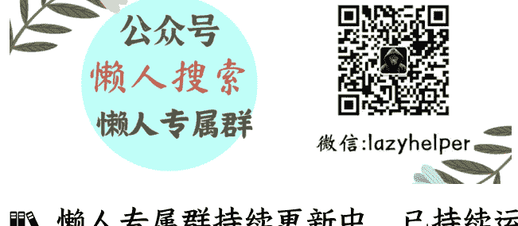

# 雷军的销售力，能变成“叙事基建”吗？

250722 《蔡钰·商业参考 4 》节选

整理：公众号懒人搜索，懒人专属群独享

懒人微信：lazyhelper

普通人买小米SU7，从大定到锁单截止日，其实还有7天的犹豫期，为什么有24万订户着急在18小时内就主动锁单？很大原因是，越早锁单越早排产，越有希望早日提车。

这就说到了小米汽车的一个现实困境：产能跟不上。

## 产能瓶颈

根据公开资料，当前小米汽车的主要产能，依靠位于北京亦庄的一期工厂，年产能为15万辆。旁边的二期工厂7月份刚刚启用，年产能也是15万辆左右。一二两期工厂的产能加起来，小米汽车的年产能也不过30万辆左右。

别忘了，这两座工厂可不止生产这次的SU7，还要生产此前卖掉的SU7和SU7 Ultra呢。行业内有人估算，小米汽车至少欠了40万辆汽车没有交付，也因此给雷军起了个外号，叫“北京欠车王”。

站在用户端看，小米汽车的产能亏欠到什么程度呢？小米SU7在6月26日晚上开售，一天之后，标准版锁单后的最快交付时间就已经超过了50周，顶配的Max也需要33到36周。你如果现在打开小米汽车App再下单锁单，显示的交付周期估计已经超过一年了。

对用户来说，晚提车，别的坏处就不提了，光是错过了2025年底调整的国家新能源车购置税减免政策，可能就要多掏1万多的购置税。

这事儿引发了订户们不小的抱怨。尤其是雷军在发布会上还承诺：此前买了SU7还没有提车的订户，可以把订单转成SU7。结果一群用户兴冲冲转了订单，发现自己又排到了SU7的队尾，等待时长比原来更久。

## 友商截胡

这股情绪反弹，也被不少新能源车企注意到了，同行们迅速行动起来，开始针对性地“截胡”。智己提供5000元电卡，极氪提供5万购车积分，蔚来和萤火虫可以分别减去5000元、2000元车价；智界也推出了5000元车款抵扣活动。

在友商们看来，“小米吃不下的，对别家也算肥肉”。

## 李稻葵的建议

小米汽车热卖与产能告急的矛盾，也传到了财经界。7月初，北京召开了2025全球财经论坛，经济学家李稻葵在演讲中就突然建议说，其它车企不妨考虑把闲置产能转让给小米。

李稻葵说，有些电动汽车企业的产能是不够的，比如小米汽车，3分钟卖20万辆，但产能只有十几万辆，消费者要等30周到50周才能够买一辆，所以小米汽车需要扩张。同时，许多车企拥有大量闲置生产线，每条产能可能达到15万辆，但因为企业不愿主动退出，这些产能无法有效流转。

基于这个冲突，李稻葵建议，政府对自愿退出的汽车企业，可以每条生产线补贴1亿元，此外小米再多掏1个亿，用2亿资金盘活15万辆汽车的产能，来形成新旧产能的有效置换，也有助于宏观经济畅通运行。

这个建议小米愿不愿意接受？我猜大概率是愿意的。花1个亿就能拿到15万辆汽车的产能资源，对应接近400亿的产值，简直划算。

政府愿不愿意接受？我猜，小米所在的北京也是愿意的。小米一年前才开始卖车，现在已经在中国新能源汽车市场拥有了3%的份额，从造车新兵向头部玩家极速狂奔，这对小米所在的北京意义重大。北京此前虽然互联网行业发达，但在制造业领域一直进不了全国工业城市前十名，远远落在深圳、上海和重庆后面。

上海通用五菱旗下品牌宝骏，在社交媒体上喊话说：“抢不到SU7，时尚同款宝骏云海收留心碎的你。”

蔚来副牌乐道的总裁沈斐也发微博说，现在可以放心选择乐道L60了，乐道空间更大、屏幕更大、能耗更低、价格更香。

东风日产的高管黄照昆则更加直接。他公开发声说：SU7三分钟大定20万台，意味着用户交车时间要等待一年以上，任何国家都没有这种愚忠的品牌粉丝，再次验证了“群体会降低智慧”。黄照昆这番话对民众的攻击性太强，快速引发了不满。他随后公开道歉，并删掉了言论。

而小米是当前北京在新能源汽车产业里的最大增量。今年一季度，北京汽车产量强势逆袭，以38.7万辆的成绩，时隔15年反超了上海，这主要得益于理想的顺义工厂和小米的亦庄工厂发挥作用，实现了新能源汽车产量1.4倍的同比增速。

而小米SU7，发布第一天24万台的锁单量，就对应了大概600亿元的营收，对北京和华北工业链都意义重大。如果真如雷军所说，小米能在15到20年内进入全球汽车厂商前五，那毫无疑问会把北京也变成智能产业高地，拉动大笔的税收和就业。

所以在李稻葵提这个建议之前，北京已经给小米汽车提供了一套系统性、高强度、全周期的产业扶持，比如特批造车资质、低价提供工业用地、财政补贴等等，对它的关照和呵护不弱于上海对特斯拉工厂。

当然了，李稻葵这个提议也引发了不小的反对声，认为这是鼓励政府干预市场、鼓励不正当竞争。但如果新能源汽车行业真在2025年进入淘汰冲刺与出清，小米因此接受几条来自汽车同行的心碎生产线，也不是不可能。

## 恶补产能

小米的产能困境，新能源汽车前辈们当年也遇到过。

你肯定记得,2018年,特斯拉因为Model3产能不足而被资本市场看空,几近破产。后来马斯克干脆住在工厂督战,并在2019年转向上海,新建超级工厂,这才彻底解决了产能问题。类似的,问界新M7、新M9上市后也是先爆单,再依托华为渠道和赛力斯工厂两班倒、加大招聘力度来恶补产能。

所以,小米当下的应对策略也是类似。雷军亲自监督小米二期工厂的投产,也在加大招聘力度,用两班倒的方式来把产能拉满,全力保障交付。这之外,小米汽车的北京三期工厂、上海和武汉生产基地也在规划中了。

而具体到眼前,雷军在后来的返场直播里,干脆主动为几家同行引流,来分散小米的产能压力。他告诉米粉们:“如果大家急着用车,我觉得国产新能源车都还不错,比如明天将发布的小鹏G7、月底将发布的理想i8,当然,Model Y也不错。”

他在描绘小米SU7的用户画像时,还特意强调,下单前三的城市是上海、杭州、北京,都是Model Y卖得最好的城市。这句话的言下之意显然是:小米SU7抢的是特斯拉的生意,而不是国内同行的,请同行不要敌视小米。雷军还说:“大家都做车以后,同在一个江湖,江湖里不能只有打打杀杀,也应该有兄弟情义。”

## 叙事基建

说到“兄弟情义”，我们换个角度看小米和雷军。

小米一路走来的成功，可以分拆成两种红利：

一种是市场端多年来对雷军形成了“厚道”人格的信任和善意。

这种信任和善意不光发生在需求端，也发生在同行之间。接受过雷军投资的蔚来、小鹏、理想就不用说了。小米在宣布造车后，从深蓝汽车CEO邓承浩、长城汽车董事长魏建军、北汽集团董事长张建勇，再到中国电动汽车百人会秘书长张永伟，都跟雷军合影表达过支持。

雷军这个IP的流量能力和叙事能力，用投资术语说，是小米自己的“阿尔法”。

另一种是，今天的中国民众对广义上的“中国制造”，都怀有一种普遍的及格线信任。人们在小米商城里买手机、插线板、平衡车、买防晒衣……心态上，买的是中国制造的平均水准。这是整个中国产业链给小米的“贝塔”。

我个人有时也会觉得雷军像我的同行，也是一位做“知识服务”的课代表。小米每进入一个新领域，手机也好、冰箱也好、空调也好、汽车也好，都像是开了个新课题，去替大众研究产品逻辑怎么回事、产业链进化到哪一步了，然后基于研究结果，搓出一台小米品牌的毕设作品，量产交付给大众。

换个角度看小米发布会，等于是让原本对技术和产业不感兴趣的主流人群，出于对雷军的信任甚至爱戴，愿意拿出3个小时的时间，伴随着各种感性叙事，听一堂关于手机、智能眼镜或电动汽车的知识课程。

在这些“雷军主讲的知识课程”里，观众不光能听到小米研究产品和行业的故事，还能了解到纽北是全球汽车工业的终极性能试炼场，了解到奥氏体304不锈钢是食品医疗行业的常用钢材，了解到中国汽车厂商已经普遍采用镀银玻璃来隔热防晒……

从这个角度说，小米是中国制造业的整体进化的受益者。小米，是从产业链里享受到过“兄弟情义”的。

所以，这次雷军提起“兄弟情义”，让我想起一个不靠谱的建议，容我跟你闲扯两句：

在当下，小米集团的自身产能跟流量转化能力并不匹配。那么，雷总在卖自家汽车的同时，有没有可能考虑把自己的IP向整个行业开源？

比如，不定期地跟外界聊聊，近期同行给小米的新启发；或者除了自家汽车，雷军最喜欢的友商设计亮点，把自己变成汽车工业的流量分发平台。如果小米真能把自身的流量与信任资源，抽象建构成为某种有公共性的“叙事基建”。为整个中国汽车产业构建更大的消费通路，激活更大的内需循环，真正把王传福那句“在一起，才是中国汽车”变成现实，那就真是在往伟大企业迈步了。

当然这只是个脑洞。关于小米SU7，我们的讨论就到这里。我是蔡钰，我们下一讲再见。

最后，安利小懒的付费群：懒人专属群

📖 懒人专属群持续更新中，已持续运营 6 年，整理超 3000 份各类精选付费文章 & 年费社群干货，全部开放下载。

本资料为付费群内部分享，仅供真实有需要的朋友查阅 🎓

懒人专属群更新记录：
https://lazy2025.top/#/blog/record2

懒人专属群更新记录（需梯子，备用）：
https://lazybook.fun/#/blog/record2

懒人微信：lazyhelper