# 只用一部手机，我在微信问一问跑通副业闭环，日入 200+实测分享

250722 生财精华

公众号懒人搜索，懒人专属群独享

懒人微信：lazyhelper

# 一、个人介绍与项目成绩

同步块

我是麦几，一名优势转型教练，目前主业央企 HR，副业深耕生涯规划、就业指导、盖洛普优势教练近 8 年。目前是广西区、桂林市人才服务中心特聘就业导师，每年都参与线下招聘会就业指导、讲座、生涯规划大赛评委等 10 余场。累计有 600+一对一客户，B 端高校、企业等 30+。

## 为什么要做“问一问”

微信“问一问”是微信于 2023 年推出的社区问答功能，依托微信搜一搜平台，允许用户提问并获得解答，同时为创作者提供流量入口和变现机会。

做“问一问”这个项目最早可以追溯到 2023 年，那时平台还是用微信号直接回答的，没啥水花就放弃了。直到 2024 年看到这个项目又可以启动了，开通分成计划就能拿到收入。

对于职场人想要尝试去突破自己，开启副业，开店要资金、滴滴外卖这些没有增长……而问一问，就是一部手机、一个账号，随时随地就可以开启你的输出。

如果你想从 0 开始尝试自媒体，在互联网拿到第一笔收入。这是一个非常好的小成本、快速跑通闭环的项目，快的小伙伴 10 天就可以完成分成计划开通，而且可以依托微信这个大平台把小输出作为我们的练手项目，真的再适合不过啦。

## 入局成绩（持续变动中）：

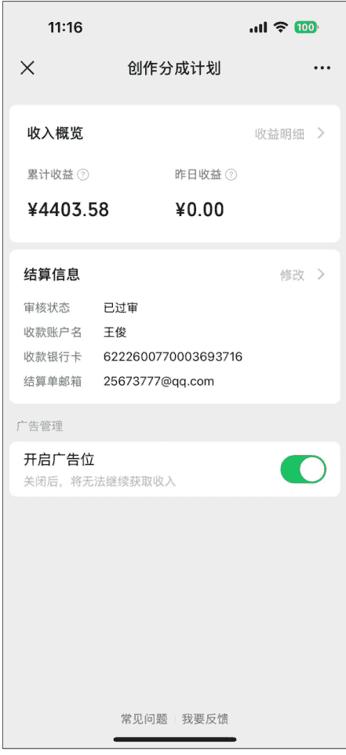

| 项目 | 内容 |
|---|---|
| 创作分成计划 | 收入概览 |
| 累计收益 | ¥693.71 |
| 昨日收益 | ¥0.00 |
| 结算信息 | 修改 |
| 审核状态 | 已过审 |
| 收款账户名 | 王俊 |
| 收款银行卡 | 6222600770003693716 |
| 结算单邮箱 | 25673777@qq.com |
| 广告管理 | 开启广告位（关闭后，将无法继续获取收入） |
| 常见问题 | 我要反馈 |

我的账号是 11 月开通分成计划，因为没有定期更新收益不高，在 1 月 16 日爆了一条内容后开始日更，收入基本稳定。

截止目前 2 个账号开通分成计划，每天投入 20 分钟，回答 2 个账号，每个账号日更 1 条，流量主总收入 5000+，平均一个月约 1000 元。

收入其实和你的内容输出数量也有关，有些伙伴日更 5-10 条，当然他们的收入就会更高，投入越多回报越高。

懒人微信：lazyhelper

### 公众号关注数增加近700，视频号关注数增加200+，总曝光过百万

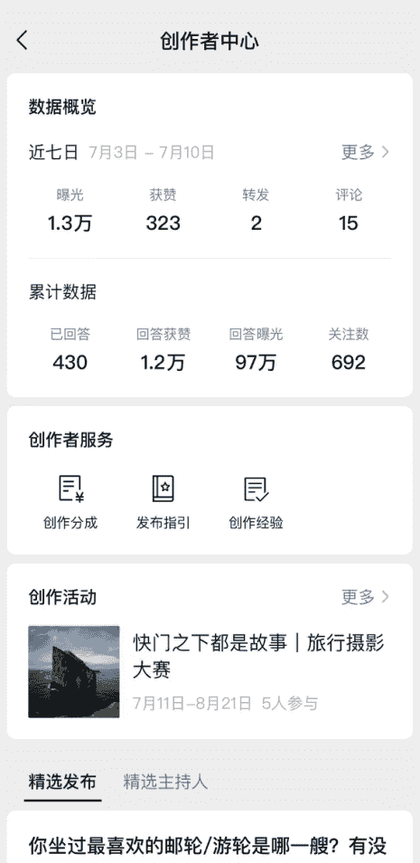

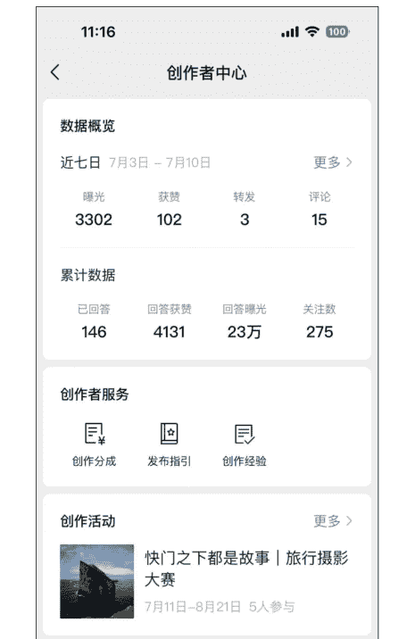

## 队友（完全零输出经验）实测成绩：

用不到1个月的时间跑通闭环（开通分成计划），随后秒开通第二个账号，两账号总收入近7000。

他虽然是新手入局，每天用心回答、不知道的问题还去搜索找资料等等，收入正反馈很快，日曝光量最高达2万+。

单日最高收益可达200+。

相比公众号的大起大落，问一问收益相对稳定，虽然金额不大，每天都有流水，正反馈极快。

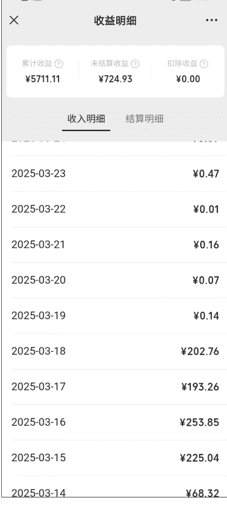

| 队友 | 主号收入（截止7月4日） |
|---|---|
|  |  |

懒人微信：lazyhelper

### 收益明细

| 项目 | 金额 |
|---|---|
| 累计收益 | ￥5711.11 |
| 未结算收益 | ￥724.93 |
| 扣除收益 | ￥0.00 |

| 日期 | 金额 |
|---|---|
| 2025-03-23 | ￥0.47 |
| 2025-03-22 | ￥0.01 |
| 2025-03-21 | ￥0.16 |
| 2025-03-20 | ￥0.07 |
| 2025-03-19 | ￥0.14 |
| 2025-03-18 | ￥202.76 |
| 2025-03-17 | ￥193.26 |
| 2025-03-16 | ￥253.85 |
| 2025-03-15 | ￥225.04 |
| 2025-03-14 | ￥68.32 |

# 二、为什么写这篇帖子

- 帮助想做副业却不知道如何开始的人，提供一个0成本、正反馈快、简单可复制的入门项目
- 通过真实实测案例让大家看到“写点小东西也能赚钱”的确定性，先跑通闭环建立信心
- 作为长期副业前的练手项目，同时培养输出能力
- 可为公众号/视频号持续引流
- 可以通过公众号/视频引流到私域，成交你的产品（最近有一位写作者链接我完成了一次采访）

## 这是一个“低门槛、低成本、反馈快”的副业项目

对想做副业又没方向、想练习输出又想赚钱的人来说非常适合：

- 不需额外花钱
- 碎片时间可做
- 每天都有流水，建立信心
- 为长期副业和 IP 沉淀打基础

如果你正打算找个项目先跑通 0-1 闭环，这个项目非常值得试一试。

## 增加人生厚度、构建一致性家庭目标

带着队友做这个项目，为了积累素材，包括桂林的一些旅游景点、餐厅等本地搜索流量的布局，我们家刻意增加了很多外出体验的机会，原本可以在家里躺平的他，开始不断寻找周边好玩的地方，一起增加了很多人生活验与厚度。

认知提升：把所有的消费都变成生产力，这点一定要划重点，我们家日常的小消费都赚回来啦。

亲子关系优化：孩子看到我们做问一问，自觉让我们先拍照，而且自己也说要做问一问，等她大一些完全可以输出自己的内容，提升自己的写作能力。

提升写作能力：截止目前我回答了 570 题，每题按照 300 字计算，输出有 15 万，够一本书啦。

# 三、项目简介：

## 什么是问一问？

是微信平台基于“搜一搜”搭建的一个问答平台，不同于百度和知乎，这里单个问题回答字数限制在 500 字，也意味着你不需要长篇大论，从平台要求的「优质」「真实」「实用」「个人特色」这几个维度去发布和回答问题。

下图是我在 5 月份的一篇内容，在 6 月份开始曝光达到 2.7 万，点赞 1700+，评论 22：

| 问题标题 | 数据 | 作者/关联 |
|---|---|---|
| 读书有什么意义？为什么要读书？读书改变了你的命运吗？ | 关注 2557 \| 回答 1273 \| 赞 2.2万 | 麦田生涯 / 《小狗钱钱》 |

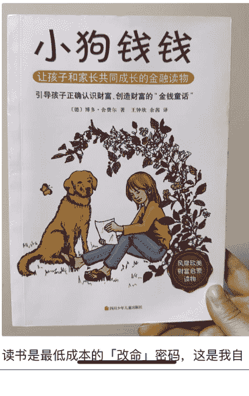

读书是最低成本的「改命」密码，这是我自

## 读书有什么意义？为什么要读书？

读书是最低成本的「改命」密码，这是我自已最深刻地切身体验。

作为80后，我没有像70后那样的好机遇，没有90后衣食无忧地生活环境，只有靠自己闯荡、努力学习和提升自己的执行力。

读大学前读书的目标很简单，就是考大学，可是考上了我又能干什么，不知道，是阅读、学习让我真正认识到了原来世界可以这么大，我不懂的东西还很多。

就是我们常说的知道自己不知道的阶段，很感谢书籍可以让我获取到很多高维的认知，比如之前都没有学习过的金钱、财富。

第一次知道了生涯规划是什么，原来除了职场晋升，我还可以走其他的路径，懂得了我们选择背后都是价值观的体现。

第一次知道线上的学习资源非常多，和高手过招，虽败犹荣，而且可以学习到很多实战地经验。

过招，虽败犹荣，而且可以学习到很多实战地经验。

第一次知道原来可以通过互联网变现，通过自己提供价值、做咨询、做项目都能变现，还不用依赖组织。

最关键的就是看到希望，有信心去面对更加遥远的未来，那份自信是长在了我的认知里、思维模式里。

曝光 2.7万 广西 5月10日
福建 6月6日

读书本质是用最低成本获取最高效的成长——它未必直接带来财富，但能让你成为更清醒、丰富、坚韧的人，在无常的世界里，拥有支撑前行的力量。正如三毛所说： 展开

| 评论/广告类型 | 内容 |
|---|---|
| 评论 (麦田生涯 作者) | 写的真好 |
| 广告 (像素蛋糕AI修图) | 让修图如此“糕”效，像素蛋糕修图师的省力好工具！ |

## 怎么进入“问一问”？

微信主界面 → 点击底部“发现” → 进入“搜一搜” → 选择“前往问一问”。

可以关注“微信问一问”公众号，点击下方的创作活动、问一问都可以进去。

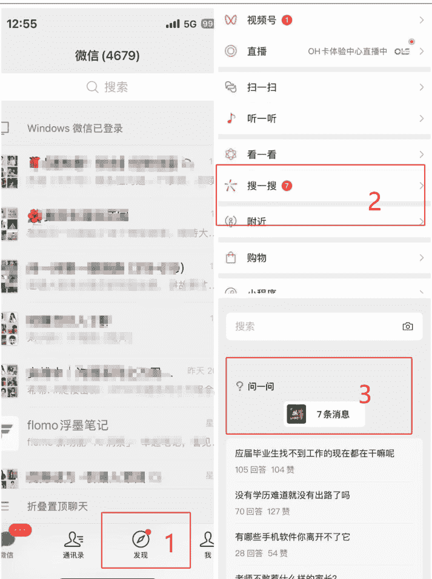

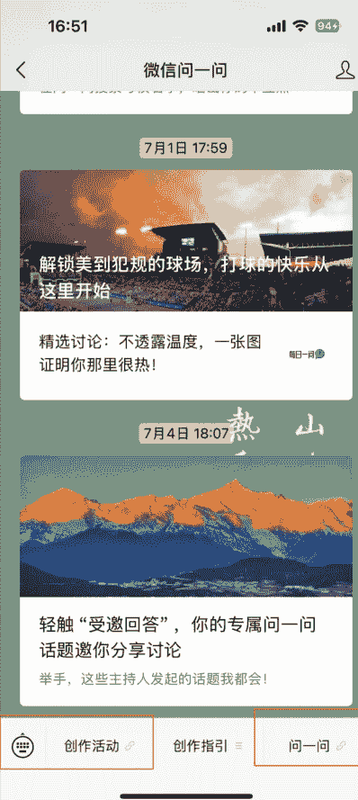

## 开通分成计划的要求和标准

### 问一问创作分成计划是指：为符合条件，持续发表优质内容的优质创作者，提供在优质内容的评论区展示广告，参与平台广告分成的模式。

近 90 天发布 30 条内容 + 有效关注人数大于 100 人（需通过问一问平台关注）

满足质量要求，详见官方指南
https://docs.qq.com/doc/p/acbbb2fbb125ae8d6a8d965db119155c7aef8fae

- ☑ 真实分享，真诚创作：基于真实经历、体验和感受进行创作，如有需要可搭配实拍图等素材充实内容。
- ☑ 贴近生活，讨论兴趣：分享日常生活中的细微观察，或是围绕兴趣进行同好交流，持续分享引发共鸣的见解。
- ☑ 专业翔实，深入浅出：结合案例和细节分享自己的经验和感受，用生活化和简明自然的语言创作表达。
- ☑ 简明扼要，清晰易懂：表述方式简洁明了，能抓住要点，同样的信息量越精炼越受欢迎，切忌啰嗦、空洞的长篇大论。

达到以上要求后可申请开通创作分成计划。

注：90 天是指你在这个期间至少完成这个数量，如果你 10 天完成了以上数据，也是可以直接申请的哦。

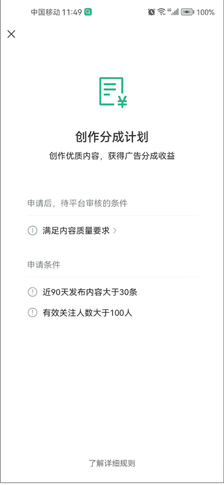

| 项目 | 内容 |
|---|---|
| 创作分成计划 | 创作优质内容，获得广告分成收益 |
| 申请条件 | 1. 满足内容质量要求 > 2. 近90天发布内容大于30条 3. 有效关注人数大于100人 |
| 审核状态 | 申请后，待平台审核 |

## 获得收益

当你通过分成计划审核，录入你的个人信息、账号等，就等着通过审核拿到收入啦。

问一问的结算是半月一次，会有邮件发送到你的邮箱，这些收入也会综合纳入到你的个税。

最终收到的收入会涉及到扣税，这点我们就不用额外自己交税了，很方便。

# 四、项目具体玩法拆解（重点）

## 准备阶段：账号准备

注册微信公众号或视频号，这个大家可以搜一搜就知道啦。

评估定位你的输出内容与方向，平台有各种分类，你可以选择你感兴趣、有内容输出的方向才更加容易起号。

初始账号未开通分成之前建议走相对专业路线，聚焦一个方向更加容易被官方运营看到，不错的创作者有单独的领域群管理，也会和大家讨论、分享话题等，这块服务还是不错的，但是和流量、收入不是一个部门。

从挣钱的视角，目前看到流量比较高的是生活类的和相对稀缺的、独特的（这个需要自己去挖掘哈，不能透露），也在变化中，之前有段时间育儿、旅游的也不错。

可以从问题广场点击进去，上方滑动就可以看到很多领域，可以点击进去查看你想要输出的方向和领域。

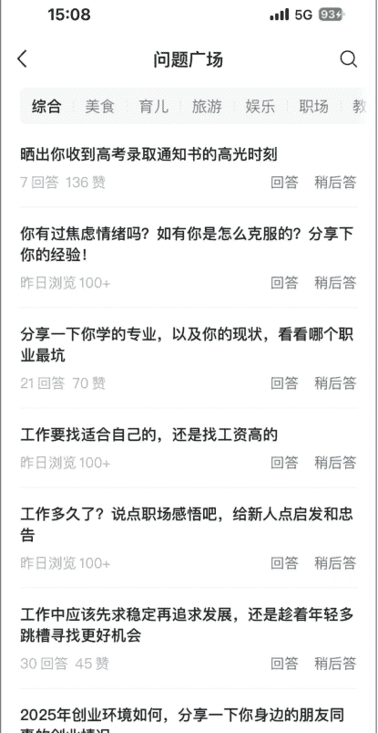

## 问题广场

| 问题标题 | 数据 |
|---|---|
| 晒出你收到高考录取通知书的高光时刻 | 7回答 136赞 |
| 你有过焦虑情绪吗？如有你是怎么克服的？分享下你的经验! | 昨日浏览 100+ |
| 分享一下你学的专业，以及你的现状，看看哪个职业最坑 | 21回答 70赞 |
| 工作要找适合自己的，还是找工资高的 | 昨日浏览 100+ |
| 工作多久了？说点职场感悟吧，给新人点启发和忠告 | 昨日浏览 100+ |
| 工作中应该先求稳定再追求发展，还是趁着年轻多跳槽寻找更好机会 | 30回答 45赞 |
| 2025年创业环境如何，分享一下你身边的朋友同事的创业情况 | 25回答 13赞 |

专注在真人、实感、实用、有价值这些方向中，也不要被定位限制，比如你的身份、职业、兴趣爱好等等都是全方位的你。

快速达到开通条件:定位+输出（最好日更）
- 发布 30 条内容（建议 10-30 天内集中完成）
- 新增 100+关注（通过回答高热度问题与原创发布动态积累），必须要通过问一问入口关注，可以适当让你的家人、朋友帮你关注，当然最好是通过内容吸引自然流，一个爆款内容可能会几天就达成这个任务。

满足条件后提交申请开通分成计划，若首次不通过，需要10天后再次申请，再次审核不通过就要等30天，期间需要持续发布优质内容。

## 日常运营步骤

初期需要投入时间比较多，每天投入30分钟到1小时，具体步骤如下：

- 每日可以发布1-2个你擅长的内容，可以展示你的个人特色
- 定期收集高热度问题（关注多、回答少的问题）放在你的草稿箱中，没有思路时可以去回答

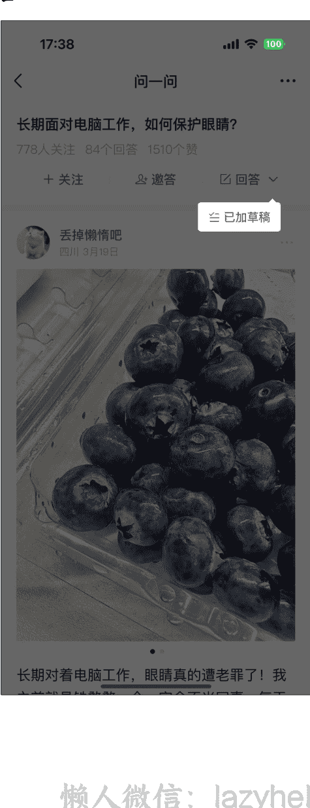

### 日常收集、拍摄各类真实图片，切勿使用网图、AI 图，问一问审核非常严格（来自官方指导）

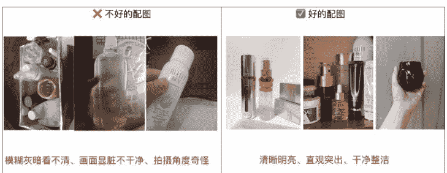

### 利用 语音输入+笔记整理（get 笔记） 加快内容生成效率

我比较喜欢用 get 笔记，随时随地把自己想要讲的内容语音输入，软件会去掉我们的语气词等整理为文字，这个内容就可以稍微调整后就可以直接复制输出到问一问啦。

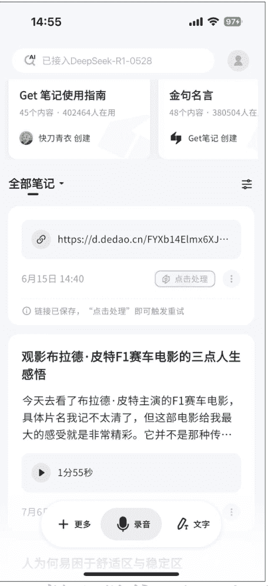

## 如何通过提高内容质量，拿到更多曝光？

找对标，寻找自己领域优质的账号，学习别人的方法和回答内容。

参与官方的活动，官方会有运营组定期发布一些内容，你可以积极参与回答，抢占好的位置，也会得到曝光，进入问一问之后右上角有个头像，点击进来，在你的账号下方就有很多“创作活动”，可以发布也可以回答。

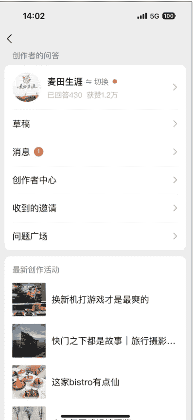

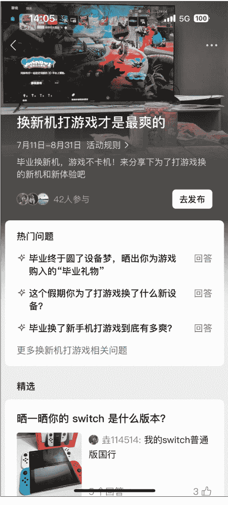

### 换新机打游戏才是最爽的

| 活动名称 | 规则/内容 | 参与人数 | 操作 |
|---|---|---|---|
| 换新机打游戏才是最爽的 | 7月11日-8月31日 活动规则 > 毕业换新机，游戏不卡机！来分享下为了打游戏换的新机和新体验吧 | 42人参与 | 去发布 |

### 热门问题

- 毕业终于圆了设备梦，晒出你为游戏购入的“毕业礼物” 回答
- 这个假期你为了打游戏换了什么新设备？ 回答
- 毕业换了新手机打游戏到底有多爽？ 回答
更多换新机打游戏相关问题

### 精选

#### 晒一晒你的 switch 是什么版本？

我的switch普通版国行

好标题：有亮点、简单明了，有情绪指引共鸣，
好标题：满园“金”色关不住，春日限定大赏-黄花风铃木；
坏标题：扎心了！千万别再 XX
好标题：成都周边古路村徒步一日游玩攻略-四川版悬崖绝壁虎跳峡；
坏标题：xxxx，90%的人都 XX

好图：优质图片，不需要像小红书一样很夸张，而是稍微修饰的美图即可，真实而不过分夸张是平台的需求。

懒人微信：lazyhelper

以下都是平台推荐的精选回答、精选发布，大家都可以去点击进去查看，图片不夸张、真实、吸引人就是好图。

| 活动/问题 | 数据 | 操作 |
|---|---|---|
| 用植物标本捕捉自然 | 6人参与 | 去发布 |

### 精选回答

#### 分享植物课上学到的植物标本制作方法!

| 作者 | 内容摘要 | 数据 |
|---|---|---|
| 有钱有闲鸭 | 翻看我的老相册，看到这几张照片，一下子就想起大一时的植物学课!... | 4赞 2个回答 |

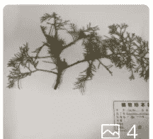

#### 亲子作业丨植物标本之小叶黄杨具体做法流程

| 作者 | 内容摘要 | 数据 |
|---|---|---|
| 风悦530 | 每个季节学校都有对应的活动，是亲子一起完成的，收集各种各样的关于... | 3赞 1个回答 4 |

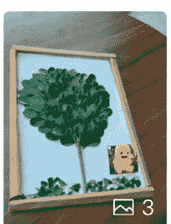

#### 把夏天的美丽做成标本，大小朋友都爱的手工

| 作者 | 内容摘要 | 数据 |
|---|---|---|
| 三个没正形的... | 美术课老师分享了一款水晶胶，可以用来封存植物标本。买回来，... | 3赞 |

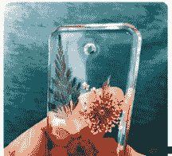

懒人微信: lazyhelper
21/28

## 创作者中心：精选发布 / 精选主持人

### 你坐过最喜欢的邮轮/游轮是哪一艘？有没有照片分享下？

| 作者 | 内容摘要 | 数据 |
|---|---|---|
| 平老虎 | 我们的第一次邮轮旅行就是跟随船客旅行团，2025年1月底到2月中旬的A... | 78个回答 63👍 |

### HiFi圈玩「头戴大耳」的都烧过哪些硬核机？

| 作者 | 内容摘要 | 数据 |
|---|---|---|
| HIFI168E版 | 分享一下我最近很喜欢的大耳。拜雅在去年百年庆期间，推出了监听旗... | 26个回答 55👍 |

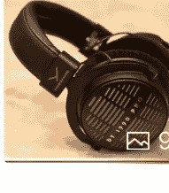

### 评价一下cos

| 作者 | 内容摘要 | 数据 |
|---|---|---|
| 糖不恬啊 | 比较满意的一次cos（就是美瞳滑片看起来不太聪明😭），以后会多注意... | 217个回答 261👍 |

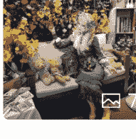

### 《鱿鱼游戏3》是否烂尾？谈谈我的观后感

| 作者 | 内容摘要 | 数据 |
|---|---|---|
| 阿Shao | 少量剧透。看完 |  |

好内容：按照平台要求去输出自己的价值，可以帮助到别人，也可以转发吸引更多人关注、点赞、评论等

- 1、提供实用价值，有实际意义
- 2、分段展示，给与好的观感
- 3、分类整理，信息齐全

### 分享植物学课上学到的植物标本制作方法

活动：用植物标本捕捉自然

翻看我的老相册，看到这几张照片，一下子就想起大一时期的植物学课！这门课很有意思，老师带着我们认识植物的各种结构，教我们植物分类，还经常带我们去户外认植物、做标本。

我最爱的就是做标本，做植物标本其实很简单：

- 1. 采集标本：去户外采集你想做的植物部分，尽量采全点，根、茎、叶、花、果、种子，越齐全越好，方便做好成品去观察它！
- 2. 初步整理形态：把采回来的植物整理一下，尽量把叶子、花朵都平铺展开，尽量别让它们重叠在一起。要是太密了，可以稍微修剪掉一些。
- 3. 压干植物水分：把整好形的植物夹在旧报纸里，然后用重东西压上一段时间。这一步是为了把植物里的水分压干、让它定型。
- 4. 固定标本：等标本完全干透了、定好型了，就可以将植物固定在硬卡纸上了。用白线把标本缝在硬卡纸上，固定在几个关键部位就好，要是叶子特别多或者很细碎，也可以糊一点胶水上去，但是要注意胶水别涂太多，因为胶水里的水分可能会让植物变色。

## 公众号懒人搜索，懒人专属群分享

## 分享植物学课上学到的植物标本制作...
活动: 用植物标本捕捉自然 >

工具越齐全越好，方便做好成品去观察它！

- 2. 初步整理形态：把采回来的植物整理一下，尽量把叶子、花朵都平铺展开，尽量别让它们重叠在一起。要是太密了，可以稍微修剪掉一些。
- 3. 压干植物水分：把整好形的植物夹在旧报纸里，然后用重东西压上一段时间。这一步是为了把植物里的水分压干、让它定型。
- 4. 固定标本：等标本完全干透了、定好型了，就可以将植物固定在硬卡纸上了。用白线把标本缝在硬卡纸上，固定在几个关键部位就好，要是叶子特别多或者很细碎，也可以糊一点胶水上去，但是要注意胶水别涂太多，因为胶水里的水分可能会让植物变色。
- 5. 贴标签：固定好后，在卡纸上贴个小标签。写上植物学名、拉丁名、采集人、采集地等。

这样一个植物标本就做好啦！大家有兴趣的话，可以上手试一试！

江西 6月9日
写评论 8 2 推荐 2

好评论：收入与你的评论区广告有关，需要有优质、有价值的评论
不是水内容、无关的即可，决定着你的评论区广告的展现

## 内容产出注意事项
⚠️ 踩过的坑：
懒人微信：lazyhelper

- 避免大量刷流量回答水内容，易限流
队友被无预警断流过两次，恰好是赚到200+的时候流量断掉，每天只有几分钱，10天后恢复，需要持续发布优质内容后回归，但是流量相比之前已经少了很多。

- 封号多因蹭热搜写水内容，建议以实用经验分享为主
过往那些很简单的攻略贴就不要再跟风了，很容易被限流

- 红线：不要用纯AI生成内容和图片，这是平台严禁打击的，当然出现问题时可以去申诉，我的内容被误判后申诉就通过啦。

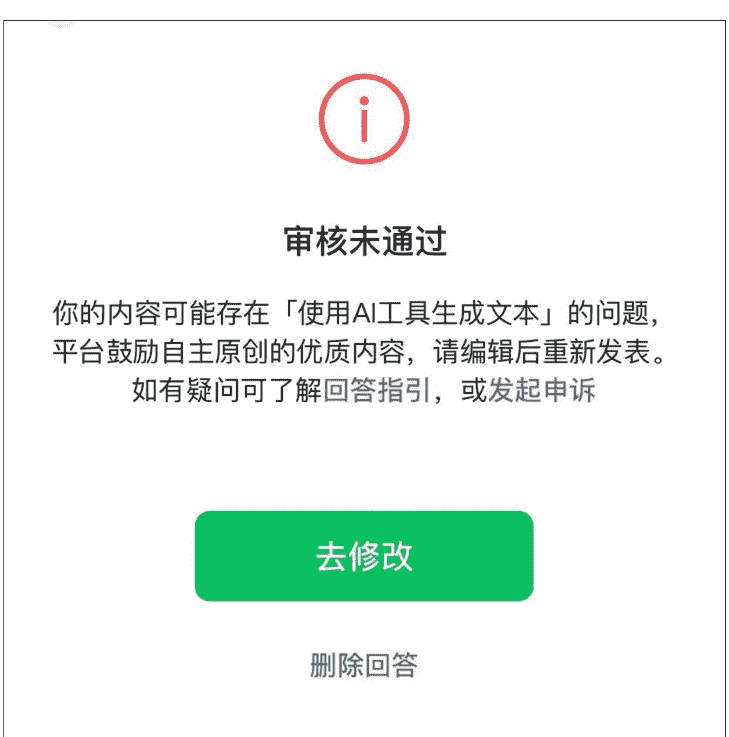

总结：
- 内容务必原创或深度改写，严禁纯AI生成，避免封号、断流风险。
- 避免过多蹭热点或无价值的水内容，以实用干货为主，持续提升内容质量。
- 每天固定频次持续发布，逐步稳定关注度和收益。

# 五、总结

## 为什么建议新手做这个项目？
我把问一问称之为“公域朋友圈”，如果你的朋友圈不太方便发，那不如把内容分享到这里，可以展示真实的自己，包括你的人生体验、经验、吃喝玩乐、美妆、汽车等等，只要你有内容、只要你想分享，都可以展示你自己。

如果你想开始副业，却不知道做什么、担心投入太高或太复杂，这个项目能帮你先拿到第一桶副业正反馈。

同时锻炼持续输出能力，后续可配合公众号/视频号引流，不管是做公众号爆文、IP、视频号等等，都是一个渠道补充，另外也可以反向增加流量。

无需额外成本，仅需手机+零碎时间，就能跑通闭环拿收益。

不需要带着做号的心情去输出，否则一开始很容易陷入流量、收入的驱使，做真实的自己最容易。

## 对正在 0-1 创业的新人一些过来人的建议和鼓励
作为优势教练，我更希望大家可以找到自己的优势，用自己擅长、喜欢的方式做自己热爱的事情，同时又能赚到钱。

坚持记录，本身就是一个很大的价值和意义，当你过年后回头看你的输出，一定可以给你留下美好的回忆。

写在最后，生财真的是非常棒的平台，这次的内容输出非常感谢生财官方运营@黄阿兜口的指导，她拿出专门时间来指导我该怎么写，还帮我列了框架和大纲，真的超级赞。

对比生财平台拿到很多大结果的伙伴，这个项目真的很小，但是也恰恰是很快、很容易拿到结果，对于职场人、小白等等，想要通过写作赚到钱、构建自己的IP，问一问真的欢迎每一位愿意真诚分享的伙伴，也祝愿每一位伙伴都能收获成长、拿到结果，一起生财有术。

最后，安利小懒的付费群：

懒人专属群持续更新中，已持续运营6年，整理超3000份各类精选付费文章&年费社群干货，全部开放下载。

本资料为付费群内部分享，仅供真实有需要的朋友查阅 [表情]

懒人专属群更新记录：
https://lazy2025.top/#/blog/record2

懒人专属群更新记录（需梯子，备用）：
https://lazybook.fun/#/blog/record2