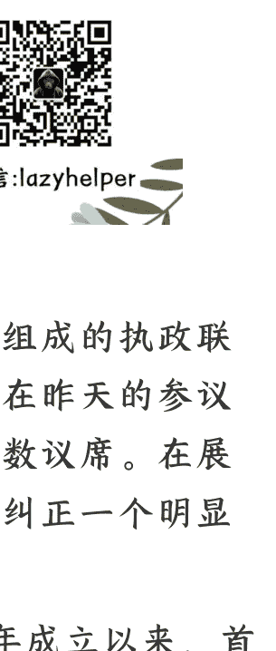

# 输掉参议院之后，石破茂会下台吗？

250723 文/卢克文工作室嘉宾 低调老弟
整理：公众号懒人搜索，懒人专属群独享
懒人微信：lazyhelper



由日本自民党和公明党组成的执政联盟——简称自公联盟，在昨天的参议院选举中，没有拿到半数议席。在展开分析之前，首先需要纠正一个明显错误的说法——

> "这是自民党自 1955 年成立以来，首次在国会众参两院都未能取得过半数席位。"

这个说法，来自与自民党有深仇大恨的《朝日新闻》，之后经《参考消息》《澎湃新闻》《长安街知事》转述，流传比较广。

如果按照这个说法，石破茂简直是自民党建党 70 年来天字第一号的大罪人，那还分析什么？光速下台就完了。

事实上，石破茂领导下的众参两院选举，都是自民党历史上的倒数第三。众议院成绩好于 1993 年和 2009 年。参议院成绩好于 1989 年和 2007 年。

尤其是 2009-2012 年，自民党不仅没过半数，连第一大党的地位都丢了。

所以石破茂不仅不是自民党最差总裁，头号罪人，还有资格在对手骂他厚颜无耻赖着不走的时候引用自民党党史进行反击。

非但如此，石破茂还准备了三板斧加一个大招，来应对自民党内反对派的逼宫。

## 二、石破茂的三板斧+一大招

石破茂的最新表态，原话如下：“必须清醒认识到对国家肩负的责任，以及作为国会第一大党的使命，我将继续履行职责。”这句话有三层意思，以至于我严重怀疑他为了这句话准备了很久。

不了解自民党历史的媒体只会解读出第一层意思——石破茂不肯辞职，还打算继续干下去。

这段话的第二层含义，明摆着就是戳安倍晋三和麻生太郎的脊梁骨——我是输了选举，可自民党在我手上仍然是两院第一大党。不像某些人，哼。

2007 年，安倍晋三领导下的自民党第一次失去了参议院第一的宝座。安倍晋三也确实是在这一年辞职的。但是，这中间还有个关键的插曲。安倍是因为溃疡性结肠炎第一次辞去相位。安倍的这个污点等于为参议院败选之后，总裁不对此负责开了先例。旧安倍派的国会大佬们，快闭上你们的臭嘴吧。

2009 年，麻生太郎领导下的自民党，第一次失去了众议院第一的宝座，被迫下野。作为自民党史上的头号罪人，麻生太郎有什么脸面逼石破茂这个倒数第三？

至于石破茂那段话的第三层意思，暂且按下，后面开大。

戳对手脊梁骨的第一招用完了。石破茂还有第二招——补考。

所谓补考，指的是选举之后，从无党派或者在野党议员里挖墙脚，凑够半数。事实上现在执政联盟距离参议院半数只差两个席位，一旦补考及格凑够半数，就可以援引 1979 年大平正芳的先例，勉强过半数也是过啊。

那一次，支持大平正芳首相继续干下去的主流派和逼宫的反主流派对抗了四十天，史称“四十日抗争”。最终大平正芳在石破茂政治导师田中角荣的鼎力支持下获胜。

如果补考还不行，石破茂还有第三招——用同归于尽来威胁。也就是动用日本首相的终极权力，解散众议院。现在解散众议院，石破茂等于是政治自杀，但自杀的同时也能把他的党内对手们一块送走，由在野党瓜分自民党空出来的席位。而且万一在新一轮竞选中，石破茂像1980年的大平正芳一样死在任上，自民党内亲石破茂的势力还能收获一波同情票。（1980年大平正芳死后，他的盟友们足足过了五年爽翻天的好日子。）

三板斧已经不少了，但石破茂最精妙的其实是最后的大招：借美国的势。很多读者们可能以为，石破茂这样一位在中美之间相对务实，在日美关税谈判问题上表现强硬的首相，是美国的眼中钉。然而在执政联盟参议院败选之后，美国媒体比如《华盛顿邮报》《华尔街日报》都对日本政局不稳表示担忧。他们首先担心，少数派政府即使在关税问题上对美让步，也可能过不了国会那一关。其次，这次选举，日本极右翼政党势头很猛。而日本的极右翼是既反华又反美，张嘴闭嘴都是二战前的昭和日本那一套。韩国再乱，忙活半年总会有新总统去和美国谈判。日本要是乱起来，那可是十年九相的节奏。到时候连个谈判的抓手都没有。

所以石破茂现在对内强调“必须清醒认识到对国家肩负的责任”——本周三欧盟理事会主席和欧盟委员会主席就要来日本，一块商量对美关税谈判的策略。8月1号就是日美关税谈判的截止日期。这个时候要临阵换帅，谁都得掂量掂量。

这便是石破茂那段话的第三层意思——俺现在重任在肩。

不过，大招的难度也是最大的。如果日美关税谈判的结果不错，固然是加分项。可要是谈不好，或者继续拖，那不仅被大招反噬，前面的三板斧也白搭了。石破茂现在的支持率只剩下20%，一旦到了个位数，那么啥也别说了，再怎么挣扎都得完犊子。

## 三、两位种子选手

尽管石破茂有三板斧一大招，可在今年接替石破茂的诱惑，那是不一般的大。原因在于时间上的巧合。

参议院三年一改选，去年选出的这一届众议院，如果不提前解散也能挺上三年。自民党总裁一届的任期还是三年。

谁接替石破茂成为自民党总裁、日本首相，谁就大有机会在过了日美关税谈判这一关后，相对舒服地坐上三年，进入战后日本首相任期排名前八。

对于觊觎首相宝座的人而言，最理想的结果当然是石破茂支持率跌至个位数，然后走流程重新选一个自民党总裁，一切都那么丝滑。

作为日本六大家族（鸠山、麻生、安倍、福田、小泉、河野）最炙手可热的青壮年政治家，日本最强的 80 后，小泉进次郎面对的从来都不是能不能当首相的问题，而是什么时候上更容易干得长。现在给石破茂接班儿刚好就是这么个机会。

不过小泉进次郎是石破茂政府的现任阁僚。在石破茂还要挣扎的情况下宣布要竞选总裁会犯大忌。当年石破茂作为内阁大臣时就是这么把时任首相麻生太郎给得罪到底的。所以小泉进次郎要上位应该还是以石破茂放弃挣扎为前提。退一步来说，即使小泉进次郎取代了石破茂，执政联盟和执政风格的差别也不大。所以他不是本文讨论的重点。

作为去年总裁选举战的第二名，高市早苗目前取代石破茂的呼声最高。可她与自民党竞选伙伴，比较温和的公明党关系非常差。如果高市早苗上台，很可能导致公明党退出执政联盟。到时候作为自民党极右翼代表的高市早苗，就只能和右翼政党组成纯右联盟。

### 三、石破茂 VS 高市早苗

石破茂确实是输了选举，自民党也确实流失了极右翼的选票。可自民党这次其实只比改选前少 13 个席位，拿下了 39 个。说明自民党支持者的主流并不是极右翼。如果去年当选的自民党总裁是高市早苗，极右翼倒是稳住了，中间选票又怎么办呢？

号称高歌猛进的两个极右翼政党，参政党从两个席位增加到15个，保守党从0增加到2。这两个极右翼政党加在一起，都比不上德国的选择党、法国的国民联盟、意大利的兄弟党、五星运动，更不要说和美国的MAGA相提并论了——日本的建制派在西方国家里真是数一数二的啊。

限于篇幅和主题，这次不展开讲述半吊子极右翼的国民民主党，先把那两个极右翼政党——参政党、保守党说清楚。

参政党打着不接受财团捐献的旗号，向社员收取高额党费。普通社员每月1000日元，高级社员每月4000日元——这相当于自民党党员一年的党费。只有高级社员才有党内初选的选举权和被选举权。争取参选的人还得自费参加学费很贵的培训，参加了培训也不一定能拿到提名。选上町村议员的话要上交议员薪资的5%，市级以上议员上交10%。而且财务还不透明，请问这是政党还是传销组织？不难想象这帮人有了点权力以后会怎么干。别看今天闹得欢，小心将来拉清单。

保守党在参众两院加起来一共五个席位，还在两个党魁的领导下分成了两派。按说都斗成这样了，至少有一派应该投了参政党了吧。可人家这两派内斗归内斗，对参政党那是一万个看不上。这对“卧龙凤雏”，最显而易见的分歧是性别问题。参政党主要票仓是家庭主妇。保守党则是大男子主义……

假设高市早苗取代了石破茂，踢开温和的公明党，和半吊子极右翼的国民民主党或者极右翼的政党组队，短时间内大概率会在历史问题和台海问题上疯狂挑衅中国，但他们也会暴露出没上台的时候疯狂许愿，上台之后傻眼的问题。

如果石破茂或者小泉进次郎继续和温和的公明党组队，极右翼虽然也成不了气候，但很可能会一边站着说话不腰疼，一边蚕食建制派的票仓。到时候自公联盟变成自宫联盟，既要当家又办不成事儿。

破解自宫颓势的可能性当然也是有的，不过这就主要得看国际大环境给不给机会了。比如7月23日的日欧峰会。比如特朗普陷入的“爱泼斯坦门”，比如今年的中日韩峰会。

日本参议院选举的影响力，正常来说是远远不如众议院的。这回可倒好，不仅首相的位置成了薛定谔的猫，还引发了中美韩的集体担忧。

美国政界长期以来表达的态度，是希望日本和英美一样搞两党制。而不是大党不大，小党不小的碎片化。

既然都已经引发集体担忧了，那么距离各自发力帮自公联盟支棱起来，还会远吗？

最后，安利小懒的付费群：

懒人专属群


懒人专属群持续更新中，已持续运营 6 年，整理超 3000 份各类精选付费文章 & 年费社群干货，全部开放下载。

本资料为付费群内部分享，仅供真实有需要的朋友查阅

懒人专属群更新记录：

```
https://lazy2025.top/#/blog/record2
```

懒人专属群更新记录（需梯子，备用）：

```
https://lazybook.fun/#/blog/record2
```