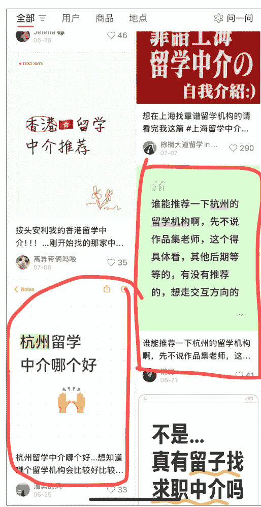
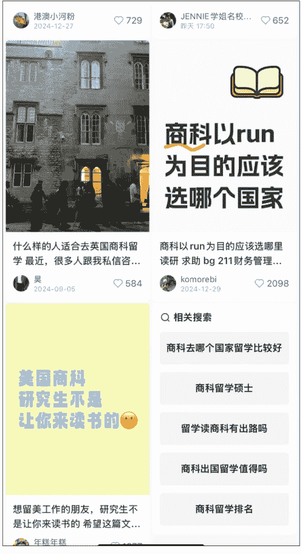

# 高转化的私域，来自高信任的公域

250723 生财精华

公众号懒人搜索，懒人专属群独享

懒人微信：lazyhelper

大家好，我是鱼饼

8 年市场，5 年培训经验，喜欢琢磨底层逻辑和思维模型

最近一年在沉淀一些业务模型，并且做聚焦和断舍离，有段时间没看生财内容了，感谢生财团队邀请，来聊聊私域这回事。

我不会单独切公域和私域的区别，因为你看一些公域直播电商也有高转化，背后底层还是用户的决策逻辑和信任链条的建立。

私域的重要性和区别点是我们和用户的曝光和触达频次更高（微信打开率更高），以及用户流失率低（相比互联网公域漫天的同行，私域的同行肯定更有限）。

我个人理解，私域销售转化的本质是「帮用户看清自己脸上沾有皱纹」+「构建选取去皱产品的决策逻辑」+「用户信任你的品牌性价比极高又对症下药」。

# 我把用户决策链路分成 2 大阶段，6 小阶段。

需求觉醒阶段的用户，我定义为「泛流量」。

竞品比对阶段的用户，我定义为「精准流量」。

很明显，用户在比对竞品时，显然比刚产生我“可能有这个问题”时，付费意愿要高。

所以我的分享，核心就围绕两大阶段来说明：

需求觉醒阶段的用户，在思考问题时，大概率都会走过这几个阶段：
- 用户能否意识到自己有问题？
- 用户以为自己没问题
- 能否清晰描述问题本质？
- 用户认为的问题不是真问题
- 是否量化过问题代价？
- 用户觉得问题不严重
- 是否低估解决难度？
- 用户认为问题好解决
- 决策链条是否明确？
- 用户没有清晰的执行路径
- 是否有惯性思维 or 处理方式？
- 用户被低效模式绑架

而竞品比较阶段的用户，在思考问题时，只在乎「投入产出比」。

他们的关键问题是：
- 我计算投入产出比的模型是否清晰？
- 商家视角：我们的优势是什么？
- 行业里的信息是否透明？我是否了解？
- 商家视角：用户是做充分了解决策的，还是黑箱状态下决策的？
- 我关注的差异维度是否是关键？
- 商家视角：用户需求和我们的产品特色点是否匹配？
- 我接触的这个商家的说法介绍，值得相信吗？
- 商家视角：怎么给用户建立充分信任？

不难发现，123 基本是客观的，而用户决策阶段的关键难点在「信任」。

我们举几个例子，帮助大家对我的模型拆解有个感知：

如何理解第一部分「用户需求确认的链路」？
思考以下场景中，什么时候你更容易做买单动作？
- 你刚发现手机后置摄像头坏了 vs 你发现手机没法开机了
- 你很清楚买新电脑基于自己需求的配置 vs 你有考虑买新电脑但完全不了解电脑各种配置要求

再放第二部分的結構拆解（用户视角）：
- 你的动机是否合理？
- 你是否具备能力解决我的问题？
- 你是否真的有解决我这样情况的过往成果或者背书检验？
- 我选择你的投入产出比是否划算？如果没解决，或者解决效果不好的风险我能否承担？

如何理解第二部分「信任的多维度」？
思考以下场景中，什么时候你更容易做买单动作？
- 同需求和预算的朋友 vs 房产中介 vs 房东/销售三类人给你推荐某楼盘值得买
- 买保健品时，三甲医院的医生推荐 vs 某次就餐认识的某个大妈推荐
- 买东西时，可以先预付定金，分期交付 vs 全款预支出，交付完很久

好，我们逐个阶段来看：

## 需求觉醒阶段的六环节

我们先拆解，再基于拆解看案例应用。

### 1、用户能否意识到自己有问题？

用户以为自己没问题

类似疫情期间不愿意核酸检测的人，认为自己本身多喝水多运动，偶尔的咳嗽发热应该就是日常的感冒，不会需要特意检测和准备特效药。

以留学行业为例，典型情况是：大二学生小A觉得大学生活按部就班，上课、考试、参加社团，没觉得有什么“问题”。他没有主动思考过毕业后的竞争力或未来发展路径的差异，认为顺其自然就好。结果大三暑假火急火燎说想留学，履历和成绩都不够，只能无奈 Gap。

针对这类用户，Ta 前期消费意愿（要早点找留学机构）的教育成本是很高的，但是在萌生和确认需求那一下，极其容易“病急乱投医”。

因为这类用户没有规划意识，是行业里面好签，但又容易退费的一类用户。

成交难点在于「让对方意识到自己有问题」。

对应到我们案例要解决的障碍在于：
- 性格、志向、规划能力（难解决）
- 对就业市场严峻性的缺乏认知

针对这类情况，你要做的是：别教育，只揭露真相。
- 展示目标真相：xx 行业 xx 公司（同学 dream job）的简历池里面，80%+都有海外经历
- 对比刺激：海归留学生 vs 国内 985/211 高校在 xx 行业 xx 公司的起薪及后续薪水对比

### 2、能否清晰描述问题本质?

用户认为的问题不是真问题

我们自己看病肯定也经历过，你说你肚子疼拉稀，描述自己前天吃了啥吃了啥，认为自己是细菌性感染。实际上医生会让你检测，最后检测结果揭示的可能是“你只是着凉了”。

举例，某普通一本高校学生小B，看了网上很多人说出国前还没考出雅思很焦虑，所以全身心在准备雅思，结果忽略了实习等履历，最后因为履历很薄弱没法拿到很好的 offer。

这类用户的处理关键是「确认目标」+「专业评估」，每一步都很重要。

- 确认目标：用户说电脑卡，实际他只是打3A大游戏卡，但真的要换电脑吗？用户可能会发现“我可以不打3A游戏”
- 专业评估：用户真的要打3A游戏，电脑卡的原因也有很多，也许换个外接显卡就轻松解决了，也许清理下电脑内存和硬盘空间就解决了。

用户要么表达宽泛，要么表达错误，而我们要通过全貌评估来精准定位问题。

### 3、是否量化过问题代价?

用户觉得问题不严重

还是拿医院为例，很典型有人觉得熬熬能熬过去，没必要花这个冤枉钱找人、咨询、诊断、买药。

换言之，这个事情的价值在他眼里不高，所以这种类型的用户，关键是提升这件事的价值评估。

举例，缺乏规划和价值评估的大学生非常典型：
- 我大二学雅思太早了吧？
- 我才大一，不是可以玩一年浪一年再说吗？为什么要早规划？

这类用户的处理关键是「算账」，且最好的算账方式是给用户算「如果不做会产生损失」。

——本可属于我的东西我没拿到是很难受的。

### 4、是否低估解决难度？

用户认为问题好解决

常见于超自信或者有规划的人群，这类人不适合“人教人”，更适合“事教人一遍就会”。

这类客户往往出现在有经验（但经验不可迁移）的人群中，比如：
- 认为自己六级 600 分，雅思一定 xx 分没问题
- 认为自己本身是中外合办学校，所以雅思花一学期准备就一定没问题

除了等他们碰壁再找上来之后，还有两种办法：
- 通过模拟/小成本试验的方式，让用户快速体会到难度
- 构造案例，该案例和对方情况高度类似，让用户狠狠共情“我也是这样！”，最终还是找到我寻求解决方案

### 5、决策链条是否明确？

用户没有清晰的执行路径

我已经清楚了我有需求，且问题是什么，我知道不应该自己解决，更应该找人解决，那我找什么人？按照什么标准找人？

举例，留学生找留学中介，系统拆解有好几个问题：
- 到底从什么渠道找，比较靠谱？
- 中介有擅长申请国家的不同吗？
- 中介有擅长申请专业的不同吗？
- 中介有服务条款和退费要求的不同吗？
- 中介从业年限对服务有什么影响？
- 中介原先有无留学经历对服务有什么影响？
- 中介原先有无在职工作经验，对专业选择和择校有什么影响？
......

### 6、是否有惯性思维 or 处理方式

用户被低效模式绑架

比如有问题，用户习惯先问 AI，先在小红书上搜，先问某个 KOL，先下意识有个 xx 判断，这些习惯性动作，可能会成为“成交的阻力”。

举例，
- 我判断某个中介服务好不好，我不是有自己的一个评判标准，而是先上小红书搜别人的评价
- 我加到你的私域，发现你朋友圈里面案例很少，默认你之前经验少
- 我找中介，习惯性先找学校边上的，估计他们对我们学校会更了解

这类用户的处理关键是「破固有习惯 or 固有认知」+「讲解为什么」。

总结成表格见下：

| 需求确认环节 | 用户状态 | 解决本质/策略 |
|---|---|---|
| 能否意识到自己有问题？ | 用户以为自己没问题 | 揭露真相 |
| 能否清晰描述问题本质？ | 用户认为的问题不是真问题 | 目标重定位 |
| 是否量化过问题代价？ | 用户觉得问题不严重 | 问题评估 |
| 是否低估解决难度？ | 用户认为问题好解决 | 算投入产出比 |
| 决策链条是否明确？ | 用户没有清晰的执行路径 | 人设建立 |
| 是否有惯性思维 or 处理方式？ | 用户被低效模式绑架 | 构建决策模型 / 破固有认知 |

大家去看很多私域运营的课程，社群要放什么、朋友圈要放什么，其实本质是推动用户决策的流程。

是问题真相。懒人微信：lazyhelper。
- 是目标重定位
- 是问题评估
- 是算投入产出比
- 是人设建立
- 是构建决策模型
- 是破固有认知

## 那回到我们主题，基于用户决策的六个链路，怎么构造公域的高信任基础呢？两类解决方案：

### 1.1 批量怼商家账号/品牌方账号/找 KOC 合作，标题类型是：阶段痛点+解决方案

我们一个个来看：
我们刚刚是不是在这个图表汇总了“解决方法本质”，我们再把表格逻辑衍生下，落实到解决方案参考。

### 此处做一个提醒：

以上参考方案，可以变成你每一个私域运营的话题素材。
都是推进你「泛流量」用户决策推进的痛点+解决方案参考。

但如果经常玩公域的选手会意识到“很多选题不做付费投流没法发呀！”
所以，有了以下玩法👉

### 类似于现在很多人在玩的 A 种 B 收

### 1.2 （特别是小红书）批量怼素人账号/找类似困境的素人账号内容，收割评论区

其实有了 1.1 的基础，1.2 会非常好理解。

step1：你可以是素人，你也可以找素人去共鸣那些同样需求阶段的素人。
但素人的选题，就不能是解决方案了，而是：
- “我有困惑！”
- “我想吐槽！”
- “我想询问！”

step2：然后，你可以是商家直接在评论区现身说法，也可以是另一个素人B留言，告诉大家：
- “我之前找了 xx 解决方案，效果不错”（直接安利产品）
- “我之前和你情况类似，我建议你下一步怎么考虑”（推进决策流程）

你去想一想，你是用户，你是不是：
- 会点到这样有共鸣的帖子看看，别人是怎么想的？
- 当你点进笔记看到评论区，且相关内容在你主页无限曝光之后，你会不会被种草某个思考方式或解决方法？

## 产品决策阶段的信任建立

同样，我们先拆解。
拆解完底层逻辑，再看迁移应用。

### 1、动机

刚随意加上微信的人来给我推销产品，我第一下就是好奇“动机是啥？”

路上一个美女来加微信，有些男同胞也会好奇“不会嘎腰子吧？还是什么钓鱼执法的新套路？还是我老婆派来试探我的？”

一个留学中介给我规划，你说的再有道理，我心里都是想着“你要赚我钱”。

### 2、能力

因为现在吹牛太多了，都或多或少在各行各业当过韭菜。

我不要听你嘴巴吹，我需要听你逻辑论证下，我考察下到底你的承诺有没有可能性。

所以我买衣服要看下你说速干面料，那面料是不是聚酯纤维的。

所以我看病要关注下医生的水平，买电子产品要看下品牌，因为有些能力没法直接量化或者逻辑检验，所以我只能信一个背书。

甚至现在背书很多人也不信了，只肯用自己的逻辑去检验，不吻合或者不了解的，我就不买或者非常谨慎。

像是留学这种非标行业更是如此，你说你服务行业内最佳，我没法检验，因为每个人都可以这么说。

### 3、结果

你承诺了，还不够，你没做出结果。你都是空头支票。

所以为什么电商要看客户好评，为什么像留学这样的非标行业要看案例，因为你做出结果来，我信任度才高。

但这里和第一个动机又有关，因为好评和案例是可以捏造和刷的。

我不知道你的好评是不是真实客户，我不知道你的案例是不是随便从友商那里拿的。

而且用户心理如果发现一个产品“没有差评”，其实是很慌的。

所以我们电商平台为了确认产品真实性，我们其实会喜欢「看差评」。

看差评的背后，是我对于你结果真实性的检验。

### 4、风险控制

看差评除了是看实际结果，背后也是用户一个心理叫「风险控制」。

就是“如果最坏的情况下，怎么办？”

买房子很多烂尾，所以最坏我买央国企的楼盘，肯定是“保交付”……

留学行业名声已经臭了，所以最坏我选大机构，肯定“不会太差”……

以上是用户在「相信」问题上的决策逻辑。

## 所以我们回到主题，基于用户信任的四维度，怎么提高信任呢？

我们一定要明白，用户加上微信那一下的品牌印象和公域/转介绍形成的印象一定是一以贯之的。

所以，我们在公域的布局上，是不是可以大量围绕这几个维度做这些事情：

- 你是商家说自己好，我不信，但是你是下游产业（一定会对上游产业挑刺的）说好，我会信
- 你是商家说自己好，我不信，但是你是离职人员，你的分享有说到好的有说到不好的，我会信
- 你是商家说自己好，我不信，但是你是真实用户，你的反馈有说到好的有说到不好的，我会信
- 你是商家说自己好，我不信，我就认第三方背书，我就非得听听你的交付逻辑，我会信
- 你私域都是成交案例，我不信，但是我看你有理有据地拒绝了几个人，我有点信

以上参考方案，可以变成你每一个私域运营的话题素材。
都是推进你「泛流量」用户决策推进的痛点+解决方案参考。

但如果经常玩公域的选手会意识到“很多选题不做付费投流没法发呀！”
所以，有了以下玩法。

### 1.2 （特别是小红书）批量怼素人账号/找类似困境的素人账号内容，收割评论区

其实有了1.1的基础，1.2会非常好理解。

- step1：你可以是素人，你也可以找素人，去共鸣那些同样需求阶段的素人。
但素人的选题，就不能是解决方案了，而是：
  - “我有困惑！”
  - “我想吐槽！”
  - “我想询问！”
- step2：然后，你可以是商家直接在评论区现身说法，也可以是另一个素人B留言，告诉大家：
  - “我之前找了xx解决方案，效果不错”（直接安利产品）
  - “我之前和你情况类似，我建议你下一步怎么考虑”（推进决策流程）

你去想一想，你是用户，你是不是：
1. 会点到这样有共鸣的帖子看看，别人是怎么想的？
2. 当你点进笔记看到评论区，且相关内容在你主页无限曝光之后，你会不会被种草某个思考方式或解决方法？

## 大家在理解信任建立的维度基础上，再来看上面这段，去结合人设、结合用户需求环节，你的用户来了，绝对嘎嘎信任。

### 举例 1：截流 or A 种 B 收（产品决策阶段）

以截流为例：

- step1：识别该帖子的发帖用户和关注帖子的用户，在需求觉醒阶段还是产品决策阶段？
比如下方，已经在问中介了，明显是【产品决策阶段】的用户
- step2：基于阶段用高信任的身份，去给到顺承决策链路的建议

千万不要千篇一律地说“啊呀！看看我们！”“姐妹，我之前找的机构很不错！要不要推你！”

比如下方，你只是用自己的机构号说选我们，肯定不合适，如果你是机构账号，你的【动机】已经明显和用户冲突了，你要给用户展示“你的能力，结果，风险控制”，比如你可以讲“我们 xx 条款（用户很关心，且竞争对手没法解决的）可以写进合同的，可以和我们聊一下做一个评估”。

另外你还可以用留学过来人身份，但不能只讲“很不错，要不要推你”，你没有给用户构建相信的理由。但是你这么说，可能就可以展示决策维度和靠谱性，并提供风险控制，展示从你视角的案例结果：

- 艺术留学机构 xxx 很重要（提供决策维度）
- 但是市面上很多都是 xxx（打击竞品）
- 这个机构在 xx 方面很好（决策维度和靠谱性）
- 我后面 xx 背景申上了 xx 名校（结果案例验证）

注意：这个时候用户是觉得你骨骼清奇，一眼就和其他渣男不一样，他会拿着一个决策标准和一定的信任基础来问的。

### 举例 2：截流 or A 种 B 收（需求觉醒阶段）

step1：识别该帖子的发帖用户和关注帖子的用户，在需求觉醒阶段还是产品决策阶段？

比如下方，在问上课留学选什么国家，明显是【需求觉醒阶段】的用户。

如果你按照我的逻辑拆解细分，你会发现对方刚刚在意识到自己选国家有问题的阶段。

你上来给人家推中介进行咨询，非常败好感，且对方没有信任度。

step2：基于阶段用高信任的身份，去给到顺承决策链路的建议。

懒人微信：lazyhelper。

你更应该以过来人，甚至你是中介也问题不大，你要推进用户的决策链路。

比如你不应该告诉对方答案，而是告诉对方怎么思考，基于哪些维度做考量，更合理，因为一个答案不会适合所有人。

且对方没有进入竞品决策阶段，你也不用去过多关注和验证你的能力、结果，你只要推动对方在需求觉醒阶段往下走就可以了。

### 举例 3：做 IP 的公域内容输出&私域朋友圈运营素材

见这个表哈哈哈哈，不多提了。

你通过用户需求分析，可以产生无限内容，对标只是一时，原理推演是无限。

## 最后，安利小懒的付费群：

### 懒人专属群

懒人专属群持续更新中，已持续运营 6 年，整理超 3000 份各类精选付费文章 & 年费社群干货，全部开放下载。

本资料为付费群内部分享，仅供真实有需要的朋友查阅 🤫

### 懒人专属群更新记录：
https://lazy2025.top/#/blog/record2

### 懒人专属群更新记录（需梯子，备用）：
https://lazybook.fun/#/blog/record2