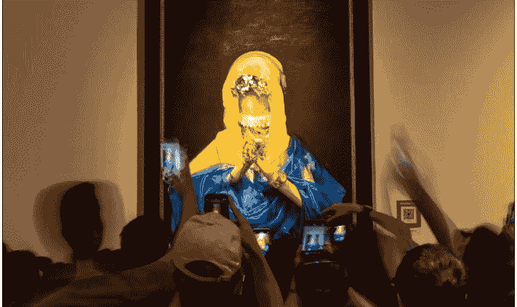

# 为什么有时明明赢了，却依然不开心？

250724

整理：公众号懒人搜索，懒人专属群独享
懒人微信：lazyhelper
公众号：懒人搜索，懒人专属群
微信：lazyhelper

前段时间，四川美术学院2025年的本科毕业展上，有一幅油画火出了圈，叫《祷》，祈祷的祷。作者安琪是四川美院今年的毕业生。

安琪说，《祷》借鉴了意大利画家桑索菲莱托的《祈祷的圣母》，同时又加入了大量的现代元素。我在文稿里放了这两幅画的图片，但是我建议你在网上找找这幅画的高清版，放大看。至少在我这外行看来，画里的细节是相当讲究。



这幅画在走红之前，就已经卖给了一位收藏家，网上流传的成交价是28万元。后来这位收藏家接受媒体采访时说，具体的价格不便透露，但大体在五位数到六位数之间。至于到底现在值多少钱，网友给出的定价区间跨度极大，有的甚至飙到了七位数。

给艺术品定价是一件复杂的事，涉及艺术家的知名度、创作手法、市场趋势等因素。而回到具体的交易过程，最常见的方式就是拍卖。

比如，6月初，一款薄荷色 LABUBU 以 108 万元的价格拍卖成交。算上佣金，最后的成交价高达 124.2 万元。

再比如，在香港苏富比 2025 年春拍中，元代书法家饶介的《草书韩愈柳宗元文》经过长达 95 分钟的竞投，200 多次叫价，最终以 2.135 亿港元成交，这也造就了香港苏富比史上历时最长的“竞投战”。

但我们今天要讨论的重点不是拍卖的流程，而是说一个拍卖中的奇怪现象，叫“赢家的诅咒”。也就是，最终成功竞拍的人，往往最容易后悔，赢了面子，亏了里子。

诺贝尔经济学奖得主理查德·塞勒专门写过一本书，书名就叫《赢家的诅咒》。理查德·塞勒做过一项“存钱罐拍卖”实验。实验的过程很简单，研究人员事先在一个存钱罐里放入 100 美元，然后再让 20 个人参与这个存钱罐的拍卖。平均赢家能赚多少钱？答案是亏损 5 美元。没错，也就是赢家每人平均亏损 5 美元。

在拍卖领域，这种现象特别常见。比如，在 2000 年前后，欧洲各国开始拍卖 3G 通信牌照。当时很多企业坚信 3G 业务会带来巨额利润，于是纷纷加入竞拍。最终，德国电信以 160 亿马克的价格成功拿下 3G 牌照，但这个价格远远超过了牌照的实际价值。再加上，3G 网络的建设成本高，用户增长缓慢，导致德国电信一度面临严重的财务危机，直到多年以后才勉强回本。

再比如，经济学家统计了 1954 年到 1969 年间，墨西哥湾 1223 份原油开采租约拍卖的税前回报率。结果发现，这些公司每份租约的平均损失是 19 万美元，其中只有 22% 的租约盈利。

再比如，1990 年，日本第二大造纸商大昭和制纸的名誉主席，斋藤了英，以 8250 万美元的价格拍下了梵高的画作《加歇医生像》，创下了当时艺术品拍卖价格的世界纪录。而在两天以后，他又以 7810 万美元拍下了印象派画家雷诺阿作品《煎饼磨坊的舞会》。两件艺术品加起来，总价超过了 1.6 亿美元。但后来这两幅画作的价值，远远无法达到当时的成交价格。

说到这，就引出一个问题，为什么会出现“赢家的诅咒”呢？可以避免这种现象吗？关于这个问题，浙江大学公共管理学院的教授蒋文华老师，在得到课程《博弈论50讲》中专门做过解释。

蒋文华老师说，拍卖的本质是博弈，而“赢家的诅咒”是买方和卖方博弈的结果。

首先，拍卖有个前提是，拍卖的物品必须同时具备私人价值和公共价值。所谓公共价值，就是大多数人愿意接受的价格，也就是市场价。而私人价值，指的是每个人对一个物品的心理价位。比如，一个喜欢梵高的人，对梵高画作的出价往往会高于市场价，而高出的这部分就是私人价值。注意，假如一个物品只具备私人价值，而不具备公共价值，那就不需要拍卖。比如巴菲特的午餐，对一个崇拜巴菲特的人来说，这顿午餐的价值很大，但对大多数人来说“巴菲特的午餐”没有市场价值，因此无法拍卖。而拍卖交易的本质就是，寻找那些愿意为私人价值付费的人群。具体来说，主要有这么三种方式。

- 第一种，也是最常见的拍卖形式是英式拍卖，也叫升价拍卖。我们经常在影视作品中看到的拍卖方式就属于英式拍卖。买家们依次出价，直到没有人继续加价就成交。这种拍卖形式就很适用于那些难以评估市场价值的东西。比如，登机口拍卖就采用的是英式拍卖。什么叫登机口拍卖？很多航空公司为了降低座位虚耗的损失，会卖出比飞机实际座位数更多的机票。那假如最终登记的乘客超过了实际座位的数量，那怎么办呢？没错，工作人员会从一个比较低的补偿金额开始报价，直到找出愿意改乘下一个航班的乘客。

- 第二种方式是，荷兰式拍卖，也叫降价拍卖。跟英国式拍卖正好相反，荷兰式拍卖是先喊一个很高的价格，然后再慢慢降价。一般情况下，荷兰式拍卖一般用于价值随时间下降的物品，比如鲜花、生鲜之类的物品。其中最经典的案例是，鲜花拍卖市场。通常情况下，拍卖师会从一个远高于预期成交价的价格开始报价，然后随着时间的流逝，逐渐降低价格，而参与拍卖的花店、花商、批发商等买家，看到价格降到自己愿意接受的水平时，会拍下对应的鲜花商品。

- 第三种方式，叫作最高价封标拍卖，也叫暗标拍卖或投标。买家需要在截止时间前提交书面报价，通常是密封在信封中或通过线上系统匿名提交，确保报价在开标前不被泄露。最终，出价最高的买家获标。一般情况下，最高价封标拍卖适用于工程招标、资产处置以及私密交易等场景。

但无论是哪一种拍卖形式，最终的目的都是吸引竞拍者参与博弈，然后让最终的交易以最高的价格成交。

而由于在拍卖的过程中，买方很难精准掌握标的拍卖品的真实价值，再加上需要持续竞争，就容易出现为了追求“私人价值”而错判“公认价值”的情况，于是就出现了“赢家的诅咒”。

说白了，就是参与者把“自己以为的价值”当成了“大家以为的价值”。

很多拍卖都属于双向拍卖，而且买卖双方遵循的逻辑不太一样。

比如股市，买方遵循的是英式拍卖的逻辑，为了买入股票，通常需要报出高于当前市场的价格才能成交。而卖方遵循的是荷兰式拍卖的逻辑，为了卖出股票，需要报出低于当前市场的价格，否则很难脱手。

假如我们把当天的收盘价看作是股票的公共价值，那么每一笔交易都有一方会陷入“赢家的诅咒”。假如收盘价高于成交价，卖家会觉得自己卖得太便宜，吃亏了。假如收盘价低于成交价，那么买家就会觉得买得太贵了。这也就意味着，无论股市本身的情况怎么样，“赢家的诅咒”始终存在。

最后，回到最根本的问题，普通人怎么防止自己陷入“赢家的诅咒”呢？蒋文华老师有这么三个提醒。

- 第一，避开那些“高风险博弈”的场景。说白了，就是上牌桌前想想自己有没有主动跳入陷阱。比如，英式拍卖，也就是升价拍卖，是最容易出现“赢家的诅咒”的拍卖形式之一。经济学家认为使用“二次竞价”的拍卖机制，就能有效降低“赢家的诅咒”。这种拍卖机制有个专门的叫法，叫做“维克里拍卖”，也叫第二高价拍卖。简单说，出价最高的人可以赢得拍品，但只需要支付第二高的价格。这种机制的好处就是，鼓励投标人报出自己真实的估值，不需要担心报高了吃亏。目前，维克里拍卖在数字广告竞标、政府采购等场景中已经被广泛采用。

- 第二，提前设置好心理底线。早在2005年，美国西北大学的研究团队就提出了一个概念，叫做“竞标狂热”。也就是在竞争性的情境下，参与者往往不再根据理性估值判断，而是受情绪和胜负欲驱动。说白了，就是竞拍的目的不再仅仅是为了获得物品，而是不能接受被别人抢走。因此，有一个非常关键的动作是，提前设定好你愿意为这个物品付出的最高价格。而且这个上限应该是基于你对市场的理解、自己的预算，以及这个物品对你个人的意义综合决定的。

- 第三，多收集信息，避免盲目乐观。“赢家的诅咒”之所以成立，有一个很大的原因是，我们不是在场收集信息最多的那个。在一个有很多竞标者的市场中，愿意出价最高的人，很可能是误判了价值。而误判的根源之一，就是信息掌握得不够充分。

最后，关于“赢家的诅咒”，英国作家王尔德有句名言，他说，人生有两大悲剧，一个是你所想要的，却得不到，所以感到很失望；但是更大的悲剧是，你所想要的终于拿到了，却感到很绝望。

而博弈论对这个问题的回答是，先想好自己到底想要什么，以及愿意为此付出的上限，建立长远视角，避免应激反应。

关于这个话题，咱们先说到这。假如你想了解更多博弈论方面的知识，向你推荐蒋文华老师的《博弈论 50 讲》，这门课可以帮你快速建立一个关于博弈论的，相对完整的思考体系。

备注：《博弈论 50 讲》课程电子版懒人专属群内已分享，见专属群的《通才计划》下载

最后，安利小懒的付费群：懒人专属群 懒人微信：lazyhelper

## 公众号 懒人搜索 懒人专属群


微信: lazyhelper

懒人专属群持续更新中，已持续运营 6 年，整理超 3000 份各类精选付费文章 & 年费社群干货，全部开放下载。

本资料为付费群内部分享，仅供真实有需要的朋友查阅 📖

### 懒人专属群更新记录：

```
https://lazy2025.top/#/blog/record2
```

### 懒人专属群更新记录（需梯子，备用）：

```
https://lazybook.fun/#/blog/record2
```