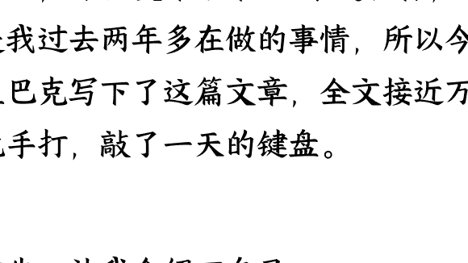
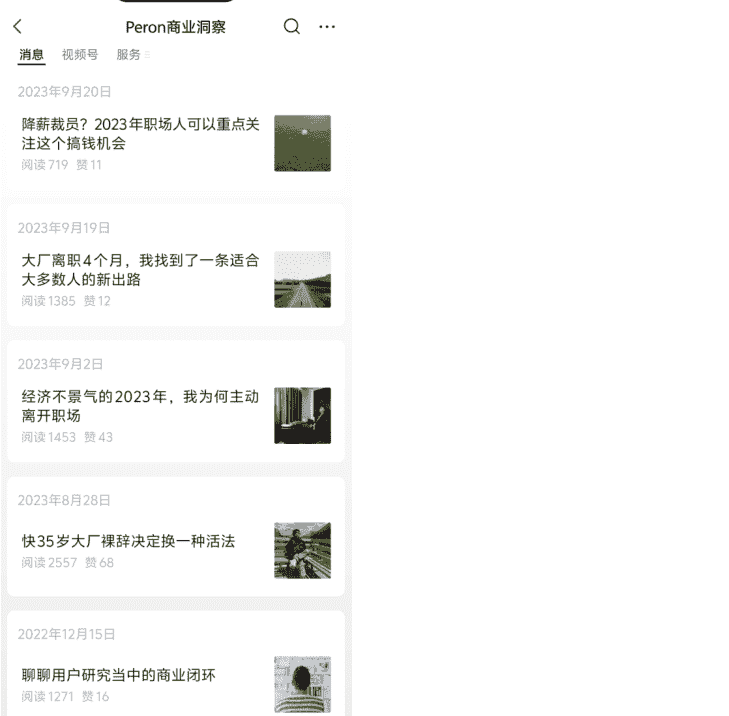
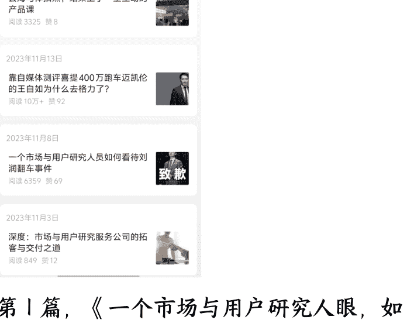
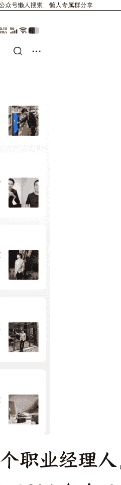
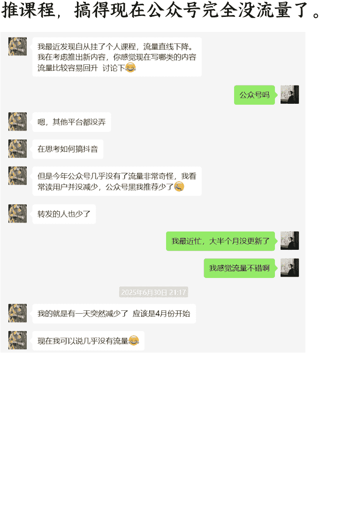
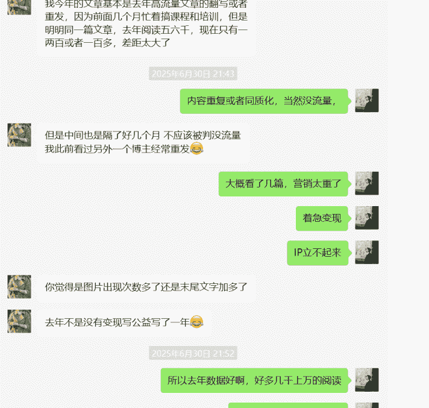
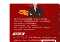
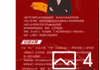
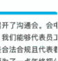

# 公众号细分垂直领域的专家 IP 打造与变现经验分享

250724 生财精华

公众号懒人搜索，懒人专属群独享

懒人微信：lazyhelper

昨晚，亦仁发布了第 10 条超级标，这正好是我过去两年多在做的事情，所以今天在星巴克写下了这篇文章，全文接近万字，纯手打，敲了一天的键盘。

首先，让我介绍下自己。

Peron 佩龙，2011 年中国人民大学本科毕业，然后进入一个非常小众的行业：市场调研，从事市场与用户研究工作。

先后在本土和全球头部市场研究公司博睿胜伦、Kantar（凯度）、尼尔森（Nielsen）工作超过 6 年时间，随后在 2017 年转到甲方互联网、智能硬件公司同程艺龙、vivo 开展用户研究（简称用研）工作 6 年。

2023 年，被甩出职场的赛道，另谋新出路，开始探索人生的第二曲线，那一年我 34 岁，正是中年危机的时刻。

我一开始，想着从自己的兴趣爱好着手，转行去做男士素人/形象改造。为此我报了健身房私教课，报了形象管理培训班，系统学习营养学，改造自己的饮食……但半年后，我一无所获。

就在此时，一个朋友听说我离职了，找到我来接外包项目，简单来说就是给他们公司（一个大公司）做消费者/用户调研项目的研究外包，具体包括对接客户、研究设计、数据分析、写报告，那个单子费用 6w。

随着需求变多，收入也还行，我就干脆注册了公司，相当于创业了。

就这样，我又重新回到了市场调研这个行业，重新干起了老本行——这个我积累了超过 12 年的专业细分领域。

## 一、IP 的 1.0 阶段-探路

接了一段时间这个公司的项目外包，很快我面临两个问题：

需求不稳定，有时候特别忙，有时候没单子，不够支撑我组建团队。并不是这个公司的外包需求不够多，而是从他们的角度，不愿意把单子都给某一个或几个供应商，这样会形成供应商的议价能力。

外包项目利润低，处于食物链的底层，赚的其实就是辛苦钱。一个月就算满负荷运作最多收入 5 万，甚至比不上在大厂上班收入，操的心还多，性价比低，何况不是一直能有单子做。

### 怎么办？只能拓展客源和业务：

- 寻找更多的客户，接更多的一手的或者二手的调研项目单子，这是 TOB 的逻辑。
- 拓展知识付费，考虑到我们这个行业极其狭窄小众（全国从业者估计就几千人），大多数人甚至都没听说过，所以我那会想的是不卖几百元的课，也不做几千元的线下培训，只做高客单价的 1 对 1 的陪跑，收费 1w/年，这是 TOC 的逻辑。

但是过去十来年，我在职场这个赛道并不成功，最高只做到高级研究经理，没有做过负责人，没有带过团队，行业里也没有积累什么客户资源。

好在，2020 年左右，我就开始有意识的在互联网上输出专业领域的内容。在人人都是产品经理平台开设了账号，积累了一些粉丝；2022 年 1 月注册了一个自己的公众号“用研那些事儿”，积累了大约有 2000+ 垂直粉丝（基本都是同行）。

于是，我 2023 年 8 月，重新捡起了断更半年的公众号。

### 我发布了回归后的一系列文章：

- 《快 35 岁大厂裸辞决定换一种活法》，告诉大家我离开职场了，阅读量直接破万（后来删除重发，仍然有 2500+ 阅读量）
- 《经济不景气的 2023 年，我为何主动离开职场》，进一步解释我为什么离开职场
- 《大厂离职 4 个月，我找到了一条适合大多数人的新出路》，宣告我的转型，介绍我的业务

与此同时，2023 年 9 月我把公众号名称“用研那些事儿”改成了“佩龙Peron”，原因如下：

“用研那些事儿”是一个纯干货分享的工具人账号定位，不利于涨粉和变现。

“佩龙Peron”，除了分享专业领域的干货，还会分享我的转型与创业成长故事，有 IP，有真实人设，更容易建立信任。

从一个工具人账号，到“用研人大厂离职，35岁探索新出路”的人设，这就是我第一阶段的思考和实践。

当我以“佩龙Peron”的 IP 运营了一段时间，确实带来了一些效果：

拓展了几个新的 B 端小客户，都是低价值客户，一个单子几千，高的一两万；收到了第一个高客单陪跑学员，验证了 TOC 的需求。

但远没有达到预期效果。

为了生产“高质量”内容，我每篇文章字数都在 5000 字以上，纯手打，一篇文章要写好几天，点灯熬油，发出来阅读就几百到一千多，投入产出极低。（如今，已经借助 AI 解放了内容生产力）

公众号懒人搜索，懒人专属群分享

我那会儿把问题归根于流量，我需要进一步破圈。

于是，我去蹭热点，从我们专业视角去解读热点，没想到流量挺好：

第 1 篇，《一个市场与用户研究人眼：如何看待刘润翻车事件》，阅读破了 5000。

第 2 篇，《靠自媒体测评喜提 400 万跑车迈凯伦的王自如为什么去格力了》，阅读量直接破了 10 万+。

第 3 篇，《字节跳动跳不动了，几千人的游戏部门即将全部裁员背后的真相》，阅读 7000+。

......

懒人微信：lazyhelper

但很快，我意识到一个问题：流量是很好，但实际没有太多涨粉和客资，都是泛流量，不精准，也正是那一刻，我对流量祛魅了。

## 二、IP 的 2.0 阶段-聚焦 TO C

2023 年 12 月，我把公众号“Peron 佩龙”改为“Peron 用户研究”，加上了行业属性。

我意识到，当下这个阶段，我的资源、能力只能支持我在垂直领域深耕，走精准获客的路。我的知名度、影响力、内容产能支撑不起来“Peron 佩龙”这个大 IP。

到这里，我其实陷入了困境：做垂直内容，没有大流量，没有业务规模；做泛内容，人群不精准，没有转化。

然后，我去研究了跟我性质一样的专家型 IP 公众号是如何做的，包括刘润和小马宋。

以下内容，我写进了《同样是咨询服务业，刘润、小马宋分别是如何破圈的？》发表在公众号，阅读量破了 1.8 万，小马宋老师还特地来加了我。

刘润，最早是一个职业经理人，在微软工作了 16 年，后来 2014 年自己出来创办了咨询公司润米，主要做战略咨询。

### 刘润的 IP 公众号怎么做的：

首先他的公众号定位是个人 IP 而不是机构，为什么是 IP 而不是机构？因为个人 IP 通过输出价值观、理念、生活方式等，能更好地与粉丝构建起信任，降低获客、成交成本。

为了塑造个人 IP，他的号会分享很多刘润个人相关的内容，这些内容大多是他工作、生活经历的所思所想，并且都会带上“刘润”二字开头，例如《刘润独家参访圣农：再不好好学习，我连养鸡都不会了》、《刘润：我是个社恐》等。

除此外，还有这么几类：一类是商业观察，例如《京东，开卷》、《宗庆后留下的，不止娃哈哈》；第二类是职场技能提升干货类，例如《你不是没有重点，你是没有结构；如何有效分析问题？》、《请让年终汇报 PPT，对得起你一年的努力》；第三类是个人成长&鸡汤类，例如《所谓自律，就是去对抗那些廉价的快乐》、《做难而正确的事情》。

这三类内容都会紧贴热点，蹭热点流量。例如商业观察类，最近娃哈哈老板宗庆后去世，他马上就写了一篇《宗庆后留下的，不止娃哈哈》；例如职场技能类，在金三银四招聘来临之际，他写《招不到人，背后的问题》；例如个人成长&鸡汤类，春节过年了，它写《春节前最后 20 个锦囊》。

第一类内容主打商业粉，是它的核心目标人群，也是最有价值的人群；第二类打职场人群，人群体量更大；第三类打泛人群，人群覆盖最广，这是一个金字塔结构。

从数据来看，这三类内容都有很好的流量，在日更的情况下，头条文章能做到篇篇 10 万+，次头条内容也能做到平均几万的阅读，这在公众号打开率大幅下滑的今天是很难的。

这三类内容都是团队在运作，而且其中相当部分内容是借助了 AI 产出。

刘润做内容并没有瞄着他的 B 端业务——怎么做战略咨询、战略咨询职业规划、战略咨询案例展示这个思路来做，而是选择围绕商业认知来创作内容，分析商业现象，然后在此基础上进一步拓宽内容，为目标人群提供职场技能干货，也就是实用价值，然后再提供个人成长 & 鸡汤，也就是情绪价值。

### 刘润做战略咨询为什么要大搞知识付费？

刘润的知识付费产品包括商业课程，年度演讲，商业付费社群，出书等多种形式。

课程《5 分钟商学院》卖出了超过 50 万份，累计获得超过 5800 万课程收入；2021 年开始每年 10 月举办“进化的力量・年度演讲”，连续三年每次都带来上亿级流量，门票和广告植入收益也是超过千万级；社群“进化岛“收费是 365 元 / 一年，有超过 1.8w 人加入，获得超过 600 万收入；出版了包括《每个人的商学院》在内的多本书籍，收入不详。

可见，刘润做 C 端知识付费真的赚了不少钱，既然这么赚钱，那当然要大搞特搞。

再就是，他 C 端业务和 B 端业务有很好的互补关系。

C 端业务能触达大量的商业小白或者说普通大众商业粉，这些商业粉后续有可能变成他 B 端业务的客户；B 端业务的企业战略咨询实践，反过来能为他提供源源不断的商业思考和内容。

本来是一个很好的闭环，然而在一次年会演讲上翻了车，原因是涉嫌数据夸大、歪曲事实，而且被贴上了不懂行业、纸上谈兵的标签。

当然，这并不是说刘润做 C 端业务的思路有问题，只能说他这种课程、演讲、社群由于服务深度有限，并不能让所有人都满意，不满意的人多了就会被反噬。

接下来，我们看下小马宋怎么做 IP 公众号的。

小马宋最早是广告公司出身，中间有过几段不算成功的创业经历，直到 2016 年重新出发，创办了“几件事“（小马宋营销咨询公司的前身），差不多到了 40 岁才开始走上正轨。

小马宋一开始也是公众号起家，靠着公众号红利和低客单价做品牌营销咨询（华与华一个项目要 600 万，又不讲价，他收费 3 万），结果客户爆满；于是赶紧把钱投进营销，开始出书，《朋友圈的尖子生》、《营销笔记》等，进一步提升势能，同时通过公众号营销案例展示来获取更多客户。

后来价格也越来越高，直到现在，小马宋品牌营销咨询费 160 万起，关键是他坚持不比稿，只做筛选，不做迎合，只做适合他们的客户。

所以，小马宋能起来离不开两个关键点：一个是会做内容（自媒体、出书等），一个是专业能力、经典案例带来的口碑。

以公众号为例，我们重点看看小马宋怎么做内容的。

和“刘润”公众号一样，“小马宋”也是个人 IP 号的定位，为了打造可信任的成交 IP 人设，有相当一部分的内容是小马宋的个人成长经历及过程中的思考，例如创业故事《创办一家小公司，并且活下来》、《我创业三次，这次已经活了八年》；个人思考，如《最近对市场的一些感受|小马宋》、《新年换了一台电脑，这里反映出几个营销问题》。

除此外，就是对商业热点的观察和思考。例如《长文回顾：宗庆后的天命》、《热辣滚烫票房破 30 亿，聊一聊我对减肥的 12 点认知》。这部分内容是为了打泛人群，进行破圈的。

有一部分就是咨询案例的展示。例如《小马宋 2023 年度营销咨询案例大合集》、《破局护肤品红海市场，绽妍 x 小马宋案例复盘》，这块明显是给 B 端企业咨询业务导流的。

还有一小部分是营销相关的知识、方法论。例如《怎么才能提高营销能力》、《营销的终极难题：回到用户视角》，这块主要给 C 端业务（得到的课程、出书等）导流。

区别于刘润，小马宋的内容更加聚焦商业和营销领域，他的文章流量要比刘润低一个等级，平均阅读量 2-3 万的样子，但人群更加精准，粉丝价值更高。

这其实是由业务逻辑决定的。

小马宋的营销咨询业务做到了行业头部，以 B 端业务为重心，所以在内容上更多以为 B 端业务导流、赋能为目的；刘润在知识付费领域做到了头部，以 C 端业务为重心，所以在内容上更多向 C 端业务倾斜。

研究完刘润和小马宋，我有几个启发：

- 1. B 端和 C 端业务都要做，C 端知识付费业务，一定程度上可以帮助 B 端业务获客。
- 2. B 端和 C 端业务要有侧重和取舍，就算是刘润、小马宋，也没法同时做好 B 端和 C 端的业务，而只能根据自己的优势选择其一。
- 3. 做好内容的 1+3 法则。“1”是 1 个 IP，不要做只分享干货内容的工具人账号，而是做有血有肉的个人 IP。“3”是内容框架，包括专业领域的知识、干货；基于人群破圈内容的构建；围绕个人 IP 内容的构建。

2024 年 3 月，我做出决定，重心转向 TO C 知识付费业务，TO B 业务甲方大客户看中品牌、资质、专家人设背书，不愿意承担风险找我们这种小工作室合作，哪怕性价比更高，反正花的是公司的钱对吧，所以短时间内难以攻克。

所以，我想走一条“曲线救国”的路。

我打破了我之前只做 1w 的高客单价的设想，建设了体系化的知识付费产品：

- 1. “用户研究成长圈”知识星球，最开始定价 50 元/年，逐步涨价到 99 元/年，直到现在的 199 元/年，定位入门级产品。
- 2. 大厂用户研究训练营，第一期定价 3980 元/人，然后做成了系列课，第二期开始涨价到 4980 元/人，定位中端产品。
- 3. IVI 年度陪跑咨询，收费 9999 元/年，现在涨价到 15999 元/年。

除了这三个核心产品，2024 年我还上线了“和君商学 · 战略用户研究班”（收费 15000/年，与和君商学院合作教学），瞄准行业内的用研一号位；“出海调研 VIP 会员俱乐部（收费 2980 元/人）”，主打出海调研人群。

这样一个产品体系，基本把行业里的人全部覆盖了。

可以说，整个 2024 年，我绝大部分时间和精力都在研发课程，卖课，交付。

然后我的内容全都围绕 TO C 知识付费产品转化服务构建：

例如，我推知识星球产品时，我会写一些入门的、比较基础性的内容，例如《应届毕业生入门用户研究必看攻略（6000 字干货）》，《10 年+用户研究专家，给 0-3 年初阶用户研究人员的建议》，《用户研究入门必看：定量研究方法大全》，阅读量都能有 1-2k。

例如，我推我第一期的“大厂用户研究训练营”，我做了 3 场“大厂用户研究职业发展&求职攻略”直播，并且记录了自己搭建直播间直播分享全过程发布在公众号，最终直接转化 30 个付费学员，6-8 个陪跑学员，单月收入直接接近 15w。（我写了篇《做用户研究知识付费第一个月，月收入 15w+，我是如何做到的》，也是生财精华文章）

例如，我推“和君商学·战略用户研究班”，我会提前产出和君商学相关的内容，以及战略用户研究相关的内容，最终 15 个学员面试，5 位付费学员，如果和君商学的入学门槛再低一点，转化效果能高一倍。

例如，我推“出海调研 VIP 会员俱乐部”这个产品，我会邀请出海调研的从业者，来做直播访谈分享，大概做了 6-8 期，叠加公众号文字稿内容输出，最后收了 10 几个付费学员。

当然，这些内容要尽量建立在利他的基础上，不能是纯推销，这样容易引起反感，过不了多久就没流量了。

这里列举一个反面案例，一个大数据分析师朋友，通过公众号加了我，她也是跟我一样做 IP，所以她经常找我交流经验，她 2024 年下半年开始学我搞知识付费，天天推课程，搞得现在公众号完全没流量了。

懒人微信：lazyhelper

不是说不能变现，而是要控制好度，始终不能忘了利他的初心。

2024 年 3 月到 2025 年 3 月，对我来说，是 ALL in 知识付费的一年，公众号文字内容输出以外，我尝试了直播、小红书，从结果而言，如下：

- 知识星球收入：累计 435 会员，约 5w
- 大厂用户训练营：60 个学员，收入 25w
- 1v1 年度陪跑：15 个学员，收入 15w
- 战略用户研究班：5 个学员，收入 7.5w
- 出海调研 VIP 会员俱乐部：15 个学员，约 4.5w

上面的数据，全是基于我一个人居家办公情况下做出来的，执行力没有拉满（大概全年 2/3 时间在工作）、没有上团队的情况。

基本上靠的就是一个公众号，加上 5 千人不到的私域。

TO B 的业务，则陷入了停滞，没有增长，接到的项目都转手外包出去了，我有一个兼职团队，全年到手利润大概在 20w-30w。

说实话，面对这样一份成绩单，我是不满意的，没迈过去百万年收入的门槛，比星球里的很多 00 后差多了。

我开始反思，0-1 这个阶段，我躬身入局跑通了商业闭环，那么从 1-100 呢？

## 三、IP 的 3.0 阶段-转向 TO B

一年过去了，我的公众号粉丝来了 11000 人，人人都是产品经理平台粉丝 8500 人，小红书平台粉丝 2500 人，视频号粉丝接近 2000 人。

在我们这个细分的领域，绝对算得上 KOL，TO C 知识付费能做到我这个程度和影响力的，没有几个。

同时，过去一年的 TO C 知识付费实践，也让我认清了一个客观现实，那就是用户研究这个领域的知识付费天花板不高，无法做起来规模。

这个赛道极其狭窄，行业势能还在走低，大环境对知识付费充满了“割韭菜”的质疑，招生越来越难。

反而是 TO B，在今年的 5 月份迎来了爆发。

在原有的项目外包基本盘之外，接连拿下了几个十几万接近 20 万的一手客户订单，虽然都是中小企业客户，但非常有希望能长期跟客户陪跑，一下就超越了知识付费全年的收入。

这几个项目，要么是公众号粉丝（产品经理）主动找上门来，要么是公众号粉丝（在大厂的用研同行）介绍。

这证明了做 TO C 的同时能带来 TO B 的转化，但更大程度说明，我们这个行业的大钱在 TO B 里。

于是，我做出了第三次的业务重心战略调整：2025 年开始全面转向 TO B，服务企业客户，赋能产业，这才是每一个专业人才应该且最终的归宿。

为此，我做了哪些事情？

首先，我带领我的公司，正式加盟了一家中国本土的大型管理咨询公司，这叫借势。

这样，我有了靠山和品牌背书，能部分解决与客户平等对话的问题，以及信任问题。

除此外，还能共享北京、上海、深圳、香港的顶级办公场地，这意味着，我终于可以邀请客户来我的“主场”喝杯咖啡，也可以为我的付费学员，提供一个有温度、有质感的线下学习社区。

再就是我将有机会把市场调研与咨询相结合，提供差异化的解决方案。

其次，在 IP 和内容策略上，我做了两件事：

1. IP 升维——做企业决策者的“第二大脑”

我将公众号 IP “Peron 用户研究”，升维为「Peron 商业洞察」（部分平台，如视视频号、小红书会保留这个 IP，主要交由团队代运营）。

### 关于公众号

- 微信号 LongRuiGuanTong
- 主体类型 个人
- IP属地 广东

### 授权第三方服务

- 西瓜集
- 新榜
- 展开

### 名称记录

- 2025年07月20日 “Peron用户研究”改名“Peron商业洞察”
- 2023年12月22日 “佩龙Peron”改名“Peron用户研究”
- 2023年09月26日 “用研那些事儿”改名“佩龙Peron”
- 2022年01月15日 “新注册公众号”改名“用研那些事儿”
- 2022年01月14日 注册“新注册公众号”

公众号注册说明

不再输出入门级的“术”，而全是面向商业决策的“道”。

我的核心沟通对象，不再是市场与用户研究的同行，而是企业的决策者——企业家、产品负责人和投资人。

我刚完成了第一篇转型的商业洞察文章，《别在红海里内卷了：这家“健身管理”公司如何找到被资本忽视的蓝海》，数据并不好，但我不会回头了。

### 2. 全新媒体矩阵——用一手数据，重塑产品评测

我计划打造一个全新的媒体矩阵“Peron 用户说”，这是一个全新的、“重工业”模式的媒体产品。

我们常见的产品测评，依赖于 KOL 的主观体验，我的想法是用严谨、科学、可量化的一手用户调研，去评测每一个热门的智能硬件产品。

「Peron 用户说」的每一篇报告，都将成为：

- 消费者的“避坑指南”：用真实用户的声音，告诉你一款产品到底值不值得买。
- 从业者的“竞品情报”：深度剖析竞品的优劣势，直指用户痛点。

我们公司的“能力名片”：它完美地展示了我能为B端客户提供怎样高质量的一手洞察服务。

这个模式很重，成本很高，但它构建的，是无人可以轻易模仿的专业壁垒。而我现在的正向现金流，以及加盟公司提供的资源，足以支撑我走通这条“难而正确”的道路。

### 最后，为了实现3.0的华丽转身，我构建了团队。

这个想法，在年初就开始蠢蠢欲动。

直到6月底，参加了一场广州线下的生财有数交流活动，《团队规模化：我是如何3个月做到百万》，彻底坚定了我招人搭建团队的决心，这里特别感谢@瑾糖@阿星。

现在特别流行“1人公司”，“超级个体”的说法，我过去2年的亲身体会来说，觉得这是陷阱，如果你真的信了，你本质还是贩卖时间的大号牛马。

创业的本质就是要冒更大的风险，要用劳动力杠杆，要去培养更多像自己的人，才能把盘子做大。

### 重心全面转向 TO B 并不意味着，我不做 TO C 了。

我必须承认，我对知识付费的理解，经历了一次“死亡”与“重生”。

我曾以为，知识付费是一门低成本高利润的好生意。但两年下来我才明白，在“用户研究”这个小众赛道里，指望它快速变现，无异于缘木求鱼。

它的天花板太低了。

但它的价值，又比我想象中深远得多。

它真正的价值，不在于那几千块的学费，而在于关系和“信任”的构建。

- 当我看到我的学员，从一个对行业懵懵懂懂的小白，成长为能独当一面的研究经理；
- 当他们拿到心仪的 Offer 时，第一时间向我报喜；
- 当我在线下与我的“陪跑学徒”面对面，为他梳理职业道路直到深夜……

我体会到了一种前所未有的、超越金钱的满足感。

我突然顿悟：教育，本质上是一件回报周期极长，但可能极其丰厚的事情。它需要真正的长期主义。

所以，我决定调整 To C 业务的定位——我将它视为一件半公益的事业，TO B 获客的流量入口。

- 我的知识星球“市场与用户洞察实验室”，定价 199 元/年，聘请全职运营，不再追求盈利，目标是做大用户规模和“喇叭口”
- 我的“大厂用户研究实操课”，每一期一半课酬分给授课老师，不再自己亲自做交付，我主要做流量。
- 我的“年度陪跑”服务，将正式涨价至 15999 元/年，并严格筛选，每年限收 10 名真正有潜力的学徒，为行业的未来培育优秀人才。
- 暂时砍掉“战略用户研究班”和“出海调研 VIP 俱乐部”这两个产品，收缩战线做聚焦

我不再指望它为我带来多少收入。

我只希望，在未来的十年，我的这些学员，能占据这个行业的半壁江山。

懒人微信：lazyhelper

到那时，桃李满天下，才是我迎来丰收的时刻。

在经过了一年的摸索实践，TO C这套流程已经被我标准化了，如今我只需要投入非常少的人力成本、时间精力就能完成去年同样的工作量和任务目标。

## 四、结语

回到这次的超级标的，细分领域+专家 IP+术相关分享=小号大流量，我的数据完美验证了。

从今年1月，我的公众号迎来了一波爆发，几个月迅速从5000粉丝涨到如今的11000粉丝，这还是每个月只更新5-6篇文章的情况下。

每篇文章的流量，确实也涨了不少，很多专业文章都能到3000-10000的阅读，这在去年、前年平均只能拿到几百到1千的阅读量。

懒人微信: lazyhelper

## Peron商业洞察

- 消息
- 视频号
- 服务

### 用户研究员如何跳出低水平勤奋，实现职业进阶？

阅读 765 赞 4

4月26日

### 如何做好定性研究：对话益普索(Ipsos) 高级定性研究总监Terry

阅读 1.0万 赞 105

### 《6000场+定性访谈主持人的秘笈》线上直播4.28日20点

阅读 197

4月25日

### 如何衡量用户研究的ROI（万字长文，独家模型）

阅读 1.1万 赞 169 1个朋友分享

### 《6000场+定性访谈主持人的秘笈》线上直播4.28日20点

阅读 207 赞 1

4月19日

### 花几千买的戴森吹风机和人体工学椅，为什么“痛”还在？聊聊用户视角…

阅读 637 赞 12

### 读完梁宁的《真需求》，作为一名专职用户研究人员，找到了通关密码

阅读 1064 赞 312 2个朋友分享

### 我们决定干票大的：一个洞察者社区的3.0进化

阅读 1077 赞 206 个朋友分享

### 市场调研的第一性原理：如何让你的洞察，一针见血？

阅读 3078 赞 772 3个朋友分享

### 市场调研行业成本和利润首次大公开：做一个调研到底要花多少钱，如…

阅读 2504 赞 578 个朋友分享

### 为什么你的问卷收回的都是“假数据”？一篇讲透高质量问卷数据回收

阅读 930 赞 224 个朋友分享

但在此，我希望大家可以多思考下：拿到流量后，你的变现模式到底是什么？是广告变现，还是像我一样，通过服务变现。

我在2023年底，参与了生财公众号爆文的项目。

懒人微信：lazyhelper

我没有像同行那样用 AI 批量生成，走矩阵批量废号流，而是每天花半小时选题，半小时手写 1000 来字，结合 AI 适当扩充。

所以不到 5 天，从 0 起了一个职场号（也是走的 IP 人设），很多 10 万+，流量很好（不稳定），但单号月收益平均只有 3k+（跟赛道选择有关）。

Mika侃职圈

阅读 4590 赞 12

2024年1月9日

### 广联达几千员工绩效奖金清零，工会主席称没必要为了年终把公司送…

阅读 10万+ 赞 141

2024年1月8日

### 深扒清华94级女高管违法裁员，背后原来是“自己有人”

阅读 7.1万 赞 408

2024年1月7日

### 保护这家公司，新年第一天开始执行4天工作制

阅读 566 赞 2

2024年1月6日

### 北京这家上市公司，全员绩效归零，不发年终奖，如何维权？

阅读 8825 赞 12

2024年1月5日

### 华为每年几个亿的捐款到底捐给了谁？

阅读 1129 赞 10

这成为我测试这个项目天花板样本，我算了下，假设我同时开10个号，一天8-10小时，一个月顶多能做到3-5w。

这就是这个项目，普通人的天花板，所以我放弃了这个项目。

但这个账号和流量有其它方面的价值，我通过这个账号引流了几千人到私域社群，而且现在正重启这个账号，利用它的流量给我的B端调研业务赋能（问卷调研样本收集）。

Mika侃职圈 ⭐

广东

职场自媒体。职场爆料，职场真实故事，为员工发声。

75篇原创内容

31个朋友关注

4月19日

不买房不炒股，vivo员工疯抢内部股

阅读 5.4万 赞 61

2024年3月4日

大厂卷，是大厂员工的谎言

阅读 8152

2024年2月26日

在华为早9晚6被约谈，因为倒欠华子一小时

阅读 1.3万 赞 6

2024年2月25日

(停更一年，今年4月测试了1次，仍然有流量，关键还在于选题和内容的原创性)

所以，在做流量之前，首先该想清楚的是流量如何利用。

流量不在于大小，在于你的应用场景。

## 最后，安利小懒的付费群：

### 懒人专属群

懒人专属群持续更新中，已持续运营 6 年，整理超 3000 份各类精选付费文章 & 年费社群干货，全部开放下载。

本资料为付费群内部分享，仅供真实有需要的朋友查阅

### 懒人专属群更新记录：

https://lazy2025.top/#/blog/record2

### 懒人专属群更新记录（需梯子，备用）：

https://lazybook.fun/#/blog/record2