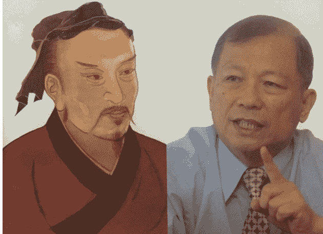
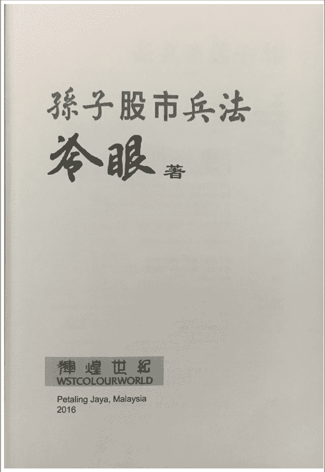

# 孙子股市兵法（全）

冷 眼

2016.08.08

编撰人：成都浪子韩
编撰人博客网址：stock.ys168.com

公众号懒人搜索，懒人专属群分享

亚洲周刊
大马华文畅销书
NO 1
第46期 20 Nov 2016

# 冷眼
## 孙子股市兵法

辉煌世纪
WSTCOLOURWORLD

## 【孙子股市兵法】_原书精装版_背面图片

## 投资智慧 尽在孙子

如果我们把孙子的“兵法”套用在今天股票投资上，会合适吗？管用吗？投资的成果会更加丰厚吗？这就是冷眼在本书中要探讨的主要课题。

41 02 1088 火炎 POPULAR 0119568-48

辉煌世纪 出版 WSTCOLOURWORLD
ISBN978-983-9537-11-6
9 789839 537116

## 【孙子股市兵法】_原书精装版_内页书名图片

## 孙子股市兵法

作者：冷眼
编者：黄森全
封面&插图：黄森全
平面设计：沈雨仙
校对：张锦馨

出版：辉煌世纪 WSTCOLOURWORLD
WSTCOLOURWORLD SDN BHD 228794X
P.O. Box 1070, Jalan Semangat,
46100 Petaling Jaya, Selangor, Malaysia
Fax: 603-7877-5246
Email: wstcolourworld@gmail.com

印刷：Percetakan Zanders Sdn Bhd

版次：第1版第1刷2016年11月5日
第2版第1刷2016年11月9日

定价：RM128.00

国际书号：ISBN 978-983-9537-11-6
图书分类：Perpustakaan Negara Malaysia Cataloguing-in-Publication Data
冷眼,1939-
[Sun zi gu shi bing fa]
孙子股市兵法/冷眼
ISBN 978-983-9537-11-6
1.Stocks-Malaysia. 2.Investment analysis. 3.Stock exchanges-Malaysia. 4. Investment-Malaysia. I. Title.
332.6322

书中资料来源可靠，并经查究，惟不能保证绝对准确与完整，书中内容均属作者个人意见，且仅供参考研究；对公司、机构全无褒贬之意。读者若因本书而做出投资决定，本书作者、编者以及出版公司对其后果不负任何责任。

版权所有，侵权必究●印装错误可随时退换

6

## 目录

## 出版前言:无穷如天地，不竭如江河
## 作者自序:孙子股市兵法

## 1 道高一“筹”
- 1.1 兵者，国之大事
- 1.2 以道为尊
- 1.3 少算不胜，何况无算？
- 1.4 静以幽，正以治
- 1.5 九变之利
- 1.6 主不可以怒而兴师
- 1.7 以治待乱，以静待哗
- 1.8 恃吾有所不可攻也

## 2 恃吾有以待之
- 2.1 费留
- 2.2 行千里而不劳
- 2.3 不可胜者，守也
- 2.4 防亏八法
- 2.5 覆军杀将，必以五危
- 2.6 百战百胜，非善之善
- 2.7 利而诱之，乱而取之
- 2.8 智将务食于敌

## 3 知之者胜
- 3.1 策之而知得失之计
- 3.2 决战于千里之外
- 3.3 不用乡导不得地利
- 3.4 转圆石于千仞之山
- 3.5 先知必取于人
- 3.6 一叶知秋
- 3.7 见微知著
- 3.8 蛛丝马迹
- 3.9 草木皆兵
- 3.10 先胜而后求战
- 3.11 全胜靠四知
- 3.12 地者，险易死生也
- 3.13 主孰有道？
- 3.14 知胜有五
- 3.15 并力、料敌、取人

4 冷眼 · 孙子股市兵法
5
目录

## 4 上兵伐谋
- 4.1 动而不迷，举而不穷
- 4.2 全国为上，破国次之
- 4.3 途有所不由
- 4.4 军无百疾，是谓必胜
- 4.5 合于利而动
- 4.6 股海扬帆四重奏
- 4.7 阴阳、寒暑、时制
- 4.8 兵以诈立
- 4.9 欲涉者，待其定也
- 4.10 决积水于千仞之谿
- 4.11 上兵伐谋
- 4.12 避实而击虚
- 4.13 十则围之

## 5 以奇胜
- 5.1 以正合，以奇胜
- 5.2 以迂为直，以患为利
- 5.3 计利以听
- 5.4 攻其无备，出其不意
- 5.5 动于九天之上

6 冷眼·孙子股市兵法
- 5.6 见胜不过众人之所知
- 5.7 胜之半也
- 5.8 兵无常势
- 5.9 因敌而制胜
- 5.10 五行无常胜

## Contents（目录）

- 作者马来西亚股神：冷眼（冯时能）简介（手输版1,0K）............................................................................13
- 编撰人：浪子韩简介（散户投资者，半职业股民，2019年修改版1）............................................................14
- 成都浪子韩编撰语：冷眼投资理念与国内投资现实，值得本地化实战探索！ ....................................................17
- 编者出版前言：无穷如天地，不竭如江河！ ....................................................................................................27
- 作者自序：孙子股市兵法！ ................................................................................................................................29
- 1 道高一“筹”................................................................................................................................................33
- 1.1 兵者，国之大事....................................................................................................................................34
- 1.2 以道为尊................................................................................................................................................35
- 1.3 少算不胜，何况无算？........................................................................................................................37
- 1.4 静以幽，正以治....................................................................................................................................40
- 1.5 九变之利................................................................................................................................................42
- 1.6 主不可以怒而兴师...............................................................................................................................44
- 1.7 以治待乱，以静待哗............................................................................................................................46
- 1.8 恃吾有所不可攻也...............................................................................................................................49
- 2 恃吾有以待之............................................................................................................................................53
- 2.1 费留........................................................................................................................................................54
- 2.2 行千里而不劳........................................................................................................................................58
- 2.3 不可胜者，守也....................................................................................................................................60
- 2.4 防亏八法................................................................................................................................................61
- 2.5 覆军杀将，必以五危............................................................................................................................64
- 2.6 百战百胜，非善之善............................................................................................................................66
- 2.7 利而诱之，乱而取之............................................................................................................................68
- 2.8 智将务食于敌........................................................................................................................................71
- 3 知之者胜....................................................................................................................................................73
- 3.1 策之而知得失之计...............................................................................................................................74
- 3.2 决战于千里之外....................................................................................................................................77
- 3.3 不用乡导不得地利...............................................................................................................................79
- 3.4 转圆石于千仞之山...............................................................................................................................82
- 3.5 先知必取于人........................................................................................................................................84
- 3.6 一叶知秋................................................................................................................................................86
- 3.7 见微知著................................................................................................................................................89
- 3.8 蛛丝马迹................................................................................................................................................92
- 3.9 草木皆兵................................................................................................................................................96
- 3.10 先胜而后求战....................................................................................................................................100
- 3.11 全胜靠四知........................................................................................................................................102
- 3.12 地者，险易死生也............................................................................................................................104
- 3.13 主孰有道？........................................................................................................................................108
- 3.14 知胜有五............................................................................................................................................110
- 3.15 并力、料敌、取人............................................................................................................................112

## 4 上兵伐谋
- 4.1 动而不迷，举而不穷
- 4.2 全国为上，破国次之
- 4.3 途有所不由
- 4.4 军无百疾，是谓必胜
- 4.5 合于利而动
- 4.6 股海扬帆四重奏
- 4.7 阴阳、寒暑、时制
- 4.8 兵以诈立
- 4.9 欲涉者，待其定也
- 4.10 决积水于千仞之谿
- 4.11 上兵伐谋
- 4.12 避实而击虚
- 4.13 十则围之

## 5 以奇胜
- 5.1 以正合，以奇胜
- 5.2 以迂为直，以患为利
- 5.3 计利以听
- 5.4 攻其无备，出其不意
- 5.5 动于九天之上
- 5.6 见胜不过众人之所知
- 5.7 胜之半也
- 5.8 兵无常势
- 5.9 因故而制胜
- 5.10 五行无常胜

## 作者马来西亚股神：冷眼（冯时能）简介

- 冷眼原名冯时能，是当今大马最脚踏实地、最杰出的专业股票投资家之一。有近五十年的实战经验，成绩斐然。有慧眼识股的本事，也有洞察先机的本能。对股市的运作与规律、创富的窍门，了如指掌，攻守得心应手。其 1939 年出生于马来西亚霹雳太平附近的小镇双溪罗丹；

- 1963 年获南洋商报奖学金进“新闻工作者”训练班，到新加坡受训一年，以特优成绩毕业，回国后被派到芙蓉和怡保做记者。先后获英国汤逊基金奖学金在印度读高级新闻学；英联邦报业基金协会奖学金在伦敦读“报业管理课程”。1985 年调升吉隆坡任经济组主任。之后的五、六年中，共跃升四次，从经济组主任，新闻编辑、副总编辑，到总编辑，于 1994 年荣休。

- 四十年前开始研究股票投资，钻读中西股票投资经典著作，全面收集研究国内上市公司年报逾 10000 本，被公认为大马个人收集上市公司年报书最齐全者。对今天国内 1000 多家上市公司的背景，管理层，业务状况和发展前景，了如指掌；是当今最被推崇的股票基本面投资大师；

- 经常受邀出席股票投资研讨会，几十年来在国内各地和新加坡发表演讲不下百场；立论精湛，每场爆满，是股票剖析方面受欢迎的演讲家。

- 1980 年曾荣获隆雪中华工商总会举办“在国家发展中华人经济地位问题探讨”全国性论文比赛首奖。除此之外，并以其他笔名发表散文及随笔，多次被选入海内外出版的选集中。

- 60 年代开始在《南洋商报》经济版专栏《股票与股市》和《投资路上》撰写股票评论，提供股票投资指南，广受欢迎；这几年的专栏《分享集》，佳评如潮。

- 从《南洋商报》退休后，立即被上市公司聘为高级总经理及业务顾问，长达八年，负责开拓中国、越南、缅甸、菲律宾和巴布亚新几内亚的各类业务。

- 股票方面的著作有《股票投资手册》（1981），《30 年股票投资心得》（2004），和《股票投资正道》（2011）

- 2002 年后辞去所有公司职位，专心研究股票，在造诣上百尺竿头更进一步；而生活方面，除了享受天伦亲情，以及和朋友交往之外，就是游泳、读书、写作，美食和旅行。

> “买股票就是买公司的股份，买股份就是与人合股做生意”
> ——冷眼

（注：本文为编撰人成都浪子韩于 2019 年 12 月 28 日晚间亲自修改整理完成，希望大家尊重劳动成果，学习有益身心之健！！）

## 编撰人：浪子韩简介（散户投资者，半职业股民，2019年修改版）

- 本名胡松涛，笔名浪子韩、成都浪子韩，1977 年出生于四川成都，古曰“天府之国”，2006 年入市，散户投资者，半职业股民，悟道于趋势交易、技术分析、量价时空分析、基本面识股，懂得敬畏市场，能独立思考、耐心等待交易时机出现，严守纪律，敢于重仓执行，并在侧重对市场整体周期性交易时机进行识别、分析和把握的同时，善于运用“画线八法”和“八卦均线交易系统”把握个股趋势性交易机会，已在市场实战中取得了较好战绩。

- 1997 年 10 月进入本地银行系统工作，一直闲于股市外享乐人生；2006 年 6 月进入股市，按照新股民思路炒股，时逢大牛市，小盈；2007 年 9 月开始，顿悟以新股民思路炒股存在较大风险，故四处寻找好的方法及大势判断思路，在互联网搜寻中，缘遇上海张晓青老师视频课件，并成为专读学员，小盈；2007 年 11 月开始，成为正式学员，学时近 2 年，大盈，分别于 2007 年 11 月和 2008 年 2 月分两次高位套现出局；2008 年 10 月止，从前述套现出局至今，持平，一直空仓至 2014 年，仅参与过几次短线操作，有盈有亏；2008 年 9 月开始，为提高自己水平，在整理晓青技法和自身学习心得基础上，先后创建了“浪子韩股票评论博客”（2008 年 9 月）和“浪子韩股票资料下载专区”（2009 年 3 月）；此前，已于 2007 年 11 月创立了浪子韩 QQ 公开交流群“浪子韩股票投资群”（目前群人数已达 1900 余人）。

- 2008 年至 2013 年期间，是 A 股牛熊转换后长达 5 年的漫漫熊途之年，其在参加了近 2 年上海张晓青老师股票学习课程后，于 2009 年开始也踏上了自修、自渡之路，并利用业余时间阅读了大量国内或国外（香港、马来西亚）能够购买和找到的股票投资书籍，比如：陈江挺《炒股的智慧》、李梦龙《庄家操作定式解密精要》、青泽《十年一梦》、曹仁超《论战》《论势》《论性》、李驰《中国式价值投资》《投资是一场长途旅行》、但斌《时间的玫瑰》、曾渊沦《财富非常通道》、冷眼《30 年股票投资心得》《股票投资正道》、杰西·利弗莫尔《股票作手深思录》、流入民间《ST，垃圾还是金矿》、宁俊明《黑客点击》等各类股票投资书籍，以拓展了自己对市场、对交易机会、对价值投资等投资理论、理念等交易策略的相关理解和认知。后于 2011 年 4 月创建了“浪子韩新浪博客”，以分享自己认为有价值的投资文章及个人投资感悟，现依然不断更新中。

- 于 2009 年开始创办“浪子韩股票学习课程”，以同小部分学员共同交流和深入探讨本人对大盘走势的分析，对短中线交易策略实战交易机会的理解和体会，以及对长线投资策略难点和实战心得体会等内容，该课程也一直延续至今，期间仅于 2013 年停课 1 年，后于 2014 年复课，并在此轮 5 年熊市周期基本空仓度过后，于 2014 年 9 月再次重仓入市，并于 2015 年 6 月和 7 月分两次高位套现出局，大盈；2015 年 12 月，从前述股灾顶部套现至今，也一直空仓，回避了 2015 年 8 月末的二次踩踏暴跌走势，并更有理有据地等待后期市场真正交易机会的出现。

- 于 2011 年 9 月参与成都电视台第 3 频道经济频道的“实战 700 节目（2011 年第 4 季度，为期 3 个月）”炒股比赛，在认定判断 2011 年下半年仍处于大熊市周期中，市场依然将是单边下行趋势走势，故在参加节目中依然采用守式，以空仓应对下跌，以不变应万变，并最终取得比赛成绩：总参赛选手第 2 名（本次参赛选手共 40 人），同时外围赛选手第 1 名的成绩。本次参赛体会是：散户一定要顺应市场趋势的力量，不能逆市操作交易。

- 于 2015 年开始研读鲁兆老师所撰写的收官之作《鲁兆股市预测与实战操作系统》一书，在 2015 年 9 月至 2019 年 12 月期间内，不断研究和学习“八卦均线战法交易系统”，并成功完成“八卦均线战法指标”在股票软件中的主图化呈现和运用，并通过实战交易，进一步理清了上述战法的进退运作方式，以期在未来市场出现整体性牛市周期或者个股出现趋势性交易性机会周期时，通过上述战法取得超额收益。上述 4 年周期中，股灾高位套现大盈资金依然采用空仓策略，未入市，仅以适度资金量每年参与了几次短线和中线实战交易，有亏有盈，主要目的还是在于检验和发现“八卦均线战法交易系统”在实战交易中存在的优点和不足，并针对交易系统的不足之处进行了改进和完善，为未来行情到来时取得超额收益打下坚实的基础。

## 编撰人：成都浪子韩个人资料目录：

- 1、“浪子韩”个人 QQ 号：2303014（唯一 QQ 号，大家注意识别，警惕假冒！）
- 2、“浪子韩”个人微信号：“cd1zh188”、“cdlzh88”（唯一个人微信号！）
- 3、“浪子韩”同名微信公众号：“浪子韩”（创立于 2016 年 2 月），公众号微信号：“cdlzh188”（唯一微信公众号，大家注意识别，警惕假冒！）
- 4、“浪子韩股票评论博客”（创立于 2008 年 9 月），现改为“浪子韩股票学习课程”
链接网址：http://ststock.ysl68.com
- 5、“浪子韩股票资料下载专区”（创立于 2009 年 3 月）
链接网址：http://ststock.3adisk.com
- 6、“浪子韩股票投资群”（创立于 2007 年 11 月）
QQ 群号：50775656（1 群 3 千人），90569178（2 群 2 千人），25563202（3 群 2 千人）
- 7、“浪子韩新浪博客”（创立于 2011 年 4 月）
链接网址：
（1）http://blog.sina.com.cn/cdhusongtao
（2）http://blog.sina.com.cn/u/2110012261

> “知进退、舍贪嗔、求善终！”
> “深圳弘法寺佛教格言：吃苦了苦，苦尽甘来；享福了福，福尽悲来！”
> ———浪子韩

（注：本文为编撰人成都浪子韩于 2019 年 12 月 28 日晚间重新修改版本，增加了近几年研究和优化“八卦均线战法交易系统”的摘要内容，希望有兴趣的股友可以在后期同我一起进行交流和探讨。）

## 冷眼投资理念与国内投资现实，值得本地化实战探索！
——浪子韩编撰题语

“终于托朋友的女儿在新加坡‘POPULAR’（大众书局）购物中心买到了冷眼的新作，《孙子股市兵法》，买这本书共花了 350 多元人民币（贵吗？对于一般的股民肯定会认为贵，但是对于我而言，冷眼的书再贵也值得继续买入，就如股道一样，正念难求啊！）。其实说是新作，也是 2016 年出版的了，由于国内网络限制，对于这本新作一直也不知道，毕竟国内关注冷眼的人还是小众，所以直到国庆前，有一个股友找到我，因为他发现我制作两本书冷眼的著作，就想问我是能买到这本书。也由于这个股友的出现，也就才能有今天在现实的时空中，拿到本书，开启新的一段同冷眼的精神交流和学习。其实通过此中的因缘，大家不知道是否能感受到人生当中的很机缘，真的非常微妙，可能这也是我们应该各自善待我们生活中的苦与乐吧！并在积极善待自己的同时，也应该以更积极的心态去影响他人，由此，可能才会在自己的生命轮回中获得善终。人生一世不过微尘，来人世一趟也不容易，所以多一份善缘和善意，以及洒善的基因于世间，可能才能积善行德吧！这本书我未来依然会制作成电子书，以延续我一直以来的善因缘起吧！不为其他，只为未来多一份股市里善终的可能吧！”以上内容是我在 2019 年 10 月 15 日发到我的几个公开股票群的相关内容，也是今年能够再有这本最新冷眼电子书的缘起。

说到缘起，其实，以目前看来，本人不知不觉已经成为了冷眼老师在国内普及其股票投资正道理念的布道之人，可能也是由于本人在股道所花精力和悟性有别于大部分散户投资者吧！本人也挺珍惜自己同冷眼老师的这份神交已久的师徒缘分。

就我个人对于冷眼老师股票投资理念的理解，其实他所说的很多投资理念的确是很正确的，但是，放在国内的投资现实中去运用，却又是非常困难的。因为你很难真正的将其投资理念在国内现实市场环境中去落地，因为，大部分散户投资者基本上无法做到对其投资理念的坚守。因为，国内的现实市场，有太多的诱惑让你放弃对于他的这种理念的坚守，很快地就在现实利润的诱惑下，放弃了他的投资理念，从而转入投机博利的方式中，无法自拔。

再加上，国内现实市场环境在 2015 年股灾之后的这四年以来，本身市场结构就在产生深度分化。而只要你是在市场中现实生存了 5 年以上的散户投资者都会理解到，目前市场环境中想要去执行一个中长线投资理念的难上加难。因为，比较初级散户投资者对于市场、个股、资金量和时间、空间、共振性等众多投资方面的观察和理解来看，能够在我们这样的一个吃人不吐骨头的股票市场生存了 5 年以上还没被深度套牢，且算总账还属于获利的散户投资者，肯定有其独到之处。目前的这个市场环境下，如果你不能真正理解，股价下跌再低也不见得能够出现真正的中长期投资交易机会，底部震荡再长也不见得能够出现真正的中长期向上拉升交易机会等以上这两句话的真正含义，那么，你就很难在国内的现实市场环境中，去执行冷眼老师的投资理念和策略。

另外一个现实，就是马来西亚股票市场的股票数量 900 多支与国内股市目前股票数量 3700 多支之间的差异是非常巨大的，截止 2020 年初已经达到 4 倍左右。在这个数量差还在不断发生变化的当下，现实层面的投资抉择也就更加的困难，特别是在选股上也就更加的困难。通过 2015 年股灾之后，国内资本市场与实体经济的连接大大加强，在上述加强影响下，股票数量出现了大幅扩容，也就是国外所说的每周的造富运动，不论这个造富运动最终的结果如何？我们现在在这个市场环境中是进行时，在无法改变外部市场环境的情况下，那么，我们就只能改变和调整我们内部投资理念和决策，去适应当前国内市场的现实环境后，去作出中长线投资上相对正确的决策。

在这种投资理念的影响下，我想，正如我们这篇文章的标题“冷眼投资理念与国内投资现实，值得本地化实战探索！”一样，就我个人投资理念的塑造和形成而言，其实，从 2008 年左右开始接触到冷眼老师的投资理念和策略以后，我就一直在进行着此类实战探索，但是，这么多年过来之后，我依然还是在继续探索的征途中，不断求索和实战中，大家也就可以看出，想要在国内现实的市场环境中去运用好冷眼老师的投资理念和策略，其实真的非常困难，没有大家想像的那么简单。目前的体会来看，如果你在牛市中运用冷眼老师的投资策略，其实结果同牛市本身来看，肯定是没有问题的。但是，目前主要的问题是在熊市和猴市这两种市况下如何运用冷眼老师的投资策略？该问题才是在我国一直是熊长牛短的市场周期环境中，我们需要不断直面的难点，并且还要结合自身多年来形成的投资战法系统去融合冷眼老师的投资策略，并让它们形成的最终结果是 1+1>2！

投资很难，难就难在，在股市投资中，充满了很多不确定性，如何在众多不确定性中去寻找相对确定性的方向、标的和投资交易机会，其实，整体而言，这个系统工程本身就要求相关散户投资者自身，一定要有自信、自省和自审的能力，并能够通过长期的市场实战去观察、学习和发现不同的交易机会，形成适合自己个人性格特质的相关交易系统，将它投入到股票实战中。同时还需要具备另外一种能力，就是能够在万千反对声中，去坚守自己认为正确的投资理念和策略，并将其一直坚守下去，就算其它投资者说你可能是一种偏执，也能淡淡一笑而过，并对投资的最终结果负责。

投资就是这样。希望能够看到本文的广大国内散户投资者，也希望大家能够同我一样，在未来的投资征途中，去本地化实战探索冷眼老师的投资理念和策略，不论结果如何？其实在本地化实战探索的同时，我们都能够得到更多的成长，不论是投资方面，还是做人方面，只要有成长，有收获，对于我们每一个实战探索的投资个体而言，也就是一种成功了。

正如：“人生一世，不过微尘！”（原句：人生一世，草木一春，来如风雨，去如微尘！），不论你我是多么微小的微尘，依然还是希望我们大家都能够在投资的思维理念和实战探索等方面得到提高，并付出更多的向善之心，在未来的投资征途中得到善终！（其实大部分散户投资者想要在投资领域得到善终的情况都很难很难！）

感谢大家阅读关注！

祝大家：投资顺利！
多结善缘！
珍惜福运！
获得善终！

## 浪子韩
2020 年 1 月 8 日 22 点 18 分
四川，成都，家中书房

（注：本文为编撰人成都浪子韩于 2020 年 1 月 8 日晚间抽空亲自撰写，希望对大家未来的投资带来帮助，只要大家能够体会到本人的良苦用心就好！当然，本人的投资行为依然还会努力和坚持下去，至于未来是否能够达到财富自由？其实随缘就好，不用强求！由于冷眼老师的年龄关系，这本投资著作应该可能是最后一本啦！也很高兴自己能够完成他的三本著作的电子书编辑和制作，希望能够散布出更多的善的投资基因，为国内广大的散户投资者群体带来属于正念的投资理念和策略，让他们在各自的投资生涯中不再孤独，能够在股票投资正念的影响下，获得各自的善终！至于本人何时能推出的下一本投资类电子书作品，我也很期待，让我们共同期待，在未来的某一天，再在网络的海洋中再次相见，再次感谢大家的关注！）

【孙子股市兵法】 马来西亚股神：冷眼（冯时能）著
编撰人：浪子韩 QQ：2303014 1 群：50775656

另附：2018 年 10 月 9 日所写《对 20 和 30 岁左右的年轻散户投资者的投资建议》一文，希望大家共勉吧！

以下部分内容主要是想结合自己这 13 年以来的投资经验，同更多 20 岁、30 岁左右的年轻散户投资者或 40 岁同龄或同好的散户投资者交流一下，自己这十几年年来在国内进行着各类投资行为的投资感悟，不论成败几何，请大家相信本人依然还是基于初心，想帮助更多散户投资者的善念行为无错，也请诸位看客见笑啦！本文着重想更多的分享给国内目前正处于 20 岁或 30 岁的广大年轻散户投资者，让他们在未来的投资行为中少走弯路，能够把握住自己生命周期的主轴方向，因为每个人在 20 至 40 岁的黄金二十年中，都需要大家自己更加的珍惜相关人生岁月，努力奋进前行，在职场领域与投资领域双轮驱动，不论两者哪一个遇到继续向上发展的瓶颈时，都能够在取舍间不放弃、不气馁，在稳定职场现有发展的同时，继续坚持在投资领域继续勇敢前行，并通过市场实战和学习，不断累积经验和知识，敢于进行投资决断，并最终取得在投资领域财富累积的巨大突破！根据我个人的经验体会，个人认为以下七点中的每一点的取舍和选择都将对 20 岁或 30 岁的年轻散户投资者在未来的投资行为结果产生非常重要的影响，以下让我逐步谈一些浅见和体会，希望对大家有所帮助。

第一点，稳定收入来源，开源节流，学会定期储蓄，取得启动资金。

这一点是未来所有投资行为的原点，所以，找一份能够获取稳定收入的职业工作就显得非常重要，人喜欢折腾，特别是在职场上，但是，大家自己一定要尽早清楚自己相对的能力天花板，并在职场达到一定层级之后，就一定要学会平衡人生中的很多欲望，特别是在职场中而言，尽早找到你的职场中定位，你才能够在投资领域有更多的可能性。在有稳定收入之后，一定要学会开源节流，学会定期储蓄，因为，作为一个“月光族”而言，你不可能进行储蓄，你也就不可能尽早开启你自己个人的投资生涯，因为，往往对于目前的 20 和 30 岁的年轻人而言，本身开源节奏，进行定期储蓄，就是一种不可能完成的任务，那么，也就可想而知之，这类年轻人也就无法在适当的年龄中取得启动资金，也就不可能尽早开始自己的投资行为，没有这一点，后面的几步都将只是浮云。所以，有了稳定收入之后，在开源节流，定期储蓄之后，你才能够有启动资金去进行投资，不论这个启动资金是一万元、五万元、还是十万元或更多，但是，它都将是作为原点，所以，请大家尽早明白个中道理，并尽早开始这个第一步。

第二点，主动找寻股票投资正道，花时间努力学习多种投资方法，找准市场定位，勇于实践。

这一点是未来自己的投资行为能否不断增长的关键一步，很多散户投资者根本不懂得股票投资的本质，就不断的进场追涨杀跌，所以，大家一定要尽早找到“股票投资正道”（我个人理解，冷眼老师的《20160118【股票投资正道】-马来西亚股神冷眼(2011 年最新著作)-浪子韩 2015 年最新编撰版(最终版本)》和《20170223【30 年股票投资心得】-马来西亚股神冷眼-2004 年出版著作-唯一正宗原版书-浪子韩 2017 年编撰版(最终版本)》等两本书，就能够诠释个中道理，还没有看的散户投资者可以下载后进行阅读和学习！），在明白股票投资正道的同时，才能够少走投资思维理念上的弯路，并在此基础上，对自己能够找到的很多投资方法进行有重点和区分性的学习和领悟，并在化繁为

公众号懒人搜索，懒人专属群分享简单梳理后，形成一套适合你自己性格的投资方法或交易系统，以在投资市场中找到自己的身份定位。在找准市场定位之后，才能够更好的开展各类投资行为，勇于实践的同时，才能够在市场中取得更多的经验和财富。这一点所需要花的时间和精力都将是非常长的和巨大的，并且在每个散户投资者的个人生命周期中都将会是非常重要的一步。这一步的好坏，将直接影响未来几步的变化。这一步部分人可以花十年时间都有可能无法得道，所以，这对于大家个人的悟性和自修能力都将是一种考验。作为广大散户投资者而言，这一步很多时候带有宿命的色彩。因为，大部分人都将无法超越自己的思维和学习的极限，进入悟道新境界。也由此，希望大家在进入自度的阶段，一定不能轻易放弃，还是要多多坚持，寻求自己投资境界的超越。

### 第三点，累积财富的同时，要懂得取舍，规避市场风险，从内心深处懂得敬畏市场。

这一点看似容易做到，但是，真做起来难上难！为什么呢？因为，此点主要在说的是取舍、风险和敬畏市场！看似只是8个字，但是，它所蕴涵的个中深意，往往，你没有在这个市场进行五年以上或更长投资时间之后无法予以体会。因为，市场取舍无时无刻都在进行、市场风险无时无刻都存在着、敬畏市场看似明白，但当人性面对未来更多的贪心和欲念之时，敬畏市场早已成为梦寐以求，取而代之的将是对于更大、更多财富乞求的畅想，敬畏之心将已换成了贪欲之心。在两心互换间，大部分散户投资者都很难能够在万千涨升中，在高高的天际，扭曲人性的予以决绝式的取舍。很多时候，人性使然，说来也让人唏嘘不已，满怀感触。回想本人过去十三年投资行为当中的两次扭曲人性的决绝式的高位止盈离场，更多了很多个人情感上的感怀。人生需要珍惜福运，因为，它真的需要你自己小心维护，不然，它将很快离你而去，并且它的离去同样会更加的决绝。取舍固然重要，但是懂得规避市场主跌段的风险，同样重要。

在股票投资市场作为零和博弈，不产生任何新增价值的真实市场状态下，作为只能通过二级市场介入的散户投资者而言，你介入成本多少，将直接影响你未来在参与这种零和博弈市场游戏的最终结果。所以，多一份谨慎，再多一份谨慎，也就都不为过。因为，你的市场投资资金你都不呵护，不尊重，那谁还会尊重呢？所以，作为散户投资者在面对市场主跌段时，尽最大可能空仓应对，依然还是上上之策，别无它选，希望大家更多体会。至于所谓抄底，那同样带有一种宿命色彩，其实，并不是散户投资者能够过多去追求的，这一点需要大家更多的释然。

敬畏市场，从内心深处懂得敬畏市场，其实它所承载的是我们每一个散户投资者对于市场本体的一种尊重，同时，也是我们对于自己的一种尊重。因为，对于每一个市场参与者而言，时间都是平等的，虽然说市场的确有很多的我们无法控制的行为，特别是存在着很多大小股东各类重组、兼并和投资行为的信息不对称等情况，但是，交易就是交易，在你真正体会到大股东和庄家的运作不易之后，你才能够真正体会，身为小散的那份淡然、从容与不迫。所以，这可能也是我们这些真正懂得市场本质、投资本质以及市场不易的半职业散户投资者能够长期生存于这个市场的原因吧！不论市场是处于牛市或熊市的那类市场，敬畏市场永远都是我们这类半职业散户投资者立市之本，投资之始，也希望大家能够与我们一样体会和悟道吧！

### 第四点，学会和懂得资产配置的道理，并切身实践，避免光说不练。

这一点是需要前三点都能够顺利完成之后，才能够达到的一个阶段。到达这个阶段每个散户投资者各自所花的时间都是不一样的，但是至少都需要5年至10年的时间才行。并且光有时间也不行，因为，你需要经历很多，并且最终的结果是，到达这个阶段你的现金资金量至少应该达到50万元至100万元左右（不包括房产），才有进行资产配置的需要和必要。如果你到这个阶段现金资金量也才10万元左右，那么，其实进行资产配置的必要性是不足的。所以，上述情况大家需要视自己到达这个阶段时的情况而定，因为大部分散户投资者其实投资一生也无法把自己的资金量通过市场滚到这样的量级。这其实也是一种宿命，所以，能够在这个阶段达到这个资金量级的散户投资者，就需要在进入这个阶段懂得资产配置的道理并进行运用实践。

其实进行资产配置的终极目的还是在于对于风险的控制，不是为了这个目的，也没有必要进行这样的操作。由于目前国内的金融产品相对有限以及正规投资渠道非常狭隘，所以，真正在进行资产配置时，其实，也是能力有限的。但是，随着国家不断的对金融领域的更大开放，其实，很多新品种还是在不断出现，这就需要大家不断对于此类情况进行学习和了解，以增大各类资产配置的品种和比例。就目前国内大部分散户投资者能够参与的投资资产来看，除了房产这类资产之外，就只有股票、理财资产、企业股权、基金、存单、国债、企业债券、期货等几类金融资产。下面我根据个人的经历和体验情况，来谈一谈对于上述几类金融产品的优缺点的认知和感受，以帮助大家在进行资产配置时，少走一些弯路，多进行一些真实有效的投资，并以50万元资金量给以配置建议参考，大家自己根据情况来定！

- 房产类资产配置（无牛熊市分别，只有价格高低判断和有无房差异，建议根据自己情况来定，可作为股市投资资金的互换性资产配置）：作为散户投资者重要互换资产配置品种之一，对于大周期和个人生命周期的判断非常重要。毕竟房产属于大类资产，目前国际和国内的房产价格都处于高位震荡中，以现价入货都将承受非常大的风险，并且进行按揭贷款之后，就成为房奴。虽然从远端来看，感觉国内房价是永远不会下跌，而只会上涨，但是，未来永远是不可预测的，所以，我个人还是建议：房产类资产配置就需要大家各自量力而行。如果完全在目前所居住的城市没有住房的，那么，再怎么都需要早点买一套，只要是用来住的，在按揭杠杆适度的情况下，就可以上车，越早上车越好，毕竟是用来居住的投资资产；如果已在所居住城市有一套或多套住房，那么就需要注意了，再买房产属于过度投资类行为。如果时机没对，那很可能成为一定周期里的负债资产的真正受害者。加上这类资产流动性非常差，过度负债参与后还会直接导致个体或家庭生活水平的大幅下降。因此，在准备买入时一定要慎之又慎。只是，大家目前都感觉国内房产情况不可能成为负债资产，所以，房产类资产配置这个行为本身就只能根据大家具体的情况分别进行选择和取舍，别无它法！毕竟完全依靠租房来度日，也永远不是办法，所以，从这个角度来看，大家在职场上努力拼搏之后取得职位上的变迁也会提升承担月度偿还按揭贷款本息的能力，但是，这个同样也是可遇而不可求的事，也就只能尽力而为，不能过于强求！

- 股票类资产配置（牛市：配置60%至80%；熊市：配置10%至20%；猴市：配置10%至40%）：作为散户投资者重要资产配置品种之一，需要大家重点予以关注和配置。但是，由于国内证券市场不健全和不稳定，加上牛短熊长，所以，该类资产存在投资收益不稳定，易产生暴涨与暴跌的周期性情况，并且风险较大。所以，散户投资者在进行股票类资产配置时，真的需要多加学习，并了解股票类资产的真正的长周期获利之道，以在进行该股票类资产配置时，顺应大周期，顺势而为，以取得资产配置中的长周期性胜利。只是这类胜利难度很大，并不是大部分散户投资者能够完成的任务，但是，真正的机会也在其中，所以，还是值得大家花时间在这股票类资产配置时进行学习和研究。择机与择时中，一定要敢于重仓切入，不然，介入资金量过少，其实对于整体资产规模的增长，还是不会有太大的帮助。当然，对于是否进行一倍融资券和场外高倍数配资来扩大资金量以达到增大获利倍数的这个行为，我个人还是建议：大部分散户投资者的交易心理并不成熟，并且稳定工作收入来源也有限，所以，大家在进行上述行为时，还是要尽量避免和回避！因为，真正在参与交易之后，不论是牛市还是熊市，其实，到获利的后期，进入暴涨或暴跌周期时，散户投资者交易心理不成熟情绪变化将会加倍释放，大部分进行此类交易的散户投资者的最终结果，都很难有善终的。所以，这个就是还是需要大家坚守“股票投资正道”了，别无它法。

- 理财产品类资产配置（牛市：配置 10%；熊市：配置 60 至 80%；猴市：配置 20%）：作为散户投资者重要资产配置品种之一，这类产品就如同皇帝的新装一样，它的风险点还是在于发行此类理财产品的银行或公司的实力大小上，这一点需要大家注意，这是此类资产配置品种的重要关注点。不论它的理财产品是承诺保本还是不保本的，因为，两者在利率上是存在差异的，但是，从风险的权衡上，其实都是一样的。如果发行这个理财产品的银行或公司倒闭了，那么，其实，保本与不保本都没有了任何意义。所以，从这个角度来讲，第三方公司的或所谓各类投资公司发行的所谓 P2P 理财产品的风险将是非常大的。所以，从风险量化来看，在同样持有时间周期中如果承诺利率更高（15%或更高），大家就要注意其实它的风险是非常大的。你想它的高利率，其实，别人是想要你的原始本金，所以，为什么这十年各类发布此类高利率产品的公司大量倒闭也就在情理之中了。所以，在进行理财产品投资中，我个人还是建议：大家只参与由不同银行发布的理财产品，虽然利率的确低很多，但是，风险相对还是好很多，并且，如果你买入的是建行、工行、中行等发布的各类理财产品的实质性风险将是相对可控的，因为，四大银行的风险承受力还是远高于很多国企和投资公司。只是你自己一定要注意，不能在银行内买到各类“飞单”（“飞单”是指并不是由银行发布的理财产品，只是由所谓客户经理给大家推荐的高利率的其它公司发布的信托产品等），这类“飞单”并不属于银行发布的理财产品，它也就并不受到相关银行的承诺和保护。

- 企业股权类资产配置（机会难求：配置 5% 或 10%，量力而行，出现后敢于适度上车）：作为散户投资者重要资产配置品种之一，这类企业股权类产品往往可遇而不可求。为什么呢？因为，作为散户投资者而言，大家往往受限于个人的职业经验，人脉背景，消息获取真实性等等情况，基本上大家作为散户投资者而言都很难有参与此类投资的可能性。但是，就我个人的经验来看，如果说是你自己长期工作的企业，比如工作了五年或十年或更长的企业，它愿意对内发行职工股来筹措项目资金，并给大家享有一些未来上市后获得更高收益可能性的机会，我个人还是建议：大家此类股权类机会还是值得大家参与，要敢于适度上车。毕竟这类投资机会在每一个个体来看，都是非常少的，所以，在投资这类股权类机会时，重点要量力而行，就是当时有多少资金就尽量在这个资金中拿出一部分来就可以了，尽量不要全部使用，更不能借贷资金去买此类股权。因为此类股权有一个非常大的缺点，就是很有可能根本无法上市，同时也存在远期每年的分红都不稳定的情况。除了这类股权类机会的话，对于其它朋友或外人给大家推荐的各类股权类产品大部分都是骗人的产品，大家一定要谨慎核实应对，尽量不要参与上述渠道获息的股权类产品，切记！切记！不然，最后往往是竹篮打水一场空！

- 基金类资产配置（类似股票类资产配置比例，主要区别在于个人投资能力，能力强就直接买股票；能力弱就买基金让专业人员操作）：作为散户投资者主要资产配置品种之一，只是大家一定要在进行该类资产配置时，要了解相关基金产品它所投资的市场产品在什么方面，是股票类基金品种，还是债券类基金品种或者其它股权投资类品种。这一点非常重要，需要大家在进入该类资产配置重点注意关注和区分方向。如果买的基金类品种主要还是投资于股市的品种的话，那么，其实，它的配置方向是同股票类资产配置是相同的，只是，所购买的标的不同而已，但是，所承受的风险属性还是一样的，所以，此类配置应该注意避免和规避，这样才能够达到通过不同资产配置降低波动风险的目的。不然，就没有任何意义了。至于**基金定投**这个产品，我个人还是建议：大部分散户投资者都不要进行参与（我自己也花了3年时间实践过，结果的确不行），因为，这是二十世纪金融产品中最大骗局。虽然的确遇牛市时的确也有一定的获利，但是，这个获利比率与你自己重仓持有一只或多只股票得到获利的差别相关几个数量等级，所以，这一点还是需要大家特别注意。当然个人还选择还是只能看自己，我也无法强求大家理解和认同。这类资产配置中，如果是买入债券或股权等的基金品种，就需要大家要权衡一下收益率才行，毕竟基金类产品不论投资成功或失败每年都是要收取管理手续费的，这是硬成本，这一点需要注意。

- 存单类资产配置（日常配置资产，无牛熊猴市区分，有闲钱就可以配置）：作为散户投资者主要资产配置品种之一，该类存单业务主要由各家银行来办理，适合个人整个生命投资周期，即不论是原始启动资金积累期，还是已经积累了不少投资资金期，其实都适合大家根据自己稳定收入情况进行存单的开立。由于该类业务所具有的优缺点比较明显，即优点是具备较好的灵活性，即你可以随时进行支出，不受到期时间的约束，缺点就是存在一年期存单年利率较低，目前国内年利率都在2%左右，收益肯定比不上股票类等风险较大的其它资产，但是，该类资产的资金安全性是比较高。所以，**我个人还是建议：对于职场新鲜人或已经具备稳定收入的职场中坚人来说，都是可以采取的一种较好的定期储蓄投资资金的方式**。至于零存整取业务或大额存单业务等两种业务来看，前者更多的适用于职场新鲜人刚开始工作的3至5年周期里，毕竟生活也会开支较多资金，所以，从这个角度来看，这个业务比较适合他们的情况，可以定期（建议采用零存整取三年期业务模式，每月存入的资金数以自己的实际收支情况进行综合考虑）拿一定资金来储蓄，到期还是可以储蓄一笔不小资金量，以便有启动资金可以进行投资；**后者更多的适用于职场中坚人，因为，他们目前的稳定收入都很高，支出也相对稳定**，大额存单业务的一年期年利率较普通存单业务的年利率还是要高一些，只是一般都是20万元启存，对于资金量有较大的要求。该类业务另一个主要风险点还是在于它的信用偿付机制在于银行本身，如果银行出现经营问题，还是会会对储户的存款资金安全造成影响，但是，以目前国内的银行经营情况来看，短期出现较大问题的可能性还是较小的。所以，如果大家在办理此类业务时，主动选择建行、中行或工行等主要国资银行或已经上市的各类股份制全国性银行或城市商业银行的话，这个风险将降到很低。

- 国债类资产配置（日常配置资产，短期存单累积一定数量后就可转为中长期国债资产）：作为散户投资者主要资产配置品种之一，该类国债业务主要也是由各家银行办理，同样也适合个人整个生命投资周期，并且它的业务办理期限主要在三年和五年两个档次上。同存单业务相比侧重在中长期时间上，所以，它的利率普遍较银行的各类同档期的利率为高，并且，它是一个主权国家所开具的享有最高信用的债务存单，所以，从风险系数来看，是非常低的。所以，对于该类资产来看，我个人还是建议：还是适合大家不论你是积累资金五年以上的职场新鲜人，还是工作十年以上职场中坚人，其实，都可以在不同的时间周期里，根据自己整体资金量的大小，来配置一部分金额的国债类资产。当然，这类业务的优缺点也非常明显，即优点是享有国家最高信用，以及到期利率较同期存单业务利率为高，缺点就是不能提前支取，只能到期支取，如果遇到家里需要临时性支付资金时，这类资金将无法利用，这个缺点需要大家在使用时重点考虑。另外，该类业务主要分为三年期和五年期两个档次，我个人使用经验来看，还是建议大家最好采用三年期为主，五年期为辅，因为五年期太长，个人的生命周期有限，偶发性事件太多，三年期相对短些，也方便大家根据市场情况来调整资金配置；在业务分类上分为电子式国债和凭证式国债两种情况，不可兼得。电子式国债是每年到期支取利息，到期后一次性支取本金，而凭证式国债是到期后一次性支取本金和利息的区别，所以，大家在选择业务时，也需要根据自己的资金情况来安排，不然，会对资金的灵活性造成较大影响。

- 企业债券类资产配置（少有配置资产，建议不作配置）：作为散户投资者次要资产配置品种之一，这类企业债券类业务，在股市内还是可以买到。此类业务的主要风险点还是在于企业本身的信用风险上，所以，企业自身经营实力较强的，所享有的企业债券类别也较高，也对各类投资者具备一定的吸引力。但是，由于企业经营周期类，受限于行业风险、政治风险等诸多风险较多，不可抗力因素也较多，加之此类债券的时间周期同样较长，但是，它所保有的信用风险偿付机制是完全无法与国债相提并论的，所以，该类资产我个人还是建议：作为散户投资者而言最好不要参与！除非是你特别了解企业，并且在利率上有较大优势，因为，该类业务更适合资金量较大的机构投资者参与，并不适合散户投资者。

- 期货类资产配置（少有配置资产，建议不作配置）：作为散户投资者少有资产配置品种，这类期货类业务，我个人认为大家作为散户投资者而言，大多连股票投资市场都没有学明白，搞清楚，就去参与期货类市场的投资，其实都是自己找死行为。并且期货类市场的波动更大，庄家操盘行为比股市更恶劣，所以，该类资产我个人还是建议：作为散户投资者而言最好不要参与！因为，在期货类市场中，从各种角度来看，散户投资者的博弈胜算几乎为零。虽然，大家往往在网上或报纸上能够看到一些神一样获暴利的案例，但是，问题是此类案例往往都是个案，作为大部分散户投资者而言普遍结果都是黯然离场，也由此，希望大家一定高度注意！最好终身不要参与，不然，只会让你的资金加速离你而去。

### 第五点，自律与自审，远离赌博与毒品，控制酒色与心瘾，赢得未来更多可能。

这一点其实同我们每一个个体生命在整个终身投资行为中是否能够得到善终有最为直接关系。就如同我在 2015 年股灾之前高位止盈离场后，当股灾期间看着千股跌停等市场惨状发生之际，虽然对我已没有任何伤害，但是作为同样的散户投资者我也能够感受到整个散户投资者群体心里的痛与悲。所以在国家队救场股灾结束后，我就把个人新浪博客、个人微信和公众号的提醒语均改为了“知进退、舍贪嗔、求善终！”等九个字，其实也是对我个人的不断再提醒、再鞭策、再警示！这三组词的四字真言，其实，在现实生活中，执行那一组都不容易，特别是“知进退”，何为进？何为退？；“舍贪嗔”，何为贪？何为嗔？退用到不同的市场情况下，结果往往都有所不同。但是，最后的“求善终”，却又让如我者，更能够感受到在进行市场投资时的如履薄冰，因为能够将资金量通过市场滚大的半职业股民，都深切的知道，我们此前所有的获利资金都很有可能由于未来所犯的某个投资决策失误而全部离你而去，这些所谓获利资金其实只是暂时性保存在你的账户里。只要你不停止投资这个行为，那么，都有可能会出现归零的情况，只要一归零，那么，就已无法得到善终。所以，就投资行为的善终而言，它只是一种狭义上的善终，其实还有一种是生活广义上的善终，它同每一个个体生命的生活习惯、交友好坏、心理状态等情况都有较大的关系。因为，如果你不能做到生活上的自律与自审、交友中的远离赌博与毒品、心理里的控制酒色与心瘾，那么，其实就算你不进行投资行为，你也很难得到生活广义上的善终。因此，从这样的角度来看，如果能将投资狭义行为上的善终上升到生活广义行为中的善终来，那么，可能更加有利于我们每一个个体生命个体的善终吧！“善自心中来，初心永不变！”这也就是我为什么已连续三年制作不同投资类电子书的真正原因，希望能够将我个人认为有价值的股票投资正道或知识分享给让更多的散户投资者，让他们阅读和学习到，少走弯路，这可能也是我个人想得到自身善终的念想吧！

### 第六点，财富不是全部，要懂得珍惜当下时光，多陪伴家人共度。

这一点应该是前面五点的终极目的，因为，如果没有这一点，我真的不知道我们作投资行为是干什么？有什么用？但是，世人往往迷在其中，特别是在争取得到的过程中容易忘记这一点，很多时候，只有我们失去了重要的人和物之后，我们才知道原来拥有此时的可贵。财富得到的再多，其实如果没有运用到更有价值的事情上，其实也没有任何意义。只是作为散户投资者而言，我觉得要求我们都去争取所谓的功德善行也不行，因为世间事，很多事情的取舍和选择都在乎于我们当时所处的局和情境，以及意识高低，本没有对错之分。所以，回归于我们投资的原始动力，我个人觉得就我们散户投资者只要能够将获得的财富转化为当下陪伴家人更多时间，也是一种不错的结果了。陪伴是福！陪伴是运！同家人共度的时光，永远值得我们拥有和回忆，陪伴着家人慢慢老去，也应该是我等凡夫俗子最佳的生命路径！大福大贵大目标之人，所要付出的代价，往往将超越我们大多数人的想象。其实，是否能够达到财富自由真的有那么重要吗？其实，现实一点，多拥有些小福小贵小目标，也是另外一种福运，可能还能让大家过得更加如意、更加自在，更加惬意！何乐而不为呢？

### 第七点，生命有限，投资有度，避免不作投资或过度投资。

这一点其实只是想提醒大家，市场中的风险一直都存在，但是不能为了不冒风险就永远站在那里，不作投资这个行为，在我们每一个个体生命的有限生命中，更早的接触投资、学习投资知识永远不会错，更能避免落入不作投资的陷阱中。不作投资者往往认为投资太深高，多一事不如少事，不作投资永远不会错，但是，大家可以想见，如果你是这样的人，最终的结果将是怎样？所以，在懂得了投资的重要性，并且学习了更多的投资知识，拥有了一定的财富之后，就一定要明白投资有度，不能过度投资的道理。当然年轻时多冒些风险，肯定是应该的，但是年长之后，在风险比的权衡之中，就需要主动的对投资行为进行控制，并且防止过度投资的行为出现。过度投资可表现的行为方式会多种多样，所以，大家一定要尽自己最大努力予以克服，不然，想要得到善终，基本上是一种不可能完成的任务。切记！切记！切记！

公众号懒人搜索，懒人专属群分享

### 无穷如天地
### 不竭如江河
## 出版前言

无论是什么形式的战场，要赢，就要靠谋略，要“以奇胜”。

中国两千五百多年前军事泰斗、谋略大师孙武的《孙子兵法》，一直不停让世人抽丝剥茧地钻读与研究，除了在军事上，它的点子也被套用在其他领域里，成果都叫人惊叹！

如果我们把孙子的“兵法”套用在今天股票投资的事业上，会合适吗？管用吗？我们投资的成果会更加丰厚吗？

这就是冷眼在本书中要探讨的中心课题。

要写这样一本书，作者起码要有以下三个条件：一、对《孙子兵法》有全面和深入的认识；二、在股票投资方面有足够的实战经验和具体的成果；三、在写作方面至少要文笔通畅、条理分明和言之有物。

冷眼的知识与经历远远超过这些要求。

冷眼退休后的这几十年，其中一部分时间全花在中学时期就迷上的最爱——文学。特别专注中国古典名著，而又独钟《孙子兵法》，对这部奇书的内容与真谛和其历史背景，全搞得滚瓜烂熟，书中六千多字，能随时一字不漏地背出来。书房中堆满了《孙子兵法》许多珍贵的版本、几十种外文译本，以及研究这部千年古籍的重要著作。冷眼对《孙子兵法》的认识已足够让他在大学开一门研究班的孙子课程。

在股票投资方面，冷眼是道地的从无到有，从黑暗中自己摸索出来的股票投资家。凭着过人的胆识、谋略与耐力，加上有洞察先机的本能，冷眼对股市的运作与规律、股票创富的窍门，了如指掌，运作起来，出神入化，得心应手，“守”时是“恃吾有所不可攻也”，而“攻”时是“先胜而后求战”，这几十年来一直保持常胜的记录！是当今最脚踏实地、最杰出的专业股票投资家之一。

在写作方面，冷眼在南洋商报那几十年的岁月里，大概没有一天是不写作的。兴趣、天分，加上工作上不间断的磨练，写作功夫早达炉火纯青的阶段。

符合以上三个条件的人，数目肯定不大，而合格的不一定会把时间花在不胜其烦的写作工作上，因为不符成本收益！所以还需再加上第四个条件：有悲天悯人的情怀和助人的爱心。

冷眼以前是“穷怕了”（他自己的话）。从太平郊外小村子被迫搬到怡保，住近打河畔非法木屋那段日子，家里真的穷得苦不堪言。每周几乎只有爸爸从矿场回来那天，妈妈才会用点白米煮些米汤，平时全靠木薯野菜填肚子。冷眼中学后被台大录取，但就是因为爸爸每月挤不出RM30而无法升学。

今天，冷眼生活安逸逍遥，但一直忘不了近打河畔那段岁月。他对那些为生活日夜打拼的年轻人，特别理解，特别同情，想提醒他们，劝说他们：单靠打工，无论怎样打拼都不是办法，一定要储蓄，积少成多，学习投资，叫钱赚钱，才能脱离困境。

这本书集合了孙子今天人心服的谋略与兵法，和冷眼近五十年的实战心得，或许是市面上仅有的一部，值得珍惜，更值得下功夫钻读，得其真传，获其精髓，而在“无穷如天地，不竭如江河”的股市中，赚个“钵满盆满”的，不亦乐乎！

黄森全
WONG SENG-TONG
BA(Hons), MA(Malaya), MA, PhD (Wisconsin)
辉煌世纪 WSTCOLOURWORLD
2016年9月20日 Petaling Jaya

（注：本文为编撰人成都浪子韩于2019年12月7日晚间通过手机文字扫描软件完成，希望大家尊重劳动成果，学习有益身心健康！！）

【孙子股市兵法】著：马来西亚股神：冷眼(冯时能) 编撰人：浪子韩 QQ：23030141 群：50775656

## 孙子股市兵法
### 自序

我什么时候开始读《孙子兵法》？这个问题不难回答：我读《孙子兵法》的时间跟我投资股票的时间同样悠长——约半个世纪。我在六十年代末期，从事新闻工作不久后，就开始利用工余时间钻研股票，投身股海。初期，在茫茫股海中找不到方向，不断地兜圈子，花了几年的时间，一无所获。于是我开始寻找股票投资的“指南针”，在阅读了大量投资理论及成功投资者经验的书籍，选定了基本面投资法（价值投资法）从此“择善而固执之”。但以基本面投资法作为“指南针”，只能指示大方向，投资之船，要在风大浪大的股海中平稳前进，还要靠舵手的把舵技术，才有望抵达财富之港。

在中国众多经典中，我选择《孙子兵法》作为舵手，有许多理由，其中包括：
- 一、股票源自西方，我认为投资理论方面，可向西方取经，投资智慧，则可取自中国经典。中华文化，博大精深，无论哪一个领域的难题，都可从中找到纾解的智慧。孙子的军事理论、战略与战术，被应用到军事以外的领域，早已证明可以带来实效。若应用于股市实战，亦必能克敌制胜。
- 二、战场与股市，两者极为相似，都是“死生之地，存亡之道”，而又变幻莫测及危机四伏，发动战争和投资股市，都得遵守同一个原则“合于利而动，不合于利而止”，则用兵之法，定必适用于股市。
- 三、孙子的战略与战术，具有普遍性、永恒性及实用性，其应用价值不会因时代不同而褪色。
- 四、孙子不是空谈理论者，而是实践者，他和伍子胥率军远征楚国，以他的战略击败楚军，凯旋而归，证明他的兵法用在战场上，可克敌制胜。
- 五、《孙子兵法》适用于股市的战略警句，俯拾即是，如：先为不可胜；以正合，以奇胜；避实而击虚；致人而不致于人；立于不败之地而不失敌之败；知彼知己，百战不殆，先处战地而待敌者佚，后处战地而趋战者劳；多算胜，少算不胜；以迂为直，以患为利；胜兵先胜而后求战，败兵先战而后求胜；主不可以怒而兴师，将不可以愠而致战；非利不动，非得不用，非危不战；以虞待不虞者胜；投之亡地然后存，陷之死地然后生；朝气锐，昼气惰，暮气归，避其锐气，击其情归；必以“全”争于天下；修道而保法，故能为胜败之政；能因敌变化而取胜者，谓之神；知可以战与不可以战者胜等等。类似句子，不胜枚举。在众多经典中，找不到第二部拥有那么多适用于股市实战的指导性战略。

孙子名武，字长卿，生于两千五百年前春秋晚期的齐国(今山东省)，与孔子、老子同时时代，家世显赫，为齐国的四大家族之一。祖辈历任齐国将领，原姓田，由于战功彪炳，国君赐姓孙。到了孙子这一代，家族之间，斗争尖锐，孙子家学渊源，精通兵法，却无用武之地，他深知在齐国无法展其长才，乃携家移居南方的吴国(今苏州一带)，隐居于苏州城外，潜心著书，写成了这本传世之作《孙子兵法》。

在吴国，他结交了吴国重臣伍子胥，伍子胥原属楚国望族，因家族被楚国国君杀害而潜逃至吴国，受吴王重用，孙子与他结为莫逆之交，伍子胥七度向吴王阖闾推荐孙子，吴王终于接见孙子，孙子带着《孙子兵法》谒见吴王，吴王知道他是难得的将才，起用为将，与伍子胥同辅吴王，励精图治。在时机成熟时，与伍子胥共率精兵，远征楚国(今湖南湖北)，破楚都郢城，扬威诸侯。这充分证明了孙子的兵法，不是“纸上谈兵”，而是能够克敌制胜的。

《孙子兵法》是由十三篇散文体的论文组成，十三篇为始计篇第一、作战篇第二、谋攻篇第三、形篇第四、势篇第五、虚实篇第六、军争篇第七、九变篇第八、行军篇第九、地形篇第十、九地篇第十一、火攻篇第十二和用间篇第十三。每篇字数由二百四十七字(九变篇)到一千零七十二字(九地篇)不等，全书约六千字，内容涉及军事及兵法的所有层面，哲理深厚，言约旨远，论事析理，鞭辟入里，而且文采灿然，譬喻精湛，堪称为先秦最上乘的散文，与其他经典相比，毫不逊色，目之为文学杰作，并无不可。

历代研究及注解《孙子兵法》的著作，近二百种，其中最为人所重视者，当推《宋本十一家注孙子》，而其中最为人所乐道的，是曹操的注解。近代《孙子兵法》被应用在企业经营、管理、外交、体育及日常生活等领域，均能带来显著的绩效。而这些方面的著作，无论是中文或外文，仍不断涌现。搜集《孙子兵法》的不同版本，已成为笔者的嗜好，至今已累积了中文版两百种、英文版五十种，《孙子兵法》至今已有被译为二十七国的语文，笔者已搜集到手的有日文、德文、法文、越南文、泰文、波兰文、希腊文、意大利文、韩文、阿拉伯文、俄文、西班牙文、印尼文、罗马尼亚文及伊朗文译本，搜集尚在持续中。

《孙子兵法》外传最早的是日本，唐朝中叶(约公元716年)日本留学生吉备真备将《孙子兵法》带回日本，译为日文，日本人最热衷于研究《孙子兵法》，至今已有二百三十种版本。而在西方，最早翻译《孙子兵法》的是法国，一名法国旅华神父于1772年将《孙子兵法》译为法文。而第一本英文版译者是在日本学习语言的英国皇家炮兵上尉卡尔思罗普，他将日文版《孙子兵法》译为英文在东京发表，但错误百出。当时任大英博物馆东方书刊和书稿馆助理馆长莱昂纳尔·贾尔斯(Lionel Giles)以其深厚的汉学功底，根据中文原版重译《孙子兵法》，于1910年在伦敦出版，至今仍被视为最权威的译本。

我读《孙子兵法》数十年，朗读《孙子兵法》逾百遍，将《孙子兵法》的战略，应用在股市实战中，做到“百战不殆（孙子从不推崇“百战百胜”）”，乃将心得，写成本书，呈献给读者，希望有助于读者提高胜算。

最后我要特别感谢我的好友黄森全博士，他拥有马大的学士与硕士学位，再获奖学金入美国威斯康辛大学深造，并考获硕士与博士学位，是国民大学前副教授，热爱绘画，也是名水彩画家，八十年代初和道友成立马来西亚水彩画会，担任总务和会长达三十年，对大马水彩画的提升与发展贡献良多。黄博士对本书的结构与内容提供许多宝贵意见，也负责美编的任务，从设计封面与插图到印刷，都费尽心思。我们的目标一致，要把最好的呈献给读者，希望本书对提升投资者的股市战绩，有所帮助！

是为序。

冷眼
2016年8月8日

（注：本文为编撰人成都浪子韩于2019年12月7日晚间通过手机文字扫描软件完成，希望大家尊重劳动成果，学习有益身心健康！！）

公众号懒人搜索，懒人专属群分享

## 1、道高一“切”
### 1.1 兵者，国之大事
> 【原文】兵者，国之大亨，死生之地，存亡之道，不可不察也。——《始计篇》
> 【译文】战争，是国家的大事，战争的胜败，关系到人民的生死、国家的存亡，所以全民一定要认真地看待战争，非深入研究、认真考察不可。

《孙子兵法》有十三篇，这是第一篇第一段，孙子把这十九个字，摆在全书的最前端，就是要大家认识到，战争是极为严重的国家大事，因为两国交战，战败的一方，国家将亡，人民将沦为亡国奴。

认真看待战争，首先要对战争有深入的认识。有深入的认识，才能对战争的情势，做出正确的评估，评估正确，才有把握打胜仗。战争如此，股票投资亦如此。盖股市如战场，适用于战场的策略，大部分也适用于股市的实战。

#### 怎样认真法？

你要时刻提醒自己，你用来买股票的本钱是多年储蓄下来的血汗钱，如果亏掉，儿女可能没法入大学，晚年生活可能没保障，家庭可能陷入财务困境。这样提醒自己，在买股之前，就会三思而后行。认真思考后才买进，这样胜算肯定比莽撞者高。

每一个行业，都有其窍门。洞悉窍门的人，叫“内行人”，内行地做事，才能避开陷阱，能避开陷阱，才能成功。股票投资本身有其窍门，洞悉窍门，才能在股市有突出的表现。

要洞悉投资的窍门，首先要做到的是认真及严肃地看待这个行业，惟有这样，才能全力以赴，在这个行业中克敌制胜。

股票投资是一门严肃而正经的投资事业，不是“炒”、“赌”与“玩”的玩意。古人曰“玩物丧志”，用于股票投资，则是“玩股丧财”，不可不察也。

一旦把股票投资看成“玩”“炒”和“赌”，就不会严肃对待，就不可能深入，永远是股市的门外汉。对股票投资要是不用功学习，便永远不会了解，股票投资原来是那么多才多姿、充满魅力的事业。

股市乃“死生之地，存亡之道”，一旦掉以轻心，就好像对战争等闲视之一样，下场肯定是悲惨的。

不认真、不严肃对待股票投资的人，最好不要投资股票。

### 1.2 以道为尊
【原文】道者，令民与上同意也。故可以与之死，可以与之生，而不畏危也。——《始计篇》
【释义】道（国策）为人民所接受，人民与国君看法一致，如此一来，国君深得民心，人民愿意与国君同生共死，置危险于度外，必能克敌制胜。

孙子认为决定战争胜负的五个条件，为道、天、地、将、法。这就是“五事”，而“道”高居五事之首，其他“四事”为天时(天)、地利(地)、人才(将)、法治(法)。这里单谈“道”。

“道”原意为道路途径，此字在《孙子兵法》中出现十八次，含意不一，视文意而定。在这里，所谓“道”，是指政府的施政方针，或是国策，国策得到人民的认同，就是得民心，得民心者得天下。

应用在股票投资上，“道”就是投资者的投资概念，这个概念决定你的投资方式，也就是“投资之道”。投资者在投入股市之前，第一步是建立正确的投资概念，这是投资成败关键所在，第二步研究投资理论、技术及上市公司，第三步才进行投资。投资概念是“本”，有如树木的根，“本”固则枝荣，如果没有“本”，或是“本”坏了，树木根本就站不住，何来“枝荣”？采取不正确的投资概念的投资者就是无“本”之树。

在政治上，正确之“道”可富国强民；在投资上，有正确的投资概念才可致富。治国以正道，如果发兵攻打敌国，伸张正义，则无敌不克。根据正确概念，遵循基本面进行投资，牛市时可大开拳脚，熊市时可反败为胜。

正如“道”是富国强兵、克敌制胜的基本条件一样，正确的投资概念是投资致富之基本条件。这个条件有如飞机的导航仪。飞机在黑夜中长途飞行，由一个机场飞往数千公里外的另一个机场，飞行时间长达十数小时，在飞行过程中，飞机师根本无法看到地面，也无法辨认方向，他是依靠导航仪设定的航线，沿着航线飞行，才能依时飞达目的地。股票投资者的导航仪，就是正确的投资概念。以正确的投资概念，设定投资路线，沿着这条路线进行投资，就能到达投资的终极目标——财务自由。

投资者的正确投资概念，即买股票就是买公司的股份，买股份就是买公司的业务和资产，股票不是赌桌上的筹码，而是代表企业业务与资产的有价证券。你的投资成败，取决于公司的成败。

根据这个“导航仪”所设定的投资路线，就是根据基本面制定投资方向，沿此方向投资，才有可能抵达财富的目的地；正如飞机惟有沿着导航仪设定的路线向前飞，才有可能依时到达目的地一样。

如果飞机师自作聪明，不断地干扰导航仪，轻易地偏离航线，飞机不但没法飞到目的地，而且可能有危险。

所以，如果你想投资成功，就要坚持你所选定的投资路线，始终如一，造次必于是，颠沛必于是，浸淫既久，你就会得心应手，达到“从心所欲，不逾矩”的境界，成为投资高手，无惧于任何股市危机。这就是孙子说的“而不畏危”。

有些投资者不是不了解股票投资之道，只是意志不坚，受到周围投机气氛的影响，轻易放弃了原本正确的投资路线，加入投机的行列，由投资者摇身一变成为投机者。就好像飞机师偏离航线，拟抄捷径，希望更快飞达目的地，结果欲速则不达，反而无法依时抵步。

投资者如果有耐心，坚持原定的路线投资，只购买基本面强稳的股票，是肯定可以达成“财务自由”的目标的。如果放弃投资，转向投机，结果屡战屡败，要达到财务自由的目标，难如登天。

### 1.3 少算不胜，况无算？
> 【原文】未战而庙算胜者，得算多也；未战而庙算不胜者，得算少也。多算胜，少算不胜，而况于无算乎？——《始计篇》
> 【释义】开战之前，要在太庙召开军事会议，比较有利和不利的条件，如果有利的条件多，就可以打胜仗，如果有利的条件少，就不能打胜仗。如果无“算”，就根本无望致胜。

古代国防会议，都在太庙中举行以示严肃。开军事会议时，就用一种叫“算”的小竹片做记录。主持会议的国君，手边放着一堆“算”。当发现一个有利条件时，就拿一支“算”放在一边，发现一个不利的条件时，就拿一支“算”放在另一边。会议结束后计“算”一下，如果代表有利条件的“算”多，叫“得算多”，表示可以打胜仗；如果代表不利条件的“算”多过有利条件的“算”，叫“得算少”，不能打胜仗。

打仗，在开战之前，就要研究及评估有利及不利条件，以预测胜负。股票投资是另一类战争，投资者在“开战”之前，也必须作好充分的准备，经过深入的研究及评估后才进行投资。如果发现有利的条件多过不利的条件，表示赚钱机会较高，风险较少，就可进行投资，反之，则按兵不动。

买股票就是买企业的股份，股份的价值取决于企业的成败，企业成功（赚钱），股票价值就高，企业失败（亏损），股票价值就低。所以，投资之前一定要找出导致企业成功或失败的因素。如果你懂得企业的窍门的话，你就可以较为准确地判断有关公司的盈亏及其前途。

当你购买一家公司的股票时，你一定要设想自己是大股东，在掌管这盘生意。每一个行业的生意，都有其窍门，投资要成功，就一定要了解有关其生意的窍门。这样才能提高胜算。

让我随手举一个实例说明：假如你想买产业股，你最好对产业发展这个行业有基本的认识。

#### 以产业发展为例：

产业发展其实跟制造业很相似。土地和建材就是原料，建筑过程就是制造产品的过程，建成的屋子就是制成品，买屋的人就是消费者。

建屋最重要的原料是土地。土地种类很多，其中跟产业发展有关的是农业地、住宅地和商业用地。

农业地(例如油棕园)不能建屋，建屋需转换土地用途，由农业地转为住宅地或商业用地，发展商首先要委任城市规划师草拟发展蓝图，将整块土地分割为建屋地段，同时划出基本设施，如道路、沟渠、水电供应、空地、学校、警局之类，必须一应俱全。在蓝图得到有关政府部门批准后，才呈交州议会，等行政议会批准转换土地用途(Conversion)。批准后地主要向政府缴交转换地价(Premium)，通常是等于土地市价(由政府估值部估定)的若干巴仙。

每一公顷(ha)土地，等于2.4711英亩(acre)，每一英亩等于43560方尺(sqft)。每一英亩通常可建排屋十间，或廉价屋十四到十六间。每一英亩可用来建屋的面积约为60%，其余为基本设施，如道路、沟渠等。

土地分割完成后，发展商需向土地局申请每段的个别地契，然后才可以开始建屋。

发展商首先要委任绘测师，设计屋子的建筑图测。要建怎样的屋子，例如单层/双层排屋、半独立式/独立式洋楼或共管式公寓等，在分割地段时已决定了，绘测师根据发展商的指示设计屋子。设计图测要交由市议会批准后，才可施工。

发展商将图测交给质量测量师(QS)去计算建材成本，成本的高低胥视所用建材的素质，以及所提供的设备而定。例如有些屋子附送橱柜，有些则没有，如果是共管式公寓，则必须有游泳池和附属设备，屋子的售价跟建材和所给设备息息相关。

在取得政府部门的所有批准之后，发展商就可以招承包商投标承包建筑，通常是由一个总承包商承包全部工程，总承包商会把工程交给分承包商。实际的工作是由分承包商去做，由总承包商向发展商负责。

在建筑工程被承包后，发展商就可以登报卖屋子，卖屋子的广告需当局批准。

建筑期限通常是两年，逾期交屋的话，发展商需赔偿买屋者。交屋后发展商要保证十八个月屋子符合买屋合约的规定。所以发展屋业由买地到保证期届满，通常要四到五年。

屋业发展计划的融资，也是重要的一环。通常发展商是向银行借部分款项来买地，银行会问有关土地作何用途，如果是买来投资，长期持有而不发展，银行要知道发展商能不能还得起利息，才决定批不批准贷款。如果土地是买来作发展用途，银行知道发展商的现金流量没有问题，就较易批准贷款。如果发展商资金雄厚，以现金买断土地，问题就简单得多了。发展商只要将土地抵押给银行，就可以获得过渡时期贷款(BridgingFinance)作为建筑费。建筑费通常是按照工程的进展，分批还给建筑承包商。

由于产业发展的资金，主要是来自银行贷款，所以发展商最担心的是屋子卖不出去，而利息要照付，利润都被利息“吃”掉了。被搁置的屋业计划，是发展商和银行的噩梦。屋子卖出去之后，发展商已锁定了盈利，只等承包商按时完成工程而已。如果你在产业公司的年报中发现一个屋业计划已售出70%的屋子，发展商已收回成本，那么这个计划肯定成功。如果屋子已卖出但未收款额数目很大，那么，这家公司未来一两年的盈利已有着落。

发展商买地时，通常要建什么屋子，屋子售价多少，心里有数。只要土地成本不高过屋子售价的 20%，例如卖十万令吉的屋子，如果土地成本不超过二万令吉，就有把握赚钱。

屋业发展的毛利率约为 25%，净赚率在 15 至 20%之间，视个别情况而定。有些发展商在多年前买进的土地，买地时预算可以取得 25%的利润，到建屋时，屋价涨了 50%，土地成本没增加，赚率就可能高达 30%。通常以发展商本身所出的资金计算，净赚率可达 100%，以五年的完成时段计算，每年可赚 20%。这只是一般的情况，赚率胥视个别公司而定，没有一定的规定。

在各类房子中，店铺赚率最高，可达超过 100%。但店铺的数目受到严格的限制，只等于房子数目的 7%左右。

上市公司作为发展用途的土地，不能重估价值，所以，有些上市公司在二三十年前买进的土地，在账目中仍保持买进时的价格，这类股票价值被严重低估，但是由于盈利表现差，股价长期不振，买这类股票的散户也不能受惠，故投资者在买产业股时，也要特别注意有关产业公司的经营理念，以免资金被困。买进土地后长期不发展，大股东最后以廉价将公司私有化，小股东如哑子吃黄连，有苦说不出，故小股东买股前最好睁大眼睛看清楚大股东的面目才作出决定。

在大马股票交易所上市的，包括各行各业的公司，每一个行业都有其独特的经营窍门，以上只是举产业股作为示范例子而已，其他行业有待投资者自己去发掘。

投资者一定要对行业有相当的认识，了解其成败关键之后，才有可能对有关行业上市公司的价值，作出正确的评估，而正确的评估，是投资成功的首要条件。

“多算胜，少算不胜”，投资者在买进股票之前，一定要计算有关公司的业务及盈利前景。即使如此，仍无法保证预测正确，因为影响公司业务的因素多如牛毛，作为有关行业的门外汉，预测及计算错误，在所难免，如果根本不会计算，对公司的盈利，一点概念也没有，要投资得利，只好靠运气。要克敌制胜，难如登天，这就是“少算不胜，而况于无算乎”。

## 1.4 静以幽，正以治

> 【原文】将军之事，静以幽，正以治。——（九地篇）
>
> 【释义】将领在面对敌人时，要保持镇定、头脑冷静。处事城府要高深莫测，处理军务，则要公正不阿，坚守原则，这样才能把军队治理得井井有条，纪律严明。

作为三军之首的将领，所作的任何决定，都与军队的生死攸关，所以，凡事一定要考量缜密，布局周全，不能有任何纰漏。

要做到这一点，将领首先要做到的，就是当突发情况出现时，保持镇定和冷静，做到泰山崩于前而色不变。

能镇定，才能临危不乱；能冷静，头脑才能清醒。思绪清晰，看事深入，这样才能找出解决的方法。

作为将领，城府要深邃，深不可测，使潜伏在自己军队中的敌人奸细，甚至自己的部下，也摸不清你的谋略布局，因而无法找出对策。这就是“静以幽”。

将领要部下心悦诚服，就要以身作则，所谓上梁不正下梁歪，如果本身处事不公，偏私枉法的话，就不可能建立威信，没有威信就不能把军队治理得纪律严明，军容整齐。没有纪律的军队，不可能打胜仗。这就是“正以治”。

成功的投资者一定要训练自己保持镇定的态度、冷静的头脑，在遇到突变时才不会惊慌失措，作出错误的决定。首先要做到的是控制你的情绪，情绪不失控，头脑才会清醒，头脑清醒才会理智，才能看清楚股市的脉络，在乱象中看出个条理，有如在一堆乱麻中，找出头绪。

曾经在旅游中参观过蚕丝厂，蚕丝的“茧”有如鸟蛋，相当结实，丝线扭作一团，不懂“蚕事”的人，根本不知从何下手去抽丝。但经验丰富的蚕妇，却能轻而易举地找到丝线的头，这个头就叫“绪”，找到“头绪”，缚在纺丝机上，用脚踩动纺丝机，就可以毫不费力、有条不紊地“抽丝”，叫“抽丝剥茧”，一枚鸟蛋形的“茧”，不久就抽成丝团，准备织绸布。

股市如“茧”，面对乱象，股市初哥无从下手，老将却能在乱象中看出头绪，摸清股市的真相，作出正确的判断。

例如 2014 年，希腊发生主权债务危机。政府面对公债债券到期无法摊还而可能破产，从而触发欧洲债券崩溃，形成金融海啸。当时大众传媒的报道，如排山倒海般涌现，经济学家预言希腊倒债将拖垮金融体系，将全球推入经济衰退的深渊，全球股市有山雨欲来风满楼的形势。此时，股市中人都纷纷抛售股票，改持现金。然而股市老将面对这种严峻的形势，却能保持镇定，静观其变。

欧洲债务问题，错综复杂，即使是经济学家也未必能洞悉真相，作为门外汉的大马股票投资者，要摸清真相，谈何容易？大部分抛售股票的投资者，都是人云亦云，跟随群众抛售而已，自己没有主见。在这种乱象中，老将以简御繁，以常识常理推测，希腊债务危机拖倒欧洲经济的可能性不大。盖希腊公债在欧洲的债务市场中，只佔几巴仙而已。如果希腊倒债的话，将产生骨牌效应，导致欧洲债务市场全面下降，损失比希腊债务大百倍。为了避免这种严重后果出现，欧洲央行必然联手拯救，帮助希腊渡过危机，以争取时间，使希腊债权人与希腊政府协商，找出解决方法。当希腊债务将要到期的前几天，全球政府都紧张地盯住债券届满日期，然而，在最后一分钟，债权人和债务人，在央行的斡旋下，达致暂时的协议，避过倒债危机，股市立刻回弹。低价卖出股票的股友，蒙受了亏损，老将则安然无恙。

老将之所以能如此，皆因遇到股市突变时，保持镇定、头脑冷静，处变不惊，故能看清经济及股市的纹理，不为乱象所迷惑。

每当金融危机触发经济海啸，导致股市崩溃时，股市新手手足无措，老将却能从危险中看到机会，从中受惠。1998 年的东南亚货币危机，2008 年美国次贷风暴，都为“静以幽”的股市老将创造了庞大的财富，而那些情绪失控的股民却蒙受严重亏损。

“正以治”用在投资上，是指遵循正道投资，“治”是指达到财务自由的境地。

投资有如一趟旅程，如果不循正道而行，专走“捷径”，总有一天会掉进深坑，扭伤了脚，寸步难移，如何能走到“财务自由”的终点？

无限风光在险峰，山道崎岖难行，只有保持冷静，在衡量何处危险、何处安全后，才踏出每一步的登山客，才有可能安全达到险峰。

能做到“静以幽，正以治”，要达到“财务自由”，有何难哉!

## 1.5 九变之利

> 【原文】将通于九变之利者，知用兵矣；将不通于九变之利者，虽知地形，不能得地之利矣。——《九变篇》
>
> 【释义】将帅能精通各种机变的灵活运用，就是懂得用兵了；将帅不精通各种机变的灵活应用，即使熟悉地形，也不能得地利。

在军事上，九变是指将帅跟着不同的地形，而改变其战略的机智。没有这种机智，将帅即使对地形了如指掌，也无法应用地利以克敌制胜。

在股市中，“地形”就是有关股市和上市公司的资讯，而“九变”则是应用这些资讯的智慧。

一般人都认为投资者对股市和个别股票认识越深，成功的机会就越高。然而我们所遇到的对股票研究有素的高级知识分子，他们的投资表现，只是平平，不能超越只受中等教育的投资者，难道教育无助于提高投资成绩？

原来股票投资要成功，投资者必须同时具备“硬体”与“软体”的素质。

所谓“硬体”，就是有形可见的资讯，包括宏观和微观的经济知识、投资理论、股市讯息、上市公司资料，以及图表等等。这些“硬体”资讯载体，包括报章、杂志、分析论文、公司的年报/季文告、投资书籍/专刊、互联网的资讯、各种各样的图表等等。

#### “硬体”的特征有三：
- 一、是有形可见的资讯，如年报、分析报告；
- 二、是属于“体外”，而不是“发自内心”的；
- 三、是可以借助外力而获得的，例如订阅研究报告。

股票研究者如分析师、财经报人、专业人士，几乎全部是集中在“硬体”的研究，完全忽略了“软体”的修炼。

所谓“软体”，是指以下各项：
- 一、投资概念
- 二、情绪
- 三、独立思考能力
- 四、习惯
- 五、反向思维
- 六、贪婪
- 七、恐惧
- 八、果断
- 九、耐心
- 十、守纪律
- 十一、信心
- 十二、自控力
- 十三、目标
- 十四、方法
- 十五、自立
- 十六、恒心
- 十七、虚心
- 十八、常识

“软体”的特征亦有三：
- 一、是无形可见的，属于精神、心态、心理方面的；
- 二、是发自内心的，源自个人体内的；
- 三、是由本身修炼、修养才能得到，不能由外界“注入”。

例如“自控力”，是一种自律的意志力，是发自一个人的脑神经，别人帮不了忙。

又如“情绪”，要不冲动，凡事保持镇定，不意气用事，那是要经过一段时间的修炼才能做到的，别人无能为力。

再如“耐心”，既然是“心”，那就与别人扯不上关系，必须靠自己去养成。

学习股票投资好比武侠小说中的武功，“硬体”是招式，“软体”是内功；单练招式，最多只能达到普通武师的水平，不能成为武林高手。要成为武林高手，就一定要加练内功，武功才能登峰造极。

一般股票投资者，只致力于“硬体”的研究，那是专攻招式，即使练到炉火纯青，仍是属于“外功”的水平，无法取得突破。这是专攻“硬体”资讯的投资者，始终无法在股市有特出表现的原因。

投资者如果要成为“股林”高手，就一定要加练属于“软体”的“内功”，培养自控力，练就守纪律的精神，苦修耐心，控制情绪，养成投资成功的习惯，培养独立思考能力，建立正确的投资概念，提高判断力，训练自己成为反向思维者，对股票有信心，铸造自己的投资哲理，不随波逐流，不人云亦云，凡事理智领航，遏制贪婪，消除恐惧等等。这些都属“内功”范围，别人可以教你“外功”，“内功”却只有靠你自己去修炼，别人帮不上忙。

即使投资者对股市和股票的各种知识如数家珍，若缺乏九变“软体”机智，也无法战胜股市，取得成功。若要在股市投资成功，必须“双修”硬体与软体，双管齐下，缺一不可。

## 1.6 主不可以怒而兴师

> 【原文】主不可以怒而兴师，将不可以愠而致战。——《火攻篇》
>
> 【释义】国君不可以因为一时的气愤而兴兵，将帅不可因为一时的恼怒而出战。

一国之主，因为一时的愤怒，大动干戈，讨伐敌国；将帅因一时的恼怒，而挥军出击，进攻敌人，都将带来严重的后果。

国君与将帅，可能只是逞一时之快而轻启战端，在情势转变后，国君可能转怒为喜，将帅也可能因情移境迁而转愠为悦，而战争所造成的损失，却永远无法补救。

因情绪失控，一时冲动而坏了大事，这种事例，无论是在现实生活中，或在历史长河中，均不胜枚举。

同样的，在股市中，投资者若情绪失控，可以遭受严重亏损。

要在股市投资成功，首先就一定要学习控制情绪，而不是让情绪控制你。导致股票投资失败的一个原因，就是情绪失控所导致的恐惧和贪婪。

在股市崩溃时，投资者惊慌失措，即使股价已跌得极低，股值被严重低估，投资者被情绪所控制，仍不计成本，忍痛抛售，造成严重的亏蚀。不久之后，股市回升，他后悔莫及。

在牛市中，股值已被严重高估，但投资者情绪高涨，所买股票即使已有丰厚利润，仍不愿脱手。他希望能有更大的傻瓜，以更高的价格购买他的股票，他可以赚得更多。

但事与愿违，大熊突现，股价崩溃，他眼巴巴地看着利润有如冰块般消融。他失去了在高峰时套利的机会，股价下跌后，心有不甘，更不愿脱手。就这样股价跌破他的买价，他犹如做了一场春梦，梦醒时心如刀割，但大错已铸成，此恨绵绵。

他等了三五年，大熊消声匿迹，公牛重新登场，股价回升，然而心灰意冷的他，已不期望他所持的股票，重登上一轮牛市时的高峰，只要拿回资本，他已心满意足，他终于如愿，等到回本的水平，毫不犹豫地将股票卖掉，他庆幸没有亏蚀。

过后牛市逞威，股价节节上升，他所抛售的股票，突破以前的高峰，他为之气煞，但又无可奈何。

这就是情绪化投资者的真实写照，你是不是觉得看到自己的影子？

由于情绪失控，投资者该卖时不卖，该买时不买。结果无论是在牛市或熊市，他都坐失良机，追根究底，罪魁祸首，就是情绪。

#### 情绪是可以经过训练而加以控制的：
- 一、当投资者情绪激烈波动时，最好冷静半小时，在这半小时中，不要采取任何行动，最好是暂离股市，到附近咖啡店去喝一杯冰咖啡，让情绪平静下来，在衡量利弊得失之后，才作出决定。
- 二、以事实和数据，作为判断的基础，切勿根据意见和看法作出决定。意见和看法可能受到情绪的影响而有所偏颇，事实和数据不会因个人的好恶而改变。巴菲特说“你的判断正确，是因为你的事实和数据正确”，此言有理。
- 三、怕失去机会，是导致仓猝做出决定的原因。你一定要知道，只要股市存在，机会就存在，失去一个机会，还有无数的机会在等着你。所以，不要因害怕失去机会而匆忙地采取行动，慎防忙中有错。
- 四、向前看，不要向后望。就好像驾车时，看着望后镜驾车，肯定会出事。股票一旦完成交易，就无法改变，就好像车子不可能重走抛在后面的路。无法补救的事，追悔或贪恋都是浪费生命。粤语云“卖仔摸头，摸头眼泪流”，不能补救的事，就不要去想。
- 五、在买进时，估计能亏多少，不要估计能赚多少。了解在最坏的情况下，你可能亏蚀的数目之后，你就了解你的风险承担程度(Risk Profile)。若股价暂时下跌，你就不会因惊慌而不计成本抛售，导致不必要的亏蚀。在买进时，若自我设限，例如赚了30%就抛售，你可能会失去赚取厚利的机会。正确的做法，是在股价上升时，根据其基本面，预测其盈利上升潜能，做出决定。如果盈利可能大幅度上升的话，即使已赚了一倍，仍应持守下去，因为它可能上升两倍。
- 六、在股市中，获利最丰厚的，都是决定不受情绪左右的投资者。在股价崩溃时，要做到泰山崩于前而色不变，的确不容易，但只要你返璞归真，回到股票的价值上去，你就不会那么恐慌。要投资成功，就要在控制情绪方面勤加修炼。惊弓之鸟型的投资者，不可能成功。

股市千变万化，根本不是投资者可以作主的，只要做足功课，又经过三思，就应买进。买对了，那是你的本事，买错了，你已尽力，应心安理得。

投资应在心平气和的情况下进行，此时头脑清醒，衡量得失，才不会失准。投资者亦应以平常心看待投资，若患得患失，影响生活，得不偿失，愚不可及。

## 1.7 以治待乱，以静待哗

> 【原文】以治待乱，以静待哗，此治心者也。——《军争篇》
>
> 【释义】如果敌军鼓噪而来，攘臂叫嚣，在混乱中我军最好保持镇静，沉着应付，不要被敌人的狂妄浮躁动作扰乱军心。我军不动如山，敌军就奈何不了我军。这是掌握军心的法则。

人的一切动作，都发自内心，在中文里，“心”是指“脑”，“脑”是神经系统的总部，是指挥一切生物行动的总机关。要控制行动，需先控制“脑”，使“脑”按照我们的意愿去做事，以完成我们的任务。换句话说，我们应指挥脑的行动，而不是受“脑”摆布。指挥脑的行动，就是“治心”。故“治心”就是掌握“脑”，掌握“脑”就是掌握人的心理和精神状态，按照我们的意愿行事。

孙子所说的“以治待乱，以静待哗”，就是在战争中争取主动，不被敌军的“乱”和“哗”所惑而分散军心，扰乱了我军原定的作战计划。若在“乱”与“哗”中，我军保持镇静，不动如山，敌军就奈何不了。在“治”和“静”中，将领才可以保持头脑清醒，有清醒的头脑，才可以看出敌人的弱点，从而集中兵力，以利锥入木之势，朝弱点突击，必能破敌。

故要打胜仗，需先“治心”，若军队是乌合之众，临阵军心涣散，即使兵员多过敌人，也不可能打胜仗。

在《孙子兵法》第一篇《始计篇》中，孙子在论及胜负关键时，因素之一就是训练有素。军队的训练，不止于训练作战的方法，而是训练其遵守军令，临阵镇定的精神，这就是“治心”。

无论是打仗或投资，掌握脑子而不是被脑子所掌握，都是制胜的主要因素。

投资者之所以失败，是因为他们只掌握了“硬体”，也就是有形可见的资讯，缺乏了“软体”，也就是没有掌握到无形可见的内心修养。内心的修养就是训练脑子使他服从你的指挥，为你做事。一个力壮如牛的汉子，没有头脑，遇事只会蛮干，不会智取，单靠一身蛮力，也未必能打倒对手。

没有软体(内心修养)的投资者，即使对硬体资讯了如指掌，也难以在股市投资成功。因此，要在股市投资成功，非“治心”不可。

以下是一些“软体”项目，投资者应检讨自己，有没有欠缺其中一部分，若有，则赶快对症下药，着手补救修炼。若知过而不改，最好不要投资股票，因为你必定败多胜少。

- 一、投资概念：这是重中之重，如果你的投资概念不正确，等于是一开始就走错方向，根本不可能到达目的地。正确的概念：股票就是公司的股份，买股票是投资于其业务与资产。错误的概念：股票就是赌桌上的筹码，买股票就是赌博。
- 二、情绪：控制情绪，不要被情绪所控制，即“以治待乱，以静待哗”。当你读到一篇报告，好话说尽，极力推荐你购买某只股票时，不要冲动，马上去买，最好停下半小时，冷静下来时，才做出买不买的决定。股票投资这事儿，“快”并不是有利条件。
- 三、独立思考能力：不随波逐流、人云亦云。记住，群众往往是盲从的，只跟着别人走，自己不去思考，往往是错误的。人的弱点就是朝阻力小的方向走，随众就是阻力最小的地方。独立思考是苦事，多数人懒得去动脑筋，以别人的脑作自己的脑，却不用自己的脑去思考。群众情绪化时，是没理智的。
- 四、习惯：养成成功的投资习惯，绝不投机，要立志赚大钱，不要立志赚快钱。
- 五、反向思维：别人悲观时你乐观，别人乐观时你悲观。记住升上去的一定会掉下来，掉下来的一定会升上去。心里要有一把价值之尺，在股市极度乐观或悲观时，以“价值之尺”当衡量准绳。
- 六、贪婪：要有赚大钱的雄心壮志，但不可贪婪，过分的贪婪会导致亏损。股市过高，个别股票价值被严重高估，就要脱离离场。以每股 RM1 买进一只每股净赚 RM0.20 的股票本益比为五倍；股价涨至 RM2，但每股净赚增至 RM0.40，本益比还是五倍，你不卖，不是贪婪，因为物有所值。以每股 RM0.30 买进一只每股净赚 RM0.03 的股票，本益比为十倍；股价涨至 RM0.90，每股还是净赚 RM0.03，本益比增至三十倍，你不卖，因为你希望涨得更高，使你赚得更多，这是贪婪。
- 七、恐惧：警惕是必要的，但不要恐惧，恐惧会使你失去机会。记住，世界末日不会出现，无论是怎样坏的情况，都会复原，因为人类永远在追求更美好的明天。没有永远的熊市，也没有永远的牛市。
- 八、果断：如果你做了充分的准备，又经过三思，就要付诸于行动，如果错了，告诉自己“我已尽力”，无需后悔，该后悔的是，该行动时没采取行动。知而不行，不如不知。苏州过了没船搭，错过机会，后悔无益。
- 九、耐心：买屋子要等三年才能落成，种油棕要三年才出现第一个棕果。买股份，为什么不能等三年才能赚钱呢？靠大胆赚大钱，属投机，风险高；靠耐心赚大钱，属投资，风险低。财富是“守”，不是“赌”出来的。
- 十、守纪律：投资股票，有一些简单的原则是必须严格遵守的，不要见异思迁。不遵守交通规则，闯红灯，容易发生车祸。
- 十一、信心：要对你所选择的股票有信心，不要买你没有信心的股票。但是记住，信心一定要建立在事实和知识上，而不是建立在幻想和希望上。

公众号懒人搜索，懒人专属群分享

- 十二、自控力：控制自己的脑子，不要被脑子控制，掌握自己的命运，不要被命运玩弄。没有自控力的人，容易闯祸。
- 十三、目标：盯紧“财务自由”，投资以致富，不要被与目标无关的烦事分散你的注意力。记住，钉尖则易入木，以聚光镜集中阳光就燃烧，专注一点，方能深入，能深入“软体”才能产生效果。买股票就是买股份、参股做生意，因此要等，不能急，要选好的生意，要找好的合伙人，才进行投资。
- 十四、方法：采用价值投资法，根据基本面作出投资决定，不买不符合基本面的股票。汲水要用桶，捕鱼要用网。用桶怎能捕鱼？用网怎能汲水？方法不正确，不可能成功。
- 十五、自立：自己做功课，不要靠别人的“贴士”投资，因为别人的看法未必比你高明。
- 十六、恒心：要持续不断地做功课，不断地思考，不断地求进步。一曝十寒，成不了大器。只要有恒心，铁棒磨成针。只要有恒心，必能修成正果。
- 十七、虚心：虚心学习成功投资者的心得，采撷有用的部分，融合成为自己的投资哲理。竹子空心，故在狂风中不会折断。海纳百川，故能成其大。
- 十八、常识：听到消息或谣言，不知真假，最好以常识判断。公司连年亏蚀，没有储备金，突然谣传将发红股，股价大涨，常识告诉我们不可能，不要去相信。

> “以治待乱，以静待哗，此治心者也”，诚矣斯言。

## 1.8 恃吾有所不可攻也

【原文】用兵之法，无恃其不来，恃吾有以待也；无恃其不攻，恃吾有所不可攻也。——〈九变篇〉

【释义】用兵打仗的原则是，不要寄望敌人不来，也不要寄望于敌人不进攻，而是要依靠自己做了充分的准备，有恃无恐，使自己根本不能被敌人打败。

在两军对峙时，如果我军寄望于敌人不打过来，而松懈下来，那是危险的。因为敌人打不打过来，由敌人决定，不是我方主观上可以做到的，这是消极的打法。

正确的做法是要假设敌人随时会进攻，因而预先采取防范措施，加强实力，严阵以待，这是我方可以做得到的，这是积极的打法。

股票投资是被动的行为，有许多事情，是投资者作不了主的。投资者的一个通病，是寄望于他所无能为力的因素，使他投资成功。殊不知事与愿违，他所期望的有利因素不但没有出现，反而不利的因素不断涌现，结果是他的希望落了空，使他铩羽而归。

例如，大部分投资者买进某只股票，都是因为他认为该股票会上升，但是股价会不会上升，是由许多外在的因素决定的，他根本作不了主。结果是他认为可以上升的股票，不但不升，反而下降，使他非常失望。

投资者的通病，是把股价孤立起来看，或者是只将注意力聚焦于股市和股价，完全不理睬基本面。

这是舍本逐末的行为。因为股票就是公司的股份，股份的价值，决定于基本面，孤立看待股价，等于切断了股价与价值的关系。

这种做法，使股价成为无根的树，脆弱无比，随时可以倒下来。

投资者一定要养成一种习惯，就是在任何情况下，都将股价跟基本面挂钩，这样可以避免许多陷阱。

比如当你在股市中听到消息，某股会被妙起，你也怦然心动，想分一杯羹，在买进之前，你一定要问“这间公司有盈利吗？”

如果是有盈利的话，你接着马上问“每股净利多少？”

如果当时的股价为RM1.50，而该股每股净赚RM0.20，你马上在脑中作一个简单的计算：RM1.50 ÷ RM0.20 = 7.5，这是本益比，等于以RM1.50买进该股，只要七年半的时间就可以赚回投资额。

按照国际的标准，一只有稳定盈利的股票，十倍的本益比仍被认为是合理的。故七点五倍的本益比，反映该股价价值被低估。

接下来，你再作深一层的功课，从大马股票交易所的网站，下载有关公司的年报，找出该公司的一些基本资料。

例如财务情况是否健康、现金流是否强劲、股东基金回酬率(ROE)是多少、过去五年的盈利和股息是否稳定之类的。

从这些资料，再推测公司的前景如何，就可以判断该股是否值得以RM1.50买进作为投资。

股市消息充斥，令人难以分辨真假。作为局外人，散户多数没有辨别真伪的能力。

在这种情况下，投资者将股价与基本面挂钩，如果基本面强稳的话，即使没有消息，也值得买进作为投资，何况还有消息传出，对股价起推波助澜的作用呢！

如果发现有关股票没有基本面，比如连年亏蚀，负债高而现金流弱等等，则这消息可能是别有居心的人散播的谣言，是一个陷阱，投资者最好不要淌这一浑水。

如果这只没有基本面的股票，股价节节上升，你错过了赚钱的机会，你应处之泰然。

因为有一些钱，不是你可以赚的，除非你“明知山有虎偏向虎山行”，那就另当别论。

在基本面方面，投资者应采取养兵千日，用在一朝的态度，平时就勤做功课，储存知识，等待机会出现时，随时拿出来应用。

长期浸淫，才可以做到对上市公司了如指掌。

股票投资也好像做生意那样，要长期用心体察，才能洞悉其中诀窍，避开陷阱或抓住机会。

平时不烧香，临时抱佛脚，最容易犯错。

投资者除了多读公司的年报、研究报告以及报章杂志的资料之外，最好养成每天读完上市公司文告的习惯。

投资者可以免费从大马股票交易所的网站，读到上市公司的资料，包括年报、季报、文告、招股说明书、给股东的特殊通告等。这些都是第一手资料。

2002年以后的资料，都完整地保存在交易所的网站中，投资者随时可以免费下载阅读，非常方便。

资料俱全，只欠用功，投资者不善加利用，可惜呀！

上市公司有重要的消息要发布，在交易时间内需申请暂停交易一小时，以引起投资大众的注意。

可能是这个原因，大部分上市公司选择在下午五时休市之后，才发布文告。交易所在休市之后，将文告放在网上，通常是在晚上七时就结束。故投资者最好养成每天在晚上七时进入交易所网站，浏览公司文告的习惯。

公司的文告数量，每天由数十条至数百条不等，投资者最好分三轮阅读。第一轮细读所有你是股东的公司的文告。第二轮阅读你不是股东，但有意成为股东的公司的文告。第三轮浏览你无意投资的公司的文告，以免好消息成为漏网之鱼，使你失去投资机会。

你是股东的公司的文告，必须全读细读。你有意参股的公司的文告，只需略读。至于你无意参股的公司，只需浏览其文告，以找出是否有新的发展即可。

至于每天要花多少时间去阅读文告，就要看你对上市公司的熟悉程度和需要而定，无需硬性规定。

交易所规定，上市公司的季报，需在该季结束后的六十天内公布。比如3月30日结账的，需在5月31日之前公布业绩，大部分上市公司都选择在5月的最后一个星期才公布业绩。在那个星期出炉的季报，可能多达数百家，那时笔者每天都要阅读到凌晨，读完全部业绩才就寝。

股市和上市公司，天天都在变，几乎每天都有新鲜的题材出现，有些人认为阅读文告枯燥无味，那可能是浅尝辄止，没读出滋味，或是疏懒的借口。

实际上，读公司文告有如读武侠小说，随时都有惊奇的情节出现，怎会枯燥？

笔者每天阅读文告，持续了近五十年，从未厌倦，何枯燥之有？

股票投资有如打仗，面对千变万化的股市和上市公司，随时都有不可预见的情况出现。投资者若无准备，当这些情况出现时，就会手足无措，蒙受亏损或是对投资机会失之交臂。

若把平时当战时，战时当平时，随时做好应变的准备，严阵以待，任何风暴出现，都可安然度过。正如孙子所说的“无恃其不来，恃吾有以待也；无恃其不攻，恃吾有所不可攻也”。

## 2 恃吾有以待

## 2.1 费留

【原文】战胜攻取，而不修其功者，凶，命曰费留。故曰：明主虑之，良将修之。——《火攻篇》

【释义】打了胜仗，夺得了敌人的土地和城池，却不采取措施巩固其战果，是很危险的，叫费留。“费留”是指军队留在占领区。旷日持久，枉费国家的人力物力，如此一来，战胜敌人，前功尽废。所以，英明的国君会深入思考这个问题，贤良的将帅也会认真地看待此问题。

经过一场激烈的战斗之后，军队终于击溃敌军，占领了敌国的土地和城邑。在这场战争中，敌国生灵涂炭，满目疮痍。如果战胜国在夺得敌国广大的国土之后，不采取措施，恢复社会秩序，施行仁政，恢复生产，敌国人民必群起反抗，驱逐入侵军队，战胜国将面对危险。

战胜国已达到了开疆拓土的目的，但要怎样争取占领区的民心，怎样重建受到严重破坏的疆土，怎样让因为战争而荒芜的土地恢复生产，这些棘手的问题，使这崭新的国土，成为烫手的山芋。

战胜国的英明国君和率军远征的良将，都必须认真地思考这些问题，寻找对策。若处理不当，不能巩固所取得的战果，则过去的一切努力，恐怕将付诸东流。这就是“费留”。

战争如此，股票投资何尝不如此。

怎样在股市中赚钱，是一门学问。赚到钱以后，要怎样保住战果，不单需要有学问，还要有智慧。

唯有懂得怎样保住所取得的盈利的投资者，才有可能通过股票投资，累积财富，最终达到财务自由的境地。

不少人在股市中赚到钱，而且数目颇大，但由于不懂得巩固战果之道，最终又全部亏损赔回去，打回原形。财富的得而复失，犹如一场春梦。

要怎样巩固战果，使它不再流失，是每一名想借股市致富的投资者，都应该深入思考的问题。

累积财富，有如登山，只有沿途不失足的人，才能爬到山顶。

累积财富如登山。

【孙子股市兵法】——马来西亚股神：冷眼（冯时能）著作
编撰人：浪子韩 QQ:23030141 群:50775656

如果登山客为了想更快爬到山顶而走捷径，捷径崎岖难行，又窄又滑，一不小心掉进山谷，爬到山顶眺望美景的愿望就落了空。即使幸运没有受伤，也要花更长的时间，才能由谷底爬到山顶。如果登山客没有吸取教训，在重生途中，再度发生意外的话，要登上山顶，就没有希望了。

投资者在股市中，如果赚了又亏，亏了又赚，财富增长缓慢，财富不但没有增加，反而减少，要在退休之前达到财务自由的境地，是不可能的事。

所以巩固战果保住利润，不但重要而且是投资者必须学习的本领，没有这种本领，要累积财富难乎其难。

低价买进，高价卖出，取得丰厚的利润，要保住利润，最容易做到的是把股票卖掉，将纸上富贵化为真金白银，将花花绿绿的钞票存进银行，作定期存款，如此则万无一失，把利润牢牢地保住。

问题是你要不要再投资股票呢？如果要，你把本金和利润又再投入股市，这一次可能就没有那么幸运，不赚反亏，把上一次赚到的利润亏光，你的财富打回原形，甚至可能更少，你又得重头做起。如此周而复始，你的财富始终无法增长。

如果你赚到之后，就把钱长期存在银行中，不再投资股票，你是保住利润了，但你的财富增长率等于银行的定期利率3.5%。要等二十年才能增加一倍。增长太慢，你赶不及在退休时达到“财务自由”，故此法亦不可取。

最理想的办法，是在熊市见底时，比如在2009年次贷风暴最严重，股市跌至最低点时，以极低的价格买进股票，守至牛市见顶时，一股脑儿将股票全部卖掉，取得数倍的利润，将巨款存入银行，按兵不动。等到熊市出现，股价回跌至谷底时，你才重新进场，搜购好股，又坚守数年，牛市到顶时卖出，再取得巨利。如此周而复始，使你的财富不断创新高，这是最理想的投资致富法。

问题是股市难以预测，现实和理想，总是有很大的距离，理想化为现实的成功率，低到令人沮丧。

首先，你怎么知道牛市已到顶了呢？即使是股市老将也无法准确预测熊牛市的周期，何况是普通的散户？

大马就有一名著名的基金经理，认为由2009年开始的牛市，到2012年，经过三年，牛市已到顶，股价已太高，不值得买进，再加上当时欧洲债务缠身，摇摇欲坠，他一而再，再而三地公开预测股市必倒，而且跌幅将达数十巴仙。于是他不断地抛售他主持的基金股票，囤积现金，等到股市倒塌后，再低价买回股票。

但是现在已过了几年，他的基金拥有数以亿令吉计的现金，股市仍没有倒，使他无用武之地。像他这样的沙场老将，仍拿捏不准牛市何时到顶，何况是普通人呢？

股市是根本无法预测的，即使是巴菲特，也不敢预测股市的短期动向，他也不是靠预测股市登上世界级巨富的宝座。股神尚且无法预测股市，你又怎样能做到？

所以，认为牛市已到顶而抛售股票，离开股市，等到熊市见底时卷土重来，这种做法，知易行难。

既然如此，要保住战果，岂非无望？

要找答案，还需从“价值”下手。投资者一定要相信的点，就是财富不能在真空中存在，一定要有“价值”的支撑，才能长存。没有“价值”支撑的财富，是泡沫，随时会破灭。

有了这个认识，让我们看大马的富豪，是怎样登上富豪榜的？又是怎样长期保持他们的财富？他们是不是靠预测股市而投资致富？

不是的，作为上市公司的大股东，他们其实也是股票投资者，他们手握他们公司的股票，从来不卖，从来不卖是因为卖掉后会失去公司的控制权，所以股市无论起落，他们都紧握股票不放。即使股价涨到“天价”，他们也不卖。

大股东被迫长期持握股票，其实是“不幸中的大幸”，因为散户在脱售股票时，公司未分发的净利就易手了。大股东由于长期持守股票，未分发净利长期为他所拥有，未分发净利的累积越来越多，等于储备金越来越高，股票的价值也越来越高。公司盈利不断成长，股票价值有起无落，大股东的财富就这样有增无减，他们是这样保住财富的。

十四年前，顶级手套上市时，申请到股票的散户，若像大股东那样，紧握不放，他们的财富也像大股东一样，增加超过五十倍。顶级手套股东不但保住，而且不断地增加他们的财富，是因为顶级手套的盈利，从没停止上升，这就是成长的特征。成长创造财富，财富创造价值，价值提高股价，股票增值，投资者才能“发”，能“发”才能达到财务自由。

#### 长期持守成长股

长期持守成长股，是保富及增加财富最理想的办法，但这个方法的应用，要有一个大前提，就是所投资的公司的盈利，要保持长期的、稳定的增长。如果公司的盈利持续下跌，摧毁了股票价值，则持股越久，股价越低，最后可能一文不值，故买劣股，不但不能创富，反而能毁灭财富，使你陷入财务困境。在九百家上市公司中，像顶级手套那样长期成长的公司毕竟不多，问题是，即使是投资老将，也无法准确预测一向稳健成长的公司，将来仍能持续成长下去。相信十四年前申请到顶级手套股票的投资者，也没有想到顶级手套的盈利能持续增长十四年，而且还会持续成长下去，能“从一而终”的小股东，恐怕绝无仅有。

即使在成长股中，像顶级手套这样的股票，亦属“异数”。大部分的成长股，在持续成长数年之后，由于环境的变化、市场的饱和，甚至是不能预见的情况的出现（例如政府改变政策）而停止成长，盈利走下坡。若此种情况出现，投资者即使继续投资下去，也无法保富，那怎么办？解决的方法，还是回到“价值”上，如果所买的股票，持守至价值被严重高估，或是停止成长时就脱售，将资金投资在价值被低估或是有更好成长潜能的股票，这才可以“保富”。但用此法，投资者必须勤做功课，了解股票的价值及成长潜能，才有可能成功。无论用何法，勤做功课都是不可或缺的条件。

上面说过，盈利是价值的重要组成部分，盈利从何而来？

很简单，企业所供应的商品和服务，需求与日俱增，赚率保持稳定，盈利也跟着保持稳定，而且还能稳步上升。这种公司的股票，就叫成长股。

成长股才能为投资者创富，而业绩走下坡的劣股，不但不能创富，而且使投资者的财富每况愈下。成长股不断创造财富，而劣股则不断销毁财富。

结论是：投资于不断创造价值的成长股，是巩固战果的最好方法。不管股市怎样变化，只要价值不断上升，财富就有保障。故以合理价格购买成长股，是保富的不二法门。

在股市赚钱固然是难事，但只要概念正确，用对方法，具备“硬体”和“软体”的条件（见“以治待乱，以静待哗”），仍不难做到。难就难在赚到了钱，如何保住盈利，甚至更上一层楼。许多投资者之所以无法借股票投资创富，就是因为“费留”，故“费留”不可不察也。

## 2.2 行千里而不劳

【原文】行千里而不劳者，行于无人之地也。——〈虚实篇〉

【释义】行军千里而军队不会感到疲惫，是因为军队所经过的，是敌人没有布防的地方。

孙子的〈虚实篇〉，讲的是军队攻守之道，故“行千里而不劳者，行于无人之地也”这句话，是指军队的行军情况，并非指一般的旅行。

“千里”二字，在中国古文中，常用以形容路途遥远，并非确数。例如“千里之行，始于足下”，意思是遥远的行程由脚下第一步开始。故“行千里而不劳”的“千里”，是指征途遥远。所谓“不劳”，也不是指脚力不劳累，而是指军队沿途没有受到敌人的骚扰，不必与敌军交锋，故虽然走了很远的路，也不会疲惫。

“行于无人之地也”，并不是行走于没有人烟之地，而是指军队所穿过的，是敌人没有布防的地区。

古代交通工具落后，军队出征，不是靠骑马，就是靠两脚步行。骑兵前进速度较步兵快不知多少倍，但运载军备及军粮的大车（叫“辎重”）跟不上，骑兵只好放慢速度，迁就步兵和辎重的进程，再加上那时道路不发达，旱季尘土飞扬，雨季泥泞没足，军队根本快不了。

千里的征程，恐怕要走上几个月，如果所选的是残兵弱卒，再加上路上受到敌人骚扰，要开抵战场，已困难重重，更不要说打胜仗了。

既然“行千里而不劳”，是由于“行于无人之地”，则“劳”与“不劳”的关键，在“有人”与“无人”。有人就“劳”，无人就“不劳”。

股票投资的过程，跟军队的远征过程，大同小异。在军队是长征，在股票就是长期投资。

长征的军队，若在途中受到敌人埋伏攻击，难免蒙受伤亡；股票在长期投资期间，也确保不会遭到预想不到事件的打击，例如公司亏蚀，做假账，董事挪用公款，公司被顾客倒账，甚至是商品价格暴跌（如石油每桶在短短一个月中暴跌50%）等，这些不利因素，都会导致股价大跌，使投资者蒙受重大的亏蚀。

行军途中，根本无法料到敌军将在何时、在何地伏击；股票投资者也一样，根本无法预测不利因素何时会出现。盖突发事件，不但种类繁多，而且套套新鲜，令人防不胜防，故对突发事件的发生，投资者实在无能为力。

既然无法预防，投资者只好退而求其次，在买进之前，做足功课，加强本身的“抗灾”能力，万一遇到“伏击”，便可奋力抵抗，减少损失，而战役过后，又能迅速恢复元气，重新上路。

所谓加强抗灾能力，就是只买基本面强稳、具有成长潜能的优质股，这类股票，即使受挫，仍能复原，长期投资，仍能得利。

长期投资，在持股期间，上市公司的业务可能受到种种不能预测因素的打击，股市也可能崩溃，如果所选的不是基本面强稳的好股的话，恐怕难以生存，更不要说为投资者带来盈利了。

这种情形，就好像参与长征的军人，必须是壮健的，不畏风霜雨雪的，才能顺利抵达千里之外的战场。如果所选的都是残兵老卒，孱弱多病，忍受不了长途跋涉的劳顿，半途已倒毙，根本到达不了战场，即使勉强抵达战场，也是筋疲力尽，如何能打仗？

买作长期投资的，如果是劣股，即使没有不利因素的打击，本身已百病丛生，无法活下去，若再加上外来的打击，比如股市崩溃，那就雪上加霜，促其加速走向衰亡。

股票投资，要“行千里而不劳”，一定要坚持只买基本面强稳的股票，就好像长征军在征兵时，坚持只选“壮丁”一样。股票投资的原则是：如果找不到什么可买的，就什么都不买。

## 2.3 不可胜者，守也

【原文】不可胜者，守也。——《形篇》

【释义】如果要不被敌人战胜，就要守得固若金汤，使敌人无机可乘。

要做到不被敌人战胜，防守功夫必须做到滴水不漏，使敌人无隙可击。要做到这一点，布署就要周密，准备要充分，绝对不能存有侥幸的心理。

“不可胜者，守也”的战略，用在股市这个战场中，就是投资者在投资股票时，要筑起一道牢不可破的防线，以防止亏蚀。

投资者要置身于低地，才较易防守，股市的“低地”就是母熊盘踞之地，股价奇低，比如本益比在五倍以下，价值被严重低估，已到了跌无可跌的地步。

投资者的买价奇低，等于以低廉的价格入股上市公司，回酬较高，符合本小利大的投资原则。这道防线，堵塞了亏蚀之门，牛市重现时，股价会大幅提升，投资取得丰厚的回酬。

利用母熊所创造的低价优势，对我方来说是“易守”，对敌军来说是“难攻”。“易守”是因为“本小”，如以少量士卒即可遏止大量敌军的前进。“利大”就是伺机出击，以大军击溃敌军，取得宝贵的战利品。本小利大，亏则有限，赚则无限。

投资者以低廉的价格买进股票，若所买的股票具备强稳的基本面，又有成长潜能，投资自然较易成功。高价买劣股等于先天不足，未战已先败。

具备低价买好股的先天条件，胜算较高，但要确保全胜，还要具备后天的条件。

“后天条件”，是指随机应变的能力。投资者即使以低价买进好股，也还是要贴身监管，才可获利，盖股市充满变数，如股市可能跌得更低，公司可由盈转亏，投资者还是可能蒙受亏损。所以投资者在买进后，还是要贴身跟踪企业的变化，以确保先天条件完好无损，这样才有望“全胜”，就好像驻于有利地位之精兵，还是要加紧监视敌人的行动，慎防偷袭，才可保万无一失。

“守”只是为“攻”创造优势，不是目的，目的是以“攻”夺取“全胜”。投资者低价买进好股，目的不止于不亏而已，而是要赚取超常的盈利。超常的盈利出自有成长的企业。

“不可胜者，守也”是寓攻于守，能守方能攻，能攻方能胜，能胜才可掳获庞大的战利品。投资者低价买好股，若能“因利而制权”，必能获得厚利，达到“财务自由”。

## 2.4 防亏八法

【原文】用兵之法：高陵勿向，背丘勿逆，佯北勿从，锐卒勿攻，饵兵勿食，归师勿遏，围师必阙，穷寇勿迫，此用兵之法也。——《军争篇》

【译文】当敌人占领了山岭时，不要正面仰攻，因为敌人占了地利，仰攻将作出重大的牺牲（高陵勿向）；当敌人背靠高地时，不要正面攻击，因为敌人没有后顾之忧，可以全力攻击你（背丘勿逆）；当敌人假装败退，不要追击，因为可能有伏兵（佯北勿从）；不要进攻敌人的精锐之师，因为敌人不但准备充足，而且士气高昂，应暂避其锋芒，俟其气衰时再攻击他（锐卒勿攻）；敌人派出散兵来引诱你进入预设的圈套，你不要上当（饵兵勿食）；对于撤退的敌军不要阻截，因为他们归心似箭，阻其归路，敌人必全力奋战（归师勿遏）；对于被包围的敌军定要留一个缺口，让他们逃走，然后追击，否则的话他们作困兽之斗，必锐不可当（围师必阙）；对于陷入穷途末路的敌军，不要逼之过甚，否则的话，他们无路可走，必然舍命厮杀，我方伤亡必重（穷寇勿迫）。以上是用兵的方法。

孙子在这里所说的八种“用兵之法”，就是与“诡道十法”（《始计篇》）齐名的“防败八法”。“诡道十二法”是以攻为守，而“防败八法”是以守为攻。两者殊途同归，都是为了争取胜利。

在股票投资上，我们可以采取进取式的“以攻为守”法，也可以采取防守式的“以守为攻”法。只要应用得当，都可以产生良好的效果。

就好像在一场球赛中，你可以猛攻对手，打得他手足无措，疲于奔命而败下阵来；也可以耐心地守住你的阵地，绝不犯错，使对方无法增加分数，当对手犯错时，你捉住那瞬息即逝的良机，全力一击，对手无法接招，就败下阵来。

以下是把孙子的“防败八法”转化成股票投资的“防亏八法”：

- 一、谣言勿听

谣言就是“饵兵”，引诱你上当，只要你不心动，对方就奈何不了你。

要不动心，投资必须以事实为根据。每当你听到谣言时，你就马上问自己“此股有盈利吗？”，如果没有，那是劣股，是有人以鱼饵引诱你上钩，你不要去理会它。这就是饵兵勿食。

- 二、劣股勿买

劣股是指连年亏蚀，而将来也不大可能赚钱的公司的股票。没钱赚的公司，不要参股。

上市公司多达九百家，你有九百个选择机会，何必参股于不赚钱的公司呢？

- 三、天价勿追

所谓“天价”，就是奇高的股价，远远超过其真实价值。

无论怎样好的股票，如果股价超过其真实价值甚远，都不可以买。因为你所付的，是该股数年以后的价值。最好的投资，是买价值被低估的股票。

最简单的方法是，投资者可以用本益比来衡量，是否值得买进。怎样的本益比才是合理的？

视成长率而定，通常本益比如果高过成长率，就可视为不合理。比如成长率为 20%，那么本益比就不应超过二十倍，余可类推。

我们可以这样考虑：

- 1. 高成长股：本益比不应超过二十倍，超过此类就不值得投资。
- 2. 适度成长股：最高不应超过十五倍。
- 3. 没成长的股票：不应超过十倍。

这只是一个大概，投资者应灵活应用，不可生搬硬套。

- 四、贱价勿弃

这是跟“天价勿追”相反。当优质股价值被严重低估时，不要放弃买进机会。一些投资者在牛市时才对股票发生兴趣，在熊市时“不敢看”股市，这是非常错误的做法。

入股做生意，成本越低回报率越高，属本小利大，所以机会在低价，不在高价。故股价越低，越应注视，而不是不去看或不敢看。

“贱价”是指成长股本益比在八倍以下，而周息率高过银行定期存款一倍，就好像 2009 年次贷风暴时的股市那样。

“贱价勿弃”所采取的是反向投资策略。

- 五、悖理勿信

股票投资，以常识判断，就少有差错。

不要相信有违常理的预测。商场竞争白热化，要谋取暴利难之又难。那些预测可以取得超常利润的言论，不要去相信。

- 六、无息勿购

上市公司是以现金发股息给股东，能够派发稳定的股息，表示公司自由现金流（free cash flow）充沛，财务情况健全。这样的公司，不会陷困。

股息的意义，不止于股东取得现金，而是反映公司的财务情况，这是比现金收入更重要的。如果现时没派息，但将来有可能派息，亦可考虑。

最好不要买从没派息的公司的股票。

- 七、冷股勿买

太过冷门的股票，往往有价无市，投资者的资金长期被套牢，动弹不得，跟参股私人公司没多大分别。

参股于上市公司的一个好处，是随时可以参股和退股，你可以退股后又重新参股。太过冷门的股票，没有这个方便。失去了参股上市公司的意义。

若借钱买股，千万不要买冷门股，以免股市崩溃时无法脱售还债。

- 八、正道勿忘

时刻不要忘记，买股票就是买公司的股份，买股份就是与人合股做生意。没钱赚的公司不要参股。

这就是投资正道。但知之非艰，行之惟艰。投资者买股时很容易忘记这一点而选择投机。

投资者若能坚守此“防亏八法”，可以做到少亏多赚，就有可能在财富的累积上，更上一层楼，达到“财务自由”。

## 2.5 覆军杀将，必以五危

【原文】将有五危：必死，可杀也；必生，可虏也；忿速，可侮也；廉洁，可辱也；爱民，可烦也。凡此五者，将之过也，用兵之灾也。覆军杀将，必以五危，不可不察也。——《九变篇》

【释义】带兵打仗的将领，有五种弱点，可以导致全军覆没。这五种弱点即死打硬拼，可以送命（必死，可杀也）；贪生怕死，可能沦为敌人的俘虏（必生，可虏也）；容易动怒，很容易中敌人的激将法（忿速，可侮也）；自命清高，可因受不了敌人的侮辱而落入圈套（廉洁，可辱也）；溺爱民众，不顾全大局，可被敌人烦扰而失去耐心和理智（爱民，可烦也）。这五种弱点，是统兵率军者的致命伤，将领要打胜仗，就一定要时刻提高警惕，不可犯错。

以下五种军事上的弱点，股票投资者大可借镜，而从中获益，提高胜面。

- 一、必死，可杀也

有勇无谋，在股市中死打硬拼，这些都是股市的敢死队。股票投资要用头脑才能制胜的，那些把雄厚资金，在股市中横冲直撞，以为力拼就可以成功的投资者，多数铩羽而归。

- 二、必生，可虏也

那些船头怕贼，船尾怕鬼的投资者，多数不成气候。

他们的风险承受力异常薄弱，机会出现时，疑虑重重，优柔寡断，缺少大举出击的胆识，结果失之交臂。他们在该大胆时不敢出手，不该大胆时却大举出击。结果不是低买高卖，而是高买低卖。

这类投资者最容易被股市套牢，套牢就是“可虏”。

- 三、忿速，可侮也

情绪失控、容易冲动的投资者，多数经不起股市的“激将法”，而鲁莽出击，泥足深陷。

股市的“激将法”，就是他认为股市会起时，股市偏偏下跌。他看不起的股票，偏偏大起特起，光芒四射，气得他暴跳如雷。情绪失控下，不顾一切，全力搏杀，最后落荒而逃，这就是“可侮也”。

- 四、廉洁，可辱也

有些投资者，为人自恃正派，道德观念很强，上市公司有一点瑕疵，就看不过眼，跟他们划清界限，发誓不买此类公司的股票。

然而，部分此类股票，盈利丰厚，股价长青，历久不衰。只看到此类公司的小缺点，看不到其优点，使他们失去了许多赚钱的良机。

他们把目标锁定在十全十美的企业，然而股票亦如人，十全十美的，可遇不可求。结果是无股可买。这就是“廉洁，可辱也”。

- 五、爱民，可烦也

还有些投资者，对某类股票情有独钟，只看到其优点，看不到其缺点。

当别人指出缺点时，他们会找出种种牵强的理由，把缺点缩小至微不足道，对优点却用放大镜放大，对有关股票不离不弃。结果是当别的股票大放光彩时，有关股票还是“斯人独憔悴”。他感到心烦，这就是“爱民，可烦也”。

导致投资失败的因素，可以分为外在和内在两类。外在因素是指不利的宏观和微观经济、股市的崩溃、企业的失败等等，这些都是投资者所无法控制的，只能设法避开或减轻其冲击。

内在因素是指投资者本身的弱点，包括资金的应用、投资的方式、情绪的失控、耐性的不足、知识的贫乏等等。这些内在的因素，是投资者可以控制的，只是由于性格上有缺陷，或是没有决心而没有加以控制而已。

拥有这些弱点的投资者，在股市中很难有作为，若不小心，可能导致资本全军覆没。这就是孙子所说的“覆军杀将，必以五危”。想借股市达到“财务自由”的投资者，对这五种弱点，不可不察也。

## 2.6 百战百胜，非善之善

【原文】百战百胜，非善之善者也。——《谋攻篇》

【释义】百战百胜，并不是最高明的打法。

百战百胜，就是打一场战争，一百场都取得胜利，这正是参战国梦寐以求的事，为什么孙子却说不是最高明的打法。

原来每一场战争，都要动员庞大的军队，消耗大量的物资，而参战双方都全力以赴，要打败对方，在交战中和双方必然都蒙受重大的伤亡，即使是战胜的一方，也不例外。所以孙子说“百战百胜，非善之善者也”。

为了避免付出代价，孙子追求“不战而屈人之兵”，认为这才是“善之善者也”。

在股市中，百战百胜即每买必赚，从不亏本。这是投资者梦寐以求的事。

在股市做到百战百胜的人，必然富可敌国。然而，在股市身经百战的投资者都知道，这种情形，在现实中是不存在的。如果要做到胜多败少，已是成功的投资者。

即使是伟大的投资家，也只能做到胜多败少，不可能做到百战百胜，因为有许多决定你的胜负的因素，是你的主观意愿无能为力的。比如你对油气股作了深入的研究，确定可以投资，但石油价格突然暴跌，由每桶 USD100 跌至 USD30，这是你没有办法控制的，这就是股票投资的风险，是投资者必须面对的。

数百年的股市发展史，证明股票投资，是回酬最高的投资管道之一。放弃股票投资，等于放弃一条可能是你致富的途径，委实可惜。正确的做法，不是因害怕风险而放弃股票投资，而是在面对股票投资的风险时，采取必要的行动，以减低风险。

投资者可以从两方面减低风险：

第一，采取防护措施。投资失败，往往是投资者本身的缺点造成的，如果投资者抱着投机的态度购买股票，其实他一开始就把自己置身于悬崖之上，只要稍微不慎，就有摔下悬崖的危险。如果投资者抱着投资的态度进入股市，根据基本面进行投资，他一开始就使自己立于不败之地，即使股市崩溃，他短期投资失利，长期仍可翻身。

孙子在论到行军时，总是奉劝带兵的将领，做好准备，以应付不能预见的情况的出现。例如行军时，“凡地有绝涧、天井、天牢、天罗、天陷、天隙，必亟去之，勿近也”。绝涧是指两边山势耸立，中间一条涧水流过的地形；天井和天陷是周围地势高耸中间低下，如水井形的地势；天牢是山林险阻、沼泽凡难行之道的地形，叫“圮地”；天隙就是所谓“一线天”之地。这些地形，不利行军作战，所以孙子说凡是遇到这类不利的地形，都赶快离开，不要接近，以免被困。

如果投资者发现所要买的股票，其财政情况、营业状况及投资方式，有可能出现风险，最好是“必亟去之，勿近也”。

第二，是在买进之后，一定要贴身跟踪有关上市公司的进展，如果发现买错了，或是有不利因素的出现，就要壮士断臂，果断脱售，然后将资金投资在更有价值及前途展望更佳的股票。

投资者要不断地检讨自己的错误，从中吸取教训，以避免重蹈覆辙。

在战场上，每一次的战败，都会损兵折将；同样的，在股市中，每一次的投资失败，都将使你的财富蒙受亏耗，所以，都要尽量避免。百战百胜，是将军或投资者梦寐以求的境界。但那种境界是不存在的。孙子从来就没要求将军做到“百战百胜”，只要求做到“百战不殆”，意思是只要做到不涉险，就有战胜的机会。投资者只要做到“先为不可胜”，即先做到敌人无法战胜你，当机会出现时，就可击败敌人取得“全胜”。

## 2.7 利而诱之，乱而取之

【原文】利而诱之，乱而取之。——《始计篇》

【译文】如果敌人是贪利的，我就以利引诱他，使他上当，然后消灭他；当敌人乱作一团，没了主意时，就乘机会攻击他，打败他。

以小利引诱贪心的敌人，使其坠入预设的圈套，然后加以消灭，是战场中最常用的诡计之一。

虽是老掉牙的诡计，用起来，仍不断有人上当，因为贪图小利的人性弱点，永远不变。

在股市中，股价已高到离谱，根本不值得投资，但仍有“傻瓜”愿意买进，因为他相信有“更大的傻瓜”，以更高的价格向他购买，他还可以得利，这就是“更大的傻瓜”（Greater Fool）的理论。而这个理论的核心，无非是一个“贪”字。

“贪”是麻醉剂，使人失去思考的能力，模模糊糊地向前走，结果掉进陷阱中。当他觉醒时，已是满身伤痕。

但一名有雄心的投资者，要通过股票投资致富，他在股市中大展拳脚，这种作风，不应被视为“贪”。

一只股票，以所有的投资准则评估，其真实价值为 RM3。由于股市崩溃，投资者惊慌失措，不理价值，不计成本，盲目抛售，使该股由 RM3 暴跌至 RM1，基本面投资者在做足功课之后，认为该股的价值已被严重低估，于是大胆买进。他认为，股市将在三年内复原，那时该股股价会回升至 RM3，他可以取得 200% 的利润，每年回酬高达近 70%。

根据基本面的因素作出这样的预测的，是一项理智及有事实根据的决定。这是一名雄心壮志、目标高远的投资者。他的行为不应该被视为贪婪。

另一只股票，连年亏蚀，债台高筑，前途莫测，股价每况愈下，由三年前的 RM2，跌至 RM0.10。该股完全不符合投资准则，不值得买进而作为投资。

然而，在股市狂热中，该股传出谣言，将被具有强大政治后台的人士所收购，注入利润丰厚的资产，在散户抢购下，该股股价在短短的几个月内，由 RM0.10 暴涨至 RM1.50，谣言更加炽盛，预言该股将涨至 RM3，散户穷追不舍，结果泡沫破灭，股价暴跌，几乎打回原形。

投机者被暴利冲昏头脑，狂追垃圾股，就是贪婪的行为。

心高志远的投资者和贪得无厌投机者的最大分别，是前者行事理智而有计划，风险较低；后者则行事不理智，不根据事实而追求一个渺茫的目标，风险奇高。

贪婪是投资者在追求财富途中的绊脚石。雄心是激励投资者攀登财富高峰的动力。

#### 猴子的故事

曾读过一则“猴子的故事”，印象深刻，兹转述如下。

在某一个偏僻的农村，住的都是贫农，虽然努力耕作，但收成欠佳，他们都生活在贫穷线下。村旁是一座森林，林中猴子成群，常常成群结队，出来偷取农作物，农民恨之入骨。

有一天，村里来了一位商人，向农民宣布，他要以每只 RM10 的价格购买猴子，多多益善。农民欣喜若狂，全都放下农具，进入森林，想尽办法，捕捉猴子，捕了一百只。商人购买了所有一百只，关在村子的木笼中。

林中猴子越来越少，捕猴越来越难，农民都回到田中工作。

商人又宣布，将每只猴子的买价，提高至 RM20。农民又纷纷放下农具，进入森林深处，搜捕猴子，想尽办法，才成功地捉到五十只。商人又悉数买下，关进笼子里。剩下的猴子知道大祸临头，都逃到距离农村非常遥远的深山林林中，躲在古木之巅，不敢下来。农民无计可施，只好放弃捕捉，回去种田。

此时，商人再宣布，愿意以每只 RM200 的价格购买猴子。

农民又纷纷放下农具，成群结队，带着干粮，在森林中步行两天，找到深山林林中的猴子，想尽方法，也只捉到五只猴子。商人也遵守诺言，以每只 RM200 的价格买下，又把猴子关进笼子里。

农民又想回去耕田了，此时商人再宣布，愿以每只 RM500 的价格买猴。但是，他要有事，要到城中一趟，他把买猴的业务，交给助手去负责。

每只 RM500，实在太诱人了，农民又背起了干粮，在森林中走了五天，才在更深的森林，捉到一只猴子，回来交差。他们告诉商人的助手，实在无猴可捕了。

商人的助手悄悄地向他们建议，不如以每只 RM300 的价格，购买商人笼中所有的猴子，等商人回来时，以每只 RM500 的价格卖给商人，每只可赚 RM200。

这个主意，使农民乐疯了，他们挖出了藏在枕头下、木柜中的每一令吉，集合起来，以每只 RM300 的价格，一股脑儿买下了全部猴子，等待商人回来时卖给他。

但商人却一去不回头，助手也失踪了。农民们对着笼中的猴子，欲哭无泪。

许多投资者，即使股价已高到离谱，仍抱着“百尺竿头，更进一步”的态度，不肯脱售，结果股价突然直线下降，在极短的时间内跌停板，使他没有机会售出，他眼巴巴地看着煮熟了的鸭子飞走了。明智的做法是留些利润让别人去赚，因为他承担了高风险应得到酬劳。不要贪得无厌，企图赚取股市中的最后一分钱，要慎防“更大的傻瓜”，一去不回头。

公众号懒人搜索，懒人专属群分享

## 2.8 智将务食于敌

【原文】(故)智将务食于敌，食敌一钟，当吾二十钟，刍秣一石，当吾二十石。——《作战篇》

【释义】聪明的将领，在攻占敌国后，一定会就地取材，从敌国取得粮食补给。向敌人取得一钟粮食，等于从国内自己运来的二十钟，一石马匹食用的豆秆和禾秆，等于自己运来的二十石。

在冷兵器时代，打仗靠体力，饿兵有气无力，根本不能上战场，未战已先败。故在军需物资中，粮食乃重中之重，不能少，也不能迟；故孙子主张速战速决，迅速攻占敌国，从当地取得军粮。

从敌人处取得一钟的粮食、一石的刍秣，相当于从国内运来的二十钟和二十石。

从敌人处取得粮食，其实就是借外力之助来解决军粮的问题。在财务上，就是杠杆作用。

曾有人说：假如有一条由地球通往月球那么长的棍子，一端放在地面上，在近地面的棍下放一块木头，然后在月球的端向下压，一个人可以举起整个地球。这是极言杠杆作用的巨大潜力。

在股市，抵押股票借钱增加投资额（Margin），是很平常的事，这就是杠杆作用。

#### 借钱买股的好处

投资者将十万令吉的股票抵押给银行，获得十万令吉的贷款，若以每股 RM1，他原本只可买十万股，现在他可以买到二十万股。

例如股价涨到 RM1.50，以他自己的资金买十万股，他可赚五万令吉，回酬为 50%，若加上借来的资金，他可以买二十万股，可赚十万令吉，以他原来的十万令吉资金计算，回酬为 100%。

但是，假如此股跌了 50%，如果他用自己的资金买十万股，他只损失五万令吉，或是 50%；若加上借来的十万令吉，共买进二十万股，他将亏十万令吉，在还清银行贷款之后，亏损 100%，他一无所有。

故在杠杆作用上，借钱买股票，股票上升时可赚多一倍，股价暴跌时也可以多亏一倍。财务杠杆可使你暴富，也可使你破产，端看你如何使用它而定。

#### 借钱买股的坏处

利用股票抵押贷款的投资者一定要知道，向银行借钱，买进更多的股票，你的股票已属于银行，不属于你。

在你还清贷款之前，银行有处理你的股票的绝对权力，无需征求你的同意。当股市崩溃，你抵押给银行的股票，价值跌破银行所设的“底线”时，银行会要求你填补不足之数。逾期不填补，银行会卖掉你的股票，收回贷款。如果卖股所得不足以还债，银行有权向你追讨不足之数，你还不起，银行会申请使你破产。

如果没有借钱投资，即使所买股票一文不值，你也不会破产，破产的都是借钱买股的投资者。

借钱的投资者一定要知道，当股票下跌时，所损失的是属于你的那一部分，银行的贷款额是不会减少的。即使在星期天，你还是要付利息。

借钱买股票，借得越少越妙，还款期越短越好。理由是股价难以预测，你的收入不肯定。靠股价上升获利来还债，最不可靠。股市是最不理性的地方，即使是蓝筹股，在熊市中也可跌得面目全非，更不要说是劣股了。以不稳定的收入来应付固定的债务，风险高不可测。

如果你还是想借钱买股，请记住，借款只作短期周转之用，切勿借钱买股作长期投资。

当熊市出现时，借款人第一件要做的事，就是以最快的速度脱售股票还清债务。卖股时不要考虑价值，有买家就抛给他，直到还清债务时才检讨投资组合，决定何股当留，何股当弃。

借款人的一个致命伤是先考虑价值，然后采取售股行动，结果是想卖的没买家，有买家的又不舍得卖，错过了卖股还债的机会，最后无法还债，陷入困境。故不果断的投资者，不适合借钱买股。

股票融资的一个原则是：在熊市中，股票价值被严重低估，买进作为投资，本小利大，获利机会高，风险低，可大借特借，抱满股票，勿存现金；牛市到顶时，股票价值被高估，买作投资，本大利小，亏蚀机会大，风险高，千万不可借钱，投资者勿存股票，抱满现金。如果你在牛市到顶时抱满股票，你还利用杠杆作用，向银行融资，买进更多股票，你肯定是破产的候选人。

【孙子股市兵法】马来西亚股神：冷眼（冯时能）著作
编撰人：浪子韩 QQ:2303014 1群:50775656

公众号懒人搜索，懒人专属群分享

## 3、知之者胜

### 3.1 策之而知得失之计

> 【原文】策之而知得失之计，作之而知动静之理，形之而知死生之地，角之而知有余不足之处。——（《虚实篇》）

> 【释文】仔细筹算，深入研究后，就可以了解敌军作战计划的优劣得失，而拟定对策（策之而知得失之计）。以种种行动，挑动敌人，激怒敌人，就可以从敌人的反应了解敌人军事行动的规律（作之而知动静之理）。以伪装伴动诱骗敌军，从敌军所采取的行动，就可以知道敌军所处的地形，是有利或不利（形之而知死生之地）。与敌军进行试探性的较量，就可以从敌人的行动，得知其兵力布署的强弱虚实（角之而知有余不足之处）。

孙子一向强调“知”在战争中的重要性，在整本《孙子兵法》中，“知”字出现七十六次之多，可见他对“知”是何等重视。

在《孙子兵法》中，“知”不是“知道”这么简单直接，而是指深入了解。就以本文所说的“策之而知得失之计”的“知”，就是深入了解，并非只是肤浅地“知道”。若一知半解，怎么能了解“得失之计”这么重要的情报呢？

孙子所说的四种探测敌情的方法，其实就是“知”的一部分。将“知”应用到战场中，目的是深入了解敌人的实情，从而采取适当的应战策略，以克敌制胜。

这些行动的一个共同目标，就是了解敌军各方面的优势和劣势，包括敌人战略的利弊、军事行动的规律、所处地形的有利和不利，以及布署陈兵的强弱虚实。这四方面基本上已涵盖了决定胜负的重要因素。

种种行动，目的只有一个，就是争取胜利，而“知”就是争取胜利的先决条件。

就好像在战争中，“知”是争取胜利的先决条件一样，在股票投资中，“知”也是投资成功的先决条件。

正如在战争中，要采取各种不同的试探行动，才能从敌人的反应中了解敌人各方面的实情一样，在股票投资中，投资者也要从不同的角度去探索，才有可能了解股市及个别股项的实情。

#### 策之而知得失之计

股市是国际和国内经济的晴雨表，要了解股市的动向，还需从宏观经济着手。

投资者要持续不断地跟踪和分析宏观经济的变动，了解其对大马股市的影响。

跟先进大国的经济和股市相比，大马的经济和股市规模，可说是小巫见大巫。大国经济和股市的兴衰，对大马经济和股市有立竿见影的影响，尤其是美国，影响更显著。大马股市一向以道琼斯工业指数马首是瞻。大马股票投资者，应多注意道琼斯工业指数的动向。

多比较、多分析，才可看出国内外宏观经济和股市的变动，对大马经济和股市的冲击，到底是好的还是坏的方面。

#### 作之而知动静之理

投资者在选股时，首先要注意的，是行业的景气。最好选择行业景气在上升中的股票，这类股票的股价会跟着公司盈利的增加而加速上升。

比如大马的家私股，一向表现差强人意，但当美国屋业复苏，对家私的需求殷切，再加上美元上升，使供应家私至美国市场的大马家私公司盈利大增，股价猛涨。“作之而知动静之理”的投资者，都在短短的两年中，赚取了数倍的利润。这就是“作之而知动静之理”投资法。

#### 形之而知死生之地

投资者在做足功课之后，相中了某只股票，知道是一只难得的好股，只可惜股价太高，买不下手。在这种情况下，最好先买进少量，然后贴身跟踪公司的进展和股价的动向，以等待适当的时机出现。这种情形，就好像派出一小队士卒，在敌营附近走动，以试探敌军的反应，然后等待机会出现时，才大举出击，打敌人一个措手不及。

同样的，等到有一天，突然出现了不利的消息，导致股市大跌，投资者就可以以低价大买特买该股。投资者要从股市实战中，了解股票投资的陷阱和风险，凭经验判断吉凶，不断地学习、检讨，吸取教训，减少错误，提高胜算。这就是“形之而知死生之地”。

#### 角之而知有余不足之处

股票投资是终身志业，投资者平时要有恒地做功课，对于个别上市公司的历史、业务、业绩及其强项与弱点了如指掌，这样才可以加以比较，从中选出最有潜能的股票作为投资。

投资者的资金有限，一定要选买最有潜能的股票，投资者的财富才能加速增长。

所以，选股是极为重要的。惟有比较各类及个别公司的优劣，才有可能作出正确的选择，这就是“角之而知有余不足之处”投资法。

正如对敌军实情不了解，不可能打胜仗，做股票投资时，对经济、股市和上市公司了解不够，投资很难成功。

“知”是打仗和投资成败的关键。若“无知”，必然败多胜少。若要胜多败少，就要具备“知”的条件。若能“先知”，则稳操胜券。

### 3.2 决战于千里之外

> 【原文】知战之地，知战之日，则可千里而会战。——（《虚实篇》）

> 【释义】惟有预知与敌交战的地点与日期，方可远赴千里之外，与敌人会战，取得胜利。

预知战场的地点，将领就可以了解地形，将军队布署在有利的位置，作好攻击敌军的准备。预知与敌会战的日期，将领才可策划进攻的时间表，以掌握先机。若掌握了地形的优势与时间的先机，则决战于千里之外，与在本地与敌交锋，并无两样，均可制胜。

掌握主动权是克敌制胜的关键。如果在地形和时间上，都处于主动地位，等于处于优势，要击败敌人，并非难事。

股市是一个没有国界的战场。马来西亚的投资者，可以通过本国的股票经纪行，购买全球股市的股票。购买外国上市公司的股票，就有机会，分享全球最成功企业的利润。

常有人问：外国股票，值得投资吗？答案是：无论是本国或外国的股票，了解都是投资成功的先决条件。如果你了解外国的上市公司，当然可以购买其股票作为投资。实际上，大马不少投资者，持有外国的股票，汇丰银行和中国的工商银行，都有不少股东是大马人。

故只要了解股市与上市公司，则购买外国股票与购买本地股票没有分别。若不了解，即使投资于本国股市，也未必能赚钱，更不要说投资于外国股市了。

故“知”是关键。那么，购买外国股票，要“知”些什么？其实孙子已告诉我们了，那就是知战之地和知战之日。

所谓“知战之地”，就是了解外国的经济、行业和企业的实况。在买进外国股票之前，有关国家的经济走向兴旺还是走向没落？那些行业是有关国家的强项？例如购买美国股票，就要了解美国经济是向上还是向下走，美国的强项是科技、医药等行业，购买美国原产品工业股票（如农业）不是明智之举，要购买原产品工业股票，应买大马或印尼的油棕股。英国的强项是金融中心，故金融股应是首选。再如新加坡的强项是服务业，不是工业，要买劳工密集工业，应买大马股，余可类推。

所谓“知战之日”，就是买进的时机。美国股市是处在牛市还是熊市？股市是处在牛市或熊市的哪个阶段？是开始还是结束期？股票价值被高估还是低估？在买进之前要有清楚的概念，以了解其风险的程度。

这些都是“知”的基本条件。如果没有足够的知识，只是受“外国的月亮比较圆”的思想影响，在无知的情况下，进入外国股市，就好像不知战地，又不知战日的军队，开到千里之外的陌生地去与人交战，肯定铩羽而归。其实，不单是股票，即使是其他的投资亦如此，不可不慎。

无论是在本国或外国股市，赚钱的机会，都是属于具备“知”的条件的投资者。越境投资者一定要知道，每一个国家都有不同的国情与法律，投资之前，一定要下功夫去了解。了解的方法，包括阅读现成的资料和到该国做实地考察，最好是与有关国家的有识之士交换意见后才作出投资决定。

惟有“知战之地”和“知战之日”，才有可能在股市中赚钱。

### 3.3 不用乡导不得地利

> 【原文】不用乡导者，不能得地利。——《军争篇》

> 【释义】一支远征军进入一个陌生的地方，与当地军队作战；当地军队对地形和道路了如指掌，如果客军不雇用当地人作向导，就无法掌握有利的地理形势，必然居于不利的地位。

每一个地方，都有其特殊的地形，这是双方军队都无法改变的因素。既然无法改变，就惟有善加利用，占有地理上的优势，才能提高胜算。而能够帮助客军应用地理优势的，就是熟悉当地地形的向导。这个向导，不是当地人，就是客军派出去侦察地形及道路的士卒。

当地军队，对当地地形了如指掌，他们可以根据地形布下天罗地网，等待客军入壳。所以，一支在异域作战的军队，若不用向导，很容易陷入敌人的埋伏，而蒙受重大伤亡。

日本皇军在进攻马来亚之前，早就派人，假扮商人在马来亚各地作实地的侦察，摸熟道路及地形，绘成地图。难怪皇军由吉兰丹登陆后，在向导的引导下长驱直入，由北到南，在极短的时间内占领整个马来西亚。这就是向导的好处。

股市就是一个战场，这个战场，也好像战地一样，有山林、险阻、河流、高山、深谷，危机四伏。如果事先没有摸清股市的地形，就贸然进去，很容易跌入陷阱，或遭到伏击而送命。

故军队需要向导，股票投资也非要向导不可。那么谁是股票投资者的向导？

投资者最可靠的向导，应该就是自己。投资者在踏入股市这块战地之前，就应该下功夫训练自己，成为一名出色的向导。

#### 投资者要自当向导，可以从三方面下手：

- 一、打好基础：投资的地基就是正确的投资概念。概念不正确，等于基础不深不稳，上层建筑肯定站不住。
- 二、构建地面上的建筑物：是指投资理论、知识和技术（如本益比、周息率、股东基金回酬率、现金流量等），以及看懂账目。每一层代表一类资讯，例如第一层是理论，第二层是技术，第三层是上市公司资料——年报、季报、文告，第四层是报章、杂志、专刊等。你可以建到很多层，建得越高，望得越远。
- 三、向成功投资者学习他们的经验，阅读他们的著作，或亲自向他们取经。

除了你自己可以当向导之外，你也可雇用别人当向导，就好像军队请熟悉当地地形的人当向导一样。

股票投资的向导，就是股票经纪行的股票分析师、股票研究机构的投资顾问以及经济学家等。这些向导有些是免费提供服务，例如股票经纪行的股票分析师，免费为顾客提供分析报告；有一些则是收费的，如专业投资顾问、财务策划师等。

这些“向导”所提供的服务，都有参考价值，但投资者能否得益，就要看投资者能否善用他们所提供的资讯和意见了。

股票分析师多数是在访问上市公司的掌舵人之后，将所“采访”到的资料，写成报告，供投资者参考。几乎所有的分析师，都拥有很高的学历，分析力也强，故所发表的报告，资料多数相当完整，有参考价值。只是小部分缺乏投资经验，所写的报告往往书卷味较重，结论有欠中肯。但这毕竟是少数，大多数报告都有可取之处。

重要的是投资者本身，必须拥有相当高的知识水准与丰富的经验，才有能力判断分析师的推荐是否正确，并从中吸取投资所需的营养。

投资者如果对股票做足功课，本身具备评估股票分析报告的能力，就更能从股票分析报告书中吸取有用的营养。这种情形，就好像作战经验丰富的将帅，能善用向导所提供的资料，作出胜算更高的战场布署一样。

#### 股票投资的途径有三：

- 一、自己买股票和亲自管理投资组合；
- 二、把钱交给资产管理公司代为投资；
- 三、购买单位信托。

股票投资有如养育儿女，自己投资股票等于亲自照顾儿女；委托资产管理公司或单位信托机构替你投资，等于雇用女佣替你照顾儿女。

亲自照顾儿女，儿女是你的亲生骨肉，是你的心头肉，你一定会尽心尽力地去照顾他们、教育他们，希望他们健康、快乐、成龙成凤，你的付出在你晚年时得到回报。

至于雇用女佣照顾年幼儿女，是否能照顾得好，因人而异。假如你的眼光独到，选到尽责又有爱心的女佣，视你的儿女如己出，照顾得完美，也未尝不好。

把钱交给别人替你投资，是因为你有职业或生意，无法腾出时间和精神去管理投资，那是退而求其次的选择。对于大忙人来说，与其盲目乱撞，弄到遍体鳞伤，倒不如把钱交给专业人士替你投资，较为安全。

亲自投资，若有亏损，你有切肤之痛，所以你会更加用心去做，成败掌握在你自己的手中。正如你亲自育儿，你了解你的儿女的性格，你知道他们受怎样的教育，长大后才能成龙成凤。

要儿女成才，你必须懂得教育儿女之道，你必须花费精神去了解他们，因材施教。股票就好像你的儿女，要投资成功，你必须花时间和精神去学习投资之道。不理你的投资，却希望投资成功，那是妄想；正如不照顾儿女，却希望儿女成才，难矣哉。

在股市投机取巧，希望投资成功，犹如虐待儿女，却希望儿女孝顺，那是做白日梦。

买劣股，犹如养了顽劣儿女，晚年不但不照顾你，反而可能虐待你。买好股，不断增值，稳定派息，犹如养得儿女成才，而且非常孝顺，使你安度晚年。

你的儿女，是上天给你的恩赐，你没有选择的余地。但股票你可以选择，你不但可以选择，而且选择机会很多。选择正确，你的股票可以“成龙成凤”，选择错误，你的股票会变成流氓地痞，不但不会照顾你的晚年，而且还会成为你的包袱。

为了确保你的投资成功，最好的办法，是一面勤做功课，将自己训练成了解地形地势的股市向导，一面也尽量参考成功的向导所提供的“指南”，如此双管齐下，你的股市之旅，可减少风险，提高胜算。

孙子曰：“不知山林、险阻、沮泽之形者，不能行军。”投资者的“股市之旅”要达到“财务自由”的目的地，也一定要了解股市的山林、险阻、沮泽之形，而股市向导可以帮助你。当自己的向导及雇用别人当向导，缺一不可。

### 3.4 转圆石于千仞之山

> 【原文】任势者，其战人也，如转木石。木石之性，安则静，危则动，方则止，圆则行。故善战人之势，如转圆石于千仞之山者，势也。——（《势篇》）

> 【释义】着重营造态势的将领，在指挥军队作战时，有如转动木头和石头那样。木头和石头的属性，是放在平稳的地方，就静止不动，放在倾斜的地方，略施外力，就立刻滚动，而且越滚越快。无论是木头或石头，凡是方形的，就不会移动，圆形的，就易于滚动。所以，善于指挥军队作战的将领，都会营造有利的态势，使军队乘势进攻，勇不可挡，就好像将圆石由八千尺的山顶推下来，造成一股锐不可当的强大势力，打败敌人。

股票有两种：一种有如方形的木石，股价大部分时间静止不动，即使踢它一脚，也只是翻一个身，又静止下来。

另一种有如圆形的木石，即木球、石球，只要稍微用力推下，就滚到老远的地方。如果放在斜坡上的话，一放手就会自动向下滚。

投资者如果要借股市投资致富的话，应选择如木球、石球般的股票。

被人由高山上推下来的石球，往下越滚越快，沿途之树木，无不应声而折。“石球股”涨势有如石球下滚，可以加速投资者的创富速度，提早达到“财务自由”的目标。

当然，此类表现超越大势的“石球”型股票，可遇不可求，惟有独具慧眼的投资者才有可能发掘出来。

虽然“不可求”，但仍“可遇”。投资者若全神贯注，仍可在沙里淘出金子。这是每一个有雄心的投资者的梦想，人生有梦才精彩。

怎样的股票才有可能变成“石球股”？答案是：成长股。那些营业量和盈利不断增长的企业，其股价将屡创新高。只要成长的趋势持续，投资者就不必脱售，在复利的威力下，时间越长，财富累积越快，较后阶段的盈利额，可能等于起初阶段的十倍，甚至百倍。

顶级手套、大众银行、全利资源等都是最好的例子。这些公司的一个共同特点是：他们所生产的商品或所提供的服务，需求与日俱增，同时公司管理素质优越，能在与同行的竞争中长期保持优势。找“石球股”，归根究底，还是要从源头着手——产品和服务有无需求，以及企业的管理素质是否优越。

财富要越滚越大，必须借助于复利年度增长率。复利年度增长率其实就是一块放在山顶上的石球，正如石球下滚之势越滚越快，以复利年度增长率方式创富，时间越久，速度越快，数目越大。

在开始阶段，增长速度缓慢，看不出复利年度增长率的威力。较后阶段，累积的速度将“加速”。假如将累积过程分为三段的话，第三阶段所赚到的数目，可能等于第一阶段的十倍，甚至百倍。

这就是何以“第一桶金”那么难赚，这正是富者越富，贫者越贫的关键所在。

工薪阶级如果在开始阶段就因害怕风险而采取守势，满足于3.5%的定存利息，就不可能摆脱“钱不够用”的窘境。要在退休时做到“财务自由”不是好梦成真，而是好梦成空。

所以，要脱贫，就必须提高投资回酬率，加快财富累积速度。

#### 快速致富的陷阱

问题是，提高投资回酬率很容易掉进“快速致富”的陷阱。许多投资者参加风险奇高的快速致富计划和股市投机活动，就是企图以最短的时间，以最少的投资，取得最高的回酬。

这种想法没有错，错在采用错误的方法。

故要提高投资回酬以加速累积财富，就一定要遵守以下两个原则：

第一，财富不能无中生有。若无实质价值的支撑，绝对不能持久存在，若连持久存在都做不到，就更不要说增长了。

没有价值支撑的烂股，股价不可能站稳于高价，更不要说持续上升了。

值得一提的是，今后大马的服务业，如保险、运输、旅游、消闲、教育、高科技、医药等，成长将比农业和工业更快，值得大家用心去发掘这些行业中有竞争优势的公司，购买其股票，长期持有。

第二，加速财富增长，只能投资于风险可控制的投资工具。凡投资都有风险，但投资者只能冒“可计算的风险”（Calculated Risk）。如果投资于风险奇高的投资工具，效果可能适得其反，不能增长，反而销毁财富。

所谓“可计算的风险”，是指有关行业的风险，几乎是可以预测的。比如油棕种植业，所面对的，是棕油价格的起落。但是，由于世界人口的不断增长，对棕油的需求与日俱增，棕油价格跌后又回升，这个行业的前景，在可以预见的将来，不会受其他食油的威胁，故投资于油棕股，所面对的风险，可说是“可计算的风险”。

如果风险不高，每年取得15%以上的复利年度增长率，持之以恒，就可能达到“财务自由”。

只有购买石球型的股票，如顶级手套、全利资源、大众银行等成长股，才有可能使“财务自由”好梦成真。如果投资于方形的股票，如那些连年亏蚀的股票，要达到“财务自由”，难矣哉！

### 3.5 先知必取于人

> 【原文】先知者，不可取于鬼神，不可象于事，不可验于度，必取于人，知敌之情者也。——《用间篇》

> 【释义】要克敌制胜，将领一定要有“先见之明”，而先见之明必须依靠可靠的情报。可靠的情报不能取自于鬼神，不能依据过去类似的事例，更不能靠星象占卜，必须取自于人，这个“人”就是间谍，间谍探得的情报必须来自了解敌情的人。

股票投资要成功，就要成为“先知者”，也就是成为具备先见之明能力的人。

先见之明就是眼光，这种人能预测股市和企业的发展方向。证券业研究鼻祖本杰明·格拉罕（Benjamin Graham）称之为“智慧投资者”。

要成为智慧投资者，就必须提高智慧，根据可靠的资讯增加知识。

可靠的资讯，“不可取于鬼神”。鬼神是无形无状、虚无缥缈之物，所作预测是无法证明的。

也“不可象于事”。“象于事”就是根据类似的事例。因为时间和环境在不断变动，历史的事件未必重演。

更“不可验于度”。“度”是星宿的位置。古人迷信，遇到难以决断的事，就以星宿占卜作出决定，决定未必可靠。

既然先知者，不能靠鬼神，不能靠过去类似的事例，更不能靠占卜算命，那么要靠什么才能成为真正的“先知者”呢？

其实，孙子已经告诉我们了，那就是“必取于人——知敌之情者也”。

注意，孙子不说“取于人”，而说“必取于人”，就是一定要向“人”取得，没有别的途径。

为什么“人”是唯一的途径？因为无论是经济、股市或上市公司，都是由“人”组成的，他们都是“局内人”。向他们取得的资讯，才是第一手资料，是最可靠的。而根据可靠的资讯所作出的决定，才是正确无误的。

通过其他途径——鬼神、历史事例、占卜等所取得的资讯是没有事实根据、具有误导性的。

投机者根据谣言在股市中抢进杀出，无异于靠鬼神、历史事例及占卜等方法作出投资决定，失败率奇高是意料中事。

所以，孙子在“必取于人”之后，加上“知敌之情者也”，就是说要根据局内人，不要听信局外人的胡说八道来作出投资决定。

为什么孙子要花那么多笔墨来指出三个“不可”——不可取于鬼神、不可象于事、不可验于度？因为战争的胜败，取决于“知”的程度，“知”得越深，判断越准确，胜算越高，这样才能做到“百战不殆”。如果“知”的资讯来源不可靠，则“知”得越深，错误越大，必然导致一败涂地。

孙子给将领们的这个忠告，其实就是给股票投资者的最有利忠告。投资于大马上市公司的投资者，不下二百万人，这二百万股市大军，可以分成三类：无知者、一知半解者、智慧投资者。

投资失败者，多数属于无知者及一知半解者，他们的投资决定并非建立在事实和数据上，而是建立在不可靠的情报上。即使到现在，仍有人相信风水师对股市的预测。

股票研究鼻祖本杰明·格雷厄姆是在研究了三十年代美国股市大崩溃时投资者的失败原因之后，才提出了“智慧投资者”（The Intelligent Investor）这个名词，以和无知或一知半解的投资者作区别。

智慧投资者不是根据鬼神星宿、历史事例、谣言或消息作出投资决定，而是根据事实和数据作出决定。事实和数据来自于“人”——“知敌之情者也”：上市公司所发表的年报、季报、文告，以及股票分析师在访问了公司的掌舵人后，根据所获得的可靠资讯写成的研究报告等。这些资讯的来源都是知道内情的人，也就是孙子所说的“知敌之情者也”。

要成为智慧投资者，有两个途径可以遵循：
- 第一，是到大学进修金融、会计、商科、经济等的学位，或是工商管理硕士学位，打好基础，然后专攻投资学。
- 第二，是靠自修，投资者可以搜集有关股票投资理论的书籍，了解股票市场的操作、股票投资的基本知识，然后细读上市公司历年的年报及文告，了解各类上市公司的营运方式，然后根据上市公司的基本面，例如盈利、派息、财政情况、前景等等，作出投资决定。

股票投资是科学与艺术的结合体，投资者一方面要有科学的精神，只相信事实和数据，另一方面又要有艺术的头脑，懂得活用事实和数据，化腐朽为神奇，见人之所不能见，乃能在股票投资上做到游刃有余。孙子说“微乎微乎，至于无形；神乎神乎，至于无声，故能为敌之司命”，就是这个意思。

### 3.6 一叶知秋

> 【原文】敌近而静者，恃其险也；远而挑战者，欲人之进也；其所居易者，利也；众树动者，来也；众草多障者，疑也；鸟起者，伏也；兽骇者，覆也；尘高而锐者，车来也。——（《行军篇》）

> 【释义】敌人逼近我军，却不动声色，按兵不动，这是它依仗占据险要之地，有恃无恐（敌近而静者，恃其险也）；敌军在远距离向我军挑战，目的是要引诱我军前进（远而挑战者，欲人之进也）；敌军在平坦开阔的地方扎营，肯定是该处对它有利（其所居易者，利也）；树木无风而动，是敌军来了（众树动者，来也）；草丛中，出现许多障碍物，这是敌人故布疑阵，使我军不敢前进（众草多障者，疑也）；丛林中，鸟群无端乱飞，下面一定有埋伏（鸟起者，伏也）；野兽惊骇奔走，表示敌军大举而来或偷袭（兽骇者，覆也）；生土飞扬而且锐直，表示敌军车队飞奔而至（尘高而锐者，车来也）。

当两军在战场上对峙时，我军需注意敌人的一举一动，往往可以从一些不寻常的动作或痕迹，推测到敌军的行动，从而作好应战的准备。

正好像从一片树叶的飘落，就可以察觉秋天的脚步近了。在战场上，也可以从一些痕迹，看出敌军的意图。

股市是另一类战场，投资者在这个战场中征南逐北，必须磨砺自己的观察力，从不寻常的迹象，窥见股市及上市公司的动向。如果有关迹象所传出的是正面的讯息，那可能就是一个投资的机会，你可以比别人先行买进该股；如果有关迹象所传出的是负面的讯息，可能是股市或企业山雨欲来风满楼，一个风暴正在酝酿中，你就应该比别人先行脱售离场，逃过一劫。

股票投资，不能单靠尽人皆知的讯息作出判断，这些讯息，往往是官样文章，报喜不报忧。投资者必须从字里行间，或是蛛丝马迹，推测文字背后的真相，这样才不会被误导而作了错误的决定。

我将孙子所举的三十二个例子，分成四篇，逐条移用到股票投资上，作为示范。投资者可以从中学习，如何从一些平平无奇的迹象中，窥见市场及企业的真面目。这将有助于投资者提高观察力。

#### 敌近而静者，恃其险也

在股市中，通常公司有好消息，洞悉内情者先知之，利用他人的名字在股市趁低吸纳，等好消息出炉时脱售以谋利。然而一些蓝筹股，严守专业的操守，即将公布好消息，也不愿利用内幕消息谋利，故股价在接近好消息出炉时，仍纹风不动。此乃“敌近而静者”类型的公司，不屑这样做。

明乎此，就知道消息未出炉股价已上升的企业，管理素质不如严守专业操守的公司。

#### 远而挑战者，欲人之进也

在股票投资上，这是指上市公司举办讲解会，向投资基金大机构或大户剖析公司的优点，希望他们购买及持守该公司的股票，导致股价上升，这样做的目的有二：
- 大股东可以向银行借更多的资金，以认购附加股等。
- 公司可以用更高的价格发售附加股，筹措更多的资金。

明白了讲解会的目的，就不可尽信他们的讲解。

#### 其所居易者，利也

在股票投资上，投资者喜欢买热门股。热门股起落迅速，随时可以买进卖出；若股价下跌，随时可以脱售，资金不会被套牢；若股价上升，随时可以套利，有利于短线交易（利也）。但是，这只是便于买进卖出而已，并不能保证投资成功。正如选择在平坦开阔的地方驻军，只是方便攻守，并不能保证必胜。故买热门股胜算未必更高，能提高胜算的是买基本面强稳的股票，至于是否热门并不重要。

#### 众树动者，来也

在股市中，如果股价纷纷踊升，成交量大增，显示投资机构或资料已进场大肆搜集股票，是牛市逐渐形成的先兆。

#### 众草多障者，疑也

当投资者发现，根据账目，公司在银行中有巨额定期存款，而没有负债，在资金充足的情况下，却还要发附加股来筹措资本，这是违反常理的作法，投资者就不得不提高警惕，谨防有诈。也许草丛中真的有陷阱，有人要你掉进去。

#### 鸟起者，伏也

当股市中某只股票股价突然大起大落时，有很多可能性。若股价大跌，可能是公司将有坏消息公布，局内人得悉内情，预先在股市抛售；若股价大起，可能是公司将公布好消息的先兆，如红股，或分割或给免费凭单，局内人趁低吸纳。

股市是经济的晴雨表，股市的起落，反映经济的兴衰，大户警觉性比散户高，预先在股市吸纳及脱售，导致股价波动激烈，就好像马币降值前，外资基金已大肆抛售马股，汇出资金，以避免马币降值导致股价大跌一样。

当股价大起大落时，投资者一定要加以分析，找出真相，然后采取适当的对策，不可置之不理。

#### 兽骇者，覆也

牛市到顶时，通常会在“高原”徘徊数月，不会马上崩溃，警惕性高的投资者会提早脱售股票离场，他们抛售时，股价可能大幅度下跌，这就是“兽骇者，覆也”。只有反应迟钝的散户留在股市，要赚最后一分利润。

熊市到底时，也会在谷底徘徊数个月，投资者有足够的时间吸购好股，买不到，不是没时间，而是犹豫不决。

所以，无论是在“牛顶”或是在“熊底”，都不必仓猝行事，也不可人云亦云，犹豫不决，不采取行动，而与机会失之交臂。

#### 尘高而锐者，车来也

通常大户入场是不动声色的，惟有这样才可能买到大量便宜货，这时他们真正认为股票价值已被低估，值得买进作为投资。

如果他们高调出击，声称要调动二百亿令吉买股的话，那是要为了推高股市，以达到某个目的，不是真诚投资，而是虚张声势，散户最好不要跟着他们瞎撞。

### 3.7 见微知著

> 【原文】卑而广者，徒来也；散而条达者，樵采也；少而往来者，营军也；辞卑而益备者，进也；辞强而进驱者，退也；轻车先出，居其侧者，陈也；无约而请和者，谋也；奔走而陈兵车者，期也。——（《行军篇》）

> 【释义】尘土飞扬，不高，但多而广，这是敌人的步兵奔到（卑而广者，徒来也）；尘埃散漫，但呈条状，是敌兵去打柴（散而条达者，樵采也）；尘埃稀薄，且漂浮不定，这是敌军在扎营（少而往来者，营军也）；敌人的使者，措辞谦卑，但敌人却在加紧备战，这表示敌人就要进攻了（辞卑而益备者，进也）；敌人的使者，措辞强硬并假装步步逼近，这其实是作好撤军的准备（辞强而进驱者，退也）；敌人以轻车先驰出来，驻守在主帅的两侧，这是在列队布阵，可能会进攻（轻车先出，居其侧者，陈也）；敌人未受挫败，却派使者来，无端要讲和，显然另有阴谋，不可不防（无约而请和者，谋也）；敌人军队往来奔走，同时布署阵势，显然是要约期决战（奔走而陈兵车者，期也）。

投资者可以从股市的动向，以及企业的不寻常举措，预测真相，从而作好准备，避开地雷。

以下是孙子所举的另一批案例，投资者可以作出自己的阐释。

#### 卑而广者，徒来也

兵士是徒步而行，行动缓慢，故激不起尘埃，不像飞奔而至的战马，激起尘埃飞向高空。

股市蠢蠢欲动，散户见猎心喜，纷纷进场，但大户持观望态度，不进场扶盘，股市欲振乏力。

散户集中玩“仙股”，成交量大，但价值不高，整个股市呈现“卑而广”的状态。

只有散户参与的股市，有如步兵，以缓慢的速度前进。严肃的投资者，此时最好选购高息股，准备作持久战。

#### 散而条达者，樵采也

国际和国内股市，都乏善可陈，投资者暂时按兵不动，散户最好乘机作好准备，待机而动。正如军队樵采、做饭，养精蓄锐，准备在时机成熟时出击一样。

投资者在淡季时，不要松懈下来，最好乘机加紧进修，充实自己，作好冲刺的准备。成功属于“平时当战时，战时当平时”的投资者。

#### 少而往来者，营军也

股票投资亦如此，该休息时就休息，该赶路时就赶路。作息有时，方能走得远。如果已疲惫不堪了，还要逞强，不肯停下来歇息的话，可能过劳而倒毙。

投资赚钱是一种本事，但有一种同样重要的本事，是持盈保泰。赚到了钱，要保得住，才能更上一层楼。

股市若已估值过高，公牛已疲惫，就是投资者扎营，暂时休息的适当时机。

#### 辞卑而益备者，进也

投资者一定要学习从企业的举止行动中，臆测其发展潜能，在别人忽略该股时，静悄悄地低价累积，等得其潜能展现时，取得超常的回报。

当星光资源（Skpres）在一年多前突然增购厂地，扩展产能时，敏锐的投资者就意识到该公司将大展蓝图，他们在RM0.30的水平搜购该股。果然，该公司取得了老顾客泰山（Dyson）的庞大合约，每年营业额突破十亿令吉，盈利暴增，股价暴升五倍。

如一向表现并不怎样的腾达科技（Pentamaster），将投资二千万令吉扩大工厂面积一倍，是否也有作为？

#### 辞强而进驱者，退也

股市老兵都有这样的经验，那些见报率奇高的企业，多数虎头蛇尾，反而是那些有一则说一，有二才说二的企业，按部就班去发展业务，蒸蒸日上，为股东创富。

这种情形，就好像到处吹牛的人，多数是外强中干；那些不多话、脚踏实地生活的人，反而底子深厚，只是深藏不露而已。

#### 轻车先出，居其侧者，陈也

现代企业，多数将实际的营业工作，交给子公司去执行，公司本身只负责策划、监管和控制的职责，故公司本身员工不多，活动亦少。

这就是所谓“控股公司”的作用，这种情形，就好像军队主将只居中指挥，由部下以轻车负起突击的责任一样。

#### 无约而请和者，谋也

“无约而请和”可以解释为企业在理由不是很令人信服的情况下，改弦易辙，放弃本行，改做别行，将企业带向一个陌生的领域。作为投资者，我们该如何看待这种转变？

最常见的例子，就是做工业的把业务多元化至产业发展，做糖果的要转做避孕套，做广告的转种油棕。

每一个行业都有其诀窍，只有长期从事，才能对有关行业的细节，了然于心。半路出家，能够好到哪里去？

多元化发展至别的行业，也反映了对本行缺乏信心，散户没必要投资于大股东对本行缺乏信心，而转行又未必成功的公司。

#### 奔走而陈兵车者，期也

上市公司，突然忙于筹措更多的资金，同时召集高层人员聚商，显然是要大展拳脚。

一些上市公司其实并没亏蚀，也没有累积亏损额，却突如其来地宣布削减票面值，例如将面值由RM1削减至RM0.50，同时宣布发附加股，这是由于现有条例规定附加股的价格不能低过面值，而有关公司的股票，长期跌破面值，不削减面值，不能发附加股筹资，缺乏资金使计划无法如期推行。

许多先进国家股市的上市公司，其股票没有面值，就是因为面值妨碍筹资活动，失去了公司上市的意义。

另一个例子是银行一向盈利丰厚，并不缺资金，然而近年来却不断发附加股筹措资本，原来是国家银行采纳国际金融的新规定，将资本适当比例由8%提高至12%。

### 3.8 蛛丝马迹

> 【原文】半进半退者，诱也；杖而立者，饥也；汲而先饮者，渴也；见利而不进者，劳也；鸟集者，虚也；夜呼者，恐也；军扰者，将不重也；旌旗动者，乱也。——（《行军篇》）

> 【释义】敌军半进半退，是企图引诱我军陷入敌军预先设好的圈套（半进半退者，诱也）；军人要把兵器当手杖才能站稳，表示已饿到极点，反映军粮奇缺（杖而立者，饥也）；打水不先给同伴饮用，反而自己迫不及待地先饮，表示敌军远道而来，口渴难当（汲而先饮者，渴也）；见到战利品，却没力气去夺取，表示疲劳不堪（见利而不进者，劳也）；鸟群聚集在军营上，当然是因为营中无人（鸟集者，虚也）；士卒晚上睡觉时也从噩梦中惊醒而呼叫，是惶恐到极点（夜呼者，恐也）；军队和旌旗乱成一团，显示将领没有威信，控制不了其部下（军扰者，将不重也）；敌军旌旗摇动不定，表明敌军已乱了阵脚（旌旗动者，乱也）。

投资要成功，投资者一定要无所不读，在阅读资料时，除了事实与数据之外，更重要的是有力透纸背的锐利眼光，从事实和数据中，看到字里行间的含义，以及细节所反映的、被人忽略的意义。这样才可以洞悉先机，避开地雷。

上市公司所发表的年报、季报和文告，多数避重就轻，经过一番粉饰，报喜不报忧。年报不会说来年生意更难做，只会说“更有挑战性”（more challenging），不会说盈利将更高，只会说“来年还是有利可图”（still profitable），投资者必须懂这些文字背后的含义。

#### 半进半退者，诱也

炒家如果要搜集更多的股票的话，就采取欲擒故纵的手法，先行抛售一些股票，导致股价下跌，散户惊慌抛售，他们则全部吸纳。

如果急于脱售股票的话，就故意大肆买进，使冷门股突然变热门股，等到散户见猎心喜，以为即将有好消息，进场抢购时，他们就一股脑儿将股票抛售给散户，使散户成为垃圾桶。

在公司反盈为亏，公布业绩之前，股价突然飙升，就是这种手法的表现。

他们也知道操纵股价是犯法的，所以他们其实是真正在买进卖出，有实质的交易，故当局难以绳之以法，只能询问原因以后就没有下文。

散户最好的策略，是无论股价怎样波动，都与基本面挂钩，没有基本面的支撑，就不买，这样就可以避开许多陷阱。

#### 杖而立者，饥也

当一家公司现金流量失衡，出现周转不灵时，就好像饥饿到极点的兵士，不以武器当手杖就站不住脚。

一些公司缺乏周转金，如果此时再无法注入资金，企业就可能倒闭。

为了套现，有些公司将用来营业的建筑物卖掉，立刻又向买主租回，这样，企业才可以喘一口气。但能否起死回生，还要看以后的业务有无进展。

股市中，好股多的是，投资者没必要买前途不明的股票。

#### 汲而先饮者，渴也

就好像水是生命的泉源一样，现金就是企业的血液，有现金则存，缺现金则亡。如果一家公司不惜削价抛货的话，就好像汲水的士兵先饮水，现金流量严重不足，公司有倒闭的危机。

这就说明了投资者在研究上市公司的财政情况时，为什么会特别着重现金流的原因。若现金流强劲，即使负债高，也不成问题，公司不会出事。

现金流量是否充足，归根结底，视公司的商品是否有市场、账款回笼是否顺畅而定。如果货物都有需求，生意火红，现金流强劲，即使债高，也不会倒闭。

如果货物滞销，账款难收，账期过长，当经济不景气的风暴来袭时，现金不足，周转不灵，公司就会倒闭。

故投资者看账目，必先注意现金流，负债额次之。

#### 见利而不进者，劳也

产业公司看到一段土地地点第一流，而卖价亦低廉，却因手头没钱而望地兴叹，失去一个黄金般的机会。

一些有眼光的公司，手头拥有巨额现金，却不轻易动用，反而向银行借钱作营业用途，外行人不明白其中的道理，内行人却知道，有关企业是在作好准备，机会出现时，不必筹资就可以立刻进行大规模的并购，以扩展业务。

如果资金用尽，机会出现时，只能眼巴巴地看着赚钱机会从手中溜走，故资金用尽不是最高明的投资策略。

股票投资者如果把所有的资金都投入股市的话，当投资机会出现时，就无法抓住，而失之交臂。

但是，如果手头拥有大把现金，因害怕风险而不敢投资，也可能会错过赚钱的良机，亦不可取。

如何善用资金，以赚取最高的回酬，需要经验和智慧。

#### 鸟集者，虚也

空营反映了敌人可能已弃营而逃，也可能是火急援助受困的友军，或是国家有难、危在旦夕，赶回去援救，但是来不及拆营，故被迫弃营而去。

无论如何，“鸟集者，虚也”反映了敌军已到了穷途末路的情况。

企业如果到了穷途末路的时候，营业额必须暴跌，公司严重亏蚀，现金流量枯竭，企业前途暗淡，公司其实已是空营。稍微注意该公司账目的投资者，都不会购买这样的公司的股票。

然而在股市旺盛时，此类股票反而成为热门股，反映了大部分股民不是投机者，就是根本没看公司的账目。这样投资，根本不可能成功。

#### 夜呼者，恐也

曾有一名资深股票经纪告诉笔者，他往往在凌晨两三点接到顾客的电话，询问“明天股市会崩溃吗？”，可见投资者担心的程度。

其实，投资者不必如此担心，担心至此程度的，多数是投机者，尤其是玩对敲的人。

投资者如果根据基本面，低价买进好股，长期持有，自然能赚到钱，根本不必担心。

如果买进股票后，连觉也睡不好，半夜惊醒的话，即使赚到钱，又有什么意义呢？

#### 军扰者，将不重也

企业的成败，在很大的程度上，取决于管理的素质。

如果企业的组织不健全，执行人员不团结，董事部所拟好的计划无法顺利展开，这样的企业，很难在竞争白热化的商业战场中生存，更不要说发展成功了。

企业也好像军队一样，掌舵人是关键性人物，如果掌舵人有理想、善于策划、深通管理之道，公司组织健全，业务顺利展开，则团队有如纪律严明的军队，攻无不克，业务自然蒸蒸日上。

投资于此类公司，胜券在握。

如果公司组织松懈，掌舵人领导无方，行政杂乱，执行效率低，这样的公司就是“军扰者，将不重也”，其股票买不得。

#### 旌旗动者，乱也

如果企业在营业中，上级指挥不当，下级员工无所适从，业务必然出问题，要在商场上克敌制胜，难矣哉。

股票投资亦如此，如果投资者举棋不定，乱了阵脚，船头怕贼，船尾怕鬼，没个主意，则投资必然难以获利。

要投资成功，一定要有守纪律的精神，严格遵守一些投资准则，在乱象不绝的股市中，保持一贯的投资哲理，有如在战场中，处变不惊，这样才有可能投资成功。

### 3.9 草木皆兵

【原文】吏怒者，倦也；粟马肉食，军无悬釭，不返其舍者，穷寇也；谆谆翕翕，徐与人言者，失众也；数赏者，窘也；数罚者，困也；先暴而后畏其众者，不精之至也；来委谢者，欲休息也；兵怒而相迎，久而不合，又不相去，必谨察之。——《行军篇》

【释义】敌人军官急躁易怒，是疲惫的表现（吏怒者，倦也）；马料已被战马吃完了，被逼以军粮喂马，军中缺粮，只好杀掉军用畜生如大牛，让军人吃肉疗饥，军队所用的饮具都丢掉了，军人也没打算回营，反映敌军已穷途末路（粟马肉食，军无悬釭，不返其舍者，穷寇也）；将领对部下讲话，吞吞吐吐，不敢畅所欲言，反映将领得不到部下的信任（谆谆翕翕，徐与人言者，失众也）；不断地奖赏部下，反映敌军已陷入窘境（数赏者，窘也）；不断地处罚部下，反映敌军已陷入困境（数罚者，困也）；以粗暴行动对付部下，过后又害怕他们报复，这是最不精明的将领（先暴而后畏其众者，不精之至也）；敌人派人带礼物前来道谢，是想休兵息战（来委谢者，欲休息也）；敌人怒气冲冲来迎战我军，却拖延进攻时间，又不退军，一定有阴谋，必须小心观察其意图（兵怒而相迎，久而不合，又不相去，必谨察之）。

#### 吏怒者，倦也

投资者听到谣言，说某股会被炒起，就大胆买进，不料该股不起反落，资金被套牢，而别的股票却大起特起，他感到心烦，再加上工作的压力、太座的唠叨，使他胸中充满怒气，每天脸色铁青，儿女见到他都噤若寒蝉，家庭生活变了调。

如果这种情形发生在你身上的话，你是选错了股票。容易受股价起落影响情绪的人，只适合选购盈利平稳、股息丰厚的实力股，因为你对风险的承受力不高。

无论采用哪一种方法，都以不影响家庭气氛为原则；否则，最好不要投资股票，产业也许更适合你。

#### 粟马肉食，军无悬釭，不返其舍者，穷寇也。

这是投资者陷入困境的情况。

投资者听到“可靠”的消息，认为是千载难逢的机会，就全力以赴，不但动用所有的积蓄，而且开设了股票抵押户口，向银行借贷更多资金。

但事与愿违，他所买的股票，股价不但没有上升，反而节节败退。

他感到心慌，但是他的消息来源说该股只是暂时回调，而且是“庄家”故意把它暂时“压”下来的，过后会被推得更高。

他在职业奋斗二十年，始终受“钱不够用”的困扰，这改变了他稳扎稳打的观念，认为马无夜草不肥，若无突破，绝对难以摆脱困境。

于是他铁了心，借更多资金，放手一搏。

但很不幸的，次贷风暴刮起金融海啸，他所买的股票急转直下，提供“消息”给他的人也只能耸耸肩，摊开两手，一副无可奈何的样子。

他所买的，是一只垃圾股，过后他虽然没到了“不返其舍者”的地步，但已是“穷寇”。提到股票，他不是吐苦水，而是吐口水。

#### 谆谆翕翕，徐与人言者，失众也。

在股市中，如果企业领袖对股东及投资大众谈话时吞吞吐吐，不敢畅所欲言，表示他已对企业失去信心。

投资者对企业领袖都有一个评估的尺度，如果领袖不符合这个尺度的话，投资者就会对该上市公司有负面的印象，对公司失去信心，投资于该公司的，都是投机者，股价不会有表现。

实际上，投资大众对上市公司，都有一个相当一致的看法，一旦此看法定型，其形象就不易改变。

如果形象是正面的，该公司的股票将有超越大势的表现；如果是负面的，股价表现可能长期低于大势。

故企业领袖，必须慎言谨行，以塑造一个正面的形象，这对企业、大股东和投资大众都是有利的。

#### 数赏者，窘也

上市公司的员工，就好像军队，公司为了鼓励员工努力工作，为公司创造佳绩，就为员工设置了种种奖励方法。

其中之一就是发给他们入股选择权（ESOS），就是授权员工在某段时间内（通常是一年）以某个价格认购股票，目的是激励员工努力工作，提高盈利，从而带动股价上升。认购价格通常低于市价，当股价上升后，员工可以落实认购，获得公司的股票。然后，在市场高价脱售取得盈利，这是增加员工收入的方法。当然，认购后，员工也可以长期持有股票，分享公司的利润。

发出入股选择权，其实就是发附加股，但认购的是公司的员工，不是股东。

基本上，发给员工入股选择权是一个好的概念，但有两点可能对公司或股东不利：

- 一、低价认购股票的员工可能在得利后就一走了之，对公司没有忠诚感，而所发股票是永久性的，他离开公司以后可以继续分享公司的营业成果。

公众号懒人搜索，懒人专属群分享

- 二、入股选择权一般上限于公司资本的10%，但是，现在有些公司的选择权高达30%，而且是发给公司少数高层执行人员，包括董事；发售价奇低，等于高层人员分享了公司高达30%的经营成果，而他们在公司所享有的优渥薪酬和福利尚未计算在内。过高的选择权也冲淡了每股净利，影响小股东的权益至为明显。

这将打击投资大众对此类公司的投资意愿，对股价有负面的影响。

解决的办法是，选择权应与公司的业绩挂钩，只有公司盈利增长率高时，高层执行人员才有权落实选择权，认购公司的股票，这对小股东才是公平的。

#### 数罚者，困也

投资于股票，最可怕的是公司不断地“处罚”股东。

企业掌舵人领导无方，企业经营不善，资金亏蚀殆尽，导致股东的投资付诸东流，股东欲哭无泪，还有比这更可怕的“处罚”吗？

其次是公司削减资本，比如面值RM1的股票，削至RM0.20，然后五股合拼成一股。如果当初的投资额为RM的话，削资后股价需上升五倍才能回本，要回本何等困难，更不要说赚钱了。

故投资者在购入股票时，要睁大眼睛，不要买进可能因为亏蚀而削资的公司的股票。

#### 先暴而后畏其众者，不精之至也

现代的就业市场，往往不是职员受老板的气，而是老板受员工的气。

尤其是优秀的员工，若老板不善待之，随时会拂袖而去。

惟有善待人才的企业，才能留住人才，为公司创富。

美国顶尖基金经理，在选择股票时，多数将员工稳定列为条件之一，自有其道理。

不善待员工，而又担心员工离去的企业，很难开展长远的计划，公司的前景受到局限，不值得长期持有其股票。

#### 来委谢者，欲休息也

在股市中，是谁带礼物来，又向谁致谢呢？

原来公牛和母熊，大战数年之后，双方都已精疲力尽，股市跌得面目全非，母熊当道。

在母熊“当道”时，母熊为投资者带来一份珍贵的礼物——价值被严重低估的优质股，以安慰遍体鳞伤的散户们。

可怜的散户们，此时已被母熊吓得魂飞魄散，两眼昏花，怕到看不到回家的道路。当他们带着疲惫的躯体离开股市时，忘记带走母熊的这份礼物。

直到一年半载之后，公牛复苏，重新上道时，这份被他们遗弃的休战礼物，已如佳人，投入别人怀抱，与他们无缘。

这就是股市的众生相，只要股市存在，这样的故事戏剧桥段就会重复上演，永不停息。

#### 兵怒而相迎，久而不合，又不相去，必谨察之

一只股票，如果股价蹿升至一个高水平之后，就徘徊不前，而成交量保持颇高的话，可能在酝酿着一些事项，比如大户在静悄悄地脱售股票，投资者宜小心观察，多发掘其资料，以诊断其动向。

股价的变动，多数潜伏着不为散户所知的一面，散户宜采取自保的行动。

无论股价如何变动，都不可忘记跟基本面挂钩，一只有成长，有股息而股价合理的股票，股价无论怎样变，投资者都不用担心。

### 3.10 先胜而后求战

【原文】胜兵先胜而后求战，败兵先战而后求胜。——《形篇》

【释义】那些打胜仗的军队，都是先有了打胜仗的把握，才发动战争的。而那些打败仗的军队，都是在发动战争之后，才希望侥幸获胜。

一场战争，照理是在双方较量之后，才分出胜负的。然而，孙子却说，得胜之军，在开战之前，就已预知战果——可以获胜。要怎样才能做到，未战已知得胜呢？

其实在《孙子兵法》中已两度提供答案：

第一次是在《谋攻篇》中，他说“知彼知己，百战不殆”，意即了解敌人，又了解自己，即使打一百次仗，也不会有危险，“殆”就是危险。

第二次是在《地形篇》中，他说“知彼知己，胜乃不殆；知天知地，胜乃可全”，意即了解敌人，又了解自己，就可以在没有危险的情况下取得胜利，了解天时，又了解地利，就可以取得全面的胜利。

所以要“知彼知己”，才可以做到预知胜败。

理由很简单：只有了解敌人，知道敌人的实力，才可以布署制胜的战略；了解自己，才知道自己有没有可以战胜敌人的把握，从而作出该不该发动战争的决定。

如果在衡量双方的实力之后，知己方有战胜对方的条件，才发动战争，则三军未发，已知战果，这是有计划的战略。

败军则刚好相反，开战之前，既不知彼，又不知己，没有足够的资讯比较双方的实力，就贸然启动战端，开战后，才希望得到幸运之神的眷顾，侥幸打败敌人，这是没有计划的打法。战胜的话是靠运气，战败则是理所当然。

战争如此，股票投资亦莫不如此。

投资者有两类：第一类是未买进已知道有把握赚钱；第二类是买进后才希望能赚钱。

要怎样才能做到未买进就已知道可以赚钱？

其实这跟战争没有两样，就是首先要做到“知彼知己”。

“知彼”就是了解股市，又了解上市公司。“知己”就是了解你自己，包括承受风险的程度、资金的来源、投资的目标、投资的计划，以及自己的内心修养水平等等。

投资者要怎样才能做到“先胜而后求战”？

首先，对股市要有洞察其大势的能力，要做到这一点，必须不过于接近股市，从市外看市内。

股市犹如一座森林，若置身于森林之内，你必不能辨认方向，要看清方向，最好是在森林之外，或从空中鸟瞰，如此才可以看清森林中的地势地形。

要预测股市的短期走势，是不可能的，但大势基本上有迹可循，就如波浪起伏难以预测，但潮汐起落则不难预知。

但有一点是投资者可以知道的，就是股市市值是否已过高，如果大部分好股价值已被高估，从本益比和周息率的角度计算，已不值得买进作为投资，那么股市即使未到顶，离顶也不远了，风险已相对地高了。投资者应提高警惕。

股票投资的座右铭是：当你无法做什么时，就什么也不做。意思是，当找不到值得投资的股票时，就什么也不买。

休息也是投资，保住你的资金，跟那些亏蚀者相比，就等于是赚到了。

不了解上市公司，等于不知道所参股的公司做的是什么生意、一路以来的业绩表现如何、财务管理是否健全、掌舵人是否信得过等。不了解有关公司就投资，结果赚钱是侥幸，亏本是理所当然。

在个别股票方面，投资者一定要坚持，只买具备强稳基本面的股票，除非有成长、有盈利、有股息、现金流强劲、财务稳固、股东基金回报率（ROE）高，否则，就不买。

既了解股市，又了解公司，你所作的是理智的投资，所冒的是计算中的风险，则尚未投资，已可预测盈亏，这是“先胜而后求战”。

既不了解股市，又不了解公司，就进行投资，是盲目的行为，风险奇高，这是“先战而后求胜”。

即使“知彼知己”也只能做到“不殆”，而不能保证必胜，则“不知彼不知己”，鲁莽进军，则必败无疑。这就是孙子在《行军篇》所说的“惟无虑而易敌者，必擒于人”，大意是那些没有深谋远虑而又轻敌的人，必然会被敌人俘虏。

故股票投资的胜败，实际上在一定的程度上是操控在投资者自己的手中，祸福只在一念之间而已。坚持投资，则胜券在握；坚持投机，则焦头烂额。不投资也不投机，置身股市之外，则一无所获。

### 3.11 全胜靠四知

【原文】知彼知己，胜乃不殆；知天知地，胜乃可全。——《地形篇》

【释义】了解敌人，又了解自己，在争取胜利时，就不会陷入险境，若再掌握天时的地利，就可以取得全面的胜利。

夺取全面胜利，是任何战争的终极目标。

股票投资亦如战争的终极目标，不外是要争取全面的胜利。投资的“全面胜利”，是指投资者成功通过股市，累积财富，小则在退休后达致“财务自由”，大则成为巨富。

股票投资亦如战争，要夺得全面胜利，就必须具备四个条件，即知彼、知己、知天、知地，缺一不可。

- 一、知彼：了解上市公司
- 二、知己：了解自己
- 三、知天：了解股市
- 四、知地：了解经济、行业景况和政局

#### 一、知彼：了解上市公司

所了解的因素包括：有关公司的产品有市场吗？产品是否价廉物美？需求是否与日俱增？管理层效率如何？领导层是否是行家？公司历年的业绩表现如何？有无股息？财务是否顺畅？股东基金报酬率高吗？股价合理吗？等等。买股之前，都要对上述问题有相当深入的了解。（此即“硬体”，参考“九变之利”）

#### 二、知己：了解自己

你的投资哲理是什么？你能承担多大的风险？你能自控情绪吗？有耐心吗？有独立思考的习惯吗？你准备作长期还是短期投资？等等。（此即“软体”，参考“九变之利”及“以治待乱，以静待哗”）

#### 三、知天：了解股市

股市动向，无人能预测，最好的方法是采取反向策略，正如巴菲特所说的——别人恐惧时我贪婪，别人贪婪时我恐惧。

#### 四、知地：了解经济、行业景况和政局

股市是经济的晴雨表，如果经济陷入萧条的话，股市几乎肯定会大跌。

即使在相当稳定的经济环境中，行业的景况也会有的兴旺，有的衰退。

在写本文时，大马经济转稳，但汽车业、产业和种植业却不景气就是典型例子。行业不景气，巧妇难为无米之炊，有关行业的上市公司，盈利难有特出表现，股价要飙升，难乎其难。

至于政局对股市的冲击，其实不像一般人想象的那么大，亚洲一些国家的政局动荡，但股市仍有不错的表现，证明政局对股市的影响，远不如经济。

投资者如果知彼，又知己，如孙子所说的，可以做到“胜乃不殆”；如果要做到“胜乃全”，则还要知天、知地，也就是要了解股市、经济、行业景况和政局。

若四个条件俱全，投资成功可以预期。

### 3.12 地者，险易死生也

【原文】地者，高下、远近、险易、广狭，死生也。——《始计篇》

【译文】所谓地利，是指战场的地形和地势，是否有利于作战。地形和地势千姿百态：有高地低地；战场是在远方还是在邻近；战地是属险峻还是平坦；战场是属广阔还是狭窄；是不利于作战的死地，还是易守能攻的生地。

战场的地形和地势，是敌我双方都无法改变的因素，故作战的策略、军队的部署，必须迁就地形和地势，以创造优势，提高胜算。

由于地形和地势，对胜败起举足轻重的作用，故孙子特别重视。在《孙子兵法》十三篇中，有两篇，即《地形篇》和《九地篇》，专论根据地形和地势制订的战略。而在其他篇章中，也一再地提到地形和地势的重要性，可见其重视的一斑。

大马股市就是一个战场，这个战场由十八类不同性质的股票所占领，就好像战场中不同的地形和地势各有其特点一样，股市中各类股票所占的领域亦各有其特点，正如上战场的士兵，一定要根据不同的地形和地势，进行攻守，才能提高胜算。股票投资者也一定要对各类股票的特性，有明确的概念，采取相应的投资策略，才有可能事半功倍。

兹将部分股票的特点略述如下：

#### 一、消费股

消费品的生产和销售，跟市井小妹日常生活关系最密切，跟人民的收入息息相关，故经济的兴衰，对此类股票起立竿见影的影响。经济兴旺时，消费高，企业业绩上升，股价表现可超越股市大势。经济衰退时，人民减少开支，市场萧条，企业业绩下降，股价不振。

此类企业，竞争激烈，在选股时，可着重两个领域：第一个是品牌强劲，在市场中占有领导份额的公司的股票，如雀巢、味之素、子母牌、喜力大马、皇帽等；第二个是选生产必需品的公司股票，如启顺造纸业、马面粉等。

#### 二、工业股

许多大型制造业集中于此时，多数历史悠久，各自占有一定的市场份额，扩张不易，例如洋灰业、钢铁业、手套业、塑胶业等，各据一方，不容蚕食。股票投资者一定要选择生产效率高、成本低及财政情况稳固的公司股票。

工业股中，业绩多数有循环性，每隔数年，就兴衰轮流出现一次，比如钢铁和洋灰，虽是国家建设不可或缺的材料，需求永远存在，但每隔几年就兴衰轮替一次，不过只要管理完善均能履险如夷。投资者可以采取反向投资法，在有关行业处于低潮，业绩衰退，估值跌至净有形资产的一半、甚至三分之时，趁低吸纳，持守三五年，可获厚利。但选股要严，一定要选现金流量强劲的股票，以策安全。

#### 三、建筑股

其业务兴衰，胥视是否有能力投标到庞大的工程而定，大型建筑公司资金雄厚，人才济济，人脉深广，占有优势，为投资首选。声誉良好，能按时完成合约，且有专业技能的公司，如打桩工程公司，表现亦不俗，值得投资。

建筑股要特别注意其财务状况，如果负债过高的话，最好不要购买其股票，因为在投标工程时，招标公司或政府，会先行检查投标公司财务是否稳健，有无能力完成工程。财力雄厚的投标公司会被优先考虑，所以，最好购买手头现金充沛的公司的股票。另外，是在工程完成之后，投标公司未必会依时收到款项。有时候稍微延迟，一些投标政府工程的公司都有这样的经验，如果投标公司没有现金支付给承包商的话，可能会周转不灵，或是失去投标到工程的机会，所以，现金充沛的建筑公司，如嘉登，属上选。

#### 四、贸易/服务股

“货如轮转利路通”，这是贸易与服务业的最佳写照。这两个行业的特点是货物或服务流通快速，以薄利多销取胜。

如主要业务为代理世界名牌产品，则分销网遍布全国者占优势，如ECS、ITC即是，要特别注意的是当货物畅销时，厂商有可能取回代理权，买进后需贴身跟踪业务进展。

贸易股，如果是纯粹的贸易公司，通常较难获准上市，就是由于代理权可能被取消。贸易公司附有工厂，在本地生产部分产品，可提高上市机会。

#### 五、金融股

这个行业受中央银行监管，不能随心所欲地拓展业务。选购金融股时要特别注意其管理制度是否完善，放贷作风是否谨慎，重要职员是否诚实可靠，由于所涉及的是庞大的公众存款，如果掌舵人不够专业的话，很容易出现纰漏。

金融业之利润率通常只在1.5%上下，坏账稍微提高，就有可能亏蚀，所以，作风大胆的金融股，不是好的投资对象。不要被金融机构的雄伟大厦所误导，因为金融机构靠放贷，不是靠出租大厦赚钱。雄伟的大厦，目的是增加公众的信心，将款项存入有关银行而已。

#### 六、产业股

有六点要注意：

- 1. 有无可观的地契；
- 2. 地契是否位于经济成长区；
- 3. 在产业界中的信誉是否良好；
- 4. 财政情况是否强稳；
- 5. 账目中的地契价值是否低廉；
- 6. 有关产业公司是否照顾小股东的利益。

若有地契却不发展，有盈利却不发股息，不要买此类公司的股票。关于产业股的知识，可参考“少算不胜，何况无算”一文。

#### 七、种植股

一定要买拥有良好农业地，而产量高的种植股。买进之前根据股票市价计算每英亩的价值，每亩超过三万令吉就不合算，不值得投资。优先购买拥有大量未成熟油棕面积的种植股，这些都是种植业中的成长股。

买种植股，一定要了解影响种植公司盈利的因素。

- 1. 油棕的产量是有限的，全国平均每公顷每年的鲜果出产量约为二十一公吨，如果超过此数，显示油棕品种优越，管理良好或地质肥沃。
- 2. 油棕在种下三年后开始结果，第五年可达收支平衡，第七到第十八年为高产期，如果年均产量在二十一吨之下，可能是初成熟油棕产量不高所影响，不一定是油棕品种不好。
- 3. 棕油价格是影响种植公司的最大因素。
- 4. 买油棕园其实就是买地皮，永远有价值，如果靠近市镇，可转为屋地，价值连城。

#### 八、创业股（ACE）

此类公司靠创意及服务而不是靠有形资产赚钱，不要太过重视每股净资产价值，而以盈利潜能及利润率作为选股标准。

#### 九、凭单

要注意三点：

- 1. 溢价是否太高；
- 2. 距离到期还有多长；
- 3. 买进时就准备转为普通股。

其他种类股票亦各有其特点，买进之前要多加注意。

地形和地势，影响战争胜败概率，故战前一定要调查清楚。买股票之前，也一定要了解各类股票的特性，采取适宜的策略。

### 3.13 主孰有道？

【原文】校之以计而索其情，曰：主孰有道？将孰有能？天地孰得？法令孰行？兵众孰强？士卒孰练？赏罚孰明？吾以此知胜负矣。——《始计篇》

【释义】通过对双方条件的比较，来推断战争的情势；哪一方的国君政治修明？哪一方的将帅有才能？哪一方占有天时和地利？哪一方的法令能够贯彻执行？哪一方的军队实力较强？哪一方的士卒训练有素？哪一方赏罚分明？我以上述问题来验证敌我双方的实力，从而预知胜负。

孙子通过问卷的方式，比较敌我双方在各方面的优劣强弱，从而预测哪一方的胜算较高。

股票投资的成败，决定于公司的成败，而公司的成败，在很大程度上，取决于管理层的素质。投资者要怎样检定管理层的素质呢？二千五百年前的孙子已经设计了一套适合检验企业管理层素质的问卷，从回答问卷中的七个问题，就可以窥见管理层的优劣。

- 一、哪一家企业的领导人领导有方？（主孰有道？）

所谓“领导有方”，除了指懂得做生意、有眼光，也包括为人是否公正、是否有商德、是否公平对待小股东及能否为股份创造价值等。

- 二、哪一家企业的首席执行人员精明能干？（将孰有能？）

董事部所制订的计划，交给首席执行人员领导的团队去执行，首席执行人员能否按时完成计划，管理是否有条理，对企业的营运表现，影响至大。

- 三、哪一家企业的生意占有天时和地利？（天地孰得？）

“天时”指经济情况是否对有关企业的生意有利，例如马币贬值，美元上升，采用本地原料，出口导向的工业将受惠。

“地利”指地理优势，例如大马和印尼的土地最适合种植橡胶，在这个行业，就比邻国如泰国、越南等占地利。

大马出产天然胶，手套业就地取材，成本较低，比其他国家占有地利。

- 四、哪一个企业的预算案能依时完成，使业绩达标？（法令孰行？）

每一个大企业都会在年尾拟定来年的营业预算案，要做多少生意，要赚多少钱等，好的企业，通常都能达标，但是有时经济情况对有关生意不利，例如美国次贷风暴时，美国减少入口，出口至美国的工业受影响，无法达到预定的营业目标，这是情有可原的，投资者不会归咎管理层。官营企业通常都订立关键绩效指标（KPI），作为评价首席执行官表现的标准。

- 五、哪一个行业的员工队伍更优秀及更有经验？（兵众孰强？）

高素质的员工是企业的一份宝贵资产，一家拥有能力强、经验丰富和忠心耿耿的团队的企业，在同行的竞争中占优势，同一个行业的企业，有的赚钱，有的亏本，员工的素质是决定性的因素之一。

- 六、哪一个企业的员工更加训练有素？（士卒孰练？）

尤其是建筑股、科技股、产业股、金融股和创业股等，训练有素的员工是企业之宝。要分辨这类企业的员工素质，只要看他们是否经常培训，就可窥见一斑。

- 七、哪一个企业赏罚分明？（赏罚孰明？）

拟定优厚的奖励制度，可以吸引人才，也可以使员工勤奋工作，甚至使企业超越营运目标。一个不愿与员工分享盈利的企业，很难留住人才，企业的成长也将受阻。

领导层领导有方，高层执行人员效率高，生意得天时及地利，每年的预算案都达标，拥有能干及有经验的员工团队，注重培训，而又慷慨与员工分享企业的成果，具备这些条件的企业，在生意竞争上占上风，业绩多数有良好的表现，更重要的是营业量和盈利，都能稳定及稳健成长，这就是优质企业的象征，其股票值得买进作为投资。

### 3.14 知胜有五

【原文】知胜有五：知可以战与不可以战者胜；识众寡之用者胜；上下同欲者胜；以虞待不虞者胜；将能而君不御者胜。此五者，知胜之道也。——《谋攻篇》

【译文】有五种方法，可以预知胜负。能够判断这场仗在怎样的情况下可以打，在怎样的情况下不可以打，就能取胜（知可以战与不可以战者胜）；懂得根据双方兵力的多寡，而采取正确的战略，这样的打法，可以得胜（识众寡之用者胜）；将领和部属同心协力的军队，可以打胜仗（上下同欲者胜）；以有准备的军队对付没有准备的军队，可以获胜（以虞待不虞者胜）；将领有才能，而国君又不干涉，这样可以打胜仗（将能而君不御者胜）。以上五种，是预测军队是否可以打胜仗的方法。

这五个条件，其实也适用于股票投资。

- 一、知可以战与不可以战者胜

知道在何种情况下可以投资，何种情况下不可以投资，你就可以在股市中制胜。这里的“情况”是指以下三种：

- 1. 在股市方面，知道经济和行业情况，股市是处在高阶，还是低处？股市整体本益比是不是处在高点？等等。
- 2. 在个别上市公司方面，业绩表现如何？哪一类股票的盈利会上升？哪一类会下降？所持股票价值被高估还是被低估？等等。
- 3. 在个人方面，你的“软件”修养是否到了适合投资的水平？例如你承受得起多大的风险？你有无耐性？你是否果断？你能控制你的情绪吗？你有独立思考的习惯吗？你的投资理念是否正确？等等。

如果这三方面的情况都到位，投资就有赚钱的把握，可以买股。

- 二、识众寡之用者胜

这里的“众寡”是指多方面的，比如你怎样分配你的资金，哪一种股票该多买？哪一种股票该持守？

如果你在选股时，买进的多数是夕阳工业股，没有成长，你是在浪费时间和资源。如果你买进的是成长股，又有股息，只要买价合理，胜券在握。

如果你把大部分资金投资在强股，股价不断攀升，你的财富较易翻倍。如果你把大部分资金投资在弱股，没有成长，股价不动，单靠股息收入，你的财富增长将如蜗牛般缓慢。

识众寡之用的“识”，指有深入的认识。众寡之用，是一门学问，必须花时间和精神去揣摩，才能做到“识”的地步。

- 三、上下同欲者胜

这里的“欲”是指看法，“上”指大户，也就是基金经理或外资，“下”指散户，是小股东或本地资金。

如果大户和散户，都一致看好股市的话，投资意愿强，股市将上升。

如果大户和散户，都一致看淡股市的话，投资意愿弱，股市将走下坡。

对个别股项的看法亦如此。

- 四、以虞待不虞者胜

在投资之前，如果投资者做足功课，各方面都有充分的准备，然后进行投资，则比没有准备的投资者，有较高的胜算。

投资成功靠判断，正确的判断，来自深入的认识。要有深入的认识，就必须勤做功课。

准备不充分的军队，容易吃败仗。同样的，准备不充分就贸然投资，败多胜少。无论行情好坏，投资者都要做功课，长期累积知识，提高见识，机会出现时才能抓紧时机大展拳脚，赚个满堂红。

- 五、将能而君不御者胜

“将”指投资者，“君”可解为外界人士，包括分析师。“不御”原指不控制、不干预，这里可解为不受影响。

投资者如果有独立思考的能力，对股票做足功课以后，有自己的一套看法，不受外界一知半解的人以及谣言的影响，赚钱的概率亦会较高。

一名投资者，如果知道何种情况才适合投资，知道如何分配资金以争取较高的回酬，了解大户和散户市场的投资意愿，在买进之前做足功课，有独立思考的习惯，不轻易受一知半解的人左右其决定，有了这些条件，在股市中就可能有过优异的表现。

### 3.15 并力、料敌、取人

【原文】兵非益多也，惟无武进，足以并力、料敌、取人而已。——《行军篇》

【释文】要打胜仗，单靠兵多是不足够的，还要加上其他条件，包括不恃着兵力强大而轻率冒进，集中兵力攻打敌人兵力薄弱的地方，能准确预测敌人的作战计划，灵活应用战术，采用能打败敌人的方法，这样才能克敌制胜。

孙子所强调的制胜条件为：

- 一、要打胜仗，单靠兵员众多是不够的；
- 二、不要恃着兵多就冒冒失失地进攻；
- 三、要集中兵力，攻敌之薄弱处；
- 四、要有正确预测敌情的能力；
- 五、能打败敌人的方法就是好方法。

孙子所强调的制胜条件，其实很适合应用在股票投资上。

#### 兵非益多也

在股票投资上，资金充足的确比资金不足者占优势。但单有资金没知识也难有作为。资金和知识的关系如下：

- 一、有资金有知识，胜算高；
- 二、有资金没知识，败多胜少；
- 三、没资金有知识，巧妇难为无米之炊；
- 四、没资金没知识，不适合投资股票。

故股市初哥在储蓄资金时，最好同时储蓄知识。

#### 惟无武进

股票投资，必须智勇双全，方可成功。“武进”就是有勇无谋，有蛮力无头脑，轻敌冒进，必然失败。

有一种投资者认为，股票投资赚钱是靠运气、靠消息、靠“炒”，只要资金充足即可赚钱，不需要知识，这种投资者是“知识无用论”的信徒。他在股市抢进杀出，横冲直撞，最后必定焦头烂额。

#### 足以并力

“足以并力”就是能够做到集中兵力，攻击敌人兵力薄弱之处，以突破敌人之防线。

用在股票投资上，有两重意义。

股票投资有两种方法，一种是将资金分散，购买不同行业的股票，以分散风险，叫“多元化投资法”；另一种是集中投资于少数几只股票，叫“集中投资法”。

一个投资组合，到底是多元化还是集中投资表现较佳？那就要看投资者对股票的了解程度而定。股票投资一个不可妥协的原则是，不了解就不买，若你了解的股票多，可用多元化投资法；若你了解的股票少，则宜用集中投资法。

如果不了解，则两法没分别，因为采用任何方法都会失败。

#### 料敌

在战争中，将领若能准确预测敌人的作战计划，作好应付的策略，将提高胜算。

股票投资亦如此。如果投资者能准确预测股市的动向和上市公司的业绩表现，买进其股票，胜算肯定较高。

但影响股市和上市公司业务的因素太多，而且往往是出人意料之外的，要作出准确的预测难乎其难。尤其是预测股市的短期动向，失准的概率更高。

投资者只好退而求其次，采用这样的办法：对于股市，看长期、看大势。例如：当股市下跌时，如果你认为股市只是在作调整，大势还是向上，而你所买的股票，下一季或下一个财务年业绩会更好，则应继续投资下去，不必因为股价稍降就脱售。对于上市公司，则根据业绩记录、行业景况和影响个别公司业务的因素作出预测，如果这些因素都是正面的话，那么再看基本因素是否符合投资准则，例如有无成长、周息率是否符合要求、股价是否合理、财务是否健康、现金流是否强劲、股东资金回酬率是否合理等等，如果是的话，就可放心买进。买进后，不断地跟进股市和上市公司的变化，从而调整投资决定。

#### 取人而已

所谓“取人而已”，就是只要能取胜敌人的方法，就是好方法。

打仗和股票投资都必须根据形势，调整打法，才能取胜。如果食古不化，形势变了，仍采用老方法，必然失败。

邓小平说：不管是白猫黑猫，只要会捉老鼠的，就是好猫。股票投资不管采用什么方法，只要能赚钱的，就是好方法。

所有方法，都有利弊，投资者必须根据自己的情况，选用适合于你、能为你长期赚钱的方法，择善而固执之，专精该法，达到炉火纯青的地步，就可投资成功。

根据经验，采用价值投资法，又叫基本面投资法，胜算较高。成功的投资者，绝大多数是采用此法。

股票投资如果能做到资金和知识充足、不轻敌，对股票投资不但专心，而且全力以赴，能提高预测股市大势和上市公司盈利的能力，同时采用适当的、能为你赚钱的投资方法，必能成功。

## 4 上兵伐谋

### 4.1 动而不迷，举而不穷

【原文】知兵者，动而不迷，举而不穷。——《地形篇》

【释文】真正懂得用兵打仗的人，无论采取什么行动，都胸有成竹，不会感到迷惑；他的举措，变化无穷，能应付任何局势，故不会陷入困窘之境。

股票投资者在面对波谲云诡的股市时，往往不知所措，再加上恐惧和贪婪，就很容易犯错，招致亏损。

要避免亏损，投资者也要具备将帅们的四个条件，即知彼知己，准备充足，坚守准则，同时应采取以下的措施：

- 一、要对九百家在大马股票交易所上市的公司，进行有系统的研究，做个“知兵者”，这样才能“百战不殆”。
- 二、平时作好准备，勤读年报、季报、研究报告等等。许多投资者平时不烧香，临时抱佛脚，当投资机会出现时，不晓得要买什么股票才好，于是到处问人，然后根据别人的意见来投资，却不知道其实别人也不比他高明，等于盲人向瞎子问路，选错股票，一点也不奇怪。
- 三、要有明确的投资准则，比如注重本益比、周息率、每股净有形资产价值，同时了解账目，不要靠感觉买股，否则的话该买的没买，不该买的买了一大堆，使他的投资组合，良莠不齐，表现差劲。

要克服以上问题，其实不难。

- 第一步，投资者必须制定他的选股标准，将不符合标准的股票淘汰掉。

比如你的选择是有成长又有合理股息的股票，不符合此二标准的股票自动被淘汰出局，在九百多家上市公司中，被淘汰的可能多达一半。

- 第二步，淘汰价值被高估和周息率低于银行定期存款利率的股票，这样又淘汰了一半。

- 第三步，从剩下的股票中，淘汰不符合其他条件的公司，例如负债太高、现金流量虚弱、股东基金回报率（ROE）过低、本益比过高或是业绩不稳定的公司等等。经过几轮的淘汰，剩下的公司可能不到一百家。

- 第四步，从不到一百家的公司中，选出前景亮丽，或是你熟悉的行业及业务的股票，或是你感兴趣的股票。最后可能只剩五十家。

从五十家好公司中选出十家八家，总比从九百多家中选出十家八家来得容易。

以上所说，只是作为示范用途。每一个人的需求不同，每个投资者都是独特的，理应有独特的选股方法。

在选股的过程中，你往往会发现，有些股票实在非常优秀，只可惜股价太高，买不下手。在这种情形之下，你可以将这些股票放在一个名单中，长期跟踪股价变化，当有一天，股市大跌，有关股票跌至合理的水平时，就毫不犹豫地买进，然后紧握不放。

你也可以在股价偏高时，买进少量你心仪的好股，等到股价受挫时再买进更多，以拉低成本，提高胜算。

或者你可以买进一批好股，在股价上升一截后，卖掉一半，以所赚利润削低另一半的每单位成本，然后才长期持守。

总之，股票投资方法千变万化，你可以根据自己的情况，设计符合你的性格和要求的方法，付诸于行动；如果有关方法为你带来超越股市大势的回酬，就不要改变。

但有一点必须时刻记住的，是无论什么方法，一切的投资行动，都必须与基本面挂钩；所有的决定，都必须根据基本面作出。

你不想长期收藏的股票，持握一天已嫌太久。

股票投资者如果有充分的准备，有自己的一套选股标准，而又有计划地进行投资，就不会在机会出现时，出现忙乱的情况，与投资机会失之交臂。

孙子曰“知兵者，动而不迷，举而不穷”，对投资者来说，应改为“知股者，动而不迷，举而不穷”。

### 4.2 全国为上，破国次之

【原文】凡用兵之法，全国为上，破国次之，全军为上，破军次之。——《谋攻篇》

【译文】用兵打仗，最高明的策略，是无需在战场上交战，就使敌人举国归服，或是不必交锋，就使敌军放下武器，集体投降。由于刀不刃血，双方都不会蒙受兵员的伤亡和物质的损失。战胜国达到了制胜的目的，取得了所期望得到的利益，战败国也可以避免受到战祸的蹂躏。这是最高明的打法。

两个敌对国家，通过在战场上厮杀，击败对手，这种打法，战败国固然生灵涂炭，战胜国也难免付出重大的代价。

所以，孙子说“全国为上，破国次之”，就是说最高明的方法，不是通过武力制服敌国，而是通过不用武力的途径，比如智谋或外交，向敌国施压力，或是以某些条件，迫使敌国自动放弃对抗，举国降服。由于没有经过真枪实弹的交战，出征国不费一兵一卒，就达到了发动战争的目的。故孙子说是“善之善者也”。

所谓“全国为上，破国次之”，不单是指战胜敌国后，取得了完整无损的敌国，得到了最多的利益，而称之“为上”；同时也指打仗的手段，以无需通过破坏性极大的实战而征服敌国，“全国”指过程，同时也指目的。

孙子所强调的，其实就是要以最少的付出，取得最大的利益。这种方法，在商业上，就是“本小利大”法。应用在股票投资上，就是以最少的资金投入，赚取最多的利润。这是企业家和投资者梦寐以求的境界。

要靠股票投资致富，投资者首先要做到的，是避免财富的销毁。

所谓财富的销毁，就是投资不当而导致亏蚀，使你的身家越来越缩水。但避免财富销毁，只是“守”，不能致富。要致富，就要采取攻势，积极创富，加速财富的增长率。

为什么工薪阶级多数“钱不够用”？为什么企业家及投资家却日益富有？关键其实就在“成长”两个字，工薪阶级投资于“成长”缓慢的投资工具，企业家和投资家则将资金投资在高成长的投资工具。

工薪阶级将钱存放在银行，每年的回酬为3.5%。即使利上加利，也要二十年才能增加一倍。企业家和投资家将钱投资在生意、股票或房地产上，每年取得15%或以上的回酬，利上加利，不到五年，就可以增加一倍。

投资回酬太低，抵消不了通货膨胀导致货币贬值的损失，故导致工薪阶级“钱不够用”。这就是穷者越穷，富者越富的关键所在。

提高复利年度增长率的最好方法，就是投资于高成长的投资工具，包括生意、股票及房地产等。

在股票投资方面，要加速财富的复利年度增长率，最高明的途径就是购买成长股。所有成功的投资者，都是靠购买成长股致富的。“成长股”是指盈利年年上升的股票，可以分为三类：

第一类，高速成长股，每年盈利增加数十巴仙，甚至数倍，而且持续多年。此类股票的股价，具爆发性，蹿升十倍，甚至百倍。

此类股票，是股市之宝，但可遇不可求，得之者富。

第二类，适度成长股，每年成长率不高，比如一二十巴仙，胜在年年稳健成长，历久不衰。长期持守，可以致富。

第三类，周期性成长股。有些生意，具周期性，兴衰交替出现，投资者采取反向策略，盈利下降时，低价买进其股票，持守至盈利回升，股价随之上升时脱手，亦可获可观盈利。

以上三类成长股，各有所长，应用得当，都可加速投资者的财富增长率。

#### 怎样的股票才会不断成长呢？

- 一、公司所提供的服务或商品，是持续有需求的。
- 二、公司所提供的服务是优越的，商品的品质是优良的，能在素质上压倒同行，取得消费者的信任而持续重复应用其商品。
- 三、价格方面是低廉的，做到价廉物美，如美国沃尔玛所秉持的，以低廉的价格提供良好的产品，赢得消费者的支持。
- 四、产品被重复应用，成为生活中的必需品。
- 五、产品有不可取代的独特性，消费者非用不可。
- 六、企业处处以消费者的利益着想，不唯利是图。

能做到以上六点的公司，其股票就可成为成长股，买进后长期持守可获厚利。

孙子说“全国为上，破国次之；全军为上，破军次之”，所强调的就是“投入少，回收多”的军事理念。

投资者亦可应用此法，采取“本小利大”的投资策略，加速财富的增长速度，提早达到“财务自由”的终点。

要赚钱，投资者一定要坚持“非成长股不买”的原则。

### 4.3 途有所不由

【原文】途有所不由，军有所不击，城有所不攻，地有所不争，君命有所不受。——《九变篇》

【释义】有些道路不要从那里经过，有些敌军不要攻击，有些城池不要攻打，有些土地不要去争夺，国君的命会有些不要接受。

孙子是在强调选择打仗方法的重要性，打仗是达致战争结果的手段，方法用对了，战胜了敌人，自然就得到好处。用错了，将一败涂地，或是徒劳无功。

股票投资也一样，如果投资方法正确，就可能赚到钱；如果投资方法不正确，就赚不到钱。用错方法越久，就距离“财务自由”越远。

这种情形，就好像我们驾车由吉隆坡出发，要去槟城，我们首先要注意的，是向北的方向，只要向北驾驶，就一定可以到达槟城。如果向南驾驶，就永远到不了槟城，故选择向北还是向南，才是最重要的。如果方向对了，到达槟城是必然的结果。不讲究达致利润的方法，肯定得不到利润。所以，要学习股票投资的新人，首先要选择方法，然后才着手研究股票。选对方法，才有希望达到“财务自由”的目标；选错方法，永远与“财务自由”无缘。

要选择一种投资方法，而又对这种方法心服口服，一辈子坚持用下去，就一定要了解这种方法背后的哲理和逻辑。

如果只是听别人说这种方法可用，却不了解方法背后的哲理和逻辑，投资者心里没底，对这种方法信心不足，必不能持之以恒。见到别种方法时，就见异思迁，结果当然也到不了“财务自由”这个目的地。

股票投资方法很多，各有其利弊。然而，从成功投资者的经验，证明基本面投资法，也就是价值投资法，是帮助投资者达致成功的最可靠投资法。

那么，什么是基本面投资法呢？“基本面”是指导致企业成功或失败的因素。

假如你要参股于一家公司，你首先要考虑的是：

- 一、公司的生意能不能赚钱？

如果不能赚钱，你不应该参股。盈利是买股票时，首先要考虑的因素。公司所做的生意，现在可以赚钱，将来还可以继续赚钱，而且越赚越多吗？如果不能，则这盘生意没有前途，也不值得参股。

#### 二、公司的前途
没有前途的公司不要参股。公司的营业量和盈利要有成长潜能，才有前途，故“成长”是衡量前途的首要标准。

#### 三、公司财务状况
生意越做越大，公司有无足够的资金来经营？现金流顺畅吗？会不会出现周转不灵的情况？如果公司负债太高而现金流量不足以应付，万一经经济衰退，货物滞销，账款回收缓慢，公司就有破产的危险。破产的公司，往往不是没有资产，而是现金流量弱，导致周转不灵。

#### 四、公司有没有派股息
公司有钱赚，生意有成长潜能，现金流充足，有了这三个条件的公司，才值得参股。但在参股之前，你还要了解，公司在赚了钱之后，会不会定期分红给股东，使股东有稳定的收入。如果公司的政策，是要把所有赚到的钱，重新投资下去，把生意做大，所以不会考虑分红，那么你若要靠公司的分红来作生活费的话，这家不分红的公司，就不适合你参股。

#### 五、投资的成本
即使一家公司具备了所有上述因素，别的股东要以高昂的价格将股份转让给你，你要有二三十年才能赚回投资额，本大利小，也不值得投资。因为在股市里，你可以找到更快赚回投资额的股份（股票）。故本益比太高的股票不值得购买。

投资者根据上述基本面，审定股票的真实价值，作为选择股票的准绳，这就是基本面投资法。基本面投资法，是以常识常理评估价值作为选股标准，故又称为价值投资法。

如果你认为这种投资法适用于你，你已经作了最好的选择，你应该坚持采用此法，叫“择善而固执”。

笔者坚持采用此法数十年，从不作他想，至于其他的方法，我认识不深，不敢妄加评论，也从来不排斥。

### 4.4 军无百疾，是谓必胜
【原文】凡军好高而恶下，贵阳而贱阴，养生而处实，军无百疾，是谓必胜。——《行军篇》

【释义】选择扎营地，定要选兵士喜欢的地形。军人都爱高爽，不爱低湿之地，喜欢阳光充足，而讨厌阴沉晦暗之处。所选营地，最好靠近水草，而粮食供应充足，使士卒和马匹得以休养生息，养精蓄锐，准备作战。营地要坚实平坦，方便军队移动。驻扎在这样的营地，士卒百病不侵，人强马壮，一定能打胜仗。

在冷兵器时代，打胜仗要靠体力，如果士卒都患病，个个没精打采的话，这场仗未打已先败，哪还有希望取胜？

语云：一方水土养一方人，当地居民，适应了当地的水土，自然少病。远征军突然转换环境，一时水土不服，就很容易病倒。故率领车队的将领，在军队开进异域时，必须选择地势高爽，附近水草丰盛，盛产粮食的地方扎营，使军队得以休养生息，恢复精力，这样士兵才不会病倒，健康的士兵才能打胜仗。

股票投资，其实就是一场长征，而股票如军人，只有所买都是健康的好股，才有可能做到“必胜”。

如果所买都是病从生的劣股，未打已先败，何来“必胜”？

你以合理的股价买进好股，熊市来临，股价也会跟着大势下跌。但是好股盈利年年上升，本益比跟着盈利的增长而下降，买进时是物有所值，持守数年，股值就被严重低估。股市稍微回升，此类好股必率先蹿升，投资者不但收复失地，而且可以取得可观的盈利。这是投资好股的好处。

反观坏股，在股价下跌后，由于公司亏蚀日甚，投资者信心尽失，只好忍痛以贱价抛售，蒙受亏损；股价长期不振，投资者回本无望，精神受尽煎熬。买坏股，持守越久，亏蚀越大，最后可能血本无归。

大众银行、雀巢等好股都是健康股票，持守越久，获利越多。反观一些过去曾风光一时的病股，如今已消失无踪。

企业充满变数，过去是健康的，后来由于情势转变，对有关企业不利，健康情况每况愈下，可变为“病股”。遇到这种情形，投资者应有壮士断臂的决心，即使亏蚀，也要忍痛脱售，转买健康股票，以收复山河。

以下是健康股转为病股的一些主要原因：
- 一、产品没有市场，销售量下降。例如数码相机发明后柯达被判死刑；智能手机发明后，诺基亚业务一落千丈。
- 二、缺乏竞争力。在白热化的商业竞争中，同行争夺有限的市场，产品不能做到价廉物美的企业，多数会患上慢性病，被逐渐淘汰。
- 三、受大环境的影响。当中国向全球廉价倾销过剩的钢铁品时，全球钢铁业都生了病，大马钢铁业也是其中之一。在原油每桶长期站在 USD100 时，钻油业蓬勃，支撑油气业的公司生意滔滔，盈利丰厚。当原油价格暴跌至 USD40 以下时，钻油业纷纷取消发展计划以求生存，这些上市公司业务受沉重打击，盈利剧降，都变成病股。

投资者若已持有病股，发现短期内不会康复的话，最好不要恋战，即使亏蚀也应脱售。投资者最常患的错误，是坚守病股不放，结果资金长期被困，而财富如火上的冰块，迅速融化，最后可能全军覆没。故买到病股，切勿恋战，应忍痛脱售，将资金转投于健康股票，以收复失地。

若发现企业的病只是短期的，不利情况消失后必复原，则不但不应脱售，甚至可以根据反向投资法，买进更多。例如在 2015 年至 2016 年中，汽车销售量下跌，此行业的股价格暴跌。从反向的角度看，是投资机会，因为汽车是必需品，车主只是由于经济欠佳而暂时不换车而已，将来仍需更换，届时汽车股会从轻病中复原。

> 孙子曰“军无百疾，是谓必胜”，在股票投资上，“股无百疾，是谓必胜”。

故要在股市“必胜”，最明智的做法，是只买健康的好股，对病股敬而远之。

公众号懒人搜索，懒人专属群分享

### 4.5 合于利而动
【原文】合于利而动，不合于利而止。——《九地篇》《火攻篇》

【释文】符合我方利益才用兵，不符合我方利益就停止。

“合于利而动，不合于利而止。”这两句平凡中含有至理的名句，在《孙子兵法》中出现两次，一次在《九地篇》，一次在《火攻篇》，两句应用的背景不同，但都不脱离“利”的核心价值。一切行动，都根据“是否有利”这个原则来决定。“合于利”就“动”，“不合于利”就“止”，绝不含糊。

如果所要攻打的是一座富裕的城市，有助于扼住我方的经济，那是“合于利”，就倾全力攻打，直到占领为止。如果那是一座空城，击破之后，一无所得，那是“不合于利”，打不得。

股票投资也一样，如果所买的是前景亮丽的股票，盈利与股息与日俱增，股价有升无降，就好像所攻占的是富城，就大量买进，紧握不放，让它为投资者创富。这是“合于利而动”。

如果业绩差劲，既无盈利又无股息，前途难以预测，就如空城。此类股票股价江河日下，买不得。这是“不合于利而止”。

股价是随企业的盈利升降的。一旦盈利下跌，股价也会暴跌，不可不慎。

东益电子 (GTRONIC) 由 2011 年至 2015 年，每年的营业量、净利和每股净利，都保持上升的趋势。所以，东益电子是一只成长股，该公司的股价，由 2011 年的 RM1 以下，涨至 2015 年的 RM6 以上。

该公司到 2016 年 3 月 31 日的一季，盈利暴跌四倍，每股净利由上一季的 RM5.59，跌到 RM1.31，股价马上由 RM6 跌到 RM3。这充分证明盈利决定股价的看法正确。

另一个例子是合顺 (UMW)。该公司由 2010 年到 2014 年，每年均取得丰厚的盈利，每股净利约 RM0.40 至 RM0.85 不等，2015 年盈利大跌，每股净亏 RM0.37，2016 年上半年每股净利仅 RM0.038，比上一年同时期的 RM0.20 暴跌数十倍。股价由 2014 年中的 RM5，跌至 2016 年中的 RM5。

当东益电子与合顺盈利逐年上升时，投资者买进东益电子与合顺是“合于利而动”，盈利下降后脱售，是“不合于利而止”。

既然盈利是影响股价的最主要因素，投资者在选择股票时，首先要问“有盈利吗？”，如果答案是正面的，才看股价是否合理。即使是一等一的好股，如果股价高得离谱，也不可购买。坚持此原则投资股票，就是“合于利”。

“合于利而动，不合于利而止”，无论是在战场还是在股市，都是不可妥协的原则，只要坚持此原则，要做到胜多败少，并非难事。

### 4.6 股海扬帆四重奏
#### 4.6.1 政举之日
【原文】政举之日，夷关折符，无通其使，厉于廊庙之上，以诛其事。——《九地篇》

【释义】一旦朝廷决定发兵攻打敌国（政举之日），就马上封锁边境的关口（夷关），废除出入国境的通行证（折符），禁止敌国使者往来，以防止泄漏军事机密，使敌国有所防备（无通其使）。接着，朝廷就得召集大臣，在太庙开会讨论军事，深入研究发动战争的利弊，探讨胜算有多高以及作战策略等问题，以拟定全盘作战计划（以诛其事）。

股市没有免费的午餐，股市也好像别的事业一样，有一分的耕耘，才有一分的收获，绝对没有不劳而获这回事。除非投资者肯下功夫去研究，否则股票投资很难成功。

投资者多数是有职业或是有自己的事业的人，难免有许多应酬，没有时间去研究股票，是可以理解的。但是，投资者一定要知道，如果你投资成功的话，你从股市所赚的钱，可能比你打工一辈子的收入多几倍，所以，是值得你作出一些牺牲的。

“政举之日”就是决定发动战争的那天，用在股票投资上就是你下决心投资股票的那一天。“夷关折符，无通其使”就是下定决心减少无谓的应酬，或是少看韩国连续剧等，而腾出些时间来研究股票。

在研究股票的初期，你面对枯燥无味的理论和数字，很容易半途而废。所以，最好是找一批志同道合的人，交换资料，互相研究，一步一步地提升自己对股票和股市的认识。久而久之，你会发现，股市和股票变化无穷，你会慢慢地尝到个中滋味，而欲罢不能。这就是“厉于廊庙之上，以诛其事”。

到了这个地步，你已经有足够的条件，在股海中乘风破浪，航行万里了。

好的开始，是踏上成功之路的第一步。如果你有了正确的投资概念，对股票理论了解深厚，又勤于做功课，养成良好的投资习惯的话，你的成功指日可待。

#### 4.6.2 先其所爱
【原文】敌人开阖，必亟入之，先其所爱，微与之期。——《九地篇》

【释义】在拟定攻敌的作战计划之后，我军只等待机会而已。一旦发现敌人疏于防患，门户大开（敌人开阖），就马上抓住机会，以迅雷不及掩耳的行动，发动闪电袭击（必亟入之）。在选择突击目标方面，应锁定敌人的要害，一举拿下敌人最关键、最重视的据点，掌握主动权，置敌人于死地（先其所爱）。在发动攻势之前，切勿向敌人下战书，跟他约定决战时间和地点，因为有利的战机，稍纵即逝（微与之期）（“微”即“勿”）。

投资者做好了投资股票的准备之后，不可轻易出手，要耐心地等待，等到机会出现时才进场。

就好像船已造好了，如果海上出现黑云，可能是风暴要来临了，就不要出海。要把船停泊在防波堤内，等到风暴已过，海上风平浪静时才启航。

投资者一定要记住，你的资金有限，如果见股就买，资金用尽，等更好的机会出现时，你只能眼巴巴地看着机会溜走。

所以，“非利不动”，即除非有利的时机出现，就不动手，这是投资者的座右铭。

至于什么时候才是最适当的投资时机呢？
- 第一，在股市方面，采取反向政策，人弃我取。
- 第二，在个别股票方面，根据基本面作出决定。

这就是“先其所爱”，优先进攻敌人的要害——低价买进优质股。

股市是无法预测的，靠预测股市赚钱成功的少之又少。所以，股票投资，要“微与之期”，就是不要与股价“有约”，因为股价总是“失约”。预定脱售时间是行不通的，要紧握低价买进的好股，耐心等待股价上升直到价值被高估时才脱手。

#### 4.6.3 践墨随敌
【原文】践墨随敌，以决战事。——《九地篇》

【释义】在与敌军交锋时，一定要摒弃教条主义、破除陈规（践墨），要根据敌情变化而采取灵活的战略（随敌）。这样才有可能解决胜负问题，取得胜利（以决战事）。

股票投资之难，难在没有一成不变的公式，没有必胜的方程式可以遵循。

股市和上市公司，都受内外界无数因素的影响，分分钟在改变。投资者如果不根据新的环境作出决定的话，最终必被股市击败。

要在遍地地雷的股市中求胜，最好的方法，是为自己创造优势，使自己立于不败之地，然后等待机会出现时出击，这样才可以稳操胜券。

所谓优势，就是要确保你所买的股票，第一有盈利又有成长潜能，第二有稳定及合理的股息，第三买价合理。

具备这三个条件的股票，就好像免疫力强的身体，风吹雨打也不会生病，即使偶患伤风咳嗽，也很快就能复原。

投资者根据以上的三个条件购买股票，买进后要贴身跟踪股市和上市公司的变化，然后根据新的情况，采取应对的措施，以保护你的组合的价值。如果情势变了，你不跟着变，最后一定一败涂地。

例如你根据以上三个标准买进一只油气股，买进后油价由每桶 USD100 暴跌至 USD30，该油气股来年肯定盈利大跌，甚至蒙受亏损。你就应在油气股价格暴跌时脱售该股，把资金转投于更有成长的股票。这就叫“践墨随敌”。

能“践墨随敌”，才能“以决战事”，取得胜利。

#### 4.6.4 始如处女，后如脱兔
【原文】始如处女，敌人开户；后如脱兔，敌不及拒。——《九地篇》

【释义】在战争尚未爆发的阶段，军队沉住气，不动声色，以等待机会出击，那时的军队，好像待字闺中的姑娘那样温柔沉静（始如处女）。风闻我军将入侵的敌军，原本是紧张兮兮、提高警惕的，后来看到我军没有动静，就松懈下来，守卫边界的哨兵也不时开小差，原本如大门般关得牢牢的边界，现在都敞开了（敌人开户）。我军等待这样的机会已很久了，就在一个月黑风高的夜里，派出精锐部队，在夜色掩护下，以迅雷不及掩耳的速度，发动攻势。当敌军由睡梦中惊醒时，不是送了命，就是成了俘虏（后如脱兔，敌不及拒）！

股票投资要成功，一定要对投资理论、股市和个别上市公司，作深入的研究。

研究工作包括搜集、阅读和分析资料，相当费时。投资者由生疏到熟悉，由无知迈向深远的过程，有如“养在深闺人未识”的少女，深藏不露。

投资者一面充实自己，一面紧盯股市的变化，就好像准备充分的军队，盯住敌国边境，耐心地等待敌人松懈戒备、露出破绽，然后抓住那稍纵即逝的良机，像从铁笼中冲出来的野兔般，从敌境的缝隙中切入，击溃敌人的防线，打开一道大裂缝，让军队长驱直入，直捣敌人心脏，而取得全面的胜利。

公众号懒人搜索，懒人专属群分享

投资者耐心地等待，机会终于出现，股市出现了所谓“完美的风暴”，所有的不利因素，都不约而同在同一个时间出现，有如一把铁锤，击碎了股民的信心，股价在股民的惊慌抛售下全线崩溃，股票不分优劣，均大幅度下跌。优质股跌至只剩下真实价值的三分之一，养兵千日，用在一朝，这名“内功”已练到炉火纯青地步的投资者，终于有机会大展拳脚，他不但把所有资金都投入股市，而且把股票抵押给银行，借来更多的资金，买进更多的股票，然后不动如山，等待股市复苏。

他其实也不知道股市何时会复苏，但有两点他是很肯定的。

第一点是股票已被严重低估，他觉得与其去创业，倒不如买股票更合算。

比如他原本想开一家公司，做某种生意，他发现在上市公司中，有一家就是做那种生意的。如果他以当时的股价，买完该公司的股票的话，只不过花三千万令吉，他就拥有整家公司了。如果他从头做起，要创建一家同样规模的公司的话，恐怕要花六千万令吉，而且最少要花五年的时间才能做到同样的规模。现在只要花一半的钱，马上就拥有这样的公司，而且不必等五年，这不是更合算吗？经计算后，他认为这是一个难得的机会，所以他毫不迟疑地在股市中大买特买该公司的股票，成为该公司的三十个大股东之一。果然，经济风暴过后，股市复苏了，而且复苏的速度比他想象的更快。不出数年，他的投资已翻了数倍，比他自己创业赚得更多更快，而且又没创业的麻烦。

第二点，由于他做足功课，对上市公司了如指掌，所以他买的都是优质股。

自己创业，也未必能把企业做得更成功。所以，他买进后就把该公司视为自己创办的事业，根本无意再将股份卖出去。抱着这种态度，他紧握该股多年，不理股价波动，就是不卖，他的坚持取得了丰富的回报，股价已上升数倍。他有信心，股价还会持续上升，因为有关公司的业务，还在继续成长。

“始如处女，敌人开户”是表面上没有作为，暗地里却在卧薪尝胆、励精图治、等待机会。

投资是一分耕耘，才有一分收获。只要功夫深，铁杵磨成针，只要“咬着青山不放松”，长年累月地做功课，投资者一定会对投资之道融会贯通，那时即使股海风大浪大，也无碍于你的扬帆万里。

要做到“后如脱兔，敌不及拒”，就先要“始如处女，敌人开户”。

只顾在股市投机取巧，不肯下功夫做功课的人，不可能在股市投资获得成功。

从“政举之日”“先其所爱”“践墨随敌”到“始如处女”，实际上是投资初哥，由开始学习投资，到成为专业投资者的过程，有意扬帆股海者可按部就班实践。

### 4.7 阴阳、寒暑、时制
【原文】天者，阴阳、寒暑、时制也。——《始计篇》

【释文】所谓天时，就是指白天与夜晚、晴天与雨天、寒冷与酷热、春夏秋冬四季的轮替。

股市的变化如大自然的气候那样，难以捉摸，东边晴时西边雨是司空见惯的事，俗云“天有不测之风云”，股市气候之难以预测不在大自然的风云之下。

如果能够正确掌握股市起伏的时机，要在股市中快速致富，易如反掌。问题是股市的起伏，根本不可能准确预测，因为全球有无数突发性事件发生，每一件都可能影响股市的走向，故想靠准确预测股市起伏以致富，是在做白日梦。

既然股市动向是不可预测的，那么，投资者将如何应对投资时机呢？

以下是几个可行的办法：
- 一、无论是买进或卖出，都以股票的价值为标准。换句话说，估价被极度高估时即脱手，在极度低估时即买进。没有人能在最高价时卖出或以最低价买进，能在距离顶峰或距离谷底 10%内卖出或买进，已可称为是股市高手。
- 二、不要太接近股市，太接近股市的投资者容易被股市的乱象搞到眼花缭乱，看不清股市转向的迹象。身在森林中只见树木不见林，要看清森林的真面目，最好的办法是从空中鸟瞰。暂时离开大马，到外国度假，是个好办法。从国外看本国，摆脱了股市的噪音，反而能把股市的面目看得更清楚。
- 三、养成反向思维的习惯——无论是股市或个别股项，过热的都会冷却下来，过冷的都会热起来——这样就可以避免被过热过冷的空气冲昏了头脑，或震慑了理智，因而失去冷静及独立思考市况的能力，作出错误的判断。几乎所有伟大的投资家都能在股市极热或极冷的状态中，保持头脑清醒的本领，养成跟群众的思维、情绪背道而驰的习惯，故能准确抓住机会，先群众离开或重回股市。
- 四、千万不要跟股市对着干，那是自讨苦吃。投资者要在股市中生存及获利，唯一的选择是顺势而为；逆势而行，必然被巨浪吞没。这样做，岂不是跟“反向投资”的主张自相矛盾？其实，这是对“反向投资”的误解，反向投资者只是在股市或个别股项极高及极低时，跟群众走相反的方向，也就是比群众早一步脱售或买进，过后就跟着群众走回一致的方向，这种情形，有如冲浪的健儿，他逆向浪峰，这是反向，浪峰过后，就顺浪而滑。一名永远逆浪而行的弄潮儿，不可能成为滑浪高手。同样的，跟大势对着干的投资者，不可能成为成功的反向投资者。
- 五、动作越少越好。

一般投机者的习惯，是动作频仍，不断地跟着股市的波动而抢进杀出，他们有一种错觉，以为越活跃就越容易成功，实际上刚好相反，成功的投资者，反而是动作极少的投资者。他们不会跟股市共舞，反而以静制动，紧握好股，不动如山，最后一走了之，取得超高回酬。

股市的起伏，就是阴阳现象，牛市为阳，熊市为阴；上升为阳，下跌为阴。股市的现象其实跟气候的变化极为相似，难以预测，“天有不测之风云”，股市有不可预测的变化，投资者应以平常心看待股市的波动，不可让股市影响你的生活。

### 4.8 兵以诈立

> 【原文】兵以诈立，以利动，以分合为变者也。——《军争篇》
> 【释文】用兵打仗要采取诡诈多变的战术才能成功取胜（立：成功），要根据是否于自己有利的原则采取行动，要根据战情的变化而分散或集中兵力对付敌人。

孙子在《始计篇》中指出：用兵打仗，是诡计多端的行为。在战争中，诡计多端就是智取，是受赞扬的战术，诡计多端的将领叫“智将”，跟为人处世“诡计多端”的负面意义相反。“以利动”是说用兵打仗，不但要诡计多变，而且无论采取什么行动，都不可违背“于自己有利”的原则。同时根据战情或敌军的变化，而采取分散或集中兵力的战术。

“兵以诈立，以利动，以分合为变者也”的战术，不但出现在战场上，也出现在股市中。

#### 一、兵以诈立

股市波谲云诡，变幻莫测，其险恶程度不在战场之下，只不过在战场上，丧失的是人命，而在股市里，损失的是金钱。

在大马，在股票经纪行开设户口的投资者，多达二百万人，这二百万人，每天在股市中抢进杀出，无不绞尽脑汁，企图战胜股市，猎取利润。

股市是个尔虞我诈的场所，股市中别有居心之徒，往往放出假消息，散布谣言，引诱无知的散户入壳，散户若起贪念，就会上当，蒙受亏损。对炒家来说，“兵以诈立”是最高的策略，但对散户来说，刚好相反。

散户如果自作聪明，企图在股市中胜过居心不良者，那肯定是自讨苦吃。散户要在股市中胜出，最有效的方法，不是“以诈立”，而是“以治待乱，以静待哗”。低价买进好股之后，就不动如山，如此一来居心不良者就奈何散户不得。这是散户“自保而全胜”的最好方法。

#### 二、以利动

在买进股票之前，投资者一定要问：能赚钱吗？如果认为能赚钱，就买进，这叫“以利动”；如果不能赚钱，就不要买进，这叫“不合于利而止”。

能不能赚钱，取决于两个方面：一方面是股市动向，一方面是上市公司的业绩表现。

无论是在何种情况下，投资者都不可偏离以下两个原则，才能赚钱。

1. 所有投资决定，都必须与基本面挂钩。

股市中谣言纷飞，意见纷纭，即使是股市老将，有时也会感到无所适从。在这种情形之下，投资者最好马上将股价与基本面挂钩，以基本面作为决定的指南。例如，股市谣传某只股票有好消息、会上涨，投资者不买进唯恐失去赚钱机会，买进又怕是引诱散户上当的陷阱，因此犹豫不决。在这种情形下，投资者最好自问：此股有盈利吗？如果有的话，那么每股净赚多少？如果发现每股净赚RM0.05，而股价高达RM2，本益比为40倍，则显然价值已被高估，不值得投资。根据宁可错过，不可买错的投资原则，就不要买进。以基本面为标准作出投资决定，则炒家无论怎样使诈，也奈何你不得。在股市中，你不可“诈”人，但不可不防诈。

2. 如果股价被严重高估，则即使是优质股，也不可投资。

投资者可以将股价被高估的优质股，放在一个名单内，等待股市崩溃，股价回跌至合理时，买进作为投资。

股市只有较好，没有最好的投资方法，只要是能为你赚钱的方法，就是适合你的方法，不要改变。别人的情况与你不同，别人的赚钱方法未必适用于你。

但从经验及成功投资者的成功率显示，价值投资法的成功率较高，如果价值投资者遵守一些简单的准则进行投资的话，可提高胜算。

#### 三、以分合为变者也

股票投资要成功，依循正道投资是最可靠的方法，但正道投资不是呆板投资，而是根据基本面的变化，采取灵活的应变策略，达到成功的目标。

比如根据基本面投资法，本益比低的股票比本益比高的股票更值得买进，但是如果有关行业急转直下，前景莫测时，你仍买进本益比低的某股，就不大可能赚钱。例如产业价格纷纷下跌，一些上市公司推出的产业滞销，则根据本年度财务年的盈利，本益比偏低，但下一个财务年将反映目前的产业市况，盈利锐减，本益比将升至不合理的水平，公司甚至可能因产业滞销而面对周转不灵的情况，股价会跌得更低。投资者在发现产业市场不景气后，即使产业股本益比偏低也不可买进，这是灵活处理，不是偏离正道，也没有使诈。

故在不同的股市状况中，投资者应采取不同的投资战略。换言之，要视情况而灵活处理你的投资，切忌食古不化。

当某个行业陷入不景气时，投资者最好不要因为股价已跌了一大截就认为便宜而买进。因为不景气的情况可能拖延数年，在这数年中由于盈利大跌，股价可能长期不振，太早进场资金可能被套牢，因此失去购买有成长潜能股票的机会。

孙子在十三篇兵法中，第八篇〈九变篇〉，就是讨论“变”的重要性。孙子说：“将通于九变之利者，知用兵矣；将不通于九变之利，虽知地形，不能得地之利矣”。不会根据情况而作出改变的投资者，不可能投资成功。

孙子曰“能因敌变化而取胜者，谓之神”，就是这个意思。

### 4.9 欲涉者，待其定也

> 【原文】上雨，水沫至，欲涉者，待其定也。——《行军篇》
> 【释义】上游下雨，水位暴涨，水中的泡沫，必先洪水流连至下游，想渡河的人，最好等到洪水已过，河水恢复稳定时，才渡河。

河流上游下大雨，水位暴涨，雨水将两岸的朽木杂物冲入河中，与河水激荡，形成泡沫。在下游，想渡河的人，如果看到河面浮着泡沫的话，虽然水位未涨，但已可以预测，不久洪水将冲至。如果此时心急，涉水而过的话，到达河中央时，迅猛的河水，突然出现，来不及上岸，肯定被洪水冲走而溺死河中。

所以最好在岸上等待，待洪水已过，河水恢复稳定时，才渡河，这样才没有危险。

孙子是讲军队渡河的适当时机，其实，同样的道理，也可以应用在股票投资上。

一家上市公司，一向业绩表现良好，前景亦看俏，是你理想的投资对象，只可惜价格太高，你买不下手。突然，该公司发生了一宗不能预见的事件，使该公司业务受挫，导致股价暴跌。

巴菲特说：“当一家好公司受到挫折，但有能力复原，当股价大跌时，就是一个买进的良机。”

这是好方法，只是应用时要特别小心，要确保有关公司有复原的能力，才可下手，因为有些公司在业务受挫后，就无法复原，或是需要很长的时间才能复原。

洪水过后，河水恢复稳定时才渡河，也许在时间上稍为延宕，但已没有风险。同样的，当公司业务恢复正常，股价也略为回升，这时风险已消除，投资者稳操胜券，所付代价是值得的。

投资者操之过急，往往是导致亏损的主要原因。正如想渡河的军队，看见泡沫流过时，知道洪水不久就冲到，他为了想提早抵达目的地，就冒险过河，结果被突然冲来的洪水冲走，反而延迟抵达目的地，甚至永远无法抵达。为了安全计，最好是“欲涉者，待其定也”。

反向投资，是股市制胜的有效策略之一，但应用反向策略时，要提防三个陷阱：

- 第一个是买进得太早。在股市方面，熊市距离谷底还有一段距离，还有下跌空间。如果操之过急，可能导致亏损。例如在2014年到2015年，中国的廉价钢铁在大马市场泛滥，大马钢铁厂规模小，生产成本较高，中国钢铁如排山倒海般涌入，大马钢铁业兵败如山倒，亏蚀严重，股价暴跌，太早买进的投资者，都蒙受严重亏损。
- 第二是资讯不足。认识不够深入，对行业景况误判。例如当原油由每桶USD100跌至USD60时，油气股暴跌三分之一。有人认为USD60是谷底，买进油气股，不料油价竟跌破USD30，油气股再跌50%，在油价USD60时买进油气股的投资者，仍损失50%。
- 第三是对企业前景判断错误。有些投资者对企业认识不够，股价下跌时认为是机会，仓促买进，不料该股的下跌，是前景莫测，造成股价续滑落，回升遥遥无期。

要避免以上的风险，较可行的办法是将反向策略结合基本面应用，同时将前景考虑在内，等到情况稳定下来时才买进，切勿操之过急，如此可减低风险。

在一个熊市中，过早买进，用光资金，到谷底时缺乏资金，会坐失良机。应等到股价在谷底稳定下来时，才不慌不忙地择肥而噬。

股市暴跌，一般投资者魂飞魄散，心有余悸，需时数月才能回过神来，所以，股市到谷底后，投资者会有足够的时间去买股，无需仓促行事。

“待其定也”才下手，可减少错误，提高胜算，即使买价略高，但风险较低，也是值得的。

### 4.10 决积水于千仞之谿

> 【原文】兵法：一曰度，二曰量，三曰数，四曰称，五曰胜。地生度，度生量，量生数，数生称，称生胜。胜者之战民也，若决积水于千仞之谿者，形也。——《形篇》
> 【释文】用兵之法，在开战之前，要比较双方的国力，形成国力的因素，第一是土地（度指土地的面积），第二是资源（量指资源的数量），第三是人口（数指人口及兵士人数），第四是比较以上三项的结果（称是比较），第五，由所得的结论，就可预测有无把握战胜敌人（胜指胜算有多高）。在比较之后，国力占有绝对优势的国家的军队，对付敌国，如在八千尺高山上的湖泊，打开堤坝，让湖水沿溪涧下泻，锐不可当，这就是胜形（胜者之战民也，若决积水于千仞之谿者，形也）。

孙子是说，国家的领导人，在决定应否出兵之前，需评估双方的国力，而在评估时，一定要有全局的意识，就是整体的优势，而不是某一方面的优势而已。

比如一个国家土地虽然很广阔，但地质贫瘠，资源贫乏，则地广不是优势；又如土地虽肥沃，但人口不多，没有足够的人力来开发资源，资源并不能形成优势；所以，孙子主张在比较国力时，要兼顾到土地、资源和人口这三方面的状况，综合审核，客观地评估国力的强弱，从而得出能否战胜敌人的结论，根据此结论作出应否开战的决定。

股票投资亦如此，投资者在作出投资决定之前，一定要有全局的意识，考虑到各方面的有利和不利因素，综合这些因素对投资与否作出较为全面的评估，根据评估得出结论，根据结论采取投资行动，这样才可减少错误，提高胜算。

大多数的人，都有所偏好，由偏好而形成偏见，有偏见的人，只看到有利的一面，看不到不利的一面，对事很难作出公平及合理的评估，所得的结论多数是一隅之见，不够全面，自然难以取得预期的效果。

在股票投资方面，经济、股市、企业、行业景况、政治局势、法律等，环环相扣，难分难解，如果拆开来看，只看到其中一个环节，就如瞎子摸象，无法一窥全局，所得的结论，当然也错误的可能性较大。例如马来西亚的政局，错综复杂，令人摸不清将来的方向，一些股票投资者，都会靠印象而作出政局将导致股市崩溃的结论，结果政局出现乱象超过两年，股市并未崩溃。投资者之所以对股市作出错误的评估，是因为他们只看政局，不看经济，跟政局相比，经济兴衰对股市的影响远远超越政局。若投资者有全局意识，将影响股市的主要因素都考虑在内，不限于政局因素，就不会犹豫不决，而错过了一些投资机会。

更糟糕的是投资者自尊心作祟，有了先入为主的看法，认为股市肯定会崩溃，他找出种种牵强的理由来支持他的论点，坚持他的看法，不但不肯认错，还将他的错误合理化，但错误不会因为他的坚持而有所改变，他只会自食其果，一次又一次地丧失投资良机。

在2013年大选之前，一些投资者认为反对党派线将获胜，股市将因此而崩溃，因此他们卖光股票，以防亏蚀。那时没有人能预测大选的结果，许多人问我该怎么做。我的看法是即使反对党派线上台，股市也不会崩溃。亚洲一些国家，反对党与执政党轮流执政，政权的更替并未导致股市崩溃。在大马，反对党执政槟州和雪州，两州经济也未崩溃。对股市影响最大的是经济，不是政权的轮替，只要大马经济保持在4-5%的成长率，股市不会倒塌，因此我得到一个结论：大选的结果不会导致股市崩溃。投资者不必因大选而抛售股票，如今事实证明此看法正确。

投资者一定要考虑周全，衡量利弊得失之后才投资，切勿坐井观天，或是以偏概全，这样才能做到投资越久，错误越少，成功概率越高。

孙子所说的度、量、数、称、胜就是要国君或将领，根据土地（度）、资源（量）、人口（数），对国力作出全面的评估，客观比较开战后能否战胜敌人。

如果所得出的是我方占绝对优势的话，那么击败敌人，就“以镒称铢”（1 镒=576 铢，比喻轻重悬殊），就好像“决积水于千仞之谿者，形也”。在八千呎高山顶上的湖泊，挖破堤坝，让积水沿谿直泻而下，锐不可当。

投资者在全局意识下所作出的评估，把所有有利及不利因素都考虑在内，在绝对优势的情况下作出投资决定，自然能胜多败少。比如牛市在形成中，投资者以低价买进基本面强的优质股，就如“决积水于千仞之谿”，必大胜无疑。

### 4.11 上兵伐谋

> 【原文】上兵伐谋，其次伐交，其次伐兵，其下攻城。攻城之法为不得已。——《谋攻篇》
> 【释义】用兵的最高境界，是用谋略战胜敌人。其次是通过外交使敌人屈服。再次是通过在战场上厮杀打败敌人。最下策为攻打城池。由于攻城可能蒙受严重伤亡，所以是在不得已的情况下才采取的。

孙子将战略分为四个等级，即伐谋、伐交、伐兵和攻城，伐谋和伐交是以智取胜，以最小的付出，取得最大的回报；伐兵和攻城是以力取胜，双方经过血战，压倒一方，往往付出大，得不偿失。

在我们的社会中，有些人富可敌国，有些人贫无立锥之地，贫富悬殊极为明显。造成这种现象的原因很多，但基本上，跟他们所采取的聚财策略有关。

富者所采取的，是“伐谋”，以智聚财；贫者所采取的是“伐兵”，以力聚财。

以智聚财者，是借力打力，利用别人之力为他们创富，付出小，收获大，潜能无限。以力聚财，是以个人之力创富，力尽则财竭。

> “伐谋”的方法有二。

第一种是主动式的创业。这就是中国人的所谓“下海”，建立自己的事业，而且亲力亲为，操控业务的运作。

第二种是被动式的投资。这是指将资金投注在有增值潜能，又能为你带来收入的资产，而投资者不必花很多时间去管理。最普通的投资管道，就是购买股票。

股票投资，就是参股于现成的公司，成为有关公司的股东，借助熟悉有关行业的大股东的脑力和经验为你赚钱，然后按出资比例，将盈利以股息的形式分发给股东。若经营成功，钱越赚越多，股份（即股票）的价值与日俱增，投资者因而致富。你在出资之后，无需做什么就可以得到股息和资本增值，这是以较小的力量取得巨大的回报，正是“伐谋”的目的。

个人用于创富的时间和精力，都是有限的“资源”，而且都是在不断消耗的。当你年纪老迈、精力衰竭之时，就是你用尽了时间和精力这两种资源的时刻。如果你那时“人又老，钱又无”（粤语），你的晚景肯定是凄凉的，而这正是许多以力创富者，也就是采取孙子所说的“伐兵”和“攻城”策略者所面对的困境。

要突破困境，就必须“伐谋”，就是以“智”，而不是以“力”取胜。所谓以“力”是指亲力亲为创富，所谓以“智”是指让别人为你创富，也就是“被动式收入”赚钱法（passive income）。

#### 股票投资是创造“被动式收入”的最佳管道之一。

股票投资要成功，必须对投资对象有足够的知识和深入的认识，并有洞悉先机的眼光。故无论是在战场或股市，要“伐谋”成功，都非有知识和智慧不可。若判断正确，投资者只要不动如山，就可分享所投资企业的成果。这就是“被动式收入”。

投资者在买进股票时，最好把自己看作在创办事业，但是，由于自己没有亲自操作的本事，所以把整个事业，以“承包”的方式，交给有本事的人去经营。“承包商”若精明能干，而且忠诚可靠，进展符合你的理想，你就“坐享其成”；如果掌管公司业务的“承包商”（大股东），经营无方，或者中饱私囊，你可以不动声色地“退股”，把股票卖掉。

假如你想摆脱“钱不够用”的窘境，假如你想生活过得更好，儿女在外国顶尖大学深造，父母安享晚年，你的退休生活更有保障，工薪阶级就不能单靠“伐兵”以力取胜。

一面工作，一面投资，两者相辅而行；也就是“伐兵”和“伐谋”并驾齐驱，是打工仔改善财务状况的理想策略。

你的收入，左管来自职业，右管来自投资，双管齐下，源源不绝，没有理由不能达到“财务自由”。

工作是神圣的，是对社会的一种贡献和回报，是每一名工作人士应尽的社会责任。然而，在奉献之余，人生若有钱财不足之患，亦难免使人有无力感。若能一方面为社会人群服务，一方面借投资改善财政情况，岂非两全其美？

### 4.12 避实而击虚

> 【原文】兵形象水，水之形，避高而趋下；兵之形，避实而击虚。——《虚实篇》
> 【释义】用兵打仗，就好像流水一样，流水的特征是由高处流向低处；打仗就是避开敌人实力最强的地方，而集中兵力攻击敌人实力薄弱的地方，才能取胜。

孙子以流水的规律来比喻打仗的方式，高地好比是敌军实力最强的地方，而低地则是敌军实力最薄弱的地方。

把流水由低地引向高地，不是不可能，只是要借助水车等机械才能做到，这是吃力不讨好、事倍功半的事。把水由高处引向低处，毫不费力就可以水到渠成，事半功倍。

打仗如果攻向敌人实力最强、防守最坚固的地方，即使打胜仗，也要付出重大的代价，等于是付出多，收获少，最不合算。

打仗如果攻向敌人势力最薄弱、防守最松懈的地方，可以轻易地击败敌人，这是付出少，收获多的打法，最为合算。

在股市中，所谓“实”，就是股市火红、股价沸腾的时刻。此时买股，股值被高估，风险奇高，难以得利，不值得投资，就如军队攻击士气高昂和实力强大的敌人，难以击败敌人而获得宝贵的战利品。

“虚”就是淡市，或熊市，交投淡静，股票行门可罗雀，此时股值被低估者，比比皆是，投资者可以好整以暇地慢慢选购。投资额小，而获利丰厚，就好像敌军实力最薄弱的地方，一击即破，付出很少的代价就可以擒获丰厚的战利品。

应用在股票投资上，避实而击虚，其实就是反向投资策略。

反向策略是指投资者采取跟群众相反的投资行动：当群众极度乐观、疯狂地追逐股票时，他知道凡是升上去的，总会掉下来，所以他卖股；当群众极度悲观，不顾成本抛售股票时，他知道凡是掉下去的，总有一天会升上来，所以他买股。这就是反向投资策略的实践。

反向投资策略之所以被成功投资者视为座右铭，是因为它具备投资成功的理论基础。当群众如醉如痴地追逐股票时，股值被严重高估，买作投资，属本大利小；当群众不计成本地抛售股票时，股值被严重低估，此时买进作为投资，属本小利大。低买高卖，是股市赚钱的不二法门。本大利小违反了低买高卖的原则，埋下了投资失败的种子；而本小利大则符合低买高卖的原则，打下了投资成功的基础。故反向投资，应用得宜，必能做到胜多败少。

#### 为什么还需要“应用得宜”这个条件呢？

原来反向策略只限于应用在买进或卖出的那一刻，跟群众的作法相反，就是群众卖出你买进，或是群众买进你卖出；在买进或卖出行动完成后，反向者的意愿，是跟群众一致的。

反向者在低价买进后，应作中长期的投资，才能取得最大的效果。在低价买进后，股价有可能再跌，如果投资者信心不足，会以更低的价格卖出，亦难获利。同样的，在低价买进后，股价回弹，稍有盈利就脱售，失去了赚取厚利的机会，亦非良策。

若投资者抱着中、长期的投资态度，不理会短期的升降，持守至股价充分反映估值时才脱售，就可以把反向策略发挥到最大的投资效果。

反向策略可以应用在股市和个别上市公司上。若应用于个别股项，可根据三个准绳作出决定：

#### 一、本益比

没有人知道股价何时触底，但有一点是可以肯定的，就是本益比越低，则越接近谷底。

最低价只有一个，能以最低价买到股票的投资者，运气的成分多过眼光，故无需羡慕。若投资者能在距离谷底10%买进，已属高手。国际接受的本益比约为十倍，若股价跌至五倍的预期本益比，就是投资良机。

#### 二、价值

不同的行业股票价值标准也不同，比如油棕股，评估标准之一为每英亩的市值，目前每英亩市值在二万到三万令吉之间，如果一只油棕股股价暴跌，以股价申算每英亩仅一万二千令吉，比市值便宜一倍，就表示该股价值已被严重低估，即使盈利欠佳（由于棕油价低沉），也可买进，作中长期投资。

#### 三、前景

价值必须配合前景应用，才能发挥作用，即使价值已被低估了，若前景黯淡，应作壁上观，直到前景露出曙光时才出击，这样可减低风险。

避实而击虚以及反向投资策略的应用，原则大同小异，但要取得最佳效果，仍然存乎一心，必须靠智慧和经验，才能拿捏得较为准确。

### 4.13 十则围之

【原文】用兵之法，十则围之，五则攻之，倍则分之，敌则能战之，少则能逃之，不若则能避之。故小敌之坚，大敌之擒也。——《谋攻篇》

【释义】用兵打仗的原则是：如果兵力十倍于敌人，就包围敌人，一网打尽；如果兵力五倍于敌人，就攻击敌人，歼灭敌人；如果兵力比敌人多一倍，就分化敌人，然后个别击破；如果敌我势均力敌，就与敌人对阵，想办法打败敌人；如果兵力不如敌人，最好逃离敌人，使敌人失去攻击的目标；如果我军各方面都比不上敌人，最好避其锋芒，使敌人对我军讳莫如深。如果弱小的军队，不理实力悬殊，固执坚持攻打敌人，一定会沦为敌人的俘虏。

孙子是绝对不打没有把握的仗的，他主张要有十倍于敌人的兵力时，才可以采取包围敌人的战略。如果兵力不足而包围敌人，敌人发现陷入重围，必然作困兽之斗，舍命突围，士兵之猛，无不以一当十。我军如果没有十倍于敌人的兵力，敌军可能突围成功，我军前功尽废。故“十则围之”，是有道理的。

至于“五则攻之”，攻势是一个方向的行动。我军以五倍于敌人的兵力，如潮水般淹没敌人，敌人必兵败如山倒。但此法只能消灭部分敌人，无法做到“一网打尽”。以五对一，胜券在握，故“五则攻之”是明智之举。

至于“倍则分之”，兵力比敌人多一倍，以二对一，我军应有把握打败敌人，但孙子认为条件还是不够。他主张分化敌人，使敌人分为多个小队，每队人数有限，形成了十对一，或五对一的优势。我军集中兵力，个别击破，这样就有绝对的把握消灭敌人。

“敌则能战之”指敌我势均力敌，那就考验将领的本事了。“能”是指能力，哪一方能力强，就可以占上风，打败敌人。在这种情况下，“诡道”可能成为胜败关键，跟“十则围之，五则攻之，倍则分之”靠兵力优势战胜敌人，情势截然不同。

“少则能逃之，不若则能避之”，兵力少过敌人，各方面的条件不如敌人，如果硬拼，是自取灭亡。最好的战略，是逃离敌人，避其锋芒，保持自己的实力，等待机会出现，或是有隙可乘时，才攻其无备，出其不意，一举击败敌人。

孙子给股票投资者指出了一套非常实用的战略：

- 一、不打没有把握的仗。在股市处于大势明显上趋时，低价买进价值被严重低估而基本面强稳的股票，紧握不放，这样就好像“十则围之，五则攻之”那样，有绝对的把握赚钱。这时，就要全力以赴、大胆出击。

- 二、如果股市不上不下，能否赚钱，就要看投资者是否有胜算了。投资者如果对股市和股票有深入的研究、丰富的经验、敏锐的反应，以及投资的智慧，而所选的又是优质股，也可以赚钱，否则，恐怕会吃败仗。在这种情况下，投资者要步步为营，相机行事，这是“敌则能战之”。

- 三、如果各方面的条件都不足，比如股市大势向下，好股价值被高估，所买的是垃圾股，内外局势难以预测，股市难有作为，最好的方法是离开股市，这是“少则能逃之，不若则能避之”。

股票投资就好像打仗，要根据自己的兵力以及战场的形势，采取不同的打法。如果兵力占有绝对的优势，而形势又有利，就全力以赴，消灭敌人；兵力不如敌人，形势又不利，居于劣势，最好避开敌人，保持自己的实力，准备将来卷土重来。

那些兵力薄弱的军队，如果不顾形势，坚持与敌人力拼的话，一定成为兵力强大的敌人的俘虏。

势单力薄而又不做功课，对股市和上市公司都没有认识的散户，如果不自量力，与股市和炒家对抗到底的话，必然一败涂地。

## 5、以奇胜

### 5.1 以正合，以奇胜

> 【原文】凡战者，以正合，以奇胜。战势不过奇正，奇正之变，不可胜穷也。奇正相生，如循环之无端，孰能穷之？——《势篇》
> 
> 【释义】一般的打仗方式有二：以正兵与敌人交战，以奇兵取胜。具体的兵力布署和作战方式，只有“奇”和“正”两种而已。然而，“奇”和“正”相互配搭，相互转化时，就会出现无数的可能性，数也数不清，就好像沿着一个圆环行走，永远也走不到尽头，因为圆环是无始无终的，又怎能走到尽头呢？

“以正合，以奇胜”是孙子著名的战略，“正”与“奇”是截然不同的打法。“正”是以堂堂之阵，振振之旗，双方光明正大，靠实力分个高下。“奇”是不按牌理出牌的打法，以出乎敌人意料的手段，打败敌人。奇和正互相配合，可以使战术变化无穷。

孙子说：“战势不过奇正，奇正之变，不可胜穷也。奇正相生，如循环之无端，孰能穷之？”意思是战术不过奇、正两种而已，但是奇正配合应用（相生），就好像沿着一个环子行走，无始无终，永远没有尽头（穷尽）。

孙子用了三个比喻，来说明奇正配搭，可以产生无数变化的道理。

#### 一、“声不过五，五声之变，不可胜听也”

音乐的五个音阶——宫、商、角、徵、羽（等于五线谱的 1、2、3、4、5、6、7）相互配搭，可以谱出无数的美妙音乐，听之不尽。

#### 二、“色不过五，五色之变，不可胜观也”

颜色的基色，不过红、黄、蓝、白、黑五种而已，相互配搭，可以调出无数种的色料，画出无数美丽的图画，观之不尽。

#### 三、“味不过五，五味之变，不可胜尝也”

味道不过酸、甜、苦、辣、咸五种而已，相互调配，可以做出无数种不同味道的菜肴，尝之不尽。

要了解奇正配搭，怎样变化无穷，请看附图一、二、三。

图（一）
图（二）
图（三）

图（一）只不过举出五个“正”和五个“奇”，相互配搭而已。

五个正和五个奇，个个都不一样。以五个不同的正，配搭五个不同的奇，有数十种可能性出现。如果以无数不同的正和无数不同的奇搭配，出现的可能性就有无穷之多。用孙子的话，就是“不可胜穷也”。

两军摆好战阵，正面交锋，变化不多，但“奇兵”没有固定的形式，故变化无穷。故孙子说：“善出奇者，无穷如天地，不竭如江河。”

奇正之术，不但适用于战争，其实也适用于股票投资。凡是相对的做法，都可称为奇正。请看图表：

| 股票投资 | 正 | 奇 |
|---|---|---|
| 投资 | √ | |
| 投机 |  | √ |
| 基本面 | √ | |
| 图表派 |  | √ |
| 普通股 | √ | |
| 凭单 |  | √ |
| 不亏 | √ | |
| 减损 |  | √ |
| 长期投资 | √ | |
| 短期操作 |  | √ |
| 勤做功课 | √ | |
| 依赖别人 |  | √ |
| 公司宣布 | √ | |
| 小道消息 |  | √ |
| 科学法投资 | √ | |
| 艺术化投资 |  | √ |
| 独立思考 | √ | |
| 随波逐流 |  | √ |
| 自有资本 | √ | |
| 抵押贷款 |  | √ |
| 跟随大势 | √ | |
| 抢进杀出 |  | √ |
| 宏观视野 | √ | |
| 微观洞察 |  | √ |

奇正只讲胜与负，不讲对与错；只求结果，不理手段。因为**奇与正**只是战术，不是辨别**正与邪**的标准。

例如买进的时候，是做长期投资，这是“正”；但是公司的盈利表现，不但没有增加，反而下降，甚至出现亏蚀，如果坚持守下去的话，股价可能越跌越低。在这种情形之下，就应将股票脱售，即使蒙受亏蚀也在所不计。然后将资金购买有成长潜能的股票，赚回所亏之数。这种做法，就是“奇”。

又例如，只买好股，不买劣股的做法，属“正”。但是如果情势改变，新的形势对劣股有利，而且可能持续数年，过去表现平平的劣股，未来数年盈利表现反而超常，股价可能大涨。在这种情形之下，劣股就转变为好股，投资者如果食古不化，仍视为劣股的话，将失去赚取厚利的机会，诚为可惜。故应采取不按牌理出牌的投资法，属“奇”。

“正”的应用，有例可循，较易实践；“奇”的应用，视情况而定，而且均为出人意料、前所未有的作法，往往出其所不趋，趋其所不意，如何应用，存乎一心。

何时该用“正”，何时该用“奇”，又何时奇正配合应用，视情况而定，并无硬性规定，故孙子说“此兵家之胜，不可先传也”。虽然“不可先传”，但若投资者的思维，能突破框架，必能找到对策。

148 公众号懒人搜索，懒人专属群分享

### 5.2 以迂为直，以患为利

> 【原文】军争之难者，以迂为直，以患为利。——《军争篇》
> 
> 【释义】两军对垒，要战胜对方，首先要掌握有利的条件，这牵涉到要把曲路（迂）变为直路，把不利的情况化为有利，而这是困难的事。

两点之间，最短的距离是直线，两地之间，最近的路程是直路。

“迂”就是迂回或弯曲，曲路肯定比直路远，曲路怎么能变成直路呢？

孙子显然借曲路和直路，说明把不利的情况改变为有利的情况，后一句“以患为利”是前一句“以迂为直”的注释。

要了解孙子“以迂为直，以患为利”的真义，请看下列事例：

安邦在吉隆坡之东，八打灵在吉隆坡之西，中间隔着一个吉隆坡市区。由八打灵到安邦的距离约为十公里，走直路就要穿过吉隆坡市区。如果没有塞车，十五分钟可到，但是吉隆坡市区不可能不塞车，所以，假如你选择穿过市区的话，十五分钟的路程，可能要花上一小时。

由八打灵通往安邦，可选另一条路——DUKE，一条收费高速公路，沿着吉隆坡北面市郊由西向东，呈半圆形避开市区，全程约二十公里。由于没有塞车，半小时内可到。

由八打灵到安邦，选走DUKE，全程约二十公里，比穿过吉隆坡市区的十公里直路长一倍，故为“迂”，为“患”。穿过吉隆坡市区的直路，只有DUKE的一半，是“直”，是“利”。

选择走DUKE，由于没有塞车，路程虽然长一倍，但在时间上只要花半小时，比走市区的一小时快一倍，则“迂”反而变成“直”，“患”化为“利”了。

假如你身在八打灵，要出席安邦的一个重要会议，而时间只有半小时，你会选择走哪一条路呢？

如果你选择穿过市区的直路，你是“以直为迂”、“以利为患”，肯定误了出席会议的时间。要准时出席会议，你就得选择曲路DUKE，那就是“以迂为直”、“以患为利”。

在股票投资上，“以迂为直，以患为利”就是将对投资者不利的因素转变为有利的因素。

对投资者不利的因素，就是导致投资者亏本的因素，来自两个方面：第一是股市，第二是企业亏蚀。两者都将导致股价下跌，使投资者蒙受亏损，要怎样应付？

投资者要避免亏损，还需从这两方面下手。

首先是股市。股市由牛市转为熊市，股价全面下跌，投资者要怎样化险为夷？以下是可以遵循的原则：

首先，防范于未然。投资者在买进股票时，就要有危机意识，一开始就要想到，过高的股市随时都会崩溃，所以如果股市已偏高而走向不明朗时，最好离场，暂时作壁上观，等到股市趋势已明朗化时再入市。

所谓“股市已偏高”，是指股市的整体指数，已超越过去的最高水平。以写本文时的大马股市指数为例，其实都处于历史性的新高，或是接近新高，反映股价昂贵，尤其是蓝筹股。没有人可以肯定大马股市何时到顶，但有一点是肯定的：现在进场投资，风险已比过去高。投资者要提高警惕，作好应付股市大幅度回调的心理准备。

历来熊市的出现，往往是由于投资者借贷过分所触发的。在一个偏高的股市中，投资者一定要盯住金融市场。如果投资者向银行借钱，易如反掌，导致投资者的投资超过他可以负担的水平的话，就要特别小心，最好不要留在股市中。银根过于宽松，往往是祸根。一旦发现金融市场资金泛滥，投资者借贷过高的话，就要步步为营，不可大意。目前（2016年下半年）大马还没有出现这种现象，但不可掉以轻心。

在这个阶段的股市，投资者一定要限制贷款水平，切勿超过组合价值的20%，以保安全。

其次，是确保所买的股票都是优质股，而且买价合理，切忌购买估值过高的股票。投资者要记住：无论是多么优秀的股票，价值被高估，都不是好的投资。对于那些因盈利不断成长，导致股价屡创新高的股票，本益比奇高，投资者要提高警惕，不要过于贪婪而不套利。经验告诉我们，这类成长股，一旦盈利受挫，股价就会大幅度回调，使投资者蒙受亏损。东益电子、速远（Zhulian）就是典型的例子。

为安全起见，投资者一定要遵守一组简单易行的投资准则，确保所买的股票，具备强稳的基本面，有成长潜能，有合理的周息率，股价合理（最好不要超过十倍），财务稳健，股东基金回报率（ROE）高（10%以上），现金流强劲，不要购买不符合投资准则的股票。

再其次，是投资者无论对股市或个别股票，都养成反向投资意识。股市和股票价格下降是危机，但也是机会，是严肃投资者低价买进好股的机会。

故股市越低，投资者越要用心观察，而不是“不敢看”。一只股票，业绩越糟糕，越不可放弃研究。因为争取超常盈利的机会是藏在低处——“烂”处。

投资者在股市中，能够做到“以迂为直，以患为利”，在不利中、在困境里不但不退缩，反而前进，化“迂”为“直”，化“患”为“利”，表现必然超越一般的投资大众。

美国投资泰斗邓普顿说：“见识跟一般人一样，你只能取得一般人的投资成绩；要取得超越一般人的成绩，就要有超越一般人的看法。”就是这个意思。

### 5.3 计利以听

> 【原文】计利以听，乃为之势，以佐其外。——《始计篇》
> 
> 【释义】如果战略计划，经过衡量利害得失之后，被国君采纳，我就为整个战局，创造有利的态势，作为辅佐，以落实战略计划，争取胜利。

一场战争，要取得胜利，首先要锁定目标，其次是制定战略，再根据战略，拟定达成目标的步骤。

将有关作战计划呈给国君，若国君在权衡利害得失之后，加以采纳，然后就可以创造声势，激励士气，以形成有利的态势，作为外部的辅佐，提高胜利的机会。

大部分人一踏入社会就为钱忙，日夜打拼之后，到头来也不见得有好成绩，退休后仍得靠公积金。但是有了公积金提供的保障也不见得踏实。在一千四百万名会员中，80% 会员的存款有限，每月只能收到七八百令吉，还是脱离不了贫穷的生活。根据最近出炉的“退休收入充裕指标”，在四十九个国家中，大马人的“老本”严重不足，排名第四十七。

因此，大部分人，尤其是受薪族，要认真思考一下，如何开辟另外一条辅佐聚财之路。这样退休后，不必全靠公积金也可达到财务自由的目标，安度晚年。

大马人的寿命一直在提高，活到八九十岁司空见惯。六十岁退休后需准备二三十年的养老金。单靠公积金肯定不够，也不能指望儿女。在通货膨胀的压力下，家庭生活费沉重，儿女要照顾父母，或会心有余而力不足。

要策划另一个“公积金”作为辅佐，要达标，不能只空谈、发白日梦，要行动、实践计划。以下是几点重要的提示：

- 一、一定要投资，而且选择你熟悉的投资管道。
- 二、每月的投资额不应超过收入的10%。不能以降低现在的生活素质，来争取将来的生活保障。为了将来的保障，苦了现在的自己和家人，是没有意义的。
- 三、养老金计划靠自己落实，不假手于人。
- 四、一定要拨出业余的一点时间，来学习和监管投资。

股票投资是最好的选择之一，是辅助养老钱的有效方法，非常适合受薪群众。

如果在投入职场时，就开始每个月定期储蓄 RM200，累积到一个数目时（例如 RM1000），就用来买股票，第二个养老金计划成功几率非常大。

所买的股票，必须符合以下五个条件：

- 一、有成长潜能（高过通胀率）
- 二、有合理的股息（周息率要高过银行定存利息）
- 三、股价合理（本益比不超过 10 倍）
- 四、有合理的盈利水平（每股净利超过 RM0.20）
- 五、股东基金回酬率高（10%以上）
- 六、公司财务基础稳固（现金流量强劲）

若每月定期储蓄及投资 RM200，每年取得 12% 的复利年度增长率，三十五年（由 25 岁开始工作到 60 岁退休）累积的价值如下（令吉）：

- 第 10 年：46,008
- 第 15 年：99,916
- 第 20 年：197,851
- 第 25 年：375,769
- 第 30 年：698,993
- 第 35 年：1,248,941

美国是一个成熟经济体，平均每年成长率约 3%，过去五十年的股票投资复利年度增长率为 11.2%。大马作为发展中国家，经济成长率比美国高一倍，一个经过谨慎选择的股票投资组合，每年要取得 12% 的复利年度增长率（包括股息），应该不难做到。

要解决打工仔的人生财困，除了公积金之外，必须辅以另一个养老金计划，才能达致财务自由。第二个养老金计划所扮演的是辅助的角色，也就是“以佐其外”，不能取代公积金。

以上建议，旨在激发思考，是否适用，由你决定。有一点是肯定的：年轻时不策划老年时的生活，老来肯定麻烦，非常麻烦！

### 5.4 攻其无备，出其不意

> 【原文】攻其无备，出其不意。——《始计篇》
> 
> 【释义】趁敌人毫无准备时攻击他，在敌人意想不到的时间和地点突击他。

要在敌人毫无准备的情况下，在敌人意料不到的时间和地点，以出乎敌人意料的方法，攻击敌人，敌人肯定一击即溃。

但是要做到这一点，也不是想象的那么容易，起码你本身要有足够的条件。

敌人什么时候会松懈下来呢？你很难知道。所以，你本身一定要作好充分的准备，并且持续不断地盯住敌人，以等待那机会的出现。唯有这样，当那稍纵即逝的机会出现时，你才能捉住机会，给予敌人以致命一击。假如你平时没有准备，即使机会出现，你也无法抓紧。故“攻其无备”之前，本身要有准备。

要“出其不意”地击败敌人，谈何容易。

“出其不意”地攻击敌人，就是以料想不到的方法，在敌人认为最不可能来犯的时间，从最不可能施袭的地点，突然如鬼魅般出现，攻敌人一个措手不及。敌人还不知道是怎么一回事，就已送了命。所以，要“出其不意”，智慧非高人一等不可。

在股票投资上，“攻其无备，出其不意”这一招是否管用呢？

其实，用在股票投资上，“攻其无备，出其不意”的原理，跟应用在战场上一般无二。

在战争中，所要攻的是敌人；在股市中，所要攻的是股市和上市公司，要获利就要战胜股市和上市公司。

在股市“攻其无备，出其不意”，首先自己要有准备，以有备对无备，以有意对不意，胜算肯定较高。

“有意”就是处心积虑，拟好策略，以等待机会出现时，突然发难，打敌人一个措手不及。

所攻对象既然是股市和个股，则必须清楚了解怎样的股市和个股是“无备”及“不意”？

股市的“无备”就是淡市或熊市，股市低沉，交易稀疏，经纪行门可罗雀，没有人对股票投资感兴趣，无论是投资者或投机客，都兴致索然。一致认为股市前景黯淡，根本看不到转为牛市的迹象，这就是股市的“无备”。

在股市“无备”时，投资者不但不应该心灰意冷，反而应该更积极地充实自己的投资知识，储蓄更多的资金，以准备在牛市重临时大展拳脚。

投资者不可能知道牛何时重现，但有一点是肯定的，熊市过后一定就是牛市，就好像冬天过后就是春天那么肯定。

投资者准备得越充足，嗅觉磨练得越敏锐，就越有机会捕捉牛市重来的先兆，逮住机会，大胆出击，把自己的财富，推向另一个高峰。

许多投资者在股市炽热时才对股票有兴趣，在跌市时对股票心灰意冷，这是很大的错误。成功的投资者，无论在牛市或熊市，都对股市和股票不离不弃，不放松准备。因为有备，故在股市复苏时才知道要买什么股；若无备，到股市复苏时才来找股中，由于没做功课，仓促买进，容易犯错，导致失败。在股市，机会属于有备的投资者。

例如在次贷风暴触发的金融海啸横扫美国、蹂躏全球时，经验丰富的股票投资者如巴菲特，就凭他敏锐的投资触觉，在 2008 年金融海啸最严重时，发出了“Buy American, I am”的呼声，积极吸纳优质股。这些投资，在三两年后就增值一倍。

假如他在投资心态的修炼、知识的累积、眼光的磨练以及信心的培养上，没有达到登峰造极的地步，他会跟着别人惊慌失措，失去了在股市接近谷底时进场扫购优质股的勇气。他真正做到“别人贪婪时我恐惧，别人恐惧时我贪婪”。

“攻其无备，出其不意”的前提是自己要“有备”，要“有意”，才有可能攻敌之“无备”和“不意”。

股票投资亦如此，所谓“养兵千日，用在一朝”。若无千日之养兵，即使“一朝”机会出现时，也无法捉紧一晃即逝的良机，失去了打一场人生精彩胜仗的机会。

笔者阅读上市公司文告近五十年，从未中断，可与读者诸君共勉。

### 5.5 动于九天之上

【原文】善攻者，动于九天之上，故能自保而全胜也。——《形篇》

【释文】善于用兵打仗的将领，在发动攻势时，有如从九霄云外俯冲而下，不但出其不意，而且迅猛无比，故能一举击溃敌人。这种打法，可以保存自己的势力，取得全面的胜利。

  1941年12月8日凌晨，美国夏威夷海军基地，一如以往，一片祥和宁静，并无异样。7时48分，军港上空，神不知鬼不觉地，突然出现了三百五十三架日本战斗机。战斗机如蜂群般，冲向停泊在军港中的美国舰队，接着弹如雨下，爆炸声震耳欲聋、火光冲天，军舰中血肉横飞，在一片火海中，军舰迅速沉没。在短短的一个半小时中，日本战机摧毁了美国的太平洋舰队。

  过后清点，十八艘美国战舰被击沉，四百零二架战斗机中，一百八十八架被毁，一百五十九架受重创，两千四百零三名美国海军丧生，一千一百七十八人受伤；而日本只牺牲五十五人，以及损失二十九架战斗机。

  日本偷袭珍珠港的行动，就是孙子所说的“动于九天之上”和“自保而全胜”的典型例子。

  “动于九天之上，故能自保而全胜”有五层意义：
- 一、准备充分；
- 二、主动出击；
- 三、采取闪电式攻击；
- 四、目标远大；
- 五、自保而全胜。

#### 一、准备充分

  日本在偷袭珍珠港之前，做了充分的准备和周密的部署，其“全胜”绝非侥幸。

  偷袭珍珠港并非孤立事件，而是日本建立“大东亚共荣圈”计划的一部分，目的是要瘫痪美国太平洋舰队的战斗力，使美国不会妨碍日本建立“大东亚共荣圈”的计划。

  日本锁定了“珍珠港”为攻击目标之后，就准备运输战斗机的战舰，调动战斗机，制造击沉美国战舰所需的特殊炸弹，训练战斗机驾驶员，激励参与此战役人员的士气，计算出击的时间和部署突袭步骤等。

  同样的，股票投资者应将股票投资列为人生规划的一部分。在选定股票投资这个目标之后，就要采取行动，作好充分的准备。

  准备工作，包括建立正确的投资概念、阅读投资理论书籍和上市公司的资讯、修养投资所需的心态和习惯等。最重要的，是选定自己的投资方法，比如价值投资法，然后择善而固执之，造次必于是，颠沛必于是。

#### 二、主动出击

  日本偷袭珍珠港，是主动的行动。由于主动，所以事前作了充分的准备，以确保万无一失。

  股票投资如果要成功，投资者就一定要采取主动，争取成功。

  股票投资本身就是被动的行为，投资者对股市的动向和上市公司的业绩，都无法作主。如果投资者在投资方面，不主动做好准备，丰富投资知识和提升内心修养，成功的希望微乎其微。

  如果投资者没时间或是没兴趣去做功课，不如将资金交给资产管理公司（Asset Management）或是单位信托，让专业人士替你投资，每年替你争取8%的复利年度增长率，更加省事。

#### 三、采取闪电式攻击

  日本偷袭珍珠港的行动，前后不过一小时半就结束了，美军根本没有反击的能力。

  当熊市到底时，只有果断的投资者，才有可能在接近底价，以难以令人相信的低价买到优质股。

  只有平时作好准备的投资者，才能做到这一点。所谓“养兵千日，用在一朝”，当这“一朝”出现时，没“养兵千日”的投资者，是无法抓住良机的。

  必须指出的是，投资者在机会出现时，买股行动要果断。在买进后，就要“慢”——长期持有。股票通常是以大涨小回的形式上升，如果持股时太短，稍有盈利就脱售，错过了赚取厚利的机会，委实可惜。所以，以低价买到好股，最好不要满足于小利，应持守一段时间，由一年守至三五年不等，使有关股票充分发挥其潜能，为你赚取大利。至于何时脱售，可根据基本面作出决定。在本益比高过成长率（成长率为20%，本益比超过20倍），或是周息率低于银行定期存款利率时，就应考虑脱售。

  采取这种脱售标准时，要有弹性，如果成长率更高，同时可能持续多年时，即使本益比高过成长率，仍可继续投资下去，直到成长率放缓，或是有利因素接近尾声时才脱售。

  如果投资者在股价低迷时不敢买进，到价高时因不想错过赚钱机会而大胆抢购，而高价买进的，又是本益比奇高的劣股，这种投资法，亏多赚少，是意料中事。

#### 四、目标远大

  日本选择珍珠港，是因为偷袭成功，就可以瘫痪美国在太平洋的战斗力，使日本有充足的时间去占领中国及西方在东南亚的殖民地，建立“大东亚共荣圈”，目标远大。当然，这个意图是错误的，其心可诛。

  投资者在选择投资管道时，一定要选择有巨大成长潜能的股票投资，确保你奋斗一生，所取得的是巨大的财富，财务自由是最低的要求。

  如果你所选择的投资，潜能有限，尽一生的时间去谋求，到头来连财务自由也无法达到，退休后还要为五斗米折腰，那就不值得你穷一生的精力去追求。

#### 五、自保

  日本偷袭珍珠港，摧毁了美国的整个太平洋舰队，而本身损失微不足道，可说是做到了“自保而全胜”的目标。

  投资者亦应以“自保而全胜”为投资目标。所谓“自保”，是保住自己的资金，使不至于因亏损而消失。巴菲特所说“投资的第一法则是不亏本，第二法则是不要忘了第一法则”，就是“自保”。

  能“自保”才有可能更上一层楼，最终达到“全胜”。

  “全胜”就是超越财务自由的地步，你的股息收入，足以使你的晚年生活富足有余。只要你作好投资的充分准备，主动争取投资成功的机会，机会出现时有全力出击的胆色，而目标又远大，“自保而全胜”，必可梦想成真。

### 5.6 见胜不过众人之所知

【原文】见胜不过众人之所知，非善之善者也。战胜而天下曰善，非善之善者也。——《形篇》

【译文】预测一场战争能获胜，这种见解，不超过一般人的见解，就不算是最高明的；经过一场激战之后，而获得胜利，全天下的人都竖起拇指，赞扬凯旋之师了不起，其实这也不是最高明的打法。

  为什么像一般人预测那样取得胜利，孙子反而认为不是最高明的？

  因为一般人所想到的打法，无非是硬碰硬，以武力压倒对方。在激战中，双方都靠力拼来消灭对方，一定蒙受伤亡。即使是战胜的一方，也必定元气大伤，这样的胜利，属“惨胜”，往往得不偿失。所以尽管全天下的人都叫“好”，但孙子却看到一将功成万骨枯——胜利背后所付出的代价，所以他说不算高明。

  那么，要怎样才算是“善之善者也”？那就是“不战而屈人之兵”的打法。在投资上是“低风险，高回酬”的策略。

  在股票投资上，这其实就是不必冒高风险就取得高盈利的投资法。

  一般人的见解，都认为风险与回酬成正比：风险低，回酬必低；回酬高，风险必高。例如将钱存入银行赚取利息，风险几乎等于零，所以年回酬也低至3.5%。要经过二十年的复利增长，才能使资金增加一倍。这种赚钱法，是每一个人都可以预测得到的，这就是孙子所说的“见胜不过众人之所知”，所以不是最高明的赚钱法。

  根据“高回酬，高风险”的原则，投资者要快速致富，投机是其中一个途径，但是投机靠运气制胜，运气是靠不住的，失败率奇高。所以，投机者即使赚到了钱，每一个股市中人都赞投机者“厉害”“有眼光”，并且非常羡慕他的成就，孙子却看到投机者成功背后的风险，所以他不跟着一般人说投机成功是了不起的，反而说那不是最高明的投资法。

  “风险低，回酬率必低”是一般人的看法，是人人认为理所当然，孙子却说不是高明的方法，而“高风险，高回酬”，大家叫好，而孙子却说那也不是最高明的方法，那么，非一般人的看法是什么？就是“低风险，高回酬”，这种见解，与一般人的见解相左。

  然而，在股票投资上，只要遵循一些简单的投资准则，要做到“低风险，高回酬”是绝对可能的。

  所谓“高回酬”指的是超过股市总体的回酬率，而且是以长期的平均回酬计算。

159

公众号懒人搜索，懒人专属群分享

【孙子股市兵法】马来西亚股神：冷眼（冯时能）著作 编撰人：浪子韩 QQ:2303014 1群：50775656

  据统计，在过去五十年中，尽管美国股市数度遭遇母熊的袭击，但股票投资仍取得约11.2%的复利年度增长率。

  作为发展中国家，大马的经济成长率高过美国，我们虽没有大马股市长期成长率的资料，但相信会高过美国。所以，我认为15%的复利年度增长率，是可以做到的。

  在大马股市中，如果投资者采取反向的投资策略，在熊市中低价买进优质股，长期持有，以股息加上资本增值计算，每年要取得15%的增长率，并不像一般人所想象的那么困难。

  假如你查阅过去十年的资料的话，你一定会发现，在过去十年中，以股息和资本增值合计，每年平均取得超过15%复利年度增长率的股票，比比皆是。

  这些优质股，都是在低风险的情况下取得了超越大势的回酬，符合“低风险，高回酬”的说法。

  一般人都认为只有投机、从事高风险的活动，才有可能取得高回酬，这种见解在股市不是真理。

  那么，要怎样才能做到“低风险，高回酬”？

  答案是：低价时购买基本面强稳的成长股。

  基本面强稳的股票，成长率未必高，东方实业、101和森那美就是典型例子，这类股票风险低，然而若高价买进，由于成长缓慢，投资回酬低，无法达成“高回酬”的目的。

  要达到“高回酬”的目的，又要符合“低风险”的原则，只有购买基本面强稳的成长股才能做到。

  股票既然是公司的股份，则股票投资的风险，其实就是公司业务所面对的风险。如果公司的业务具备生意成功的所有条件，比如产品销售好、现金流量强等，则业务的风险较低，股票的风险也跟着较低。故要判断所买股票的风险高不高，是以有关公司的基本面是否强稳为准。一些第二线的优质股，便是很好的证明。

  要从在大马证券交易所上市的九百家上市公司中，发掘基本面强稳的成长股，当然不容易，但只要长期做功课，思想突破框架，“见胜超过众人之所知”，肯定可以做到。

公众号懒人搜索，懒人专属群分享

### 5.7 胜之半也

【原文】知敌之可击，知吾卒之可以击，而不知地形之不可以战，胜之半也。——《地形篇》

【释义】了解敌人有弱点，我军是可以去攻打的，也了解自己的军队，有攻击敌人的条件，却不知道地形对我军不利，如果开战，打胜仗的机会只有一半。

  了解敌人的弱点，可被我军打败，这是“知彼”；不但如此，将领也了解自己的军队，具备攻打敌人的条件，这是“知己”，即“知彼”又“知己”，理应可以打败敌人。但是，如果不知道地形对我军不利，这样，就抵消了“知彼知己”的有利条件。如果开战，胜算就由“可胜”降至只有一半，也就是胜负还是个未知数。

  孙子强调，单靠“知彼知己”还是不能保证打败敌人，要打败敌人，还是要看其他条件，而其中重要的条件，就是看地形是否对我军有利。如果地形不利于我军，即使有了“知彼知己”的条件，也只能与敌人打成平手，胜负难以预料。

  地形对两军的胜负，有决定性的影响。如果其他条件相同，但缺少“地利”，也无法保证能胜敌。

  地形千变万化，根本没有两处完全相同的地形，所以，没有案例可以遵循，完全需按个别情况来处理，此其一。

  地形是固定不变的，交战的军队必须迁就地形，作出适当的布署，没有别的选择，此其二。

  如果将领不了解地形的多样化及不变性之特点的话，将使原本占优势的军队，居于劣势，原本可以战胜敌人的，因地形对我军不利，降至与敌人打成平手，稍微不慎，甚至会反胜为败。

  在股票投资上亦如此，如果认识不够，下错一颗棋子，可以导致全盘尽输，而代价往往是巨大无比的，不可不慎。

  就好像没有完全相同的两块地形，股市千变万化，也绝对没有两种完全相同的形势。

  正由于地形是独特的，指挥战局的将领必须根据个别特殊的地形作出有利的布署，这样才有希望打胜仗。

  股市的每一个形势都是独特的，投资者必须根据个别的形势，调整其投资策略，这样才有可能在股市中脱颖而出。

  如果形势变了，投资者却沿用以往的战略，企图击败股市的话，必然难逃失败的命运。

  在股票投资中，遵循一些指导性的原则是必要的，但是必须因时制宜，灵活处理，切忌食古不化。

  举个例子，股票投资，如果要获厚利，较可靠的方式是进行长期投资，如果有关公司的业绩稳健成长，持股越久，获利越多。

  若一味执着于“长期投资”，即使公司走向没落也不脱售，那就误解了“长期投资”的意义。

  地形影响胜负，同样的，经济形势和企业的营运策略影响企业的前景，投资者必须在不牺牲投资准则的情况下，灵活处理，切忌食古不化。这是股票投资者要在股市中长期生存的必修课。

  孙子指出，要打胜仗，单靠“知彼知己”是不够的，还要知道地形对自己是否有利。

  股票投资，单靠一些指导原则是不够的，还要有根据形势灵活处理投资的能力，才能胜券在握。

### 5.8 兵无常势

【原文】兵无常势，水无常形，能因敌变化而取胜者，谓之神。——《虚实篇》

【释文】用兵打仗没有一成不变的方法，就好像水没有固定的形状一样。能够根据敌人的变化，而采取相应的对策取得胜利的人，就可称为用兵如神。

  水的形状，是跟着容器而变化的。注水入瓶，水形如瓶；水流入湖，水形如湖。所以孙子说“水无常形”。

  打仗的方法也一样，没有固定的形式，完全要看敌人怎么样打，才临时决定采取怎么样的反击方式。没有一成不变的打法，就好像水的形状随容器而变化一样，故孙子曰“兵无常势”。

  毛泽东说“一上战场，兵法全都忘了”，就是这个意思。

  能够随机应变，根据敌人的进攻方式，改变自己的打法，从而取得胜利，这种打法，可以说是用兵如神。

  股市的变化，套套新鲜，而且层出不穷，股票投资者必须有根据形势采取应变措施的能力，才有可能生存，并取得胜利。

  由于许多影响股市动向的事件，是突发性及从来没发生过的，面对新的挑战，即使是股市老将，也往往一时手足无措，不知如何应付。更不要说股市新兵了。

  马来西亚在1998年的东南亚货币危机中，断然采取外汇管制，挫败国际货币大鳄的狙击；美国在2008年的次贷风暴后，一方面由政府出手挽救金融巨擎，一方面实施货币宽松政策。大马和美国所面对的金融危机，是前所未有的；所以，所采取的也是前所未有的对策。如果马美两国囿于传统，不敢采取全新的对策的话，大马或世界的经济版图，今天恐怕已面目全非了。

  股票投资也一样，当新的环境，新的因素出现时，投资者就应该以新的眼光去分析、研究，以新的标准去衡量其冲击力，从而采取新的对策。切勿陈陈相因、固步自封，这样会被股市的惊涛骇浪所淹没。

  比如当国家银行采取行动，限制金融公司放贷给公务员时，靠放贷给公务员而起死回生的马建屋，成长受到遏制，股票投资者就必须重新评估其前景。

  又比如国家银行对产业采取冷却措施时，投资者就应该重新评估产业股的成长展望。

  再如油气价格暴跌后，油气股蒙尘，投资者就不应再恋战。

  从正面来看，当马币贬值，美元上升时，投资者就应对采用本地原料为出口导向的大马公司，另眼相看，因为他们是受惠者，盈利将大增。

  商场是另一类战场，而股市则是战场中的战场，股票（份）控制公司，公司控制业务，股票跟股市和公司所置身的商界，两者唇齿相依，共存共荣，关系千丝万缕，纠缠不清，即使是专业投资者，也无法洞悉个中玄机，更不要说业余的股票投资者了。

  用兵如神是战场和股市的佳话，唯有“能因敌变化而取胜者”才能做到，如何“因敌变化”，由于股市如棋局局新，并无定法。虽无定法，却有原则可以遵循，这个原则就是“合乎利而动，不合于利而止”，投资者的一切举措，都不可违背这个原则。

  在面对“乱市”时，投资者最好的应付方法是“以治待乱，以静待哗”，这样就可以做到孙子所说的“纷纷纭纭，斗乱而不可乱也，浑浑沌沌，形圆而不可败也”，不可败，方可胜。

### 5.9 因敌而制胜

【原文】水因地而制流，兵因敌而制胜。——《虚实篇》

【释义】水要流向何处，本身作不了主，要看地势而定。打仗也一样，必须根据敌人的情况，来制定战略，才能取得胜利。

  孙子早已说过，我军可以做到不被敌人打败，但不可能做到一定可以打败敌人。因为只要我军防守得严密，滴水不漏，敌人就奈何不了我军；但是，能否打败敌人，却取决于敌人的情况。

  股票投资就好像流水一样，流水要根据地形而流淌；股票投资者其实也是被动的，视情况而行事。要依情况来制定战略，才能取胜。

  无论是股市或上市公司，投资者都作不了主。

  对于股市的起落，投资者根本就无能为力。小股东虽然说是老板之一，实际上是没有话语权的，最多只能在股东常年大会上发发牢骚而已；大股东或董事，对于小股东所谓的“建议”，也只是听了就算，几乎从来都不会接受。所以，小股东普遍都有无力感。

  投资者需知道，买股票是购买一家他可能素未谋面的公司的股份，始终是局外人，许多黑暗的内幕，大股东掩盖得密不透风，小股东根本无从得悉。即使是勤做功课的人，也只是看到表面、别人愿意让你看到的资料。许多见不得光的内幕，掌权的大股东是不会让它曝光的。大部分的小股东，其实是在懵懂的情况下参股做生意，失败率奇高，不足为奇。

  就因为股票投资是被动的行为，投资就更应小心谨慎，不可草率从事，也不可有存侥幸的心理。

  由于投资者多方面受到制约，本身无能为力，所以根本没有一套可以应付万变的公式，投资者只能根据股市和上市公司的变化，采取相应的对策。由于股市如棋局局新，投资者根本无法预先准备对策，只能随机应变，正如孙子在《始计篇》所说的“此兵家之胜，不可先传也”。

  比如马建屋全力发展贷款给公务员的业务，盈利连两年标青，股价节节上升，你认为来年业绩还是看好，于是我决定投资于该公司，不料在买进该公司股票后，国家银行突然宣布公务员的还款最长期限，由二十五年减至十年，公务员的贷款额锐减，马建屋的业务不但没有增长，反而下跌。这种变化，是你买进马建屋股票时无法预料的，既然无法预料，又怎样预先告诉你如何应付呢？

  当产业市场炽热时，产业发展公司盈利丰厚，股价表现特出，购买产业股的投资者，大部分都获得可观的回酬。在国家银行管制购屋贷款后，产业市场冷却下来，许多产业计划开盘后，由于买屋者借不到钱，导致产业滞销，可以预见产业公司的盈利将大减，甚至会因产业卖不出而陷入财困，这是你在产业旺盛时意料不到的事。在买屋贷款设限后，产业股股价每况愈下，你要怎样处置你所持有的产业股票？

  巴菲特可以告诉你“股票投资的第一法则是赚钱，第二法则是不要亏钱”，但他无法告诉你怎样才能“不亏钱”，因为要怎样投资才“不亏钱”，需视个别情况来决定，根本没有一成不变的规则可以遵循。

  水的流势肯定是由高处流向低处，但由高山流到大海，途中“九曲十三湾”，绕青山，穿地道，流的形式，视地形而定，怎能“预知”呢？

  孙子兵法在论述用兵之法之后，不忘告诉读者“治兵不知九变之术，虽知地利，不能得人之用矣”，就是说投资者不懂变通。即使知道投资法则，也无法发挥其威力，就是这个意思。

  股票投资必须根据新的形势而采取相应的对策，才有希望成功。而应变需靠经验和知识的积累，大部分散户两者皆缺，这是股票投资最难解决的难题。

  所谓“相应的对策”，就是俗语所说的“兵来将挡，水来土掩”，投资者不可因为股票投资风险高就退避三舍，这是消极的做法，就好像害怕车祸而不敢驾车一样，不是明智之举。正确的做法是面对风险、克服风险。

#### 以下是一些成功投资者的经验之谈，值得投资者参考：

- 一、只在投资机会出现时才动手。孙曰“非利不动，非得不用，非危不战”，意思是说除非符合国家利益，否则就不动兵；除非有制胜的把握，否则不用兵；除非到了危急存亡的时刻，否则不轻易启动战端。股票投资是参股做生意，成败关系到个人及家庭的前途。所以除非有关股票能增加家庭财富，否则就不要购买；除非有赚钱的把握，否则不要动用你的储蓄；除非是真正的机会出现，否则不可轻易买进股票。

- 二、只购买你心仪及有信心的股票。最好是投资于你熟悉的行业的股票，如果你没有熟悉的行业，就一定要花时间和精神做功课，把自己由外行人变为内行人。然后，才从中选择该行业中基本面最强，而股价又合理的成长股，如果找不到，就不买。不要有非买不可的想法。如果你所买的不是你的心仪的，而且是没有信心的股票，只要股价稍微下跌，你就会慌情抛售，蒙受亏损，或股价稍起，就迫不及待套利，失去赚取丰富回酬的机会，这样做的投资者，不可能通过股票投资累积财富，达到财务自由。

- 三、买进后一定要贴身跟踪投资公司的业绩进展，阅读所有可以找到的有关该企业及其行业的资讯，然后根据“合于利而动”的原则，决定应该继续持守或脱售你的股票。

- 四、你买进一只股票的理由，不应该是由于股价会起，而是因为该股的盈利会上升。

  遵守以上的原则，其实就是“因势而制宜，因市而制胜”，可以做到“百战不殆”。

### 5.10 五行无常胜

【原文】五行无常胜，四时无常位，日有短长，月有死生。——《虚实篇》

【释义】金木水火土五行之间，相生相克，没有任何一个可以常胜。春夏秋冬四季永远相轮替，没有任何一个季节是固定不变的。就是白天和黑夜，也有长有短，没有固定不变的。月亮有圆有缺，没有永远的圆或缺。

孙子借五行、四季、昼夜和月亮这些大自然的现象，说明“变”是万事万物唯一不变的道理，股市亦不例外。

自有股市以来，“变”是唯一的不变，只是“变”有大小而已。

“变”有两种，一种是往好的方向变，例如股市上升，或是上市公司盈利增加，两者都将为投资者创造财富，是投资者梦寐以求的事；另一种是往坏的方向变，例如股市下跌，或是上市公司盈利走下坡，两者都将销毁财富，是投资者闻之色变的事。

投资者无不害怕股市或上市公司往坏的方向变动，因为这将导致他们投资失败。股市变幻莫测，这使投资者没有安全感。这是部分人宁愿选择投资产业，不愿或不敢投资股票的主要原因。

一部分人宁愿将储蓄作定期存款，也不愿意投资，因为即使是最稳定的投资，还是有风险，只是风险不如股市之高而已。

股市变幻莫测，诚然可怕，但是如果能掌控“变”，使“变”为你服务的话，“变”反而成为创富的利器。

公积金局将庞大的资金投入股市，并且取得可观的回酬使该局能长期派发比银行定存利息更高的股息，就是因为公积金局委任投资高手负责投资，他们善于掌握“变”，才能取得可观的回酬。可见股票投资虽然面对“变”的风险，只要掌握得好，亦可得厚利。“变”反而是有利的因素，如果股市不变，如一池死水，公积金局就不可能取得可观的回酬，公积金缴纳人也不可能年年取得可观的股息。

新加坡政府的投资臂膀淡马锡控股，长期取得可圈可点的优绩，就是靠专才，在全球进行投资。这些专才，在“变”的世局中为淡马锡取得辉煌的回酬。

故从积极的角度看，有“变”才有机会。

既然“变”是不可避免的，那么，投资者要怎样应变，使“变”有利，而达到投资的目的？

股票投资，并没有十全十美的“应变”方法，投资者应视情况，选择利多于弊的方法。

在面对“变”时，投资者通常采取的应变方法有三：

- 第一种，以投资时间的长短应变。
- 短期：投资者利用三天的付款期限对敲，用此法者不理会股票的基本面，只以是否有人炒作为投资标准，此法风险极高，多数亏多赚少，在应变策略中属下策。
- 中期：投资者根据熊市和牛市的周期，作为进出股市的标准，即熊市买进，牛市卖出，牛熊市的周期长短虽然难以准确预测，但仍有迹可循。这种方法的缺点是熊市的开始与终结难以预测，往往买得太早或卖得太迟，无法取得最佳回酬，但总比短期投机者有赚钱的把握。属中策。
- 长期：投资者根据企业的业绩而进退，如果选股正确，长期投资可取得巨利。属上策。

- 第二种，根据价值应变。
这类投资者根据股票的价值作出投资决定。
只要价值被低估就买进，守至价值被高估时脱售。
价值投资法是最被广泛采用的应变法，成功概率肯定高于时间应变法。但此法若缺乏“成长”这个因素，投资回酬或欠理想。

- 第三种，根据成长潜能应变。
所谓“成长”是指盈利的增长。股票投资要成功，购买成长股，长期持守，是最上乘的应变法。

在商场中，只有生意越做越大，赚钱越来越多的人，财富才会开番。开番就是以倍数增加，时间越久，增长越快，这就是神奇的复利年度增长率(CAGR)。只有成长，才有可能取得超常的回酬，而成为巨富。

请看以下例子：

- 一、顶级手套（Top Glove）
该公司在2001年时每年营收1亿3千800万令吉，净利1千600万令吉；2015年营收25亿令吉，增加18倍，净利2亿8千万令吉，也增加18倍。若在公司2001年上市时，以RM2.70的发售价买进一千股，持守至今，若完全没有脱售，共有2万5千股，以目前RM5.50左右的市价计算，价值13万5千令吉，十五年增值五十倍。这就是高成长的结果。

- 二、数码网络（DIGI）
2000年时营收为6亿5千万令吉，2014年为70亿令吉，增加10.7倍；净利由2,300万令吉增加到20亿令吉，增加88倍。当年的一千股增至10360股，十五年前以RM1买进一千股，持守至今，价值增至超过5万令吉，增值也是50倍。这就是高成长的结果。

类似顶级手套和数码网络长期成长的股票，还有全利资源（QL）、贺特佳（Harta）等，这些股票除了超常的增值率外，还长期派发可观的股息。若将历年股息计算在内，回酬更高。

买进时的股价，对高成长股的回酬率，影响其实不大。就以顶级手套来说，如果投资者在2001年时以每股RM2.70的上市价买进一千股，成本为RM2700，持守至2015年时，增至13万5千令吉，他所取得的盈利为RM135000-RM2700=RM132300。假设另一名投资者在2001年以每股RM5的价格买进一千股，成本为RM5000，持守至2015年时，亦增值至13万5千令吉，他所取得的盈利为RM135000－RM5000=RM130000，比以RM2.70的价格买进此股的投资者，少赚RM2300，或是1.7%。故股票投资成长率才是投资成败的关键所在，对于高成长的股票，买价的高低对最后所取得的盈利影响反而不大。

但是，对没有成长的股票来说，买价的高低就成为关键了。假设十年前以RM2买进某公司一千股的股票，十年后的今天，还是一千股，由于盈利下跌，股价跌到RM1，投资者将亏损RM1,000，这是失败的投资。

因此，没有成长的股票不可长期持有，持守越长，回酬越低，这是资金的浪费，没有任何浪费资金的投资者可以致富。

有成长，尤其是长期稳定成长的股票，不长期持守，应赚的赚不到，也是资金的浪费，不长期持守成长股的投资者，也不可能致富。

唯有长期持守成长股，才是股票投资致富的最佳途径。

故在购买上市公司的股份(股票)时，要致富，一定要坚持以下原则：

- 没成长，不要买，有成长，不要卖；
- 成长短，短持有，成长长，长持守。

这便是股票投资的最佳应变策略。

公众号懒人搜索，懒人专属群分享

## （终！）

## 最后祝愿大家：

- 投资顺利！
- 多结善缘！
- 珍惜福运！
- 取得善终！

编撰人：浪子韩
二〇二〇年一月八日