# 养成系学 AI 的经历：0 代码基础，我是如何 build in public，用 AI 提效和变现的？

250725 生财精华

公众号懒人搜索，懒人专属群独享
懒人微信：lazyhelper

大家好，我是生财内容负责人七天，也是学习 AI 的练习生七天可 AI 多，好久没分享我学习 AI 的日常了。

最近回溯了一些从 4 月份开启 AI 传术师俱乐部的运营，伴随着也开启了我从一个小白学 AI 的历程。一开始要接 AI 传术师的时候我还有一些惶恐，担心自己是 AI 新手，很难跟 AI 高手们同台对话。

到上周二，我做出了第一个网页页面，也就是 html，不少人在朋友圈给我点赞。说实话成就感还是非常非常强的。

先给大家展示下：

## 生财有术评论分析报告

User Voice Analysis & Topic Recommendation

数据时间范围：近30天 | 生财有术社区真实用户评论
162 TOTAL COMMENTS 30天内采集 | 108 STRUCTURED VOICES 深度分析 | 14 TOPIC RECOMMENDATIONS 基于真实需求

### 核心洞察

### 用户画像分析
USER PROFILE
- 技术门槛困惑：用户对AI工具和技术应用存在较高学习门槛
- 实操经验渴求：用户更需要实际操作指导而非理论知识
- 资源整合需求：用户希望获得系统化的工具和资源推荐

### 市场机会分析
MARKET OPPORTUNITIES
- AI工具培训：巨大的市场需求，技术门槛导致的学习痛点
- 小红书服务：代运营、内容制作、数据分析等服务需求旺盛

### 产品机会建议
PRODUCT RECOMMENDATIONS
- AI工具教程平台：针对Cursor、DeepSeek等工具的从零到一教程
- 小红书运营工具：选品、数据分析、内容创作一体化工具
- 技能培训课程：实战性强的在线课程和训练营

但是到现在有很多 AI 相关的术语我还不是很理解。我在下载 cursor 的时候还在问 IDE 是什么，然后 dhj 就跟我说你别管他是什么，你只要知道在这里能运营 claude code 就可以了。

所以这就是我学习 AI 和 AI 编程的路子：一边学，一边问，一边实操，一边懵懂。

事实证明你确实不需要完全理解他，你有什么不懂的问 AI 就好了。

我问技术：如何部署一个网站？他说问 AI，然后直接演示在 gpt 的对话窗口问如何部署。

我问 SCAI 小伙伴：如何做一个页面网站？她说问 AI，让她给你做。

在这个过程中我最大的思维突破是：AI 不是你的工具，而是你最好的老师。正如小排老师提到的：不是万事不决问 AI，而是万事问 AI。

我学习 AI 的方式就是找师傅，抱大腿。比如我们办公室的知行和瓜斯，SCAI 实验室的 dhj，大潘都很擅长。其实即便你身边没有，生财线上也有很多。

我先简单概述下自己学 AI 的历程，给大家呈现下一个小白从完全不懂 AI 到做出第一个作品的过程。

我先告诉你的是：只要突破了心力卡点，剩下的一切问题都可以“被解决”。

2 月初我开始思考自己的业务应该如何跟 AI 做结合，因为我完全没有技术和产品背景，我突然想到盖哥提到自己在做 AI 赋能 IP，就想到了自己可以做一个养成系的社群，分享自己看到的 AI 信息差（没错刚开始能做的价值就是分享生财 AI 信息差）

2月中旬我做了一个AI+IP的成长社群，入群的有150人，19.9/月，199/年，完成首个AI业务变现7000+

3月份我的这个文档成为了养成系IP的航海雏形，被欢欢和亦仁看到后放大，我也荣幸解锁了新身份：航海教练。

> 陪伴成长型IP如何从0到1完成社群定位+发售+拉新 外部 莞尔

3月31日参加了航海家大会，被包子老师的AI+IP业务震撼，为后来学习课程埋下伏笔，也分享了我对AI的思考

4月2日正式开启AI传术师俱乐部的招募，在即刻和公众号邀请了几十位AI高手。

5月18日我上了2天包子老师的课，第一次做出来了用RPA抓取小红书资讯，以及第一次尝试做出了一个coze工作流。

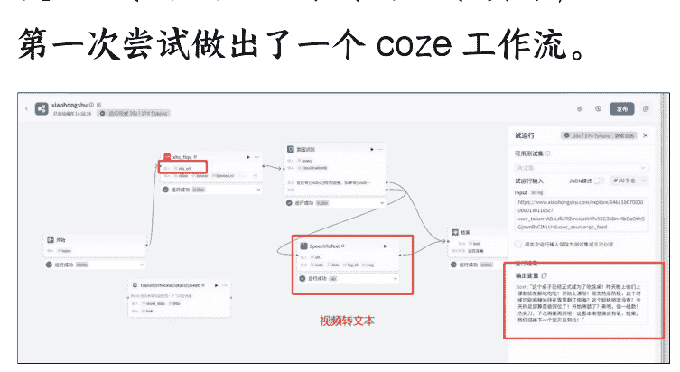

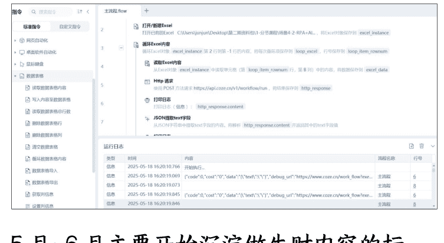

5月~6月主要开始沉淀做生财内容的标准，沉淀了公众号/精华帖评选标准/朋友圈标准。通过建立标准，又在 gpt 上做了精华帖评选的流程。目前我们团队的伙伴也在用我沉淀的标准文档投喂 gpt，来做辅助评选了。

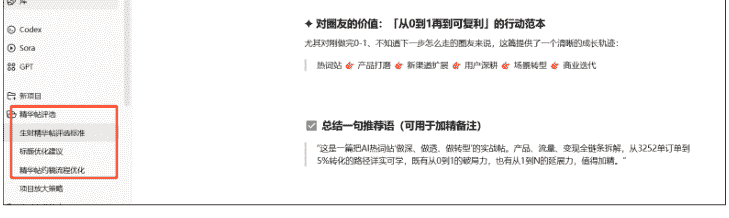

7 月 5 日，我参加了大树组局，miniko 分享的线下 AI 自媒体实操航海，再次做出了飞书多维表格+monica 的自媒体批量文案生成，以及投喂到 monica 做智能体。

7 月 7 日的时候，看了公司社群里分享的 10 分钟编程，尝试用自然语言做了一款内容分发系统，没想到做出来还挺有模有样的。

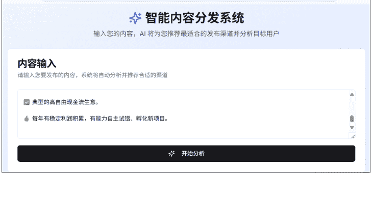

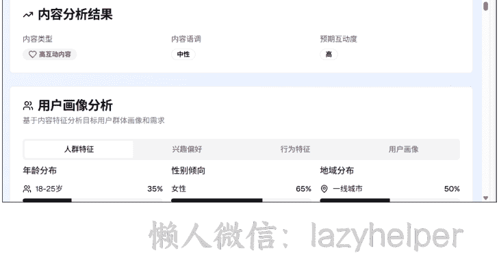

周末的时候我尝试下载 cursor，结果不知道如何下载，一个圈友远程指导我用终端启动 claude code（完全不懂什么意思，让我复制啥就复制啥），但是发现太复杂了就放弃了。

上周也就是 7 月 15 日左右，我在 AI 传术师社群看了太多次分享 claude code，也看了小排老师的内容，第一次尝试注册谷歌账号，注册 cursor，然后注册 claude，在野卡死灰复燃的几天内完成了付费，开启了在 cursor 使用 Claude 的过程。然后公司刚好开放了 API 接口，我开始尝试了抓取评论区有效内容生成用户原声和洞察的内容。

在同事瓜斯，知行，还有 SCAI 实验室 @dhj @大潘 的帮助下完成了第一个页面的生成，给大家展示下结果。

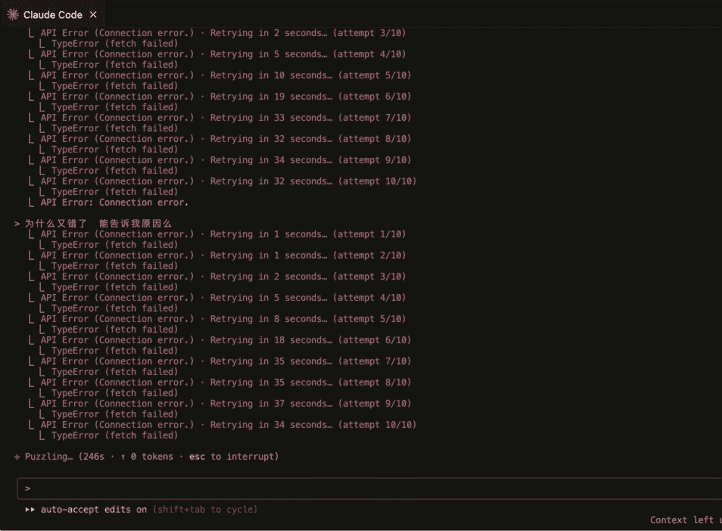

## 生财有术精华帖标签分析报告

基本统计数据
- 分析帖子数:31篇(近30天精华帖)
- 标签使用率:100%(所有精华帖都有标签)
- 独特标签数:38个不同标签
- 平均每篇帖子标签数:约3.2个

### 热门标签TOP10分析

| 排名 | 标签名称 | 帖子数 | 占比 | 平均点赞 | 平均投稿 | 热度指数 |
|:---|:---|:---|:---|:---|:---|:---|
| 1 | 项目实操 | 22篇 | 71.0% | 193.5 | 128.9 | 580.4 |
| 2 | AI | 16篇 | 51.6% | 204.6 | 136.3 | 613.6 |
| 3 | 龙珠悬赏 | 7篇 | 22.6% | 170.7 | 113.8 | 512.1 |
| 4 | 亦仁 | 7篇 | 22.6% | 285.9 | 190.6 | 857.9 |
| 5 | YouTube | 6篇 | 19.4% | 159.4 | 106.3 | 478.2 |
| 6 | 航海好事 | 5篇 | 16.1% | 146.8 | 97.9 | 440.4 |
| 7 | 出海 | 4篇 | 12.9% | 137.3 | 91.5 | 411.8 |

## 再对比看下下一步的进展：

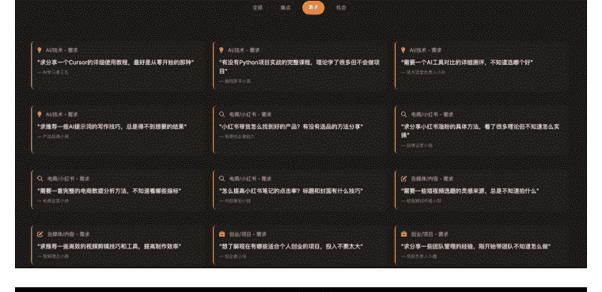

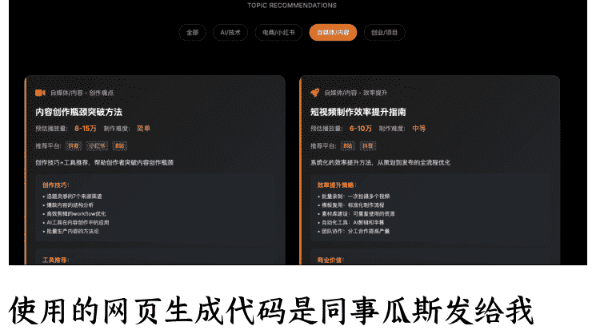

## 使用的网页生成代码是同事瓜斯发给我的：

- 1. 使用Bento Grid 风格的视觉设计，纯黑色底配合亮橙色颜色作为高亮
- 2. 强调超大字体或数字突出核心要点，与小元素的比例形成反差
- 3. 中英文混用, 中文大字体粗体, 英文小字作为点缀
- 4. 简洁的勾线图形化作为数据可视化或者配图元素
- 5. 运用高亮色自身透明度渐变制造科技感, 但是不同高亮色不要互相渐变
- 6. 模仿 apple 官网的动效, 向下滚动鼠标配合动效
- 7. 数据可以引用在线的图表组件, 样式需要跟主题一致
- 8. 使用 Framer Motion (通过 CDN 引入)
- 9. 使用 HTML5、Tailwindcss 3.0+(通过 CDN 引入)和必要的 JavaScript
- 10. 使用专业图标库如 Font Awesome 或 Material Icons(通过 CDN 引入)
- 11. 避免使用 emoji 作为主要图标
- 12. 不要省略内容要点

## 如何破除学 AI 的心力卡点:

- 1. 第一步很容易卡在装梯子和下软件上。我第一次一个人装梯子花了 2 个小时, 尽管有教程, 但真的很繁琐。但是你要相信, 只要跨出这一步, 剩下的每一步都会很简单。
- 2. 心魔是阻碍学 AI 的第一步。最难的不是你不行, 而是你不相信自己行。
- 3. 快速获取正反馈的前提是轻量化入手, 比如用 vo 或者 same.new 先生成一个网页。（需要的话欢迎找我要教程）
- 4. 找到属于你的 AI 学习搭子，每多一个坚持的动力多一份，在这个过程中，我打开过不下 10 个聊天窗口，分享学 AI 编程的卡点，请教问题。
- 5. 找到你的榜样。榜样很重要，再多说一句话的话，在身边成长起来的榜样很重要，我身边有三个很棒的榜样。第一个是亦仁，他大概演示过 4.5 次用 gpt 做策略，以及用 claude code 呈现一个功能的页面，当你亲眼看到一个功能用“说人话”的方式就能解决的时候，带给你的冲击是巨大的。当老板知道 AI 的边界时，你能做的就是快速学习，不然这个公司的隐藏 KPI 就是 AI 渗透率。

第二个是林悦己，从去年传术师见面会我见到悦己，再到她来 SCAI，三个月期间几乎没怎么约过饭，因为她真的很专注，一直在 debug，写内容，不停优化。直到有一天我去找她约饭，听她聊完了三个月的编程历程。我突然意识到，是不是我也可以试试。如果就真的有一个不懂代码的女孩子做到了，那么我是不是也能做到。

当然我不是一定要做到，但是我真的好想知道“我可以！”

第三个是大树，他从 0 开始做 AI 访谈，在他拍摄的人物里，我看到好几个像我一样的普通人，没资源没技术，但是大家刚好抓住AI的红利，勇敢地**下场把手弄脏**，不停地试，再不停失败，继续不停优化，然后拿到了正反馈。

他分享采访gary的那篇文章里提到：

每次聊起AI，我们都特别亢奋。我常常觉得，这是我们这一代人，有生之年遇到的最大一次机会。

它的变化太快了，快到所有的旧秩序都在被重构。曾经那些“必须名校、必须资源、必须大厂背书”的路径，正在被AI一点点打碎。

过去要“打怪升级”十年才能拿到的结果，现在可能几个月就能触到。我们从0开始，只是跑得快一点，抓得准一点，就能把结果干出来。真的不是我们多厉害，而是时代给了普通人一次弯道超车的可
能性。

所以当你看到身边这么多人从0到1的时候，你内心只会觉得：我只要做了我肯定行啊!

## 如何在AI的过程中顺便Build in Public?

公众号懒人搜索，懒人专属群分享

Build in public 是从花生这里得到的启发。我在做 AI 社群的时候，就持续把一些社群的优质信息分享到朋友圈和即刻。它其实核心要倡导的是，如果你想要做一个产品，你可以把你做这个产品的整个过程向公众开放展示，让大众来关注甚至参与到你做产品的过程当中。这样的话，由于过程透明，其实在做的过程当中就是在逐渐获取关注，以及和用户建立信任，有助于将来这个产品真正面世的时候，可以快速获得第一批的种子用户。

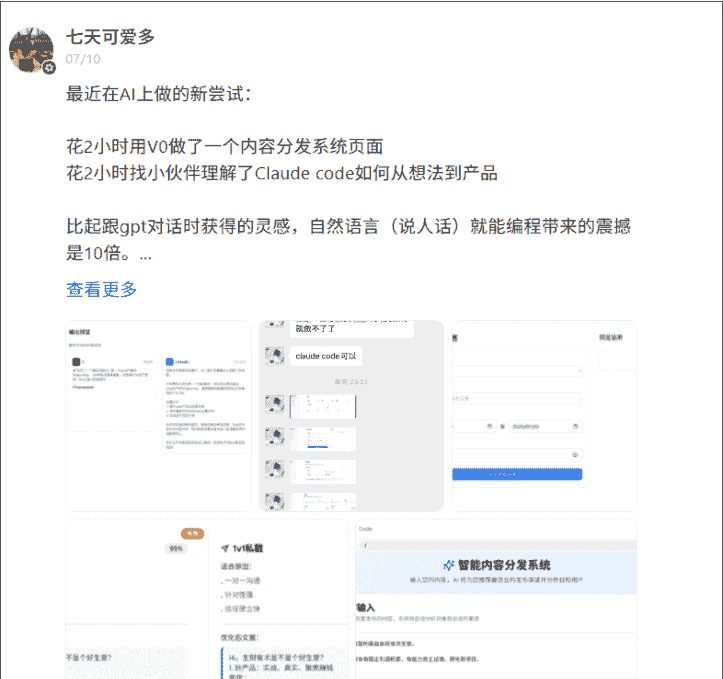

懒人微信：lazyhelper

七天可爱多
6天前
学习使用claude code第一天
花了4小时做出生财评论分析报告
直接把每月20刀的日额度用完了
果然比会使用GPT的快乐和兴奋感增加10倍不止！

记得小排老师 🦙 刘小排 在一次采访中提到：用AI最大的卡点是你不相信自己可以做到。

一旦突破心理卡点，剩下的一切都可以“解决”！

收起

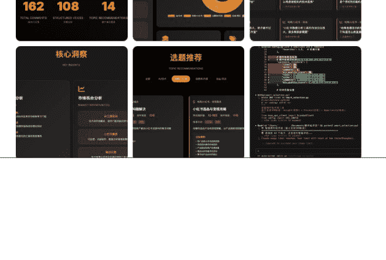

七天可爱多
03/02
从0到1做AI+IP成长社群的价值还在放大，不仅有135人加入了社群，50人成为了年度付费用户，我还因此把自己的sop总结分享给了团队，成了3月航海的教练之一 （ps搭档涛哥hhh）

自己也属于养成系IP的真实案例了。

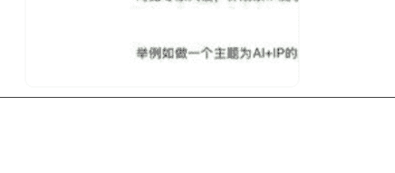

七大可爱多
02/14
做了AI+IP成长社群后，我如何输出倒逼输入？

1. 我做了个素材群，每天把我在生财，在即刻，在其他知识星球看到的有效信息分享给自己，然后固定时间整理。

2. 现在在生财看风向标和精华帖，不再只是浏览，而是筛选我觉得能分享给别人的有价值信息。对内容的判断力提升了。

我觉得 build in public 有几个点心得：

- 1. 要和大家分享经验：让大家感受到我自己再分享自己的成长经验，不仅自己在做业务，也顺手复刻自己的业务心得给大家，邀请大家成为我的“云股东”。
- 2. 分享自己的业务进展，让围观的人看到“我被认可”“我做成事”的过程，撬动一部分观望的人，加入我的社群，或者开始关注我的内容，他们会意识到“七天确实在认真研究AI”。
- 3. Build in Public 的核心不是展示和炫耀自己，而是保持开放，遇见有可能的同路人。
- 4. 对在过程中帮助过你的人表达感谢，其实谁帮助了你，也侧面验证了对方对你的认可。

我写下这些，不是为了告诉你我多努力，而是想告诉你：一个完全不懂技术的人，只要愿意试，一样可以把 AI 用起来、把产品做出来、把自己的可能性打开。

因为我不是“准备好了才出发”，我是“出发了才准备好”。

下一个从 0 做到 1 的，也许就是你。

你不用一次性掌握所有 AI 技能，你只需要迈出“第一步”。

下一步要不要试试？比如做出你人生第一个网页，或者生成你第一个 AI 小工具？如果你也想试试，也可以在评论区留言。

我不是专家，但我知道从“什么都不懂”到“做出第一个东西”的那条路怎么走。

最后，安利小懒的付费群：

懒人专属群

📚懒人专属群持续更新中，已持续运营6年，整理超3000份各类精选付费文章&年费社群干货，全部开放下载。

本资料为付费群内部分享，仅供真实有需要的朋友查阅 🔒

懒人专属群更新记录：
https://lazy2025.top/#/blog/record2

懒人专属群更新记录（需梯子，备用）：
https://lazybook.fun/#/blog/record2

懒人微信：lazyhelper