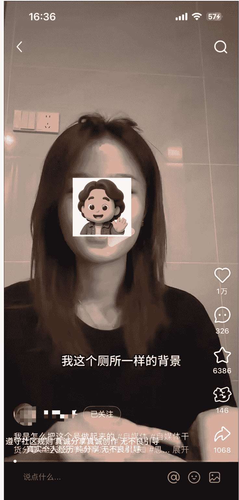
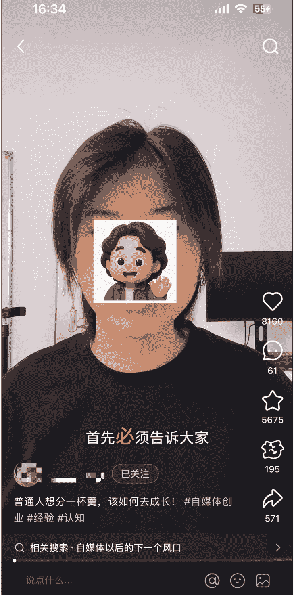

# 虚拟资料4.0：我从卖资料到卖人设，单店单月卖了20万+的实战总结

250725  生财精华

公众号懒人搜索，懒人专属群独享

懒人微信：lazyhelper

（全文7000字左右，主要围绕我的虚拟资料4.0阶段关于人设部分的复盘）

## 一、前言

各位生财的圈友们好，我是在娱乐圈练习七年半的申铭。距离上一篇帖子分享已经过去4个月了，今天我又来分享了。原本以为那一篇已经是关于虚拟资料的最后一次复盘了，毕竟这是副业，而我主业这边也没闲着😄。但是没想到，做了一轮系统调整后，项目居然又有了新一轮爆发，于是我决定还是把这阶段性的优化和变化完整梳理出来，做一次版本级的复盘吧。

我们这轮迭代从3月底开始落地，期间我们小团队内部磨了差不多一周的方案，然后才去正式投入打磨执行。中间虽然经历了不少波折，但最终效果确实远超预期。特别是暑期暑假即将开始的时候，我们调整的新模式的账号就冲上来了，目前单个店铺单月销量稳定在20万+。

我们期间一共调整了 3 个账号，目前这个是我们手上 3 个账号中唯一一个能跑出相对稳定结果的。其余两个虽然也有增长，但还没有形成稳定，我们还在不断试错打磨中。

今天这条复盘的帖子主要是讲我这一轮在人设上的策略和复盘，和前几篇相比，我这次写得会相对轻一些，重点不是教如何从 0 起号、如何从 0 开始做虚拟资料，是想讲怎么通过人设构建，来突破虚拟资料赛道的增长瓶颈（我们目前阶段遇到的最大问题）。

前言和项目实操无关，如果时间比较紧张，可以直接略过看后面。这篇内容也是关于小红书虚拟资料（我把它叫学习资料，后面为了迭代我们内部把它升级叫学习资料，或者是实体资料）的分享，是继前三篇分享《5 个月赚了 20w，小红书学习资料实战分享-知识星球》、《虚拟资料副业遇到瓶颈？不如试试实体资料（实操版）》、《小红书学习资料项目：AI 原创学习资料从0到1全流程》帖子的续集，建议按照顺序系列看，效果会更好。

各位圈友们好，我是申铭，首次分享经验。我会尽可能详尽地分享每一步操作，如果大家有任何建议，欢迎在评论区提出。我正式加入生财是在今年4月份。不过，在翻看 我之前学习的文档时，我发现自己早在21年还是22年就已经是生财的编外迷弟了，当时可是看了不少生财的内容。今年有幸找到@郑韩 韩哥，是他拉我进了这个圈子，真心感谢韩哥!

这个项目从2023年9月开始筹备，10月正式上线了第一件产品链接。截至2024年元宵节前后，短短5个月的时间里，我实现了大约20万的收益，30天最高收益更是达到了4.9万。由于这个项目主要是教育学习类的资料，所以最大的资金成本就是平台收取的5%扣点(万元内免佣)。我刚刚查看了后台，发现针对我的这个类目，扣点现在已经调整到了2%。

字数较多，可转入飞书观看：https://a033a8trbo.feishu.cn/docx/OOnEd6RhmoW09ExO...

懒人微信：lazyhelper

## 【虚拟资料副业遇到瓶颈？不如试试实体资料（实操版）】

这是第二篇

哈喽，各位圈友们好，我是曾在娱乐圈练习七年半的申铭，这是我在生财的第二篇长文经验。这篇内容其实是指着我上一篇分享的项目去续写的（5个月赚了20w，小红书学习资料实战分享），是我做了将近一年半的副业项目。这也我们在进行产品迭代、增加品类和优化后端成交之后的一次项目复盘总结。

为了让圈友看完能够有所收获，我把我们下半年增加新品类的0-1实操过程，以及我们在进行迭代升级1-10做增量的过程，给大家做一个完整分享。也欢迎大家多提建议，或者分享可以深度挖掘的赛道方向。

这篇内容是因为在逛星球的时候，看到一个圈友评论问：“小红书虚拟资料真的能做到利润5万一个月吗？”，才来写的。看到的时候就准备写了，但是过了周五晚上12点还没写完，抱歉没能第一时间分享给圈友。

全文约1.4万字，看完大约需要45分钟，完整阅读可戳飞书：https://a033a8trbo.feishu.cn/

## 《小红书学习资料项目：AI原创学习资料从0到1全流程》

这是第三篇

各位圈友们好呀，我是在娱乐圈练习七年半的申铭。

今天来给大家分享一下，“小红书虚拟资料升级版的实体资料”的第三篇实操内容。我利用AI创作了一本约20万字的原创学习资料，耗时将近一个月，从确定选题到内容生成，再到最后的排版设计，全程由AI主理完成，我只负责引导和整理。

这篇帖子也是5个月赚了20w，小红书学习资料实战分享、【虚拟资料副业遇到瓶颈？不如试... 两篇同项目帖子续集。也是在产品销售出了第一单后，来给大家做的整个复盘。

前两篇帖子是0-1、1-1.5的过程，这篇算是我在这个项目上做1.5-10的其中一小步。

全文约9000字，预估阅读时间25分钟左右，完整阅读可戳飞书：https://a033a8trbo.feishu.cn/docx/TIUed9jyVoudPPxp...

星主说长得好看的都喜欢评论

在开始讲具体策略前，我想先交代一下我们这几个月遇到的几个关键问题，也就是说我们为什么必须转向做费劲和高成本的人设：

- 1、流量机制变了，老打法失效

懒人微信：lazyhelper

如果你有看我之前帖子的打法拆解，你会知道我们最初的发笔记策略非常直接：干货图 + 干货文字、干货实拍图。但这招在现在的小红书环境里，有点不太好使了。

因为平台本身的机制变了。以前的爆款能吃半年以上，现在 3 个月前、半年前的爆款基本上不怎么给流量了，只能搓新的可能爆的笔记；以前靠搜索带货能走不少，现在也能走，但是搜索词排名却被压得死死的，真的绝了。用老一套内容模板去发，有数据但是转化真的很差劲。

- 2、低价同行 + 盗版增加，现在乱七八糟

原本以为我们要遇到的，是复购率低、产品生命周期短的问题，没想到最大挑战却是来自同行的，盗版滋生（小红书、闲鱼、淘宝、拼多多全被盗版上架）、同行乱价（每单价格不到 10 块），把市场价格弄得乱七八糟，产品质量也很差。

我们这边正常一级引流产品，客单在 50~120 元左右，结果一堆同行直接几块钱挂到闲鱼、小红书、淘宝。这些账号不打人设、也不做品牌，就是抄资料、疯狂撒低价。我资料项目干了三年，真的是见惯了各种骚操作：抄选题的、抄标题的、复制我们赠品结构的、连我们资料前言都能抄得一字不落。

但也是因为这样，我越发意识到：仅靠资料本身，已经没有长期的壁垒了。只有做出人设 IP，才有定价权、复购率、有产品的护城河，和我现在主业在做的品牌逻辑一样，品牌定价就是独家的，而且生命周期更长。

### 3、新号起店难，稳定销量周期变长

下面这张照片是我们最近两个月起的新号之一，近期算勉强稳定住销量了，但是完全没有在一个月左右的时间去快速破万，且稳定每天销量的状态，所以也不得不加入人设去做起新号的操作。

3 月底开始，我们是拿了 3 个不同赛道的老账号，做了类似的人设优化尝试。但效果吧，有点分化，在最后我会具体讲一下。所以我们意识到过去总结的那套简单粗暴的爆款机制的打法，能用但是不能持续用。所以必须转向更精细、更具人格粘性的打法，人设打法也是我们目前阶段必须做的了。

## 二、人设 IP 才是长期主义（不是选择题，是生存题）

说实话，我刚开始做虚拟资料的时候，想的还是搞钱就行，找爆款、发笔记、压选题，走的是最典型的流量思维。

但当跑进一个成熟品类、卷到一定阶段，会发现：流量不是问题本身，信任才是。

尤其是现在的小红书，slogan 从你的生活指南变成你的生活兴趣社区，之前的那种密密麻麻看着信息密度很高的笔记，后续不如露脸、带人的转化效果好。内容发的也得越像一个真实可信的人发的，用户愿意点，平台也愿意给曝光。

所以，我们干脆拿几个账号尝试彻底转型，用人设 IP 来绑定资料账号，把账号从卖资料的变成有专业、有温度、有辨识度的人。

虽然现在资料项目不露脸也能做，那我为啥要搞得这么重？这么累？因为，不做人设可以起量，但绝对跑不长、也很难起高价。

下面我分享一下我们这轮转向人设的三个核心目标：

- 1、信任背书：用户买的不是资料，是懂他们的人

我们很清楚，我们目前产品的大部分用户买资料并不是为了立马就用。他们真正买的是我相信你做的这套资料靠谱、你应该知道我现在最需要为什么。我们在做 人设的时候，是为了把用户买资料的这个动作，转化成找个靠谱的老师带带我这个下意识心理（和带货直播间的话术逻辑一样）。

公众号懒人搜索，懒人专属群分享

就像现在大家都在卖 K12 资料，但如果你直接卖一份高中语文押题合集，并且你告诉他这是张雪峰团队出的精编版，转化率是完全不一样的。

- 2、差异化定位：资料可以复制，但人无法复制

盗版最多的永远是内容，最难被模仿的永远是你是谁。最近在生财看帖子，发现很多圈友，爆款做某些考证、考验培训的圈友拿到了非常好的结果。说明大家都来做了，把这些机构和有足够多人的团队称为大厂，他们的人力、物力、流量能力会比我们这种个人或者小微团队要厉害很多，而且他们的产品要比我们更优质，一级产品引流品的价格更低（后端二次成交利润更高），所以也是不得不做差异化定位。

目前，很多同行做人设只会挂个昵称、写点自我介绍，甚至连头像都是 ai 生的。别看这些人设装模作样，其实一点辨识度都没有，用户看了不痛不痒，根本记不住。

而我们做的是“真人人设”，加个引号：

- 露脸；
- 讲故事；
- 内容全套配合人设定位；
- 还有具体的风格化语气和个人观点。

我们打造的人设不是那种很假、很自恋的IP，而是走当下小红书最流行的活人感人设，就很像你身边的同事、老师、朋友一样可信，很真实，甚至让女生直接素颜录口播。如下图，下图不是我们账号，是参考它的“活人感”。

### 3、情感链接与溢价：人设决定了能卖多少次、卖多贵

我们在做虚拟资料时，本质上还是在做知识服务产品。能不能持续复购、后端能不能卖更高价，全看内容有没有跟用户产生情感链接。

没有情感链接，卖一次就结束；
有人设加成，哪怕是小资料，都能复购 3 次以上。

而且我们做过非常明确的对比测试：在其他条件一致的情况下，有人设露脸和人格表达的账号，用户对于高客单价的转化率会更高和直接，尤其是我们定价在 89、99、129 这种阶段，用户几乎没有议价动作。所以人设溢价的价值感觉还挺大的。

做人设后，我们还做了两个配套强化动作：

一是内容上，坚持一个账号一类人设一垂产品，不混赛道。

比如我们有做考公的号，那整个账号从文案、头像到资料全围绕公务员教培老师去构建；

做高考艺考的号，就走“学姐+资料整合人”的设定，穿搭也偏艺术生的风格（因为本人艺术生，相对来说比较了解艺术生想要什么）；

甚至我们也会去做账号分拆，也要做到视觉+内容+角色一致。比如说，同样考公的，我们可以把公文写作、行测题分开两个账号去弄。

虽然多号确实更累，但因为更垂直最终的结果是：账号转化率提升明显，且用户单次停留时间更久，互动意愿更强。

二是内容形式上，转向视频为主打，图文主配合。

视频比图文更具人格感，这不是建议，是结论。因为小红书视频内容的流量池明显大于图文笔记（上下滑给视频曝光开了大口子），且平台在权重倾斜上越来越偏向真人表达类内容。所以我们在做人设后，直接把主要内容形态从图文换成了短视频（口播+故事+干货）。

## 三、人设定位：找专属标签

做人设的时候很容易做飘，就是会很空洞，而且后续的内容还很容易会跟人设无关。所以我们在做虚拟资料账号的人设的时候完全按照“资料属性+目标用户需求”这样的逻辑去强绑定的，给大家我们具体做人设的步骤。

第一步，分析我们目标用户画像，到底是谁在买我的资料？

- 年龄/职业：高中生、大学生、艺术生、失业人员；
- 核心需求：高中生想找到精准靠谱考点合集（包括文言文背诵、历年高考题型）、大学生考教师资格证不懂知识点、艺术生艺考文艺常识找不到最新版、失业人员想考公但没方向；
- 痛点：找不到渠道、懒、信息差、资料太杂不会用。

懒人微信：lazyhelper

基于第一步的方法，假设我们的目标人群是想要考公的大学生，或者大学刚毕业几年的想要考公的人，他们的需求痛点就是考公没方向，不知道怎么具体学习、复习，而且还可能在公考的某个部分容易丢分，需要进行针对性训练。但基于前面这些痛点需求，他不太想花费太多去结构学习，想自己私下省钱学习。

第二步，挖掘我们自己优势点，我们比同行强在哪儿？（基于前面用户画像的人设）

- 经验：服务某考公机构5年+、公考首考上岸某某满分、前公务员辞职下海；
- 特长：擅长公文写作、擅长面试、能快速提取新闻时政要点且运用；
- 价值观：拒绝割韭菜，只做有用的资料。

这一步不一定是真人设，也就是你的经验背景可以是杜撰的，但是如果是杜撰的人设，就尽量不要让用户太能考察到，比如说你说你是考公满分或者是具体哪年上岸哪个考公岗位，这个很容易查到，人设就很容易崩塌。但是如果说你是在某某考公培训机构呆了多少年，这个很难去查，因为他们这种大型的机构员工太多了，他们自己人都认不全。但是这个对于后续内容的要求就是，尽量不要在内容里提及太多关于机构内部的事儿，可以只当作是一个身份 title 去说。而且，我们本身选品都是非常垂直的，比如考公的项目就专注公文、精读解读和面试，其他一律不管。那我们人设上也尽可能的和我们垂直的资料做对应。做虚拟资料/知识付费，专才比全才转化率更高，站稳某片小市场就好了，而且还能解决人设同质化的问题。

#### 第三步，确定人设关键词（3-5个核心标签）。

- 举个❤：前 xx 考公一线老师、专注公文写作教学、迅速提分 xx

如上面的标签，可以在小红书简介里写上，如果做视频，也可以在口播文案里去夹杂着去说，比如说“我能让我90%的学生，公文写作提分10分以上，就是因为这套公式”，通过口播内容，给用户建立人设认知，而且用户成为粉丝之后会反复看你视频，那他对你的印象标签就会更明显。

## 四、怎么把人设做得更落地：视频上

很多人理解做人设，停留在起个名字、包装封面的阶段，实际操作时根本撑不起完整内容。这也是现在大部分在卖虚拟资料的账号的问题，我们踩过这个坑。

我们人设搭建的第一阶段，只是在内容和视觉层面做了调整，纯口播的效率也比较高。这两点调整，其实已经实现了比较明显的转化率提升。

### 1、内容上

我们在视频内容上，主攻三个方向：

- a. 干货型：爆款选题+“怎么看/怎么做”的方法口播

干货，即是去寻找我们之前的内容，看哪些是爆款，以及同行最近半年的内容有哪些是爆款，然后基于这个爆款的选题去添加“怎么看”的提问。这类干货内容，能在侧面辅助我们人设专业的。举个例子，我们有个考公的号最近这几个月发“卤鹅哥”“labubu”“新闻联播”相关的内容很火，拿“卤鹅哥”来说，后面加上“怎么做/怎么看”就是：卤鹅哥怎么看？因为我们是考公账号，内容一定是围绕考公的，那可以延展的选题是“重庆卤鹅哥走红靠什么”“卤鹅哥给荣昌除了带来流量还有什么”。

这类这种选题方法真的天然适合做成短视频，特别是对公考人提供一些面试的参考。然后在口播里不能只输出结果，而是要把这个思考的结构给大家，比如说要告诉大家这类题型要按照 a+b+c 的逻辑回答，然后中间演示，最后部分引流我们卖的资料，说最新的时政问题、或者是其他的都在这份资料里，全部有前某考公机构的一线老师整理。

总结一个结构：
  - 提观点：这是个典型的 X 类问题
  - 拆逻辑：答题要用 A-B-C 三段法
  - 举例子：套入时政背景（比如说卤鹅哥时间来回答演示）
  - 引产品：详细资料已整理在文档里（链接/资料卡引流）

- b. 故事型：用“我经历过”的口吻讲干货

很多知识类视频用户不爱看，是因为太干了，不能太干。在传术师群，5月下旬的时候，东山老师分享了一条视频，里面讲的很好，用户东山老师总结的就是“公域讲实操，讲干货，就是做公益，过嘴瘾，赚不到钱”。东山老师随后补充的“人，需要的不是干货，而是被理解”、“人，需要的不是方法，而是“希望””，这个内容一直在影响着我。所以后续我基本上一直应用在短视频上，就比如说这个部分说的故事型也是，这类资料账号的人设内容一旦用过来人的语气讲同样的内容，用户是会立刻有共鸣的。

举例：“我第一次考公失败的3个低级错误，你们别再踩坑了”“上岸前我每天复习12小时，但真正提分的，只有这3件事”

你会发现，这其实讲的还是“考公方法论”，但因为有“人+情绪+经历”（也就是故事），所以会更容易引发评论和点赞。而且你的人设，也会变得更有人味，就不再是个卖资料的，而是个走过弯路、现在愿意帮人的前辈。侧面的辅助了人设。

- c. 共创型：从评论找选题

我们发现，只要某条视频爆了，评论区一定有几十条甚至上百条真实提问和互动，这就是我们目前最大的选题来源。

做法很简单：
  - 找到点赞数靠前的评论（自己或者同行的笔记的评论都行）；
  - 提取用户的核心问题；
  - 用你问我答+人设口吻来做短视频内容。

这类视频不仅容易起量，而且互动率极高，用户也会觉得，你不是在卖，而是在陪着她一起成长、一起变好。

### 2、视觉上

小红书内容的视觉体系无非笔记封面、头像、视频里人物服饰和场景，我的建议是全改成所在赛道的风格。

举个例子，假设做医考资料相关，封面IP形象，还有视频的IP形象，我建议是穿白大褂，或者是网上特别火的精神病服，和他的具体职业相关，目标用户也会更信任。如果做考公，可以是穿体制内那种厅局风的衣服，通过这种穿搭形象去传递出知识点，大家会下意识觉得正确，愿意转化。头像也可以同步调整。

如果有条件的肯定建议是在那个场景去讲这个内容，或者是类似的场景，效果会更好。

是不是一定要这样？也不一定，其实什么风格视觉都能转化，只是相对贴合的风格转化率会更高一些。但是这个视觉风格主要还是根据你的人设来的，如果你的人设不是这个角色，那你换这套风格的服饰就会很奇怪。

## 五、怎么把人设做得更落地：产品上

前面是在内容呈现上去融合了人设，这一部分我讲一下我们怎么把人设融合到了产品上面。很多人卖虚拟资料，卖的是干货，但我们真正卖的是带人的解决方案。真实、有故事、讲方法、有情绪的人，这个是我们思考了很久之后，认为的它才是用户买单的真正理由。

### 1、资料设计本身就要体现人设

用户拿到资料的第一眼、第一句话，必须就能感受到“这是谁做的”、“他值不值得信任”。

我们现在每一套资料，从第一页开始，就在做人设的输入和信任建立。

- a. 前言 / 附录：400 字人设故事+使用指南

在资料第一页加入一段 400-500 字的人设故事，我们标准化内容包含两个部分：

我为什么做这份资料

比如：

“这套资料本来是我给我弟整理的，现在拿出来分享”

“之前我踩了很多坑，不想让你也浪费时间”

懒人微信：lazyhelper

19 / 24

> "我教过 200 多个考公学生，这些是他们最常错的知识点汇总"

这类内容可以在用户打开第一页就产生好感，他觉得你是为他好，而不是为了卖。

## 怎么用这份资料

不只是目录，而是一种教学说明书：教他先看哪一章，怎么用，搭配哪些方法使用会更高效。这其实在强化一个潜台词：我在陪你一起学、我没有功利心，而不只是我给你扔一堆文件自己看。

这个内容放在第一页，因为是教使用方法的，所以大部分人都会认真看完。他们在看前言的内容的时候，后续再看其他的都会戴有色眼镜看，就算材料不好，也能理解了。

#### b. 加赠品 = 提供“人格化的加餐”，而不是“无感文件”

之前我们也有赠品，但是无名无义做赠品，目标用户感知不到赠品的价值。我们现在把赠品都变成了“人设周边”，随这份资料赠送的人设周边，也是增加这份资料的分量。

比如：

- "我现在还在用的 XX 复盘模版"（体现我还在做/实操有用）
- "我整理的 1000 条爆文标题清单"（体现专业）
- "人民时评 7 月最新精读分析"（体现实时更新、专业积累）

用户收到这些，就不会觉得是附赠，而会觉得是一个靠谱前辈的补充。

### 2、服务强化靠谱可信人设

我们现在其实做的很累，正常来说做虚拟资料是很轻松的事儿。但是我们为了增加我们的转化，所有一级产品都提供了服务，提升服务的转化率和复购率比没有提供的时候确实高很多，但具体多少百分点没有具体统计过。以下是我总结我们目前提供的和服务相关的分类：

售后保障：推出“资料不满意可退款”，退款不退货，用户需要在私域微信进行退款，在退款前需要把线上签收做了，且需要给我们提供五星好评+评论，因为我们是主动提供好评的图文，目前大部分申请退款都会评论带图文。提供免费的一对一答疑服务，基本上有啥问题都会进行回答，现在是有两个人是专门拿着手机等人来消息去回复的，因为她们俩也都不是对每个行业都懂，所以基本上是会借助AI，然后他们根据收集的内容，做偏中性的回答，但是我们重点业务跑的比较好的，肯定是专业回答，那边后端转化比较好，所以必须要专业一些的回答。这个售后保障虽然苦，但是传递的却是很靠谱的人设，现在虚拟资料/知识付费市场特别缺这种人设。

用户共创：部分产品（比如说考公、高考的内容）具有时效性，所以需要不定期更新，每次也都会和私域的用户收集“你觉得下一期资料需要加什么内容”或“你还想要什么内容”，这样的互动性导致群聊和单点私聊的粘性很高，也给后端的二级产品转化做了铺垫。

## 六、结语

现在是下午7点多，我写到结语又从前面读了一遍，前面是昨天夜里写的，感觉这篇帖子其实并不像是在教大家具体怎么做，而更像是我自己在叨叨复盘，为什么我为啥会这样调整，为什么从卖资料走向卖人设，开始慢慢要去打磨IP了。

所以如果你是第一次看到我的内容，建议你先去看一下我前面三篇帖子，然后再来看这部分的内容会更容易理解。否则单独看人设这篇，可能会觉得为什么我上来就开始定位标签、做结构、配图配口播，节奏就跳得太快了。

这些选择，其实不是拍脑袋拍出来的，是因为我这三年一直在做虚拟资料的副业，做多了就会发现一个事儿：

流量会随着平台的规则调整而消失，但信任不会。

你今天蹭的是什么趋势、爆的是什么选题，明天可能就不灵了。账号短期靠爆款，但长期要做得稳定，真的必须要靠人设支撑（普通电商如果想做长期生意则需要靠品牌）。不然你会越做越累，越成交越焦虑。更别说我们这种副业小团队，想去和那些团队十几人、几十人、会搞投放搞矩阵的大厂去抢人，完全不现实。唯一能打穿的，就是人设+内容+产品，把这三个做绑定。

刚看的时候有个小事情没有补充，我在这里顺便补充一点我们团队现在在做人物 IP 的一些实际操作。我们目前已经在跑的三个号里，有一个是找自己人来录口播的，另外两个是找演员来录的，因为青岛的地理优势原因和我之前也一直在做影视剧的原因，这块的资源比较丰富，找的演员基本上 800-1000 块钱一天，多大年龄的都有，为了能拿到最佳状态，基本上半天只能出 25 条左右。

但实操下来，也踩了不少坑。首先，专业演员虽然镜头感强，但表演痕迹太重了，真的绝了，容易显得假，念词不自然，很像 AI，观众没代入感；其次，因为他们是演员，会到处接活儿，所以还可能在各种信息流广告、短剧看到他们，如果真的被目标用户看到，可能会影响这个号的信任度和转化。所以，我也是今天才复盘一下，我们另外两个号数据有增长但是不明显的原因。

后续关于露脸 IP，我们还是打算用自己人，毕竟真实，而且不会丢失。但是因为账号很多，没办法给每个号都做人设，这又让我们陷入另一个麻烦了。等等我们调整吧，调整之后，有新进展，可以随时复盘给大家说。

## 最后，安利小懒的付费群：

### 懒人专属群

懒人专属群持续更新中，已持续运营 6 年，整理超 3000 份各类精选付费文章 & 年费社群干货，全部开放下载。

本资料为付费群内部分享，仅供真实有需要的朋友查阅

### 懒人专属群更新记录：

https://lazy2025.top/#/blog/record2

### 懒人专属群更新记录（需梯子，备用）：

https://lazybook.fun/#/blog/record2