公众号懒人搜索, 懒人专属群分享

## 【扫盲篇】Discord 科普: 海外社群“神器”与赚钱机会分享

250728 生财精华

公众号懒人搜索, 懒人专属群独享
懒人微信: lazyhelper

hello, 大家好，我是 SCAI 实验室的张耐心。在 SCAI 实验室办公的过程中，发现海外很多人都在用 Discord 进行社区运营和赚钱，但是因为官方的一些限制，很多商业化功能，并没有对中国身份开放，于是想到了可以利用第三方支付平台+Discord 机器人的方式，间接实现收款，并搭建了一个可以收款的 Discord 聊天机器人。考虑到目前生财上关于 Discord 的内容和帖子还不是很多，希望这篇科普贴，能够对大家有所帮助和启发。

我的 AI 二次元男友体验链接(需要魔法上网在手机端中打开):
https://discord.gg/4vyNTJgcrs

## 1、为什么介绍 Discord?

Discord 原来是一个游戏社交软件，适合边玩游戏边进行语音聊天。
月活 2.2 亿，大量的游戏、二次元、AI 兴趣人群在上面。
懒人微信: lazyhelper

### 非常适合做海外社群运营，承接公域流量到私域。
Discord=聊天+语音+机器人
简化版：海外加强版微信

## 2、Discord 机器人的使用场景
- 1、开发一些 AI 机器人/工具到 Discord 上去卖
- 2、网站/社媒搞流量，利用 Discord 进行海外社群自动化运营，承接海外流量。
例如：
- 1）利用 Discord 机器人，自动翻译不同国家的语言，消除语言门槛和障碍。
- 2）针对用户高频会提到的问题，用机器人进行自动解答，省去人工回复的时间和成本。
- 3）活动运营，搭建海外生财-web航海服务器，重要功能按照频道进行分类
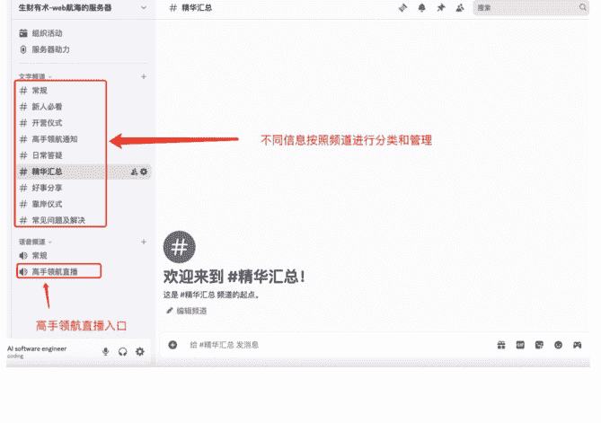

## 3、Discord 基本知识
### 3.1 背景知识
#### 1）Discord 是什么？
**诞生背景**
Discord 最早于 2015 年上线，最初定位为“为玩家而生的免费语音/文字聊天室”。2022 年 Midjourney 把 AI 绘图首发在 Discord，让大量 AI 爱好者涌入；此后 Web3、二次元、开发者、教育等用户也开始入驻其中。
Discord 最出色的体验就是在服务器中，可以创建多个频道，每个频道都有单独的功能和特点，从而方便用户在不同的频道中讨论不同的主题和内容，对内容进行更好的分类。一群二次元爱好者，可以在火影忍者的频道中讨论火影，也可以在海贼王频道中讨论海贼。
国内的 QQ 频道功能，就是参考和借鉴了 Discord 的产品特性。

**最新规模**
- 月活跃用户（MAU）≈ 2 亿
- 活跃服务器：每周 > 2100 万个

#### 2）Discord 的特色
Discord 给我最大的感觉就是灵活高效，你能想到的很多功能，它都帮你做好了，例如：

| 特色 | 对比国内工具 | 价值 |
| :--- | :--- | :--- |
| 分区服务器 + 频道设计 | 可为不同话题、权限、语言开独立频道；频道内支持置顶等功能 | 比 QQ/微信群分组更细、更易沉淀知识 |
| 实时语音/视频 | 延迟低、可嵌入屏幕共享、音乐、协同白板 | 类似飞书会议，但无需退出聊天窗口 |
| Bot 应用生态 | 涵盖上万款第三方机器人，能实现自动翻译、表情包、AI 聊天、上链验证、自动角色分配等功能 | 微信/QQ 机器人功能受限且需付费 |
| 跨端一致 | 手机、电脑端体验几乎一致 | 国内很多软件，桌面版和移动端功能不一致 |
| 可嵌入 App 直接使用 | 2024 年推出 Embedded App SDK，允许在频道里直接跑小游戏、白板、AI Demo 类似小程序，生态开放 ，分润按照 90/10 分成（创作者 90%） |  |

小结：Discord 集成了实时语音/视频+机器人自动回复+小程序+群聊分组功能，还能免费使用。

#### 3.3 Discord 为什么值得出海的圈友去了解?
- **流量承接**：Discord 可以从 TikTok、Twitter(X)、web 网站、youtube 等平台进行导流，沉淀到 Discord 私域，可以提高用户粘性，增加复购，提高反馈效率。
- **竞品 & 用户洞察**：直接潜伏在同行服务器里观察 FAQ、用户吐槽，甚至可以直接捞人，获取目标用户，比去论坛更加高效。
- **全球性社群运营**：官方提供 29 种 UI 语言，Bot 可实时翻译；一个服务器即可覆盖多语地区。
- **品牌资产沉淀**：频道长期可检索、可链接，FAQ/资源库天然 SEO；还可嵌入自家网页 iframe。

### 3.2 Discord 基本概念
- **服务器**：类似于学校中的一个社团。
- **频道**：类似于社团下不同的子部门。可以设置不同频道的功能、用户权限，进行更加灵活的管理。比如一般会有服务器公约、欢迎频道、闲聊频道、活动频道等。管理员有很大的权限，可以设置频道中谁禁言、把谁踢出去。

### 3.3 Discord 界面组成
Discord 有网页端、手机端和电脑端。电脑端主要分为四个部分：
- 最左侧的服务器栏，显示你加入了哪些服务器
- 中间的频道栏，显示你加入的服务器有哪些频道
- 最右侧的内容栏，显示当前频道下的聊天内容/公告等
- 最下方的个人信息栏，显示你的个人信息，并支持个人信息修改
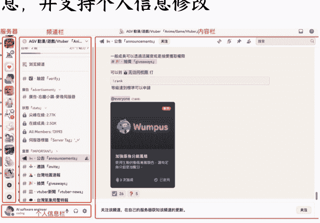

## 4、Discord 上的变现方式
我把目前 Discord 上常见的变现方式搜集出来了，整理总结如下：
懒人微信：lazyhelper

| 机会/变现方式 | 适合人群 | 其他说明 | 限制 |
| :--- | :--- | :--- | :--- |
| **Server Subscriptions（服务器订阅/知识付费社群）** | KOL、教育培训、SaaS 社区 | 社群可以提供专属频道/角色/知识/资源包等有价值内容。例如,教老外如何赚钱、如何使用工作流等。 | 中国身份,暂时无法直接开通 Server Subscriptions,需要海外实体 |
| **Bot SaaS(开发机器人及插件)** | 有开发能力的个体/团队,需要对需求和痛点敏感 | 案例:市面上 Statbot、MEE6 等皆年收百万美元 | 目前仅支持美国/英国/欧洲开发者使用 Stripe 结算。 |
| **内嵌 App 开发** | 游戏 & 工具开发者 | 成功案例： 1、Death by AI（AI 生存策略游戏） 变现方式：游戏内内购，付费解锁新的游戏模式、场景、个性化设置、形象等。 2、Kruner Strike FRVR（经典 FPS 《Kruner》游戏的 Discord 轻量版） 变现方式：通过付费皮肤包变现 3、Chef Showdown - Mojigworks（即时对战做菜小游戏） 变现方式：通过赛季通行证 + 装扮道具变现 | 目前仅美国/英国/欧洲 可提现，新人上手难度比 Bot SaaS 更高 |
| **游戏/数字商品销售** | 独立游戏、资产包作者、国内游戏主播出海 | 成功案例： 1、Club Banana (游戏主播 Woohoojin 的服务器) 单月收入：15K+美元/月 变现方式：私域提供订阅服务，提供教学视频与战术资料，高级会员提供点评或小组语音回顾 2、Inspired Analyst (加密交易社群) 变现方式：提供每周策略 PDF+模板以及高频行情脚本 单月收入：2500 美元 / 月 3、No Hesi (3d 飙车游戏社区) 变现方式：游戏内内购，解锁全新车型及VIP地图，社区人员超百万，付费用户2.7w+。 单月收入：52,000 美元 / 月 | 中国身份，暂时无法开通 discord 官方对接的 stripe 收款渠道和官方商城，暂时只能通过第三方支付机器人完成收款和发货通知 |
| **海外社区运营服务** | 海外运营人员 | 打包“搭建+管理+Bot 配置”，收顾问费。可以使用一些现成的机器人进行打包卖给别人，并收取顾问费。 | 可直接落地，收费走 Payoneer、Wise、Stripe HK/SG 等渠道,但是需要有海外社群运营经验 |
| **赞助/营销/广告** | 直播主/服务器运营主 | 卖广告位、营销合作。 案例：大型服务器（10 万+）发布一次广告的价格通常在几十到一百多美元区间，可以通过批量销售和网络规模提高广告收入。 | 最友好，变现渠道与海外其它社媒同理 |

因为很多现在 Discord 官方的一些商业模式并不对中国身份开放，需要一些其他的方案，例如开美国主体公司，或者开发一个接入支付的机器人，这样就可以通过机器人间接实现变现。下面我会展示一下我开发的机器人的过程，给大家一个参考。

## 5、我做的一个 AI 二次元聊天男友 Demo
### 5.1 效果图
### 5.2 核心功能
- 1、跟他进行聊天互动，根据聊天内容的深度，提高对应数值的亲密度，解锁亲昵称呼。
- 2、引入 DOL 虚拟货币，用户每次聊天都需要消耗 DOL 货币数值。
- 3、支付功能接入，用户可以购买花钱购买 DOL 虚拟货币增加聊天次数。
- 4、不定时主动发送私信。
- 5、功能快捷键。
- 6、简单 AI 记忆功能。

### 5.3 技术框架
- 前端：Discord App
- 后端：Discord 官方 API
- AI 功能：OpenRouter API (GPT-4o)
- 支付：Creem
- 数据库：Supabase
- 部署：Railway

## 6、如何做一个类似这样的收款机器人？
注册 Discord 账号，可以用邮箱进行注册。网站：https://discord.com/

### 第一步、申请一个机器人应用
https://discord.com/developers/applications
打开上述链接，点击右上角的“new application”。
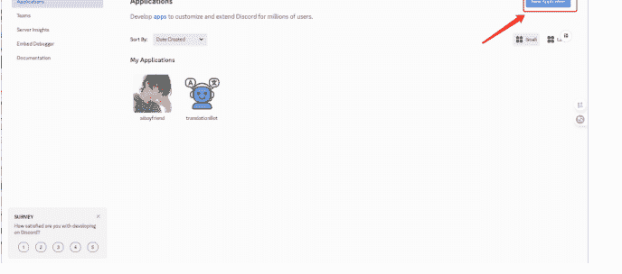
新建以后，会有一个提示框，输入你的机器人名称即可。
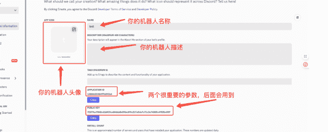

### 第二步、勾选权限
在 OAuth2 中的 bot permissions 中，勾选 send message、read message history、use slash commands 权限。
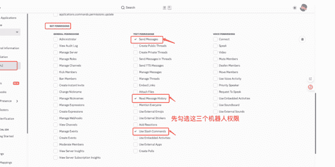
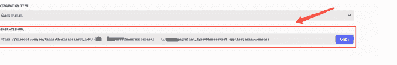
在上方勾选完以后，会生成一个链接，点击复制后，可以邀请机器人进入服务器。
在 bot 中的 bot permissions 中，勾选 send message、read message history、use slash commands 权限。
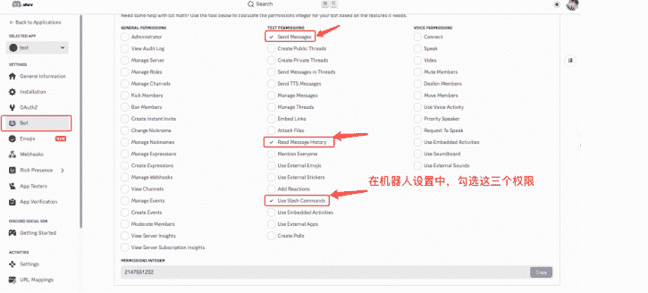

#### OAuth2 和 Bot 的区别
- **OAuth2**：主要是设置授权相关的参数，明确谁可以用、怎么邀请、是否需要用户授权登录
- **Bot**：主要是设置机器人相关的参数，明确机器人能够拿到哪些事件、具备哪些功能

### 第三步、在 Discord 客户端中，创建一个服务器

### 第四步、把机器人拉到服务器中
通过第二步中创建好的 URL 链接，把机器人拉到自己的服务器或者别人的服务器中。

### 第五步、Cursor 中编写核心代码
打开 Cursor，在 Cursor 中，主要让机器人完成下列核心功能：
- 聊天互动功能，根据聊天内容的深度，提高对应数值的亲密度，解锁亲昵称呼。
- 引入 DOL 虚拟货币，用户每次聊天都需要消耗 DOL 货币数值。
- 支付功能接入，用户可以购买花钱购买 DOL 虚拟货币增加聊天次数。

配置文件中，主要需要设置 `BOT_TOKEN`、`CLIENT_ID` 参数。如果忘记了 `BOT_TOKEN`，可以在 `bot -> reset token` 中进行重置。
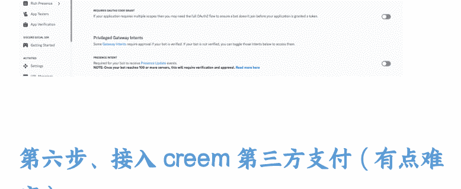

### 第六步、接入 Creem 第三方支付（有点难度）
#### 基础概念
对新人来说，支付接入这部分，涉及到的专业术语较多，且不太好理解，我争取用通俗的语言解释清楚；站在用户的角度，支付主要的流程如下：
- 1、**下单**：用户点击“购买”按钮，系统立刻生成一个订单号（比如 T20250716-001）。
- 2、**付款**：用户跳转到收银台页面——支付宝、Creem、Stripe 等支付平台都类似。
- 3、**Webhook**：用户完成付款后，支付平台发送（post）一条消息到我们的后端地址，例如：订单 T20250716-001 已付款，签名见消息的 header 部分。
- 4、**后台确认**：我们用支付平台给的“签名”确认消息没被篡改 → 把订单状态改成“已付” → 给用户发货/充余额/开权限。如果我们计算得到的签名和支付平台返回的签名不一致，支付就会失败。
- 5、**通知用户**：签名验证没问题，用户支付成功后，网页或 Discord Bot 给用户发送提示：“你已经成功完成支付，对应套餐已开通，感谢支持！”

#### 支付的整体流程
#### Creem 支付实现的流程图（以我的 Discord 机器人为例）：
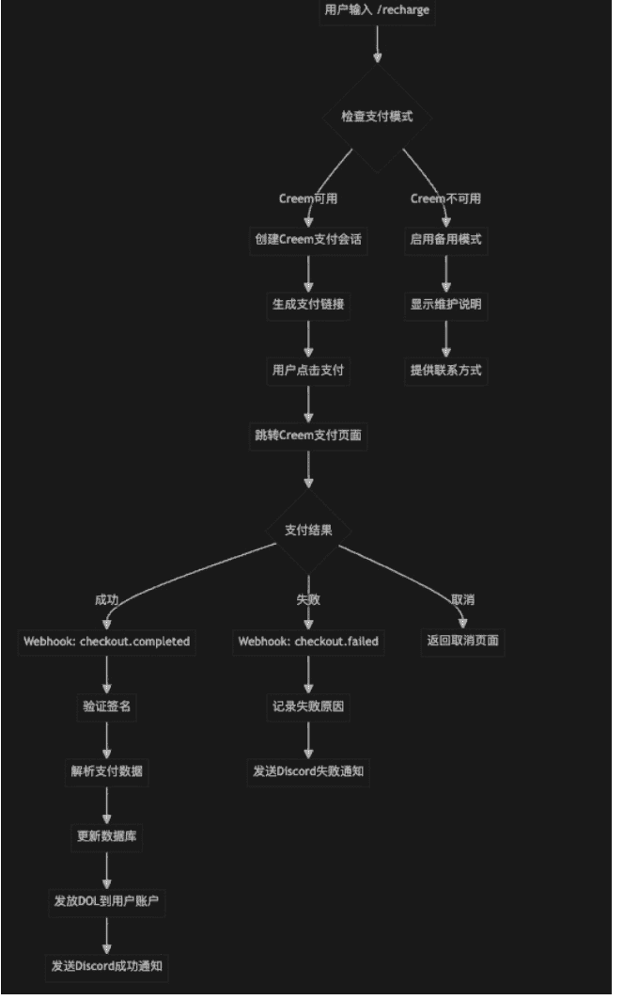

### 支付、部署的详细实现步骤
支付部分，我会分为四个阶段进行讲解，最后一个环节是部署，可以结合第七步一起看。

#### 第一阶段：账户和产品准备
**步骤 1：注册 Creem 账户**
- 访问官网：creem.io
- 完成注册：填写个人信息
- 身份验证：上传身份证件（通常 1-3 天审核）
- 账户激活：等待邮件通知激活

**步骤 2：创建产品套餐**
在 Creem 后台依次创建 4 个数字产品（下面以我的虚拟数字商品为例）：
| 套餐名称 | 价格 | 说明 | 用途 |
| :--- | :--- | :--- | :--- |
| 新手包 | $4.50 | 450 DOL | 初次体验 |
| 基础包 | $9.90 | 1000 DOL | 日常充值 |
| 标准包 | $19.90 | 2200 DOL | 高性价比 |
| 至尊包 | $49.90 | 6000 DOL | 大额充值 |

重要：DOL 是虚拟货币，类似于 token，创建后记录每个产品的 ID（格式：prod_xxxxx）。

**步骤 3：获取 API 凭证**
- API 密钥：在 Creem 的 Settings 中 → 点击 API Keys → 创建 Production 密钥
- Webhook 密钥：Settings → Webhooks → 创建 webhook 时获得
- 妥善保存：这些密钥非常重要，泄露会有安全风险

#### 第二阶段：技术环境搭建
**步骤 4：数据库准备**
使用 Supabase（推荐）创建数据表：
- 进入 Supabase 官网，注册并创建项目
- 创建必要的数据表：
  - `profiles`：用户档案表（存储 DOL 余额）
  - `payments`：支付记录表 (追踪交易)
  - `sessions`：聊天记录表 (可选)
  - `ab_events`：事件统计表 (可选)
- 创建数据库函数：
  - 用户档案更新函数
  - 支付确认函数
  - 统计查询函数

**步骤 5：环境变量配置**
在本地的开发环境中，创建 `.env` 文件，配置以下关键变量：
- **Discord 配置**：
  - `DISCORD_TOKEN`：机器人令牌（获取方式在上文已经提过了）
- **Creem 配置**：
  - `CREEM_API_KEY`：API 密钥
  - `CREEM_WEBHOOK_SECRET`：Webhook 签名密钥
  - `CREEM_PRODUCT_ID_*`：各套餐产品 ID
- **应用配置**：
  - `APP_URL`：你的应用域名（告诉支付平台，webhook 需要通知到你的哪个地址，刚开始是本地的地址，后续部署上线后需要改为线上地址）
  - `WEBHOOK_PORT`：Webhook 服务器端口（告诉支付平台，需要通知到你的哪个端口号，一个域名下有多个端口号）
- **数据库配置**：
  - `SUPABASE_URL`：数据库连接地址
  - `SUPABASE_KEY`：数据库访问密钥

#### 第三阶段：核心功能实现
**步骤 6：支付服务具体实现**
这部分代码，主要是完成用户从下单到支付的核心功能（不涉及到 webhook 通知），需要完成的核心功能：
- 创建支付会话：调用 Creem API 生成支付链接
- 验证套餐信息：确保用户选择的套餐有效
- 生成唯一 ID：用于追踪每笔交易
- 保存待支付记录：预先记录到数据库
- 处理错误情况：网络异常、API 限制等

**步骤 7：Webhook 服务器通知实现**
这部分代码，主要是在用户支付完成后，支付平台进行 webhook 通知，我们的后端需要进行后续业务处理，完成整体的支付 -> 到账功能。

我们的后端接收到 webhook 请求后，需要完成下列核心功能：
- 接收支付通知：处理 Creem 的回调请求
- 验证签名安全：确保请求来自 Creem
- 解析事件类型：区分支付成功/失败
- 更新数据库：确认支付并发放 DOL
- 发送用户通知：Discord 私信通知结果

步骤 6 和步骤 7 合起来后，跟 AI 交互的参考提示词：
帮我完成 Discord 机器人的支付功能，实现用户输入 `/recharge` 指令后，可以选择对应的充值套餐，在支付界面支付相应金额后，DOL 虚拟货币到账，具体实现可以参考 Creem 的官方文档：
https://docs.creem.io/introduction
我的业务逻辑是：用户点击购买按钮，生成订单号，并跳转到支付界面（支付金额根据用户选择的套餐金额来确定），在支付界面，用户可以输入信用卡等信息，点击“支付”后，对用户的支付信息进行校验。【这部分对应于步骤 6】

同时 webhook 通知的地址为:XXXX（填你的 webhook 通知地址），Discord 机器人收到通知后，进行签名校验。如果支付失败或者校验失败，在前端提示用户失败原因。【这部分对应于步骤7】

#### 第四阶段：本地开发测试

### 步骤 8：本地环境配置

这一步主要是进行环境变量配置，防止后面因为环境变量配置出错而导致问题。

安装签名校验依赖：`npm install axios express crypto`

### 启动服务：运行 Webhook 服务器

### 端口暴露：使用 ngrok 暴露本地端口到公网（本地测试时的 webhook 通知地址）

备注：webhook 的通知地址必须是公网地址，本地地址无法通知，所以需要 ngrok 把本地地址暴露到公网上进行 webhook 测试。

### 配置回调：在 Creem 后台设置 ngrok 地址

### 步骤 9：功能测试

这一步主要是测试支付全链路是否能够成功完成，可以让 AI 帮你写一些中间过程的输出语句，检验每一个环节是否成功工作。如果失败的话，可以通过日志输出，帮助定位哪个环节出问题了。

针对我的案例，我的测试清单为：

- Discord 命令响应正常
- 支付链接生成成功

- 支付页面跳转正确
- 支付签名校验成功
- Webhook 接收正常
- DOL 发放准确
- 用户通知及时
- 数据成功落库

参考上述流程，再结合自己的业务逻辑，进行一步一步测试，每一步都测试成功的话，最后就可以跑通支付环节。

### 第五阶段：Discord 机器人生产环境部署及售后

这一步主要是为了让本地能够运行的 Discord 机器人，让其能够线上运行，所以我们需要选择一个部署平台把我们的机器人部署上去。

### 步骤 10：选择部署平台

推荐平台：

- Railway：简单易用，自动域名（我用的是这个）
- Vercel：适合 webhook 函数
- 自建服务器：完全控制，新手不推荐，环境配置太繁琐。

### 步骤 11：部署配置

在进行部署的时候，也需要进行环境变量配置，需要把本地 `.env`（或者是 `.env.local`）文件中的参数，在部署平台中进行设置。而且每次更新环境变量后，需要进行重新部署，不然就可能读不到最新的环境变量数值（在 Railway 上部署的时候，修改变量或者设置新变量，相关变量会改变颜色，你以为程序自动读取了，实际上并没有，需要重新部署后才能读取）。

- 环境变量设置：在平台后台配置所有 `.env` 变量
- 域名配置：获取生产环境的域名，如 `https://yourapp.railway.app`（线上生产时的 webhook 通知地址）
- 在 Creem 中，将 webhook 地址改为生产环境的域名
- 数据库连接：确保生产数据库可访问
- SSL 证书：确保 HTTPS 访问（大多数平台自动配置）

Creem 中 webhook 配置页面如下：

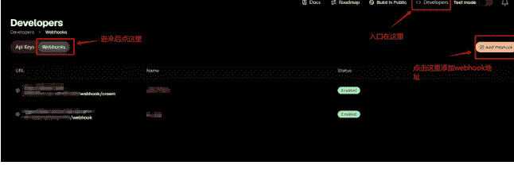

### 步骤 12：用户支持/售后

这一步主要是万一用户进行了双次支付、想要退款等操作时，需要提供好对应的支持，防止用户想要退款找不到人，然后举报你的机器人。一般在支付界面中提供你的联系方式（邮箱）就好。

### 常见问题处理：

- 支付失败退款
- DOL 到账延迟
- 重复扣费处理
- 技术故障补偿

一般用户需要退款的话，帮他处理即可，安全、不被举报最重要。

### 测试过程的一些技巧：

1. Creem 支持在测试环境中进行测试，把支付的流程测试成功后，只需要修改配置参数即可。我用过测试环境进行测试，但是失败了，所以就没用这种方式。
2. 设置产品定价以后，可以在 Discord 中设置优惠券，按照百分比设置优惠券，例如 100%，在支付测试的时候，输入折扣码。就可以实现 0 损耗测试支付过程。不然真的扣款的话，提现会被平台扣除手续费，会有大概 5% 左右的损耗，如果多次测试的话，会很不划算（我主要采用了这种方式进行测试）。

### 充值完成后的效果图

第一步：在充值之前，输入 `/stats` 指令，查看当前的 DOL 余额为 5180 DOL。

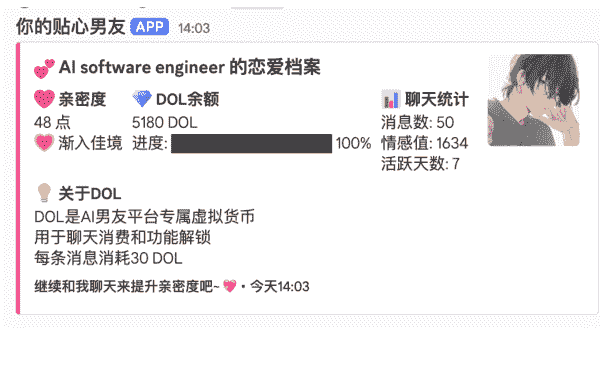

第二步：输入 `/recharge` 指令，点击 package，选择 450 DOL 的新手充值包。

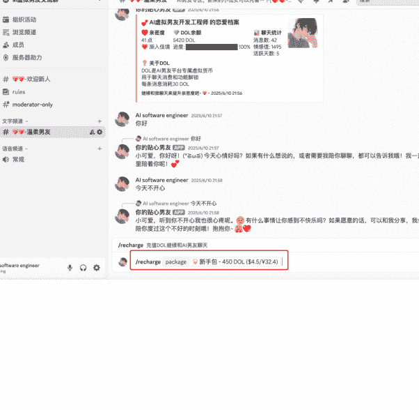

第三步：然后点击“立即充值”按钮。

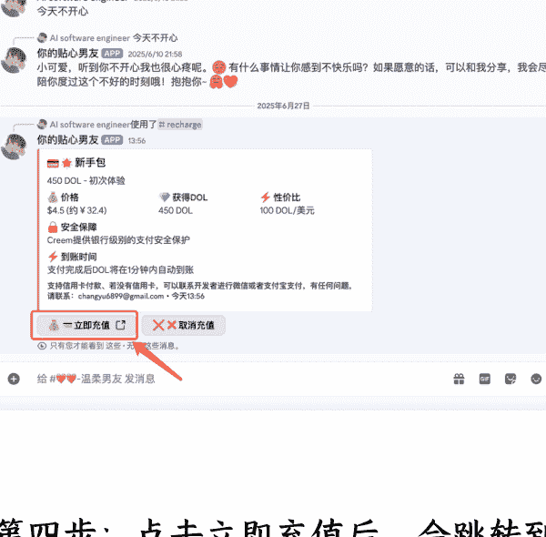

第四步：点击立即充值后，会跳转到 Creem 的充值网页中，需要输入用户的银行卡等信息，这里为了方便演示，提前设置了优惠码，可以直接 0 费用付款。

第五步：点击付款后，等待交易完成。交易完成后，会出现下列这样的提示。

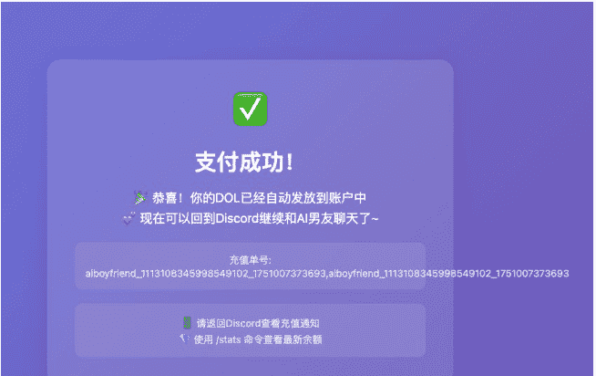

第六步：返回 Discord 频道，输入 `/stats` 指令后查看余额情况。

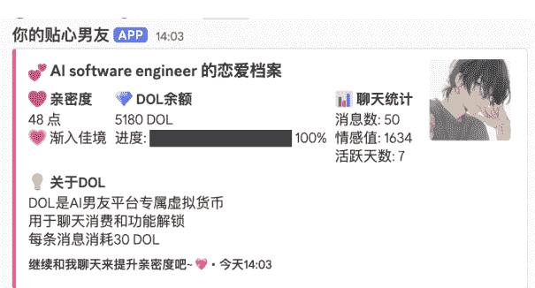

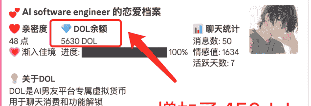

相比较充值之前，充值后增加了 450 DOL，充值成功。

### 第七步、在 Railway 上部署机器人

把本地的机器人代码上传到 GitHub，然后在 Railway 中导入 GitHub 项目。

链接：https://railway.com/

第一步：打开上述网站，登录自己的 GitHub 账号，然后点击部署新项目。

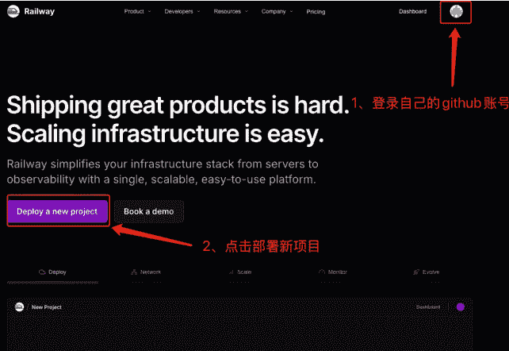

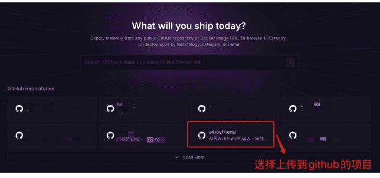

懒人微信：lazyhelper

### 第八步、开始聊天吧

部署完成以后，打开 Discord，跟你的机器人开始聊天吧~

## 总结

## 新手如何入局这个平台

目前 Discord 很多商业功能并没有对中国身份开放，相对来说没有那么友好，变现周期相对较长。

在刚开始阶段，我更建议结合自己的海外业务，把 Discord 当作流量承接和私域运营工具，为自己的主要业务赋能，或者增加收入渠道。

例如，如果你原本的业务是做 YouTube Shorts 的，可以在做视频的同时，做一个 Discord 社区，方便跟粉丝用户交流，了解用户喜好，并随着社区用户的增长，跟一些品牌合作，进行广告变现，增加新的收入渠道。

如果你原本的业务是做海外 Web 站的，可以在每个网站下面，增加 Discord 交流渠道，方便用户反馈网站问题，提供建议等。可以在 Discord 中跟用户直接交流，通过新功能分享、营销等方式，提高网站的订阅转化率和复购率：

从 0-1 入局的方式，我用下面这个表格进行呈现，新人按照步骤一步一步执行，能为自己的业务赋能，提高变现效率。

| 步骤 | 关键动作 | 工具 / 小技巧 |
| --- | --- | --- |
| 1. 合规访问 | 使用合法梯子渠道访问 Discord | 付费 VPN 比免费的好用很多。可以按照时间或者流量进行订阅 |
| 2. 创建账号 | 用常用的邮箱/海外手机号注册账户 | 开启双因素验证 (2FA) 提高账号安全性 |
| 3. 搭建服务器骨架 | 利用模板建群：①欢迎区 ②公告区 ③主题讨论区 ④反馈区 ⑤内测/付费区 | 可以用官方模板「Creators & Communities」一键搭建 |
| 4. 使用机器人（可选） | 使用相关机器人可以提高运营效率，前期人不多的时候，可以先不做，后期再做也不迟 | • 安全：Captcha.bot • 管理：MEE6 / Sesh • 数据：Statbot（免费版够用） |

前期可以跳过这个步骤。

### 5. 内容冷启动

Discord 中发布相关内容，可以每天 1 个互动主题 + 1 个价值贴；用内容吸引用户。

### 7. 绑定主业务

把 Discord 和自己的主业务结合起来，例如：

- YouTube：Discord 邀请链接在评论中置顶 + 提供社群福利
- 独立站：提供 Discord 入群链接 + 引导用户入群（反馈网站建议/错误，入群获得专属福利等）

也可以用 Zapier / n8n 自动发邀请链接。

### 8. 导流

利用主业务搞流量，把流程承接至 Discord 私域中。

关注流量和入群比例。

### 9. 开启变现

当用户数量到达一定程度后，可以考虑下列变现方式：

- 1) 服务器订阅/知识付费（需 Stripe 身份认证）
- 2) Discord Bots / Apps 应用开发变现
- 3) 广告位等其他变现方式

无 Stripe，前期可以考虑付款机器人、表单工具等方式收钱。后期还是有海外主体更好。

## Discord 上，有哪些注意事项？

- 1. 需要自己提前准备网络环境、相关软件、银行账户等基础建设。
- 2. 如果想用官方的商业模式和功能，例如服务器订阅、App 内购等功能，最好还是有一家美国实体公司（包含银行账户和税号等功能）。这样后续会节省很多时间和精力。

以上就是关于 Discord 的全部内容。关于 Discord 的更多功能，我也还在不断探索中，期待跟大家的交流～

最后，安利小懒的付费群：

### 懒人专属群

懒人微信：lazyhelper

微信：lazyhelper

📚 懒人专属群持续更新中，已持续运营 6 年，整理超 3000 份各类精选付费文章 & 年费社群干货，全部开放下载。

本资料为付费群内部分享，仅供真实有需要的朋友查阅 🙏

懒人专属群更新记录：
https://lazy2025.top/#/blog/record2

懒人专属群更新记录（需梯子，备用）：
https://lazybook.fun/#/blog/record2