# 公众号 IP 深耕打造与系统化持续变现经验分享

250728 生财精华
公众号懒人搜索，懒人专属群独享
懒人微信：lazyhelper

大家好，我是科学羊🐑，（10W+）爆文公众号专栏日更作者，知名报社签约编辑、海外内容创业实践者、游戏视频创作者、B站游戏 UP 主。

好久不见♥，今天我又来生财分享干货啦~

对了，可能我今天不会具体分享关于公众号基础的内容，基础的内容大家可以在生财航海看到巨量的资料。我本期分享的内容是生财里可能没有的知识，这也是我第一次公开自己在公众号领域的真实心路历程和变现经验。希望大家多多指教~

本期内容你将学到：
- 1、如何通过公众号搭建自己的 IP 系统；
- 2、公众号系统化变现的方法；
- 3、我自己的方法与经验；
- 4、公众号 IP 打造的建议与心得，包括避坑；

## 为什么是我？

因为我在公众号领域（粉丝10w+）早已做出了自己实打实的个人IP。

以下是我的成绩：
- 1、公众号深耕8年 - 自然哲学科普作者；
- 2、公众号流量主总收益 >10W；
- 3、公众号周边变现（带货、商务合作）>5W；

虽然和圈内其他大佬变现的收益差距很大，但是从个人IP角度来看，就一个词——稳定。

好，接下来我慢慢给大家分享我自己的心法，其实我和大家一样都普普通通，没有什么特别炫酷的技巧，唯有踏实实践做就一定能出结果。

好，废话不多，我们直接进入主题。

## 一、如何做垂直方向公众号IP

### 1.1 公众号IP基本认知

大家先仔细听我讲：

其实很多人，一听公众号，可能第一时间想到的就是流量主，而这类赚钱的方法就是赚快钱，哪里有爆款，哪里有风向，他们就去模仿做，直到这个风口结束，然后就没了。可能随之号也就没了，直到下一个风口在起号。

当然，这也是一种变现方式，但是我所分享的是公众号 IP，并不是一个在快速赛道上行走的领域，而是需要花一定的时间去精细打造和雕刻的领域。

#### 那么，什么是公众号 IP？

就是深耕你公众号某个号的垂直领域，而且这个垂直要非常垂。

举个例子，比如我是写情感的领域的。其实情感领域还包括：个人成长、女性成长、心理学、关系学…，而且这里面还层层嵌套。而你要做的最好是在一个细化领域深耕。

#### 那我什么时候可以转职呢？

就是在你把这个垂直领域做出一定成绩或者有自己的 IP 的时候再去慢慢扩张，注意这个扩张也是在大领域下，比如我是做自然哲学科普的。

我当时是花了几年只写物理学领域的知识，后来自己的 IP 形成后。我又转去做数学领域的科普。但我一定紧紧围绕科学领域，比如 AI 方面的科学我不写、科技类的新闻或研究我也不写。

所以做个人 IP 的第一步就是：选定自己的大方向，细化自己的小方向！

#### 给大家一个参考图：

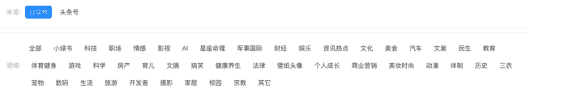

公众号大领域的大分类如上（仅供参考），细分大家可以自行去研究这个分类里面的文章。

参考工具：易撰、次幂数据等。

### 1.2 我是如何起步的（5个阶段故事）

我是一名自然哲学科普作者，其实在我2017年开始做公众号的时候，生财应该刚刚成立，如果早点踏入生财的这条财富船，说不定我会比现在走的更快，嘿嘿～另外，我做科普作者源自于自己的兴趣，因为那时候我特别喜欢阅读得到APP老师们的课程，我几乎买了所有的课程（目前已经学习了4890个小时），比如万维钢、李笑来、吴军、梁宁等老师的课程，疯狂学习，疯狂做笔记。

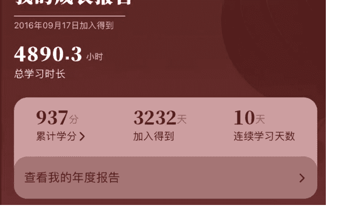

后来我发现自己也很想将自己学到的知识分享出去，也就是能通过笔记的方式把自己学到的内容传播出去。

所以公众号于 2017 年年初建立后就开始记录自己的学习笔记。这是第一阶段！

不过，如果从运营公众号的角度来看，那时候我的阅读量都是个位数，但是当时我觉得无所谓。反正都是给自己看的。

后来我发现不能自己光分享，还希望能让其他人一起加进来一起学。我也发现自己当时公众号写的内容有点乱，个人成长也写、科学分析也写、计算机算法也写...真的是把得到 APP 学到的知识给大杂烩了。

直到我加了一个公众号打卡群（号称 007 终身写作前生）后，我开始注意到自己不能啥都写，一定要给自己定义一个方向，所以我的公众号第二阶段成立了，我选择了深耕写物理学方面的知识。

我记得，那时候打卡的时候，有个群友问我一个非常棘手问题：“你天天写这些物理学的内容有什么用呢？”。我坚持说：“兴趣而已吧”，那时候我没有用户思维，就觉得你爱看不看，反正自己写完爽就行了。

其实她说的也没错，我当时虽然这么想，但是内心也在犹豫，为什么要写这些内容呢，我的目的到底是什么。

因为物理学本来都是我们大多数逃避的一个领域，我还写成文章，给狗估计都不看，哈哈哈。

但是啊，就怕这个但是，我做梦也没想到，几年后我的这些坚持居然让我收获巨大。自己觉得就好比一个扫地僧突然成了武林霸主。

继续…

这个阶段持续了将近1~2年，直到我知道了流量主，我开始了公众号第三阶段，也就是开始慢慢变现了！

你可能不知道，我自己粉丝快到1w的时候都没有开通流量主，我也不知道那时候有没有流量主，这只能说这是个认知问题，同时也说明了我对写作的热爱！

不过第三阶段的变现很低，每天就是几块钱，可能一个月才1百出头吧。不过这个阶段也不是没有改变，这个阶段我开始注意用户思维了。

因为关注我的人越来越多，我总要把文章写好吧，所以我专门去学习粥左罗老师的写作课，强化自己的写作思维和能力。那时候我不光写一篇公众号，而要写个人日课。

后来可能是因为生财的机缘，那时候知道了流量主，我才大吃一惊，开始彻底步入了公众号的第四阶段。也就是这个阶段，我开始真正重视用户思维，直到我写出了数篇10万加的科普爆文。

而且让我自己更诧异的是，我是能把「数学」+「物理」这样的极端枯燥且非常小众的文章写出10~100万+，在公众号公海根本找不到对标，都是别人来抄我的，所以这个阶段差不多已经成为科普领域的头号了。

你知道我做了什么吗？很简单：标题。你懂了吧！

现在是属于第五阶段，就这样后来发展到成为科普IP，并开设了很多小号，不止做科普，因为懂了公众号爆文写作的方法，所以我只要底层方法对了，起号做其他小IP也是不成问题。

详细大家参考：

所谓真金不怕火炼，只要你的方向是对的，再细分的领域做到极致，就一定有所收获！

好，接下来我们谈谈变现方面的内容↓～

## 二、公众号变现的方法

### 2.1 公众号变现基本认知

前言：大家注意，做公众号，不止是流量主，从公众号个人IP的角度来看，它只是一小部分。

做公众号，一定一定要系统化。

#### 2.1.1 什么是系统化？

就是你写一篇公众号文章，一定不要只局限这篇文章。

你要思考这篇文章的目的是什么？比如，为了带货、为了粉丝眼球增加流量主收益，还是为了给视频号，甚至你的科普油管账号测试流量？

比如我在做某个公众号的时候画了一张图，如下：

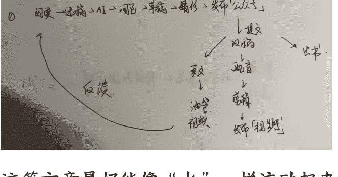

这篇文章最好能像“水”一样流动起来！

哪怕一篇ai文，或者水文，只有经过测试了才知道我适不适合流到后端去变现。

#### 2.1.2 为什么要系统化?

只有系统化变现才稳定,刘润的《商业洞察力》专门讲了系统思维

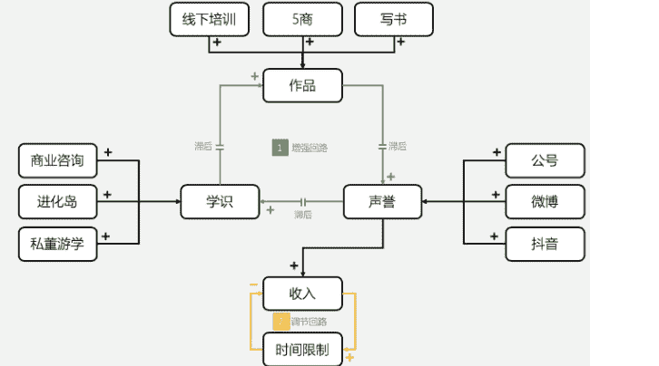

#### 何为系统化?

用哲学的话说就是:“做这个,其实为了那个,不做,是为了做…”

也就是说,你以为我在看书?不,其实我在积累素材。你以为我只是为了写公众号?不,我是为了测试这篇文章,发了之后能不能获得 10 万+,然后我把这篇文章拿来去做视频号或者油管视频。

你以为我是为了做油管视频?可能也不对,其实我是打算把它打磨成一篇精文来出书。

这就是我的理念,为什么我如此坚持公众号 7~8 年,那是因为我早已系统化了。

所以，我坚持让自己的公众号流动起来，这样我可以做的更持久，以及更多的收益。

### 2.2 流量主

以下是笔者节选账号总收益

| 项目 | 数值 |
|---|---|
| 累计收入(元) | 15,366.11 |
| 程序化广告收入(元) | 15,351.77 |
| 昨日收入 | +72.02 |
| 互选合作收入(元) | 0.00 |
| 带货与内容推广(元) | 0.00 |

| 项目 | 数值 |
|---|---|
| 累计收入(元) | 28,794.15 |
| 程序化广告收入(元) | 28,398.12 |
| 昨日收入 | +51.50 |
| 互选合作收入(元) | 0.00 |
| 带货与内容推广(元) | 383.71 |

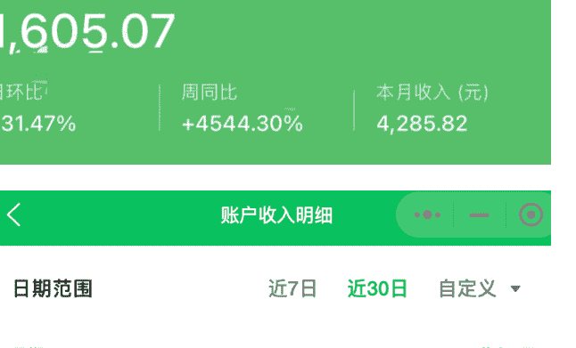

账户收入明细
| 日期 | 收入(元) |
|---|---|
| 2025-07-19 | 181.89 |
| 2025-07-18 | 123.32 |
| 2025-07-17 | 97.00 |
| 2025-07-16 | 93.53 |
| 2025-07-15 | 129.85 |
| 2025-07-14 | 203.79 |
| 2025-07-13 | 248.40 |
| 2025-07-12 | 246.07 |

懒人微信: lazyhelper

| 日期范围 | 近7日 | 近30日 | 自定义 |
|---|---|---|---|
| 日期 | 收入(元) | | |
| 2025-07-20 | 199.08 | | |
| 2025-07-19 | 255.71 | | |
| 2025-07-18 | 214.19 | | |
| 2025-07-17 | 62.51 | | |

| 日期范围 | 近7日 | 近30日 | 自定义 |
|---|---|---|---|
| 日期 | 收入(元) | | |
| 2025-07-18 | 137.71 | | |
| 2025-07-17 | 58.86 | | |
| 2025-07-16 | 109.95 | | |
| 2025-07-15 | 154.73 | | |
| 2025-07-14 | 233.57 | | |
| 2025-07-13 | 119.25 | | |
| 2025-07-12 | 86.23 | | |
| 2025-07-11 | 115.99 | | |
| 2025-07-10 | 192.34 | | |
| 2025-07-09 | 286.88 | | |
| 2025-07-08 | 490.39 | | |
| 2025-07-07 | 762.63 | | |
| 2025-07-06 | 941.93 | | |
| 2025-07-05 | 666.25 | | |
| 2025-07-04 | 267.70 | | |
| 2025-07-03 | 312.43 | | |
| 2025-07-02 | 382.55 | | |

7月份我的流量主收益已经1.5w了！这里不说太多，流量主是公众号的一部分收益，这也是必要的。流量主其他知识大家请查阅生财手册。

懒人微信：lazyhelper

### 2.3 商务合作

在我看来商务合作是公众号收益的第二大水池，一般来说主要是出书、代写、挂文等。

不过出书等这类基本要等自己的 IP 稳定下来才行。

#### 2.3.1 出版社出书合作

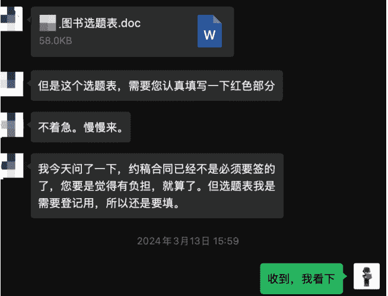

这是人民邮电出版社主动找我签约写书的合作，基本就是你和他们谈就好。这种变现就是需要花大量时间，才能有所收益。

出版社一般会一次性给你稿费，然后再根据卖书的数量给你尾款，具体要看出版社的规定。

#### 2.3.2 报社合作

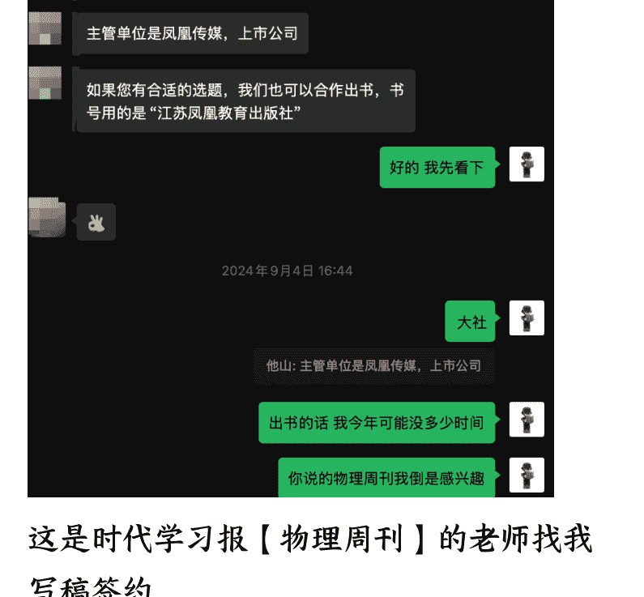

这是时代学习报【物理周刊】的老师找我写稿签约。

当然，我们的合作不光是口头说说，下面这张图就是实实在在的结果。这次合作我至少拿到1个W+。

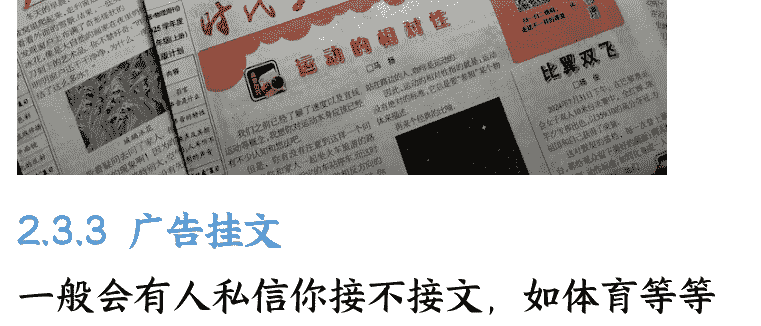

#### 2.3.3 广告挂文

一般会有人私信你接不接文，如体育等都是广告，一般一篇200元起。

我建议自行斟酌，这类变现我基本不接。

### 2.4 橱窗带货

橱窗是第三大水池，一般会有出版社主动私信你，给你定向分销，一般是20%~30%。甚至还有50%的专属分销。

这是我在橱柜带货后台收到的合作申请

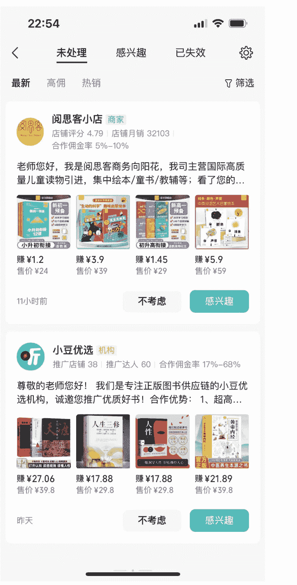

未处理 感兴趣 已失效

**郭生白图书 商家**
店铺评分 4.69 | 店铺月销 112 | 合作佣金率 15%-50%
VX: qinjiujiu2018 手机号: 18939106861 国医大师郭生白全套书籍，热销本能论，伤寒六经求真，方药论...
赚 ¥134.5 赚 ¥22.5 赚 ¥5.4 赚 ¥17.5
售价 ¥269 售价 ¥50 售价 ¥36 售价 ¥50
7月16日 已表示不考虑

**小豆优选 机构**
推广店铺 38 | 推广达人 60 | 合作佣金率 35%-61%
尊敬的老师您好！ 我们是专注正版图书供应链的小豆优选机构，诚邀您推广优质好书！合作优势：1、超高...
赚 ¥17.88 赚 ¥17.88 赚 ¥34.8 赚 ¥34.8
售价 ¥29.8 售价 ¥29.8 售价 ¥58 售价 ¥58
7月5日 已表示不考虑

**郭生白图书 商家**
店铺评分 4.69 | 店铺月销 112 | 合作佣金率 15%-50%

不过以上这类图书的合作，我一般都不接！

因为我觉得虽然接了肯定有钱的，但是这并不是我想赚的钱。因为你做到公众号 IP 了，最好深耕一个领域的带货。

给大家看一个这样的数据。

懒人微信: lazyhelper

#### 上个月带货就赚了 1K+，下面的截图只是统计了这本书的带货数据。（带货真的就是睡后收入）

2025/06/09 – 2025/07/08
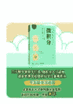
轻轻松松学会微积分 马丁加德纳作品
微积分入门教材书籍
¥49.80 ID: 10000237393729

核心指标
| 核心指标 | 数值 | 较上周期 |
|---|---|---|
| 成交金额 | ¥5079.6 | – |
| 成交订单数 | 100 | – |
| 点击次数 | 1555 | – |
| 点击成交率(次数) | 6.43% | – |

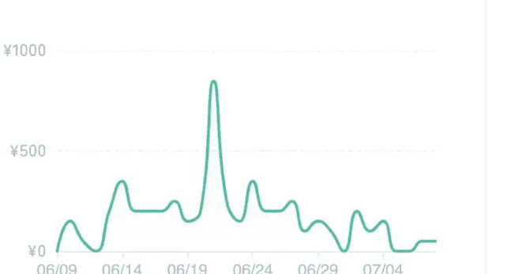
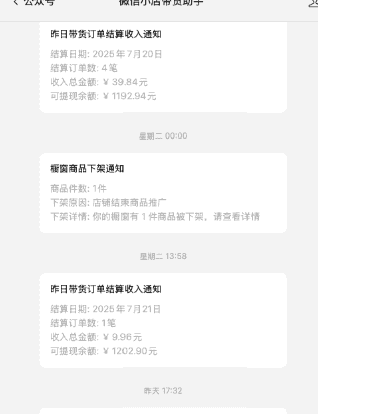

## 三、新人如何起步？经验与避坑

最后，做个简单的总结，主要阐述下关于公众号 IP 的经验与避坑。

我认为，总结以上的话，靠公众号赚收益，主要包含二个非常大的方向：其一：靠热度和风向来起号的快钱，其二：靠长期内容的堆积与 IP 打造。

我们本期主要分享的是 IP 打造，所以大家一定要记住，IP 打造注定是一个长期的过程，这个槛是过不去的。

### 3.1 新人应该注意什么

前几天有个朋友也想做公众号 IP，来咨询我如何做公众号的问题，正好我也一起分享下这个观点。

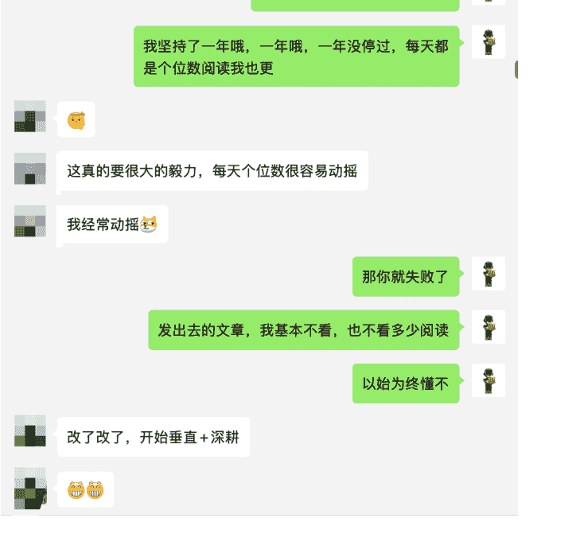

一般来说，如果是一个新人要开始打造自己的公众号 IP，选对方向后，就应该开始更新。

我的建议是前 2 周～3 周，最好是日更，而且我也不建议开通流量主（有流量再说，或者自然积累就好），因为我们的格局不在这里。不过这段期间要看情况，如果你的文章有推流，就继续日更下去。如果你的文章阅读量非常少，可以考虑 1 周更 3 篇（注意一定是方向要对，其他的交给时间就好）。

但这里一定一定要注重自己的标题，标题最好去找 5W+以上的爆文标题，而且千万千万千万不要改人家的标题，直接拿来用。一点也不能改，那什么时候能改，等你有一定粉丝再说。

另外，也不要拿了人家的标题后去刷文，这是坚决不行的。

你知道我是怎么做的吗？

第一阶段：抄标题，内容自己的写。也就是它里面的内容都看到不要看，看了反而还会影响你的思维。

比如，XXX3个需要注意的心法，每一个你都不能缺。

你可以自己想这3个究竟是啥，或者借助AI，然后再去用AI写文，自己润色即可！（我在文末有分享详细的SOP，大家链接即可）

第二阶段：仿标题，就是把爆款的标题稍作修改，但是内容大意要一样。这个阶段等你有一定粉丝再说，也就是说这个阶段，你已经差不多入池了。

所以，新人起号需要，就是靠积累，至于积累多久，就要看你的运气了。这是我自己测试出的一条路，而且我测试的几个号都基本最后入池了。如果缺乏毅力，可能很难坚持下去的。因为我得出的结论是：积累到一定程度，公众号会给你打标签，比如，稳定更新、有质量、内容到了一定程度，会自动激发公众号推流。

所以我想告诉大家的是：打造IP之前，佛系更新，只要你方向对了，就以始为终，也就是忘记你昨天写过的文章，每天都是第一天，即使昨天的文章没有流量，把希望放在今天。

公众号懒人搜索，懒人专属群分享

另外，还有一个非常重要的一点经验分享：就是起号文章不要做的太好，不要做的太好，不要做的太好。也就是你完全不要去关心什么排版要多么的优质、文笔要多么的优美。

大家注意，卖课的人会告诉你这样是因为他想让你觉得我交付了你很多内容。但是作为有实战经验的我，我不屑一顾。因为这反而是打磨你心力的东西。

为什么这么说，因为你辛辛苦苦打造出来的东西，结果内容和你预期不匹配，你说这样你能坚持多久呢？

要知道，做任何事都分阶段，不是说不要这么做，只是时机未到，我一般都是每天开始有粉丝增长的时候，快要入池的时候才会开始重视这部分内容。

所以前期不要花太多时间，太多精力。起号第一步要做的只是选对方向，积累文章，根据数据结果不断再去优化。

### 3.2 注重合刊

为什么是合刊？有什么好处？

因为你合刊了对于读者来说，他会觉得这是你精选的内容、这是你花尽心思整合的内容。你可能会说，公众号已经有标签做好了合刊，为什么要多余做这一步呢。

#### 不一样的！

真诚这两个字，我认为还是需要付出点什么的。如果你让用户觉得得到一样东西很容易，那说明其实这样东西没有什么价值。

#### 这也是打造个人 IP 的关键!

为了方便大家方便查阅，我已经将这部分文章进行了整理，欢迎大家收藏阅读。

| 版本号 | 更新日期 | 更新内容 |
|---|---|---|
| V1.1 | 2021.06.01 | 增加第1-2季 |
| V1.2 | 2021.07.06 | 增加第3季 |
| V1.3 | 2022.04.09 | 增加第4季 |
| V1.4 | 2022.05.16 | 增加第5季 |
| V1.5 | 2022.08.12 | 增加第6季 |
| V1.6 | 2022.11.20 | 增加第7季 |
| V1.7 | 2022.12.30 | 增加第8季 |
| V1.8 | 2023.10.24 | 增加第9季 |
| V1.9 | 2024.01.11 | 增加第10季，第1篇 |
| V1.10 | 2024.05.30 | 增加第10季全文 |
| V1.11 | 2024.10.01 | 增加第11季全文 |

------ 全文目录 ------
第一季 12篇 —— 物理学的启蒙

## 四、总结

人家说：公众号，小而美～我想，也确实如此，我不需要靠它赚太多钱，但我只需要它能不断给我意外的惊喜，就足够啦！

好啦，基本就这些啦，以上都是自己一些浅陋的经历和分享，希望对你有用。也希望生财的各路大佬多多指导~~~

未来，我也会持续将在公众号领域做出的成绩分享给大家。

最后，安利小懒的付费群：

## 懒人专属群

📖 懒人专属群持续更新中，已持续运营6年，整理超3000份各类精选付费文章&年费社群干货，全部开放下载。

本资料为付费群内部分享，仅供真正有需要的朋友查阅 😱

### 懒人专属群更新记录

https://lazy2025.top/#/blog/record2

### 懒人专属群更新记录（需梯子，备用）

https://lazybook.fun/#/blog/record2