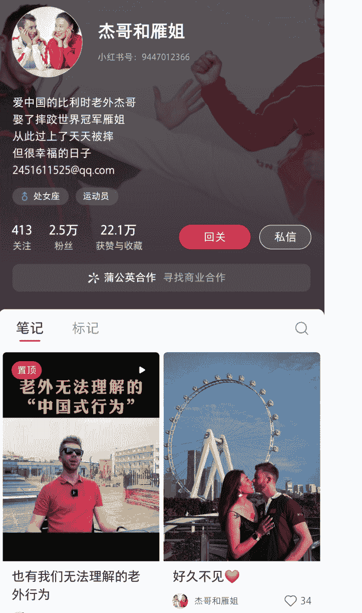
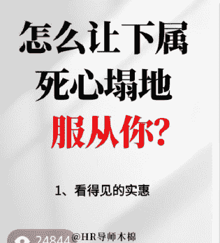
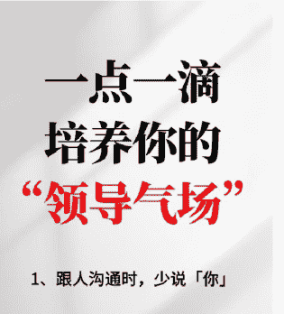
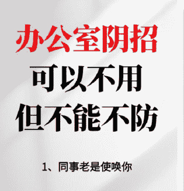
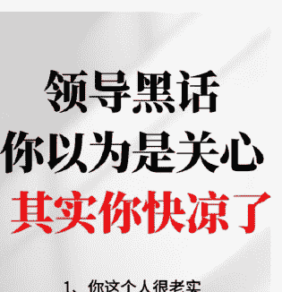
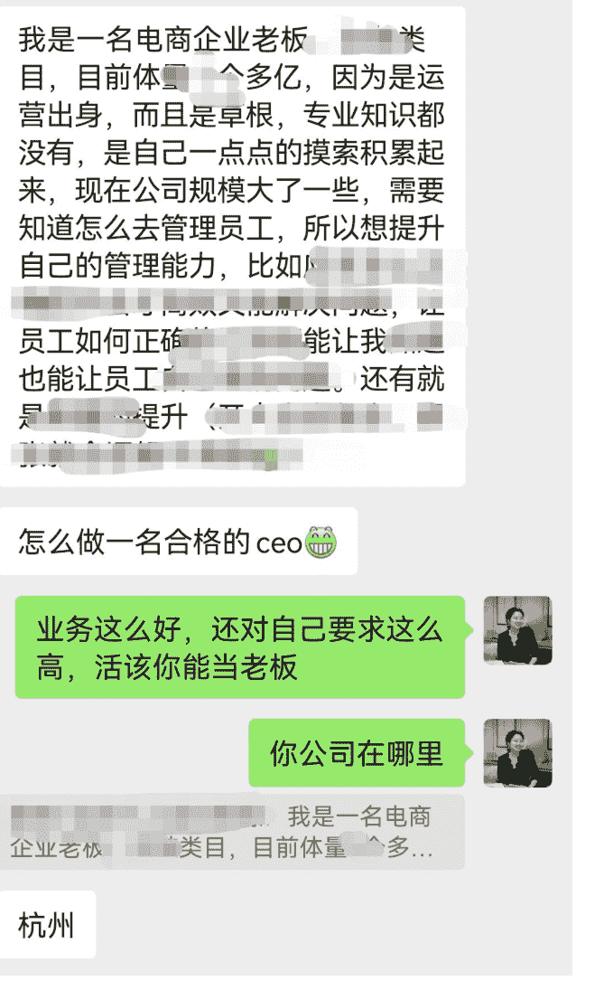
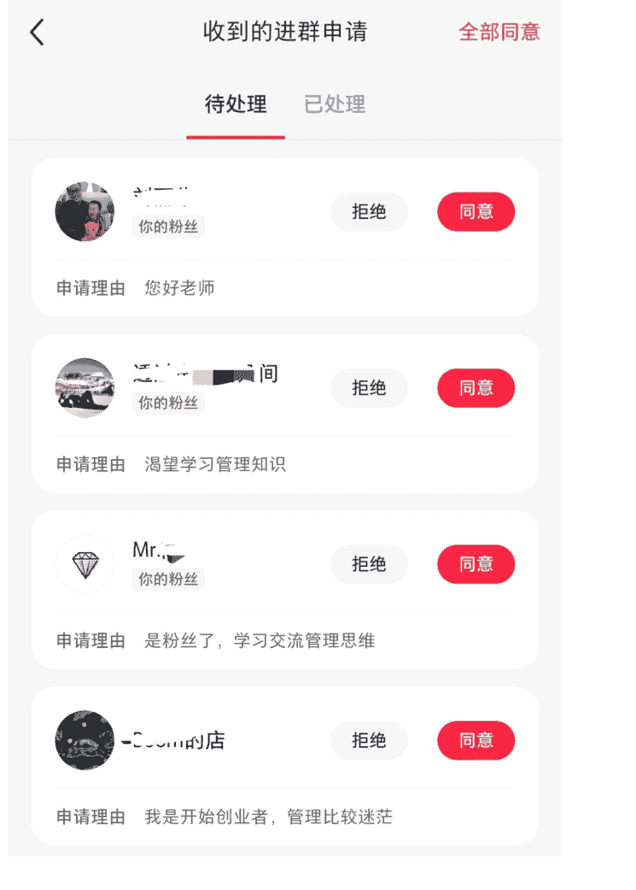
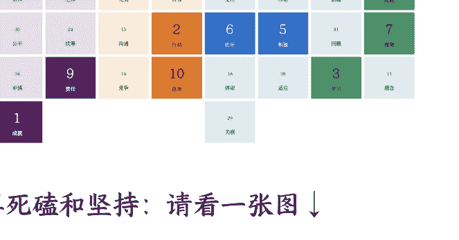
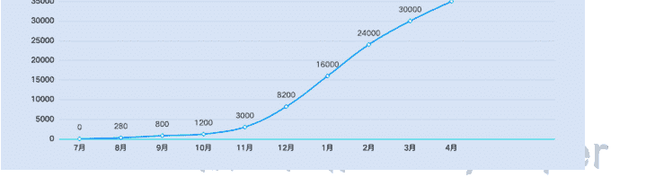
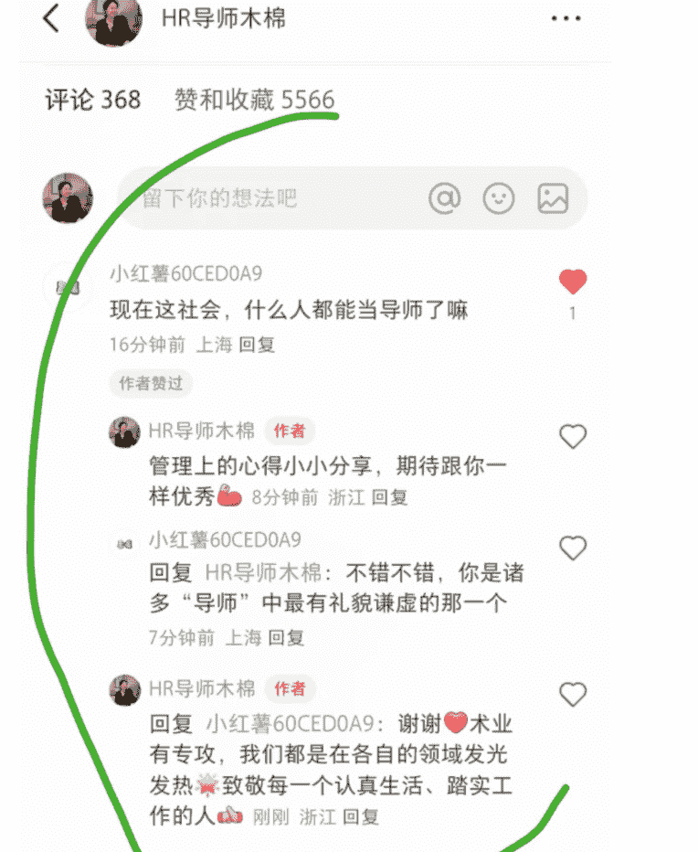

# 创业心法｜素人0投放起号小红书，12个月转化104W，我踩的4个大坑+2个心法

250728 生财精华

公众号：懒人搜索，懒人专属群独享
懒人微信：lazyhelper
公众号：懒人搜索，懒人专属群微信：lazyhelper

## 一、自我介绍

### 关于个人搞钱经历

大家好，我是木棉。

生财有术HRD+投资孵化负责人，2024年4月拿到亦仁老师微天使，开始尝试找方向做项目。

2024年7月开始正式做项目，2024年11月拿到第一桶金，但在犹豫要不要回职场。

2024年12月底决定成为一名创业者，2025年1月成立了自己的公司，并开始搭建团队。

目前经营2家公司，专注解决中小企业1-10的成长阵痛，21个交付中心覆盖全国业务。

完全不懂内容和流量，从0开始，All in小红书12个月，单账号最高涨粉3.9W+，0投放引流8000+，转化104万GMV（说明：合同总额，有尾款待收），搭建矩阵账号13个，目前全网粉丝20W+。

公开218篇内容。个人账号218篇笔记中，万赞笔记3篇（100万+浏览量笔记1篇，50万+浏览量笔记2篇），千赞笔记34篇，平均每10篇会出一篇千赞爆文（约3.5w浏览量/篇），平均赞藏2275/篇。

其中关于「原生家庭」的主题在春节期间引起50多万人共鸣，被小红书×综艺《一路繁花》节目组联名推广合作。

🍠小红书即将联手《一路繁花》嘉宾（牛在在、倪萍、蔡明、小北）于1月30日-2月2日直播！看到您的笔记内容非常优质并与热播综艺《一路繁花》强相关；在此想征求您同意~

😊若您同意，请进行以下操作：
1. 
2. 
💪会为您的【5-50w】的流量扶持🔥🔥。

期间也吸引了一波优秀的博主朋友的关注和支持，20-40w博主，还有一些跨界名人，比如女子自由式摔跤世界冠军洪雁和她老公杰哥等关注互动交流，探讨合作机会。

### 杰哥和雁姐
小红书号：9447012366
爱中国的比利时老外杰哥，娶了摔跤世界冠军雁姐，从此过上了天天被摔但很幸福的日子
2451611525@qq.com
413 关注｜2.5万 粉丝｜22.1万 获赞与收藏
蒲公英合作｜寻找商业合作

### 老外无法理解的“中国式行为”
也有我们无法理解的老外行为。好久不见。

### 为什么做这次分享？

自己曾被“3天起号”“月入10W”的案例激励，也被其困扰痛苦，作为纯小白入局小红书，想用真实经历告诉你：

- 普通人想在小红书赚钱，到底需要闯多少关？
- 小红书高客单IP如何快速拿结果？
- 如何用笨方法熬死90%的对手？

## 二、项目回顾

### 当时为什么选择这个项目

- **平台上升期，站在风口上：**
从小红书财报和品牌公司营销投入变化中，窥见小红书蕴藏巨大空间，很像2021年快速发展的抖音（我自己亲身经历过）。
- **流量成本低，转化链路短：**
一篇笔记吃三个月长尾流量，主页引流到私域成交闭环成熟，精准人群愿意为高客单买单，咨询类高客单已有成功案例。
- **风险承受轻，对素人友好：**
单人可启动，试错成本低。初期一部手机+1000元店铺保证金就可以。另外小红书平台的“去头部化、扶持新人”给了更多素人快速成长的机会。

### 项目逻辑是什么，产品是什么、流量哪里来、怎么做转化

#### 产品体系：

- **引流层产品（0-99元｜粉丝沉淀）**
爆款笔记同款《劳动合同》《文化手册》《管理干货》等，引导私域领取
- **入门产品（19.9-499元｜信任建立）**
《管理工具包》《管理知识库》和线上培训课程等
- **交付设计：**
附赠小红书私域专属答疑
- **核心产品（7999-9800元｜主力变现）**
  - **高转化组合，私域深度种草和成交：**
  CEO管理胶囊（4次lvl诊断+工具库）
  团队管理闭门会（线下+线上复盘）
- **高端产品（10万+｜深度绑定）**
  - **定制方案：**
  年度顾问服务（战略会、团队管理等）
  企业定制服务（薪酬绩效、股权期权等）
  CEO成长教练（商业、领导力、组织等）

木棉心得：在小红书，高客单成交=专业内容×信任累积×精准筛选。我一般是建议先随喜解决一个具体问题，再用1个月测试7999元产品模型，再逐步释放高价服务。

#### 流量：

小红书流量密码：封面大字报+干货清单体+争议性/引导性结尾提问
封面公式：职场干货+管理痛点笔记（人群+痛点+痒点）

当了领导，怎么让下属死心塌地服从你？
如何一点一滴培养你的“老大气质”！

办公室阴招，可以不用，但不得不防！
领导黑话，你以为是关心，其实你快凉凉！
首页 热门 消息 我

#### 转化三板斧：

- 主页预留钩子：置顶笔记送《管理避坑手册》/免费回答咨询问题
- 朋友圈养信任：围绕在卖的产品，周更3条内容（CEO陪跑学员喜讯+个人觉察感悟+共性问题的解答），此处全是真实素材和真实感悟，包括自我批判，主打“佛系营销+大活人感”，可参考我朋友圈。
- 解答促转化：见下文

### 解答促转化：

**前期（免费-低费阶段）：**
所有咨询认真答，结尾加一句：“如果觉得有帮助，随喜个红包就好”（90%的人会发红包）。记录高频问题，整理成《读者问得最多的10个问题》后续作为付费素材。

**后期（高价咨询）：**
设置明确门槛：lvl深度咨询，9800/小时（熟人介绍随喜）

“佛系销转路径”大概这样的↓

> （注：以下为合同协议片段截图OCR识别结果）
> 第 号
> 乙方
> 义务。包括但不限于股东律赋予的全部权利。
> ，包括但不限于利润、现金
> 方，均可以
> 为各执一份。经各方签名或盖章后生效。
> 收益，应当在收到该收

## 我能做到目前这个成绩的关键是什么

- **卡位蓝海赛道：**
  1. 职场博主在小红书中占比本就不多，跟我相似背景的博主，大多专注“人力资源、企业管理”，以输出干货为主，专家感较强。
  2. 聚焦“职场+管理+女性成长”的“赛道专家+知心大姐+女性创业者”的比较少。
  （我的背景：小镇女孩，双非本科，法学毕业10年，从月薪1900的HR管培生做到年薪百万女高管，后来自己创业。10年人力资源管理，做过一线业务，带领30+销售团队，兼管政府关系、新业务投资与孵化等。助力初创企业2年内GMV从0做到12亿，登顶国货第一，人效全行业第一。）
  我的成长背景勉强算是多边形战士吧，因为涉猎的领域比较多，所以可以去写的内容会比较多层次一些（人生的路，每一步都没白走）。

- **坚持优质输出：**
- **执行技巧：**
  用「选题库」提前储备10个话题（避免临时没灵感）
  批量制作封面/排版模板（节省时间）
- **真诚利他设计：**
  1. 内容上真诚分享，减少说教成分，以真诚输出为主。
  2. 读者的求助咨询，但凡我有时间，我都会认真回复。
  3. 专业功底扎实，目前为止解答问题都能拿到正反馈。

> 分享 @HR导师木棉 的评论：
> 大家有遇到团队管理问题的，欢迎探讨交流🎈
> 来自笔记《员工拉帮结派？狠抓…》
> 下属拉帮结派，新招来的主管也被同化，先处理主管还是处理刺头？
> 先稳住你的上级。

我有10个下属，分为2种：一类是能力不够且学习意愿不强的，另一类是愿意学习但能力不够的。花了两年时间、巨大时间和精力证实实在是培养不出来任何一个顶岗的副手。我们是小众产品的技术岗，所以想直接“买”一个有经验的人却一直找不到。老板要求又巨高。我累的都住院了。怎么破？

假定你的描述是客观全面的，有几个点供参考：
1. 重新定义岗位需求，将全能型副手的职责拆解为2-3个专项岗位，降低单个岗位的招聘难度。
2. 小众领域人才稀缺时，可优先保障核心业务模块（如技术攻坚），非核心工作外包或简化。
3. 用替代方案说服老板调整标准，调整招聘渠道，可以追着竞品定向挖人。
4. 对团队成员分类，低意愿低能力停止培养，有意愿无能力设定目标和周期，往上推一把。10个里面肯定能挑出来几个能搭把手的。
5. 现在比较紧要的是你需要休息，可以趁这个契机量化你的工作量，跟老板提需求、要资源。
最终决策点在于：你的老板是否值得你继续透支健康？如果所有理性方案都被拒绝，你会做怎样的选择？

### HR导师木棉
爱评论的人运气都不差

目前管理十人团队，大车企，中型软件研发。①我发现新来的90后00后有的内驱力很强，主动学习。有的是真的懒散，打一鞭子走一步，跟咸鱼一样，翻身都懒得翻。和我们80后刚上班自己加班学技能完全不一样②教会一个人，但是如今企业缩编，项目人员比极高，这个人也没有时间去培养他人，破局感觉得把他的负荷移交给上述新人，由他去带新人。③央企杂事多到你想象不到，不是说你能砍掉的，我们可以对付，但是弄不好就挨骂，脸皮厚点挺着也行

很深刻的洞察👍带人可以手把手，也可以事儿上练，关键在于把非核心非成长性的工作分出去，练出几个小熊猫出来。
关于杂事，也许可以试着SOP化、外包转移、使用工具提效等。
比如我搭建了自己的AI工作流，可以在时间管理、业务数据、行业动态同步等方面给到我支持，每天至少提效2小时。
补充下：十分认可你的观点。

## 三、经验复盘

### 成功经验与技巧（附截图/案例）

此处生财有术上已经有足够多的大佬分享了很多干货，我就不再赘述了，只补充几个我个人的心得和技巧。

### 先足够了解自己

我是谁？→我要往哪里去？→我的长短版是什么？→我需要注意什么？

举例↓

| 个人特点 | 自我认知 | 行动层面 | 注意事项 |
|---|---|---|---|
| 成就感驱动、强战略思维 | 做成一件难而正确的事，是我内心的「心之所向」，它带来的成长和快乐超出金钱本身。金钱是上天在我做对了很多事情之后，对我的物质性奖励，但它不是我创业的最终目的。 | 谋定而后动，要耐得住寂寞，可能要独自熬过很长一段没有正反馈的周期。 | 1. 过于追求效率，而焦虑心急。 2. 警惕因自身商业认知不够而陷入自嗨，要多请教多复盘，小步快跑，快速迭代。 |
| 学习能力强、执行能力强 | 只要静下心来学习，都能快速拿到不错的结果。之前在职场N段跨行、成功转型经历已被验证。 | 要有足够的愿力，花足够多的时间，把新知识吃透。这个过程会有非常多困难，但都是正常的。 | 1. 如战略不清晰，可能剑走偏锋，做的越快，跑的越偏。 2. 一心不可二用，一定保护自己注意力，要想清楚再行动！ |
| 完美主义、责任心强 | 想把自己手上的每件事都做到极致，觉得爱与信任不可辜负，能做90分，绝不60分糊弄。但凡跟客户有关的，都想操心看能不能做得更好。 | 梳理好优先级，有节奏的推进整体进度，稳中求进，做长期主义。 | 1. 降低完美主义，防止陷于细节而忽略全局的优先级。 2. 不要有作品感！不要有作品感！80分万岁，保护自己心力！ |
| 对人真诚、乐于分享 | ...... | ...... | ...... |

这是我的盖洛普（2024年4月版）↓

此图表显示了您特有的克利夫顿优势34个主题才干结果在四大维度中的相对分布。这些类别是一个非常好的起点，您可以查看自己最有可能在哪些方面表现出色，以及如何为团队做出最佳贡献。

请参阅下面的图表，了解有关您的克利夫顿优势在各维度分布情况的更多详细信息。

### 您的克利夫顿优势在各维度的分布情况

### 再死磕和坚持：请看一张图 ↓

说实话，我无数次想放弃，无数次差点倒在“拐点”出现之前。

我给自己定的目标是，过生日那天（阳历1月份）能做到1W粉，就算成功了。无论是选择创业还是上班，我都无愧无憾了。不是给别人交代，而是给自己一个交代。

我想说的是：
看结果总是美好的，但是大部分人会在前五个月放弃。
只要方向是对的，人是对的，你只需坚持住，就能超越90%的同行。
截止到4月份，我对标的10个账号里，我的单账号涨粉速度已经超越90%同行（视频+图文）。

与官方建立链接：官方主题活动是新手想要弯道超车、迅速起号的关键时刻，一定要抓住。

我们是第一次做博主，但不是第一次做员工。换位思考一下，我们希望别人给我们资源和流量，我们能为别人做什么？

端人碗，受人管。如何站在利他的角度，帮助平台拉升关键指数（拉新促活）和帮助官方人员完成KPI（如某活动目标），是我们要去思考的。

可以通过参加平台活动，加官方运营老师，定期跟他们同步下进度和需求，一般再有后续活动多少会带着你（本身内容优质是前提）。

举个例子：在参加官方某次活动上，笔记爆了之后我立刻联系了官方人员，感谢+痛点+需求+表态，助力我在初期2周涨粉6000+（内容好是前提，做得好要主动让官方看见，这对他们也是正向的反馈）。

还有，有流量扶持的时候别偷懒！抓紧时间多更笔记，能多吃一口是一口！（我最多时日更4篇原创文章）

比心心
也希望您继续分享干货我们一起努力推广出去~
我决定了，今天起放弃其他渠道，以后专注小红书平台❤️
> 您的内容都是干货！也很适合我们的方向，您的数据这么好也是我们的...
宝，你的笔记数据很不错，下午又复投了数据也很好！！
继续加油！
抓住这波流直接把账号坐稳了
好的，太感谢啦！！！
五千多了，再来波希望这个能破万！

### 踩坑点、怎么解决的（附截图/案例）

- **流量焦虑导致心态完全崩盘**
背景：苦熬两天一夜，不吃不喝写一篇干货文，浏览量只有54。看着别人随随便便的“水文”却能轻松高赞，心态崩了。
如何解决的：
1. 自我反思：“曲高和寡”本身是一种傲慢与偏见？是你默认为你比读者“更专业、更牛逼、更懂他的痛点？”
2. 自我激励：这个问题大家经常来问我，我只能一对一的讲。而现在我一次性给54个人讲了，它也是有价值的。
3. 调整策略：写大家想看的 > 我自己想写的，先被大家看见 > 先被大家认可。发完之后半小时不看手机，数据好就乘胜追击，数据不好就下篇再努力。

做自媒体也是不易，这些“术”确实是有可能发生的坑，但其实通往成功的路变数太多，记住这些也没啥大用处。关键只有两点。第一，让自己对别人有用。第二，祈祷多遇到贵人。

棒棒👍
这些“术”反而更多人喜欢看，而实在给干货给实例给解答的我，却无人问津。

回复：你度不了别人的因果，投其所好，各取所需吧。能鉴别干货的人还需要到自媒体取经吗？是不是这个理。给点情绪价值得了。它们只喜欢确定的，能引发共振的东西。而真理会把它们打击得体无完肤，不受欢迎也很正常。

回复：我曾花了两天一晚写了一篇干货文，浏览量只有几十，后面我想明白了，或许我们所谓的干货跟读者喜欢的干货不一样。有时候，曲高和寡本身可能也是一种偏见，是默认自己比读者“更专业、更厉害”。道很棒，术有用，能帮助到大家的都是好内容。

- **账号被封14天后的顿悟**
背景：高烧误操作被封禁14天，陷入自我怀疑。
身体的病痛夹杂着压力袭来，我翻来覆去，一夜没睡。还要坚持吗？我是不是不适合做这个？
如何解决：
- 对标同行：我翻了一夜的笔记，看对标、看同行、看大博主，看大家都是发了多久才有了今天的成绩，发现都是很长时间的沉淀。

盘点粉丝：我点开粉丝列表，3000 多个粉丝注意看过去，我发现只有一个人的粉丝数超过 3000 粉，我突然意识到：哪怕我觉得自己做的不行，我也已经是 1/3000 了啊！

复盘内容：我认真阅读了自己的每篇笔记，竟然感觉“我写的真好啊！我怎么写这么好啊！”，不禁感叹，如果不是做小红书，我怎么会静下心来认认真真写这么多干货内容呢？这也是倒逼我在输出和沉淀啊。

调整状态：身体有问题，就应该好好休息，而不是玩命工作，强行硬扛只会毁掉事业。

核心收获：短期挫折≠失败，而是沉淀期。成就感知差时，用客观数据校准。14 天休整后满血复活，解封再战。

## 被同行逐篇抄袭和读者恶评

背景：出一篇文章，同行照着抄一篇。

如何应对抄袭：
- 策略上：前期组织热心读者组团举报，中期开通原创保护，后期搭建矩阵多平台分发（正在做）。
- 心态上：不要生气（说实话，我前期做不到，特别是自己苦熬出来的原创），专注前行路，他们就只能是跟随者。

背景：被读者恶评，恶意辱骂，骂完之后就拉黑溜了。

- 如何应对恶评：
  - 自省：见贤思齐，见不贤而内自省，看看有啥做得不到位的，有的话赶紧改，感谢人家提醒。没有的话，要么无视，要么“温柔一击”，马上回归自己的重心。
  - 转念：恶评背后是你的关注度和影响力在上升，被误解是表达者的宿命，平常心对待就好。

## 如何打动高客单对象群体？

我们核心客户群体是 B 端，我发现老板不缺信息，缺的是「可信的解决方案」。特别是现在经济形势下行，业务都不好做的情况下，谁能帮他们降低决策压力，谁就能赢得长期信任。

### 1. 核心认知：老板≠职位，而是「人」

老板除了关注商业和管理，他们同样关心：成长焦虑（认知升级、行业趋势）、社交需求（圈层突破、资源链接）、人性洞察（团队管理、自我和解）、生活平衡（家庭关系、身心健康）等等。

### 2. 关键策略：问题驱动，深度陪伴

所以服务过程中，尽量不要说教，而是要帮他们“自己找到答案”。
- 第一步：精准定位痛点：尽量说人话，少用专业术语，用“老板听得懂的语言”讲透问题。比如员工躺平怎么办？如何最低成本开掉员工？
- 第二步：拆解衍生问题：呈现“问题链”，比如员工离职，可能是薪酬、成长、管理风格等多因素……
- 第三步：提供「钥匙」：不评价对错，只给工具和方法，案例+方法论，引导他自己做决策等等。

总结：“卖方案”不如“帮老板想明白”。用具体问题切入，用业务的全景视角进行拆解，用引导启发代替单纯的说教，自然而然的成为他们的“外脑”。

## 如何把竞争对手变成合作伙伴？

之前在生财上班，面对竞争对手疯狂抄袭，亦仁老师之前有句话，对我触动很大，大概意思是：

> “没有永远的对手，只有没找到的合作点。”

### 1. 关键问题：找到行业共性痛点

在职场博主赛道，最难的不是涨粉，而是转化。如果能帮竞争对手解决转化问题，就能建立合作。
比如粉丝 1000~5000 的职场博主，数据不错，但变现方式单一（卖资料/模板，客单价低），没有高效变现路径，造成流量浪费。

### 2. 合作模式：优势互补，利益共享

- 我们（优势端）：产品研发+营销转化+内容输出+ 强交付能力。
- 博主（流量端）：负责引流，我们承接转化，按效果分佣。

结果：他们赚到钱，我们放大规模，实现双赢。先合作 1-2 个博主，拿到正反馈后复制到 10-20 个博主。

### 3. 合作设计：3 层绑定，长线发展

- 情感绑定：深度建联，建立信任（如 1v1 沟通、社群运营）。
- 利益绑定：清晰的合作机制，让双方都赚钱（如分佣、阶梯奖励）。
- 成长赋能：帮助博主提升变现能力（如提供运营 SOP、内容优化建议）。

总结：竞争的本质是效率之争，而合作的核心是价值互换。找到痛点，设计共赢机制，对手也能变成盟友。

## 怎么保持心力的

快乐心法：享受过程、自我圆满、影响他人

- 享受过程：
  放下 ego，向死而生：创业总是要失败的，那我要尽情享受每一天，让痛苦流经我，让快乐穿越我，让过程丰盈我。
  保持专注，常庆功多感恩：跳出同行的评价体系，踏踏实实、一步一个脚印的走好自己的路。
  心态上开放，行为上聚焦：这一路走过来，肯定会很多好心人给你非常多宝贵的建议，可以开放接收，不停地内化。但你要有时刻聚焦在自己主线上，保护自己的注意力，因为聚焦在哪里，结果就会在哪里。

- 自我圆满：
  上班是修身，创业是修心：你把自己撕裂得足够开，你的容纳的空间就够大。
  常庆功，常感恩：设置自己的激励机制，为每一次成长而欢呼。我珍藏了一个「贵人录」，里面记录了我从开始找项目开始，一路上遇到的贵人对我精神和物质上的支持，因为在我心中，“相识于微时的雪中送炭”尤为珍贵，坚持不下去的时候，他们是照亮我前行的光。拿到一些小结果时，他们是我要回馈的对象。

没有人可以定义我，我可以创造我想要的未来。

- 影响他人：
  让每一个跟我合作的客户问题得到解决了，真正的帮助到他们的企业管理和运营，持续的拿到正反馈。
  让每一个跟我合作的伙伴都赚到钱了，大家持续信任、支持和守护我，我还要带着他们一起挣更多。
  我是第一次当老板，但不是第一次当员工，我做到了带领着我们团队赚到钱、得到成长、工作的开心。

## 四、下一步计划

怎么看待这个行业的发展
- 知识 IP 赛道：专业度拉高护城河，好内容永远都稀缺
- 流量趋势：短视频>图文，但图文仍是引流利器
- 平台风向：企业号矩阵化，但个人 IP 仍有缝隙

怎么做业务放大，怎么持续获取流量
- 细分领域卡位：从“职场博主”转型“博主孵化器+产品运营池”，在平台卡住职场管理头部博主的生态位。

### 内容产品化：
内容上，除了考虑流量本身之外，持续输出真正优质有价值的内容，并沉淀成册。产品上，筛选更多优质的 B 端和 C 端产品，丰富和聚焦产品体系，计划在除了职场管理类之外，开辟更多的领域，用好流量池，深度转化。

### 多平台联营：
从单兵作战到团队运作，小红书引流+视频号直播+矩阵铺专业账号+线下销转+素人孵化赋能等。

## 五、写在最后

新手想做这个项目，可以怎么入门？
- 抱紧生财：先看够至少 10 篇精华帖（跟着生财航海走一遍，能少走 90%的弯路）
- 先抄再超：找 3 个对标账号，像素级模仿前 30 篇（封面/标题/结构，内容不要全抄！）
- 小步快跑：每周迭代 1-2 个细节，持续优化（第 1 周改标题/第 2 周优化头图）
- 拒绝完美：完成比完美重要 100 倍（先发够 10 篇 60 分内容，再追求爆款）
- 拥抱变化：很多时候，你的人设和产品是被动态变化塑造的结果，要以万变应万变（我的账号定位经历了四次调整：知识库 → HR 专家 → 管理专家 → CEO 成长教练+知心大姐。产品从 ToC→ToB+ToC ）

对正在 0-1 创业的新人一些过来人的建议和鼓励
- 1-不要空想，市场会给你答案，业绩即尊严。
- 2-大胆求助，脸皮厚，能吃肉。生财是最温暖的真诚互利平台，大部分人都乐于帮你一把。
- 3-别人的评价没那么重要，你要成全你自己。
- 4-身体健康是第一要义，创业是个持久战，不是比谁跑得快，而是比谁活得久。

## 六、真诚致谢

感谢@亦仁老师的微天使，感谢生财有术，让我有勇气迈出了第一步，从此打开了新世界的大门，近亦仁者富！亦仁老师的话，大家一定要“听话照做”，因为一定能拿结果！！！

感谢@V 先生，在我创业初期非常迷茫的时候，通话 2 小时给我指点迷津，告诉我有什么需求跟他说。有师如此，何其幸运。

感谢@条形马哥日常的答疑解惑，让我下定决心 allin 小红书，我现在 60 分及格了，能筛选出优秀的供应商了!

感谢@宋大范姐姐以 HR 过来人视角帮我深度分析了我可能面对的困境与挑战，让我少走 90%的弯路！

感谢@茄子帮我剖析自我、解析盖洛普，让我看到了自己从未看到过的视角，达成自我和解：4 个矛盾体的糅合→父性（理性果敢、快速拿结果）和母性（温柔体贴、感性有温度），精致（对内对外高要求）和粗糙（钝感、大度大气）。

感谢@刀姐的“欢迎你加入冒险岛！”，让我对「快乐创业」的女生是什么样有了具体想象。

感谢@总裁高在我做什么项目还没有定的时候，第一个主动提出愿意投我 100 万，给了我莫大的鼓励。

感谢@楠姐真心实意的批判我、托举我，真诚、直接、诛心，帮我打开了心结，并让我明白大胆标价、明确底线并不可耻且有用。

感谢@贝果和 Albert 一路以来无私分享、默默支持、暖心关怀，有这样的朋友在，常觉人间值得。

感谢@比比先森，最好的小红书教练，暖心、真诚、专业，在初期定位和输出上帮我指明了方向。

感谢@纪老板和@戴巍老师带我见大佬，帮我牵线搭桥，用实际行动给我关怀和鼓励。

感谢@涛哥真诚分享，帮我引荐小红书大佬@富贵，我欠你的两碗陈八两怕是还不清了。

感谢@王欣然 @陈雪 @书豪@大树哥@兰姐等好友们一路以来的陪伴和支持，感恩！

致谢生财@黄阿兜，约稿被我拖了4个月，中间忙于各种事情一度想放弃，因阿兜的信任鼓励才最终写出来啦~

最后我想对一年前迷茫纠结、找不到方向和自我的木棉说：

人生永远不存在绝对正确的选择，想要让选择变得正确，就得相信当下的选择，坚定的走下去。

当你竭尽全力时，神灵将会现身。

最后，安利小懒的付费群：

懒人专属群

🛍 懒人专属群持续更新中，已持续运营6年，整理超3000份各类精选付费文章&年费社群干货，全部开放下载。

本资料为付费群内部分享，仅供真实有需要的朋友查阅 🙇

懒人专属群更新记录：
https://lazy2025.top/#/blog/record2

懒人专属群更新记录（需梯子，备用）：
https://lazybook.fun/#/blog/record2