# 只把微信问一问当副业赚广告分成？其商业价值远远被低估

250728 生财精华

整理：公众号懒人搜索，懒人专属群独享
懒人微信：lazyhelper

公众号
懒人搜索
懒人专属群
微信:lazyhelper

各位生财的圈友们好，我是大力爸，是自媒体创业的老兵了，视频号、抖音本地生活都拿到过比较大的结果。

今年二月份转 AI+家庭教育短视频赛道，进展不如预期，但无意中让我发现问一问的巨大潜力。

非常佩服生财的敏锐度和执行力，昨天关于问一问的 mini 航海都出来了。

我开始写微信问一问是一个多月前，垂直于教育和育儿领域，数据还是挺不错的。

15 天过审核，30 天出现日收入 100+，40 天视频号加粉 1500+，点赞率做到了 10.86%，广告分成收益近 1000 元。

懒人微信：lazyhelper

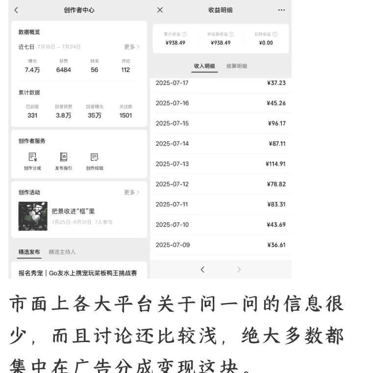

市面上各大平台关于问一问的信息很少，而且讨论还比较浅，绝大多数都集中在广告分成变现这块。

我认为其引流变现的价值被严重低估了，问一问是有作为个人 IP 战略级新机遇的潜力的。

我就想等我有一些引流变现的例子出现的时候再好好在星球写一篇帖子。

结果，mini 航海 5 分钟 450 个名额就爆满了......

一是感觉比较遗憾，没能及时把帖子发出来。

二是看到生财圈友热情这么高，我觉得我应该及时的分享我的想法。

所以我就赶紧把这篇帖子码了出来，越分享越幸运嘛。

## 一、什么是微信问一问？

微信“问一问”是微信生态内依托搜一搜的内容共创问答平台，通过用户提问，创作者回答实用信息，同时为创作者提供了流量和广告变现。

## 二、问一问入口在哪？

入口藏得比较深：微信“发现”页面 → 进入“搜一搜” → 点击前往“问一问”。

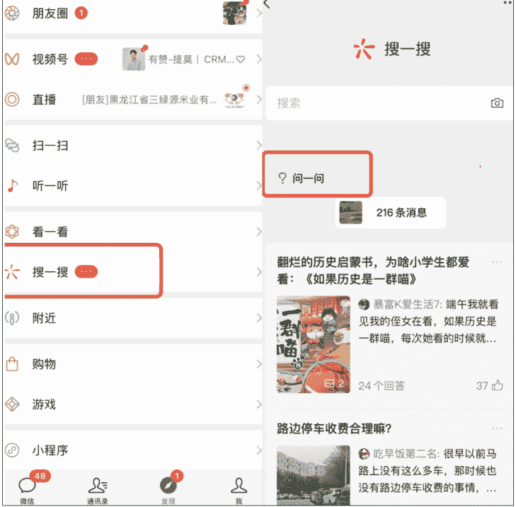

## 三、为什么推荐做微信问一问？

平台为了让大家积极回答，只要通过了“分成计划”，之后回答问题就能有广告分成收益。

收益方式和视频号、公众号的分成计划类似，你的回答评论区会有广告植入。这个广告收益只和曝光率有关，曝光高收益就高。这个广告只有在有评论出现的时候才出现，大家发布完回答的时候要习惯性的写上一句评论。

> 那个瞬间，你就知道他准备好"飞"了。

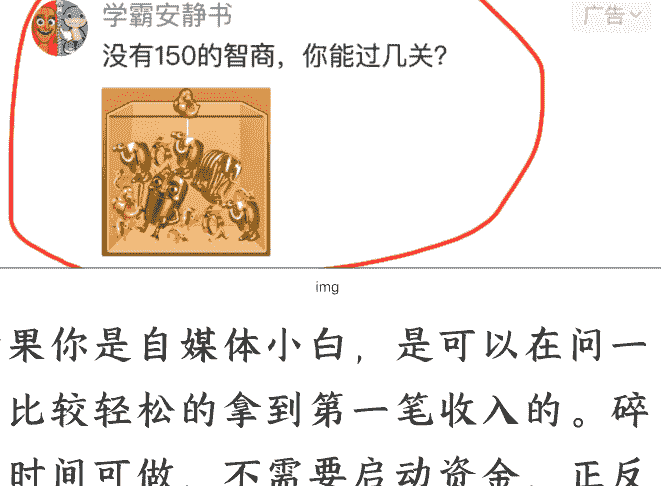

如果你是自媒体小白，是可以在问一问比较轻松的拿到第一笔收入的。碎片时间可做，不需要启动资金，正反馈也来得很快，快速的跑通闭环，之后能和视频号/公众号联动，有更进一步的拓展潜力。

关于广告收益，去年和今年第一个季度，每万次曝光量大概是 50+元的收入，现在降了一点，40 元/万次曝光。之前的创作者少，平台的推荐流量还挺大的，我认识的优秀作者反馈好的时候一天 3、4百的广告收益，甚至有过一天 800+，也有人做批量矩阵号。我自己的话开通分成不到 1 个月，广告收益快 1000 元了。下图是朋友今年早些时候的收益截图。

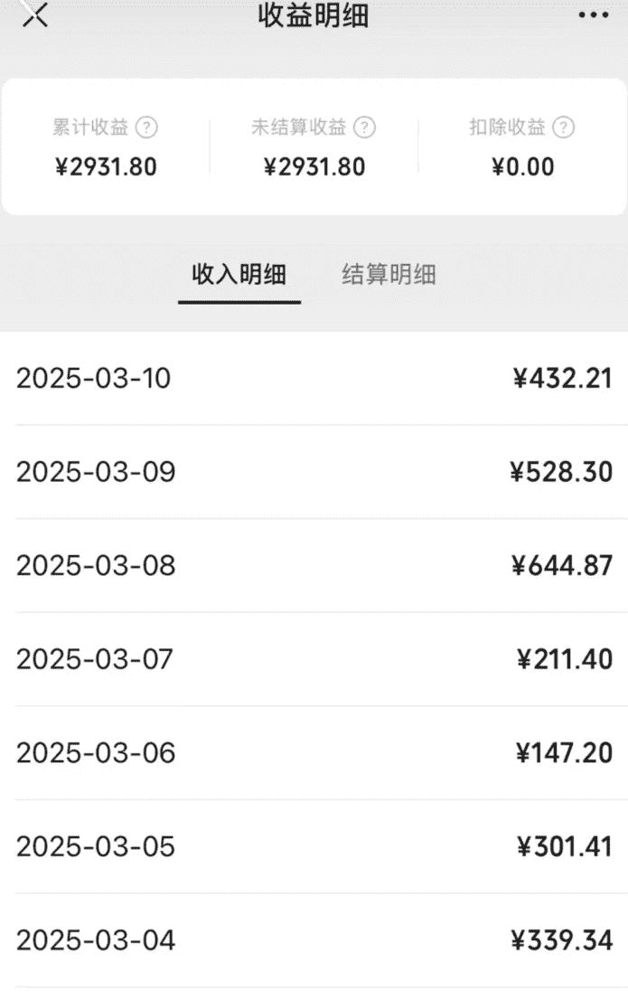

更大的价值还是引流变现，问一问中关注的粉丝是同时关注到视频号或者是公众号的，这块我后面再详细探讨。

## 四、怎么开通创作分成计划？

- 1) 近90天发布多于30条内容；
- 2) 有效关注人数大于100人；
- 3) 平台审核内容质量并通过。

懒人微信：lazyhelper

创作分成计划
创作优质内容，获得广告分成收益

申请后，待平台审核的条件
满足内容质量要求

申请条件
- 有效关注人数大于100人
- 近90天发布内容大于30条

我自己是写了 15 天的时候提交申请一次过的，后来我才发现很多人卡在审核这一步。而且每次申请审核的间隔期是不断变长的，我的一个学员甚至卡了 4 次……

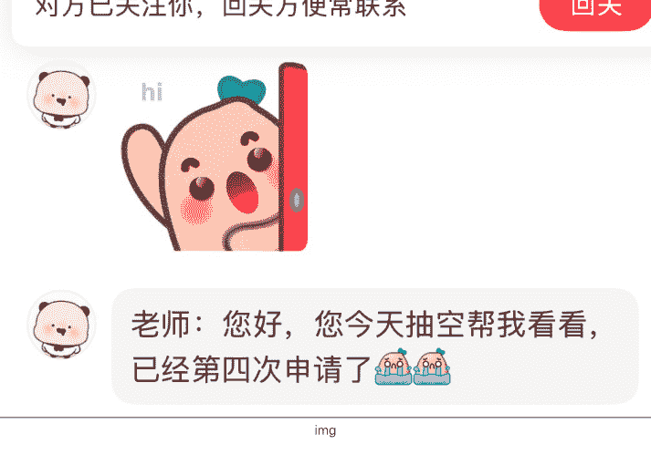

我想提醒一下特别是准备做垂直内容的圈友，优质的问题是会被回答完的，你回答过的问题无法再次回答。

懒人微信：lazyhelper

每个优质有热度的问题，都应该被认真对待。

关于有效人数100人这个门槛，作者之间互粉其实是可以，但比例不要太高，审核人员其实都知道的。

主要还是看内容，其实什么是好内容，官方的创作指南里面都有写。

**我觉得决定性的一点是要有自己可信的个人经历。**
怎么做到可信，就需要有细节感，有动作有对话，有自己独特的感悟，少一些总结和爹味。

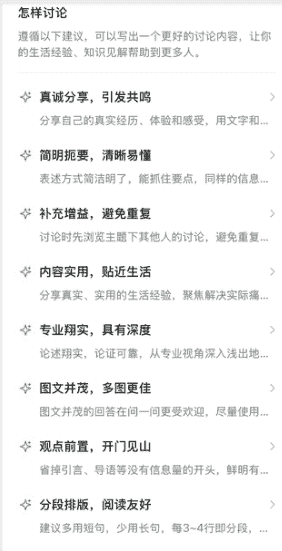

以上内容是偏科普的，后面的内容会加入我自己的实战经验和深入思考。

## 五、账号准备：是注册公众号还是视频号好？

如果你不是视频号强运营的话，都建议选择公众号做为你的答题身份。

懒人微信：lazyhelper

关注了你问一问的人会同时关注你的公众号/视频号。公众号里可以放二维码，可以设置自动回复，再加上钩子，比如：加好友送资料/送大额优惠券什么的，新加进来的粉丝关注公众号加到你微信的概率会高很多。这里有我的血泪教训，我第一个号选择的就是以视频号的身份来答题的。新增了1500多粉丝，主动加我微信的只有1人......视频号的数据虽然好了，但本质上还是属于公域，现在视频号的红利也快没了，离变现还是有点远的。

我近日又起了公众号身份的问一问，结果新增20个粉丝，就有4个主动加我的微信，引流到私域的效率天差地别。

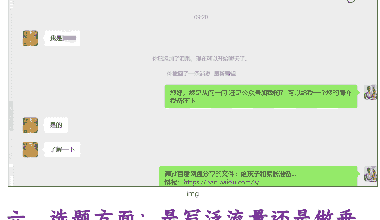

## 六、选题方面：是写泛流量还是做垂直流量？

非常建议做垂直方向的。为什么这么说？问一问平台已经快两年了，平台已经不太缺泛领域的创作者了。平台要的是更高质量的回答，这样的回答才能真正帮助到别人，所以平台一定会扶持专一领域的创作者（已经开始了）。

泛领域确实有优势：
- 门槛低
- 上手快
- 流量曝光好一些
- 短期广告分成收益高一些

但是有个很严重的问题：人是不可能面面俱到的。什么问题都回答，转粉率是很低的。哪天平台流量规则改变或者广告收益锐减，这类账号就会非常难受。

泛领域：那个问题热回答哪个？以曝光量为导向。
垂直领域：专注 1-2 个领域回答，以引流变现为主。

我拿我的例子和大家说说垂直领域的优势吧，垂直领域粉丝精准，粘性也好，适合长期深耕的。

而通过视频号或者公众号二次变现的手段就很多了，课程、社群、实物销售等等。

现在问一问内部的变现手段很单一，以后问一问平台很可能会推出付费问答、商单这些功能，也是垂直的账号价值高很多的。

这个加粉的效率，其他平台已经很难看到了。

大家可以仔细看看我的数据，曝光类没有泛领域账号多，但是点赞率和加粉率，目前为止，我没有看到过比我更好的。（下图左边是我的数据，右边是泛领域作者的后台数据）

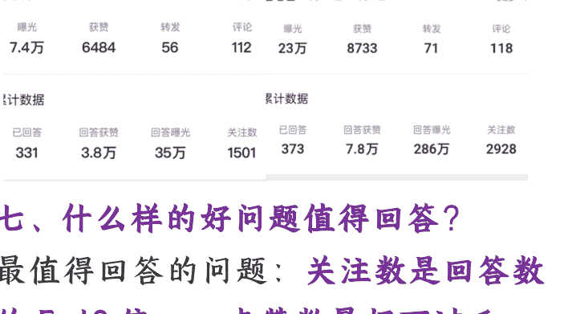

## 七、什么样的好问题值得回答？

最值得回答的问题：关注数是回答数的5-10倍，点赞数最好不过千。

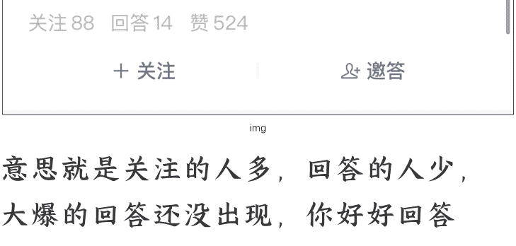

意思就是关注的人多，回答的人少，大爆的回答还没出现，你好好回答了，出爆款的概率就高。

如果你做垂直领域，优质的问题是会被回答完的，回答问题的质量永远是第一位的。一个回答跑出来，可能会在未来15天内都会有持续曝光的。

打开问一问就会看到一些问题，都是近期比较火的，但有个缺点，这些问题随机性强，不一定是你专业领域的。

所以我建议去问题广场选题，上面有所有问题的分类，找到自己要做的领域，就能看到对应的问题，从中选有价值的、你熟悉的问题入手。
定期收集高热度问题放在你的草稿箱中，方便之后回答。

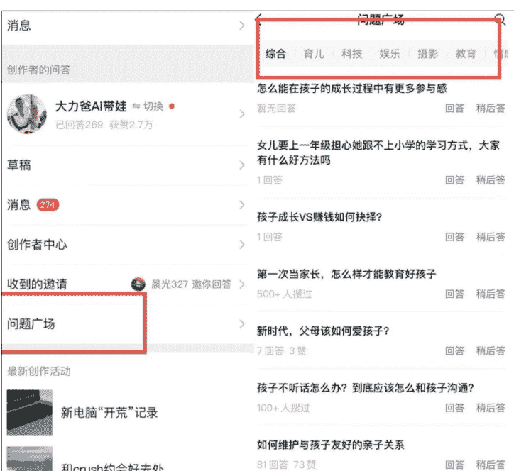

问一问作者圈子里有些说每天不要回答太多问题(系统上限是10个)，怕被盯上。我刚起号的时候每天10个都答满的，每个回答质量都很高的话也没问题。我现在依旧是每日写10个，只不过2个号分一分罢了。
一般的话，过了审核后，每日2-3个回答也就差不多了。

## 八、配图的来源

Ai生成的图片/网络图/漫画配图都是不行(图片方面审核还真挺严格的)。
建议平时多拍摄吧，自拍照、风景照、物品照都可以。主打的是在构图合理，画面清晰美观的情况下尽量保有真实感。问一问和小红书不一样，对图片的要求还不太高的。

小红书主打美感精致感，而问一问主打的是素人感，毕竟普通人的拍照水平就是很有限的。

图片最好也不要去小红书上扒，指不定就会出现重复的，或许去某宝买一些日常照片可能会是更好的选择。

> 原因分析
> 你的部分发表内容存在「缺乏实拍图」的问题，使用的AI生成图片/网络图/漫画配图等可能影响内容真实观感，分散用户注意力。
> 优化建议
> 优先使用贴近真实场景的图片，增强内容的真实感；如内容不适合配实拍图，可合理取舍，发布纯文字内容传达观点。

## 九、问一问究竟能不能用 AI 写？

*能！而且强烈推荐。

都是生财娘家人，我坦白的说，不用 AI 工具辅助，我一天是不可能回答 10 个高质量问题的。

但是 AI 和人的关系必须摆正:人是主导者，AI 是辅助工具。

如果你图省事，直接把问题甩给 AI 让它胡编乱造一通，再照搬复制，绝对不行。问一问平台对 AI 生产的粗糙内容打击很严。

Ai 工具承担 70%的基础工作，我专注最关键的 30%。

我用得最顺手的还是 Flowith（也可以用 PoE），里面我主要用 Claude，当然 Gemini 也不错。不得不承认，在写作方面，国内和国外的大模型还是存在相当大的差距。我的提示词目前迭代了12个版本，提示词给到 Claude，它能够很好的执行，给到国产的大模型，就出不了活。

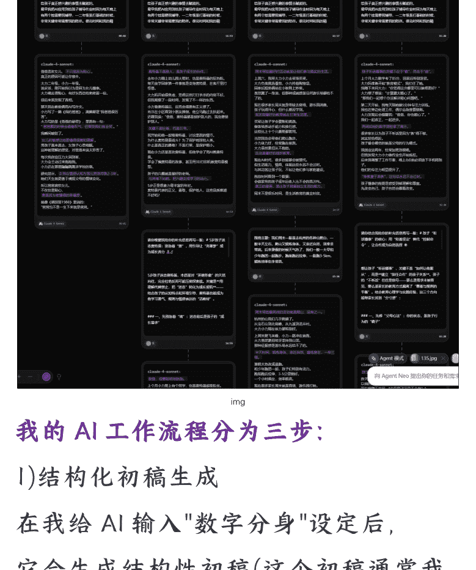

### 我的 AI 工作流程分为三步：

- 1）结构化初稿生成
在我给AI输入"数字分身"设定后，它会生成结构性初稿(这个初稿通常我不会直接使用)。

- 2）全网智能搜索
利用AI搜索功能全网收集相关资料，我主要是用get笔记里面的得到知识库。

得到是我目前觉得质量最高的通识类知识付费平台，能够有效的过滤掉低质量信息，理论上可以解决 90%的问一问问题。

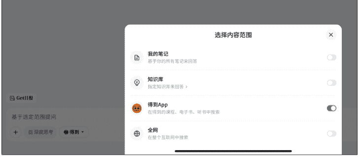

- 3）精准整合优化
筛选搜索结果中的可靠答案，结合我的个人观点和经验，对 AI 初稿进行深度修改完善。

这样，一个高质量的答案才完成。AI 在这里起到了提效和强化搜索的功能。

这些功能如果我手动完成的话，一个问题可能会花费我半小时以上的时间。现在我差不多 2 小时可以回答 10 个问题，效率和质量都得到了提升。

这是我认为正确的使用 AI 回答问一问的方式。

## 十、问一问被低估的引流变现价值。

对于个人、小公司来说，平台上的粉丝是属于平台的，哪天平台红利期过了就结束了，没有任何沉淀。

这方面我们有深刻体会，只有加到微信私域的粉丝才是自己的。

像我这样做教育垂直的，加好友的绝大多数是宝妈，后面我可以做付费社群，课程，也可以卖相关的吃穿用的产品。私域中快团团、群接龙这些分销工具都很成熟。我爱人就是快团团的团长，手里有性价比高的产品，就可以销售变现。

如果你手中有创业/副业类的知识付费产品，你就可以去职场/副业领域去深耕，加来的粉丝是不是可以做相应的转化。

如果你是美妆达人，就可以在美妆/时尚领域去回答问题，加来的好友是不是可以教美妆课程，推荐好物？

加到的精准粉才是最有价值的，不过这个过程会比较漫长。

以上的三个例子对应的领域都是问一问中流量大的赛道，有些领域流量小不一定能做起来。

在现在各个平台都流量见顶的时候，问一问这个加粉效率还是蛮高的。

之前我就想等我有一些引流变现的案例再来发帖的，现在看来，就是应该早点写出来。先完成再完善都来得及，项目不等人啊。

## 十一、问一问发展方向的探讨

- 1）流量入口的增加。

现在问一问的流量入口很深，而且是依附在搜一搜大板块下面的。虽然说在微信主页面的搜索框中搜索具体问题，问一问中回答会在很靠前的位置，但我对这个流量入口是存疑的。

我一个 2w 多曝光的回答，搜索流量只有 50，而且我已经回答了几百个问题，只有这一个是收到通知的。

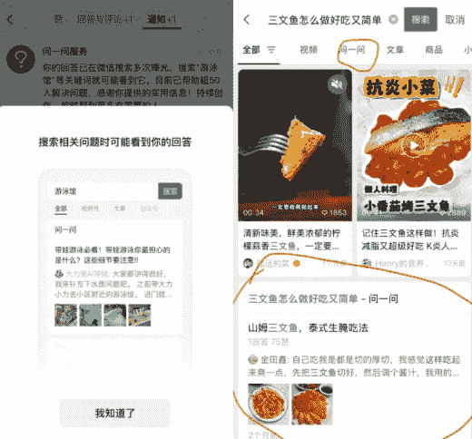

目前的问一问体量真的很小。我大胆猜测一下，问一问在发现页独立展示，或者是可以插入到视频号评论区展示，又或者它在看一看中被推荐，流量一下就会大很多。提前布局就有了意义。

- 2）平台变现工具增加。

目前直接变现手段只有广告分成。

后面平台极有可能推出更多原生的变现工具，比如：付费问答、内容赞赏、品牌任务中心等等，缩短变现链路，增加创作者的数量和积极性。

## 十二、潜在商业模式的探讨

### 1）培训类业务。

说实话，问一问 mini 航海 5 分钟抢完 450 个名额真的把我震惊了。这让我看到了这个需求是在的，我现在有一些学员，但还没有成体系化。

把问一问这个项目看成是副业项目，我觉得收费 199 元到顶了。

把问一问看成是个人/商家获客的项目，我觉得可以收到千元以上。

把问一问放入到大的 Ai 引流获客一系列培训项目里，里面可能包括小红书、视频号、公众号、私域的 AI 提效等等，我觉得可以卖到万元以上。

这样的话想象空间就大了，当然这个也要依赖于问一问平台的发展。

### 2）问答种草。

大家可以看看下面的问答，可以看做是纯分享，也可以看做是软广吧。

有点类似于小红书早期。吃的，穿的，用的，玩的都是可以推荐的。

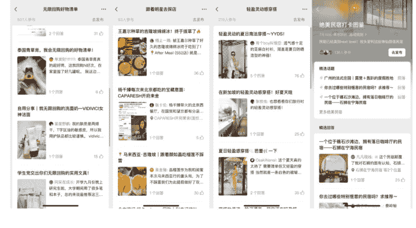

品牌方是不是可以用类似一个问题，邀请问一问作者中的 KOC 来回答有软广形式的内容，把这个话题“炒热”，也能完成品牌/商品的宣传。

如果这个方式行得通，那我就可以联合问一问各个领域的作者，和品牌方谈好合作，我再策划话题再进行分发。

总结一下，目前问一问这个项目是真的很小，但是不管在新人练手还是引流获客做放大都是非常不错的存在。以上的内容是我这个一个多月实操的所有经验和感悟了，写得比较匆忙，望见谅。

## 最后，安利小懒的付费群：

### 懒人专属群

- 懒人专属群持续更新中，已持续运营 6 年，整理超 3000 份各类精选付费文章 & 年费社群干货，全部开放下载。

本资料为付费群内分享，仅供真实有需要的朋友查阅 🕯️

### 懒人专属群更新记录：
https://lazy2025.top/#/blog/record2

### 懒人专属群更新记录（需梯子，备用）：
https://lazybook.fun/#/blog/record2