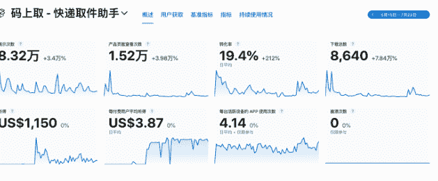
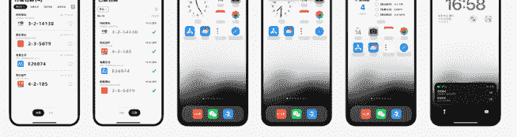
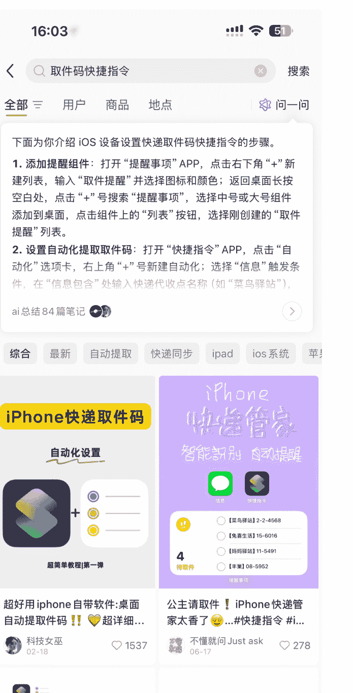
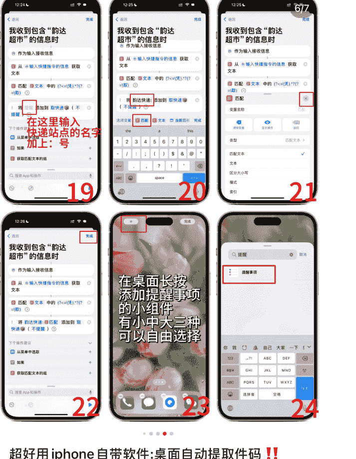
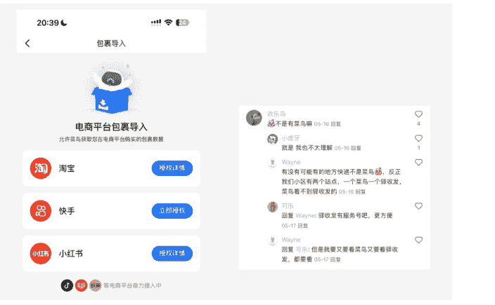
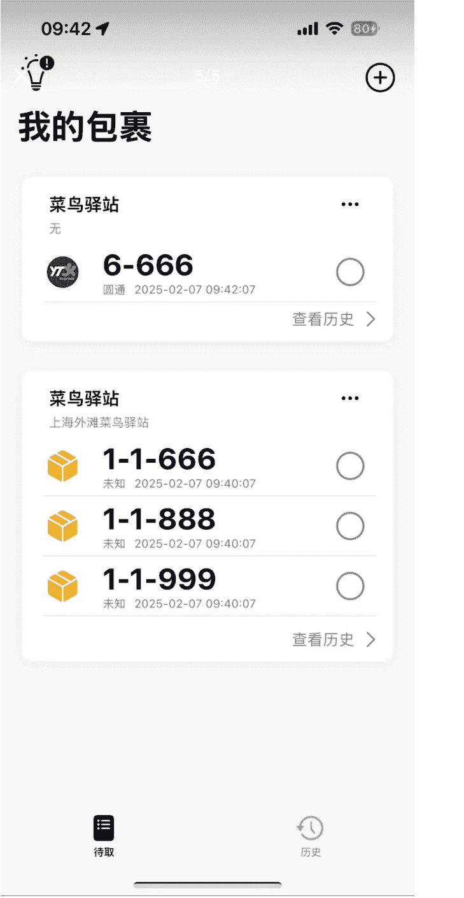
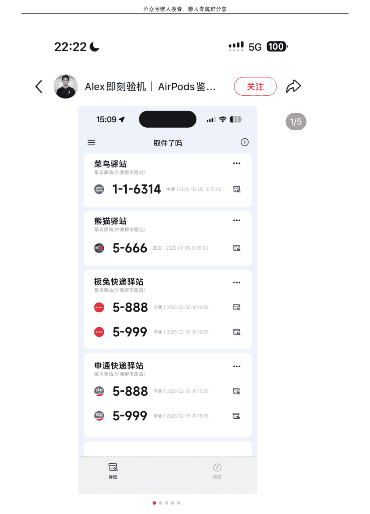
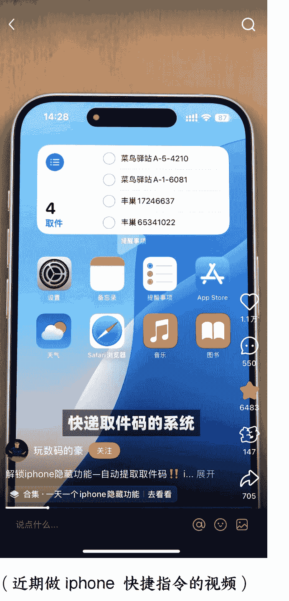
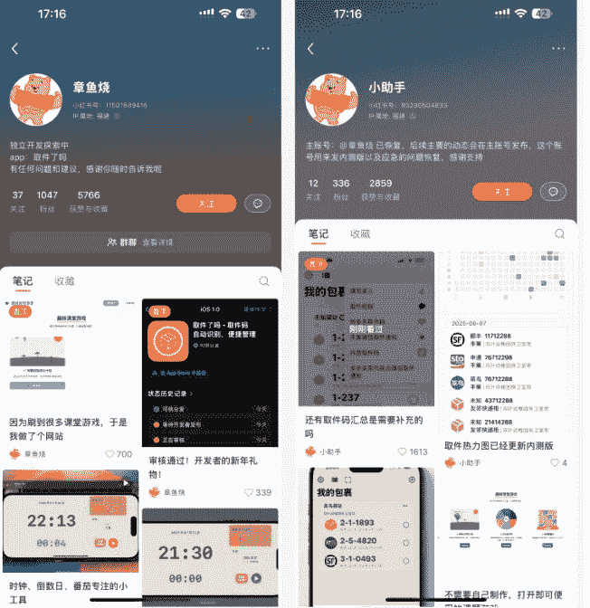
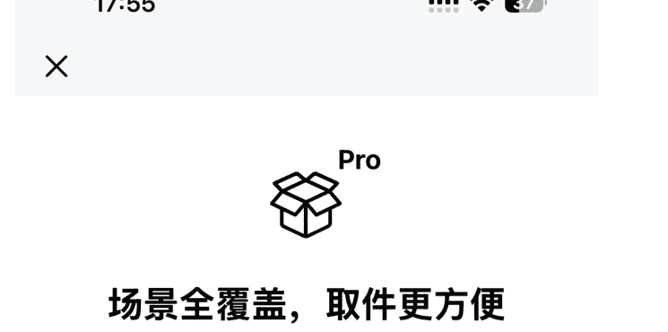

# 我是如何靠 AI 在 1 个月做出用户 1W 收入 1W 的产品

## 250728 生财精华

公众号懒人搜索，懒人专属群独享

懒人微信：lazyhelper


## 核心战果：

- 变现速度：产品上线首月即实现收入超1000美金。
- 用户增长：70天内，纯靠小红书冷启动，0成本收获10,500+真实用户。

本文将通过以下几个部分，为你完整拆解这款产品的打造过程：

- 机会洞察：从一个个人痛点，到发现一个被忽略的市场机会。
- 市场与竞品分析：如何在看似饱和的赛道中，找到精准的破局点。
- 增长与运营：详解小红书从0到1的冷启动策略与社区构建方法。
- 社区构建与正向循环：获取到种子用户之后如何通过持续运营保持数据增长。
- 商业化设计：差异化定价策略背后的思考。

# 一、关于我

大家好，我是大潘，坐标杭州，7年产品经理，目前在生财SCAI里（杭州）做产品中。之前做过C端产品，也做过B端，加入生财大概快5年了，除了小航海，没参加过其他的活动，很后悔浪费了这么多的时间。加入SCAI这段时间，我发现多参加生财的各种活动，真的能帮你快速扩圈建立人脉+提升能力，因此建议还在水下的朋友，可以多活动，真的很有帮助！

- 大潘 | 杭州 | B/C端7年产品 | SCAI成员 | 快5年的圈友 | 建议大家多参加生财的活动

# 二、本文的目的

本文主要拆解一些我做产品的思路以及流量获取的方法，我认为这两点的重要性远大于工具的使用，因此此篇文章主要围绕这两点来进行阐述。

# 三、我的产品

我做的是一款APP产品（目前已上架iOS，安卓需要从官网进行下载），定位是一款取件小工具，很幸运的是我做的第一款产品第一个月就月入千刀了，下面我会把我做这款产品的思路以及方法一步步拆开来讲，拆碎了讲，毫无保留，希望能对深海圈的同学和正在自己做产品的朋友一些启发。

## 3.1 数据如何

以下是iOS的后台数据，如果加上安卓，数据更好一点，但安卓刚上暂时没统计，暂且就先放iOS的数据了，统计周期是【5.15~7.22】。



(图1)

产品截图:



产品名称：码上取

产品定位：取件码自动管理工具

产品功能：用户收到短信，就自动帮忙提取其中的取件码到APP中，并且可以以组件和灵动岛的形式展示

视频介绍：

时间线:

- 产品上线：5月10日
- 产品推广：5月16日
- 开始收费：6月12日

### 运营数据：

- 下载数据：【iOS】8.6k+，上线时间 5.15
- 【安卓】1.9k+，上线时间 7.8
- 收入：扣除15%的苹果税之后的收入是$1150（注：订阅功能上线时间：6.12）
- 付费用户占比：8%（只统计了iOS，安卓未上线订阅）
- 周活：2000+
- 客单：30-40
- 首日推广效果（小红书）：获得1,000个种子用户（下载量）。
- 成本：极轻量，APP为完全本地化运行，核心功能通过正则表达式（正则）处理，满足了95%的用户需求，从而规避了大模型API调用和服务器的运营成本。

## 3.2 机会洞察：一个需求的诞生与验证

相信所有人都有过跨平台购买商品的习惯，我也是，我们家旁边的菜鸟驿站，每次来快递，都给我发取件码短信，而我每次去取快递，待在菜鸟驿站准备取快递时，第一步要么是打开各个平台APP（淘宝、京东、抖音...）里去翻找取件码，要么是打开短信去翻那一条条取件码，如果快递少，感觉还好，如果快递多，中间还夹杂着各个广告短信，翻起来就很麻烦，而且每家的平台发的取件码方式还不一样，以前我用丰巢的时候，还会在他们的公众号里给我发消息，因此每次取快递，都需要想一想啥快递到了，再去对应APP里翻找。

### 用户旅程：

- 1、人站在驿站->思考都买了啥->啥平台买的->打开对应的APP->看完开屏广告->然后一步一步的点进去翻看取件码
- 2、人站在驿站->打开短信->翻找短信->找到合适短信->点开查看取件码

瞧，一件简简单单的事，用户路径依然如此繁杂，取个快递还有这些流程要走，还要给各家APP贡献日活，还要看广告，还要在众多的短信中翻找，如果中间还夹杂着广告短信的话，翻起来更累了，用户体验是一点没有（虽然大家可能已经习惯了）。

于是，我就想到有没有一个工具，能够帮我解决这个痛点，这里就不得不夸大数据的🐷📱之处了，我有啥想法，就给我推啥，晚上我刷小红书的时候，就给我推了iOS取件码快捷指令，我一看，哟吼，这不就是正好切中我的痛点嘛，我赶紧上!

16:03
取件码快捷指令
搜索

综合 最新 自动提取 快递同步 ipad ios系统



（图三）

可是事实这个快捷指令并没有很好的解决我的问题，我小红书搜了教程，半小时过去了，我按照博主教程配置了半天，没有成功，而且那个教程十来页，又要学正则来适配我家快递小哥给我发的短信，问题是我就不一个手机，还得来回切，看起来就心烦，耐着性子试了几次还不成功，我放弃了，谁愿意学这玩意啊，还切来切去，但问题是这类型的笔记数据很好啊，动辄几千+的赞/藏，说明用户需求很大～

这个经历让我意识到两个关键点：

需求真实存在：快捷指令相关笔记动辄几千的点赞收藏，证明用户需求非常旺盛。

解决方案不完美：配置门槛太高，劝退了像我一样的大多数“懒人”。

一个清晰的创业点浮现了：既然用户们都在费力解决这个问题，为什么不给他们一个开箱即用的APP呢?

### 超好用iPhone自带软件:桌面自动提取件码!!

❤️超详细教程，看不懂的留言❤️

🌟这个我给放评论区置顶啦:(?<\凭).*?(?=\领)🌟



（教程虽好，但是实在是太复杂了~）

（图四）

那么再进一步，脑筋一转，既然我是懒人，那有没有一款能够不让我配置就可以直接用这个快捷指令的APP? 用户需求这么大!一定有市场，我千万不能告诉别人，我得赶紧做!

懒人微信:lazyhelper

可是当我做了调研之后，我发现，呵，我的确不是第一个想到这个的人，去年都已经有人在做事了，而且还有好几个同类的产品，人家都在小红书上运营了半年了，咋一看，数据还不错，心凉了一半，我还有机会么？

但我不死心，我再进一步深挖，我把我能够搜索到的这类的产品一一下载了，并且逐个体验，发现市场上有3个竞品，分别是“取件了吗”，“取件助手”，“ezicode”，一一体验之后，我又复活了，因为我发现他们太不能打了，UI做的土土的，交互做的不规范，信息架构不清晰，唯一还能看的对手，就是“取件了吗”，他小红书还在持续运营，并且用户应该是碾压后两者的，就把他当做主要竞争对手作为研究对象。

那么，如果我做这个品，我该怎么做才能超过我的竞品呢？我还有机会么？

需求挖掘路径：日常跨平台取件->懒人嫌麻烦｜体验不能忍->大数据推送iOS快捷指令->半小时配置失败->idea产生->调研相关产品->心凉半截->分析竞品->还有机会

tips:因此，当你有觉得你有一个绝佳的idea时，不妨先放一放，深入做一些调研，看看市场上有没有这类的产品，如果没有，可能说明你这个产品也没啥机会，之前做的人都失败了。如果有，并且数据不错，那你就需要好好研究下能不能打得过了，深入分析一下市场以及竞品做的不好的地方~

懒人微信:lazyhelper

## 3.3 市场调研：从心凉半截到发现新大陆

此处主要拆解我做产品前做的一些事情，看一下这个市场规模以及一些切入点，以当时的视角来看待这个事情

市场需求验证:

- 问题1：为什么市场上已经有菜鸟裹裹了，这类产品依然有强大的市场需求?
- 问题2：用户为什么不用菜鸟裹裹而是愿意去配置iOS快捷指令?
- 问题3：这个市场规模有多大?

问题1:为什么市场上已经有菜鸟裹裹了，这类产品依然有强大的市场需求?

之所以说“强大的市场需求”，是因为我发现很多做iPhone取件码快捷指令内容的博主，数据都不错。

但说实话，我在做这个产品前，并没有发现这个问题，因为我并没有下载“菜鸟裹裹”，而且我就是通过购物APP或者短信来获取取件码的，我家附近只有一个菜鸟驿站，因此我并没有发现这个菜鸟可以解决这个题目，但是当我发现用户有这样的言论之后，我开始意识到了信息差的存在。并且深入分析了下，发现有的用户家附近并不是只有一个驿站，可能会有2-3个驿站（例如菜鸟、驿收发、妈妈驿站等），那这个就很好解释了为什么菜鸟驿站没法解决所有的问题。



### 原因点分析：

- 1、菜鸟广告太多，用户不喜欢（但这个不是核心点，因为可以开长辈模式来解决，部分用户不知道而已）。
- 2、用户家附近可能有多个驿站，例如菜鸟，驿收发等，用户需要查看所有驿站的取件码。
- 3、菜鸟驿站也没法显示所有平台的取件码。

因此，在一部分人中不存在的问题，在另一部分人眼中就是痛点，刚需。

### 问题2：用户为什么不用菜鸟裹裹而是愿意去配置iOS快捷指令？

懒人微信：lazyhelper

该问题跟问题1强关联，因为最核心的是菜鸟没解决该部分人群的痛点，并且解决的也不好。菜鸟APP是想要看取件码，依然是需要打开APP才能看，那用户路径还是不够极致，如果能够直接锁屏或者组件上就能展示取件码，岂不更高效？

菜鸟APP查看取件码路径：点亮手机->解锁手机->找到菜鸟APP->点击打开->看开屏广告->查看取件码。而组件 | 锁屏 | 灵动岛就显示取件码则更加的便捷。

同时小红书的用户群体天然符合追求高效与体验的人群画像，因此，小红书上推广效率类的产品效果不错。

### 问题3：这个市场规模有多大？

此问题可以拆解成2个子问题，全国有多少家驿站 * 每个驿站的覆盖人群数量。

| 品牌名称 | 站点数量 | 单站平均覆盖人数 | 潜在用户群规模 |
| :--- | :--- | :--- | :--- |
| 菜鸟驿站 | 17万家 | 588人 | 1.0亿人 |
| 顺丰驿收发 | 17.9万家 | 800人 | 1.43亿人 |
| 中通兔喜超市 | 11万家 | 1000人 | 1.1亿人 |
| 圆通妈妈驿站 | 7万家 | 1000人 | 7000万人 |
| 韵达超市 | 5万家 | 1000人 | 5000万人 |
| 申通喵站 | 3万家 | 1000人 | 3000万人 |
| 极兔邻里 | 2万家 | 1000人 | 2000万人 |
| 其他第三方驿站 | 5万家 | 800人 | 4000万人 |

可见，全国除了规模最大的菜鸟驿站，依然有其他的品牌的驿站，处于群雄割据状态，假设我只做好除菜鸟驿站之外的潜在用户群的服务,那对于我这样一个新手小白来说也远远足够了,毕竟我对这个产品的最初期望就是能挣到1000块钱就够了。

市场规模足够大,除菜鸟外,其他每家驿站各有各的取件码通知方式(如兔喜通过小程序通知,丰巢通过服务号通知等)

## 3.4 竞品分析

分析竞品,主要从2个层面去分析,流量和产品。亦仁老师说过,做产品之前要先做流量,如果流量做不起来产品也不需要做了,以下我会用我的案例来验证亦仁老师的上帝视角~

### 3.4.1 产品层

产品上,我通过翻竞品的小红书评论区,以及自己的体验,发现竞品的作者应该是也是非专业选手,做的产品有一些不足的地方。



#### （竞品APP首页）

#### 竞品存在的不足：

UI层面审美不够，但！用户居然主动的帮他优化UI，这是什么神仙用户！再进一步，帮他优化的UI都千赞，这是什么需求量啊~



（用户帮他的优化的UI稿）

- 信息架构不清晰。
- 交互不符合大众习惯。
- 产品细节上扣的不够。
- 不支持iOS 17以下。
- 短信识别精准度还不够。
- 安卓不支持（因为他没安卓设备）。

懒人微信: lazyhelper

以上信息是体验他的APP+翻看他的每一条笔记的评论区得出来的，建议大家分析竞品的时候，多看看真实的用户反馈～

他做的不足的地方，就是机会点与切入点～

### 3.4.2 流量层

此处，我会思考3个问题：

- 1、有这个需求的用户都已经被他获取完了么？
- 2、如果用户没被竞品没获取完，有增长空间，那我能做出流量并且超过他么？
- 3、除了增量空间，存量用户中，我能把他的用户转成我的用户么？

问题1：有这个需求的用户都已经被他获取完了么？

通过观察“取件码快捷指令”这类的视频，我发现近期有做iPhone快捷指令的博主依然在做这类的视频，并且很快就万赞了！说明一个问题：

依然有用户不知道，存在信息差，那这个市场就存在增量空间（思考了下，主要应该有2个原因，1、是因为笔记的曝光是有限的，总有用户触达不到。2、是因为有新的iPhone用户进来。3、用户当前的兴趣不在快捷指令上，算法不会推给非潜在用户，除非他哪天感兴趣了～）【图1】

懒人微信：lazyhelper

另外发现一个情况：竞品近期的笔记，近一个月就数据快速增长到千赞以上，说明竞品也在快速获取用户中，还有增长空间。



（近期做iphone快捷指令的视频）

结论：用户远远没被竞品获取完，产品依然存在增量空间。

懒人微信：lazyhelper

### 问题2、如果用户没被竞品没获取完，有增长空间，那我能做出流量并且超过他么？

分析竞品的流量起盘方式，发现比较素人，肯定没参加过生财的小红书航海，账号的搭建和笔记正文让人感觉比较凌乱，关注意愿较低，但就这，数据依然强悍，说明市场需求真的很强烈啊～



（竞品账号主页）

账号层面存在的问题：

头像：跟产品没任何关系。

简介：应该主要介绍我是谁，我做了什么产品，这个产品是干嘛的，让人点进主页，能够直观清晰的知道。

正文：

a) 笔记封面较为随意，整体调性、色彩搭配缺乏美感，审美不足，会感觉较为混乱，我问了我身边的朋友，关注这类账号的意愿比较低（小红书姐妹们对审美的要求还是挺高的）。

b) 他的笔记中只有图文，没有视频，而我们知道小红书对视频流量的倾斜要超过图文（视频更能抢占用户时长～）。

那，好像要体现出产品的专业度，我只要70分即可超过他，UI设计上，不需要设计师的水平就可以达到，那努努力还是有希望的。

（此处要感谢生财的航海，以前参加过几次小红书相关的航海，虽然没做出大成绩，但是60分的认知以及水平肯定是具备的了）

结论：流量层面，他的账号比较素人，那我稍微有点专业度与辨识度应该就可以超过他，并且我觉得可以做出较好看的封面与笔记，内容丰富度上我也会做视频，因此流量上应该不至于太差。

### 问题3：除了增量空间，存量用户中，我能把他的用户转成我的用户么？

此处主要从产品层面中入口，着重分析竞品做得不好的地方。例如：

- UI层面，我是否能够做的比他精致。
- 信息架构层面，我是否能够做的比他清晰。
- 交互层面：我是否能够做的更加符合直觉。

功能层面：短期我应该没他做的那么完善，但没关系，我可以卖空气～

最重要的一点：你的体验相比竞品怎么样？用户的迁移成本高么？不然凭什么让用户迁移过来呢？

TIPS: 俞军老师产品方法论中：新体验 - 旧体验 > 迁移成本，建议大家做产品的时候，想想是否满足这个公式，毕竟已经2025年了，用户已经不愿意再下APP了。

可是在实际过程中，我发现对于这个产品，功能上很很难做出差异化，那么我还可以从哪些地方做出差异化呢？在经过深入的分析之后，我发现还可以从定价上做出差异化，后续实际对产品进行定价的过程中，我会详细聊聊我的分析。

结论：竞品的流量运营水平不高，我只要运用一些基础的小红书运营知识，打造一个更专业、更有美感的账号，就有很大机会在流量上实现反超。

## 3.7 核心打法之暗影复刻

因此，在做完产品层面和流量层面的分析之后，心里大概有了数，认为这个项目还是可以值得搞一搞的。其实可以看出，对于这个产品，我最开始的痛点是源于自己的需求，并且我发现网上有很多人有相同的痛点，但是市面上的产品“菜鸟裹裹”没法很好的满足所有人的需求，大厂短期内也不可能解决所有的痛点，我只需要找到不在菜鸟射程范围内的用户群，来服务好他们即可。

小排老师的产品方法论中，其中有一个需求挖掘的方法，叫【暗影复刻】，大概意思就是复刻头部产品20%的功能，然后找到该产品未覆盖到的垂类人群、场景，针对他们解决这类人群遇到的问题，我在做这个产品的过程中，进一步加深了我对这个需求挖掘方法的理解。

# 四、增长与运营：从冷启动到商业闭环

亦仁：做产品前可以先做流量试试，如果流量做不起来，产品也可以不用做了

事实证明，亦仁老师这句话真的太对了！

我在5月初上线了App Store，没做任何推广，一周过去了，我发现只有个位数的下载量，每天就3-5个，其中还包括了我身边的朋友，当时每天起床第一件事就是去刷Connect看看产品昨天又有几个下载了，但每天都是失望，我开始意识到不行了，我需要学习小红书独立开发的博主，在小红书上推广下自己的作品。

很幸运的是，我当时随意发的第一篇帖子，1天内就阅读破万了，很多用户留言怎么怎么下载，同时也有很多用户留言，说这不就是菜鸟么？也有用户说这是伪需求，慢慢的，浏览量越来越高，第一天我就差不多获得了1000个下载，作为宝贵的种子用户。（用户的互动对笔记的CES评分非常重要～）

### tips:

- 1、都2025年了，酒香也怕巷子深，独立开发必须学会如何推广自己的产品。
- 2、我发的第一篇小红书并没有太多技巧，真的是很随意，但数据反而不错，让我意识到市场需求的重要性远远大于任何流量手段，因为现在算法太聪明了，只要你有合适的解决方案，推荐算法就能帮你找到合适的用户。

# 五、社区构建与正向循环：

当用户尝试使用你的产品后，你一定要及时的引导用户去进群沟通，同时在群里积极的回复用户的问题，用户就会感觉这是一个“活人感”与“我就是你身边的普通人”这一种形象，同时积极的汇报当前BUG修复进度，用户对你的信任会大大提高，特别是当后面转化，推出Pro的时候，即使Pro会员可用的功能只比普通用户多一个，但因为信任，依然当天就有60个用户进行了订阅。

用户沉淀：将用户引导至小红书群。

积极互动：进行高频、紧密的交流（可以是解答用户问题，汇报进展等）。

# 六、商业化设计：定价、转化与竞争策略

## 定价

“卖空气”策略：6月12日上线收费时，Pro功能仅完成了第一个（灵动岛功能），其他功能均标注为“开发中”。但在这近一个月来我不断的解决用户的BUG，积极与用户互动，用户天然产生了信任感，因此用户付费的核心驱动力是基于高频沟通建立的“信任”。



## 场景全覆盖，取件更方便

| 功能对比 | 免费版 | Pro版 |
| :--- | :--- | :--- |
| 基础取件码管理 | √ | √ |
| 智能短信解析 | 30条/月 | 无限制 |
| 历史取件记录保留 | 最近50条 | 无限制 |
| 待取件通知 | × | √ |
| 未取件定时提醒 | × | √ |
| 实时活动 | × | √ |
| 取件码多人自动共享 | × | 开发中 |
| Widget小组件 | 基础版 | 个性化组件(开发中) |
| 截图自动识别取件码 | × | 开发中 |
| 暗黑模式 | × | 开发中 |
| 取件统计 | × | 开发中 |
| 云端同步 | × | 开发中 |

包年 (¥25.00/年)

终身 (¥39.90) 早鸟价 限时特惠 | 每满50人涨5元

隐私政策 | 服务条款

阶梯式定价：对早期用户提供更优惠的价格，后期逐步涨价。这能让老用户感觉“赚到了”，并给新用户制造“再不买就亏了”的紧迫感。

差异化定价策略：对于竞品，采用根据代收点个数进行定价（若超出 3 个代收点，则无法看到取件码），那么我就不能采用这种方式，而是采用按解析条数来进行定价，这样竞品中对代收点个数有要求的人群自然就会转成我的用户。

# 七、结语与思考

回顾整个过程，这个产品的成功源于一个微小的个人痛点，并通过对市场、竞品和用户的深度洞察，找到了破局的机会。而之所以能够有变现，最主要的还是切中了一些人群的痛点，这个痛点具备了如下特征：

- 高频（取快递对部分人群，尤其女生来说算是高频场景）
- 刚需（在这个品之前，没有很好的解决方案，而这个品出来之后，用户会觉得很有趣，愿意去尝试）
- 符合人性（人性都是懒惰的，而这个品提供了更好的体验，精简了用户路径。）

因此，在我看来，若你的产品具备了这些点中的 2~3 条，那你成功的概率会大大的增加～

希望我的复盘，能给你带来一些价值。

最后，安利小懒的付费群：

## 懒人专属群


微信: lazyhelper

懒人专属群持续更新中，已持续运营 6 年，整理超 3000 份各类精选付费文章 & 年费社群干货，全部开放下载。

本资料为付费群内部分享，仅供真实有需要的朋友查阅

### 懒人专属群更新记录：

```
https://lazy2025.top/#/blog/record2
```

### 懒人专属群更新记录（需梯子，备用）：

```
https://lazybook.fun/#/blog/record2
```