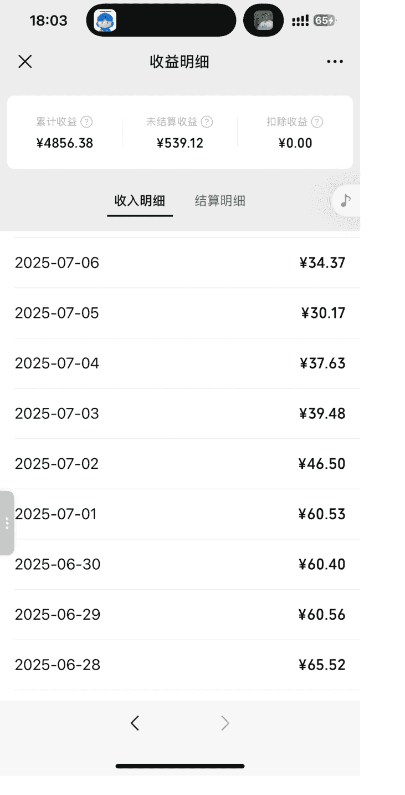
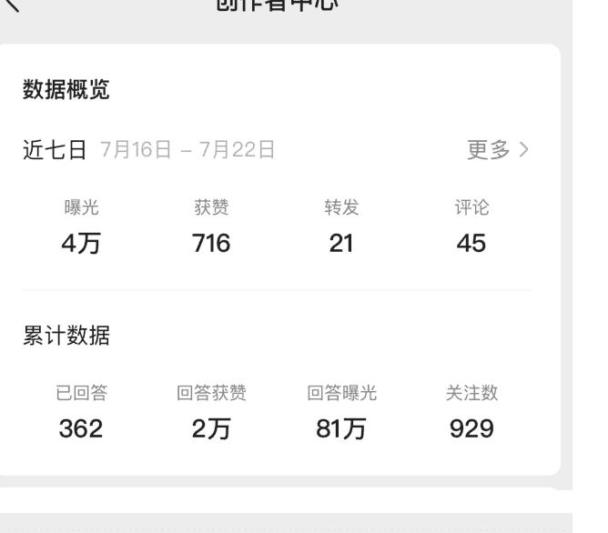
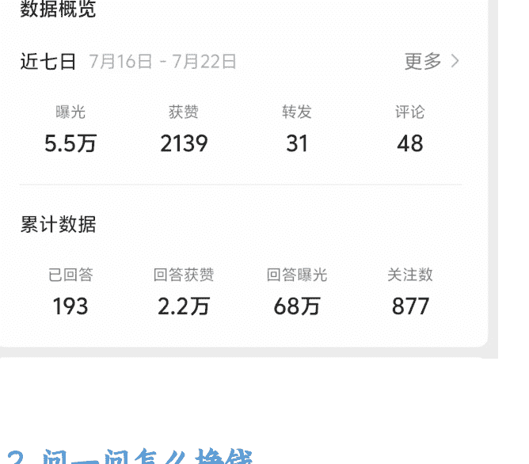
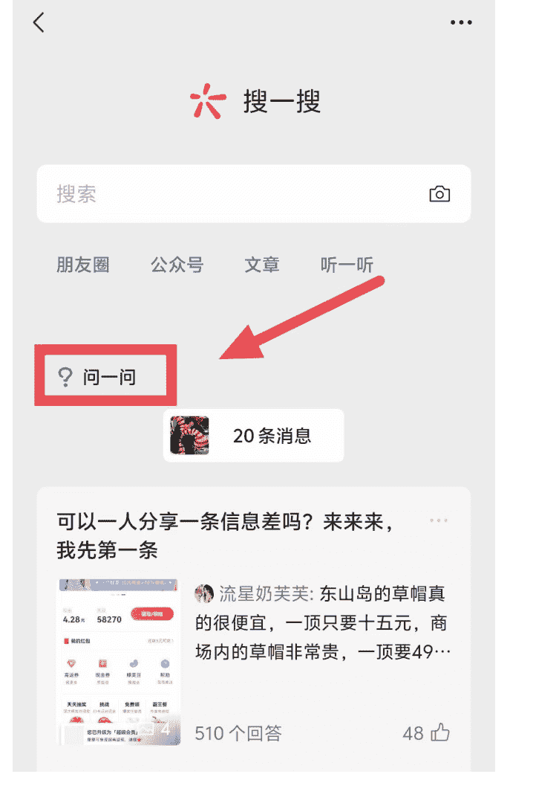
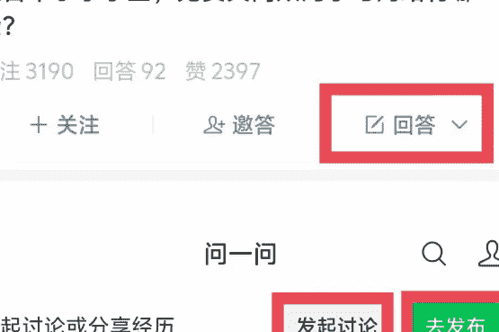
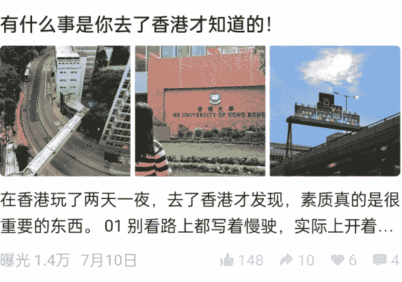

# 潜力项目问一问，素人变现 4 位数、涨粉 2k 的技巧分享

250728 生财精华

公众号懒人搜索，懒人专属群独享

懒人微信：lazyhelper

大家好，我是嘻嘻姐。
读研靠自媒体挣到人生第一个 20w，毕业第 2 年独立买房，之前跑通项目有保研辅导和 IP 公众号，均变现 6 位数，目前主做公众号和问一问项目。

最近问一问频繁有小动作，我将观察到的点分享到生财，收获了一条中标，随后有不少圈友来问问题。

于是我想着给大家分享一期问一问创作和避坑心得，希望帮助素人圈友挣到自媒体的第一块钱。

## 一、为什么做问一问

当时是在生财看到了关于问一问的风向标和帖子后，又在朋友圈刷到有朋友通过这个项目挣到了钱，心想就带大家也试试。

于是，在今年三四月份的时候，和我的私教学员们内测了这个小项目，她们每天花一点点上厕所、排队的碎片化时间，现在都已经挣到了4位数或者近4位数。

### 收益明细
- 累计收益：¥4856.38
- 未结算收益：¥539.12
- 扣除收益：¥0.00

### 收益明细
- 累计收益：¥2401.94
- 未结算收益：¥273.28
- 扣除收益：¥0.00

### 收益明细
- 累计收益：¥1382.10
- 未结算收益：¥360.94
- 扣除收益：¥0.00

### 收益明细
- 累计收益：¥842.93
- 未结算收益：¥228.58
- 扣除收益：¥0.00

### 收益明细
- 累计收益：¥1651.96
- 未结算收益：¥276.44
- 扣除收益：¥0.00

### 收益明细
- 累计收益：¥1577.66
- 未结算收益：¥459.01
- 扣除收益：¥0.00

重要的是，大家都是从纯素人小白开始做的，而且都不是全职，纯粹就是边玩边赚的心态，因为这个项目只要愿意持续地做，都会有收益。

懒人微信：lazyhelper

## 二、问一问优势

### 1.1 问一问有什么优点
优点一：对素人友好，输出简单

问一问这个平台，内容发布不要求文采好，语言通顺就可以，所以对于大部分普通人来说，输出都不难。另外，内容的发布限定字数 500 字，通常一篇内容只需要写两三百字就够了，对于输出长篇内容有困难的人来说，门槛无疑就降低了。

优点二：能挣钱，长尾流量很好

问一问开通创作分成计划以后，只要你持续的去发布内容，就可以一直有收益，而且收益不是一篇跑，也不是近期写的才会跑，是所有的都有可能跑，它的收益是完全的复利形式。

优点三：能涨粉，实现一鱼多吃

问一问的账号身份是视频号或者公众号，而不是单独的一个账号，所以它的粉丝会积累到你的视频号或者公众号账号上面。

懒人微信：lazyhelper

如果你想对某个公众号或者视频号去做一个冷启动，那它就可以帮你积累第一波粉丝。如果你在问一问分享的内容比较接近你的专业或者你的副业领域的话，还有机会通过视频号或者公众号转化到私域再进行变现。

#### 涨粉数据案例：
| 数据概览 | | | |
|---|---|---|---|
| 近七日 7月16日 - 7月22日 | | | |
| 曝光 3.6万 | 获赞 892 | 转发 35 | 评论 45 |
| 累计数据 | | | |
| 已回答 395 | 回答获赞 5.2万 | 回答曝光 173万 | 关注数 1992 |

| 数据概览 | | | |
|---|---|---|---|
| 近七日 7月16日 - 7月22日 | | | |
| 曝光 3.5万 | 获赞 1459 | 转发 28 | 评论 31 |
| 累计数据 | | | |
| 已回答 308 | 回答获赞 3.4万 | 回答曝光 93万 | 关注数 1227 |

懒人微信: lazyhelper

### 1.2 问一问怎么挣钱
问一问和公众号一样，都是挣流量主收益。在开通分成计划以后，问一问的评论区会出现广告，类似于公众号文末广告，产生曝光和点击的收益。

#### 问一问开通分成计划的要求：
质量过关（这是最关键的一点，很多人篇数和粉丝也够了，但就是通不过，具体技巧我们后面讲）
懒人微信：lazyhelper

- 90天内发布30篇内容（非常简单，大家都可以做到）
- 100个粉丝（如果内容够优质，契合问一问官方推荐的方向，也有机会跳过这个门槛）

与公众号不同的是：公众号需要500个粉丝才能开通流量主，但是问一问只需要100个粉丝就可以开通流量主，而且甚至有时候不需要100个粉丝就可以开通（我陪伴群已经有学员在没有100个粉丝的基础上就被邀请开通分成计划了）。

### 1.3 问一问适合什么人
#### 第一类：分享欲望很强的人
问一问平台，你可以想象成是一个类似于微博或者朋友圈一样的平台，就是你可以去自由分享一些吃喝玩乐的照片，然后加上感悟或者经验分享的地方。

#### 第二类：想要挣钱的自媒体新手
做自媒体三四年，我看到的最简单的项目，除了小绿书，就是问一问了，普通新手也可以很快得到正反馈，他不要求你要垂直在某一个领域去发内容，而是说你看
懒人微信:lazyhelper
到的任何新奇的、值得分享的内容都可以去发。

#### 第三类：想要记录生活、边玩边赚的人
有很多人都喜欢出去玩，然后也拍了很多照片，但总觉得发在朋友圈很不好意思，那这时候就可以发到问一问，问一问就是一个既可以让你把自己的分享欲望发散出去，又可以挣到钱的平台，真的是边玩边赚。

比如：我去打卡了某家店，我觉得有些菜还不错，我记录下来吃的感觉，下次去就可以翻出这篇帖子看看我上次吃的是什么。

## 三、问一问怎么做

### 2.1 问一问入口
问一问的入口：
微信 >> 发现 >> 搜一搜 >> 问一问

懒人微信: lazyhelper

问一问没有单独的平台，也没有单独的APP，我估摸着类似于腾讯的一个测试项目，小绿书废了，问一问又起来了。目前的问一问给人的趋势感觉就是往“知乎”+“小红书”在发展。

小红书目前有个优势就是，大家有什么问题都喜欢去小红书搜，因为小红书总是可以给出图文并茂的答案，而且平台非常的活跃，之前的小绿书就是想模仿小红书，结果太多的人走了搬运的路子，给平台造成了很多的垃圾内容，价值感就提不上去了。

问一问的出现，本身有天然的优势，用户基数大，且便于传播。而且大家有问题也会去微信里面搜一搜，但是传统的搜一搜得出来的答案一般都是长篇大论的推文，现在提供一个短小精炼的内容平台就会非常有优势。

### 2.2 问一问如何写内容
问一问发内容有 3 种形式：发布、回答、讨论。

写内容的入口：

三种形式的区别：
- 发布：自己发帖，类似于在小红书发布图文笔记；
- 回答：在别人发布的帖子下面接着这个问题去回答；
懒人微信：lazyhelper
- 讨论：发起一个讨论的话题，然后写回答。

三种形式的优点：
- 发布：有利于提高账号权重，是开通分成计划通过质量关的核心；
- 回答：有利于增加曝光，问题挑得好，关注的人就比较多；
- 讨论：有利于增加曝光，相对于回答，主持人在讨论下回答的问题会获得更多的被动关注，可以想象成被置顶了，是对主持人的一种奖励。

#### 问一问的排版技巧：
注意阅读的呼吸节奏，每 2-4 行作为一段，每段之间空一行，字数写 300 字左右就好。

比如：
暑假玩水不可少，安全更重要！
隔着屏幕都能感受到绝望。
那些未开发的野河、暗流涌动的桥洞、看似平静却暗藏漩涡的水域，对孩子来说都是致命陷阱。
然后是不能离开视线!
就算是去安全的水上乐园，充气浮具侧翻、防滑垫打滑等意外也防不胜防。
有些家长觉得”有救生员在、孩子会游泳就没事”，但溺水往往发生在几秒之间。
前年在水上乐园，我转身拿毛巾的半分钟，4岁儿子就差点被滑梯冲下来的孩子撞倒呛水。
从那以后我就记住：哪怕是正规泳池、儿童戏水区，也绝对不能离开孩子的视线!
后来我带娃去泳池的时候，手机直接调成静音锁进储物柜，全程像"人肉监控"一样紧盯孩子动向。毕竟安全没有万无一失，只有百分百警惕!
你带娃玩水时遇到过哪些惊险瞬间?在评论区分享分享经验，咱们一起守护孩子的夏日安全~
江苏 7月2日

### 2.3 素人高曝光赛道选择
问一问和其他平台不同，它目前不限制个人分享领域，反倒和打造IP很像，它需要真人感，有个人定位后，围绕自己的生活相关去分享都非常好。

如果一定要分享赛道的话，当前来讲，官方比较推荐写的赛道和小红书早期赛道很像，结合官方小助手的答疑和个人经验分享5个素人建议入手的赛道。

#### 赛道一：旅游赛道
暑假正是旅游高峰期，我用小号测试了7月份的数据，这类数据的转粉和曝光明显要高很多，非常建议发，我这边有学员10天就有了100+粉丝。

举个例子：

#### 赛道二：育儿和宠物
不管是宝妈宝爸带娃，还是养宠物，只要是和这些人群相关的，点赞数据都很好。

例如：
第一次养猫，想选皮实好养一点的猫，
还能给足情绪价值，特别是I人真的真的很适合养橘猫，因为橘猫话超级多，而且很粘人，每天都会 在门口等着你回来摸摸他，简直像小狗猫，走到哪里跟到哪里

其实我之前也想过养品种猫猫，比如说英短，金渐层或者漂亮的布偶猫，但是周围朋友也养了，他们三天两头要请假，带着猫猫去看医生，不是肠胃功能弱就是感冒，打工牛马表示我都替他们累

我比较支持领养代替购买，有很多流浪猫猫都是流二代，适应能力稍微好一点，但也是风吹日晒饥一顿饱一顿，有今天没有明天，我们如果伸出援手，碰到带回来一只，他们会感恩我们的救助，会变得超级乖又很粘人

还有一些猫猫是因为主人搬家或者怀孕，各种原因不方便养，所以被赶出家门，在外面没有生存能力，如果没有好心人救助，长期以往可能因为营养不良或者未知的风险而丢了猫命，如果我们能带回家，稍微打理就会还原美貌，他也会感激我们的付出，变成我们的生活搭子，提供超多情绪价值

隔着屏幕都能感受到绝望。
那些未开发的野河、暗流涌动的桥洞、看似平静却暗藏漩涡的水域，对孩子来说都是致命陷阱。
然后是不能离开视线！
就算是去安全的水上乐园，充气浮具侧翻、防滑垫打滑等意外也防不胜防。
有些家长觉得"有救生员在、孩子会游泳就没事"，但溺水往往发生在几秒之间。
前年在水上乐园，我转身拿毛巾的半分钟，4岁儿子就差点被滑梯冲下来的孩子撞倒呛水。
从那以后我就记住：哪怕是正规泳池、儿童戏水区，也绝对不能离开孩子的视线！
后来我带娃去泳池的时候，手机直接调成静音锁进储物柜，全程像"人肉监控"一样紧盯孩子动向。毕竟安全没有万无一失，只有百分百警惕！
你带娃玩水时遇到过哪些惊险瞬间？在评论区分享分享经验，咱们一起守护孩子的夏日安全~
江苏 7月2日

#### 赛道三：车/房赛道
有钱的老板可以看看车子、房子相关的题目，热度也很高。

为什么奔驰E的销量那么好，到底都什么人买？
我问了同事才明白，为什么都是老板之类的会买奔驰e，还对奔驰其他系列有些了解

买奔驰e的，年龄基本都在35-45岁这个区间，正是事业稳定上升期，上次有机会坐了老板的奔驰e，车里面那种内敛的豪华感，特别符合这个年龄段对生活品质的追求

很多人买它是因为也是因为它刚好在奔驰系列里面算比较好中档的，我同事就说的比较明白，开S级奔驰见客户显得太高调而且又很贵

C级又显得不够格，E级刚刚好比较商务，这话虽然有点扎心，但挺真实，很多老板买车就是为了撑场面，既要体面又不能太跳

不过呢，我下班的时候也发现还是有不少女性车主选奔驰E的，奔驰e本身后排空间能放孩子的东西，接送爸妈也方便，一车多用，既满足工作需要又兼顾家庭，性价比还挺高的

它打中了那群既要面子又要里子，既要商务体面又要家用舒适的都市精英的痛点
广东 7月9日

对汽车一窍不通，怎样才能选购合适的车
买车的时候大家一定要注意，我刚开始和销售在电话里面沟通好细节，然后确定好我要去看车的时间和地点，再带上我的朋友一起去谈价格。

谈价格的时候一定不要被他报的价格所忽悠，这个价格不是底价。并且谈好两次价格之后，大家也还可以进行杀价，让他上报经理，再申请一点优惠。

价格谈完之后，再就是购车福利这些，这里有一个点需要大家注意：4s店的赠品不能要，像一些电卡油卡免费保养，值不了多少钱。不要听那个销售说的好听，我送你几千块钱的东西。

这里推荐大家可以要全车贴膜，汽车延保，还有隐形车衣，这三样福利，大家可以选两样，和销售使劲的谈。

最最最重要的一点，一定要多试驾几款车型，这样你才能够体验到自己究竟喜欢哪种车，不要只看一两家，这样你会错过很多优秀的车商。

买车不是一件小事情，大家多看多问，就会买到适合自己的车
重庆 4月30日

#### 赛道四：AI相关
AI 热度很高，很多圈友都有 AI 技术相关的底子，简单分享一些技巧或者逻辑就可以圈粉和大曝光。
懒人微信：lazyhelper

Deepseek 说未来 5 年内普通家庭贬值最快的六项资产
- 2. 非核心城市房产（如三四线城市）
- 3. 传统燃油汽车
- 4. 低收益存款与现金
- 5. 非美货币（如日元、新兴市场货币）

DeepSeek的原理其实是总结和分析，每个人写的长文内容都可能成为它的参考文献。也就是说，随着投...
曝光 1.6万 4月28日

#### 赛道五：美妆/穿搭
这也是官方主要推流方向之一，目前还在邀请问一问作者们进行写作，比较适合女生。

旗袍是东方美人的浪漫，分享一下你的美丽旗袍吧！

旗袍是温柔本身，永远为极致的东方美学所着迷，分享一条最近刚入手的旗袍，黑色收腰款，显瘦一百分…
6月14日

### 2.4 如何快速开通创作分成
其实有很多人在做问一问，粉丝达到了 100 个以上，篇数也有了 30 篇以上，但是申请开通创作分成计划，连续好几次都被打回了，核心就在于“质量问题”。

关于质量，官方没有给出特别明确的规则指示，我们也是通过多个账号的测试，才发现有些技巧可以帮助快速开通创作分成。

在这里分享最关键的两个：
- 第一个：前期多发布
发布和回答的比例至少是对半开，要不就发布条数比回答的条数要多一些。我当时账号申请创开通创作分成计划是秒通过的，他都没有人工审核，直接系统就给我过了。
原因就是我前期写了很多条发布（我当时以为他的30条要求是写30条发布），所以我前期“回答”的条数其实不是特别多，而是以“发布”为主。

- 第二个：图文并茂
问一问，现在是往小红书方向在靠，所以如果你要写内容的话，一定要搭配图片，这样的话他才能有足够的丰富性，显得内容质量够高。

## 四、问一问避坑点

### 避坑提问 1：能否用 AI 快速输出
如果你打算做一个长期可持续的账号，不要用 AI 输出。

问一问对 AI 的限制比任意一个平台都更严格。除非账号本身权重很高，问一问都是以“人工审核”为主，一旦察觉你写的内容像 AI，直接就不给流量了。就算是给了曝光，也会卡创作分成计划的开通。又或者等到最后，会秋后算账，开通分成计划后背限流。

### 避坑提问 2：能否刷到 100 粉
如果你打算做一个长期可持续的账号，尽量保证前 80 个粉丝都是自然涨起来的，且内容质量已经过了隐形的“人工审核期”——就是更新了至少 10 天以上。不然后期也是卡创作分成计划的开通或者限流，会非常难受，因为账号可能很难救回来。

### 避坑提问 3：怎么引流公众号
问一问的身份有两种，一种是视频号，一种是公众号。如果你是以公众号的身份在做问一问，那问一问涨的粉丝都会叠加到公众号上，自然而然就引流到公众号啦！如果你不是做的泛领域记录，而是写专业领域的问一问，那是可以联动公众号转化私域的。

### 避坑提问 4：能否实现矩阵化运营
答案是肯定的，我朋友圈已经有一个人做 6-7 个账号的了，因为一个人可以认证 1 个公众号+ 2 个视频号，如果还可以借家人的身份证，就可以实现矩阵化运营，收益还是可观的，比如：月入 5 位数。

### 避坑提问 5：手写被判 AI 如何处理
有不少其实遇到过这个问题，包括我，明明是自己辛辛苦苦敲的字，审核竟然说我 AI，真是离了个大谱。后面才发现，会被判 AI 的原因一般是写得太正式了，很像“机构文”，但问一问的真实感，要求大家写口水文、流水账，就是任意一个人都能看的懂，且觉得不像说教的内容。对于问一问这种“宁可错杀一万，不放过一个”的态度，建议大家遇到这样的情况，直接放弃这条，不要申诉，因为完全就是浪费时间，你可以另外再写一条。

### 避坑提问 6：写内容有什么模板
说实话，不建议使用什么固定的框架或者模板，越是模板化越是容易判 AI，就直接有逻辑的输出内容就可以，口水话多一点，不要太正式。如果想快速输出，口述内容也不错，既可以接地气，又能提高效率。

### 避坑提问 7：图片可以 AI 创作吗
绝对不可以！和内容一样，图片一旦用AI，也是限流，问一问会认为你在水文垃圾，无效的发布或者回答是不计入条数的，在申请开通创作分成计划时是会被卡的。

问一问是个小而美的内容平台，正反馈来得非常快，生财是踩在风口上的圈子，希望大家都能跟上队伍，从小钱开始挣大钱呀！

以上就是我的全部分享，也欢迎继续讨论。

写在最后：
这次的内容输出非常感谢生财官方运营 @小武 的约稿，是他在看到中标帖以后来找我出经验贴。由于是第一次写经验贴，也不懂如何分享合适，要感谢多次中标精华帖的 @越越 提供框架灵感，希望这篇经验贴可以帮到想要做问一问的圈友。

最后，安利小懒的付费群：

## 懒人专属群

懒人专属群持续更新中，已持续运营6年，整理超3000份各类精选付费文章&年费社群干货，全部开放下载。

本资料为付费群内部分享，仅供真实有需要的朋友查阅。

### 懒人专属群更新记录：

https://lazy2025.top/#/blog/record2

### 懒人专属群更新记录（需梯子，备用）：

https://lazybook.fun/#/blog/record2