# 推特低粉账号变现：手把手教你快速跑通

250730 生财精华
公众号懒人搜索，懒人专属群独享
懒人微信：lazyhelper


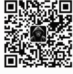

微信:lazyhelper

大家好，我是阿西，8 年互联网增长产品、运营经验，副业时间运营推特账号，2 个月涨粉 1w+，3 个月总曝光量 2000 万+，单篇推文曝光量超百万。

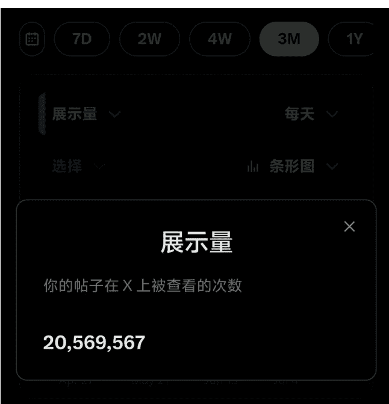

最近很多刚开始做推特的朋友会问我，自己推特粉丝不多只有几十、几百，开通创作者分成还要一定的时间，有没有低粉变现的方式介绍？

我这个月实测了“网盘资料变现”项目，感觉是目前新手入场门槛最低、最容易跑出第一笔收入的路径，而且推特也是最适合做网盘资料变现的平台。

我从接触到上手时间，只花了一周的时间，每天只花十几分钟，就做到了单日收益 78 元。下图是我实践了一周的成绩，可以发现随着我对项目逐渐熟悉，日收益快速增长：

| 2025-07-06 | 108 | +￥78.54 |
| 2025-07-05 | 40 | +￥12 |
| 2025-07-04 | 24 | +￥10.5 |
| 2025-07-03 | 14 | +￥9.54 |
| 2025-07-02 | 5 | +￥1.5 |
| 2025-07-01 | 2 | +￥0.6 |

这个项目操作成本不高，但很要求选题和执行，适合粉丝量不多但执行力强的朋友。

通过这篇文章你可以了解如何从 0-1 通过网盘项目做低粉变现，文章结构如下：
- 什么是“网盘资料”项目？为什么适合低粉新手变现？
- 如何绑定并拥有自己的网盘账号？
- 如何找选题，让一篇内容就能带来收入？
- 容易遇到的卡点有哪些？

## 什么是“网盘资料”项目？为什么适合低粉新手变现？

### 什么是“网盘资料”项目？
简单来说，网盘变现项目就是：你在网上整理一些实用资料，通过网盘分享给别人下载，赚取平台给的促活、拉新奖励。

### 平台为什么愿意给你钱？
因为它需要新用户下载、使用，这类平台大多处于推广期，为了抢占用户会给出奖励刺激，一般奖励类型如下：
- 奖励 1：按照新用户计费
- 奖励 2：按照网盘转存动作计费
- 奖励 3：按照用户购买网盘会员计费

你要做的事情，就是把有价值的资料整理好，吸引人来点你的链接去注册、转存、买会员。

### 为什么这个项目适合低粉新手变现？
即使粉丝量很低也能做，它不太依赖你的粉丝量，只要一条内容爆了，就有自然流量进来。
不需要拍视频：只需整理资料+写好推文。
懒人微信：lazyhelper
内容有复利：好的内容可以长期挂在主页，持续带来收入。
变现路径简单清晰：流量→点击下载/转存→平台结算，不需要你做售后。

你只需要掌握三个核心环节：找资料 → 写内容 → 放链接，就能把这个项目跑起来。而且一旦摸清套路，内容可以不断复用。

### 为什么推特是最适合做这个项目的平台？
你可能会问，为什么这个项目更适合在推特上做，而不是国内的小红书、公众号、抖音？

推特相比国内社交平台的内容规则更宽松，你可以在贴子里中插入链接，平台不会动辄降权、删帖、封号，对于依赖链接转化的网盘项目，这点至关重要。所以推特提供了一个低门槛、高自由度的环境，非常适合跑网盘变现项目。

下面是网盘推广中曝光量是自身粉丝量几十倍的案例：
1、这个账号2w+粉丝，一篇网盘推广推文带来了99w+高曝光量。不但能带来网盘收益，而且还能带来涨粉，一鱼两吃。
懒人微信：lazyhelper

日本人写的中国史，绝对震撼，我们都该读一读！

2、这个账号只有3000+粉丝，就做到了77w+曝光量，在评论区留下了网盘地址。

另外，推特平台的推流速度非常快，一旦内容获得平台推荐，内容扩圈很快。我测过同一条内容同步发在推特和小红书，结果推特曝光能有几十万，而小红书只有几万。懒人微信：lazyhelper

### 如何绑定并拥有自己的网盘账号？
目前市面上常见的发网盘奖励的平台有：百度网盘、迅雷网盘、夸克网盘，他们对应的奖励机制如下：


收益说明 权益申请 >
- PC拉新 ￥3元
- 转存 ￥0.3元
- 会员充值佣金 30%
- 拉新收益 ￥7


收益说明 会员申请 >
- 拉新收益 ￥8
- 转存 ￥0.45元
- 新会员充值分佣 20%
- 老会员充值分佣 10%
- PC拉新 ￥3元


## 收益说明 权益申请
| 拉新收益 | ¥5 |
| 会员充值佣金 | 35% |
| 转存 | ¥0.5元 |

虽然从拉新和转存奖励金额来看是百度网盘最高，但我测试发现百度网盘链接在推特环境下是打不开的，所以推特平台做网盘基本是用夸克网盘。接下来我会介绍如何绑定一个自己网盘账号：

### 第一步:注册夸克账号
通过官网注册账号:https://pan.quark.cn/
登录新注册账号后即可查看获得的1TB存储空间

### 第二步:申请推广
- 1、进入推广平台
扫码打开「项侠客小程序」（也有别的网盘推广平台，因为我用的是这个所以就用它来举例，你也可以自行寻找别的）


选择【网盘变现】板块中的夸克网盘项目，点击「立即推广」

### 项侠客


消息 消息通知
短剧变现 星图变现 网盘变现 生活权益
夸克网盘-新 官方直签 立即推广 项目单价: 10元/单 最新结算时间: 2025-03-05 最高收益: 56187
百度网盘 官方直签 立即推广 项目单价: 8元/单 最新结算时间: 2025-03-03 最高收益: 25482
迅雷云盘 立即推广

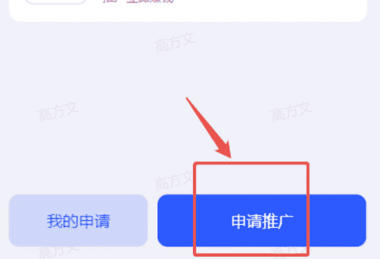

### 2、绑定夸克账号
- 步骤 1:复制推广链接到浏览器打开，点击「去夸克 APP 绑定」，系统自动跳转至夸克 APP
- 步骤 2:在夸克 APP 中复制显示的 ID 号(需确认渠道代码为 5002)，点击「绑定」完成关联

绑定成功后需截图保存 ID 和成功页面，否则无法统计收益

### 注意：
账号唯一性:每个夸克网盘账号仅允许绑定一个推广渠道，重复绑定会触发系统限制

### 申请推广
绑定链接
复制
```
https://b.quark.cn/apps/c3qMkYerj/routes/Wxc7enXRP?uc_param_str=dsdnfrpfbivesscpgimibtbmnijblauputogpintnwktprchmt&uc_biz_str=S%3Acust
```
删除 夸克ID 粘贴 夸克手机号 夸克账号成功绑定5002截图 擅长领域 请选择擅长领域

### 夸克网盘
### 分享合作绑定确认

去夸克APP绑定
请在夸克App打开此链接进行绑定

### 夸克网盘 authorize
ID
100606932524
渠道
5002

显示这个界面即绑定成功，就可以开始推广了


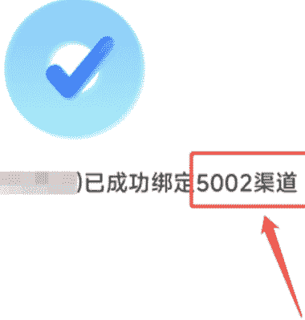

3、然后我们回到「项侠客小程序」里，需要我们填写的「夸克 ID」，就是这时显示的 ID


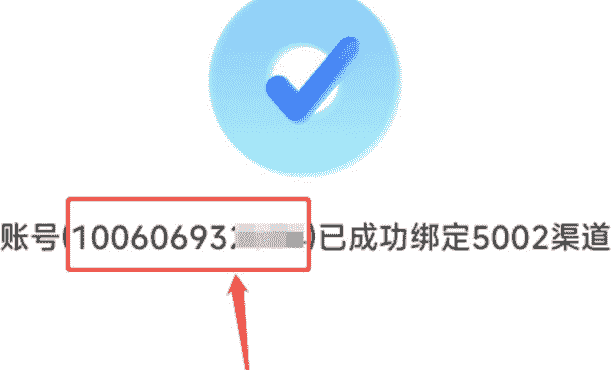
懒人微信：lazyhelper

其他的内容根据自己信息填写就行，接下来还有个【夸克分享链接】

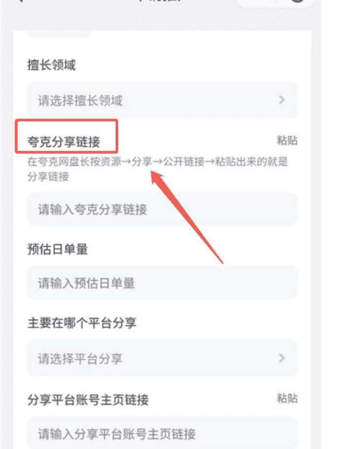

### 操作步骤
①打开夸克，任一选择一个资源点击“分享”，选择“公开链接”

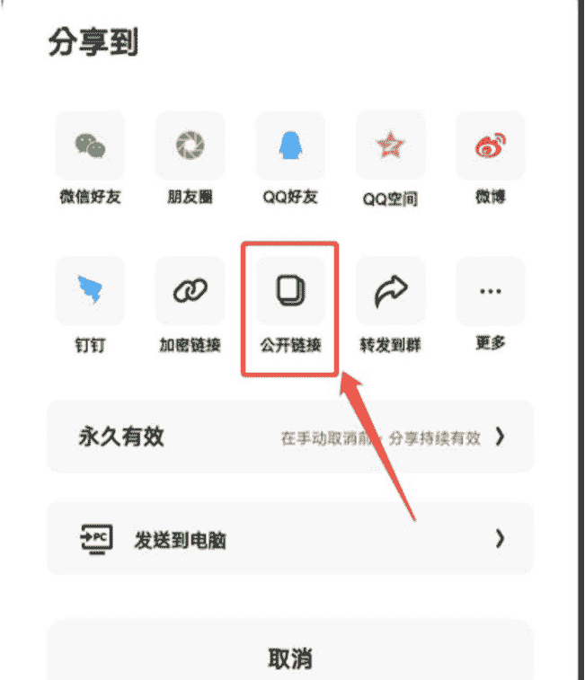

②复制到公开链接后，回到项侠客小程序，点击粘贴即可

所有信息都填完后点击确定，等待审核即可，审核通过大概1-3个工作日。

审核通过后，你的网盘里分享出去的链接就可以产生对应的收益了：

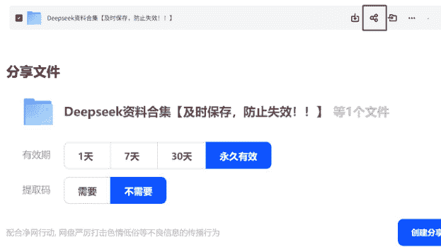

## 如何找选题，让一篇内容就能带来收入？
选题决定了你的推文能不能爆，尤其是网盘变现这类项目，找对选题一条推文就有机会带来几百次下载。找选题最有效的方式就是先找对标，复制对方的网盘资料，直接去参考对方的写法，再用 AI 伪原创改写一下。

目前我测试下来比较有效的找对标选题的方式有两种：

### 方法 1：用高级搜索找爆文
“quark.cn”是夸克网盘的域名关键词，只要有人在做夸克网盘项目就一定会在推文里提到这个域名，而你就可以用这个域名关键词找到所有有关网盘项目的推广推文，然后再筛选出曝光量大的推文。

你可以在推特搜索栏输入以下语法，找到历史爆款内容：
```
quark.cn min_faves:100 since:2024-06-01
```
这个指令的意思是：搜索正文是包含“quark.cn”且点赞数超过 100，发布时间在 2024 年 6 月 1 日以后的推文。

通过这个搜索搜出来的结果基本都是跟网盘推广相关的推文，点赞量越高，越值得模仿。

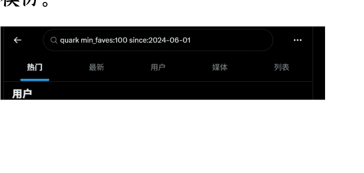

### 方法2:去网盘推文聚集的社区里挖掘高曝光内容
在推特上有一些网盘项目者聚集的社区，在这些社区里你可以直接通过“点赞最多”来排序筛选高赞贴，比如“中英文图书推荐分享”这个社群里就有非常多网盘推文，加入社区后你可以通过以下操作来筛选：

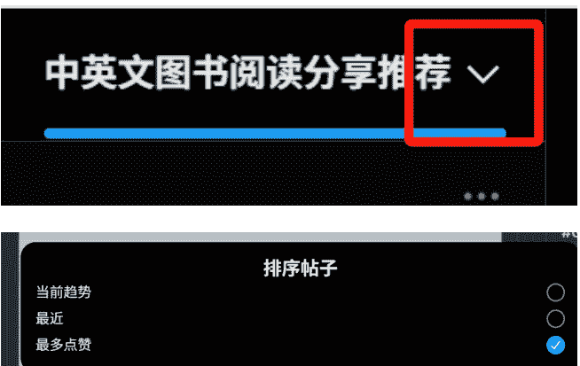

找到对标内容后，接下来的步骤是：
- 直接把对方的网盘资源保存到自己的网盘里
- 用AI仿写对标的推文内容：把原推文扔进ChatGPT，提示它“请改写为风格类似但不重复的推文文案”

这个方法的本质就是火过一次的内容会再火一遍，不要去创新，直接找已经被数据验证过的选题和网盘资料，放到自己的账号里再做一遍，成功的概率会更大。

网盘推文一般只需要两条，第一条写正文内容，第二条放网盘链接（推特之前是首条放链接会被限流，但现在也有链接放在正文里能爆的例子，可以自己都尝试下）。

### 重点推荐：知识型网盘爆文结构
知识型网盘爆文不但能通过网盘变现，而且能加强账号的 IP 形象有助于长期发展，所以重点推荐做这种。

知识型爆文首先要让用户感觉推文本身就是干货内容，这样能通过收藏、点赞等互动行为给推文加权重，让平台给内容推流，从而带动网盘链接的曝光。

知识型爆文构成：
- 第一部分：夸张的数据 / 直击需求痛点，用来吸引用户停留
- 第二部分：简单的操作步骤，最好用上 1、2、3，让用户感觉只要简单的几步就能学会，获得感强。
- 第三部分：想要获取更多，点击这里，这时候带出网盘链接

下面就是个典型的例子：

### 用DeepSeek做养生动画视频，20天涨粉40万+
- 具体流程：
  1. DeepSeek写出图片提示词
  2. 即梦依据提示词生图
  3. 可灵图生视频
  4. 剪映一键剪辑

以上所有app都是免费的！

### Deepseek资料合集（持续更新）
链接：pan.quark.cn/s/9b2b463c2c9f

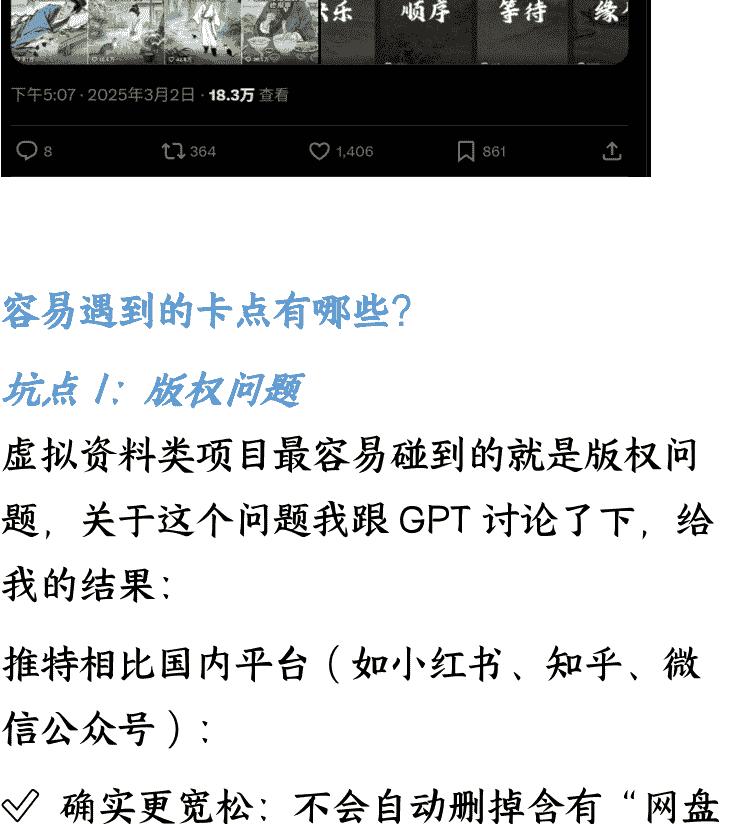

## 容易遇到的卡点有哪些？

### 坑点 1：版权问题
虚拟资料类项目最容易碰到的就是版权问题，关于这个问题我跟 GPT 讨论了下，给我的结果：
推特相比国内平台（如小红书、知乎、微信公众号）：
- ✓ 确实更宽松：不会自动删掉含有“网盘链接”的推文；
- ✓ 没有实名认证强制机制：对内容传播者的追责较困难

虽然推特相比国内宽松，但并不是说可以无视版权，安全可行的做法是选用对外公开免费发布的虚拟资料或是做自己原创整理的资料，比如「100 篇爆款推文标题模板」或「100 个提高工作效率的提示词」，这种就是原创资料，不仅安全还能建立影响力。

比如像下面这种好用工具的源代码分享，代码是 AI 写的，不涉及版权问题，而且工具直击小红书引流的痛点，吸引了大量用户收藏转发，这样既能没有版权风险，又能带来大曝光，这就是个比较好的资料例子：

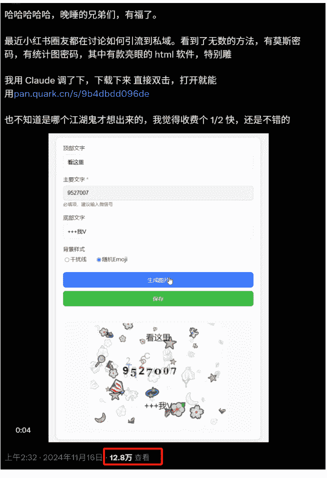

### 坑点 2：奖励计费问题
有两种情况可能会让你觉得是计费系统出错，但其实是因为完整的理解网盘规则导致的：

### 情况 1：自己邀请了朋友转存，为什么没有计费？
这个情况一般是因为朋友可能当天在你之前已经点了别人的网盘，而规则要求需要用户当天首次转存才能计费。

所以当天可以尽量早点发布网盘推文，但也不用过于担忧，因为推文的传播时效是24~48小时，并不会因为当天发得晚导致网盘点击用户都被别人抢走。

### 情况 2：网盘链接的推文曝光很高，为什么收益很少？
这个情况你要检查自己的网盘资料是不是那种不保存也能打开直接看的资料，如果这样的话用户大概率会直接看不转存，很影响转化。建议打包成压缩包再分享。

## 总结
如果你还在思考怎么通过推特赚钱，网盘资料项目是一个门槛低、路径清晰、验证成本低的好选择。这个项目可能赚不到“暴利”，但足以作为你推特变现的第一个闭环，帮你实现从 0 到 1 的正反馈。

如果你能持续执行下去，甚至可以从“资源分享”过渡到“知识整理”、“个人品牌搭建”、“产品售卖”。想长期通过网盘项目在推特上做变现的话，可以包装下账号的简介和昵称，比如“XX 分享官”、“XX 知识分享”，这样用户在看完你的推文后点进你的主页会觉得你是一个长期分享知识的账号，关注成为你的粉丝，让你从一个内容搬运账号逐渐转型成为一个知识 IP 账号。

最后，安利小懒的付费群：

懒人专属群


懒人专属群持续更新中，已持续运营 6 年，整理超 3000 份各类精选付费文章 & 年费社群干货，全部开放下载。

本资料为付费群内部分享，仅供真实有需要的朋友查阅

懒人专属群更新记录：
https://lazy2025.top/#/blog/record2

懒人专属群更新记录（需梯子，备用）：
https://lazybook.fun/#/blog/record2