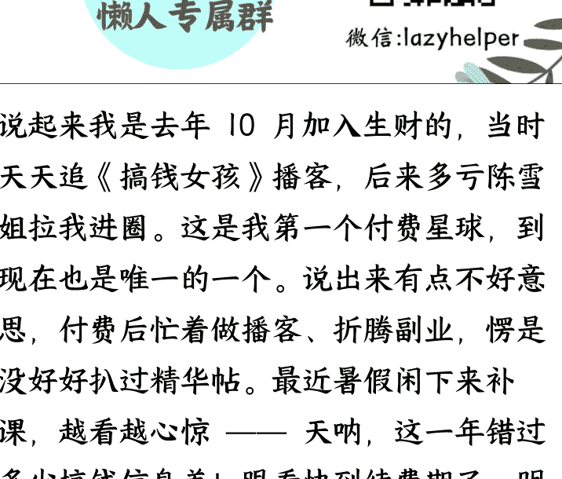
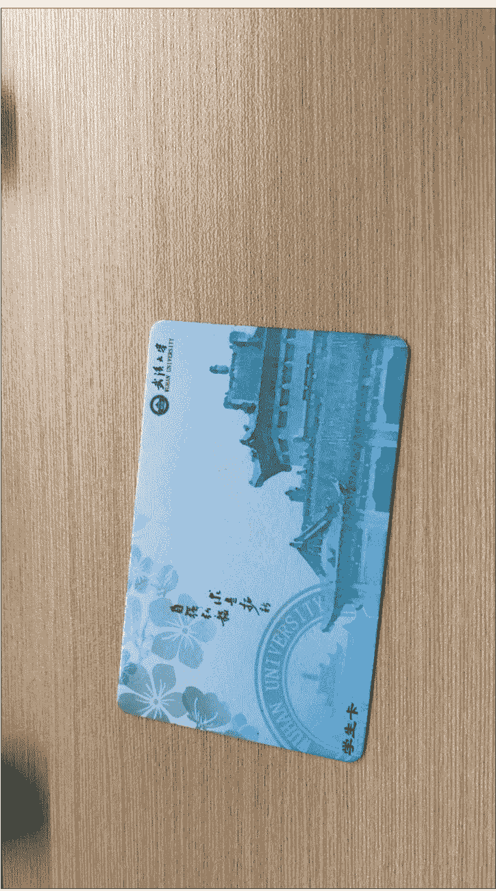
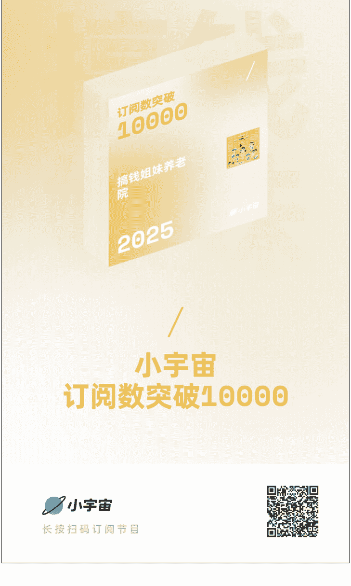
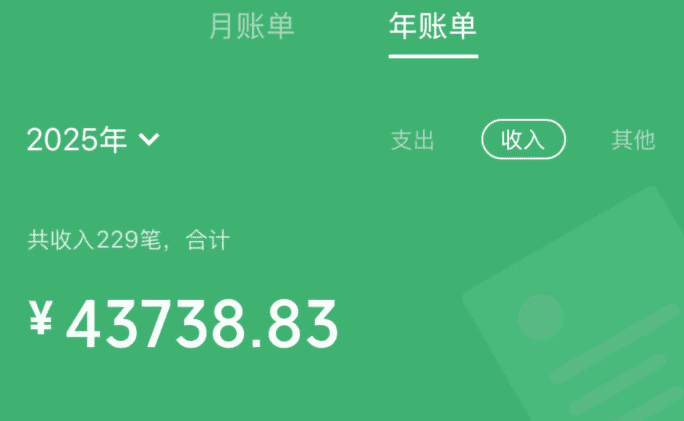
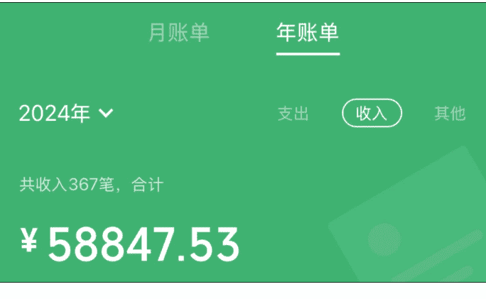
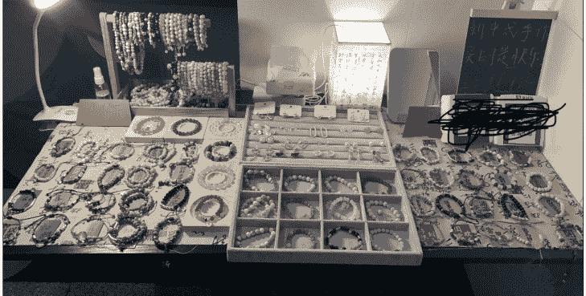
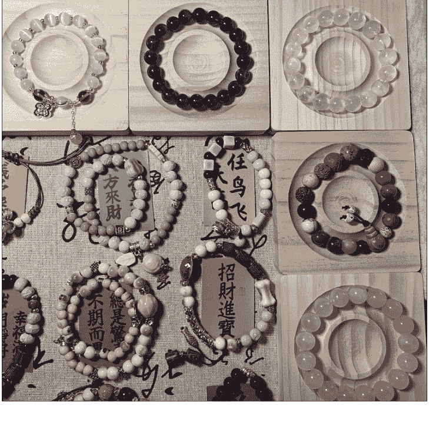
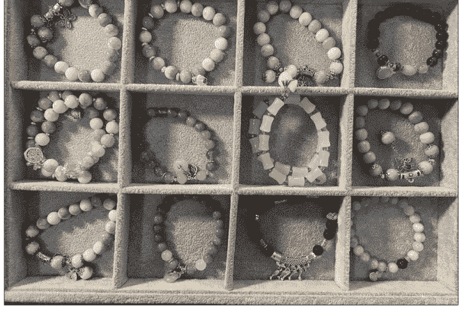
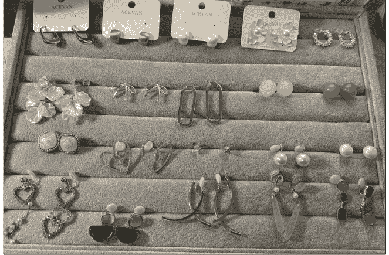
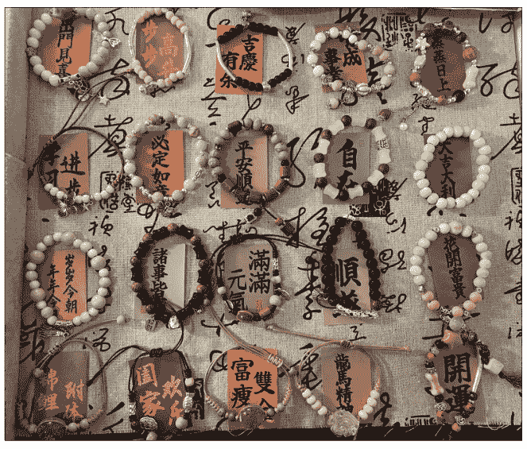

# 脱下孔乙己长衫,26岁大学老师摆摊卖手串,5天23小时赚了2000+

250730 生财精华

公众号懒人搜索,懒人专属群独享

懒人微信:lazyhelper

说起来我是去年10月加入生财的,当时天天追《搞钱女孩》播客,后来多亏陈雪姐拉我进圈。这是我第一个付费星球,到现在也是唯一的一个。说出来有点不好意思,付费后忙着做播客、折腾副业,愣是没好好扒过精华帖。最近暑假闲下来补课,越看越心惊——天呐,这一年错过多少搞钱信息差!眼看快到续费期了,明年还想赖在生财跟大家混,赶紧赶了篇帖子,要是能评上精华,说不定还能低价续费,想想就美滋滋~

第一篇帖子叫《脱下孔乙己长衫,26岁大学老师摆摊卖手串,5天23小时赚了2000+》。跟生财的大佬们比,这点钱确实不够看,但对我来说意义不一样——这是我第一次真刀真枪下场搞钱,踩的坑、攒的经验都在里面。大家要是看得还行,麻烦点个赞捧个场,后面我接着更。以前写小说时能一周肝出几万字,写帖子对我来说不算难，就是话有点多，怕你们嫌我啰嗦～

不多说啦，正文这就来！

武大法学院毕业的光环没困住我，反倒让我更敢“折腾”：主业是大学老师，副业从播客主理人到资料销售，靠闲鱼、小红书低粉变现攒下六位数，24年被1688官方邀请参加拿货节。

今天不想聊那些“高大上”的，就想跟你掏掏心窝子：去年毕业季，我是怎么从义乌批发市场扛回一堆手串，在宿舍门口支起小摊，一边应付答辩一边卖货，最终用23小时赚够2000多的。

从选品砍价的“野路子”，到把保洁阿姨变成“大客户”的销售技巧；从9.9元引流款的定价心机，到靠“玄学”话术让顾客快速掏钱的秘诀……全是我踩坑踩出来的实操干货。

如果你也想试试摆摊搞钱，又或是被“孔乙己的长衫”捆住了手脚，那这篇文你可得好好看——毕竟，能靠自己双手赚来的底气，比任何头衔都值钱。

## 一、我是谁?

### 1.武大法学院毕业，主业大学老师

### 2.副业：干过挺多的，列举几个即将写成帖子的

- 全网同名播客“搞钱姐妹养老院”主理人，24 年 8 月开播，全网播放超 30 万，小宇宙订阅 10000+（平均 35 天增加 1000 订阅量，不到一年小宇宙播客破 1 万订阅量，破 10 万播放量），跑通播客从搞流量到变现的闭环，接过 B 端广告，做过 C 端生意，ToB，ToC 都有经验且拿到结果

- 读书期间结合闲鱼、知乎、小红书低粉变现，赚了6位数
- 毕业10个月，小红书自己写资料卖资料做咨询，赚了6位数

部分收款截图：

懒人微信：lazyhelper

- 毕业季摆摊卖手串，5天23小时赚了2000+，上过两次“搞钱女孩”播客，小红书“搞钱姐妹白白”几百粉丝就被1688官方邀请，参加24年台州拿货节活动，25年也在陆续参加阿里巴巴的官方活动

hello宝，7.30AI大会邀请函和会议议程，请查收～

### 3.大家可以叫我白白，我是一名斜杠青年，ENFT，高能量，执行力强，爱折腾，热衷搞钱，喜欢交朋友，没事儿就来唠唠嗑～

我的播客叫“搞钱姐妹养老院”，欢迎大家收听～

## 二、毕业季宿舍摆摊卖手串，5 天 23 小时赚了 2000+

说起来也是缘分，我当时在金华实习，离大名鼎鼎的义乌商贸城隔得不远。去年端午节，朋友们都出去耍了，我闲着也是闲着，就想着去批发市场逛逛，还特意跟 8 个朋友打招呼：“看中啥告诉我，我给你们带！”

一进商贸城，那些手串、耳环简直把我眼睛都晃花了 —— 亮晶晶的琉璃、温润的玛瑙、还有带着小坠子的耳环，每样都想拿点。可批发市场都是按 “打” 拿货的，12 个一串，朋友只要 8 个，剩下的 11 串手串、11 副耳环总不能砸手里吧？我这人最看重说话算数，既然说了帮朋友带，肯定不能反悔，咬咬牙全买了！但买完就犯愁了：剩下的咋清掉呢？

巧的是，那会儿正赶上毕业季，我得回学校参加毕业典礼。看着一袋子货，突然灵光一闪：要不借着毕业季在学校摆摊？说干就干！我连夜刷小红书看摆摊攻略，在淘宝、拼多多、1688 上比价格、选款式，听说摆摊得品类多才能吸引人，不知不觉就进了七八十种手串，一算账花了一千多—— 当时我还是穷学生，手里没多少流动资金，还跟朋友借了一千才凑够。那一刻，囤货的压力噌地就上来了：必须把货全卖掉，不光要赚钱，还得还朋友钱呢！这事儿，没得退路了。

本来想去地铁口摆摊，毕竟人流量大。那天下午一点半，我把折叠桌、桌布、小台灯这些 “氛围感神器” 搬回宿舍，正琢磨着怎么摆才好看，突然瞅见宿舍门口有块空地。心想 “离地铁口人流高峰还早，不如先在这儿试试水？” 就支起桌子，铺好碎花桌布，把所有手串一溜儿摆开，再打开小台灯，别说，还真像那么回事儿！

刚摆好，对门同学就背着相机出来拍毕业照，路过时好奇地问：“你这是干啥呢？”我赶紧招呼：“摆摊卖手串呀！都是网上少见的款，你看看有没有喜欢的？”她凑过来一看，被一串蓝琉璃吸引了，听我叨叨半天“这颜色配毕业照特上镜”，当场就买了一百多块的东西 —— 第一单成了！

更意外的是，第一个“大客户”居然是学校的保洁阿姨。我平时总跟打扫宿舍的阿姨唠嗑，那天见她路过，赶紧拉她来看：“阿姨，您试试这红玛瑙的，戴着手特显白，配您那件衬衫肯定好看！”她一戴就摘不下来了，连说“比外面店里便宜一半”，不光自己买了两串，还说“我同事肯定也喜欢”，第二天直接带了好几个阿姨来“团购”。

就这么着，我在宿舍门口摆了 5 天，加起来也就 23 个小时，居然赚了 2000 多！那阵子一边忙着答辩、拍毕业照，一边见缝插针地回宿舍盯摊，忙得脚不沾地，可每次听到微信到账的提示音，心里就甜滋滋的。尤其是把借朋友的钱还上时，那种“靠自己搞定一切”的感觉，比赚多少钱都爽！

公众号懒人搜索、懒人专属群分享

懒人微信：lazyhelper

11 / 22

## 三、摆摊卖手串如何选品？

选对品，生意就成了一半！我当时踩了不少坑才摸出规律，总结下来就 4 招：

### “借力” 选品：

- 第一天跟着朋友的喜好拿，但款式太少；
- 第二天逛耳环摊时，直接问卖货的 00 后小姑娘 “你们年轻人现在爱戴啥”，你帮我多选选，选的好，我在你家多进点货，然后她帮我挑的很多手串后来成了爆款；
- 第三天更直接，刷小红书搜 “摆摊爆款手串”，看别人哪款评论多、销量高，就找类似款但更便宜的；
- 最后还把图片发给闺蜜们，说“喜欢什么大胆挑，我免费送”，她们比我还积极，帮我筛掉了一堆“土气款”。

### 品类要“杂”且“全”：

我前后在义乌商贸城进了 60 多种手串，从 9.9 块的陶瓷串到 100 多的水晶串（紫水晶、月光石这些），还顺带拿了耳环 —— 重点是要备“无痛耳夹”，专门照顾没耳洞的姐妹，光这一项就多赚了不少。

### 线下线上结合：

义乌商贸城我跑了 4 天，线下能摸到质感，还能跟老板砍价；线上就在 1688 找“七天无理由退货”的店，卖不掉能退，降低囤货风险。但记住，想卖高价就得靠线下独家，不然顾客一搜淘宝同款，你就没优势了，所以这个时候我会突出自己手串的差异化优势：手工制作➕独家，线上全网搜不到同款，这时候配合一个心动价格，卖出去的手串可多了，销售的速度可快了。

### 4.兼顾不同人群：

虽然主要卖给学生，但我特意进了些红玛瑙、檀木串，想着“万一有阿姨喜欢呢”。结果真被宿舍保洁阿姨们包圆了，她们说“这红玛瑙戴着喜庆，比金店便宜多了”，还互相推荐“你看李姐戴的那条多好看”。更妙的是，有女生买了串草莓晶，我说“你妈戴红玛瑙肯定显气质，要不捎一条？”好多人真就多带一串送妈妈，一个顾客变两个，生意自然越做越活。

其实选品没那么复杂，核心就是“多听、多看、多琢磨”—— 别人觉得好的、市场认的、不同人都能戴的，凑到一块儿，想不卖好都难!

## 四、摆摊卖手串如何定价?

定价这事儿，核心就是既要让自己有钱赚，又得让顾客觉得“值”。我当时摸索出一套法子，分了好几个价格档：9.9 块、15.9 块、19.9 块、25.9 块、29.9 块，还有 35 块和一百多的 —— 不同档次对应不同品质，这样不管是想随便买个玩玩的，还是想挑个好点的，都能找到合适的。

下面是几个实操技巧，亲测好用：

- 让朋友帮你“试水温”。把手串图片发给朋友，说“猜猜这串值多少钱？猜对了送你”，大家一热闹就把心理价位说出来了。比如有串琉璃串，朋友们大多猜 15-20 块，我就定 15.9 块，既在他们预期内，又留了利润空间，这就是用用户思维定价。
- 跟线上比价 “打埋伏”。把同款或类似款的图片发到淘宝、拼多多搜，看人家卖多少钱，我就定得比线上低个 3-5 块。顾客一搜发现 “线下买还更便宜”，根本不用多费口舌，直接就掏钱了。
- “引流款 + 利润款” 组合拳。必须有个超低价的引流款，我选的是 9.9 块的陶瓷串，一摆出来就有人围过来问，人一多气氛就起来了；然后悄悄把 100 多的水晶串（紫水晶、粉水晶这些）摆在显眼处，有人买了便宜的，看到贵的也会好奇 “这贵在哪儿”，解释清楚 “这是天然水晶，质感不一样”，总有愿意为品质买单的。

说白了，定价不能拍脑袋，得摸透顾客的心理：既想占便宜，又想要好东西。把这两点兼顾到，赚钱就是顺理成章的事儿啦！

## 五、如何快速销售？

一开始我也以为，摆摊不就是把手串往那一摆嘛？有货就行！后来刷小红书才发现，那些爆火的摊位都特讲究 “氛围感” —— 评论区里全是 “摊位好看才想停下来”，我这才琢磨着：除了手串，还得备点“加分项”

### （一）先说说必备的摆摊工具

- 桌子/露营车：我一开始买了张120cm长的折叠桌，看着挺能装，结果搬的时候差点累断手！后来在横店遇到个温州摆摊小姐姐，她给我安利了“露营车+折叠桌面”的组合一一下面装货，上面直接当摊位，推着就能走，简直是摆摊神器，强烈推荐
- 货源渠道：别光盯着1688，虽然能七天无理由退货（新手必看！），但同款太多，顾客一搜就知道底价。最好去线下批发市场淘独款，比如义乌商贸城的手工串，回来就能说“原创设计，网上找不到”，溢价卖都有人买。

### 3.氛围三件套:

- 中式桌布+展示架：铺块写满书法的新中式的布，把手串分门别类，加上展示盘和装饰盒，瞬间比堆在盒子里好看10倍；
- 亮灯！亮灯！亮灯！这是我跟老摊主偷学的：9.9块的引流款故意少打光，显得普通；29.9块以上的款直接用台灯照着，珠子的光泽感全出来了，晚上看特高级；
- 小道具：酒精棉(试戴前擦一擦)、小镜子、花露水(夏天必备),细节到位了,顾客才觉得“靠谱”。

### （二）再聊聊超实用的销售技巧

- 价格牌“小心机”：做个大字牌写“9.9元起”，然后用二维码把“起”字挡住——顾客老远看到“9.9”就会过来，等走近了再解释“高价款有更好的材质”，人留住了，就有戏!
- 款式要“全”到戳痛点：手串备了60多种，从9.9的陶瓷串到100多的水晶串都有；耳环特意进了“无痛耳夹”，我自己戴了一年多，跟顾客说“戴一天都不疼”，没耳洞的姐妹立马动心。
- 站着吆喝，别当“低头族”：刚开始我总坐着玩手机，摊位前冷冷清清；后来学着主动打招呼“来看串呀，刚到的新款”，有人驻足就赶紧递镜子“试试这个，显手白”，人气立马上来了。
- 服务态度拉满：夏天看到顾客被蚊子咬，赶紧递花露水；试戴耳环前先擦酒精；哪怕买9.9的串，也帮人找个好看的袋子装——有次一个女生说“你比精品店还贴心”，当场又多买了两串。

> 懒人微信：lazyhelper

- 5.快收摊时“逼单”：每天收摊最后一小时喊一嗓子“清货啦!买两串打9折，加1块再送一条”，利用“再不买就没了”的心理，最多一次靠这招卖掉8条同款，赚了一百多。

### 6.卖“情绪”比卖货更赚：

- 看到学生说“要考试了”，就推“节节高升”竹节串，说“戴这个逢考必过”；
- 阿姨们试戴红玛瑙，就夸“显气质，配旗袍绝了”；
- 从不多推贵的，有次一个女生想买19.9的，我直接说“你戴9.9的陶瓷串更清爽”，后来她成了回头客，还拉来闺蜜团。
- 加点“玄学”更吸睛：年轻人就吃“寓意”这一套——紫水晶说“招桃花”，月光石说“助眠”，檀木串说“防小人”。有次一个姑娘听完“考试必过”的说法，当场揣走两串，说“给室友也带一个”。

其实摆摊没那么多套路，说白了就是“把顾客当朋友”——你用心了，人家自然愿意为这份真诚买单。不光是手串，项链、小饰品都能这么玩，关键是让路过的人觉得 “这个摊有点意思” ~

## 六、说在最后——摆摊搞钱碎碎念

后来我在县城摆摊卖手串时，发现了个特有意思的现象 —— 那条街上明明有四家卖鲜榨果汁的，按说竞争够激烈了吧？结果一到傍晚，每家摊前都围着人，尤其是最角落那家，排队能排很长。 我蹲了好久才看明白：人家卖的橙汁比西瓜汁火得多。老板说 “每天鲜榨 20 斤橙子，基本天黑前就卖完，西瓜汁反而剩得多”。这背后藏着个门道 —— 来的大多是带娃的家长，夏天怕孩子喝凉的闹肚子，西瓜性凉，家长总犹豫；但橙子不一样，一听 “维 C 多、不冰肚子”，掏钱特爽快。你看，哪怕是摆摊，选对品、摸透人群需求，再小的生意也能赚到钱。

除了摆摊，我真心劝大家试试自媒体。这玩意儿简直是 “轻创业” 的宝藏 —— 不用租门面，不用压货款，投入的无非是你刷手机的碎片时间。与其躺着划抖音、刷小红书，不如花点心思琢磨 “怎么把刷的内容变成钱”：你摆摊时拍个选品视频，进货时唠唠砍价技巧，收摊后算算赚了多少，慢慢就有粉丝跟着你学。等攒了人气，转私域卖摆摊配方和技巧、接个小广告，都是顺理成章的事。就算没做起来也不亏，至少练了怎么说话、怎么抓重点，总比纯刷手机强吧？

尤其你要是摆摊，更得把过程拍下来 —— 从进货时跟老板斗智斗勇，到摆摊时跟顾客唠嗑砍价，再到收摊后数钱算账，剪成视频发出去，这不就是现成的“摆摊博主”人设？摆摊是钩子，能勾来想看实操的人；自媒体是门槛，别人想学都得跟着你看。一件事既然要做，就得把它的价值榨干，这才叫会算账！

说到底，不管是摆摊还是做自媒体，最该放下的是“孔乙己的长衫”。我一个985名校毕业的女生，都能在大热的夏天蹲在宿舍门口吆喝卖手串、喂蚊子；是大学生、研究生，发传单、做家教、摆个小摊又咋了？这些事看着“土”，可教会你的本事实在 —— 怎么跟陌生人搭话，怎么把一块钱的利润算清楚，怎么在被拒绝时笑着再试一次。这些能耐，可比“面子”金贵多了。

人生哪有那么多“必须”？没人规定读过书就得进大厂、考公考编。我试了十多种副业，踩了无数坑，才摸到自己擅长的路子，攒下六位数存款。很多时候不是事儿难，是我们自己先吓住了自己，总琢磨“搞砸了咋办”“别人会不会笑我”。

可你细想：试错了最多浪费点时间，又不赔钱；可要是成了呢？说不定就撞开了一扇新大门，对于一无所有的普通人来说，勇敢去试这件事是个稳赚不亏的生意，光脚的不怕穿鞋的，失败了也就那样，本来就没啥好失去了的，还不如用力博一博。

所以啊，别想太多，先下场干起来。你会发现，那些“放不下的身段”“怕丢人的顾虑”，在赚到第一笔钱的快乐面前，根本不值一提。人生是片旷野，不是轨道，敢折腾的人，才能跑出自己的路。

希望这篇文章对大家有所启发，欢迎大家和我交流搞钱经验和搞钱路子，也欢迎大家链接我成为播客嘉宾，一起做期节目，另外，这篇摆摊文字稿的相关内容可以收听我们的播客，播客链接就不放上面了

最后，安利小懒的付费群：

### 懒人专属群

懒人微信：lazyhelper

### 🎧 懒人专属群持续更新中，已持续运营 6 年，整理超 3000 份各类精选付费文章 & 年费社群干货，全部开放下载。

本资料为付费群内部分享，仅供真实有需要的朋友查阅 🎧

### 懒人专属群更新记录：

https://lazy2025.top/#/blog/record2

### 懒人专属群更新记录（需梯子，备用）：

https://lazybook.fun/#/blog/record2

懒人微信：lazyhelper