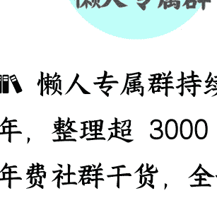

# 长安汽车升级为央企，会迎来怎样的未来？

250731 文/卢克文工作室嘉宾 星海舰长

整理：公众号懒人搜索， 懒人专属群独享

懒人微信：lazyhelper

7 月 29 日，中国长安汽车集团在重庆挂牌成立，这标志着长安汽车正式从兵器装备集团分立出来，成为了一级独立央企。

很多人可能奇怪，今年 2 月不是传言长安要和东风合并吗？当时传的有鼻子有眼的，怎么现在没有合并，反而独立升级了？

长安东风合并的消息早就有，只不过到 2024 年才进入实质性阶段。

2024 年 3 月份，国资委副主任苟坪表示，未来国资委要正视中央企业在新能源汽车发展中存在的差距与不足，鼓励支持中央企业开展高质量投资并购、专业化整合，加快掌握产业核心资源和关键技术。

这话只要说出来了，并购整合就绝不会是随便说说。

但央企只有一汽、东风和长安这三家汽车企业，怎么并购才算是“高质量投资并购、专业化整合”？

考虑到一汽的特殊地位，不能随便动，很多人猜测是长安和东风先合并。

长安智能化强，东风固态电池技术好。长安车卖得好，而东风的直营销售渠道和海外渠道更有优势，取长补短，挺符合“专业化整合”的战略方向。

东风经营状况因为合资车的崩塌，现在不那么好，让长安去救一下东风，也符合国资委“保证国有资产保值增值”的职责。

更关键的在于，东风长安合并后，能够为中国提供一个世界排名前五、完全执行国家意图的大型车企，能大幅度提高中国企业在国际上的话语权，应对贸易争端也更有底气。现代和起亚合并代表韩国汽车，就是走的这个路子。

不过呢？虽然国资委这么考虑是有道理的，但并不意味着国资委就能把事情办成。

第一，你要解决一个谁并谁的问题。单纯从市场业绩来看，自然是长安合并东风。

想当年，汽车业几乎所有国企央企都靠着合资红利躺着赚钱，而长安则在 2015 年左右就开始布局自主品牌和新能源，结果几年后，新能源崛起，其他央企的合资业务崩塌，而长安却凭借自主品牌和新能源成功闯到了新时代。

2024 年，长安销量 268 万辆，营收 1390 亿，净利润 73.21 亿元。而东风 2024 年销量 189.6 万辆，虽然看起来没比长安少太多，但营收只有 993 亿，净利润只有 0.58 亿元。

你没看错，长安利润 73.21 亿，东风 0.58 亿，根本不是一个级别的。

更关键的在于，长安已经在自主品牌领域里站稳脚跟，向新能源转型比较顺利，又早早抱上了华为的大腿，业界非常看好。

东风呢？合资崩了，自主品牌也谈不上顺利。

所以，要单从经营水平上来说，应该是长安并东风。

但长安的级别太低了，东风是副部级的央企，而长安只是个二级央企，正厅级。正厅级企业去并副部级企业，还是别指望了。中国的央国企，有时候并不是你业绩好，就一定有话语权的，更多的时候还要看级别。

如果是长安被东风并了，心中肯定不服气，我的业绩比你号，为国家创造的利润比你多，凭啥要听你指挥？

比如 5 月份，长安汽车悬赏 100 万捉拿造谣“长安汽车已经作为二级企业并入东风集团”的自媒体账号，就是长安“不服气”心态的真实体现。

## 第二，你要解决一个产品线矛盾的问题。

长安和东风独立发展这么多年，产品定位和消费群体接近，产品线上也有重叠。

比如长安 CS75 与东风风神 AX7 定位相近，逸动与奕炫同为两个品牌主力紧凑型轿车系列，哪怕在新能源市场，深蓝 SL03 与风神 E70 ，以及阿维塔和岚图品牌，也都存在重叠。

如果直接合并，很容易造成资源浪费，难以形成协同效应。为了避免自相残杀，只能削减某个产品线。问题又来了，削减谁的？削减东风，东风系肯定不干。削减长安的话，长安的车型卖的更好，也不干呀。

每一个车系，其背后都有一整套体系，涉及研发、测试、调试、销售等等，裁掉这个车系不仅仅是一款车的问题，而是一整套链条。硬裁不仅会带来巨大民意反弹，还会导致前期研发投入血本无归。

## 第三，地方利益。

如果长安和东风合并，不管谁并谁，都得明确总部选址的问题。

长安在重庆，东风在武汉，虽然二者都是央企，利润上交中央，但税收，可是要交给当地的。

比如 2024 年，重庆市地方财政收入 2595.4 亿元，同比增长 6.3%，这其中，2024 年重庆新能源汽车产量 90.5% 的增长率功不可没。

不仅仅是税收，一般来说，总部在哪里，经济拉动效应就在哪里。

经济学界有个专有名词，叫总部经济，反映了总部对一个地方的拉动效应。过去这些年，长安汽车给重庆培育起来了一个享誉全国的汽车制造业产业集群，让重庆成为除了上海之外，唯一一个拥有新能源全产业链的城市，为重庆 GDP 做出了巨大贡献。

更不要说长安带动的数以万计的就业岗位、高端技术人才乃至房价的问题了。

所以，重庆是绝不愿意看到长安被东风合并，把总部搬到武汉去的。

而武汉，也绝不愿意看到东风被长安合并，搬到重庆去。东风是一级央企，是湖北经济贡献第二大企业，供应链更是遍布湖北。

让新总部去重庆，那武汉咋办？

就算国资委是出于汽车产业发展的大局考虑，地方的意见也不能不考虑，总不能搬到北京吧？北京的央企都在忙着往外搬呢。

从某种程度上来说，合并一事，已经超出了企业合并的层面，成了重庆、湖北和国资委之间关于产业发展方向的交锋和博弈了。

当然，在中国现行模式下，一个决策施行与否，更关键的是看谁更有话语权，谁能打动高层。

国资委想通过整合做大做强，武汉想用长安来挽救东风，这都可以理解，但这两家，最大的动员能力，无非也就是拓展到正部级发声，就已经顶天了。

但是重庆呢？重庆一把手可是副国级，别忘了，除了重庆的一把手，还有一个兵器系统出身而且当过重庆二把手的副国级此刻就在高层呢。

高层不同意，国资委就是想推动也没可能。

再加上长安东风合并前景实在是不明朗，二者的企业文化、管理体制、决策机制、激励机制都完全不同，光磨合就要好几年。如果不能迅速理顺关系、推动融合，不仅可能达不到1+1>2的效果，甚至长安都可能会被东风拖垮，那得罪那么多人折腾这一圈又何苦来哉？

综合考虑，眼前还是不合并为好。

随后，长安集团汽车之外的业务整合成了辰致科技，把“中国长安”这个名字让了出来，又成立了新的长安汽车集团，管理新成立的辰致科技和重庆长安汽车有限公司，正式从兵装脱离了出来。

从兵装下属的二级央企升级到了一级央企，和一汽、东风平起平坐了。

问题来了，既然不合并了，为啥要还给长安升级呢？

很可能，除了推动央企改革、优化国有资本布局的考虑，国资委仍然有让长安和东风合并的长远打算。

你不是说长安作为二级央企合并会吃亏吗？那我把你也升级为核心央企，让你经营几年看看情况，如果两家都经营的好，那就继续维持。

如果东风经营不善，那已经成为一级央企的长安正好可以合并东风，顺理成章，水到渠成。到时候急于甩包袱的武汉，恐怕也不得不放手了。

## 2

升级后的长安，前景如何呢？

说实话，虽然成为一级央企后，考核和管理的压力会更大，但从前景来看，长安一片光明。

因为长安不仅仅跨越了几十年未跨越的级别门槛，更关键的在于，长安的运营迎来了一次全面的解放。

为什么这么说？

还是要从长安和中国兵装集团的关系说起。

大家可能都记得80年代“军队要忍耐”时期军工企业的困境，连后来走出歼20的成飞都不得不造洗衣机了，造军车出身的长安机器厂和江陵机器厂转行造汽车，也不是什么奇怪的事情了。

1995年，长安机器厂和江陵机器厂合并为“长安汽车有限责任公司”，隶属于机械电子工业部改制而来的中国兵器工业总公司。后来兵器工业再次改制，长安汽车隶属兵装集团管理。虽然长安也造军车，但其实长安更擅长的，还是民品。

但兵装系统再怎么拓展经营，重心肯定还是在军品上，这也就导致了，长安在经营策略上和发展方向上，会受到兵装集团经营方向的影响和约束，放不开手脚。

现在呢？

长安一升级，马上就能拥有更高的决策自主权。从此无需再通过母公司兵装集团的层层审批流程，企业在战略制定、市场响应和业务布局方面，都可以自己说了算。

而且，长安直属国资委之后，马上就能进入国家重点支持企业序列，在国家级研发资金分配、关键政策扶持和技术攻关补贴等方面，拥有优先获取渠道，战略资源配置效率将极大提升。

别的不说，就算在公务用车采购中，都能吃到很大一块蛋糕，原来只能吃重庆的，现在可以吃全国了。

同时，身份的转变将彻底改善长安的经营结构和资源分配。

之前作为兵装集团下属企业，长安汽车产生的一部分可观利润，不可避免地被用于补贴集团内部的军工产品线，虽然这种做法无可厚非，但在客观上也形成了对汽车产业核心研发和技术升级投入的资金挤压。

如今，长安轻装上阵，独立核算运营，能够将所有资源集中投向汽车主业，集中资源投入智能网联、动力电池等关键技术领域，为自己技术的全面升级奠定了坚实的财务基础。

更关键的是，长安汽车作为重庆历史上诞生的第一家、也是目前唯一一家总部设在重庆的一级央企，将借助这独一无二的身份与地位，享受到重庆市无微不至的政策红利。

重庆盼央企久矣，前前后后折腾了好多年，建立了央企对接服务工作机制，成立了中央企业对接服务工作专班，折腾了好多年，现在，终于梦想成真了。

这种“央地共建”模式，使得长安拥有得天独厚的优势去争取和承接重庆市在产业升级、科技创新、区域发展等领域的核心政策支持与资源倾斜。

想贷款？想要地？想要人才？想政府推动采购？重庆肯定能第一时间解决。只要办过企业的，都知道政府的支持会带来多大助力。

比如，雅鲁藏布江正在建设水电站，肯定需要大量工程机械和工程车辆，而长安又恰巧有商用车和工程车辆的研发生产实力。这样一来，在重庆市的推介下，长安就可以充分发挥其地处西部核心工业重镇的区位优势，利用自己作为一级央企所能调动和整合的资源，获取 1.2 万亿项目中的大量相关订单，十年都不用发愁业绩了。

与此同时，对于重庆而言，能拥有长安这家新晋的、扎根于本地的核心央企，无异于收获了一个巨大的“金疙瘩”。

长安升级为一级央企后，其总部职能将进一步加强和完善，必然伴随组织架构的扩充，带来大量新增的高端管理和技术研发岗位。

这些新增的、高附加值的就业机会落户重庆，将直接带动本地的消费升级和服务业增长。

而长安央企总部的最终落定地址——鲤鱼池，也必将促使大量核心办公、管理和技术人员向这个地块集中入驻，从而催生出强大的高品质、改善型住房购买需求。

我们有理由判断，重庆极有可能以长安这一新晋中央企业作为战略核心支点，全面撬动本地万亿级汽车产业的升级进程与集群化发展，为重庆赢得一个由高端制造、技术创新和总部经济共同驱动的、更加值得期待的辉煌前景。

所以，长安的经营本来就不差，再叠加央企的资源优势和重庆的政策红利，属于强强联合、双赢共赢，前途和钱途都不可限量。

未来会如何？我们可以拭目以待。

最后，安利小懒的付费群：

## 懒人专属群

- 📚 懒人专属群持续更新中，已持续运营 6 年，整理超 3000 份各类精选付费文章 & 年费社群干货，全部开放下载。

本资料为付费群内部分享，仅供真实有需要的朋友查阅 🤫

懒人专属群更新记录：
https://lazy2025.top/#/blog/record2

懒人专属群更新记录（需梯子，备用）：
https://lazybook.fun/#/blog/record2