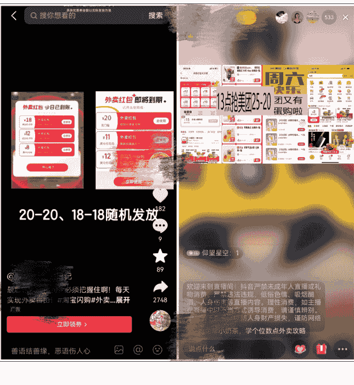
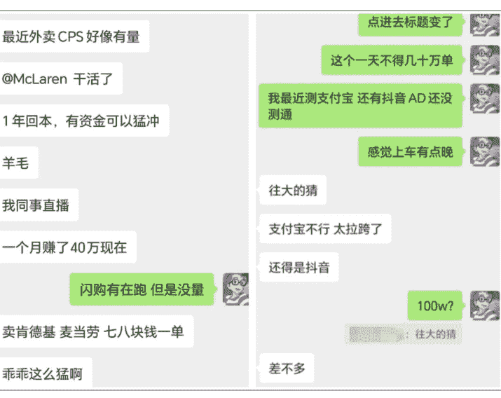

# 淘宝闪购密令推广我玩出了 2 个偏门路子

250731 生财精华

公众号懒人搜索，懒人专属群独享

懒人微信：lazyhelper

# 一、淘宝闪购密令推广背景

最近大家应该在抖音刷到很多淘宝闪购的广告视频和直播，很多做得比较早的都赚得盆满钵满了。

## 初识淘宝闪购密令

5 月 23 日第一次了解到淘宝闪购，那会儿只是粗浅了解了几句，既没摸到门道，也没看透它的潜力，总觉得这事儿没啥搞头，便一拖再拖。

直到后来在抖音上刷到好几个几十万点赞的爆款视频，这才猛然惊醒，投流投这么大，这东西一定有得玩。

## 推广现状与挑战

我真正着手实操，已经是 6 月份的事了。推广用的是自己的联盟账号，刚开始投流的数据模式也没有，所以前一两周基本都在测试数据模型。

| 整体效果报表 |
| :--- |
| 所有类型 | 所有 | 所有订单类型 | 2025-06-07 -> 2025-06-07 |
| 导出报表数据 | 下载记录 |
| 页面访问次数 | 页面访问人数 | 详情页访问次数 | 详情页访问人数 | 订单数 | 预估收入(元) | 结算预估收入(元) |
| 149823 | 42376 | 2813 | 1194 | 17891 | 8230.63 | 7926.11 |

6 月 7 日，AD 消耗 3 万+，跑出 1 万 7 千多单，算下来单均成本 2.1。当时只顾着硬跑，没琢磨时段的门道，后来反复测试才后知后觉：原来下午到晚上这段时间关计划，转化率反而高得多；而白天适当提价，还能精准拉一波量。等我这边把数据模型、时段、素材这些彻底摸透时，才猛然发现：那些 5 月就进场的玩家，早就靠着高激励政策疯狂砸流量、冲量级，把市场红利吃得差不多了。

再看自己手里的资源和节奏，明显已经跟不上第一波的步伐——别人靠着先发优势牢牢占住了流量入口，高激励的门槛对后入场的人来说更是难上加难。这时候才真切体会到，互联网风口里，“早”字有多重要。等你摸清规则准备发力时，第一批吃肉的人早已站稳脚跟，留给后来者的空间，确实不多了。

由于 AD 计划动不动就卡审，早上刚起量中午就被限，为了冲量级拿激励，简直像在赌博。思来想去，索性直接停了 AD 这条路。

# 二：我探索的偏门路子一

## 抖音找主播合作

说完那些没跑通的路子，咱们重点聊聊眼下依然能稳稳走通的——抖音找主播合作这招，亲测至今还在持续出单。

6 月 4 日那天，我突然灵机一动，试着和主播“听泉”连麦“推广”。本以为凭着连麦的流量，怎么也能带来几千甚至上万个 UV，没想到最后只有几十个搜索量，效果远不如预期。

事后琢磨，问题大概率出在人群匹配上——泛流量再大，不精准也没用。

## 实操步骤

我转念一想，游戏主播的观众群体或许更合适：玩游戏的大多是年轻人，平时熬夜打游戏时点外卖、喝奶茶是常事。抱着试试看的心态，我主动加了两个游戏主播，没想到这两个主播都爽快答应了合作。

我专门给他们申请了单独的推广密令，还整理了一套参考话术。

| 推广位名称 | 媒体名称 | 页面访问次数 | 页面访问人数 | 详情页访问次数 | 详情页访问人数 | 订单数 | 预估收入(元) | 结算预估收入(元) |
| :--- | :--- | :--- | :--- | :--- | :--- | :--- | :--- | :--- |
| pkdabk_17140216_14161063_29399185 | 抖音合作 | 28834 | 7022 | 2457 | 833 | 3878 | 2334.75 | 2285.52 |

没想到，其中一个主播只播了一场，就带来了 3000 多单。

推广话术 1：
- 经常点外卖的小伙伴扣 1 我看下，好像还挺多人点的。送你们 18 元奶茶免单卡，你们现在打开淘宝闪购搜索 xxxxx，就可领取，领到 18 的直接点奶茶免单，然后这个口令每天凌晨 0 点刷新，每天想喝奶茶或者点外卖都记得去搜索一下！

推广话术 2：
- 送波粉丝福利，10-18 元外卖券，还有奶茶免单卡！注意听好了！打开淘宝闪购然后搜索 xxxxx，领到多少回来打在公屏上！这个活动长期都有，你们有点外卖的每天都可以去搜索领取！

其他合作沟通参考：
- 哈喽，淘宝闪购口令红包广告接吗？长期合作，目前可做 3 个月！！主要引导用户去搜索领取 18 元无门槛红包，按 UV 结算也可以对赌按场结算。
- 这个是昨天跟我们合作的一个主播的数据，播了一场 3w+ UV，结算 6000。
- 因为我们现在手上的几十个主播，基本合作一次，基本都一直合作，就个别少数可能流量比较差，没搞起来就没机会合作而已。

**上图合作话术可做参考**

懒人微信：lazyhelper

公众号懒人搜索，懒人专属群分享

懒人微信：lazyhelper

之后我顺着这个思路，前前后后加了上百个主播，最终达成合作的有几十个，不过经过筛选和磨合，目前还在稳定合作的大概 10 来个。单是通过主播推广这一路子，截至现在已经累计带来了 6 万多单。

| 媒体名称 | 页面访问次数 | 页面访问人数 | 详情页访问次数 | 详情页访问人数 | 订单数 | 预估收入(元) | 结算预估收入(元) |
| :--- | :--- | :--- | :--- | :--- | :--- | :--- | :--- |
| McLaren medId11458016 | 179278 | 54152 | 1646 | 702 | 5713 | 2795.32 | 2726.55 |
| 抖音慢意先 medId14079007 | 674662 | 220120 | 21826 | 8448 | 97639 | 45642.73 | 44351.89 |
| 抖音合作 medId14161063 | 394400 | 139045 | 63203 | 26235 | 66353 | 35549.44 | 35549.44 |

和主播合作这事，最大的好处是基本不会亏。我目前按每个 UV 两毛给主播结算，投入和产出能稳住。而且主播的潜力远没挖透，主播成千上万个。除了游戏主播，其实还有很多细分领域值得试。

主播合作这条线，其实藏着极大的操作空间，我目前剩余合作的这十来个主播，每天都还能推广 1000+ 订单。

| 媒体名称 | 页面访问次数 | 页面访问人数 | 详情页访问次数 | 详情页访问人数 | 订单数 | 预估收入(元) | 结算预估收入(元) |
| :--- | :--- | :--- | :--- | :--- | :--- | :--- | :--- |
| McLaren medId11458016 | 80 | 40 | 44 | 15 | 18 | 14.1 | 14.31 |
| 抖音慢意先 medId14079007 | 755 | 285 | 78 | 23 | 97 | 59.19 | 57.27 |
| 抖音合作 medId14161063 | 2787 | 1124 | 747 | 291 | 491 | 282.31 | 275.24 |
| 抖音合作 品牌日 medId2209006 | 5637 | 3158 | 2383 | 1076 | 1054 | 649.22 | 630.81 |

主播合作我算刚摸到门槛，如果手里有成熟的渠道资源，又能拿出超强的执行力，完全有可能把盘子做得更大，别说一天几万单，冲一冲小几十万单都不是空想，但这背后需要的努力，绝不是随便试试就能达成的。

比如，现在我对接的大多是中小主播，要是能触达头部主播或者垂类顶流，单场直播的爆发力可能就是指数级增长。最后再聊聊截流这个玩法，算是一个挺有意思的插曲。

# 三：偏门路子二

## 蹭流量抢注

前面在抖音刷到有人的广告视频，用的密令是“78899”。我当时就想着“蹭波流量”，反手抢注了一个高度相似的“7889”。没想到这个小操作效果还真不赖——后台数据显示，这个截流密令一共带来了 19305 个 UV 搜索，最终转化了 11487 单。

# 四：两种偏门路子的对比分析

但截流这事儿，真不是随便搞个相似密令就能成的，得凑齐“天时地利人和”：

- 原密令必须正在疯狂投流，曝光量足够大，才能形成流量溢出。
- 得抢注到既相似又没人申请的密令。

不过这招更像“短期捡漏”，毕竟依赖别人的投流节奏，稳定性差点意思。

说起来还是觉得“找主播合作”这条路最扎实，也最有持续发力的空间。如果能找到一批直播流量稳定的主播合作，把流程跑顺、优化话术、优化流程，赚点钱肯定没问题，甚至可以延伸更多新玩法。

# 五：总结

说到底，这一路试错下来，最深刻的体会还是那句老话：做什么都要争当第一个吃螃蟹的人，才能真正赚到大钱。

淘宝闪购刚冒头时，我因为犹豫错过了 5 月的红利期，等 6 月想发力时，先行者早已靠着高激励跑通了模式、占据了流量高地，后来者再想分一杯羹，不仅要面对更高的门槛，还得和千军万马抢流量，难度直接翻倍。

当一个机会被所有人都看到时，它早已不是机会，而是红海厮杀的战场。

反观那些赚得盆满钵满的人，无论是直播月入 40 万的先行者，还是靠投流日出 100w 单的玩家，共同点都是“敢在别人观望时下手”。他们未必一开始就看透了所有玩法，但胜在抓住了信息差和时间差，用快速试错抢占了先机。

所以，下次再碰到新风口时，或许不用等“百分百确定”，先小步快跑试起来，哪怕一开始走点弯路，也比等众人涌入后再入场，连汤都喝不上要强。毕竟，互联网的红利从来不是等出来的，而是抢出来的。

最后，安利小懒的付费群：

懒人专属群

懒人专属群持续更新中，已持续运营 6 年，整理超 3000 份各类精选付费文章 & 年费社群干货，全部开放下载。

本资料为付费群内部分享，仅供真实有需要的朋友查阅

懒人专属群更新记录：

懒人微信：lazyhelper

https://lazy2025.top/#/blog/record2

懒人专属群更新记录（需梯子，备用）：

https://lazybook.fun/#/blog/record2