## 公众号懒人搜索，懒人专属群分享

## 借记卡交易成功
- 交易卡号：尾号行借记卡
- 后端结算给我的
- 交易币种：人民币
- 交易类型：转支
- 交易方：
- 交易时间：07月08日 22:15:20
- 可用余额：24226.31
- 手续费：0.00

农银快e宝 农银时时付

## 新建日程
- 日程
- 重要日程

【中国】您尾号账户07月14日22:07某有限公司完成转支交易人民币-3000.00

后端结算给我的

- 地点：
- 全天：
- 开始：7月14日 晚上10:07
- 结束：半夜11:07

这篇文章我会毫无保留地写出该玩法的所有细节，以及单兵作战状态下的一些决策思考。如果你正处于单打独斗的状态，或者你的项目成败和流量关系很大，需要用到混剪、矩阵铺量等等，那这篇文章应该会对你有些帮助。

## 一、什么是清修/禅修

网络上有很多这个赛道的词语，比如旅修、静修、静心之旅等等，都是指的去道观或者寺庙呆上2-5天（去寺庙一般叫禅修、去道观一般叫清修），参与一些统一组织的活动，学点传统文化静静心，所以看起来像是旅游赛道。

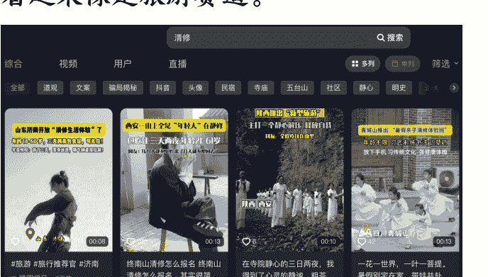

但其实来参与的人，主要不是为了看自然风光，更多的是为了缓解内心的焦虑情绪，也就是和疗愈有一定的关系。加上线下课程里也会有国学相关的部分，所以这个赛道可以理解为旅游+疗愈+国学的综合体，也正是这样，才会很细分很垂直。

整个赛道主要分前端和后端，后端就是有资源对接道观或者寺庙，可以合法开展经营这些活动，一般人干不了。前端就是打流量做一转，也就是我目前干的事情。

至于收益，成功推荐一个客户到线下参与，可以拿到一转的提成，客户如果线下有其他消费，还可以拿二转的分润。

## 二、用户画像调研

去年11月首次接触到这个赛道，我脑子一热就交了980学费，结果交付内容就是一个只有一小时的直播！！（到后面甚至说好的后端交付也取消了，给我气死。我后面还找他们退费来着，哈哈哈）

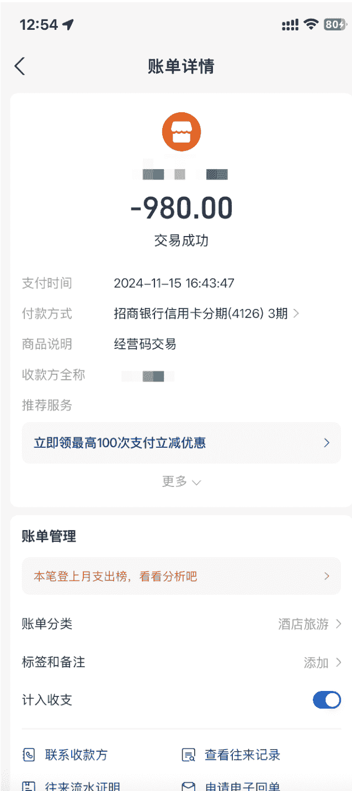

但是听完直播，我隐约觉得这事儿可以干，所以第二天立马做了2个号，想看看到底有没有客资、以及客户到底是什么样子的，希望通过一些真实数据来帮我判别该项目的可信程度。

事实也证明这个赛道还是有不少的需求，我贴一些图片出来，大家可以看看。

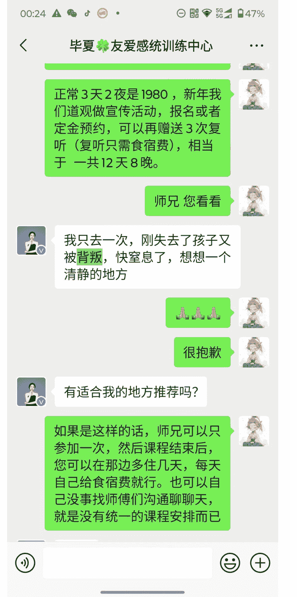

公众号懒人搜索，懒人专属群分享

我谈了一段一年的恋爱，很喜欢对方，但是不合适结婚，就断联系了。

想出去静静心。

🙏🙏

三天有点短。

明白了。

师兄因为这个课程每日有打坐、抄经等日课，全程也是素斋，考虑到大家的体验，所以是二。

懒人微信：lazyhelper

卍高雷卍 道友 3.21

边大概多少人呢？
我看怎么安排接待您。
我先是一个人。
如果人多，也可以单独为你们开一个班。
根据你们的时间。
我们是公司集体去。
明白了。

我想下午先去看看体验一下，明天晚上回，回去后给我们股东汇报说一下，可以吗？

明白了师兄，那我要安排一下。

您是今晚要住一晚吗？

花开花落 待定

师兄，这是我们三天两夜课程具体安排，包含了道家养生功法、道家文化、周易奇门、道医等内容。师兄您有特别感兴趣的部分吗？

主要是想学一些强身健体的功法。

这部分也会包含在内的，师兄。八段锦这些都是基本内容了。到时候您也可以专门请教下师傅，给您一些指导。

师兄晚上好。
休息了吗？
是否需要现在给您介绍下终南山的静修安排呢？

昨天 06:46
您说说。
想带孩子去，15岁女孩，家长和孩子一起去。

昨天 09:24
师兄，早上好，不好意思，昨晚看您没回消息，就休息了。
没问题的，师兄，我们15岁孩子是半价的。

> 孙瑛：想带孩子去，15岁女孩，家长和孩子一起去

然后刚好都是双人间，您和孩子。

目标客户的年龄大概在25-40居多，有上班族、有宝妈、有创业的、也有想来团建的、以及少量老年人和孩子，但大面上的需求，都还是指向了情绪问题：生活/工作带来的焦虑、恋爱/婚姻里带来的痛苦、对人生价值意义的困惑，以及少量对养生感兴趣的人。

聊完差不多50多个客户，我就基本下定了入局的决心。如果说AI是趋势的话，我觉得情绪问题才是永恒不变的痛点。每个人都有七情六欲，人生的两大难题无非是如何找寻快乐、如何去除痛苦。

## 三、收益测算

整个市场的课程安排从2天1夜到5天4夜不等，价格从1000多到四五千都有，但是大多集中在1500-2500。

至于渠道的分润，一般一转可以拿25%-30%，也就是一单500-600左右；二转一般可以拿15%-25%，具体金额取决于客户的消费情况，从几百到几万都存在。

目前我这边合作的后端比较靠谱，每推一个客户平均下来最后的总分润我能拿到1000左右。以下是客单价比较高的一期，8个人我这边分润了1.2W。

> 清修营合作 一转人数8人
> 二转明细
> 一、1/10000，2.10000，合计20000
> 二、1/1000，2/1000，3/1000，4/1000，合计4000
> 三、产品：1/299*7=2093，2=299，3=219，3=438，合计=3049
> 二转合计成交：8115
> 6月份14-17日清修营一转+二转分润合计：4800+8115=12915

好的
很详细👍
我安排财务转账🙏
好嘞

当然如果你能同时对接多个后端，那么也有机会让收益翻倍。我是因为有其他项目也在同步推进，精力实在有限，所以5月份放弃了江苏茅山，只保留了目前陕西终南山在长期合作。单月推荐客户数基本稳定在15-35之间，除去一些成本，剩下的利润就是1-3w，不算多，但是现在每天2-3小时的投入，我已经很满意了。

## 四、保姆级玩法拆解

作为渠道方，我们要完成客户的一转，也就是让客户交定金。具体来说，每天就是重复干4件事：找对标以及搜集素材+剪辑+发布视频+微信聊天转化。

### 1. 筛选对标

逻辑很简单，爆过的视频一定可以再爆。我们打开抖音搜索清修/禅修，就可以看到很多爆款视频。很多人会喜欢选那种超多点赞的去对标，但一定谨记，我们要的是客资，而不是涨粉点赞收藏这些虚荣指标。

所以找到一个作品后，一看评论区的评论是不是大部分人在问如何报名，这是为了确认该模板真正击中了我们的目标用户。

懒人微信：lazyhelper

#### 西安一山上全是“年轻人”在静修
#### 包吃住三天两夜年龄21-61岁
#### 网友：压力大静不下心，来了几天就不想回去了

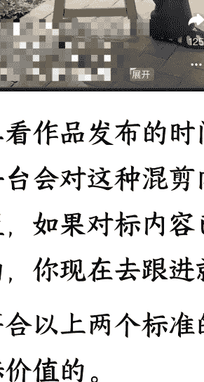
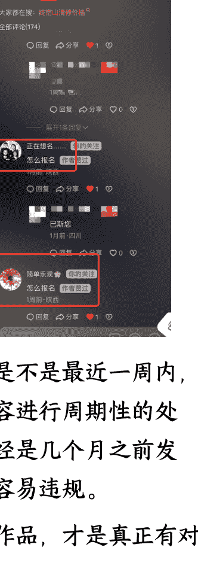

二看作品发布的时间是不是最近一周内，平台会对这种混剪内容进行周期性的处置，如果对标内容已经是几个月之前发的，你现在去跟进就容易违规。

符合以上两个标准的作品，才是真正有对标价值的。

### 2. 拆解对标

找到对标后，我们需要进行拆解，尽可能做到1:1还原，拆解的维度如下。

- a. 大字报文案
  比如这个视频，大字报的文案一共三排，第一排说明了是清修这个产品、第二排是部分产品特色、第三排是体验后的收获，现在行业里的文案模板基本离不开这个框架。

- b. 画面构成
  这一点是为了配合大字报文案，让观众产生美好联想，进而产生咨询的冲动。比如视频里有打坐、练功、素斋等画面。

- c. 背景音乐
  懒人微信：lazyhelper
  一般音乐和画面以及大字报文案是有关联的，主要就是节奏欢快的和带点煽情的这两大类。

这三个元素其实就是在帮你筛选上面我提到的目标人群，如果有生财圈友想做这个赛道，建议前期至少要每天分析3个以上对标视频。坚持1-2周，你就不用去看同行的了，自己随便写写，剪辑出来的东西都八九不离十。

当然除了这种10s以内的视频，其实也有一些长视频数据不错，比如下方这种，把具体线下体验的内容都做了一一展示，看起来更具体更形象。这种视频镜头多，面对每天发布几十条视频的要求，素材会很紧张很难解决，所以大部分同行都慢慢的摒弃掉了这种长模板。

### 3. 搜集素材

确认对标模板以后，就是找素材进行混剪，混剪的效果如何，70%的影响因素都来自于素材的原创度和高清度。这个部分我测试了很多办法，现在算是基本解决了。

#### 3.1 网上直接扒+AI编程做的小工具去重

通过观察同行的对标视频，发现其中的镜头基本就是武大、太极、八段锦、品茶、风景、建筑等元素，那么只需要通过搜索关键词，找到对应的博主，然后批量下载视频就行。

下载完后，需要进行分割成3s一个，也是为了后面的混剪做准备，这一步直接用Cursor写了2个小软件，一个专门批量分割素材、另一个专门做去重（抽帧、滤镜、md5值等）。

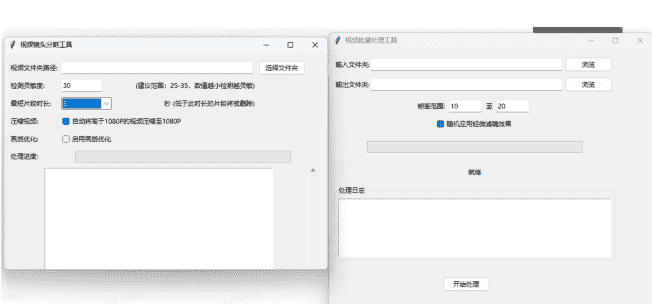

#### 3.2 电商平台买

好处是便宜，坏处是没几个能用的。很多摄影爱好者拍出来的寺庙/道观视频都是4k高清，一个几十秒的视频几百M甚至几个G，处理起来极其麻烦。再就是这个赛道因为刚出来不久，所以符合画面要求的素材屈指可数，于是这个办法也很快被抛弃了。

#### 3.3 找兼职拍摄

如果你周围有道观/寺庙，管理也不是那么严格的话，就可以让兼职去出镜真人拍摄。一个兼职一天我给的是150-170，摄影师一天300，拍一天可以拿到500条3s左右的素材，每一条的成本就是1-1.5元左右。

懒人微信：lazyhelper

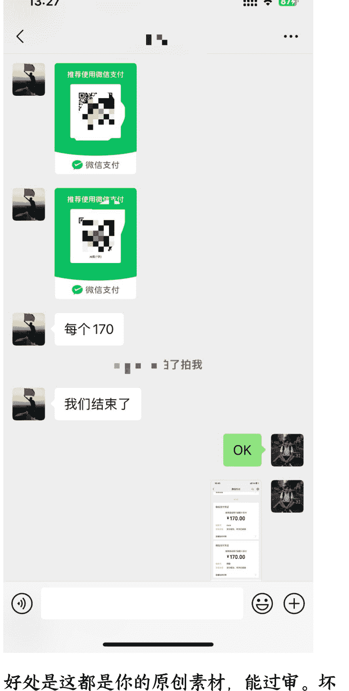

好处是这都是你的原创素材，能过审。坏处就是拍一次就要花几百，用上2-3周又不行了；而且太远的地方，兼职和摄影师都不愿意去；也不可能同一个地方一直拍，那样的话就是原创的抄袭素材了，哈哈哈。

#### 3.4 AI产出素材

清修混剪视频的素材大体分为两类：人物集体活动以及一些环境的空镜头。前者用AI出视频损耗率太高了，加上人工要随时盯着，确实很费神，时间成本和token成本都很高。

所以后面集中在用AI生成空镜头，测试了很多不同的图生视频工具，目前我觉得效果最好的是即梦3.0，大家可以看看。

如果文生图的提示词不知道怎么写的话，可以拿道观的图片给GPT或者其他AI让它反推。有了图片以后，只需要加一些简单的运镜提示词就行，拿到的结果也是100%可用。加上即梦一天有不少免费点数，如果账号多的情况下完全不需要为出AI视频付费，只需要一点时间成本，完全可以接受。

最后再放一个含有AI素材的成品视频，大家来看看效果。

以上四个方法各有优劣，但是结合起来，基本上可以解决素材问题。而最最最最终极的解决方案，其实是……大家往后看吧，卖个关子。

### 4. 视频混剪

混剪定义（懂的自动跳过这里）：假设一个视频有10个镜头，而每一个镜头有10段素材都符合要求，混剪就是依次从每一个镜头里面随机抽取一个素材，然后组成一个视频。

| 镜头1 | 镜头2 | 镜头3 | 镜头4 | 镜头5 | 镜头6 | 镜头7 | 镜头8 | 镜头9 | 镜头10 |
|---|---|---|---|---|---|---|---|---|---|
| 素材1 | 素材1 | 素材1 | 素材1 | 素材1 | 素材1 | 素材1 | 素材1 | 素材1 | 素材1 |
| 素材2 | 素材2 | 素材2 | 素材2 | 素材2 | 素材2 | 素材2 | 素材2 | 素材2 | 素材2 |
| 素材3 | 素材3 | 素材3 | 素材3 | 素材3 | 素材3 | 素材3 | 素材3 | 素材3 | 素材3 |
| 素材4 | 素材4 | 素材4 | 素材4 | 素材4 | 素材4 | 素材4 | 素材4 | 素材4 | 素材4 |
| 素材5 | 素材5 | 素材5 | 素材5 | 素材5 | 素材5 | 素材5 | 素材5 | 素材5 | 素材5 |
| 素材6 | 素材6 | 素材6 | 素材6 | 素材6 | 素材6 | 素材6 | 素材6 | 素材6 | 素材6 |
| 素材7 | 素材7 | 素材7 | 素材7 | 素材7 | 素材7 | 素材7 | 素材7 | 素材7 | 素材7 |
| 素材8 | 素材8 | 素材8 | 素材8 | 素材8 | 素材8 | 素材8 | 素材8 | 素材8 | 素材8 |
| 素材9 | 素材9 | 素材9 | 素材9 | 素材9 | 素材9 | 素材9 | 素材9 | 素材9 | 素材9 |
| 素材10 | 素材10 | 素材10 | 素材10 | 素材10 | 素材10 | 素材10 | 素材10 | 素材10 | 素材10 |

按照原有镜头顺序输出的叫做有序混剪，打乱原有镜头顺序后输出的叫做无序混剪。用高中的排列组合进行计算，10个镜头每个镜头有10个素材，最多可以有10的10次方那么多可能性。而如果是无序混剪，能组合出来的视频则更多，具体多少我也算不清楚😂。明白这个原理后，就可以进行剪辑了。

前期如果不想投入太多，可以直接用剪映人工剪，只是会麻烦一些。我现在每天发布的量比较大，所以不得不上工具，对比了很多，最后选定了超级编导，我觉得算是行业里比较好用的。

价格方面，我是在闲鱼上对比了十几家超级编导代理商，最后选了个极其便宜的。目前一条视频剪出来的成本大概只需要3到4毛钱，我还是很满意的，人工剪一条怎么也要5-10分钟。

而且平台还会自动计算混剪后的视频的重复率是多少，把你担心的问题解决得明明白白。

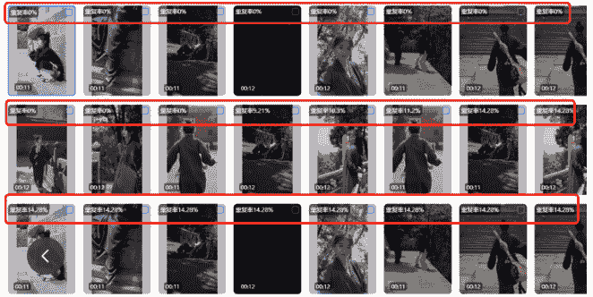

### 5. 文案标题

这个赛道目前经过一些洗盘，过年前可以很好的在视频里植入各种搜索词、长尾词，我的大号已经停更了很久，但是每天依然有客资，而且全是搜索流量，非常精准。

终南山清修怎么报名？终南山清修怎么报名，其实很简单，联系师兄帮您安排好班次即可，三天两夜只要四位数出头，性价比很高，还赠送定制清修服

#终南山清修怎么报名 #修心修行 #终南山 #走出低谷 2024-12-7

涿州.道缘堂 你的关注 现在还能报名吗 2天前·河北 回复 作者赞过 可以哦 2天前·四川 回复 分享

简单乐观 你的关注 怎么报名 7-18·陕西 回复 作者赞过 s您 7-18·广西 回复 分享

年后就不太行了，老是出现违规，所以现在的文案和标签，我都是AI随机生成一些，有时候甚至什么都不要做，直接发，就吃平台的自然流。

懒人微信：lazyhelper

#### 终南山清修体验分享与推荐

版本：
【基础版 10条】
- 1. 来终南山静修几日，夜夜都能睡整觉，超爱这种远离喧嚣找回内心安宁的感觉，推荐体验
- 2. 到终南山静修数天，每天都是深度睡眠，超享受这种都市外的宁静状态，值得一试
- 3. 在终南山静修五天，实现了连续安眠，这种返璞归真的生活状态太治愈，建议尝试
- 4. 终南山静修小住，每晚都能睡踏实，沉浸式体验远离钢筋水泥的平静，推荐给焦虑党
- 5. 来终南山静修养心，获得久违的完整睡眠，这种与世隔绝的平和状态太难得，速来
- 6. 在终南山静修一周，夜夜自然醒不夜起，找回内心本真的状态太美好，建议打卡
- 7. 到终南山静修调整，作息回归日出而作，这种返璞归真的生活节奏值得体验
- 8. 终南山静修体验，每天睡足黄金八小时，山居生活的纯粹状态让心都静了，推荐
- 9. 来终南山静修七日，生物钟自动校准，这种零压力的生活状态打工人必备，速试
- 10. 在终南山静修度假，获得婴儿般完整睡眠，山野间的纯净状态让人流连，建议尝试

【场景版 10条】
- 11. 清晨在终南山静修看云海，夜晚伴着虫鸣入眠，这种纯粹的生活状态太让人上瘾
- 12. 静修期间帮老乡晒山货，简单的体力劳动后夜夜深睡，这才是生活该有的样子
- 13. 跟着静修老师采药煮茶，日落而息的生活节奏，让失眠十年的我找回婴儿眠
- 14. 终南山静修时学做竹编，专注的手工活让夜间入睡特别沉，这才是治愈系生活
- 15. 参与静修农活种菜浇水，适度的劳作带来深度睡眠，山居状态简单却充实

### 6. 矩阵发布

发布环节前期我是全手动，没有采用任何的工具。如果你是做混剪，我也建议不要信那些黑科技，一机一卡一号才是王道。

买了超级编导后，就彻底释放了，因为平台有个功能：可以把剪辑好的所有视频集合在一张二维码里（加上我的分发现在是有部分兼职的账号，对于他们来说，这个钱赚的也很简单。）

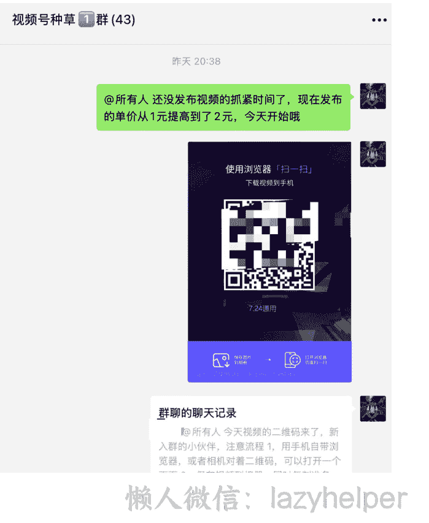

@所有人 这是今天上午的作品，大家尽量在中午12：00之前全部发出去

记得把之前0播放的或者1000以下的全部删除

只需要打开抖音扫一下，就能获取视频、标题、文案，然后直接发布，简直不要太爽。视频号的稍微麻烦点，需要浏览器扫码，先保存到本地，再去发布，但比起去挨个给兼职发素材，也高效了很多很多。

@所有人 这是今天上午的作品，大家尽量在中午12：00之前全部发出去

记得把之前0播放的或者1000以下的全部删除

### 7. 引流私域

视频发布后，客户一般会有两种咨询方式，第一是评论区问如何报名，第二是直接私信你。

现在还能报名吗

懒人微信：lazyhelper

我的处理流程一般是给对方的评论点赞（1次提醒）、给对方的评论回复（2次提醒）、关注对方（3次提醒）、给对方的作品点赞和评论（4次提醒）、给对方发私信（5次提醒）。

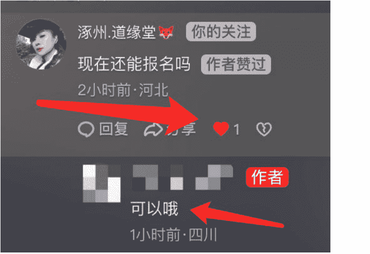
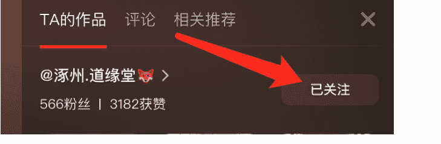
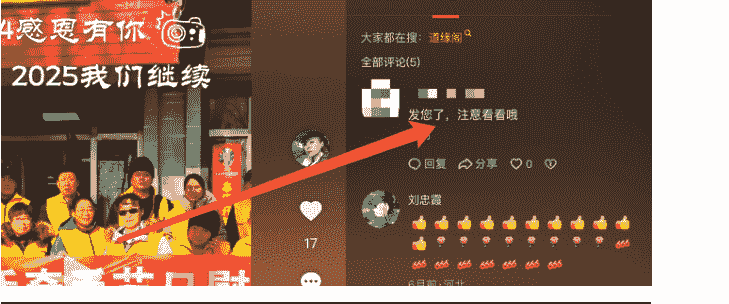
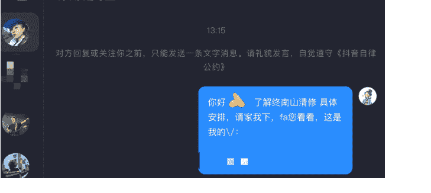

因为这个赛道很细分，平台也时不时限流，所以每一个主动咨询的客户都要尽可能加到微信，上述5个动作意味着对方最多可以收到5次提醒，也就可以大大的提高加v率了。

### 8. 销售转化

#### 8.1. 基本转化思路

这个赛道不看IP，产品内容及价格也很标准，所以对销售的能力要求并不高。

主要就是给客户解释清楚班期时间、具体内容、价格、地点、住宿吃饭、安全等问题，客户愿意来就来，不愿意来，你任何话术都没用。同时保持每天朋友圈发布，多与客户面前曝光，该成单的都会成单。下方是一个完整的转化过程，大家可以感受下难易程度。

7月17日 凌晨00:35

我叫炎城，咱们的班有哪些内容，什么费用，怎么报名。

以上是打招呼的内容

你已添加了炎城，现在可以开始聊天了。

您好

终南山静修营每期 4 天，主要是给大家提供一个安静的地方，在师傅的带领下静心修心，顺便学习一下道家文化

这是每一期四天三夜具体安排

主要是关于三个方面的：
- 静心养生功法：打坐、抄经、老子十四式/太极
- 道家文化：礼仪、奇门遁甲、办公室风水、居家风水、命理等
- 道医：针灸、艾灸、穴位、按摩等

> 老D的聊天记录
> 老D:[图片]
> 老D:[图片]
> 老D:[图片]
> 老D:[图片]...
> 聊天记录

> 群聊的聊天记录
> 静空师兄(7月班期预约中):[视频]
> 静空师兄(7月班期预约中):[图片]
> 静空师兄(7月班期预约中):[图片]
> 静空师兄(7月班期预约中):[图...
> 聊天记录

这是自然环境情况

费用是 1818/人，包含了住宿吃饭接送，所有课程内容体验，以及定制的清修服一套。最近的班期是 19-22，师兄您看看，一下子都发给您了，不方便的话请忽略。

> 懒人微信：lazyhelper

# 公众号懒人搜索，懒人专属群分享

清楚的给您解答🙏

7月17日 凌晨01:32

还有长时间的班吗？

7月17日 上午09:48

师兄，因为每天有功法练习，全程也都是素斋，师傅担心大家的适应，才这么安排的。这边环境不错，结束以后呢，你们再多待一段时间，都是可以安排的🙏

7月17日 下午13:09

师兄收到吗😊

最快的是后天开班 19-22
这一期终南山会下雨
天气很舒服
到时候您也可以再多住几天

7月20日 晚上20:38

静空师兄你好，最近的班是怎么安排的？我想25，6号去西安，不知能赶上那个课程安排。

周一 11:20

- 以下是 7-8 月班期安排：
- 7.19-7.22
- 7.28-7.31
- 8.1-8.4
- 8.7-8.10
- 8.14-8.17
- 8.21-8.24
- 8.28-8.31

您可以参与月底 28-31 班期的，25 26 您是到西安有事情要处理吗？

周一 11:37

是的，

周一 11:41

静空师兄（7-8月班期预约中），28-31号的合适，发一个学校的位置给我看一下

# 公众号懒人搜索，懒人专属群分享

周一11:41

静空师兄(7-8月班期预约中)，28-31号的合适，发一个学校的位置给我，看一下怎么过去。

谢谢

周一12:28

宗圣宫
陕西省西安市周至县楼观派出所斜对面

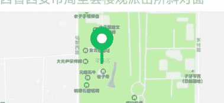

这是咱们道观的位置
28-31号的班我是要27号晚上到是吗?

周一12:36

静空师兄，课程安排是第一天在西安集合然后到道观学习是吗?，28号在西安哪里集合呀

周一16:35

懒人微信: lazyhelper

周一 16:35

师兄，28-31的班期，我们是28号早上9:30在西安钟楼地铁H口集合。是的，上午到了道观后，中午一起吃饭，然后下午就开始有活动了哦。

> 道友 7.28-31：静空师兄，课程安排是第一天在西安集合然后到道观学习是吗？，2...

师兄您看看是否自驾直接到道观，还是钟楼集合一起出发呢？

周一 17:18

我去集合点吧。

周一 17:45

静空师兄，费用1818/人，是四天的费用吧。

周一 19:39

是的，费用都是包含了住宿、吃饭、接送，所有课程内容体验，以及定制的清修服一套，没有隐形消费或者强制消费。

那师兄就辛苦您填个报名表

你撤回了一条消息

#### 报名表
- 姓名：
- 性别：
- 年龄：
- 身份证号：
- 出发城市：
- 身高：
- 体重：
- 联系电话：
- 定金/全款：定金 300
- 日期：7.28-7.31

师兄您信息表按这个格式填一下哦，身份证号码用于大家购买出游保险，身高体重用于定制服装

然后定金您直接转我 300 即可，我的（微信/支付宝），转账的时候可能需要验证一下

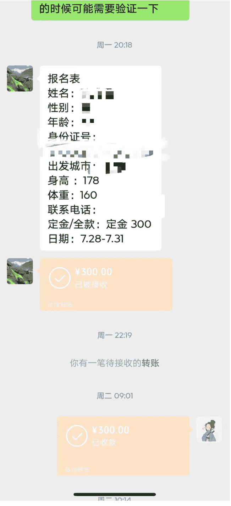

当然聊的多了，你对客户的真实疑虑会很敏感，一些刁钻的问题会处理得比较好，转化率也比新手要高些（行业一般现在是 3%-5%，我一般可以做到 5%-7%）

再一个就是要把客户关心的问题和特殊的需求整理好，开班前给到后端，方便他们了解客户情况，做好交付和转化。

> 懒人微信：lazyhelper

#### 8.2. 金牌销售 AI 知识库

同时，我也在考虑下一步把销售的环节进行外包，让自己彻底释放，所以让合伙人提前做了准备，用 ima 知识库做了个金牌销售 AI 知识库，逻辑是：
- 把现有的包含各种问题回答的聊天记录整理好
- 把这些聊天记录导入 ima 知识库（内置了Ai语言模型）
- 最后封装成一个对话形式的金牌销售语料库

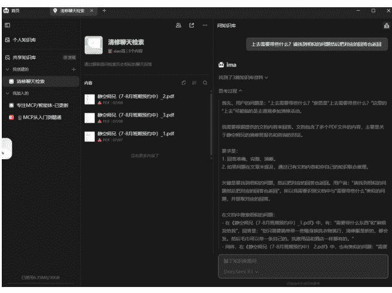

提出问题

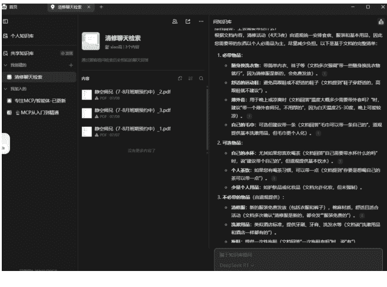

实际使用也很简单，输入客户的问题，AI会自动检索此前我的回答，给到完整的回答、回答思路、参考话术等等。这样一来，即便是对这个行业不太熟悉的新手，也能很快上手，把转化环节的活干到 70 分以上!

截止到目前，其实该项目的核心玩法都说得极为清楚了。但要想收入高，要想增加客资、提高转化率，其实还有几个关键环节（天呐，感觉把压箱底的经验都要掏空了，看到这里的圈友应该不会吝啬你的赞吧😊）

## 五、四个生死攸关环节

### 1. 素材

没想到吧，素材再一次被提及，如果没有耐心看到此处的，可能会错过一个超级无敌的素材搜集办法😊。清修这个玩法的核心是流量，而流量的核心是混剪+矩阵，混剪的核心就是素材!

经过反复的折腾，我发现素材最终还是得靠网上扒才行，因为混剪需要大部分的素材，都能在网上找到该赛道垂直的博主。

只是，大家都来用，最后总是要同质化的，如何解决呢？

某一天我突然想通了，大家一起用没关系，我只要比别人先用，不就行了吗？想通这个道理后，目标就变成了，我要第一时间拿到这些博主更新的素材，及时剪辑及时发出去!

一开始想的是写一套 RPA 流程进行监控，搞来搞去发现太麻烦了。说来也巧，某一天刷视频号，发现了一个博主推荐了一款账号监控软件，立马下载尝试了下，嗯，真香，直接氪金开通了会员。

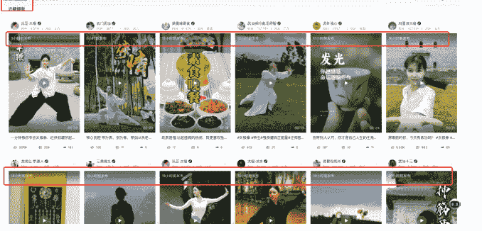

现在我是直接监控了 50 个素材博主，平台会轮询这些博主并展示最新发布的视频，以及发布的时间，而我要做的，就是每天下载一次最新的素材进行混剪即可。就这样，一个困扰几个月的问题算是彻底解决了!

这就是做互联网赛道的魅力之处吧，你费尽心思想解决的问题，早已有人帮你准备好了答案，多去找找总是能找到的。（如果找不到呢？那就更好了！这意味着你有机会成为第一个提出解决方案的人!）

### 2. 账号

很多做矩阵的，会选择厅卡，设备、月租这些花钱当然能解决，但是 IP 的问题可不好解决，一旦封禁，就是一窝端。再一个现在各大平台都越来越严格，内容发的多了早晚跳人脸，这个可就不好解决了。

为了一次性解决掉这些问题，现在我现在采取的办法是使用兼职做分发，直接给到一张二维码，兼职抖音扫码就可以完成发布，同时也可以下载视频分发到其他平台。

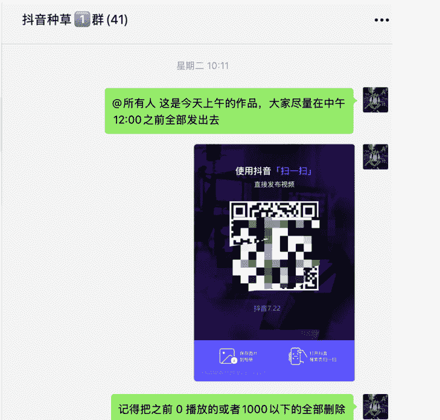

然后按照发布+客资进行回收，这样解决了号卡和机器、解决了IP、解决了实名，有一两个封禁也不至于全封，而且单粉价格还比自运营便宜，简直不要太香。

### 3. 期数

我去盘了下此前所有意向客户，发现他们最后没有来的原因，基本都是时间不合适，25-40这群人都是上班族，超过2天的假期基本靠年假和调休，不可能来迁就你的班期时间。

他们的时间弹性基本在5天以内，比如今天加上微信确认了各方面都没问题，那么5天以内你没有班期，他就来不了了，我因为这个原因至少飞了20单。

所以如果你想做这个项目，一定记得选一个班期开的多的后端。据我所知，目前行业里每月开班期数最多的是四川峨眉山，大家看看这个班次。

| 项目名称 | 班期1 | 班期2 |
|---|---|---|
| 峨眉山 明心雅集 | 06.20-06.22 | 06.20-06.23 |
| | 07.04-07.06 | 07.04-07.07 |
| | 07.18-07.20 | 07.18-07.21 |
| | 08.01-08.03 | 08.01-08.04 |
| | 08.15-08.17 | 08.15-08.18 |
| | 08.29-08.31 | 08.29-09.01 |
| 峨眉山 清心静宿 | 06.23-06.25 | 06.23-06.26 |
| | 07.07-07.09 | 07.07-07.10 |
| | 07.21-07.23 | 07.21-07.24 |
| | 08.04-08.06 | 08.04-08.07 |
| | 08.18-08.20 | 08.18-08.21 |
| 峨眉山 宁心养生 | 06.27-06.29 | 06.27-06.30 |
| | 07.11-07.13 | 07.11-07.14 |
| | 07.25-07.27 | 07.25-07.28 |
| | 08.08-08.10 | 08.08-08.11 |
| | 08.22-08.24 | 08.22-08.25 |

你啥时候来基本都有合适的，那转化率肯定能再提高不少！（插句题外话：我的项目合伙人目前正在对接负责峨眉山文旅的公司，合作基本上已经确认下来了，感兴趣的小伙伴可以一起来玩）

### 4. 平台

目前的混剪内容小红书很容易违规，而且发出去几乎没流量，有时间的可以做一些精美图片，文案里植入关键词，就吃搜索流。

抖音是很难爆，但是只要发的多，就有客资。时严时不严，最近后端那边几十个号在一堆，被一窝端。但是我这边因为是兼职的分发模式，IP 完全隔绝，所以受影响很小。不过这几天也发的少了，准备观察一段时间再恢复。

视频号的流量很极端，要么就是几乎没有，要么就是很猛，一条视频爆的时候可以来 50-100 个客户，如果你私信频次把握好了，甚至可以引流更多。

这四个点都是外人看不见且很难想到的，即便让我做付费培训，估计也不会轻易说出去，但是都写到这个地方了，也没啥好藏着掖着的。另外也主要是因为生财这个圈子的分享氛围太浓厚了，让我也忍不住想参与到其中，哈哈。

## 六、单兵作战的取胜思路

因为是单兵作战，所以时间精力是最大的挑战，我在完成每一个环节的 mvp 后，会立即想办法用兼职的模式把我自己解放出来，这种花小钱办大事的感觉真的很爽。

### 1. 兼职哪里找

我此前还做过咸鱼虚拟资料、头条分成等项目，都通过兼职的方法实现了快速放大。而找兼职，最快捷的办法其实就是去那些专门做兼职招聘的公众号里进行投放，他们已经完成了大量兼职的聚集，我们只需要写清楚自己的需求，付钱投放即可。我合作的渠道，700 元一周可以加 V500 左右，400 元一周可以加 V200 左右。

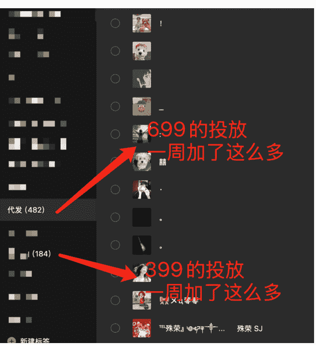

### 2. 兼职如何对接

如果是做分发，就看你的赛道利润怎么样，以抖音发布为例，有的行业很高可以给到 20 元一条视频（一般有点偏灰），而我一开始预算很有限，所以给的是发布一条 1 元、一个客资 2 元。

你可能会说，这也有人做吗？不好意思，每个人对挣钱的概念和期望都是不一样的，我用这样的价格大概可以筛选出十分之一的人长期跟着我做。

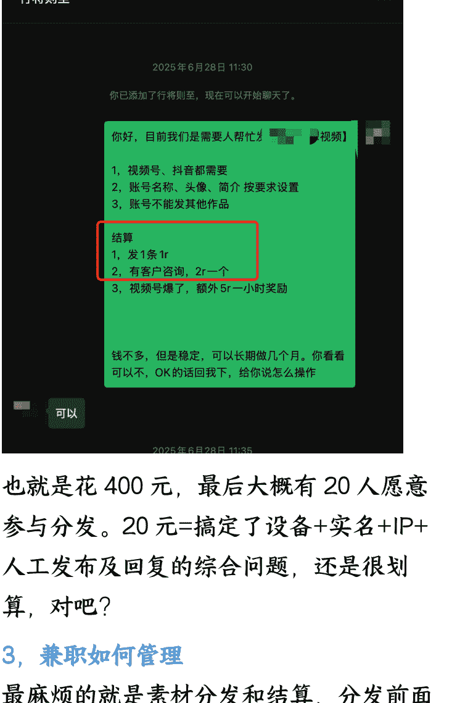

也就是花 400 元，最后大概有 20 人愿意参与分发。20 元=搞定了设备+实名+IP+人工发布及回复的综合问题，还是很划算，对吧？

### 3. 兼职如何管理

最麻烦的就是素材分发和结算，分发前面已经讲过了，有工具可以搞定。结算的话，如果是群内结算会经常封群，如果是挨个转账，去搜索每个人的微信名也很麻烦。为了提高效率，我直接搜集了大家的收款二维码放在一个表格里，等待兼职帮我统计完之后（是的，每天大家的发布情况，我也是让兼职帮我统计的），我花 10 分钟挨个扫码结算即可。

| 微信名称 | 所在群 | 收款码 | 7月16日 发布数量 | 7月16日 客户数量 | 7月17日 发布数量 | 7月17日 客户数量 |
|---|---|---|---|---|---|---|
| [Blacked out] | 抖音种草群 | [Icon] | 1 | 3 | 1 | 4 |
| [Blacked out] | 抖音种草群 | [Icon] | 1 |  |  | 1 |
| [Blacked out] | 种草群 | [Icon] |  |  |  |  |
| [Blacked out] | 抖音种草群 | [Icon] |  |  | 1 | 1 |
| [Blacked out] | 抖音种草群 | [Icon] | 1 |  |  |  |
| [Blacked out] | 抖音种草群 | [Icon] | 1 | 2 | 1 |  |
| [Blacked out] |  | [Icon] |  |  | 1 | 6 |
| [Blacked out] | 抖音种草群 | [Icon] |  |  |  |  |
| [Blacked out] | 抖音种草群 | [Icon] | 1 |  |  |  |
| [Blacked out] | 抖音种草群 | [Icon] |  |  |  |  |
| [Blacked out] | 抖音种草群 | [Icon] | 1 | 4 | 1 |  |
| [Blacked out] | 抖音种草群 | [Icon] | 1 |  | 1 |  |
| [Blacked out] | 抖音种草群 | [Icon] |  |  |  |  |
| [Blacked out] | 抖音种草群 | [Icon] |  |  |  |  |
| [Blacked out] | 抖音种草群 | [Icon] | 1 |  |  |  |
| [Blacked out] | 抖音种草群 | [Icon] | 1 | 1 | 1 | 1 |
| [Blacked out] | 抖音种草群 | [Icon] |  |  |  |  |
| [Blacked out] | 抖音种草群 | [Icon] |  |  | 1 |  |
| [Blacked out] | 抖音种草群 | [Icon] |  |  | 1 |  |

其他的环节基本都可以按照上面几个思路去完成，所以现在我的整个工作流，从找模板、找素材、剪辑、兼职招聘、兼职分发、兼职结算、私域转化，70%都已经通过工具+兼职实现了自运转，我就负责确保环节和环节之间正常衔接运转即可。

如果你现在也是处于单兵作战的状态，且业务有类似的地方，那我会建议你尝试花钱外包去释放你的精力，花钱买别人的时间替自己打工（老板思维？）。

当然我也在和合伙人商量，如果下一步能对接上峨眉山，我们还是会考虑用全职的模式去运营，因为兼职有时候沟通以及回复及时性还是差了点，盘子大了，容易在关键时刻掉链子。

# 公众号懒人搜索，懒人专属群分享

## 七、写在最后

- 1. 清修还值得做吗？

每个人选赛道的逻辑不一样，具备的资源和能力也不同，我把清修项目的几个主要点列出来，大家可以做参考。

- 赛道简单，按照标准流程去执行一定会出结果
- 单兵作战或者2-3人小工作室都可以做
- 天花板确实较低，没办法像最近爆火的外卖推广或者AI，能够容得下很多圈友一起加入。
- 竞争小，后端的话能做且能做好的屈指可数，前端的话同一个山头也只有几家最多十几家。
- 可持续，情绪的问题会一直存在，现在大家的焦虑情绪，我觉得不会减少，只会增加。

- 2. 还能再做大吗？

答案是肯定的。其实选后端有个诀窍，就是看这道观/寺庙所在的山，名气是否足够大，有的山自带流量，有的山可能历史悠久但是知道的人很少。

这也是我们现在想和峨眉山合作的原因，名气大、景区开发成熟、配套完善，关键是他们在禅修这个赛道做了好几年了，班期多，也完全不用担心后端交付问题。

除了线下的部分，线上文创部分的售卖权限也在洽谈中，这个板块如果搞定，那么想象空间一下子就大了起来，电商的威力你们懂的。

以上就是关于清修/禅修赛道玩法的所有细节以及我的运营方式，希望对大家有帮助。也欢迎感兴趣的小伙伴我们一起来把这个项目做的更大。谢谢大家的阅读！

最后，安利小懒的付费群：

## 懒人专属群

懒人专属群持续更新中，已持续运营 6 年，整理超 3000 份各类精选付费文章 & 年费社群干货，全部开放下载。

本资料为付费群内部分享，仅供真实有需要的朋友查阅

## 懒人专属群更新记录：

https://lazy2025.top/#/blog/record2

懒人专属群更新记录（需梯子，备用）：

https://lazybook.fun/#/blog/record2