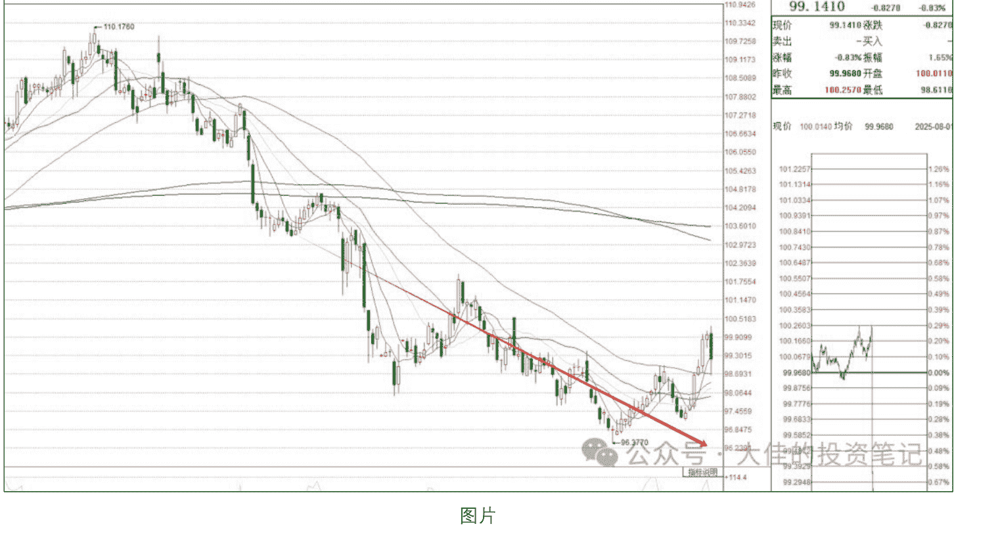
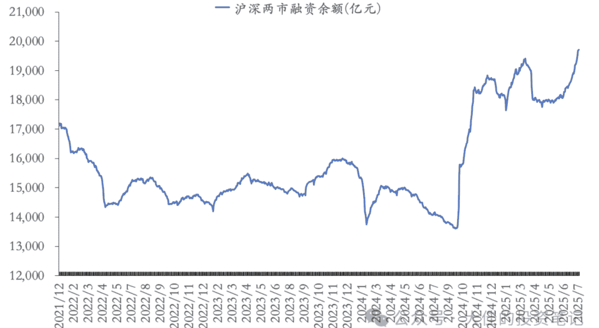

# 非农数据不及预期？从全球市场昨晚的一片惨绿说起

## 250804 大佳投资笔记

整理：公众号懒人搜索，懒人专属群独享

懒人微信：lazyhelper

免责声明：本文是个人日记，不构成投资建议。

文中所有观点，仅代表个人立场，不具有任何指导作用

### 前言：

- 1. 本文 5000 字，分为 8 个部分：
  - 1) 突如其来的全球暴跌。
  - 2) 非农数据真正的影响。
  - 3) 过于乐观，市场太依赖流动性。
  - 4) 极端情况，假如美联储 9 月继续不降息。
  - 5) 当下情况，最好的资产是什么？
  - 6) 把 A 股和港股，放在全球非美市场来思考。
  - 7) 突发，对于国债征税会造成什么影响？
  - 8) 风格大切换，与三季度的主题——通缩。
- 2. 我们平时极少进行打广告，且我脸皮比较薄，不愿意主动征稿费。每月的付费文章，全当作大家平时对我每天的更新的打赏。感谢大家对我的支持~
- 3. 本文核心观点，已在我们交流群（知识星球：大佳和他的朋友们）分享。星球用户可以直接移步到星球阅读。我们将会在本周天，也即 7 月 27 日召开，7 月投资线上交流会。请星球用户，有时间务必报名参加~

### 1. 突如其来的全球暴跌。

过去的一周里面，A 股的走势是非常惨淡的。

但其实，不只是 A 股，也不只是港股。上周，全球市场的走势，都非常惨淡。

尤其是经历了昨天晚上的风暴之后，就更加明显。

那么，要如何看待过去一周，A 和 H 股的高位回撤？

以及，如何看待，全球市场，尤其是股市，在 “关税战” 貌似平稳落地之后，突然的躁动不安？

我们先从昨晚公布的 “非农” 数据说起，并把 AH 股，在 4 月至今的反弹，作为全球市场反弹的一部分，在这种框架之下，分析一下，我们对后续市场的看法，以及我们可能会采取的实战选择。

首先，我们要理解一点，为什么4月之后的贸易战之后，全球股市反而能够节节攀升，并且创出新高？

即使，签订了贸易协议的国家，在事实上，也被川普占了极大的便宜。比如欧洲的关税，还是上升了15%。

所以，本质上，这还是一个利空。只不过，没有4月初市场预想的那么糟糕而已？

我们认为，理由如下：

- 1）为了应对川普的贸易战，各国都普遍增加了财政支出，来支撑经济。比如，欧洲普遍增加了国防预算。比如，美国自己的大美丽法案。比如，韩国新总统上台之后的一系列刺激措施。以及，我们的，被寄予厚望的反内卷系列政策。
- 2）美元的长期弱势。美元指数，和全球股市的走向，呈现明显的反相关。

大家普遍都认为，今年的美股特别强势。但是，美元今年的贬值，大约在10%。而道琼斯的涨幅在2%+，纳斯达克的涨幅在7%。被用来定投美股的指数，标普500etf，今年的涨幅为0.46%。也就是说，如果考虑到了汇率上的问题，今年美股的投资是负收益。如果你投资的是保守的标普etf，那么不仅仅是负收益，而且是有10%的负收益。这也是为什么欧洲股市上涨幅度那么高的原因。因为美元相对欧元贬值幅度更大。以至于大量的欧洲的资金，不得不加大对自家股市的投资。
- 3）贸易战在经济数据上并未显现。因为川普4月之后的关税豁免，以及全球强大的转口贸易能力，所以，无论是欧洲日本，还是中国，甚至美国自己，在经济数据上，并未显示出明显的下滑。因此，权益市场就会有意无意地忽略贸易战带来的经济上的长期影响。在负面影响没有显示的基础之上，又增加了很多新的经济支持措施，那么，反而显得经济在贸易战之下，依然欣欣向荣了。

当我们明白了，为什么全球股市，可以在4月7日之后，节节攀升的原因。那么，对周五全球市场的下跌，就不会过于困惑了。

### 2. 非农数据真正影响是什么？

本身，非农数据并不是一个特别关键的数据。

对市场来说，更关注失业率，和通胀数据。非农长期处于第三位关注的数据。

但昨天的非农数据，实在是过于离谱。

离谱的地方，并不在于“7月新增非农就业人数7.3万人，大幅低于前值的14.7万人和市场预期的11万人。”

而是，“5-6月就业人数累计下修25.8万人，调整之后过去三个月平均新增就业只有3.5万人，远低于过去12个月14.6万人的均值”。

因为5-6月份，向下修正的过于离谱。那么，7月份的数据，就显得非常不可信。

所以，市场收到的信号是：

- 1. 经济下滑了，就业数据开始不那么好了。
- 2. 不好到哪种程度呢？不好意思，我们不知道。

知道了利空，但不知道这个利空有多大，这是市场最不愿意看到的情况，于是，反应就会很激烈。

而这一点，则对应我们第一段说的第三点。

之前市场过度乐观，认为贸易战对经济几乎没有影响。但数据告诉我们，有影响，而且影响要比想象的更大。

进入到 8 月之后，尽管多数国家已经签订贸易协议。但因为协议之后的关税，比暂缓期明显要高，那么，那么 8 月之后，对经济的影响会更大。

所以，即使未来美联储降息，美债收益率降低，从而美国和别的国家利差收窄，也不构成美元指数持续向下的理由。因为，这会和不确定性的消除这个利好，形成对冲。

而且，我们也很难认为，欧洲的经济就一定比美国更好。恰恰相反，最赚钱的那波公司，还在美股，尤其是最赚钱那波科技公司。

我们认为，如果美国公布的经济数据继续走弱，美元指数更可能是宽幅震荡。

但如果美国公布的数据好于本次的非农，那么美元指数会继续走强，并且不断向上修复。

此外，我们并必须要思考一个问题：如果美联储9月份继续不降息，那应该如何？

### 3. 假如美联储9月继续不降息？

我们认为，美联储在9月份不降息，是有可能的。

理由如下：

- 1）非农数据并不是美联储最看重的。美联储最看重的是失业率，和通胀数据。虽然非农下降，但失业率并没有明显上升。
- 2）美联储非常看重，关税带来的通胀上升的长期性。
- 3）未来，通胀数据可能会超预期上升。如果未来公布的通胀继续上升，那么，美联储将会有非常充足的证据，证明对于通胀的担忧。
- 当然，还有一个权力斗争因素。美联储需要给公众形象展示，自己的独立性。

假如美联储在9月份不降息，那么这将会是全球市场最差的一个结果。因为这意味着：

- 1. 经济已经开始恶化了。
- 2. 通胀还在继续上行。
- 3. 流动性上，还没有对冲作用。

这个时候，市场并不只是交易衰退，而是会交易滞胀。

那么，如果美联储9月份强硬不降息，那么，后续会如何？

美联储真的不担心，会引起更多的失业，以及更大的经济滑坡吗？

我们认为，美联储并不担心。

因为美联储，可以在2026年，进行疾风暴雨式的降息，从而很快，对冲掉，市场对于衰退的担忧。

### 4. 当下情况下，最好的资产是什么？

综合以上分析，我们认为，全球市场现在面临的情况是：

- 1）对于之前过于乐观的经济形势，需要进行预期的再平衡。市场需要悲观一点。
- 2）对于美联储，继续不降息，做好一定的准备。存在这种可能性，且可能性并不算很低。至少要比现在市场以为的要高很多。

目前市场认为，美联储9月降息的概率是80%-90%。这显然过高了。

那么，在这个状况之下，我们认为，最好的资产是什么？

答案是，美债。

理由如下：

- 1）如果美联储9月份降息，也即美联储认为，经济形势已经需要他们开始降息。或者认为，通胀不严重，所以降息，那么，一定是利好美债的。
- 2）如果美联储9月不降息，也即，美联储认为，虽然经济形势不好，但通胀更重要。为了通胀，暂时牺牲掉经济。那么，未来一定是疾风暴雨式降息。

所以，第一种情况，美债将会比较平稳地上涨。第二种情况，美债将会继续横盘，并且在明年之后，开始大幅度上涨。

但无论如何，这是一个回撤很小的，非对称交易。

这也是为什么，我们会一直重仓美债的原因。

至于美股，和全球市场的股票，我们认为，至少应该减仓。把一部分仓位留给美债，或者黄金。

对全球大类资产，我们看法是：

美债优于黄金，黄金优于大宗金属，大宗金属优于美股，美股优于石油，石油优于非美股票市场。

### 5. 把 A 股和港股，放在全球市场中思考。

当我们把 A 股和港股，置于全球市场一部分来进行分析，那么很多问题都会豁然开朗。

比如，人民币同样相对美元升值，但升值的没有欧元那么多。

比如，我们二季度经济形势，远远比 4 月预期的更好。

比如，我们也推出了一定的经济的新措施，比如反内卷。

比如，我们在 6-7 月的上涨，也可以视为全球股市补涨的一部分。全球股市的上涨路径是：美股-欧股-日股-韩股—AH 股。

而且，也是因为我们的逻辑，没有欧美股市那么强，所以，这轮反弹，尤其是港股的反弹，尤其是恒生科技指数的反弹，同样也是全球最弱反弹。

这也是因为两个乐观预期落空。

第一，中美并未顺利达成协议。且，目前看来，挡下的关税豁免的延期，也都可能存在不确定性。

第二，年中的政策，几乎完全落空。期货市场最近暴力下跌，就是对这种落空的自然反应。

所以，AH股，在全球市场来看，并不那么特殊，反而严格遵循了全球市场，尤其是非美市场的一般规律。这也是，我们并不愿意，用简单的牛市熊市来描述当下市场的原因。因为这种描述，非常简单粗暴，且充满了一厢情愿。

### 6. 突如其来的对国债的征税，以及影响

近期除了年中政策落空，和全球市场风暴之外，还有一个不大不小的新政策。

就是大家讨论非常多的，对国债的征税。

细节，我们等待政策进一步明晰之后，再进行讨论。我们大体上可以这样理解：

- 1）对于银行这种法人机构自营为6%。
- 2）对于公募这种委托理财为3%。
- 3）新老划断，8月8日发行之前的老债不征收。

造成的结果就是，新债和旧债，会有10 个 bp 左右的利差。

有影响，但是并不那么大。

问题在于，为什么这个时候要对国债征税呢？

有一种观点认为，财政左手倒右手，没有意义。

我们认为，这种观点是错误的。因为，财政一定不会通过提高新发行债券的利率来让自己“左手倒右手”。而是会让新发的债券，保持和以前一样的利率。

那么，这就不是左手倒右手，反而是一次降息操作。降息了 10 个 bp。

只不过，这个降息，并不是央行主导的降息，而是财政部为了提高税源，而主导的降息。

当然，我相信这背后一定包含着，财政部和央行的一些勾心斗角。不过，这里不是我们分析的重点。我们的重点是，这个消息会加大市场的风格变化。

### 7. 风格大切换与三季度必然的通缩交易

近两个月，市场在贸易谈判和年中政策高预期下，以及全球股市大涨的烘托之下，风格发生了明显的改变。

市场的风险偏好极高，以至于杠杆资金，在周四大跌的情况下，还在小幅度提升，从而继续创新高。

| 数据日期 | 2025/7/31 |
|---|---|
| 余额 | 19,710.27 |
| 较前一日变动(亿元) | 4.32 |
| 22年来累计变动(亿元) | 2,590.21 |

图片

但随着，贸易谈判和年中政策双双落空，以及全球市场的大涨的基础也受到了动摇，那么，这种风格一定会迎来巨变。

我们本来就认为，随着三季度大规模经济刺激的可能性落空，那么，市场的风格将会重新保守。

再加上，本次国债征税措施，会让债券市场收益率变得更加鸡肋。相对而言，股票市场的红利性价比将会进一步上升。

虽然，10 个 bp，对红利的影响几乎微乎其微，但是，市场的情绪，将会在这个过程当中不断放大。

因为征税这事儿，会再次提醒市场，现在财政很缺钱，三季度需求会继续下滑，且没有更大的刺激措施。这等于是把通缩写到了脸上。

因此，我们认为，三季度最最优风格，毫无疑问将会是红利。且三季度期间，国债的收益率可能会创出新低。

而无论是红利，还是国债的征税，其实都指向一个词，通缩。我们认为，不必在意细节，最重要的是，通缩交易本身。无论是通过红利来表达通缩，还是通过别的交易来表达通缩，通缩这个词都是三季度之中，最重要的一个词。

我们认为，这个交易会一直延续到今年12月，直到年终经济会议，进行新的一轮刺激。

而接下来，A股首先要做的事情，就是消化利空，对政策的落空重新进行定价。以及，需要非常剧烈的杀杠杆。

### 最后，安利小懒的付费群：

懒人专属群

懒人专属群持续更新中，已持续运营6年，整理超3000份各类精选付费文章&年费社群干货，全部开放下载。

本资料为付费群内部分享，仅供真实有需要的朋友查阅

懒人专属群更新记录：
https://lazy2025.top/#/blog/record2

懒人专属群更新记录（需梯子，备用）：
https://lazybook.fun/#/blog/record2

懒人微信: lazyhelper