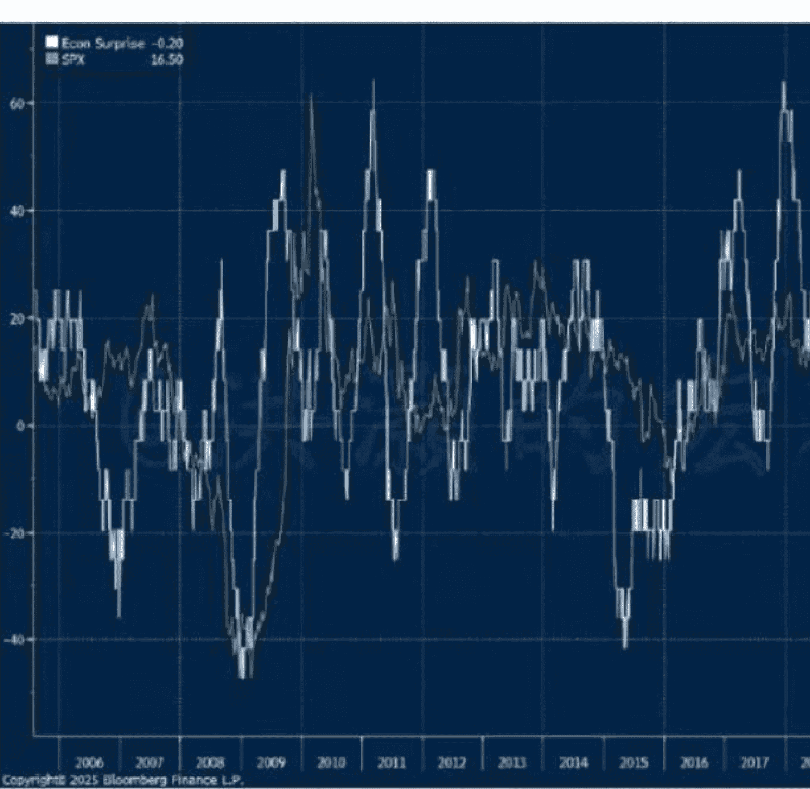

## 洪灝：特朗普怒斩局座——是开启暴跌，还是。。？

250804 洪灝的宏观策略

整理：公众号懒人搜索，懒人专属群独享

懒人微信：lazyhelper


## 是暴跌的开始，还是。。？

> "The Party told you to reject the evidence of your eyes and ears. It was their final, most essential command."-Orwell, from "1984"

昨夜，美国就业数据比初始值预估的要疲软得多，市场担心的劳动力市场放缓终于到来了。最新的非农就业报告显示，美国7月就业人数仅增加7.3万人，低于市场预期的11万。更值得注意的是，前几个月数据也被大幅下调。美国劳工统计局（BLS）数据重新调整之后，5月仅新增1.9万个就业岗位，较初始公布的14.4万低了近90%。而6月的新增就业岗位也被下修至1.4万个，远低于此前公布的14.7万个。综合来看，5月和6月的新增就业比之前的预估少了25.8万个，但美国失业率从6月的4.1%只微升至4.2%。

数据一出，全场哗然。毕竟，这些数字和特朗普希望描绘出来的“让美国再次伟大”的宏观叙事不符。特朗普更是拍案而起，怒炒了劳工统计局局长。而美国市场则应声而落，美元、美股、加密货币暴跌，市值一夜之间蒸发了逾万亿美元。

市场质疑统计数据的声音四起。很多人认为出现如此大的就业数据下修，那么一定是统计局局长水平不够，或者是就业数据被掺水了，并据此而对于特朗普的斩首行动拍手称快。如果各位还记得，在不到一年前，2024年的9月大选前，特朗普的手下干将Rubio认为当时的就业数据显著地低估了拜登时期经济困难的状况。也就是说，卢比奥不到一年前认为美国的就业数据太高了，美化了拜登的执政政绩。那么，现在特朗普又认为就业数据太低了，并以此为借口炒掉了劳工统计局局长，不免有选择性执法之嫌。顺便说一下，这位局长是拜登任命的。

上一次美国劳动统计局局长被炒，还是1932年大萧条时期。当时由于局长不同意胡佛的经济政策，胡佛就把他炒了，而大萧条继续。

特朗普不仅仅炒掉了局座，他还在自己的社交媒体上继续对于美联储主席鲍威尔攻击施压。这是过去几年来，特朗普在自己的社交媒体上攻击鲍威尔最频繁的一次，并在上周实地视察了美联储斥资30亿美元的装修工程，当面施压。特朗普认为鲍威尔早就应该降息，但补充说“不会马上炒掉鲍威尔”，然后又加了一句“如果不是担心市场波动，早就把他炒了”。随后，媒体又爆出了一位美联储董事辞职的消息。

这位董事是拜登任命的。

这一系列的爆炸性新闻，难免不让人想入非非。毕竟，BLS局长说炒就炒，现在还空出来一个董事席位。特朗普时期就提名了两位董事，而这两位董事在最近的议息会议中对于不降息都投了反对票。虽然只是两个反对票，但是在近年来的美联储历史上，这样的投票应该还是首次。特朗普对于他们的反对票赞不绝口。

其实，这位董事的辞任应该和昨晚的一系列事件没有太大的关系。毕竟，这位董事是大学教授，在一个赫赫有名的大学Georgetown有自己的终身任期（tenure）。任何一个大学熬到了有自己的终身任期的教授，都不是等闲之辈，而且待遇非常优厚，经费充足。所以，这个董事回去大学里继续教书，应该不是什么太难以理解的事情。

然而，她的离任，给特朗普打开了重塑美联储的窗口。昨晚，市场对于美联储九月份的降息预期提高到了80%。然而，美股照跌不误，并牵连到了其它风险资产类别，同时市场隐含波动率也开始飙升，一副避险情绪上升的样子。在昨天白天亚洲盘的专属报告《洪灝：3600点和特朗普的关税大限》中，我为读者预警了这次突如其来的暴跌。现在的问题是——这是新一轮暴跌的开始，还是一次久违了的技术调整？

以下内容仅 V+会员可见

从资产类别的价格波动来看，昨晚的加密货币这种对于流动性非常敏感的资产却不涨反跌，说明其风险的属性在昨晚的交易中比流动性属性更重要。或者说，市场认为，如果美联储降息虽然可以导致流动性条件继续改善，但是更多的是一次防范增长大幅放缓甚至衰退的降息。因此，降息的预期上升，国债收益率下降，金银贵金属上升。至于美元，由于昨夜数据反映的是美国经济增长远不及预期，那么美元也因此而大幅走弱。换言之，可能是衰退型降息并不利好美元，而前几年增长型加息则让美元成为高息无风险资产，吸引全球资金流入。

当然，还有另外一种解释。

这次美联储董事辞任，为特朗普重塑美联储打开了窗口。理论上，美联储董事的任命需要美国国会投票批准，很可能需要两三个月的时间。然而，这两个月国会放暑假。法律上，在休会期，美国总统可以不通过国会投票任命美联储董事。然而，历史上没有一位总统这样干过。但特朗普显然和其它总统不一样。

如是，特朗普将像上一个任期里一样，安排自己的亲信进入美联储。同时，这个新的董事很可能将是下一任美联储主席。虽然只有三票，但是这个新的董事将对于鲍威尔在美联储的领导地位造成或多或少的干扰。这个新的董事很可能成为一个“影子美联储主席”。当鲍威尔明年任期满了之后，这个新的董事将顺理成章地成为美联储主席。

在之前的专属报告中，我讨论过对于美国经济和市场一个更大的潜在威胁，就是特朗普干预美联储货币政策的独立性。如果现在特朗普利用国会休会期间安插一个影子美联储主席，我们有理由相信美联储的政策有效性、独立性很可能会大打折扣。

这样看来，昨晚的市场交易的焦点，就一目了然了。市场认为由于经济数据力有不逮，美联储大概率将在九月份降息，以防衰退。此时，增长型资产和风险资产下跌，防御型资产上升。这就很好地解释了为什么昨晚美元跌、美股跌、加密跌而金银涨的盘面。市场又重新回到了避险模式。而值得注意的是，白银在昨晚的避险盘里也涨了很多。而很多人认为白银工业属性太重，并不是一种贵金属。然而，昨晚的盘面否定了这个说法。即便如此，我们还是需要再次强调——白银波动剧烈，持仓的感受其实并不会好。

总结一下：昨夜美国就业数据远逊于预期，同时五六月的数据遭遇大幅下修，市场质疑之声不断。一般来说，美国的经济数据在初始估算（initial estimate）之后都会有调整（revision）和最终估算（final estimate）。在经济周期拐点附近出现这种大幅的修正，其实并不奇怪。同时，疫情后，统计样本发生了很多变化，之前用的一些作为预测的估算假设条件也改变了很多。因此，最近几年就业数据出现大幅的修正，其实并不奇怪。特朗普驱逐非法移民的政策也人为地压低了失业率。

特朗普以此为由炒掉了劳动统计局局长，显示了特朗普不断测试institutional底线的决心。同时，一位董事的离任也为特朗普重塑美联储打开了窗口——尤其在国会休会时期，法律规定美国总统有权力指任一位新的董事。无论是谁，这个新的董事都将是特朗普的亲信，对于特朗普言听计从，左右美联储的货币政策独立性，成为一个影子美联储主席。市场因此进入避险模式。在黄金再次逼近3500点的历史高点之际，而白银的避险属性似乎也开始受到了市场的认可。

美国的經濟数据还将疲弱。虽然二季度年化GDP增速超预期，但是结构很难看，消费者已经买不动了。疲弱的经济数据还将继续困扰市场（图一），现在还不是增加风险的时机。



图一：美国经济还将疲弱，市场开

最后，安利小懒的付费群：

懒人专属群


📚 懒人专属群持续更新中，已持续运营6年，整理超3000份各类精选付费文章 & 年费社群干货，全部开放下载。

懒人微信：lazyhelper

本资料为付费群内部分享，仅供真实有需要的朋友查阅 🙏

## 懒人专属群更新记录：

```
https://lazy2025.top/#/blog/record2
```

### 懒人专属群更新记录（需梯子，备用）：

```
https://lazybook.fun/#/blog/record2
```