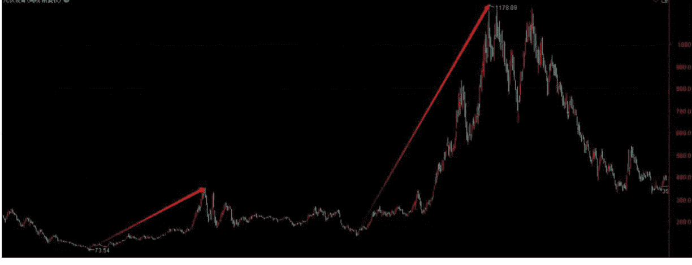
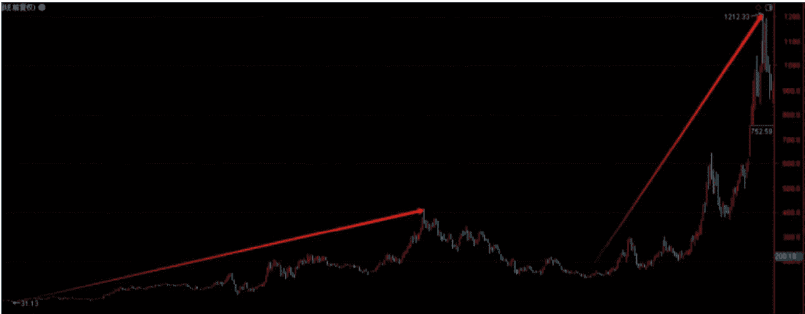
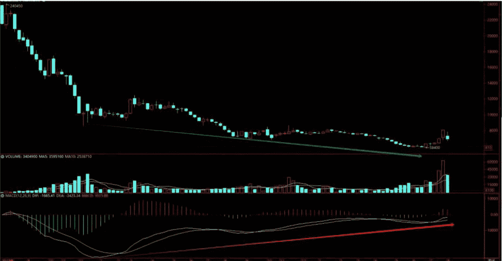

# 再次布局战略投资 已付费
原创 anmin0001 安民Anmin0001深度分析 2025年08月02日 07:01 湖北

这期是一项浩大的工程。

## 先讲下什么是我们团队眼中的战略投资

我们团队眼中的战略投资，就是在一个行业还比较小的时候，选择行业中具有比较优势的公司进行投资，投资时间长，至少包括两轮中线投资，通过两轮或两轮以上的中线投资持股，来获得不错的投资收益，并最终实现资产很好的增值，让个人或家庭资产得以升级。

那么，什么是中线投资呢？我们团队眼中的中线投资，就是一个完整的牛市投资周期，两轮中线投资，就是在两轮牛市中持有那个方面的股票，从而取得行业大幅增长的收益，以及因为公司比较特殊的竞争优势而获取的成长投资收益，包括行业高成长时所产生的股票溢价，就是同时取得这几个方面的收益。

那么什么是行业大幅增长收益呢？就是当一个行业快进入风口时，那个行业当时比较小，收入一般，所有公司的利润也都不怎么好。之后行业和公司都进入高速成长阶段，越过盈亏平衡线，之后行业和公司收入都进入超高速增长阶段，利润的增长速度会快于收入增长速度，使得利润的增速看起来会有些恐怖，市场也因此而对它们给出很高的估值。结合大盘指数或行业指数，可以找到第一次牛市的顶部，在那附近减仓或清仓，拿到第一波中线牛市投资收益。

第一波中线投资收益，它实际上是行业和公司高增长+市场高溢价给出的很好的投资收益。

之后大盘指数会因为涨多了进行一轮调整，板块指数也会进行大调整，在那个阶段，我们采取回避的策略，当那个调整结束或快结束时，我们对那个战略性的行业和公司进行第二轮中线投资，中线持仓，然后结合牛市的运行节奏，在第二轮牛市的顶部获利出局。

就是我们做那个行业和关键性的典型公司的投资，我们至少要做两波牛市。至于会不会做第三波牛市，关键到时要看行业竞争格局，也看整个大盘的情况。

我们举个行业指数的例子再讲清楚：

如图是光伏设备行业指数周K线图，代码881275。是从2011年1月以来的历史走势。我们进行战略投资的阶段，对这个指数来讲，是2012年12月初到2015年6月中旬。时间是两年半，持股时间大致是130到131周。至于这个底部和顶部的判断，需要用到技术手段。然后它的空间呢，第一波中线牛市，它从73.54点涨到了354.06点，涨幅4.81倍。

第二波中线持股阶段，是从2018年10月中旬到2021年9月初。顶底如何抓到，依然要靠技术手段。周线上它是149周，从134.07点涨到了1178.09点，涨幅8.79倍。

显然，这一波涨得更凶，那是更为典型的成长阶段，行业规模越来越大，收入高增长，利润高增长。然后到顶部我们减仓就成。

我们想一想，这两波牛市中的龙头个股，只要达到前10名，涨幅至少是指数涨幅的一倍半。

这是光伏设备历史K线图教给我们的知识。它走了两波大的牛市，即使只是指数的平均涨幅，即使第一波熊市我们选择持股，也有1178.09/73.54=16.02倍。如果抓到好股票了呢？恐怕会超过25倍对吧。然后有些环节咱们抓不住，掐头去尾，大家能够抓到多少倍？再打个折，还能抓到多少倍？

多的不讲，五六倍总能抓住吧。

讲这个，就是讲我们的操盘对策。即当我们面对战略性的行业，面对大的成长行业和比较典型的成长个股，而且是战略性的机会，我们该怎么思考和布局，怎样通过个人的选择争取自己的未来有一个更好的结果。

至于我们能够抓到什么样的股票，取决于我们个人的研究能力；怎么抓底，怎么抓顶，取决于我们的技术水平。

您有那个技术水平，您就能抓住底，也能抓住顶。那我们个人有没有这样的投资经历呢，有。完整地吃到两波牛市（第一波牛市中的回撤选择不减仓而是持股），然后改变投资命运，收益50倍。

今年是2025年，现在是8月2日，我们选择进行战略投资。然后模式准备换一下，准备牛市的第二段回避调整，第二段末期进场。

然后我们前面讲了，七八月份我们要进行战略布局，方向我们选择两个方向，行业分析 4和 行业分析 2中的方向。

这一次我们讲的布局，是 行业分析 4中的一个分支方向。

因为这个方向有历史走势在前面跟我们打了个样。当然，这是我们采取的理论回溯，总结它历史上曾经出现过的走势规律，然后得出客观的历史性结论。然后我们准备根据历史上的走势，来争取看有没有可能实现历史重演。

记住，股市有个规律，历史会再次重现，尽管不会完全一样。

比如我们前期K线图讲过的30+31的规律，出现过几次？已经出现过4次了，对吧。这就是历史周期的重现。我们这里讲历史重演，并不是历史上它涨了几倍后面就会涨几倍，肯定不可能。但是，如果以前历史上它涨了25根月K线，那么后面也有可能重现历史上的上涨周期，比如20到24个月。

如果这样的情况发生，您挣个5%或10%就走，岂不是很不明智？

还有，写这篇文章真的太累，把我们团队都累得个半死。年轻小伙子他们都喊受不了。只是这没有办法。毕竟是将20家公司放到一起研究，毕竟是第一次展示我们战略投资的思路。

## 一、历史走势有没有什么启发价值？

我们先看历史走势的周K线图。

历史上，这个指数它曾经也走出过两波牛市。第一波涨了13.87倍，第二波牛市涨了9.31倍。两波牛市一起算，中间的熊市调整不回避，它也涨了38.94倍。注意，这是指数的涨幅，代表性个股的涨幅，肯定要好于指数的的。这次我们选择这个板块，同时对板块个股进行全面扫描，一共扫描了20只个股。希望我们团队的研究对您有帮助。因为表格太多，建议大家用电脑版微信阅读。

（声明：本文只为开拓视野、引导思路，并非择时、亦非荐股。股市有风险，入市需谨慎。本文不构成投资建议或意见，我们无力为大家的投资负责，请大家注意投资风险）

再讲下时间。它第一波牛市上涨的时间是247周，幅度是13.87倍，第二波中线牛市涨了107周，幅度是9.31倍。

现在要考验我们的，就是在一轮中线牛市中，我们理性思考，自己能够抓住它多大的涨幅？两轮中线牛市呢？

那我们先看看它的周K线图，它是881079。锂。它有11只股票：盛新锂能、西藏矿业、天齐锂业、永兴材料、中矿资源、赣锋锂业、融捷股份、天华新能、江特电机、雅化集团、威领股份，其中威领股份是碳酸锂期货指数下面没有的。微信pep854

再就是LCL8碳酸锂主连有21只相关股票，跟上面不一样的是，永杉锂业、西藏珠峰、川能动力、盐湖股份、红星发展、金银河、藏格矿业、科达制造、国轩高科、西藏城投。我们这次分析没研究国轩高科，因为它是做锂电池的。

图中两个红色箭头是历史上出现过的两次中线持股期。

因此，如果后面我们操作它两波，涨幅应该不会小。如果回避掉中间那波调整的大部分，两波中线牛市加起来涨10倍有没有可能?也许应该有。如果没有的话，涨5倍呢？

当然，这是我们采取的理论回溯，总结它历史上曾经出现过的走势规律，然后得出客观的历史性结论。然后我们准备根据历史上的走势，来看是否会出现历史重演。记住，股市有个规律，历史会再次重现，尽管不会完全一样。比如我们前期K线图讲过的30+31的规律，已经出现过4次。这就是历史周期的重现。37也出现过3次。

而且本次牛市第一段的第三节，估计也将是历史周期的重演。

## 二、我们为什么选择这个子行业呢？

基于4点。

第一点，行业弹性。为什么讲行业弹性呢？是因为这个子行业的个股，收入弹性和利润弹性都特别大。行业弹性大，跌时跌得凶，涨时也涨得凶。这是第一点，我们看中了它的弹性。简单地说，别看现在收入不好，利润更不好，未来会很好的，特别是在行业发展的高峰期，它的利润会非常好。而且未来炒固态电池一定会炒到它。以前的历史走势就表明了这点，否则它的板块指数不会涨十几倍和八九倍。

第二点，周期性。这个指数其实经历了3轮熊市两轮牛市。第一轮熊市，下跌了70周，时间是从2011年7月中下旬到2012年12月初，从67.01点跌到31.13点，跌幅是53.54%，腰斩；当然，因为有指数的时间晚，因此以前的就不知道了，我们也不用多研究。

第二波熊市从413.71点跌到130.26点，跌了68.51%，时间是98周。

第三轮熊市跌了155周，时间足够长。跌幅是从1212.33点跌到238.64点，幅度是80.32%，也是历史上少有的跌幅。

从第一个低点到第二个低点，是一轮完整的牛熊周期，它一共走了344周，涨247周，跌97周。从2012年12月到2019年8月，共81根月K线。

第二个低点到第三个低点，是又一轮完整的牛熊循环周期，它一共走了261周，涨107周，跌154周；月K线图上是62根月K线。鉴于本轮熊市结束点在2024年2月5日，该指数的低点出现在9月18日，已经晚于大盘见底了，那么我们判断它极有可能第三轮熊市调整已经结束。

这个熊市周期结束，还有个重要的数据，就是电池级碳酸锂的价格，2022年最高时超过60万元/吨，2025年5月底的最低价格是5.96万元/吨；6月23日，最低5.995万元/吨，价格跌幅超过90%。我们可以看期货周K线图：

碳酸锂期货2023年7月中旬才上市的，最高价240450元，最低价58400元。周K线图上出现了两次明显的背离，58400处是第二次周K线的背离了。也即根据碳酸锂期货走势推断，正常情况下，锂已经结束了熊市。

第三点，它面临一个比较大的中长期市场需求量的增长。动力电池本身就用锂，今年估计国内1700万辆左右的装车，然后估计高峰期，中国的动力电池装车量还有3倍到3倍多的空间。但它还能增长的关键，在于储能市场会有较大的增长，还有以可穿戴设备为代表的消费电子的需求。微信pep854

但更关键的是三个产业，未来会有很大的行业增量。一是飞行汽车。二是人形机器人。三是固态电池用锂量和液态电池用锂量不一样，也会有增长；保守估计，非金属锂负极的硫化物固态电池锂含量增长50%；比较典型的情况是，固态电池锂含量为液态电池的2倍到3倍；而含金属锂负极的大型固态电池，锂含量可以达到液态电池的3.4倍。

第四点，政策背书。本次反内卷，最具典型性的是光伏，锂电和新能源汽车。当然，光伏是最典型的，锂电池其实也卷得很。

我们团队的研究表明，某公司的某一类产品，销售7.39亿元，53.18万的毛利。还有一种产品4200多万的销售，330多万的毛利亏损。连毛利都亏损，这就是反内卷要反击的对象。本次研究的20家公司中，锂盐毛利亏损的有好几家。更典型的是雅化集团的锂业务，41.16亿的销售，但毛利还亏损306.7万。

所以，不仅是光伏，锂盐一样会反内卷，这个政策封锁掉了锂价格的下跌空间。现在谁敢跟政策唱反调？谁唱反调收拾谁。因为反内卷是中央财经委员会定下的调子，财委会主任是咱们党和国家的最高领导人，副主任是总理。谁那么没长眼去对着干？

当年马某在陆家嘴上怼人银，结果蚂蚁金服在A股本来都发行了，我们还中了签，立马撤回。现在谁敢去唱对台戏？

不用别的，只是三天两头到你工厂去查查环保达不达标，三废排放有没有超标？有没有压上游的款，拿货60天必须付款，这个有没有执行到位？查查消防，做做演习，再找个理由审计审计，看你缴税是否规范。那你公司还工作不工作？只要让你严格执行拿货60天必须付款，把历史上的欠账先给上游的企业付了，很多公司都得吐血，都经不起严格地查。能明白吗？

然后我们要重点讲一个知识。业绩的弹性缘于第二点和第三点，第四点起到某种助力的作用。

碳酸锂从60万跌到6万，那么它再反弹一波，比如从6万反弹到30万有没有可能？如果反弹不到30万，20万有没有可能？20万达不到，15万呢？对吧。

2025年6月，锂辉石提锂的平均成本为5.5万-6万元/吨，外购锂辉石大致在7.1万到9万/吨。盐湖提锂成本大致为3.1万到4万/吨，南美大致为5.8万元/吨。高成本的云母提锂产能在出清。

产业有一个规律，就是盈亏平衡线。就是在除掉成本，再减掉费用和计提，不计非经常性损益的情况下，就会出现一个盈亏平衡线。假设某企业生产碳酸锂的成本是5.5万一吨，然后税后售价为6万元/吨，则毛利为5000元/吨，此时只是毛利，因为要减税金及附加、销售费用、管理费用、研发费用、财务费用、信用减值、资产减值，这些减完了，再扣所得税费用，再加减其他收益投资收益和公允价值变动收益以及营业外收支中不含非经常性损益的部分，才是企业的扣非净利润。当扣非净利润=0时，那时的产品价格就是盈亏平衡点。

假设当碳酸锂产品价格为6.5万元/吨时，企业的扣非净利润=0，达到盈亏平衡点。此时企业的产品税后售价为6.5万元/吨，直接成本为5.5万元/吨，间接成本为1万元/吨，间接成本率为1/6.5=15.3846%。当碳酸锂的售价超过6.5万元/吨时，企业的扣非净利润就有了。

如果这家企业的成本一直是5.5万元/吨，间接成本一直是1万元/吨，那么当价格涨到7万一吨时，它每吨盈利5000元，10万吨盈利5亿，假设是25%的所得税，扣掉所得税费用后为3.75亿元。

假设价格涨到8万，每吨盈利15000元，10万吨盈利15亿，扣25%所得税就是11.25亿。涨到10万呢，就是26.25亿的扣非净利润。涨到20万呢？

基本规律是，只要过了盈亏平衡点，涨上去的扣掉所得税后就是净利润。所以到时利润增长特别快。当然，这个是大致的算法，并不是很严格。比如生产5000吨时，每吨费用1万元，生产5万吨，每吨费用绝对要不了1万元。所以到时利润就会更多。而这个就弹性。

当然，每个公司的数据都会有所变化，比如行业情况好时，工人工资奖金会加，加班费也会涨，上游价格也会涨，费用上也会大手大脚一些，谁家过年还不吃顿饺子呢是吧？所以实际情况比上面静态计算的要复杂得多，但内在的逻辑和道理就是这样的。

这就是我们投资锂881079的原因。弹性好，加上下游会遇上需求量增长，再加上上面有政策背书。本来我们做成长股，一般不做周期股，但这个细分行业现在非常特殊，毕竟碳酸锂的期货价格是2025年6月23日才见底的，价格跌幅超过90%，现在离底部价格不远，极有可能是比较好的低点投资周期。

因此，它未来的涨价空间估计不会小。因此这次就选择成长股中的周期股投资。当然，第三阶段，我们也会选择固态电池行业中的其他子行业的股票投资。

## 三、锂在固态电池中的应用

我们做锂资源的战略投资是基于什么呢？正是基于这点，应用就是需求。我们这就涉及到做需求研究。这是全部投资的根。如果这个根不存在了，那么我们的投资也就不存在。因此，对我们投资的根必须要做一个研究。当然，这部分更重要的是讲固态电池化学和物理的专业性的内容。

这部分涉及的内容很多，很长，如果短的话，我们可以讲得明白一点，但太多了，只能讲干货，所以无法做到很通俗。化学不好的可能读不明白，建议还是

### （一）锂在固态电池中到底是怎么存在的？起什么作用？

- 1. 基础电化学反应的载体
  - （1）充放电。固态电池中，锂离子作为离子电荷载体通过固态电解质在正负极间迁移，电子通过外电路如铜线作为电子电荷载体参与传输。放电时锂离子从正极经固态电解质迁移至负极，充电时反向迁移至正极，同时电极材料发生氧化还原反应实现能量转换。固态电解质通过空位迁移机制传导离子，且具备不可燃特性。这里讲的是充放电时，锂离子在固态电池中是如何迁移的。注意是锂离子。
  - （2）金属锂负极。采用纯金属锂做电池负极，理论比容量高达3860mAh/g，是石墨负极372mAh/g的10倍有余，使电池理论能量密度可达500Wh/kg，不排除未来还有可能突破。现在的负极是石墨，也就是碳负极，固态电池将来是锂负极或硅基负极。也即未来的固态电池很大程度、很大比例上要用锂负极。

- 2. 锂在固态电解质中的传输机制与界面特性
  - （1）传输机制。锂离子在固态电解质中通过晶格缺陷和预设离子通道传输，不同于液态电解质中的自由迁移。氧化物电解质通过铝氧八面体和磷氧四面体构成的三维网络传输，而硫化物电解质则利用硫元素的柔性成键特性构建超离子通道。这段话是对上面的“固态电解质通过空位迁移机制传导离子”的进一步解释，包括讲氧化物电解质和硫化物电解质如何传输锂离子。微信pep854
  - （2）界面特性。固态电解质同时承担电解质和隔膜功能，与锂金属负极形成的固-固界面需要特殊设计以避免高阻抗。目前用人工SEI膜和微乳电解液可显著改善界面稳定性。

- 3. 关键技术挑战与前沿解决方案，锂金属负极的技术难题
  - （1）枝晶生长。锂沉积不均匀易形成枝晶，可能刺穿电解质层导致短路。固态电解质虽能抑制枝晶，但仍需配合三明治结构。
  - （2）三明治结构。多层保护设计使枝晶横向生长而不穿透。
  - （3）应力适应。硫化物固态电池的实验数据显示，通过干法电极工艺和350MPa等静压技术，循环膨胀力可控制在传统液态电池的30%以内。

### （二）电池级碳酸锂在固态电池中的作用及应用

- 1. 核心作用
  - （1） 基础锂源功能
    - 第一是正极材料制备。碳酸锂是制备高镍三元、富锂锰基等固态电池正极材料的基础锂源。在固态电池正极烧结过程中，碳酸锂分解提供活性锂离子，与过渡金属氧化物形成稳定的层状或尖晶石结构。硫化物固态电池单GWh的锂盐消耗量为850吨碳酸锂当量，较液态三元电池增加23%。就是电池级碳酸锂用于制造高镍三元、富锂锰基等固态电池的正极材料。再就是制造硫化物固态电池时，锂盐消耗量较液态三元电池大致增加23%。
    - 第二是作为电解质的原料。在制备部分氧化物固态电解质如LLZO即锂镧锆氧、部分硫化物电解质如LGPS即硫锗磷锂的过程中，碳酸锂可作为锂源前驱体。例如硫银锗矿型LPSC固态电解质需要高品质硫化锂粉体作为核心原料。硫化物固态电解质中锂含量达20-30wt%，而液态电解质中锂含量只有5-8wt%，相差4倍左右。
  - （2） 提升性能
    - 第一是导电网络构建。固态电池正极中导电剂如碳纳米管，需要碳酸锂作为锂源以平衡电化学体系，添加比例达到1%-3%，高于液态电池。
    - 第二是提升界面的稳定性。通过碳酸锂分解产生的Li₂O可改善正极与电解质界面接触，减少界面阻抗。研究表明，适当过量的锂源可补偿固态电池循环过程中的锂损耗。这些都意味着需求。

- 2. 固态电池对碳酸锂的技术要求更高
  首先体现在纯度标准，要求达到99.5%或以上，钠含量少于或等于万分之0.5，铁含量低于或等于10万分之0.5，钙含量低于或等于万分之0.2，镁含量低于或等于万分之0.1，磁性异物低于或等于10万分之0.1。

其次是颗粒形貌控制。要求粒径分布均匀，D50约5-10μm，比表面积适中0.5-1.5m²/g，以减少烧结过程中的团聚现象。

再次是杂质管控。过渡金属元素如Ni等含量需低于万分之0.1，以避免在高温烧结过程中出现副反应，影响电极和电解质界面的稳定性。

### 3. 固态电池对碳酸锂的需求量更大

磷酸铁锂电池，单车碳酸锂需求量40-50千克，单位能量耗锂0.25到0.30kg/kWh。三元镍钴锰电池，单车用量60-70千克，单位能量耗锂0.35到0.40kg/kWh。固态电池，单车用量800到1000千克，单位能量耗锂3到4kg/kWh。

## （三）氢氧化锂在固态电池中的作用和应用

#### 1. 核心作用

##### （1）基础锂源

（1）基础锂源。这些和电池级碳酸锂比较相似。

- 第一，正极材料制备。氢氧化锂是制备高镍三元等固态电池正极材料的基础锂源，特别适合高镍体系的合成。相比碳酸锂，氢氧化锂在高温烧结过程中能提供更均匀的锂分布，减少锂挥发损失。
- 第二，作为电解质的原料。在氧化物固态电解质如LLZO制备中，氢氧化锂可作为锂源前驱体，与氧化镧La2O3、二氧化锆ZrO2等原料混合，通过高温固相反应制备电解质材料。

##### （2）增强性能

- 第一，导电网络构建。跟碳酸锂类似。固态电池正极中导电剂添加比例达1%-3%，高于传统液态电池，氢氧化锂能提供更稳定的锂源以平衡电化学体系。
- 第二，界面稳定性的提升。氢氧化锂分解产物可改善正极与电解质界面接触，减少界面阻抗，适当过量的氢氧化锂可补偿固态电池循环过程中的锂损耗。

#### 2. 氢氧化锂在固态电池制备中的具体应用

##### （1）用于正极材料制备工艺

- 第一，高镍正极合成。氢氧化锂与高镍过渡金属氧化物，如镍Ni、钴Co、锰Mn的氧化物按Li:1.05-1.10:1的摩尔比混合，在750-900℃下烧结12-20小时，以合成高镍正极。
- 第二，溶胶-凝胶法。氢氧化锂溶解于有机酸，如柠檬酸，形成锂盐溶液，与金属盐共沉淀制备前驱体，烧结温度可降低至600-700℃。

##### （2）用于制备固态电解质

- 第一，氧化物电解质。氢氧化锂与La2O3、ZrO2等原料混合，通过1100-1200℃的高温固相反应制备锂镧锆氧LLZO电解质。
- 第二，复合电解质。在聚合物电解质中添加氢氧化锂可降低结晶度，提升离子电导率，如PEO-LiOH体系。

#### 3. 应用

##### （1）技术参数要求

- 第一是纯度标准。纯度大于或等于99.5%。关键杂质控制，钠低于或等于万分之0.5、铁低于或等于十万分之0.5、磁性异物低于或等于十万分之0.1。
- 第二是物理特性。粒径分布D50约5-10μm，比表面积0.5-1.5m²/g，目的是减少烧结过程中的团聚现象。

##### （2）量产应用案例

- 卫蓝新能源的第二代半固态电池采用氢氧化锂基正极，能量密度达350Wh/kg，-20℃容量保持率超80%。
- 国轩高科的金石电池，使用氢氧化锂优化界面，能量密度达360Wh/kg，通过200℃热箱测试。
- 比亚迪的刀片固态电池，采用氢氧化锂界面技术，体积能量密度达600Wh/L，较传统结构提升40%。

随着固态电池技术能量密度接近或超过500Wh/kg，氢氧化锂在材料纯度、界面工程等方面的性能优势进一步显现，未来将会在硫化物固态电池的降本方面做出重要贡献。

### （四）氯化锂在固态电池中的作用及应用

#### 1. 核心作用

##### （1）基础锂源功能

- 第一，电解质原料。氯化锂是制备卤化物固态电解质的基础锂源，可与锆、铁等金属氯化物形成快离子导体。例如氧氯化锆锂电解质使用氯化锂作为主要原料，室温离子电导率达2.42 mS/cm。
- 第二，成本优势。氯化锂原料价格显著低于其他锂盐，2025年6月底到7月中旬，制备卤化物电解质的原材料成本仅30.76美元/千克，远低于硫化锂和稀土氯化物的价格。其中硫化锂，电池级为139.82美元/千克，高端电池级的为350到420美元/千克。稀土氯化物价格更是要贵得多。

##### （2）提高性能

- 第一是优化离子传输。在卤化物电解质中，氯离子的高极化率可降低锂离子迁移难度，提升离子电导率。用AlOCl氧化铝氯修饰的纳米晶氯化锂离子电导率达1.02 mS/cm，比纯氯化锂要高出5个量级。
- 第二是界面稳定性。氯化锂衍生材料可填充正极与电解质的界面缺陷，改善界面接触，降低界面阻抗到8.5 Ω·cm²以下。

#### 2. 氯化锂在固态电池制备中的应用

##### （1）制备电解质

- 第一，熔融反应法。将氯化锆颗粒加入氯化锂熔体中发生界面反应，冷却后得到氯化锆锂固态电解质。
- 第二，湿化学法。将氯化锂与ZrOCl₂·8H₂O等放在水溶液中反应，通过精确控制结晶过程制备纳米级电解质前驱体。
- 第三，复合电解质。氯化锂与硫化物电解质复合可兼具高离子电导率，以及良好可变形性，就是在300MPa下致密度大于90%。

随着固态电池技术向500Wh/kg能量密度目标迈进，氯化锂在低成本电解质制备方面的优势将进一步凸显，预计2027年它在卤化物固态电池中的降本贡献将超30%。

- （2）与某些正极材料配套效果很好
- 第一，卤化物正极。Li2FeCl4等卤化物正极材料与氯化锂基电解质兼容性好，体积变化仅3.2%，在10C倍率下循环5000次容量保持率85.1%。
- 第二，高电压正极。氟掺杂Li3InCl5.5F0.5的电解质与4.5V高压正极兼容，循环100次容量保持80%。

#### 3. 应用

##### （1）赣锋锂业

- 第一，Mariana项目。阿根廷盐湖生产电池级氯化锂，2025年产能达2.5万吨LCE当量，用于配套固态电池产线。
- 第二，电解质体系。开发六氯锆酸锂Li2ZrCl6电解质，适配硅基负极，能量密度320-450Wh/kg，循环寿命超1000次。

##### （2）中科大

- 第一，氧氯化锆锂电解质。使用水合氢氧化锂、氯化锂、氯化锆合成，原材料成本11.6美元/kg。
- 第二，电池性能。匹配NCM811正极，1A/g电流下循环2082次容量保持70.2mAh/g。

##### （3）三祥新材专利技术

- 第一，界面优化。通过氧化铝Al2O3界面层将锂迁移活化能从0.78eV降至0.52eV。
- 第二，量产工艺。电解质层厚15μm，孔隙率<7%，适配刀片电池结构。

### （五）金属锂及其他锂盐在固态电池中的应用

除了前面的形式，锂和锂盐还以多种形式参与固态电池制造。

#### 1. 特殊锂盐在固态电解质中的应用

- （1）氟化锂(LiF)。在固态电池中主要作为界面改性剂和电解质添加剂。
- 第一，界面稳定剂。在锂金属负极表面形成富含LiF的固态电解质界面，可显著提升界面稳定性。北京大学研究显示，含氟化锂的SEI使4.4V高镍正极全电池循环1000次后容量保持率达80.2%。
- 第二，电解质组分。清华大学开发的氟化芳香锂盐作为单一导电锂盐，通过“三联体”溶剂化结构实现LiFePO4/Li半电池1650次循环，库仑效率99.8%。
- （2）磷酸锂
- 第一，固态电解质。作为磷酸锂铝钛LATP电解质的基础组分，修饰NCMA83正极即镍钴锰铝氧化物正极，可使循环50次后容量保持65mAh/g，界面电荷转移电阻降至200Ω。
- 第二，复合电解质。与硫化物电解质复合提升热稳定性，使工作温度范围扩展至-30~120℃。
- 第三，界面缓冲层。在正极、电解质界面抑制副反应，提升>4.5V高压正极的兼容性。

### 2. 复合锂盐在固态电池中的前沿应用

- （1）锂硼氢化物体系
- 第一，甲胺硼氢化锂。室温离子电导率达1.24×10⁻³ S/cm，电化学窗口2.1V，应用于二硫化钛正极全固态电池。
- 第二，硼氢化锂-碘化锂复合物。浙江省白马湖实验室开发的LiBH4-LiI复合电解质通过液相法制备，显著提升离子电导率。
- （2）锂铝氢化物
- 第一，界面工程。铝掺杂锂铝氢化物可将锂迁移活化能从0.78eV降至0.52eV。
- 第二，作为富镍正极的表面修饰剂，抑制晶格开裂和电解液氧化，但它的化学活性需要严格管控。

### 3. 锂合金材料的创新应用

#### （1）锂镁合金

- 第一，自修复机制。1%镁含量可使锂金属负极寿命提升2倍，通过空隙自填充机制抑制枝晶生长。
- 第二，性能参数。循环寿命>10000次，容量保持90%；能量密度529.3Wh/kg，复合设计达725.6Wh/kg。

#### （2）锂硅合金

- 第一，微米硅负极。理论容量3579mAh/g，体积能量密度较石墨提升很大。
- 第二，商业化进展。刀片固态电池采用硅基负极，体积能量密度600Wh/L；国轩高科金石电池通过200℃热箱测试。

### 4. 锂盐在辅助材料中的应用

#### （1）粘结剂体系

- 第一，聚偏氟乙烯PVDF基粘结剂。结晶度50%，熔融温度140-180℃，需配合NMP溶剂使用。
- 第二，聚丙烯酸PAA粘结剂。羧基与金属氧化物形成强键合，适配硅基负极体积变化。

#### （2）导电添加剂

- 第一，双三氟甲烷磺酰亚胺锂LiTFSI双功能添加剂。半固态电池中作为主盐(添加量3-5%)，提升氧化稳定性和热稳定性。
- 第二，复合导电网络。碳纳米管构建三维传导路径，石墨烯提升面内导电性。

### （六）固态电池锂负极及锂化物负极的材料形式

随着技术发展，锂金属负极在固态电池中的应用正从复合型向纯金属型演进，预计2030年全固态电池出货180GWh时，锂金属负极渗透率将达20%。当前产业界同步推进多条技术路线，根据应用场景需求选择适配的负极材料形式。

固态电池中锂负极及锂化物负极以多种材料形式存在，主要可分为以下几类：

#### 1. 纯金属锂负极形式

- （1）锂箔和锂片
- 技术特征。采用压延法制备的金属锂箔，厚度通常为20-50微米，赣锋锂业开发的二代混合固态锂电池采用双面20微米锂箔，共计40微米，能量密度达420Wh/kg。2030年预计锂金属用量达7700吨。
- （2）三维多孔锂结构
- 第一，设计原理。通过模板法或电化学沉积构建三维多孔框架，增大活性表面积。
- 第二，性能表现。中科院金属所通过构建三维聚合物网络填充结构缺陷，使界面阻抗降至8.2 Ω • cm² 以下。

#### 2. 锂合金负极形式

包括锂镁合金和锂硅合金。前面有讲。

#### 3. 锂化物复合负极形式

- （1）硅碳负极
- 第一，材料特性。理论克容量4200mAh/g，通常采用纳米化、复合化处理改善性能。
- 第二，商业化应用。卫蓝新能源、太蓝新能源等厂商主要布局硅基负极路线。中科电气硅碳负极已建设完成中试产线。
- （2）锂-石墨复合负极
- 第一，过渡方案。在石墨中掺入5-10%金属锂，再向全锂金属负极过渡。
- 第二，性能平衡。兼顾能量密度提升与循环稳定性，适用于半固态电池体系。

#### 4. 界面工程材料

- （1）人工SEI膜
- 第一，功能设计。通过LiF等材料构建稳定界面层，抑制锂枝晶生长。
- 第二，性能表现。含氟化锂的SEI使4.4V高镍正极全电池循环1000次后容量保持率达80.2%。前面有讲。
- （2）复合导电网络
- 第一，结构设计。依靠碳纳米管和石墨烯来进行结构设计。
- 第二，工艺参数。导电剂添加比例1-3%，高于液态电池，干法工艺正极片面容量达7mAh/cm²。

## 四、20家公司的基本情况及吨成本线

我们前面讲过，我们团队将扫描今年研究的行业2和行业4的全部个股。当然，只是扫瞄。扫瞄往往只能得到一个初步的印象和总体的认知，但也很重要。经验老到的，扫瞄就知道哪些公司比较有意思。如果要有更清晰的了解，需要深入研究。微信pep854

因此，在这里，我们对21家公司的基本情况和业务情况做一个梳理和描述。注意，排名不分先后。而且我们团队只研究，不荐股。

### 1. 威领股份，002667

这只我们淘汰了。之所以淘汰了的也讲，是便于讲清楚我们的思路。就是我们的方法，选择了谁不一定能特别准确，但淘汰了谁，一定准确。先看公司前5年业绩（单位，万元）：

| 项目 | 2020年 | 2021年 | 2022年 | 2023年 | 2024年 | 2025Q1 |
|---|---|---|---|---|---|---|
| 收入 | 29015.34 | 22896.72 | 118594.68 | 114140.11 | 53267.14 | 6120.99 |
| 成本 | 23726.77 | 17399.53 | 68646.70 | 96537.59 | 53968.77 | 6235.74 |
| 毛利 | 5288.57 | 5497.19 | 49947.98 | 17602.52 | -701.63 | -114.75 |
| 毛利率% | 18.23 | 24.01 | 42.12 | 15.42 | -1.32 | -1.87 |
| 费用 | 6238.78 | 11451.15 | 20801.42 | 29561.08 | 23219.91 | 3568.10 |
| 股东净利润 | 505.15 | -9592.25 | 8239.41 | 22321.02 | -30792.62 | -2499.39 |
| 扣非净利润 | -427.25 | -9970.99 | 7937.29 | 21739.89 | -32244.24 | -2508.01 |
| 非经常损益 | 932.40 | 378.74 | 302.13 | -581.13 | 1451.62 | 8.62 |

淘汰了的，不意味着不涨。但淘汰掉的，基本面肯定要差一些。再看公司的业务。第一项业务是重型机械（单位，万元）：

| 重机制造 | 2020年 | 2021年 | 2022年 | 2023年 | 2024年 |
|---|---|---|---|---|---|
| 收入 | 16169.24 | 15538.33 | 15755.49 | 8422.36 | 3345.83 |
| 成本 | 11227.56 | 10032.07 | 10703.70 | 6948.49 | 3861.71 |
| 毛利 | 4941.68 | 5506.26 | 5051.79 | 1473.87 | -515.88 |
| 毛利率% | 30.56 | 35.44 | 32.06 | 17.50 | -15.42 |
| 锂盐 | 2020年 | 2021年 | 2022年 | 2023年 | 2024年 |
| 收入 |  |  | 70882.15 | 97657.52 | 41372.13 |
| 成本 |  |  | 43188.50 | 83585.10 | 43908.65 |
| 毛利 |  |  | 27693.65 | 14072.42 | -2536.52 |
| 毛利率% |  |  | 39.07 | 14.41 | -6.13 |
| 精锂矿 | 2020年 | 2021年 | 2022年 | 2023年 | 2024年 |
| 收入 |  |  | 31957.05 | 8012.59 | 8101.74 |
| 成本 |  |  | 14754.51 | 6004.01 | 5448.24 |
| 毛利 |  |  | 17202.54 | 2008.58 | 2653.50 |
| 毛利率% |  |  | 53.83 | 25.07 | 32.75 |

淘汰的原因讲三点：

第一点，公司锂盐和锂矿销售收入即使是在最高峰时都不大，给人增长空间不够的感觉。

第二点，公司用自有矿山的锂云母生产锂盐，也有部分外购代加工，成本高，毛利率低。

第三，公司费用控制不好。看看2023年和2024年的费用，2023年收入下降，但费用超高速增长，2024年收入超高速下降，但费用中速下降。这两年费用都超过毛利，淘汰。

### 2. 科达制造，600499。后面的单位都是万，不再带单位了。

| 项目 | 2020年 | 2021年 | 2022年 | 2023年 | 2024年 | 2025Q1 |
|---|---|---|---|---|---|---|
| 收入 | 738973.1 | 979668.0 | 1115719.7 | 969564.0 | 1260026.2 | 376690.4 |
| 成本 | 568277.6 | 725242.1 | 787159.0 | 686026.1 | 933007.0 | 264891.0 |
| 毛利 | 170695.5 | 254425.9 | 328560.7 | 283537.9 | 327019.2 | 111799.4 |
| 毛利率% | 23.1 | 26.0 | 29.4 | 29.2 | 26.0 | 29.7 |
| 费用 | 148996.0 | 160046.1 | 178624.7 | 193902.1 | 216461.3 | 67406.0 |
| 股东净利润 | 28448.6 | 100575.7 | 425093.2 | 209199.6 | 100631.2 | 34690.7 |
| 扣非净利润 | 3299.4 | 95215.0 | 421286.9 | 187875.4 | 92067.0 | 32296.3 |
| 非经常损益 | 25149.2 | 5360.7 | 3806.3 | 21324.2 | 8564.2 | 2394.4 |

公司主要做建材机械、建陶业务、环保设备、锂电材料。看看公司的几项业务：

| 建材机械 | 2020年 | 2021年 | 2022年 | 2023年 | 2024年 |
|---|---|---|---|---|---|
| 收入 | 375963.4 | 579410.9 | 560767.1 | 447721.0 | 560543.5 |
| 成本 | 291650.3 | 458327.4 | 414940.6 | 320618.3 | 411654.5 |
| 毛利 | 84313.2 | 121083.5 | 145826.5 | 127102.7 | 148889.0 |
| 毛利率% | 22.4 | 20.9 | 26.0 | 28.4 | 26.6 |

| 建筑陶瓷 | 2020年 | 2021年 | 2022年 | 2023年 | 2024年 |
|---|---|---|---|---|---|
| 收入 | 178937.9 | 234499.6 | 327570.9 | 365520.9 | 471475.6 |
| 成本 | 110173.5 | 128110.9 | 185636.8 | 235039.1 | 324354.2 |
| 毛利 | 68764.5 | 106388.7 | 141934.1 | 130481.8 | 147121.4 |
| 毛利率% | 38.4 | 45.4 | 43.3 | 35.7 | 31.2 |

| 锂电材料 | 2020年 | 2021年 | 2022年 | 2023年 | 2024年 |
|---|---|---|---|---|---|
| 收入 | 43455.7 | 43214.1 | 69606.9 | 73959.8 | 88121.9 |
| 成本 | 41292.7 | 36661.8 | 61917.9 | 67186.2 | 86032.7 |
| 毛利 | 2163.0 | 6552.3 | 7689.0 | 6773.5 | 2089.2 |
| 毛利率% | 5.0 | 15.2 | 11.0 | 9.2 | 2.4 |

| 环保设备 | 2020年 | 2021年 | 2022年 | 2023年 | 2024年 |
|---|---|---|---|---|---|
| 收入 | 96599.5 | 83675.3 | 120951.4 |  | 101138.2 |
| 成本 | 94033.2 | 74499.1 | 101044.8 | 29880.7 | 81472.6 |
| 毛利 | 2566.3 | 9176.2 | 19906.6 |  | 19665.7 |
| 毛利率% | 2.7 | 11.0 | 16.5 |  | 19.4 |

| 其他业务 | 2020年 | 2021年 | 2022年 | 2023年 | 2024年 |
|---|---|---|---|---|---|
| 收入 | 36251.2 | 33637.4 | 30533.0 | 81553.2 | 37736.5 |
| 成本 | 29206.9 | 25340.3 | 21998.5 | 62691.5 | 28868.5 |
| 毛利 | 7044.3 | 8297.1 | 8534.5 | 18861.6 | 8868.0 |
| 毛利率% | 19.4 | 24.7 | 28.0 | 23.1 | 23.5 |

需要讲清楚几点的是：

第一，公司的环保设备，2023年的数据估计并到其他业务中去了，通过2024年报表才能查得到2023年这块的成本，但查不到收入。

第二，公司海外市场特别是非洲市场做得不错，建筑机械和建筑陶瓷业务，都做到四五十亿的规模，毛利率也不错。

第三，锂电材料的销售规模也是上升趋势。但最终把这家公司否定了，主要原因就是锂电规模太小，小牛拉大车，拉不动。我们本次投资锂资源的原因，就是看中固态电池、飞行汽车和新能源汽车、人形机器人将带来的风口，然后反内卷相当于给行业有一个背书，碳酸锂、氢氧化锂跌幅超过90%，我们判断这公众号懒人搜索，懒人专属群分享

个行业产品价格将会有比较很好的反弹，叠加风口因素，闹不好行业公司业绩会有一个非常好的弹性。如果投资这家公司，相当于投资一家建材机械和陶瓷公司，偏离我们的主航向了。将军赶路，不追小兔，偏离了主线的公司做短可以，不能做长。

3. 西藏城投，600773。一家房地产公司，有锂盐业务，在建。

| 微信pep854 | 2020年 | 2021年 | 2022年 | 2023年 | 2024年 | 2025Q1 |
| :--- | :--- | :--- | :--- | :--- | :--- | :--- |
| 收入 | 186382.2 | 251445.8 | 245647.9 | 239527.5 | 118298.1 | 53487.1 |
| 成本 | 122918.5 | 176480.7 | 168366.6 | 159155.5 | 97797.8 | 48680.2 |
| 毛利 | 63463.7 | 74965.1 | 77281.3 | 80372.0 | 20500.4 | 4806.9 |
| 毛利率% | 34.1 | 29.8 | 31.5 | 33.6 | 17.3 | 9.0 |
| 费用 | 38876.8 | 46674.6 | 60818.4 | 68586.5 | 42350.2 | 10224.5 |
| 股东净利润 | 11122.7 | 11846.0 | 11724.7 | 6199.3 | 1255.0 | -3438.7 |
| 扣非净利润 | 12175.2 | 12254.8 | 11596.1 | 6222.8 | -30898.8 | -3505.5 |
| 非经常损益 | -1052.5 | -408.8 | 128.6 | 23.5 | 32153.8 | 66.9 |

西藏城投是上海静安区国资委下的一家房地产公司，几经并购成为现在这样。从表中可以看出，这家公司的房子现在买是个好时候，因为一季度的毛利率只有8.987%，看下表更低。跟以前单位建房卖给职工差不多。看业务情况：

| 地产 | 2020年 | 2021年 | 2022年 | 2023年 | 2024年 |
| :--- | :--- | :--- | :--- | :--- | :--- |
| 收入 | 178130.0 | 241724.6 | 232609.0 | 228498.4 | 100594.0 |
| 成本 | 120997.3 | 174496.0 | 165815.7 | 156405.3 | 92699.3 |
| 毛利 | 57132.6 | 67228.6 | 66793.3 | 72093.1 | 7894.7 |
| 毛利率% | 32.1 | 27.8 | 28.7 | 31.6 | 7.8 |

| 商场物业 | 2020年 | 2021年 | 2022年 | 2023年 | 2024年 |
| :--- | :--- | :--- | :--- | :--- | :--- |
| 收入 | 2533.4 | 2418.7 | 5001.4 | 6809.1 | 7320.1 |
| 成本 | 761.1 | 768.8 | 735.5 | 791.0 | 960.4 |
| 毛利 | 1772.3 | 1649.9 | 4265.9 | 6018.1 | 6359.7 |
| 毛利率% | 70.0 | 68.2 | 85.3 | 88.4 | 86.9 |

| 客房餐饮 | 2020年 | 2021年 | 2022年 | 2023年 | 2024年 |
| :--- | :--- | :--- | :--- | :--- | :--- |
| 收入 | 4594.9 | 5389.9 | 5359.6 | 209.4 | 1628.0 |
| 成本 | 536.2 | 518.7 | 606.5 | 15.9 | 126.1 |
| 毛利 | 4058.7 | 4871.2 | 4753.1 | 193.5 | 1501.9 |
| 毛利率% | 88.3 | 90.4 | 88.7 | 92.4 | 92.3 |

看业务，公司2024年地产毛利率只有7.848%，今年一季度更低。因此，今年上半年或下半年出手，应该机会不错。它的地产业务主要在西安、上海和泉州。

### 公众号懒人搜索，懒人专属群分享

公司切入锂电业务是2010年，通过收购西藏国能矿业41%的股份，获得西藏阿里多玛结则茶卡盐湖和龙木错盐湖的采矿权。子公司已有19项专利。后来又投资陕西国能新材料科技有限公司，建成石墨烯杂化物生产线。

2024年7月，龙木错盐湖获取采矿证。目前国能矿业和合作方蓝晓科技已启动首期3300吨氢氧化锂产线建设，由合作方委托加工，并纳入技术攻关，建设300吨碳酸锂中试生产线。

2024年业绩说明会上，西藏城投透露转型目标，公司地产板块将加速去库存，加快盐湖资源开发。一旦两湖的前期手续完成，同时推进开发建设，今年完成1万吨氢氧化锂产线投产，启动龙木错建设，后续将保持连续投入，力争4～5年建成13万吨产能。微信pep854

怎么讲呢？关键是看进度，也看大家对这家公司的耐心。如果产能建设和生产顺利，明年就会有收益。如果不顺呢？则还是房地产公司。也许在它身上可以赌个大的，但我们团队不赌它。

这要看各人。

### 4. 金银河，300619

| 微信pep854 | 2020年 | 2021年 | 2022年 | 2023年 | 2024年 | 2025Q1 |
| :--- | :--- | :--- | :--- | :--- | :--- | :--- |
| 收入 | 59418.1 | 114979.4 | 181908.6 | 225184.5 | 150882.7 | 14778.7 |
| 成本 | 42772.3 | 88857.0 | 143927.3 | 176524.1 | 126785.4 | 14111.3 |
| 毛利 | 16645.8 | 26122.4 | 37981.2 | 48660.5 | 24097.3 | 667.5 |
| 毛利率% | 28.0 | 22.7 | 20.9 | 21.6 | 16.0 | 4.5 |
| 费用 | 15897.8 | 23429.9 | 29527.9 | 38338.4 | 31441.1 | 7724.6 |
| 股东净利润 | 1274.1 | 3030.6 | 6663.0 | 9371.4 | 8071.5 | -6609.1 |
| 扣非净利润 | 360.1 | 2000.6 | 6945.2 | 8504.8 | 9182.9 | -6706.5 |
| 非经常损益 | 914.0 | 1003.0 | -282.2 | 866.6 | 1111.5 | 97.4 |

公司生产锂电设备，还有碳酸锂，这点很符合我们的要求。炒固态电池，设备会先炒的。

| 锂电设备 | 2020年 | 2021年 | 2022年 | 2023年 | 2024年 |
| :--- | :--- | :--- | :--- | :--- | :--- |
| 收入 | 15565.8 | 52583.6 | 127854.6 | 166591.7 | 71432.8 |
| 成本 | 9277.6 | 36657.0 | 94735.5 | 124128.9 | 54327.6 |
| 毛利 | 6288.2 | 15926.6 | 33119.0 | 42462.8 | 17105.2 |
| 毛利率% | 40.4 | 30.3 | 25.9 | 25.5 | 23.9 |

| 锂云母材料 | 2020年 | 2021年 | 2022年 | 2023年 | 2024年 |
| :--- | :--- | :--- | :--- | :--- | :--- |
| 收入 |  |  |  |  | 16587.7 |
| 成本 |  |  |  |  | 16577.9 |
| 毛利 |  |  |  |  | 9.8 |
| 毛利率% |  |  |  |  | 0.1 |

| 有机硅 | 2020年 | 2021年 | 2022年 | 2023年 | 2024年 |
| :--- | :--- | :--- | :--- | :--- | :--- |
| 收入 | 20980.0 | 34950.9 | 26012.9 | 22392.1 | 29664.2 |
| 成本 | 18190.9 | 31220.9 | 26150.0 | 21599.2 | 26841.9 |
| 毛利 | 2789.1 | 3729.9 | -137.1 | 792.9 | 2822.3 |
| 毛利率% | 13.3 | 10.7 | -0.5 | 3.5 | 9.5 |

| 有机硅设备 | 2020年 | 2021年 | 2022年 | 2023年 | 2024年 |
| :--- | :--- | :--- | :--- | :--- | :--- |
| 收入 | 20919.7 | 23993.6 | 22464.3 | 27191.7 | 24649.0 |
| 成本 | 13003.8 | 17327.5 | 17101.0 | 21579.7 | 20360.0 |
| 毛利 | 7915.9 | 6666.0 | 5363.3 | 5612.0 | 4289.0 |
| 毛利率% | 37.8 | 27.8 | 23.9 | 20.6 | 17.4 |

公司的锂电设备包括正负极片和浆料自动化生产线、高速辊压分切一体机、涂布机，还有锂云母提取生产线包括吸附、膜分离及连续沉锂反应装置、浆料混合机，后两者的市占比达到95%。

公司锂盐的源头是自己从锂云母中提取锂，但里头还有铯、铷等多种元素，因此公司也一并提取，但最大头是生产碳酸锂。

公司没有公布锂盐产量，2024年按平均7万一吨估算，公司这16577.7万的收入，相当于2368吨。公司现在的产能6000吨，按高峰时平均20万元/吨估算，可以达到12亿，打个7折，14亿。所以这一块未来会兑现收入和利润的。

公司声称长远产能是2万吨，在反内卷的情况下，这些未建的产能未来会怎么样，不好说。总之要看建设进度，是否建到政府都不好干涉了。

有机硅材料，包括高温硫化硅橡胶、液体硅橡胶、光伏胶、建筑密封胶、硅油、硅树脂。其中高温硫化硅橡胶、液体硅橡胶在新能源汽车、飞行汽车、固态电池和人形机器人中都可以应用。

### 5. 西藏珠峰，600338

### 公众号懒人搜索，懒人专属群分享

| 微信pep854 | 2022年 | 2023年 | 2024年 |
| :--- | :--- | :--- | :--- |
| 收入 | 197260.1 | 146850.0 | 163947.8 |
| 成本 | 103144.0 | 96327.4 | 87339.0 |
| 毛利 | 94116.1 | 50522.6 | 76608.8 |
| 毛利率% | 47.7 | 34.4 | 46.7 |
| 费用 | 25964.9 | 59935.0 | 41515.3 |
| 股东净利润 | 40691.0 | -21370.7 | 22960.8 |
| 扣非净利润 | 15512.5 | -22673.9 | 25606.8 |
| 非经常损益 | -4812.5 | 1303.3 | -2646.1 |

数据太多了，就不列分项数据了。公司主要是采矿，生产铅精矿、锌精矿和铜精矿，而且毛利率不错。公司2023年卖过14267.57万元的卤水，成本3159.23万，但从来也没有锂盐销售。公司在阿根廷安赫莱斯盐湖规划分阶段建设年产5万~10万吨电池级碳酸锂，2025年启动年产3万吨项目建设，先期1万吨设备已经运达现场，公司回复力争在2025年上半年安装完成。阿里有扎罗项目目前还没有开发。这1万吨应该在今明年有收益体现。

公司收入和股东净利润高的是2021年，收入204862.91万，股东净利润72044.55万元，扣非以后是77013.28万。其实公司最大的价值是股权，第一大股东持股太少。

### 6. 融捷股份，002192

### 公众号懒人搜索，懒人专属群分享

| 锂精矿 | 2020年 | 2021年 | 2022年 | 2023年 | 2024年 |
| :--- | :--- | :--- | :--- | :--- | :--- |
| 收入 | 19492.7 | 17539.9 | 133476.1 | 72199.5 | 39832.3 |
| 成本 | 10096.0 | 6560.0 | 11451.5 | 9987.7 | 15388.9 |
| 毛利 | 9396.7 | 10979.9 | 122024.6 | 62211.8 | 24443.4 |
| 毛利率% | 48.2 | 62.6 | 91.4 | 86.2 | 61.4 |

| 锂盐 | 2020年 | 2021年 | 2022年 | 2023年 | 2024年 |
| :--- | :--- | :--- | :--- | :--- | :--- |
| 收入 | 7615.8 | 44276.2 | 125031.4 | 29429.6 | 6481.1 |
| 成本 | 7579.4 | 37929.0 | 104312.1 | 29711.1 | 5950.3 |
| 毛利 | 36.4 | 6347.2 | 20719.3 | -281.5 | 530.7 |
| 毛利率% | 0.5 | 14.3 | 16.6 | -1.0 | 8.2 |

| 锂电设备 | 2020年 | 2021年 | 2022年 | 2023年 | 2024年 |
| :--- | :--- | :--- | :--- | :--- | :--- |
| 收入 | 11779.3 | 29980.7 | 40436.3 | 19064.7 | 9575.0 |
| 成本 | 8921.6 | 21638.0 | 27534.6 | 14932.5 | 8090.0 |
| 毛利 | 2857.8 | 8342.7 | 12901.7 | 4132.2 | 1485.0 |
| 毛利率% | 24.3 | 27.8 | 31.9 | 21.7 | 15.5 |

公司2024年生产锂精矿6.75万吨，135.05万吨的采剥总量。锂精矿来自于公司的康定甲基卡锂辉石矿区134号脉，品位1.42%。公司年产锂精矿最高的是2024年，为67537.81吨，年产锂盐最高的是2021年，为3564.79吨，2024年降到1181.94吨。公司成本大致为48300元/吨，比这个要稍高些，有成本优势。公司有产能4800吨。联营企业参股子公司融捷锂业建成产能2万吨，在建2万吨。

正极材料，广州南沙项目规划年产5万吨磷酸铁锂储能正极材料，预计2025年建成投产；负极材料，2024年7月29日公司与兰州新区签约年产10万吨高性能负极材料基地，现在没有新的信息。锂电设备主要是移动仓储式烘烤生产线、全自动注液机、全自动化成机、抽气封口成型机和分档机。

### 7. 天华新能，300390

### 公众号懒人搜索，懒人专属群分享

| 微信pep854 | 2020年 | 2021年 | 2022年 | 2023年 | 2024年 | 2025Q1 |
| :--- | :--- | :--- | :--- | :--- | :--- | :--- |
| 收入 | 131317.7 | 339755.8 | 1703045.5 | 1046771.7 | 660825.0 | 168762.2 |
| 成本 | 79400.4 | 166147.3 | 605536.1 | 754622.5 | 511699.6 | 158028.3 |
| 毛利 | 51917.4 | 173608.5 | 1097509.4 | 292149.1 | 149125.4 | 10733.9 |
| 毛利率% | 39.5 | 51.1 | 64.4 | 27.9 | 22.6 | 6.4 |
| 费用 | 20673.0 | 28731.7 | 59899.1 | 52214.5 | 60343.8 | 15152.9 |
| 股东净利润 | 28599.1 | 91069.7 | 658579.5 | 165907.6 | 52984.2 | 325.9 |
| 扣非净利润 | 22965.7 | 86007.0 | 655095.5 | 137661.4 | 7376.5 | -2737.3 |
| 非经常损益 | 5633.4 | 5062.7 | 3484.0 | 28246.2 | 40682.3 | 3063.2 |

看公司的业务，第一项就是防静电超净技术。公司原名天华超净，因此超净技术是起家技术。然后由此介入医疗器械，主要是一次性注射器、高压注射器及造影注射装置、医用CT球管与陡脉冲治疗仪。因为赶上了上一波牛市的锂材料，再改名天华新能。

| 防静电 | 2020年 | 2021年 | 2022年 | 2023年 | 2024年 |
| :--- | :--- | :--- | :--- | :--- | :--- |
| 收入 | 55153.3 | 62386.7 | 64052.7 | 47290.7 | 57038.4 |
| 成本 | 40993.0 | 46155.7 | 49216.2 | 37272.0 | 43599.5 |
| 毛利 | 14160.3 | 16231.0 | 14836.5 | 10018.7 | 13438.9 |
| 毛利率% | 25.7 | 26.0 | 23.2 | 21.2 | 23.6 |

| 医疗器械 | 2020年 | 2021年 | 2022年 | 2023年 | 2024年 |
| :--- | :--- | :--- | :--- | :--- | :--- |
| 收入 | 76164.5 | 45770.1 | 46116.2 | 29783.2 | 28385.7 |
| 成本 | 38407.4 | 24267.2 | 27012.5 | 15625.1 | 14014.0 |
| 毛利 | 37757.1 | 21502.9 | 19103.7 | 14158.2 | 14371.7 |
| 毛利率% | 49.6 | 47.0 | 41.4 | 47.5 | 50.6 |

| 锂材 | 2020年 | 2021年 | 2022年 | 2023年 | 2024年 |
| :--- | :--- | :--- | :--- | :--- | :--- |
| 收入 |  | 231599.0 | 1592876.6 | 969697.8 | 575400.9 |
| 成本 |  | 95724.4 | 529307.4 | 701725.5 | 454086.0 |
| 毛利 |  | 135874.6 | 1063569.2 | 267972.3 | 121314.9 |
| 毛利率% |  | 58.7 | 66.8 | 27.6 | 21.1 |

第一和第二项产品的毛利并不大，前3年共计是3.39亿、2.42亿、2.78亿，基本上在3亿左右震荡，2020年和2021年医疗器械是特殊情况，疫情影响。所以，锂材主要是氢氧化锂就提供了比较大的收入和毛利波动。

最高年份是2022年，收入159.29亿，毛利106.36亿；2024年收入降到57.54亿，毛利12.13亿。公司没有公布生产和销售锂材多少吨，因此不好判断成本。但按2024年的平均价格，公司还是有利润的。

公司以包销、控股、参股等形式，与巴西、刚果(金)、尼日利亚、津巴布韦、澳大利亚等国的锂矿商开展合作，以增加自有矿区的资源供给，提升优质锂精矿资源的自给率，形成稳定供应链。另外曾拍得四川道孚县容须卡南锂矿和江西宜春盛源奉新金子峰-宜丰县左家里矿区陶瓷土(含锂)的探矿权。

天华新能透露，与高校及科研院所开展技术合作，进行硫化物固态电解质及低成本超纯硫化锂、富锂锰基与尖晶石镍锰酸锂等材料体系的研发工作，且已形成工艺包及核心专利申请。公司尖晶石镍锰酸锂材料功率性能好，是现有正极材料中单位瓦时成本最低的材料之一，是下一代高比能量电池低成本方案的正正极材料选择。公司的尖晶石镍锰酸锂正极材料已给多家客户送样，并验证合格。

公司宜宾基地有7.5万吨产能，眉山6万吨，都生产电池级氢氧化锂。宜春3万吨产能在改造成生产电池级碳酸锂的产能2.65万吨。2024年销售收入57.54亿，按平均7.5万的价格估算，大致生产了7.67万吨。所以产能应该不是问题。问题是价格的弹性。

### 8. 红星发展，600367

| 项目 | 2020年 | 2021年 | 2022年 | 2023年 | 2024年 | 2025Q1 |
|---|---|---|---|---|---|---|
| 收入 | 137764.7 | 219546.6 | 285339.2 | 219685.2 | 219717.6 | 53268.7 |
| 成本 | 122412.3 | 166141.3 | 229833.2 | 191218.6 | 179502.8 | 40590.7 |
| 毛利 | 15352.4 | 53405.3 | 55506.0 | 28466.6 | 40214.8 | 12677.9 |
| 毛利率% | 11.1 | 24.3 | 19.5 | 13.0 | 18.3 | 23.8 |
| 费用 | 15344.8 | 17209.2 | 26020.9 | 25717.0 | 30291.2 | 7643.3 |
| 股东净利润 | 5510.4 | 26307.2 | 21485.9 | 2645.2 | 8908.1 | 2931.0 |
| 扣非净利润 | -2445.0 | 25993.0 | 20282.6 | -1164.4 | 7517.4 | 2880.8 |
| 非经常损益 | 7955.3 | 314.1 | 1203.3 | 3809.5 | 1390.7 | 50.3 |

这家公司意思不大。主要原因在于两点，一是业绩弹性不够。二是业务以无机盐为主，如锶盐、钡盐，这些跟固态电池没有多大的关系。但锰盐有关，产品有二氧化锰、高纯硫酸锰等。其他中的碳酸锂跟电池有关，只是没有单独列出来，不知道量有多大。还有硫磺、硫脲等精细化工或新兴材料。

| 项目 | 2020年 | 2021年 | 2022年 | 2023年 | 2024年 |
|---|---|---|---|---|---|
| 无机盐收入 | 91198.6 | 139008.9 | 204924.5 | 153384.4 | 152575.0 |
| 无机盐成本 | 77390.3 | 99662.2 | 168122.8 | 135166.5 | 123788.6 |
| 无机盐毛利 | 13808.3 | 39346.7 | 36801.7 | 18218.0 | 28786.3 |
| 无机盐毛利率% | 15.1 | 28.3 | 18.0 | 11.9 | 18.9 |

| 项目 | 2020年 | 2021年 | 2022年 | 2023年 | 2024年 |
|---|---|---|---|---|---|
| 锰盐收入 | 26494.3 | 45930.4 | 41520.4 | 31835.5 | 29108.4 |
| 锰盐成本 | 28397.7 | 39076.9 | 32977.5 | 28154.3 | 21592.4 |
| 锰盐毛利 | -1903.4 | 6853.5 | 8542.8 | 3681.2 | 7516.1 |
| 锰盐毛利率% | -7.2 | 14.9 | 20.6 | 11.6 | 25.8 |

| 项目 | 2020年 | 2021年 | 2022年 | 2023年 | 2024年 |
|---|---|---|---|---|---|
| 其他收入 | 17370.6 | 30104.7 | 34480.6 | 30497.6 | 35133.5 |
| 其他成本 | 14341.2 | 23507.5 | 25048.0 | 23895.5 | 30948.7 |
| 其他毛利 | 3029.3 | 6597.2 | 9432.6 | 6602.1 | 4184.8 |
| 其他毛利率% | 17.4 | 21.9 | 27.4 | 21.6 | 11.9 |

公司电池级碳酸锂产能6000吨，2024年产量790吨，销售773吨。2021年曾经达到2113吨。但因为电池级碳酸锂数据没有单列，因此算不出它的成本。

### 9. 永杉锂业，603399

| 项目 | 2020年 | 2021年 | 2022年 | 2023年 | 2024年 | 2025Q1 |
|---|---|---|---|---|---|---|
| 收入 | 229028.5 | 386092.7 | 706073.1 | 750518.3 | 589523.2 | 109474.5 |
| 成本 | 218663.4 | 360196.5 | 597638.8 | 726733.5 | 568298.0 | 105225.0 |
| 毛利 | 10365.1 | 25896.2 | 108434.3 | 23784.8 | 21225.2 | 4249.5 |
| 毛利率% | 4.5 | 6.7 | 15.4 | 3.2 | 3.6 | 3.9 |
| 费用 | 14168.8 | 15321.6 | 29268.5 | 20685.6 | 19131.6 | 4750.8 |
| 股东净利润 | -26279.2 | 1646.2 | 49228.3 | -33731.4 | 2542.2 | -2949.9 |
| 扣非净利润 | -26987.0 | 1332.1 | 43460.3 | -36215.1 | -7662.7 | -4328.5 |
| 非经常损益 | 707.9 | 314.0 | 5768.0 | 2483.7 | 10204.9 | 1378.6 |

公司通过进口澳大利亚、非洲等地的锂辉石生产电池级碳酸锂和氢氧化锂。从固态电池的角度看，公司已能突破硫化锂制备技术。产能方面，前期有3万吨氢氧化锂产线，还有1.5万吨碳酸锂产线。新建的2.2万吨碳酸锂，今年一季度已经实现产能爬坡。从公司历年生产锂盐情况看，最高年份是2024年，生产碳酸锂4610.69吨，生产氢氧化锂12626.24吨。产能不存在问题，共6.7万吨。2024年公司的锂盐成本是50727.33元/吨。

### 10. 盛新锂能，002240

| 项目 | 2020年 | 2021年 | 2022年 | 2023年 | 2024年 | 2025Q1 |
|---|---|---|---|---|---|---|
| 收入 | 179051.5 | 293427.3 | 1203923.4 | 795113.8 | 458143.2 | 68620.7 |
| 成本 | 171619.0 | 157203.6 | 480735.6 | 695766.3 | 447042.9 | 66409.8 |
| 毛利 | 7432.5 | 136223.7 | 723187.8 | 99347.5 | 11100.4 | 2211.0 |
| 毛利率% | 4.2 | 46.4 | 60.1 | 12.5 | 2.4 | 3.2 |
| 费用 | 27864.7 | 24287.2 | 43711.8 | 69895.7 | 66566.0 | 20479.0 |
| 股东净利润 | 2717.5 | 85064.8 | 555245.5 | 70223.6 | -62158.1 | -15473.7 |
| 扣非净利润 | -22736.7 | 86183.4 | 554131.0 | 12642.2 | -89739.6 | -15612.7 |
| 非经常损益 | 25454.2 | -1118.5 | 1114.5 | 57581.4 | 27581.6 | 4605.6 |

公司曾经有稀土业务，但后来没有了。现在有少量的林木业务，基本上以锂产品为主，主要包括锂矿采选、基础锂盐和金属锂。2020年曾经有纤维板业务，我们没有把它列出来。

| 项目 | 2020年 | 2021年 | 2022年 | 2023年 | 2024年 |
|---|---|---|---|---|---|
| 林木收入 | 580.3 | 949.7 | 262.5 | 16270.8 | 475.3 |
| 林木成本 | 435.9 | 1098.3 | 102.1 | 9608.6 | 2374.9 |
| 林木毛利 | 144.4 | -148.6 | 160.4 | 6662.2 | -1899.6 |
| 林木毛利率% | 24.9 | -15.6 | 61.1 | 40.9 | -399.7 |

| 项目 | 2020年 | 2021年 | 2022年 | 2023年 | 2024年 |
|---|---|---|---|---|---|
| 稀土收入 | 21656.1 | 13930.6 |  |  |  |
| 稀土成本 | 19214.1 | 10657.8 |  |  |  |
| 稀土毛利 | 2442.0 | 3272.8 |  |  |  |
| 稀土毛利率% | 11.3 | 23.5 |  |  |  |

| 项目 | 2020年 | 2021年 | 2022年 | 2023年 | 2024年 |
|---|---|---|---|---|---|
| 锂产品收入 | 69383.0 | 278547.0 | 1203660.9 | 778843.0 | 457667.9 |
| 锂产品成本 | 75896.8 | 145447.5 | 480633.5 | 686157.7 | 444668.0 |
| 锂产品毛利 | -6513.9 | 133099.5 | 723027.5 | 92685.3 | 13000.0 |
| 锂产品毛利率% | -9.4 | 47.8 | 60.1 | 11.9 | 2.8 |

公司的矿产情况如下：
- 第一是四川业隆沟锂辉石矿，年产锂精矿约7.5万吨；
- 第二是津巴布韦萨比星锂钽矿，年产锂精矿约29万吨；
- 第三是阿根廷SDLA盐湖项目年产2500吨碳酸锂当量；
- 第四是四川木绒锂矿，可产锂精矿约56.6万吨/年，折碳酸锂当量约7万吨。正在扩建。

公司有探矿权的：
- 第一是四川太阳河口锂多金属矿；
- 第二是津巴布韦萨比星项目其他矿权；
- 第三是阿根廷Pocitos盐湖、Arizaro盐湖探矿权。

公司已建成的锂产品产能布局：
- 一是四川致远锂业，产能4.2万吨。碳酸锂2.5万吨/年，氢氧化锂1.5万吨/年，氯化锂0.2万吨/年。
- 二是遂宁盛新，3万吨。柔性生产碳酸锂或氢氧化锂。
- 三是四川盛威锂业，金属锂500吨。规划新增2500吨，在建。
- 四是印尼盛拓项目，锂盐产能6万吨。氢氧化锂为主。
- 五是四川盛新科技，5000吨。碳酸锂和氯化锂。

年产能13.7万吨，加金属锂500吨，未来会扩产到3000吨。公司锂盐最大的产量是2024年，为6.76万吨。现有产能是13.7万吨。弹性不错，就看锂盐价格。一旦有比较好的向上波动，那么业绩就会不错。锂盐成本大致是66344.87元/吨。

### 11. 永兴材料，002756

| 项目 | 2020年 | 2021年 | 2022年 | 2023年 | 2024年 | 2025Q1 |
|---|---|---|---|---|---|---|
| 收入 | 497312.6 | 719925.6 | 1557873.2 | 1218900.9 | 807383.4 | 178859.9 |
| 成本 | 436006.5 | 595183.7 | 742523.7 | 767965.9 | 660877.7 | 148732.8 |
| 毛利 | 61306.2 | 124742.0 | 815349.5 | 450935.0 | 146505.8 | 30127.1 |
| 毛利率% | 12.3 | 17.3 | 52.3 | 37.0 | 18.1 | 16.8 |
| 费用 | 31909.3 | 37229.3 | 68170.6 | 46956.3 | 36819.1 | 8930.3 |
| 股东净利润 | 25799.7 | 88708.1 | 631974.4 | 340677.2 | 104347.0 | 19142.1 |
| 扣非净利润 | 18089.1 | 76440.7 | 617630.5 | 323887.8 | 89403.2 | 30800.5 |
| 非经常损益 | 7710.6 | 12267.4 | 14343.9 | 16789.4 | 14943.7 | 975.2 |

公司原名永兴特钢，后来改名，因为构建了从采矿→选矿→碳酸锂深加工产业链。原料为宜春自有锂云母矿，成本降到5.1万元/吨。

| 项目 | 2020年 | 2021年 | 2022年 | 2023年 | 2024年 |
|---|---|---|---|---|---|
| 特钢收入 | 466612.1 | 597536.5 | 684111.7 | 690698.5 | 565847.0 |
| 特钢成本 | 406482.3 | 536419.1 | 624088.8 | 608238.8 | 496126.3 |
| 特钢毛利 | 60129.8 | 61117.4 | 60023.0 | 82459.7 | 69720.7 |
| 特钢毛利率% | 12.9 | 10.2 | 8.8 | 11.9 | 12.3 |
| 锂盐收入 | 26783.2 | 111534.3 | 858021.2 | 506495.6 | 193273.2 |
| 锂盐成本 | 25745.8 | 48295.9 | 109140.0 | 142712.1 | 122430.1 |
| 锂盐毛利 | 1037.4 | 63238.4 | 748881.2 | 363783.5 | 70843.1 |
| 锂盐毛利率% | 3.9 | 56.7 | 87.3 | 71.8 | 36.7 |
| 采选收入 | 3917.3 | 10854.8 | 15740.3 | 21706.7 | 48263.3 |
| 采选成本 | 3778.4 | 10468.7 | 9295.0 | 17015.0 | 42321.3 |
| 采选毛利 | 138.9 | 386.2 | 6445.3 | 4691.7 | 5941.9 |
| 采选毛利率% | 3.5 | 3.6 | 40.9 | 21.6 | 12.3 |

公司花桥矿业的化山瓷石矿，2024年采矿规模提升至900万吨/年。永诚锂业配套选矿厂年处理矿石480万吨，技改后提升到600万吨。永新新能源现有碳酸锂产能3万吨/年，技改后提升到5万吨。另外公司是从搞特钢产业起家的，钢铁产业利薄，因此公司费用控制能力非常强。公司锂盐产量最高峰是2023年，27106吨。用上面的数据计算出来的2024年的成本价是47037.83元/吨。这是一个非常低的数据，有些用锂辉石产锂的公司都做达不到这么低的成本。

### 12. 西藏矿业，000762

| 项目 | 2020年 | 2021年 | 2022年 | 2023年 | 2024年 | 2025Q1 |
|---|---|---|---|---|---|---|
| 收入 | 38298.5 | 64411.4 | 220919.4 | 80551.2 | 62220.0 | 6774.1 |
| 成本 | 35923.9 | 28443.9 | 19921.3 | 25747.2 | 32968.8 | 4951.7 |
| 毛利 | 2374.6 | 35967.5 | 200998.2 | 54804.0 | 29251.2 | 1822.5 |
| 毛利率% | 6.2 | 55.8 | 91.0 | 68.0 | 47.0 | 26.9 |
| 费用 | 7857.1 | 14127.1 | 29544.6 | 18224.2 | 18906.0 | 3929.1 |
| 股东净利润 | -4851.7 | 14015.9 | 79533.6 | 16381.3 | 11174.4 | -1344.0 |
| 扣非净利润 | -5502.6 | 11169.4 | 77532.5 | 13108.3 | 7635.2 | -1773.4 |
| 非经常损益 | 650.9 | 2846.5 | 2001.0 | 3273.0 | 3539.2 | 429.4 |

公司的毛利率和净利润波动都比较大，呈典型的周期性特点。

| 项目 | 2020年 | 2021年 | 2022年 | 2023年 | 2024年 |
|---|---|---|---|---|---|
| 铬类收入 | 31535.1 | 31613.3 | 31121.3 | 25131.1 | 29211.7 |
| 铬类成本 | 29470.4 | 14671.8 | 10021.5 | 12111.7 | 10657.3 |
| 铬类毛利 | 2064.6 | 16941.5 | 21099.8 | 13019.4 | 18554.4 |
| 铬类毛利率% | 6.5 | 53.6 | 67.8 | 51.8 | 63.5 |
| 锂类收入 | 2223.8 | 32358.0 | 189029.9 | 55098.6 | 32639.8 |
| 锂类成本 | 2252.6 | 13461.4 | 9659.6 | 13480.9 | 22242.5 |
| 锂类毛利 | -28.7 | 18896.5 | 179370.3 | 41617.8 | 10397.4 |
| 锂类毛利率% | -1.3 | 58.4 | 94.9 | 75.5 | 31.9 |

2021年锂产品毛利率为负，其他年份公司锂类产品的毛利率也有比较大的波动，但相对其他公司，波动要小得多。锂类业务是以出售锂精矿和碳酸锂锂盐为主。

公司铬产品主要是源自于罗布萨铬铁矿，锂产品则源于西藏扎布里耶盐湖。当前碳酸锂产能2000吨，规划产能5000吨，共7000吨。锂精矿生产3000吨。设计年产电池级碳酸锂7000吨、氯化钾9.3万吨。

2022年最大生产量是锂盐9936.68吨，2023年7773.75吨，2024年为5083.27吨。需要说明的是，公司2022年的产能中，有甘肃白银扎布里耶工厂的氢氧化锂加工能力2000吨，该公司2022年停产并挂牌出售。公司2022年有5000吨锂盐的产能，外协四川等地代加工3000到4000吨。所以公司的锂精矿产能问题倒是不大，但自产的碳酸锂这一块，有可能存在变数。当然，公司仍然可以采取外协加工。还有，公司出售的锂类产品中，锂精矿和锂盐是放在一起的。因此，不好算成本。

### 13. 天齐锂业，002466

| 项目 | 2020年 | 2021年 | 2022年 | 2023年 | 2024年 | 2025Q1 |
|---|---|---|---|---|---|---|
| 收入 | 323945.2 | 766332.1 | 4044888.4 | 4050346.2 | 1306347.7 | 258420.3 |
| 成本 | 189525.1 | 291436.1 | 601722.6 | 608151.1 | 704456.1 | 143902.3 |
| 毛利 | 134420.1 | 474896.0 | 3443165.9 | 3442195.1 | 601891.6 | 114518.0 |
| 毛利率% | 41.5 | 62.0 | 85.1 | 85.0 | 46.1 | 44.3 |
| 费用 | 180676.9 | 229497.2 | 139799.1 | 76441.6 | 166748.5 | 22534.7 |
| 股东净利润 | -183376.6 | 207885.7 | 2412458.9 | 729731.5 | -790458.0 | 10427.5 |
| 扣非净利润 | -129449.3 | 133378.3 | 2305943.8 | 717652.8 | -792275.4 | 4442.6 |
| 非经常损益 | -53927.3 | 74507.5 | 106515.1 | 12078.7 | 1817.3 | 5984.9 |

公众号懒人搜索，懒人专属群分享

天齐锂业业务相对简单。毛利率较高，在2025年碳酸锂这么降价的情况下，一季度毛利率仍有44.3%。不过，能挣钱公司也能花钱。

#### 锂矿
| 项目 | 2020年 | 2021年 | 2022年 | 2023年 | 2024年 |
|---|---|---|---|---|---|
| 收入 | 148125.9 | 264407.5 | 1543882.0 | 2720389.2 | 497818.4 |
| 成本 | 55508.4 | 100204.9 | 247716.5 | 259975.6 | 180636.5 |
| 毛利 | 92617.6 | 164202.6 | 1296165.5 | 2460413.6 | 317181.9 |
| 毛利率% | 62.5 | 62.1 | 84.0 | 90.4 | 63.7 |

#### 锂盐
| 项目 | 2020年 | 2021年 | 2022年 | 2023年 | 2024年 |
|---|---|---|---|---|---|
| 收入 | 175664.1 | 501766.6 | 2500861.4 | 1328951.9 | 807456.5 |
| 成本 | 134016.8 | 191231.0 | 353942.0 | 347573.7 | 523150.4 |
| 毛利 | 41647.3 | 310535.6 | 2146919.4 | 981378.2 | 284306.1 |
| 毛利率% | 23.7 | 61.9 | 85.8 | 73.8 | 35.2 |

上半年，锂矿毛利率怎么看也有6成，锂盐毛利率的低点估计在今年二季度，估计二季度毛利率在10%左右，或者更低点。三季度业绩估计会有好转。

公司2024年生产锂盐70714.88吨，销售量达到102803.71吨，有相当部分是委托加工的。锂盐成本为50888.28元/吨。

公司控股西澳大利亚格林布什锂辉石矿、控股的四川雅江措拉锂辉石矿、参股智利阿塔卡玛盐湖和西藏扎布里耶盐湖，资源非常好。公司控股股东天齐集团直接或间接持有雅江县上都布锂辉石、硅石矿和烧炭沟脉石英、锂辉石矿，未来有机会向公司转让。

公司拥有重庆铜梁600吨金属锂产能，在建1000吨。

在张家港有2万吨碳酸锂产能，在建3万吨。

在遂宁安居有2.3万吨碳酸锂产能。

在四川射洪有1.45万吨碳酸锂、5000吨氢氧化锂、4500吨氯化锂产能。

在澳奎纳纳有2.4万吨氢氧化锂产能。

总计有锂盐9.16万吨产能，在建3万吨；有金属锂产能600吨，在建1000吨。2025年7月公告下调产能规划，终止奎纳纳二期项目导致总规划缩水2.12万吨。

总体上，所有公司未开建的产能都有可能由变数。

公众号懒人搜索，懒人专属群分享

### 14. 藏格矿业（000408）

| 项目 | 2020年 | 2021年 | 2022年 | 2023年 | 2024年 | 2025Q1 |
|---|---|---|---|---|---|---|
| 收入 | 190348.7 | 362259.4 | 819391.4 | 522572.1 | 325080.0 | 55214.9 |
| 成本 | 128843.8 | 149157.3 | 147503.2 | 186617.3 | 179088.2 | 26300.1 |
| 毛利 | 61505.0 | 213102.1 | 671888.1 | 335954.8 | 145991.9 | 28914.8 |
| 毛利率% | 32.3 | 58.8 | 82.0 | 64.3 | 44.9 | 52.4 |
| 费用 | 24077.0 | 51554.2 | 74787.8 | 57932.9 | 66168.5 | 11133.2 |
| 股东净利润 | 22888.8 | 142734.0 | 565487.3 | 341988.1 | 257998.6 | 74724.7 |
| 扣非净利润 | 19425.6 | 135792.5 | 569705.4 | 357511.3 | 254692.9 | 75001.1 |
| 非经常损益 | 3463.1 | 6941.5 | -4218.2 | -15523.2 | 3305.7 | -276.4 |

藏格矿业是所有生产钾盐的公司中，股票这两年一直涨得很好的品种。

他们每天的工作就是生产钾肥、卖钾肥，生产碳酸锂，卖碳酸锂。然后还有一项工作，就是持有巨龙铜业的股权。公司持有巨龙铜业30.78%的股权，2024年巨龙铜业净利润为62.63亿元。

#### 钾肥
| 项目 | 2020年 | 2021年 | 2022年 | 2023年 | 2024年 |
|---|---|---|---|---|---|
| 收入 | 182623.0 | 266099.9 | 383490.2 | 321531.1 | 221022.4 |
| 成本 | 120999.9 | 109970.1 | 111467.2 | 140830.7 | 121944.4 |
| 毛利 | 61623.1 | 156129.8 | 272023.1 | 180700.4 | 99077.9 |
| 毛利率% | 33.7 | 58.7 | 70.9 | 56.2 | 44.8 |

#### 碳酸锂
| 项目 | 2020年 | 2021年 | 2022年 | 2023年 | 2024年 |
|---|---|---|---|---|---|
| 收入 | 6354.6 | 94620.8 | 432334.9 | 197998.4 | 102164.9 |
| 成本 | 6581.6 | 38078.6 | 33722.0 | 38581.4 | 55743.1 |
| 毛利 | -227.1 | 56542.2 | 398612.9 | 159417.0 | 46421.8 |
| 毛利率% | -3.6 | 59.8 | 92.2 | 80.5 | 45.4 |

藏格矿业的主产区在柴达木盆地察尔汗盐湖，此外有麻米错矿业51%的股权，还有龙木错和结则茶卡盐湖相关投资的股权。长远来看，公司还有老挝万象塞塔尼县和巴俄县钾盐项目70%的探矿权，拥有青海茫崖项目探矿权，该项目直接或间接持有大浪滩黑白钾盐矿、碱石山钾盐矿、小梁山-大风山深层卤水钾盐矿东段，还参股小梁山-大风山西段。还布局了阿根廷LAGUNA VERDE盐湖锂开发项目。

公司已建成产能，钾肥200万吨，碳酸锂1万吨。产量最大的是2023年，生产碳酸锂12062.5吨。

在建产能，老挝钾肥200万吨，2026年投产；麻米错一期5万吨碳酸锂在建，结则茶卡1万吨氢氧化锂在建。规划产能，察尔汗3万吨，麻米错二期5到8万吨，龙木错7万吨。不过，规划产能未来会有变数。

公众号懒人搜索，懒人专属群分享
再就是，这家公司被紫金矿业并购了，这有利于公司做大做强。2024年，公司生产锂盐11566吨，销售13582吨，成本为41041.90元。

### 15. 盐湖股份（000792）

| 项目 | 2020年 | 2021年 | 2022年 | 2023年 | 2024年 | 2025Q1 |
|---|---|---|---|---|---|---|
| 收入 | 1401626.1 | 1477833.3 | 3074785.9 | 2157850.4 | 1513412.0 | 311893.2 |
| 成本 | 821957.0 | 597128.5 | 642706.1 | 948441.8 | 728588.2 | 145209.9 |
| 毛利 | 579669.1 | 880704.8 | 2432079.8 | 1209408.7 | 784823.8 | 166683.3 |
| 毛利率% | 41.4 | 59.6 | 79.1 | 56.0 | 51.9 | 53.4 |
| 费用 | 232208.0 | 231353.0 | 311629.8 | 208453.8 | 249601.4 | 35645.4 |
| 股东净利润 | 203950.7 | 447838.7 | 1556459.2 | 791361.5 | 93410.7 | 114450.7 |
| 扣非净利润 | 214868.0 | 448152.0 | 1532004.7 | 872380.1 | 87478.0 | 114400.0 |
| 非经常损益 | -10917.3 | -313.4 | 24454.6 | -81018.7 | 26259.8 | 56.7 |

这家公司的毛利率不低，即使2024年也达到53.4%。而且2024年碳酸锂的毛利率也有50.7%。

#### 钾肥
| 项目 | 2020年 | 2021年 | 2022年 | 2023年 | 2024年 |
|---|---|---|---|---|---|
| 收入 | 1041321.2 | 1081103.7 | 1730065.0 | 1461770.9 | 1171270.7 |
| 成本 | 462153.6 | 340473.6 | 355750.1 | 711542.4 | 546515.2 |
| 毛利 | 579167.6 | 740630.0 | 1374314.9 | 750228.5 | 624755.6 |
| 毛利率% | 55.6 | 68.5 | 79.4 | 51.3 | 53.3 |

#### 碳酸锂
| 项目 | 2020年 | 2021年 | 2022年 | 2023年 | 2024年 |
|---|---|---|---|---|---|
| 收入 | 38212.1 | 181441.5 | 1145756.3 | 636063.6 | 307466.8 |
| 成本 | 33534.2 | 54382.6 | 92140.9 | 175235.3 | 151645.7 |
| 毛利 | 4677.9 | 127058.9 | 1053615.4 | 460828.3 | 155821.1 |
| 毛利率% | 12.2 | 70.0 | 92.0 | 72.5 | 50.7 |

#### 其他
| 项目 | 2020年 | 2021年 | 2022年 | 2023年 | 2024年 |
|---|---|---|---|---|---|
| 收入 | 96609.5 | 56127.8 | 40453.9 | 34529.1 | 31162.9 |
| 成本 | 83077.6 | 45688.4 | 39779.8 | 32868.2 | 29105.6 |
| 毛利 | 13531.9 | 10439.4 | 674.1 | 1660.9 | 2057.3 |
| 毛利率% | 14.0 | 18.6 | 1.7 | 4.8 | 6.6 |

公司的业务中，还有些贸易、百货等，量不大，就不列了。

公司就围绕察尔汗盐湖做文章。现有碳酸锂产能40000吨，2024年产量40002吨，在建4万吨，2025年能释放一些产能。公司2024年销售41552吨，成本36495.41元，其中大致有20%到30%为工业级碳酸锂。

公众号懒人搜索，懒人专属群分享

### 16. 江特电机（002176）

| 项目 | 2020年 | 2021年 | 2022年 | 2023年 | 2024年 | 2025Q1 |
|---|---|---|---|---|---|---|
| 收入 | 184398.5 | 298227.7 | 657190.2 | 279871.6 | 210287.4 | 50092.37 |
| 成本 | 158119.5 | 208144.6 | 309816.6 | 267385.5 | 211518.4 | 47246.5 |
| 毛利 | 26279.0 | 90083.1 | 347373.5 | 12486.1 | -1231.1 | 2782.8 |
| 毛利率% | 14.3 | 30.2 | 52.9 | 4.5 | -0.6 | 5.6 |
| 费用 | 33500.0 | 38974.6 | 63905.0 | 44998.8 | 42962.2 | 8199.4 |
| 股东净利润 | 1432.7 | 38577.0 | 232637.8 | -39691.2 | -31918.5 | -4308.3 |
| 扣非净利润 | -15069.1 | 36324.6 | 231203.9 | -50105.5 | -54791.3 | -5445.7 |
| 非经常损益 | 16501.73 | 2252.35 | 1433.88 | 10414.22 | 22872.78 | 1137.38 |

江特电机以电机起家，公司产品应用到机器人、工业自动化、飞行器、风电、新能源车等等领域，也即公司将进入机器人、新能源汽车和飞行汽车行业。这是比较好的方面。公司电机的毛利率还行，最低是去年，20.9%；但2023年到2025年总体的毛利率非常低，应是锂产品拉低的结果。看下表的产品结构：

#### 电机
| 项目 | 2020年 | 2021年 | 2022年 | 2023年 | 2024年 |
|---|---|---|---|---|---|
| 收入 | 147302.3 | 145650.3 | 112765.3 | 108873.9 | 97119.2 |
| 成本 | 109141.1 | 112600.8 | 86932.9 | 83298.8 | 76818.0 |
| 毛利 | 38161.3 | 33049.5 | 25832.4 | 25575.1 | 20301.2 |
| 毛利率% | 25.9 | 22.7 | 22.9 | 23.5 | 20.9 |

#### 锂产品
| 项目 | 2020年 | 2021年 | 2022年 | 2023年 | 2024年 |
|---|---|---|---|---|---|
| 收入 | 19730.7 | 141989.9 | 531325.7 | 164519.9 | 104859.5 |
| 成本 | 33257.7 | 86607.8 | 213660.0 | 176792.5 | 127840.4 |
| 毛利 | -13527.0 | 55382.1 | 317665.7 | -12272.6 | -22980.8 |
| 毛利率% | -68.6 | 39.0 | 59.8 | -7.5 | -21.9 |

公司总体的毛利率低，缘于锂产品。公司以自有矿山的云母石生产电池级碳酸锂和工业级碳酸锂，还有些其他的尾矿提取品。

2024年，公司的碳酸锂毛利率为-21.9%，表明公司成本控制力有问题。同样是江西的锂云母提矿再制成电池级碳酸锂，永兴材料毛利率为36.7%，二者相差58.6%。也就是到公司的碳酸锂有毛利的时候，永兴材料的碳酸锂的毛利率有58.6%，这没有办法竞争。

2024年，公司锂盐产品生产了15485.23吨，销售15778.23吨，成本超过8.1万。因此，这家公司可以淘汰，如果有人喜欢公司机器人、新能源汽车和飞行汽车题材的，也要注意公司的毛利率和费用控制问题。

### 17. 赣锋锂业（002460）

公众号懒人搜索，懒人专属群分享

| 项目 | 2020年 | 2021年 | 2022年 | 2023年 | 2024年 | 2025Q1 |
|---|---|---|---|---|---|---|
| 收入 | 552398.6 | 1116221.4 | 4182250.9 | 3297168.0 | 1890640.3 | 377180.0 |
| 成本 | 434304.9 | 671856.5 | 2112045.8 | 2839686.7 | 1686127.6 | 328320.1 |
| 毛利 | 118093.7 | 444364.9 | 2070205.1 | 457481.3 | 204512.7 | 48859.9 |
| 毛利率% | 21.4 | 39.8 | 49.5 | 13.9 | 10.8 | 13.0 |
| 费用 | 55157.9 | 114032.5 | 234803.6 | 307479.8 | 291728.9 | 82991.3 |
| 股东净利润 | 102465.9 | 522840.5 | 2050356.8 | 494681.0 | -207401.3 | -35583.0 |
| 扣非净利润 | 40221.8 | 290707.0 | 1995234.2 | 267592.6 | -88730.9 | -24219.3 |
| 非经常损益 | 62244.1 | 232133.5 | 55122.6 | 227088.3 | -118670.4 | -11363.7 |

赣锋锂业是做全产业链的主儿。最前端开矿，包括盐湖提锂，锂辉石和云母提锂，然后生产碳酸锂、氢氧化锂、氯化锂等锂盐和金属锂，再生产正极负极材料等，生产电池电芯，还做废旧电池回收。

公司可能不足的地方在于成本控制不是很好，赣锋锂业锂矿开采的收入和毛利率看不到，正常应该并到锂盐里去了。如果是这样，2023年和2024年锂盐的毛利率太低了。公司2024年锂盐的平均成本价格是82928.6元/吨，这个成本比好些竞争对手都高。估计内部都是执行的内部价格，那样的话电池才有利润。

#### 锂盐
| 项目 | 2020年 | 2021年 | 2022年 | 2023年 | 2024年 |
|---|---|---|---|---|---|
| 收入 | 386235.8 | 832321.3 | 3458070.0 | 2446503.5 | 1201658.6 |
| 成本 | 295861.9 | 434763.4 | 1517754.3 | 2140006.5 | 1075819.0 |
| 毛利 | 90374.0 | 397557.9 | 1940315.7 | 306497.0 | 125839.6 |
| 毛利率% | 23.4 | 47.8 | 56.1 | 12.5 | 10.5 |

#### 电池电芯
| 项目 | 2020年 | 2021年 | 2022年 | 2023年 | 2024年 |
|---|---|---|---|---|---|
| 收入 | 126804.8 | 202243.3 | 647832.8 | 770786.0 | 589696.3 |
| 成本 | 107322.0 | 178019.3 | 532217.5 | 632363.1 | 520940.6 |
| 毛利 | 19482.8 | 24224.0 | 115615.3 | 138422.9 | 68755.7 |
| 毛利率% | 15.4 | 12.0 | 17.8 | 18.0 | 11.7 |

#### 其他
| 项目 | 2020年 | 2021年 | 2022年 | 2023年 | 2024年 |
|---|---|---|---|---|---|
| 收入 | 39357.9 | 81656.9 | 76348.1 | 79878.6 | 99285.5 |
| 成本 | 31121.1 | 59073.9 | 62074.0 | 67317.1 | 89368.0 |
| 毛利 | 8236.9 | 22583.0 | 14274.1 | 12561.4 | 9917.5 |
| 毛利率% | 20.9 | 27.7 | 18.7 | 15.7 | 10.0 |

当然，任何公司的成本在年度间会有所波动，那也正常。因此要灵活运用数据。公司锂矿和盐湖的布局没有问题，产能和未来产能也不会有多大的问题，产业链也好，而且2024年产量达到130253.26吨，这个产量是非常大的。对公司来说，未来锂盐价格波动大才比较有利，波动幅度小，公司因为成本的原因，利润不占优势。

### 18. 雅化集团，002497

| 微信pep854 | 2020年 | 2021年 | 2022年 | 2023年 | 2024年 | 2025Q1 |
|---|---|---|---|---|---|---|
| 收入 | 325015.9 | 524134.1 | 1445683.8 | 1189525.7 | 771567.6 | 153681.1 |
| 成本 | 224687.0 | 339777.1 | 801669.4 | 1029357.1 | 642659.8 | 125680.3 |
| 毛利 | 100328.9 | 184356.9 | 644014.4 | 160168.6 | 128907.8 | 28000.8 |
| 毛利率% | 30.9 | 35.2 | 44.5 | 13.5 | 16.7 | 18.2 |
| 费用 | 57516.4 | 63556.7 | 84397.8 | 78254.0 | 80219.2 | 20039.4 |
| 股东净利润 | 32384.3 | 93662.6 | 453825.8 | 4021.5 | 25711.5 | 8246.4 |
| 扣非净利润 | 29912.8 | 91862.1 | 449262.7 | -21420.8 | 16398.1 | 6860.4 |
| 非经常损益 | 2471.6 | 1800.6 | 4563.1 | 25442.3 | 9313.4 | 1386.0 |

公司主要做两项，一是民爆产品，包括炸药的运输。这是雅鲁藏布江工程开工新闻后它从12.01元涨到16.65元的原因。二是锂行业。

| 民爆 | 2020年 | 2021年 | 2022年 | 2023年 | 2024年 |
|---|---|---|---|---|---|
| 收入 | 249019.2 | 265400.0 | 302704.3 | 339664.9 | 326264.0 |
| 成本 | 159396.4 | 187370.1 | 213929.9 | 231480.0 | 202945.8 |
| 毛利 | 89622.9 | 78029.9 | 88774.4 | 108184.9 | 123318.1 |
| 毛利率% | 36.0 | 29.4 | 29.3 | 31.9 | 37.8 |

| 锂业务 | 2020年 | 2021年 | 2022年 | 2023年 | 2024年 |
|---|---|---|---|---|---|
| 收入 | 67391.9 | 246615.7 | 1123622.5 | 829817.5 | 411605.3 |
| 成本 | 58610.6 | 142177.6 | 571039.8 | 783210.8 | 411912.0 |
| 毛利 | 8781.3 | 104438.2 | 552582.7 | 46606.7 | -306.7 |
| 毛利率% | 13.0 | 42.3 | 49.2 | 5.6 | -0.1 |

| 运输 | 2020年 | 2021年 | 2022年 | 2023年 | 2024年 |
|---|---|---|---|---|---|
| 收入 | 7966.7 | 11871.5 | 19239.3 | 20043.3 | 33698.4 |
| 成本 | 6605.2 | 10111.4 | 16661.5 | 14666.4 | 27802.0 |
| 毛利 | 1361.4 | 1760.1 | 2577.8 | 5376.9 | 5896.4 |
| 毛利率% | 17.1 | 14.8 | 13.4 | 26.8 | 17.5 |

公司民爆类产品毛利率不错，毛利率波动不算大。但锂业务毛利率波动很大。2022年毛利率49.2%，2024年41.16个亿的收入，毛利-306.7万元。原因在于公司锂辉石主要靠外购。公司2024年锂盐的成本为85750.68元/吨。

公司2014年实际控制金川县李家沟锂矿，持有能投锂业37.25%股权。李家沟锂辉石矿按年产105万吨采选规模建设，已于2023年开始试生产。津巴布韦卡玛蒂维锂矿，2023年进行锂矿的勘探、矿建及原矿精选等业务。二阶段建设工作已于2024年底基本建成，已达到年处理锂矿石230万吨采选规模，折合锂精矿约35万吨。首批锂精矿已于2024年发运回国。这有利于降低公司生产成本。

| 微信pep854 | 2020年 | 2021年 | 2022年 | 2023年 | 2024年 | 2025Q1 |
|---|---|---|---|---|---|---|
| 收入 | 127571.0 | 239408.6 | 804122.4 | 601332.4 | 536385.5 | 153639.4 |
| 成本 | 73917.4 | 123236.4 | 378268.8 | 271750.3 | 360714.9 | 119408.7 |
| 毛利 | 53653.6 | 116172.2 | 425853.6 | 329582.1 | 175670.6 | 34230.8 |
| 毛利率% | 42.1 | 48.5 | 53.0 | 54.8 | 32.8 | 22.3 |
| 费用 | 31710.0 | 37513.5 | 58352.3 | 93296.1 | 91278.3 | 19092.2 |
| 股东净利润 | 17426.3 | 55822.1 | 329483.4 | 220816.2 | 75697.5 | 13478.0 |
| 扣非净利润 | 15198.0 | 53960.3 | 322051.3 | 213011.6 | 60257.4 | 4273.3 |
| 非经常损益 | 2228.3 | 1861.8 | 7432.1 | 7804.6 | 15440.1 | 9204.7 |

公司主要做四类业务。一是稀有轻金属，如铯盐，铷盐。公司拥有加拿大Tanco矿山，是全球最大的铯榴石矿山。

| 稀有金属 | 2020年 | 2021年 | 2022年 | 2023年 | 2024年 |
|---|---|---|---|---|---|
| 收入 | 71206.8 | 81128.8 | 93108.5 | 112378.8 | 135524.7 |
| 成本 | 35790.0 | 27379.5 | 32874.0 | 40023.4 | 30284.9 |
| 毛利 | 35416.8 | 53749.3 | 60234.4 | 72355.4 | 105239.7 |
| 毛利率% | 49.7 | 66.3 | 64.7 | 64.4 | 77.7 |

| 锂盐 | 2020年 | 2021年 | 2022年 | 2023年 | 2024年 |
|---|---|---|---|---|---|
| 收入 | 19082.8 | 94158.0 | 633519.6 | 424288.3 | 312928.0 |
| 成本 | 11986.5 | 47042.9 | 292748.6 | 179152.1 | 254647.3 |
| 毛利 | 7096.3 | 47115.1 | 340771.1 | 245136.2 | 58280.8 |
| 毛利率% | 37.2 | 50.0 | 53.8 | 57.8 | 18.6 |

另在海外拥有参控股子公司20多家，拥有各类矿业权73处，采矿权15处。

二是生产锂盐，如电池级碳酸锂和氢氧化锂、氟化锂。公司的津巴布韦Bikita矿山，主要是透锂长石和锂辉石。公司的锂矿石产能，加拿大矿山有18万吨，还有100万吨在审批；津巴布韦矿山是透锂长石和锂辉石各200万吨。锂盐产能，氟化锂6000吨，碳酸锂和氢氧化锂一共6万吨。2024年，公司生产了43732.32吨，销售42649.08吨，成本是59707.56元。

另外两项业务是矿产勘察和贸易业务，公司只公布了收入。

| 业务 | 2020年 | 2021年 | 2022年 | 2023年 | 2024年 |
|---|---|---|---|---|---|
| 矿产勘察收入 | 21037.7 | 15869.2 | 17866.6 | 19311.9 | 10571.4 |
| 贸易收入 | 30581.4 | 40586.1 | 57307.2 | 40085.9 | 54311.7 |

### 20. 川能动力，000155

公众号懒人搜索，懒人专属群分享

| | 2020年 | 2021年 | 2022年 | 2023年 | 2024年 | 2025Q1 |
|---|---|---|---|---|---|---|
| 收入 | 199650.8 | 440800.5 | 380142.3 | 331297.0 | 305486.2 | 83638.9 |
| 成本 | 137341.8 | 294126.4 | 173667.7 | 141009.2 | 152513.1 | 39983.3 |
| 毛利 | 62309.0 | 146674.1 | 206474.5 | 190287.8 | 152973.1 | 43655.6 |
| 毛利率% | 31.2 | 33.3 | 54.3 | 57.4 | 50.1 | 52.2 |
| 费用 | 20642.5 | 57611.0 | 65001.3 | 55388.1 | 57167.0 | 13199.8 |
| 股东净利润 | 15329.1 | 33997.6 | 70978.0 | 79742.9 | 72689.0 | 23682.9 |
| 扣非净利润 | 13591.4 | 22584.9 | 66014.6 | 76192.0 | 69621.9 | 22255.1 |
| 非经常损益 | 1737.8 | 11412.7 | 4963.4 | 3550.9 | 3067.1 | 430.7 |

公司代码非常熟悉，想了想，是川盐化，老的化工股。现在变成新能源公司了。还有，2020年和2021年，公司年报公布上有较大的改变，因此从2021年呈现公司的业务数据。另外，公司原来还有设备销售业务，后来没有了，因此就没列出来。

公众号懒人搜索，懒人专属群分享

| 风光发电 | 2021年 | 2022年 | 2023年 | 2024年 |
|---|---|---|---|---|
| 收入 | 115572.5 | 136425.6 | 156082.8 | 163762.7 |
| 成本 | 32262.5 | 38277.2 | 40793.4 | 47441.4 |
| 毛利 | 83310.0 | 98148.3 | 115289.4 | 116321.3 |
| 毛利率% | 72.1 | 71.9 | 73.9 | 71.0 |

| 垃圾发电 | 2021年 | 2022年 | 2023年 | 2024年 |
|---|---|---|---|---|
| 收入 | 59343.0 | 60047.8 | 66553.7 | 69789.5 |
| 成本 | 29913.6 | 29101.6 | 34570.2 | 37380.4 |
| 毛利 | 29429.4 | 30946.2 | 31983.5 | 32409.1 |
| 毛利率% | 49.6 | 51.5 | 48.1 | 46.4 |

| 锂盐 | 2021年 | 2022年 | 2023年 | 2024年 |
|---|---|---|---|---|
| 收入 | 43437.8 | 109438.3 | 80733.1 | 46110.6 |
| 成本 | 35715.5 | 53060.2 | 44664.9 | 46970.0 |
| 毛利 | 7722.3 | 56378.0 | 36068.2 | -859.4 |
| 毛利率% | 17.8 | 51.5 | 44.7 | -1.9 |

| 环卫清运 | 2021年 | 2022年 | 2023年 | 2024年 |
|---|---|---|---|---|
| 收入 | 30642.0 | 27598.6 | 15970.1 | 19715.0 |
| 成本 | 23714.7 | 20482.9 | | |
| 毛利 | 6927.3 | 7115.7 | | |
| 毛利率% | 22.6 | 25.8 | | |

| 其他 | 2021年 | 2022年 | 2023年 | 2024年 |
|---|---|---|---|---|
| 收入 | 2710.2 | 3908.5 | 11957.3 | 6108.5 |
| 成本 | 1239.6 | 3203.2 | | |
| 毛利 | 1470.6 | 705.3 | | |
| 毛利率% | 54.3 | 18.0 | | |

再就是环卫和其他的成本，两项合到一起了。2023年是21070.46万，2024年是20721.37万。我们没将它们分解后再分列清楚。

2023年，公司生产1.13万吨锂盐，销售1.03万吨。成本是每吨45601.89元。因为公司公布的产量数据是精确到万后两位，因此计算出的数据和实际数据会有出入，但不会大。

公司李家沟锂矿采选项目，年产能105万吨，相当于18万吨锂精矿。2024年底试运行，2025年达到设计产能。

公众号懒人搜索,懒人专属群分享

本次大盘调整，锂资源板块也进入调整期了。因此，大家可以趁调整之机好好选一选，最好在我们研究的基础上进一步深入研究，以寻找到合适的标的。调整刚好可以选股，调整完毕时可寻机介入。

(声明:本文只为开拓视野、引导思路,并非择时、亦非荐股。股市有风险,入市需谨慎。本文不构成投资建议或意见,我们无力为大家的投资负责,请大家注意投资风险)