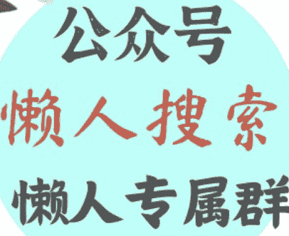
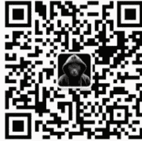

# 公众号垂直小号变现，窄、专、粘是关键
## 250807 生财精华
整理：公众号懒人搜索，懒人专属群独享
懒人微信：lazyhelper

微信：lazyhelper

随着亦仁的公众号超级标出现后，我现在打开微信公众号的聊天，发现各种各样的短文越来越多，可见生财和亦仁对一些平台的影响力....

只要亦仁喊一声，呼啦啦的一大片追随者，能够把一个垂直领域干翻了。

我自己最近发现个有意思的现象：那些动辄百万粉丝的大公众号越来越难做，但几千粉丝的垂直小号却活得很滋润。

尤其在教培、美妆、本地服务这些领域，一个精准的小号每月变现几万甚至几十万的不在少数。

我因为喜欢文字比较多，最近也用我和我老婆的身份证重新注册了好几个公众号小号，就每天更呗。

最近，常有一些好友说：要用 AI 做垂直小号，太难了！

好滴！哎 我们再做ai垂直账号
太难咯
一点都不难
我回头再写一篇文章你参考就知道了

其实你搞定了2个点就基本上OK了。极度垂直的定位+在极度垂直定位后无止境的内容，然后根据这个内容一鱼多吃。

其实，垂直小号成功一点都不难，就三个字：窄、专、粘。
- “窄”是指定位领域要窄，窄到能让目标用户一眼就认出“这是为我写的”；
- “专”是指内容呈现要专，每篇都给具体方法，让用户觉得“关注他能学到真东西”；
- “粘”是指信任运营要粘，通过持续输出建立情感连接，让用户愿意为你付费。

我把这些道理给我的一些客户说时，他们回我：“道理我都懂，小而美、垂直深耕嘛，可具体怎么上手？”

今天下雨，不好出去，我就把我实操过的“垂直小号逆袭三步法”掰开揉碎了讲，全是大白话，听完就能用。

## 第一步：找个窄门钻，千万别贪大求全
前几天见了个美术机构校长，想做公众号教家长“怎么培养孩子的艺术感知力”。我翻了翻他列的选题，从3岁涂鸦到高考艺考全涵盖，光目录就写了两页纸。

我问他：“你自己最擅长啥？”他说：“我带过500多个4-8岁孩子的创意绘画课，家长总问怎么在家陪孩子画画手抄报。”

你看，这就是现成的细分领域 ——“4-8 岁儿童创意手抄报指南”。

既符合三个标准：他有8年实操经验，家长每天都在问类似问题，手抄报是很折磨人的（市场需求明确），搜了下同类账号，做得好的不超过10个。

去年帮一个我们老家一个县城开舞蹈机构校长做号，她最初想做 “少儿舞蹈教育大全”，被我拦住了。

深挖后发现她最擅长教6-8岁女孩跳民族舞，而且当地家长特别焦虑 “孩子练舞怕受伤”。最后定的方向是“XX 县 6-8 岁女童民族舞安全训练指南”，三个月就做到了本地精准粉丝2000+，转化率比之前高了3倍。

还有个做早教的朋友，专写 “0-3 岁宝宝触觉训练在家做”，粉丝才1800，就靠卖199元的触觉玩具套装，每月稳定收入2万多。她的秘诀就是只盯 “触觉训练” 这一个点，别的早教内容一概不碰。

知识付费领域也一样，我常关注一个叫：warfalcon 的公众号，这个公众号以时间管理和个人效率为核心阵地，深耕十年仍保持活跃。

我看他的内容聚焦度堪称教科书级别——所有文章都围绕 "如何用最小成本提升单位时间价值" 展开，细分到 "会议记录速记法"" 通勤时段信息输入技巧 " 等具体场景，甚至会拆解不同职业（如设计师、教师）的专属时间管理模型。这种号变现其实真的非常不错的。

所以，起号一定要垂直；例如我现在打磨了一个“体验品私域发售操盘”的产品；这个产品适合很多场景：
- **适合人群**
  - 需通过体验课来升单的教培类机构
  - 健身房/瑜伽馆/美容院/康复按摩/牙科诊所等需要前端体验服务的实体门店
  - 宠物医院/宠物训练/家政公司/摄影工作室/发型店等需要首单低价体验的实体门店
  - 知识付费/咨询服务类需要通过训练营/诊断等来升单的知识IP/博主

所以，我就起了3个小号，分别对应教培的，实体门店，知识付费的体验产品如何打磨和升单等。

这样，我做3个不同的号，就会比只做一个号强很多。

所以，千万别想着 “全覆盖的号”，那是大团队的事。

你一个小号，就瞄准一个具体场景里的具体人群。

比如 “县城少儿舞蹈机构招生技巧” “钢琴陪练妈妈避坑指南”，越具体，越容易让目标用户觉得 “这就是在说我”。

## 第二步：内容要给 “真家伙”，别玩虚的
定了领域，就得琢磨写啥。

垂直小号的内容，一定要有 “伸手就能用” 的 “术”。

亦仁也说了：要【生财有“术”】而非【生财有“道”】，所以你看在生财，就是那些拆解到血管里的万字文特别容易得龙珠。

我帮一个书法班校长做号时，他每篇文章都遵循一个固定结构：先给一个具体方法，再甩案例，最后加句扎心的洞察。

比如他写过 “3 分钟判断孩子是否适合软笔书法”，方法是看三个动作：握笔时手腕是否能悬空、画直线时是否匀速、看字帖时眼神是否聚焦。案例就讲上周有个妈妈带孩子来试课，孩子总忍不住啃笔尖，后来建议先练硬笔矫正习惯。最后补一句： “选兴趣班不是买衣服，合身比名牌重要。”

有个声乐老师更绝，她的号专讲 “7-9 岁男孩变声期唱歌保护”。其中一篇 “孩子唱歌跑调？先练这两个漱口动作” 火了，方法简单到家长看完就能在家带孩子练：仰头含口水哼音阶、低头鼓腮帮唱韵母。案例里说她带的一个男孩练了两周，音准提升明显。文末补了句：“别总怪孩子没天赋，可能是你没找对打开方式。” 这篇文章带来了80多个试听咨询。

知识付费领域，有个教短视频剪辑的博主，公众号专讲 “标题和如何开头钩子的”。他的视频和内容全部都是讲这些内容的，我都花了几百块买了他的一本书和一个小社群，我还把这本书的内容拆解成了一个知识星球的专栏，用365元/年的价格卖个一些客户，几百倍的赚回来了。

有人问我 “XXX 领域就那么丁点东西，哪有那么多内容天天可写？”

其实素材遍地都是：家长在群里问的问题、你解决过的棘手案例、刷短视频时看到的同行踩坑经历……

把这些素材扔进 AI，让它帮忙梳理成 “方法 + 案例” 的结构，一天出七八篇草稿完全没问题。

我自己试过1天用 AI 生成了300多篇内容，存放在word文档里，实在没素材了，就搬出来一篇，用AI改改，人工再改改就能用，完全不缺内容哈哈！

## 第三步：内容和变现要缠在一起，别分家
有个古筝机构校长，公众号做了半年，粉丝快3000了，却一分钱没赚。

我一看他的文章，全是“古筝名曲赏析”，底下评论区冷清得很。

问题就出在：内容和变现是两张皮。正确的做法是让每篇文章都为变现铺路。

比如写“孩子学古筝前必须知道的 3 个真相”，讲完方法后加一句：“上周有个家长带孩子来试听，正好踩了这三个坑，调整后孩子练琴积极性提高了60%。想知道怎么调整的，评论区扣‘试听’，发你具体方案。”

评论区有人互动，就私信跟进：“我们这周六有场‘家长陪练 workshop’，可以带孩子来体验下怎么用今天说的方法互动，名额有限……”

等粉丝到2000左右，就可以推出小额产品，比如“99 元古筝家庭陪练手册”“399 元一对一选琴咨询”。别担心没人买，你敢卖，就有人敢买—— 前提是你的内容已经让他们觉得“这人靠谱，说的都有用”。

我认识的一个围棋老师，公众号粉丝才1500，每月靠小号能多收5个长期班。他的套路是写“孩子学围棋总“输就哭？教你三句话扭转心态”，案例里说自己带的学生小林输棋后，用这三句话引导，现在能平静复盘。文末留钩子：“想知道这三句话具体怎么说？私信我‘话术’，发你完整版，顺便送一节亲子对弈指导课。”

知识付费领域，有个讲家庭理财的博主，每篇文章都围绕“月薪8000 如何存下5万/年”展开。

写完存钱方法后，总会加一句：“我整理了3个不同支出结构的家庭存钱模板，私信‘模板’就能领，领完可以告诉我你的家庭情况，我帮你看看适合哪种存钱法。”靠这招，他的299元家庭理财规划课，在粉丝2500时就卖了100多份。

所以，我越来越觉得，公众号的变现就是要跟视频号一样，奔着变现去做，直接要求每一篇文章都奔着获客和变现去。

因为通过搜索或者推荐而来的客户，精准得很，来了就能卖，别浪费了。

如果你想要稳定的，更好的做变现，我们就需要用到公众号+多渠道联动变现，其实一共也就是四个步骤而已。

### 第一步：用公众号筛选精准人群
### 我用我支持的一个琴行老板来做案例：
每周发2-3篇干货文，比如 “5 岁学钢琴常见的 3 个坑”，文末留钩子：“回复 ‘避坑’ 领《钢琴选购 checklist》”。家长主动回复后，判断其需求匹配度，符合标准的拉进“艺术启蒙家长群”，不匹配的留在公众号粉丝池持续培育。

### 第二步：社群沉淀信任，引流视频号
群内每天做两件事：早上发1条 “30秒练琴小技巧” 短视频（视频号内容），晚上用10分钟解答1个共性问题。比如家长问 “孩子坐不住怎么办”，就顺势说：“今晚8点视频号直播详细讲，来的扣1，我统计人数准备资料。” 用社群互动撬动视频号流量。

### 第三步：直播集中转化，微信锁客
每月固定2场直播，主题要具体，比如 “如何用儿歌培养孩子节奏感”。直播中演示3个实操方法，中间插1次福利：“今天下单99元体验课，送价值50元的节奏棒套装”。家长下单后，引导加个人微信：“加我发孩子年龄，我单独发适合的课程表”，把客户沉淀到私域。

### 第四步：微信分层运营，促进复购
加微信后按 “体验课用户” “长期班家长” 贴标签。对体验课用户，每天发1条孩子练琴的小案例（比如 “6岁乐乐练琴总偷懒，用这个游戏法每天主动练20分钟”）；对老家长，每周发 “学员进步榜”，顺便提一句：“春季班续报送4节乐理课，本周报名额外赠教材”。用私域互动推动升单。

这套流程的核心是 “层层过滤”：公众号筛出有需求的人，社群和视频号加深信任，直播完成首次转化，微信做好长期复购，形成闭环。

7月26日生财航海家大会，程奕人也讲了这个微信闭环，其实也是大差不差的；

我跟客户谈公众号和自媒体，遇到最多的借口就是：搞不定内容，不会写.....

我通常说：你不会写，AI 会呀！今天给你分享用 AI 提升公众号内容质量，一共就3个小技巧而已：

### 第一招：让内容更对家长胃口
首先，你要写一段草稿，写的跟狗屎一样都行，实在不行你就买几本相关的书，关注几个微博博主等去复制他们的内容当草稿。

把你写的草稿扔给AI，说 “帮我改成4-6岁孩子妈妈的语气，多举生活里的例子”。

AI就会帮你写出来了，然后你再用口水话的方式改一改就可以了，简单的很！增加你那个地区的名字，孩子的名字改真实的，案例用真实的案例，看起来就是真的了。

有个绘画老师原来写 “构图训练需循序渐进”，AI改成 “教孩子画画别一上来就画全家福，先让他把苹果画得像苹果 —— 我上周见个妈妈逼孩子画全家，孩子直接把画笔扔了”，家长看完更有共鸣。

还有一个技巧是这样的，我自己也会经常用，就是：把一些点赞量比较好的朋友圈内容，用AI扩写成500字左右，然后修修改改，加个标题就发上去。

亦仁也说了，把公众号当成大号朋友圈去发，我觉得这样也是可以的，这样基本上就有了发不完的内容了。而且由朋友圈扩写的內容，其实更对客户的胃口。

### 第二招：标题和开头抓眼球
我的做法一般都是让AI先给我批量生成3-5个12-15个字的标题，比如我写了一个 “孩子学舞蹈怕受伤” 为主题的文章，我就把这篇文章丢给AI，让她给我出3-5个标题，它会出 “3个动作看出孩子能不能学舞蹈，第2个90%家长忽略” “学舞先看脚型？这些坑别让孩子踩” ……

然后，我就选一个改改就能用，甚至我觉得2-3个都挺好，进一步让她把这3个标题都融合起来，重新打造标题。

还有一个方法就是：在小红书，抖音等输入类似的内容，把前面的爆款标题收集起来，丢七八个标题给AI，让AI用这个逻辑去给你生成你自己的标题，也是可以的。

#### 还有一个跟标题一样重要的，就是开头第一段。这个也要写好一些。
我一般的做法是会让AI写3个不同版本：“昨天一个妈妈带孩子来试课，刚压腿就哭了 —— 其实学舞怕受伤，关键在课前这5分钟” “你家孩子练舞时总喊疼？不是体质问题，是热身做错了”，总有一个能让家长想往下读。

自己读一遍，然后挑一个觉得很好的就用就可以了。

### 第三招：排版适配手机阅读
AI能自动把长段落拆成短句，给重点内容加表情符号，比如 “练琴前必须做的3件事⚠️” “每天10分钟就够了💪”。还能提醒你 “这里可以插张孩子练琴的对比图” “这段适合做成步骤图”，不用懂排版技巧，也能让文章看起来清爽舒服。

我再来重点聊聊如何变现的事情。这个我比较擅长的点。

要想变现，最重要的是要打磨对应的产品和服务吧？

其实，用AI去打磨产品是一个很重要的方法，关于如何用AI打磨产品，我前面也写过类似的文章。你可以去找来看看。

打磨产品我觉得最重要的就是：围绕精准人群的最大痛点去做，所以我们的产品的设计也是可以靠AI找痛点。

我给一些机构老板策划课程产品时，用AI把公众号评论区、家长群的提问汇总分析，5分钟就能生成 “家长最焦虑的10个问题”。

有个钢琴老师靠这个发现家长对 “孩子练琴拖延” 的抱怨最多，立刻推出 “21天练琴打卡监督课”，定价199元，首月就卖了150份。

更妙的是，AI还能根据问题频率帮你划分产品优先级，比如发现 “考级压力” 的提及率是 “练琴时间” 的2倍，就可以先开发考级冲刺短期课。

另外，在和客户谈单的过程中，也可以结合她是看那篇文章过来的，然后结合客户的情况做一些简单的聊天，甚至更绝的是：可以用AI全程协助和客户去谈单，无论客户怎么回答，你都可以让AI回答，并引导客户下单，还不下单就让AI持续去问客户。

我就试过这样，比我自己瞎聊好多了。

最后，还有客户常常问我说：怎么保证内容持续输出？我感觉更新10来天就没内容了。。。。

这个其实很简单，重要的是你的决心，你自己不放弃，有大把的方法。今天先教你个笨办法：建三个素材库。

#### 第一个：存家长常问的问题
比如“孩子坐不住怎么办”“多久能考级”，这些是天然的选题库；

#### 第二个：存你解决过的案例
哪怕是很小的成功，比如“用XX方法让孩子多练了10分钟”；

#### 第三个：存同行的优质内容
看到好的观点就记下来，用自己的话重新讲一遍。

每天花20分钟往库里填东西，写文章时从三个库里各抽一点，组合起来就是一篇“方法+案例+观点”的完整内容。

再加上AI帮忙梳理结构、优化语言，一天出两篇完全不费劲。

你不用担心说你的内容越写越窄，怕客户读了会觉得单调。

其实垂直领域的核心就是“重复中见专业”，客户反而会因为你总讲一件事而更信任你。你看那些变现好的视频号，那些博主天天直播，天天拍视频，其实来来去去就是重复那一丁点事情。

做公众号千万别三天打鱼两天晒网。要么不写，要写就想着写1年，2年这样写下去，公众号的信任是靠“持续出现”建立的，哪怕每周只更两篇，只要准时，效果也比断断续续发10篇好。

所以，别想那么多，既然亦仁大佬都认可了，都发超级标了，我们就先听话，先干起来，再完美吧。

很多人卡在“我不会写”“我怕写不好”等内耗里，其实垂直小号的核心不是文笔，是“你真的懂这个领域，并且愿意分享出来”。

用AI搭框架，用你的经验填血肉，写完别纠结“是不是不够专业”，先发出去看客户反应。有人问就赶紧回，有人骂就顺着改，慢慢就找到感觉了。

现在做公众号，早就不是拼粉丝数量的时代了。

拼的是“你能不能让1000个精准用户相信你”。做到这一点，哪怕只有500个粉丝，也比5000个泛粉值钱得多。

这里很多人还会有一个内耗，就是花了一两个小时写的内容，就10来个人看，觉得特别的沮丧.....

懒人微信：lazyhelper

我说：这很正常的，不是每个人都能跟亦仁一样，写出来就几千上万的人看和转发的。

我的很多文章也就是几个人看，10来个人看，但无所谓呀，只要有1-2个人看完了，扫码进群了，我就有机会搞定她。

文章要那么多阅读量干嘛？要的是变现嘛。

记住，垂直小号逆袭的秘诀，从来不是“做得有多好”，而是“开始做”。加油！

最后，安利小懒的付费群：

## 懒人专属群

- 懒人专属群持续更新中，已持续运营6年，整理超3000份各类精选付费文章&年费社群干货，全部开放下载。

本资料为付费群内部分享，仅供真实有需要的朋友查阅 🙏

### 懒人专属群更新记录：
https://lazy2025.top/#/blog/record2

懒人专属群更新记录（需梯子，备用）：
https://lazybook.fun/#/blog/record2