# 凌晨3点，5个Claude Code同时工作，老板以为我组了个团队

250811 生财精华

公众号懒人搜索，懒人专属群独享

懒人微信: lazyhelper

大家好, 我是志辉, 10 年大数据架构, 现专注 AI 编程。

前几天刚好有个粉丝来找我, 说 Claude Code 的 git worktrees 有没有更友好的使用方式。

碰巧, 刚好给他推荐了我最近使用的 Conductor 这个产品。

之前我也尝试过使用 git worktrees 来在一个项目上并行运行多个 Claude Code。

还是比较繁琐, 并且工作流需要自己定义, 可能还需要写个脚本。

这对于大部分来说门槛太高。

不过我咔咔点击下就可以完成。

## 大佬们也是很多用的很开心。

## 有什么问题

说实话，用过 Claude Code 的朋友都知道一个痛点：

一次只能干一件事！

比如你想让它帮你：

- 优化一个 React 组件
- 同时写个 API 接口
- 再顺便补充点测试代码

结果呢？只能一个一个来，等第一个任务完成了，才能进行下一个。这个时候你就很尴尬了，要么干等着，要么切换到别的任务，但是一切换上下文就乱了...

以前的工作方式：你 + 1 个 Claude Code = 单线程工作
- 效率有限，任务排队
- 频繁的上下文切换
- 复杂项目需要分多次处理

现在有了 Conductor：你 + 5 个 Claude Code = 并行作战！
- 多个任务同时进行

微信：lazyhelper

## 每个代理专注自己的事情

效率提升不是1+1=2，而是1×5的倍增！

那么接下来，我来手把手教你怎么用这个神器！

## 第一步：下载安装 Conductor

首先访问官网：https://conductor.build

当然现在优先支持的是mac平台。

windows 平台应该也是在开发了。

如果你是 Intel 的 mac，请点击下面的那个链接下载

## 第二步：添加你的代码仓库

打开软件，映入眼帘的就是首页。

现在最新版本的是可以支持本地项目了，

之前只能支持 GitHub 上的远程仓库项目。

可以看到我打开了我的一个项目。

并且开了四个工作空间。

微信：lazyhelper

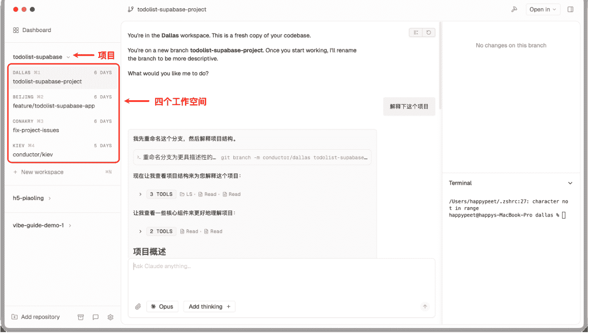

重点来了：Conductor 会自动使用 Git Worktrees 技术，为每个 Claude Code 代理创建独立的工作空间！

你不需要：

- 手动配置 Git 工作树
- 重新安装依赖包
- 担心不同代理之间的冲突

Conductor 全自动帮你搞定！

细心的朋友们可能注意到了，每个工作空间的名称是 Conductor 自动生成的，而且都是城市名称。

Dallas、Beijing、Conakry、Kiev

## 第三步：添加工作空间

这里的工作空间其实就是基于新创建的 Git Worktree。

这里要说的也是，这个 git worktrees 是官方的最佳实践里面推荐的针对一个项目并行任务的流程。

点击「New workspace」或者使用快捷键「Command + N」创建一个新的工作空间

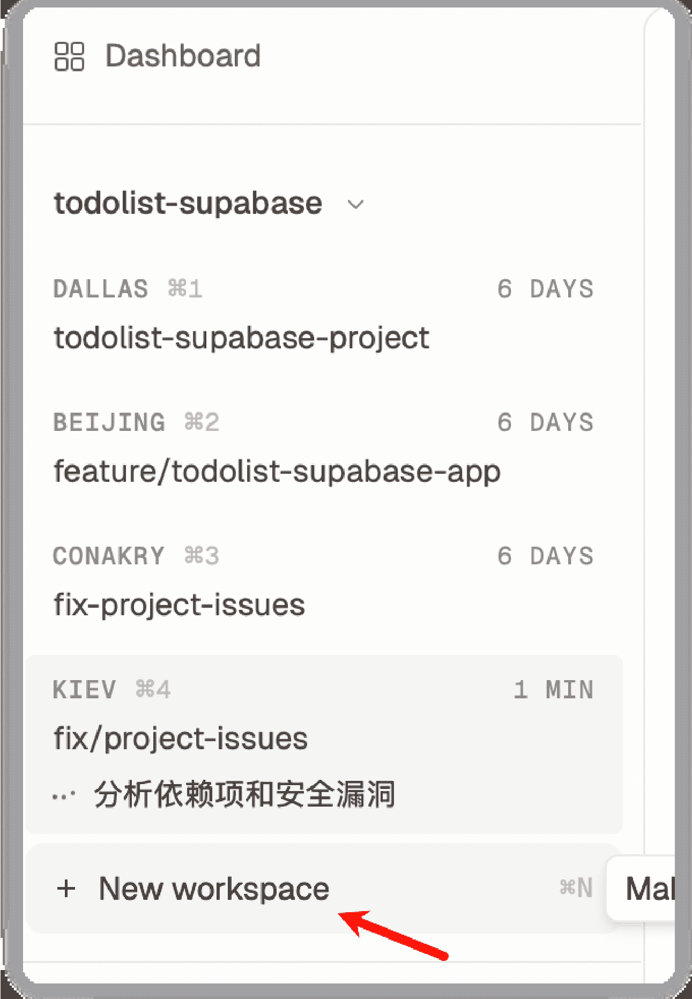

会自动创建 Git Worktrees 目录，然后你进入到一个新的工作空间。

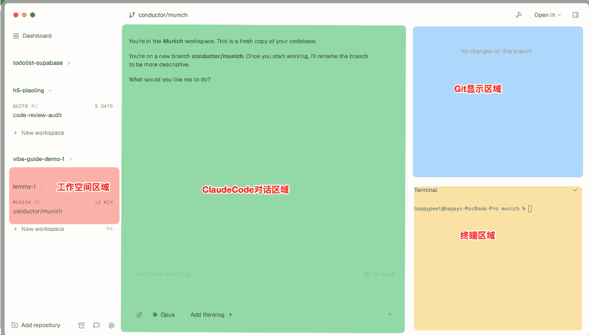

不得不说这个产品的细节考究还是做得不错的。

主要就是分为上面截图的区域。

还很亲切地也做了终端区域，如果你需要一些终端操作，可以很方便地使用。

## 第四步：指挥你的 AI 团队

这个时候，你就像一个项目经理一样，可以：

- 实时监控：看到每个代理在干什么
- 状态跟踪：哪个代理完成了，哪个遇到问题
- 代码审查：查看所有代理的工作成果
- 统一管理：所有变更都能看到

小贴士：记住，你现在不是程序员，你是 AI 团队的指挥官！

并且很贴心地设置了快捷键，Command+1、2、3、4 就可以快速切换各个子团队。

然后迅速指导工作干活。

右侧的 git 区域也是最近添加的

打开以后，很直观地可以看到代码对比，左侧就是修改的文件列表。

## 第五步：提交 PR

这是之前喜欢看修改了哪些代码的福音呀。

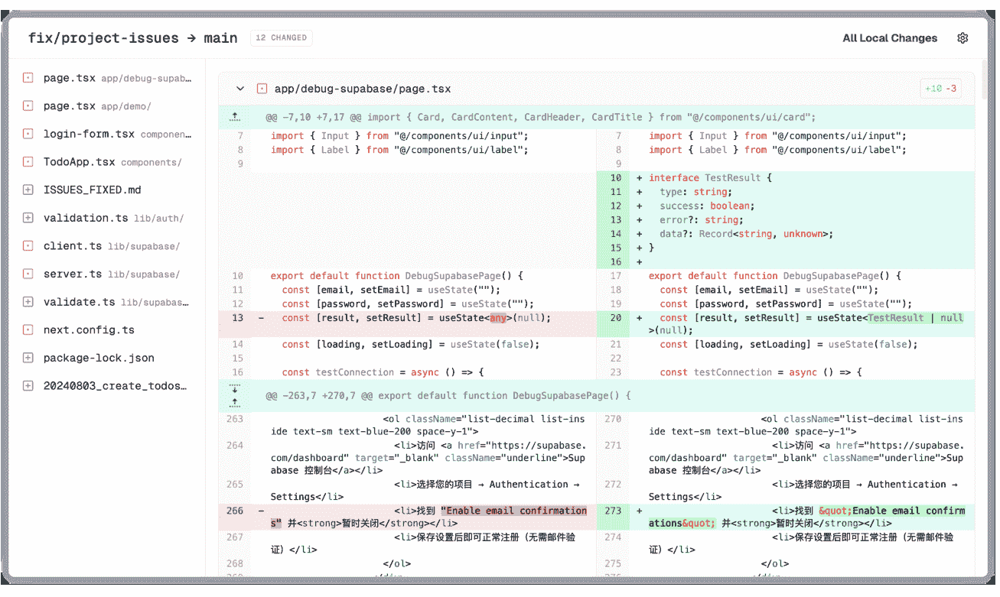

这个工作空间的代码改得还可以的话，那么就可以进行 PR 提交

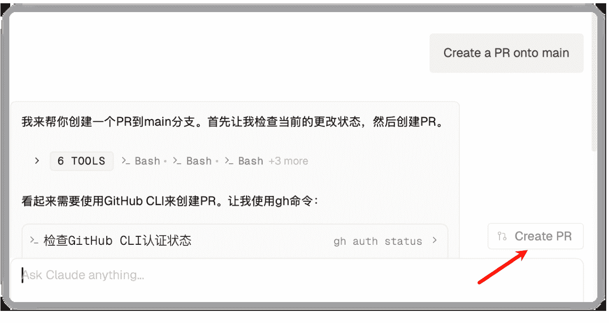

但就是有个小问题，怎么没有识别到我的 gh 客户端了

我在本地的终端执行是没有问题的。

看来他的环境变量加载还需要再优化一下。

有跑通的可以评论区吼一声，看下怎么弄好。

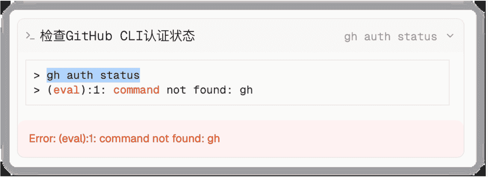

### 一些小技巧

### 设置自定义模型

如果你想使用智谱 GLM4.5、Kimi K2、Qwen Coder，

现在不用配置文件，不用设置环境变量。

直接就可以设置自定义的 API 模型使用。

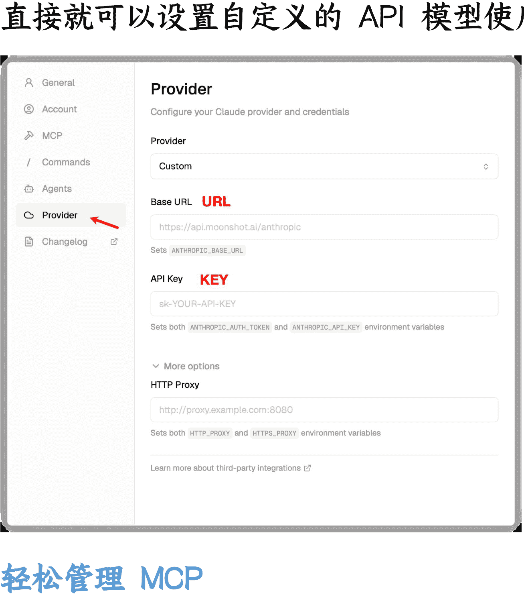

### 轻松管理 MCP

轻松管理 MCP。

不过现在还只有 Linear，Figma 这几个，

后面相信会更多。

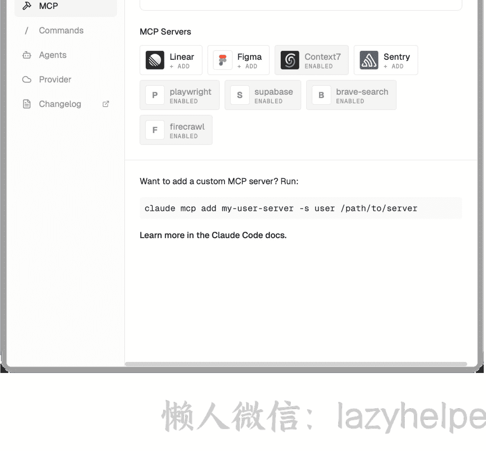

懒人微信：lazyhelper

## Slash Commands 管理

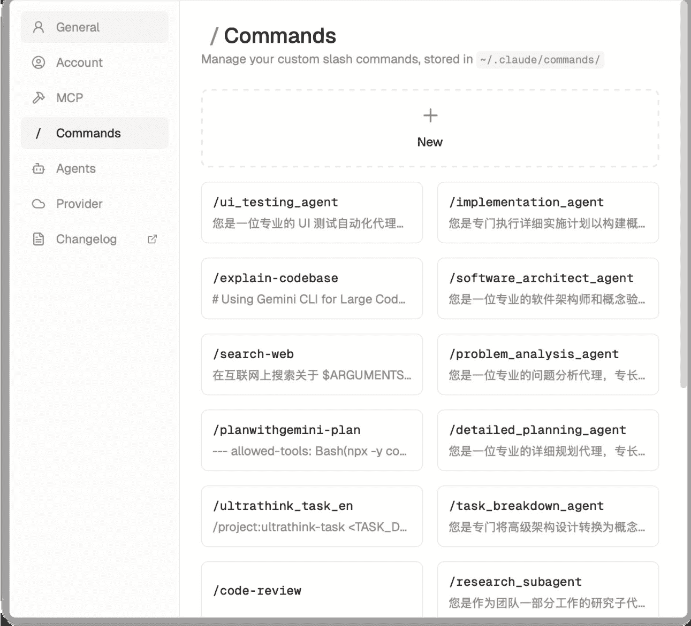

## 对话框里也是可以直接提示

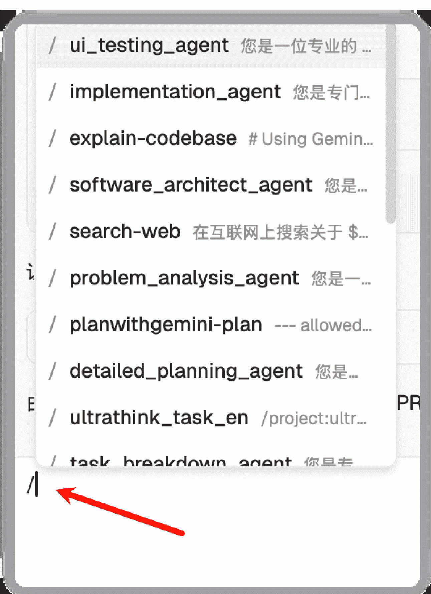

## Sub Agents 管理

还有很贴切的 Sub Agents 管理。

这个版本添加了编辑、新增的功能。

之前我用的时候，还只能查看。

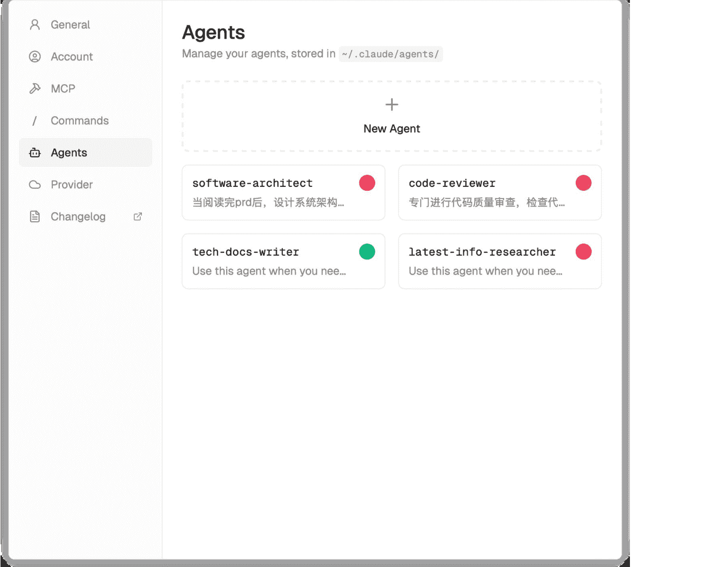

也是通过 @ 符号就可以直接弹出来

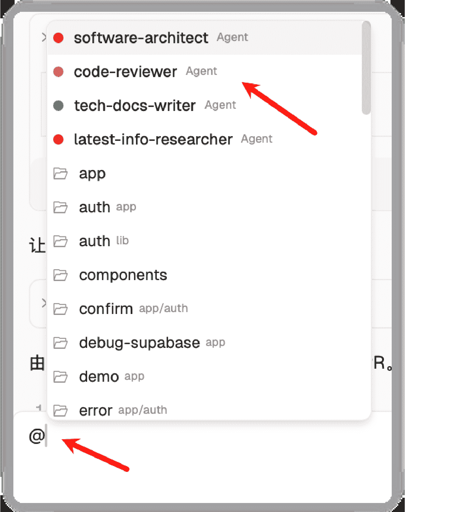

## 小细节

- 有通知
- 还有自动 compact 选项的比例

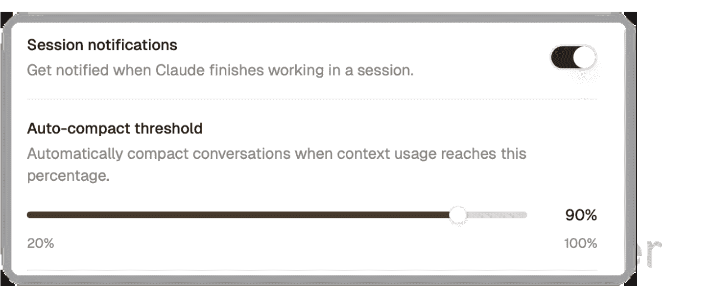

## 总结

说到这里，我想你应该明白了，

Conductor 不只是一个工具，它代表了一种全新的工作方式。

传统的 AI 辅助编程，我们是在"使用"AI；

而现在，我们是在"指挥"AI 团队！

这个转变的意义很深远：

- 从操作者到指挥家
  以前：你要亲自告诉 AI 每一个细节
  现在：你只需要分配任务，让 AI 团队自主协作

- 从单线程到并行处理
  以前：一个任务接一个任务地处理
  现在：多个任务同时进行，效率倍增

- 从工具使用到团队管理
  以前：学会使用 AI 工具就够了
  现在：要学会管理 AI 团队

## 写在最后

我觉得 Conductor 最牛的地方，不是技术有多复杂，而是它让我们提前体验了 AGI 时代的工作方式。

想象一下，未来每个人都可能管理着一个 AI 团队，有的专门写代码，有的专门做设计，有的专门写文案...

你不再是一个执行者，而是一个指挥官！

这种工作方式的变革，可能比我们想象的来得更快。现在开始适应这种"指挥 AI 团队"的思维，绝对是个明智的选择。

在 AGI 时代不迷路，我们一起启动这美妙的旅程！

好了，今天的分享就到这里。

PS： 如果你想第一时间体验 Conductor，直接访问 https://conductor.build 就能下载！记住，目前只支持 Mac 哦。

另外，这个工具的创始人 Charlie Holtz 也是个传奇人物，之前在 Replicate 做过很多有趣的 AI 项目，还曾经用 AI"吓到了好莱坞"...这个故事下次有机会单独讲讲，嘿嘿嘿。

好啦，各位！

最后，安利小懒的付费群：

懒人专属群

懒人微信：lazyhelper

懒人专属群持续更新中，已持续运营6年，整理超3000份各类精选付费文章&年费社群干货，全部开放下载。

本资料为付费群内部分享，仅供真实有需要的朋友查阅

## 懒人专属群更新记录：
https://lazy2025.top/#/blog/record2

## 懒人专属群更新记录（需梯子，备用）：
https://lazybook.fun/#/blog/record2

懒人微信：lazyhelper