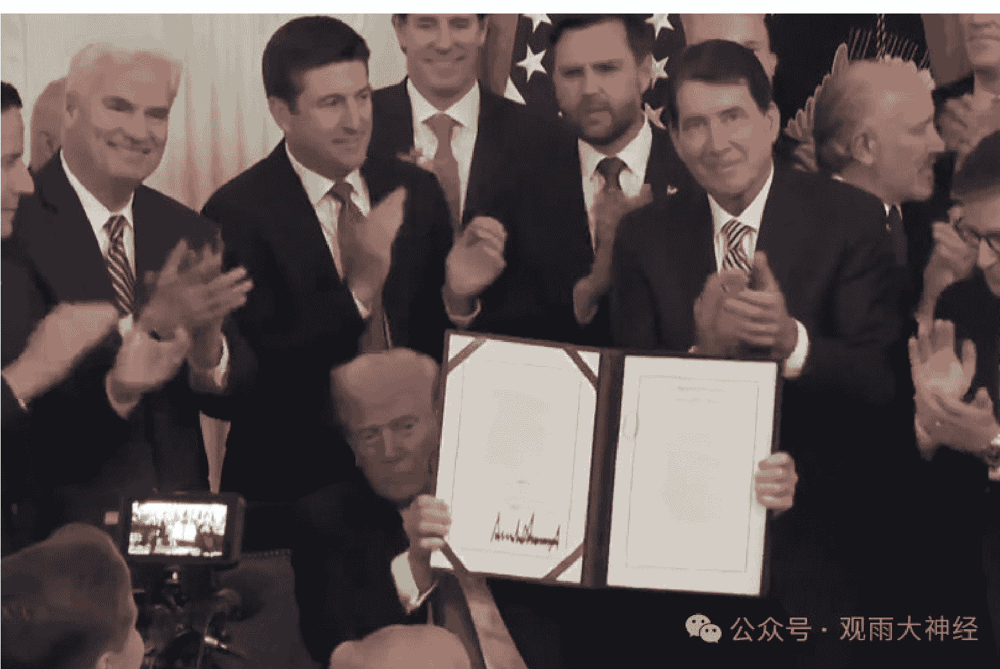
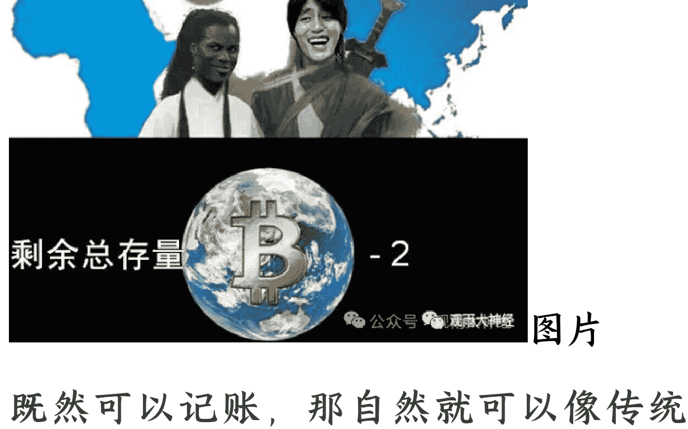
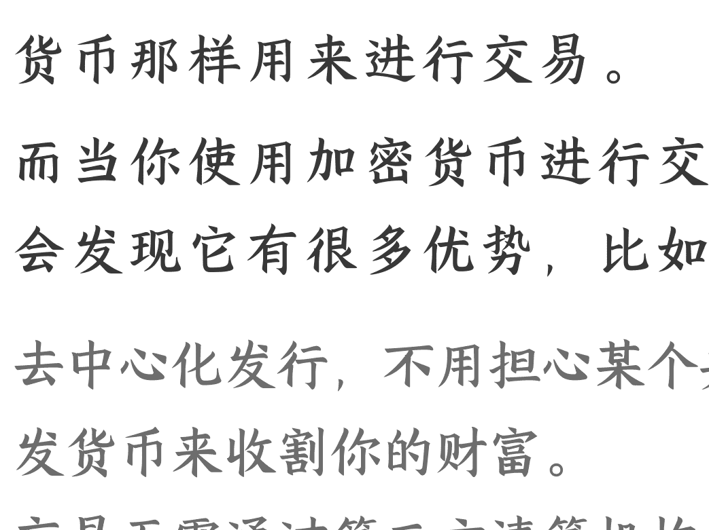
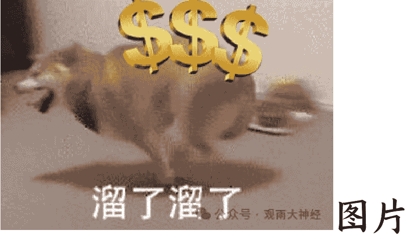
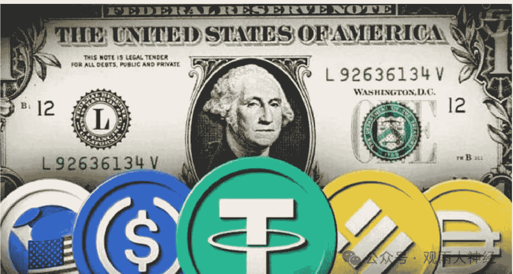
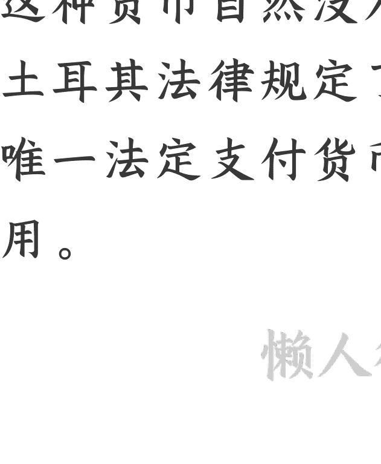
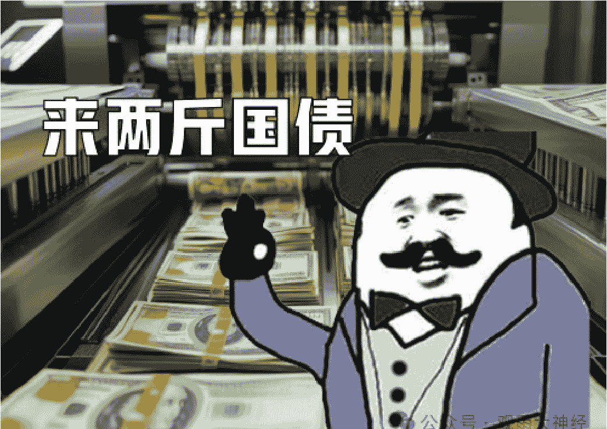

# 万字长文说透稳定币：既是末日也是希望，更是属于每个人的全新起跑线

250811 观雨大神经

整理：公众号懒人搜索，懒人专属群独享
懒人微信：lazyhelper

注：本文前半部分为免费内容。即使只看免费部分也能了解稳定币的基本知识和对美元的影响，大家可以放心阅读。

7月18日，特朗普签署《指导与建立美国稳定币国家创新法案》（Guiding and Establishing National Innovation for U.S. Stablecoins Act），简称《天才法案》（《GENIUS 法案》）。

图片

8月1日，香港的《稳定币条例》也正式生效。
懒人微信：lazyhelper

在东西方两大力量的引领下，稳定币这个已经出现了十年的新物种获得了“合法光环”，就此登堂入室。

对于这个情况大家的反应比较复杂，有人觉得震撼、有人觉得不屑...不过有一点是可以肯定的：

不管“拥抱稳定币”是不是懂王的灵机一动，他都确实打开了一个潘多拉的魔盒，人类经济世界的游戏规则也将因此而改变。

这一次，狼真的来了。

对于普通人来说，如果你现在处于顺境，那么一定要谨慎；如果你现在处于逆境，那么一定要挺住。

因为用不了多久，一条全新的起跑线就会出现在所有人的面前。

大家都有风险，大家也都有希望。

而你能否在这条起跑线上领先对手，就取决于你是否提前了解了这个潘多拉魔盒里的内容。

## 第一节·货币的核心价值

稳定币从技术上来说就是一种类似比特币的加密货币（也叫虚拟货币）。

所以在了解稳定币之前，我们需要先简单了解一下加密货币的特点。

加密货币是一种依托区块链技术的数字资产系统，我们可以简单的把它理解成一个可以在网上记账的程序。

既然可以记账，那自然就可以像传统货币那样用来进行交易。

而当你使用加密货币进行交易时，就会发现它有很多优势，比如说：

- 去中心化发行，不用担心某个央行通过滥发货币来收割你的财富。
- 交易无需通过第三方清算机构，交易成本极低。
- 交易透明但匿名，且不可篡改，既保证了隐私性又保证了安全性。

......

既然好处这么多，按理说应该很受大家欢迎才对。

然而现实是当前绝大多数加密币都只是圈子里的自嗨，跟老百姓没啥关系。

这么好的东西为什么没人用呢？

除了法规限制外，最关键的问题就是这玩意的价值波动幅度过于抽象。

我们的大A一天只有4个小时在交易，波动幅度不超过±10%。而加密币可以24小时跳个不停，一天波动个百分之几百都不奇怪。

眼一睁一闭，不是飞黄腾达就是账户清零，普通人的小心脏受不了。

这个特点就决定了加密货币虽然在技术上有一定的先进性，但不可能成为主流的支付工具。

毕竟货币的基础是价值。

历史上的货币形态虽然随着技术的进步一直在发展，但每一步的进化都离不开真实价值的背书。

以前是贵金属，现在是国家信用，道理都一样：你总得拿点东西来支持它。

当然，这里不是说加密货币完全没价值，只是它们的价值并不来自于贵金属或国家信用，而主要来自于用户的共识。

这就非常不靠谱了，所以天天坐过山车玩。

那么这个问题能解决吗？

很简单，你给它上价值不就行了？

不过现在金本位的时代已经结束，用黄金来给货币背书肯定是不太可能了。

如今能给货币上价值的只有国家信用。

于是稳定币便应运而生。

它用美元背书，保证你手上的稳定币可以随时兑换确定数量的美元。

四舍五入就相当于国家信用背书了。

但问题并没有完全解决，因为一开始美国官方并不认可这玩意。

官方不认可，那么这个所谓的“美元背书”就完全取决于发行机构自己的信用。

谁知道它会不会背书背到一半就卷款跑路。

所以吃瓜群众还是不太敢用，该货币的影响力也比较有限。

但从懂王签下《天才法案》的那一刻起，这个问题便迎刃而解了。因为这个法案宣告美国政府站到了稳定币的背后。

## 第二节·稳定币到底是什么？

稳定币和其他加密币的根本区别就是它与美元价值1：1绑定（这里特指美国公司发行的稳定币）。

你如果想获得一个稳定币，就需要给发行机构充值一美元。这个机构收到钱后就会在区块链上给你创造一个该机构自己发行的稳定币。

回头你如果把这一稳定币还给这个机构，它又会退回你一美元。

可以这么说：稳定币就是区块链世界里的“美元代金券”。

图片

这个原理其实跟Q币、微信零钱差不多一个意思，只不过稳定币的应用场景要广阔得多。

图片

现在有了帝国的背书，前途自然不可限量。

当然，接受了帝国的背书，自然也就要接受帝国的约束。

而这也正是《天才法案》的主要内容。

首先，以后的稳定币并不是什么阿猫阿狗都能发行，它只能由官方认证并接受官方监管的专业机构才能发行。

其次，发行方必须得保证每一块钱稳定币都能赎回相应的美元。

怎么保证呢？

理论上很容易。机构本来就是在收到用户的1美元后才发行的1稳定币，用户来赎美元的时候再把这1美元还回去就行了。

但实际上机构可能偷偷把这1美元花掉。

所以《天才法案》就强制机构把收到的这1美元存到一个官方监管的隔离账户里。

钱存进去了就不能随便动，这叫储备资产。

不过虽然不能随便动，但允许你拿一部分（最高可达90%）去购买短期美债吃利息。

反正短期美债也是稳如老狗的硬通货，不碍事。

而有了这些资产放在隔离账户里，就算你跑路了也没事，有关部门随时可以拿它们去兑付用户的稳定币。

需要强调的是，这个储备资产的数量必须是100%足额。也就是说收到多少美元就发多少币，不能多发。

另外法案还严格规定了稳定币只能作为支付型货币，不能作为投资型货币。具体来说就是发行机构不能向持有稳定币的用户支付利息。

意思就是你们这些发行机构不要整天想着干银行的活，老老实实做个货币生产者就行。

图片

同时法案还有各种反洗钱和反恐规定。

总的来说就是一个字：稳。

所以在帝国的背书和监管下，稳定币的投资空间是没有的，大家不要整天想着去囤这玩意。

但它彻底解决了加密币价值不稳定的问题，于是支付功能变得无比强大。

这个市场空间就很大了，发行机构可以大赚特赚。因为正如上文所说，他们可以拿用户存在他们这里的钱去买美债吃利息。

躺赢!

靠着这个操作，美国稳定币的龙头企业Tether去年的净利润已经超过了花旗集团(137亿美元VS127亿美元)。

前途一片光明。

现在只有一个问题：人们为什么要用稳定币?

我们现在回过头来捋一下这个逻辑：

稳定币需要用美元兑换，且汇率永远是1：1。

那我使用稳定币的过程说起来就是这样的：

用一美元换一稳定币然后当一美元用。

这不是脱裤子放屁么？

如果真是如此，那么最终的用户数量肯定不会太多，所谓的广阔前景也不过是个海市蜃楼罢了。

但我在这里可以明确告诉大家，稳定币不仅不是脱裤子放屁，它甚至还会掀翻整张桌子。

## 第三节·掀桌之路

我们先来简单介绍一下稳定币的两个最直接的使用场景：

- 加密币市场交易；
- 跨境支付。

这是稳定币最初的两个主场，也是它掀桌之路的起点。

相对来说，加密币市场跟普通人的关系不大，不过稳定币在这里的应用很好的体现了它的优势。

投资加密币从操作流程来说，就是“用美元买加密币”和“用加密币赎回美元”两个步骤来回倒腾。

这样一来一回显然是比较麻烦的。

而有了稳定币就方便多了。

你可以用稳定币来交易其他加密币，就像赌场里的筹码一样，不用每次操作都去转账。

直到你想“退出江湖”了再一次性换成美元即可。

稳定币能这么用就是因为它的价值稳定，你长期拿在手上也没事。

这就体现稳定币的两大优势：高效、靠谱。

接下来我们再来看看跨境支付市场：

经常在国际市场上发财的朋友都知道，跨境支付的成本颇让人肉疼。

如果想跨国转个账，你得填表、得支付银行手续费、承受汇率损失、支付中间行费用、支付 SWIFT 的电报费...

算下来综合成本在 6%左右，很多企业的利润都未必有这么高。

而且周期还很长，一般需要 3 到 5 个工作日，碰到银行放假就只能等。

稳定币就不同了。

它作为一个加密货币，压根就不存在跨境支付的概念，不管是把钱打到哪里都是网络里一段代码的事。

所以用稳定币进行跨境支付不用填表、没有手续，点一下鼠标十几秒到账，综合成本不到1%，且可以随时操作。

这是对传统银行的碾压。

所以稳定币的行业逻辑是完全走得通的。

当然，懂王大张旗鼓的拥抱稳定币，绝不仅仅是为了给部分人群提供方便那么简单。

按特朗普的说法，推行稳定币可以提升美元的统治地位。

他这是要大展宏图。

那么稳定币真的能起到这么牛X的作用吗？

还真有可能。

## 第四节·美元霸权的第二春？

懒人微信：lazyhelper

一般来说，一个货币使用的范围越广、使用的人越多，这个货币的统治地位就越高。

不过美元现在已经是国际贸易结算的主宰了，这地位还有上升空间吗？有。

因为现实中还存在着一些国家和个人因为经济制裁的原因用不了美元。比如说俄罗斯、伊朗什么的。

### 卢布交易

图片

如果让他们也能用上美元，那不就相当于扩张了美元的疆域吗？

那怎么才能让他们用上美元呢？

这时候稳定币就闪亮登场了。

现在所有的经济制裁都是建立在传统银行体系的基础上的，而稳定币的交易完全不需要银行。

这种“跳出三界外、不在五行中”的状态就让现行的各种制裁措施形同虚设。

可以说稳定币就是一个打开制裁枷锁的作弊钥匙。

图片

不过这里有个问题：世界上大多数经济制裁本来不就是美国发起的么？

你想让那些国家用美元，直接停止制裁不就完事了？何必一边搞制裁一边帮对方作弊呢？

确实很别扭，但如果你站在特朗普的角度上看就很合理了：

我没有取消任何制裁、没有向任何对手低头，同时我还成功扩张了美元的疆域，你就说赢没赢吧。

图片

当然了，这些国际贸易的漏网之鱼在数量上不是很多，这点仨瓜俩枣还不足以打造出“美元霸权的第二春”。

真正的用兵之地，在另一个领域：

各国的国内市场。

美元虽然早已主宰国际市场，但各国的国内市场还有着自己的货币壁垒。

正常国家大多会限制甚至禁止外币在国内流通。

这很正常，铸币权是国家力量的重要来源，能维护肯定还是要尽量维护的。有些地方崩盘了实在维护不了那另当别论。

站在美国的角度上看，如果能够突破各国的货币壁垒，让更多国家的居民在国内交易中也能用上美元，那扩张前景就非常可观了。

图片

这等于是让美元从各国的“储备货币”升级为了“生存必需货币”，同时还能将美元政策的影响力延伸至全球的毛细血管。

MAGA!

那怎样才能突破各国的货币壁垒呢？稳定币就是最好的攻城锤。

图片

因为这些壁垒也是建立在传统银行体系的基础上的。

你只有走银行通道我才拦得住你，你如果是一群走互联网的“代金券”，那我只能干瞪眼。

这本质上体现的其实是技术发展和规则的冲突。

### 在新技术面前，基于旧技术的游戏规则难免土崩瓦解。

不过这难道不会造成混乱吗？

乱是肯定会乱的，但乱的又不是自己，美国一点也不慌。

当然，在经济实力较强的国家和地区，这个冲击不会太明显。

因为这些国家和地区自身的货币也很坚挺，普通人犯不着去做什么改变。

但对于那些经济问题较大、本土货币不怎么坚挺的国家和地区来说，就是另一回事了。

比如说土耳其里拉这些年几乎是跳崖式贬值，仅2020年到2023年间就贬了300%以上。

这种货币自然没人想用，只不过因为土耳其法律规定了土耳其里拉为境内唯一法定支付货币，所以大家不得不用。

这就是典型的靠银行体系限制在硬撑。

对于这种地方的居民来说，稳定币的降临就是久旱逢甘霖。

2023 年，土耳其稳定币交易占 GDP 比重（即用法定货币购买稳定币的金额占 GDP 的比例）为 3.7%，排名全球第一，远超排名第二的美国的 0.54%。

2024 年，土耳其出台法律禁止包括稳定币在内的任何加密币作为支付工具。

同年，土耳其稳定币交易占 GDP 比升至 4.3%。

吞噬你，与你何干。

现在美国又给稳定币套上了合法的光环和更坚实的价值基础，接下来的冲击只会更加强烈。

事实上美国财政部在2024年发布的报告《加密货币市场战略方针》中就说这么一句话：

经适当监管的美元稳定币可充当货币权力投射工具，将美国金融基础设施的影响力延伸至物理边界与传统银行渠道之外。

对此我们作为中国人未必会有太大的感觉，但从世界范围来看，美元在稳定币的带领下打出一波攻城略地的效果是非常有可能的。

这时候另一个问题又摆到了大家的面前：

如果稳定币真的能实现大规模扩张，那么有没有可能顺手解决掉美国现在最头疼的债务问题呢？

## 第五节·美债危机的曙光？

美债的危机是什么？

大家首先想到的肯定是还债压力太大。

还钱 还钱 还钱

帝国现在国债总额超过 37 万亿美元，每年的利息比军费还高，想想就让人头疼。但实际上对于帝国来说，还债从来就成不了什么难事。因为他可以轻松的借新还旧。

美债是这个世界上的硬通货，放出来就有人抢。也就是说大家都抢着把钱借给他。而当一个人无论如何都能借到钱的时候，债务的金额根本就无所谓。

另外美债还有一个特殊的买家：美联储。和其他机构不同，美联储买美债的钱是自己印的（以增加向美联储卖出国债的机构在美联储开立的账户中“准备金”的方式）。所以美国政府向美联储出售国债的行为大致可以理解为印钞。

这种自产自销的做法就让美国获得了一个完美的循环：发债越多钞票越多。

不仅能借新还旧，还能印钞还旧，直接卡上 BUG 了。

既然如此，美国人头疼什么呢？

抛开白宫内部各派斗争不谈，这种债务自产自销的做法其实也有它的代价：

消耗美元和美债的信用。

道理很简单，你总这么无节制的印钞，那大家肯定会担心有朝一日美元变成废纸。

而美债不愁卖的前提，是大家都相信美元的价值。

如果大家觉得未来的美元会变成废纸，那现在自然不会购买美债，因为谁也不希望债务到期的时候自己收到的是一堆废纸。

而你总不可能把所有美债都塞给美联储吧？

真要这么操作，就意味着美联储要印出天量货币来接盘，那样的话美元变废纸的速度就更快了。

### 这是自杀行为。

那么现在美债还卖得出去吗？

虽然整体来说问题不大，但也出现了一些不好的苗头，比如今年5月22日的美国“股债汇三杀”。

出现这个局面的主要原因就是5月21日进行的20年期国债拍卖遇冷，买的人没以前那么踊跃了。

这是美债真正的隐患。

那稳定币能解决这个问题吗？

有点作用。

正如前文所说，稳定币可以深度挖掘之前美元触及不到的区域，压榨出世界最后一点美元需求。

而发行稳定币的抵押物主要就是美债。

稳定币发行得越多，发行机构购买的美债就越多。

于是美债需求就起来了。

但这个作用不会很大。

因为机构买的都是短期美债，而短期美债本来就不愁卖。

大家担心的是二十年后帝国会怎么样，不是担心三个月后帝国会怎么样。

而美国也不可能全部指望短期国债，因为短期的东西毕竟不稳定。

如果你发行的短期国债过多，那就需要非常频繁的进行借新还旧的操作。万一碰到什么突发事件或市场动荡、一时半会借不到钱，资金链就要断掉。

所以长期国债不可或缺，而稳定币和长期国债没啥关系。

结论就是稳定币对缓解美债危机有点作用，但不多。

不过无论是扩张美元霸权还是缓解美债危机，都还不是稳定币带给人们最大的“惊喜”。

在美国放出稳定币这波洪水猛兽后，有一群人会被首先摆上祭台。

## 第六节 · 谁会死？

注：收费内容约 5000 字，共三个章节，解释了稳定币对宏观经济和个人生活带来的冲击、特朗普推行稳定币的最大目的、稳定币体系未来的发展方向以及个人在这场时代洪流中的投资机会。

关于金融业赚钱的原理，有一个很经典的小故事：

一位银行家的儿子问父亲：“你是如何赚到巨额财富的？”

银行家并未直接回答，而是叫儿子从冰箱取出一块肥肉，然后再将肉放回冰箱，最后观察自己的手。

儿子发现自己的手上沾满了油脂。于是银行家点破玄机：

“肉仍在冰箱，但你的手上已全是油。这就是金融盈利的本质：在资金流转中捕获价值。”

而稳定币是隔壁老王的手。

有肉？

以后再有人想从冰箱拿肉，就未必轮得到银行家父子了。

这就是现实，在稳定币的世界里，很多传统的金融服务根本不需要存在。

比如说我可以在 A 国毫无阻碍的通过稳定币去购买 B 国的股票或其他投资品，几乎不需要任何银行手续。

尽管当前法规对稳定币的金融功能进行了严格限制，但潘多拉的魔盒已经打开，在超高的效率面前，限制被一条条突破只是时间问题。

未来随着稳定币的疆域不断扩张，留给传统金融业“中间商赚差价”的空间只会越来越小。

这个趋势对于传统金融从业者来说是灭顶之灾。

业绩归零

当然，这不是说银行就没用了。稳定币因为要和美元绑定，所以它的根基还是扎在银行体系里。

但金融机构有大量业务被吃掉是不可避免的。

目前全球稳定币的总量大约是 2600 亿美元，这个数字不算什么，但如果看交易量就非常恐怖了。

这玩意在 2024 年的交易量不仅超过了币圈元老比特币，甚至还超过了 VISA 和 mastercard 两大信用卡巨头的支付总和，达到了 27.6 万亿美元。

美国政府现在还公然为它背书，相当于主动踢开银行另开一桌。

滚开！

懂王这么做真的是为了让美国再次伟大吗？

别忘了，他是一个一上台就用自己名义发币的总统，这样的人推行任何政策，背后都必然存在巨大的个人利益诉求。

而懂王最大的利益诉求就是三个字：铸币权。

美元的铸币权掌握在美联储手里。理论上美联储会听美国总统的，但实际上总是免不了各种矛盾和掣肘。

我会解雇他。不过这不是关键。

真正的关键是：不管美联储配不配合，这个铸币权都是国家的，不是特朗普的。

对于懂王来说，等以后自己离开总统大位，印钞这个事就跟自己没关系了。

如果我下岗后也能继续印钱那该多好，所以我要把铸币权从美联储手里夺过来！

是不是觉得他疯了？

其实这个想法在美国并非天方夜谭，因为在美国历史上相当长的一段时间里，央行这种机构本来就不存在。

在那些时间里，各种州立银行或私人银行都可以发行自己的货币，老百姓看谁顺眼就用谁的，像极了现在的稳定币体系。

它们的区别仅仅是当年的银行发行货币主要是用黄金来背书，现在的商业机构发行稳定币则主要是用美债来背书。

毫无疑问，未来这些商业机构里也会有特朗普的一份。

不过聪明的小伙伴在这个时候已经发现了一个问题：

拥有铸币权不等于可以随意印钞。

正如上文所说，现在的法律规定发行稳定币必须有 100% 的储备资产背书，不是你想印多少就印多少。

这跟美国政府比就差远了，人家是可以随意发债印钞的，俗称“虚空来钱”。

对于美国总统这种级别的大佬来说，不能“虚空来钱”的铸币权有什么意义？

难道像印钞厂那样只挣个辛苦钱？

确实没意义，但别着急。对于这个问题，历史早就打过样了。

西方货币的起源是 16 世纪的金币保存业务。当年的人们会把金币存放在金匠店里，金匠店则会给存放人开一张收据。以后谁都可以拿这张收据去金匠店里换取到相应数量的金币。

这种收据就是西方最初的纸币，金匠店就是西方最初的银行。

这里面有个简单的逻辑：

金匠店肯定是用户存了多少金币开多少收据，不可能人家存 1 个金币，你开 2 个金币的收据。但后来事情逐渐起了变化。

金匠店发现存金币的人很多，而且他们不会同时来取走所有的金币，所以自己的仓库里总会有大量的金币闲置。

于是他们就开出了更多的收据自己用（一般是用来放贷吃利息）。

毫无疑问，这是作弊。

但这个作弊不仅没有受到严惩，反而还被整个金融行业认可，搞成了一个合法的制度：

部分准备金银行制度。

现在美国商业银行的准备金率一般是 10% 左右。

也就是说别人往银行存 100 美元，银行就可以挪用这里面的 90 美元拿去放贷。

放到金匠店的场景，就相当于客户存了 1 个金币，金匠店可以开出 10 个金币的收据。其中 1 个给客户，剩下 9 个拿去放贷。

而把金币翻译成美元（美债），把收据翻译成稳定币，就是我们未来可能看到的景象。

当然，现行法律还不允许这么做，但正如刚才所说，事情会逐渐起变化。同样的道路银行已经走过一遍，稳定币没有理由例外，因为这就是人性。

未来等到稳定币的价值被社会充分认可，同时又出现了一批信用极高的发行机构的时候，针对这些机构的储备资产数量管理大概率就会放宽。

这样可以让它们获得更多的操作空间，为社会提供更高的效率。而特朗普家族也会在铸币权的宝座上露出微笑。

懒人微信：lazyhelper

## 第七节 · 冲击。

我们先做一个简单的算术题。

在前稳定币时代，你花 1 美元买美债会发生什么？

美国政府会得到 1 美元，你会得到 1 美债。

美债虽然是硬通货，但不能拿去买东西，所以在美债到期前，这个市场上只会有你给美国政府的那 1 美元在流通。

而在稳定币时代，情况变成了这样：

美国政府得到 1 美元，你得到 1 美债；与此同时，你可以用这 1 美债去发行 1 个稳定币。

稳定币是可以买东西的，所以此时市场上流通的就是美国政府的那 1 美元和你的这 1 稳定币。

这意味着什么？四个字：通货膨胀。

而通胀的影响无非有两个表现：

要么物价上涨，要么本来应该因技术进步而降价的商品没有降价。

那么哪些商品会受到比较明显的冲击呢？这类商品一般会满足这么三个条件：

- 刚需；难以替代；
- 可以同时接受美元和稳定币交易。

比如说大宗商品、受欢迎的金融投资品、算力租赁...

当然，如果稳定币在全球范围内的开疆拓土特别顺利，那么这波通胀也可能被其他国家和地区吃下，代价就是它们自己的货币进一步废纸化。

通胀不会消失，它只会转移，转移到那些在落后国家存了大量本土货币的倒霉蛋身上。

不过稳定币的前景虽然广阔，但也是有隐患的。

稳定币的信用虽然远超其他加密货币，但并没有超过美元。事实上它的信用就是建立在美元信用的基础上的。

所以稳定币虽然可以帮助美元开疆拓土，但如果美国人自己不维护好美元信用，那么稳定币的信用也一样会坍塌。

同时稳定币的监管和保障都需要现有银行体系的支持，如果银行出问题，那稳定币也会“皮之不存，毛将焉附”。

比如说如果某稳定币存放储备资产的银行破产了，那这个稳定币自己也会嗝屁。

而当稳定币出现风险时，美国政府是不会兜底的，这和美元的处境完全不同。

## 稳定币合法前的美国制裁

对于稳定币而言，最好的情况就是在特朗普任上迅速壮大到“大而不能倒”的水平。这样即使是新政府不喜欢稳定币，也将无可奈何。

不过我个人倾向于认为在特朗普打开这个潘多拉魔盒后，稳定币的发展趋势就不可逆了。

这也是为什么如今有越来越多的国家和地区也开始推进稳定币的原因。

现在一个新的世界确实有可能被建立起来，其他人如果不跟进，那么美国就会轻松成为这个世界的主宰。

聊完了冲击，最后我们再来聊一聊机会。

文章一开头就说过会有一条全新的起跑线出现在所有人面前，它具体是什么呢？

它就是 RWA：Real World Asset，真实世界资产。

## 第八节，新的起跑线

RWA 的功能，是投资。

不过前文不是说过稳定币本身没有投资价值吗？

没错，稳定币本身确实没什么投资价值，但没有投资价值不等于不能拿来作为投资的工具。

在加密币世界里，稳定币是可以用来对现实资产进行投资的。

怎么操作呢？

举个例子，比如说如果我想投资房产吃租金，那么常规的操作方式就是去房地产市场花 100 万买下一套房子，然后出租。

但在加密币的世界里可以这么操作：

房东把这套价值百万的房子切割成一万份权益（或其他任意份数）并挂到交易平台上，每份都由一个价值 100 块钱的“房子币”来代表。

这个“房子币”就是房子在区块链世界里的“代币”。

投资者可以在平台上用加密币购买这个代币。

在该案例中，因为每个代币的价值占房屋总价的万分之一，所以你每买到一个代币，就可以享受这个房子万分之一的租金收入（平台会把相应价值的加密币定期打到你账上）。

这套操作就实现了真实世界资产的代币化，即上文所说的 RWA。

现实中的很多资产都能这么操作，包括艺术品、贵金属、股票债券、版权收益、公司收益...

比如说现在最大规模的 RWA 项目是贝莱德发行的美国短期国债的代币。

其实 RWA 这个概念在几年前就已经出现，只是一直不瘟不火。

主要原因有两个：

一是风险太大，二是学习成本太高。

在获得官方背书前，即使是稳定币这种“老实的加密货币”也充满了各种风险，并不适合普通人尝试。至于其他的“过山车式加密币”就更不用说了。

### 随时翻车

而也正是因为风险大，所以加密货币玩家往往会很深入的去学习相关技术知识，以防自己被坑。

于是你会发现这个圈子的技术含量颇高，投资者们大多拥有丰富的知识储备，聊起天来跟个网络工程师似的。他们的学习能力值得钦佩，但这也意味着这条赛道的学习成本过高，难以大面积推广。

而随着稳定币得到官方背书，一切都变得不一样了。

在稳定币和相关平台完成合规化建设后，投资者就不再需要担心技术上的陷阱，而可以把注意力都放在投资品本身上面。

这就好比传统投资者从来就不需要研究“美元是怎么来？”的一样。

如此一来，这个新世界的大门就会向所有人打开，市场体量也会出现爆发式的扩容。

现在 RWA 的资产规模是 250 多亿美元，而根据波士顿咨询公司预测，这个数字在 2030 年将达到 16 万亿美元。

5 年，640 倍。

这就是我为什么会说它是一条全新起跑线的原因。

不过在我们了解这个领域之前，首先需要搞清楚一个问题：

现实世界的投资品完全可以在银行体系中顺利的完成投资操作，为什么还要专门放到区块链上去用稳定币投资呢？

难道用稳定币投资就能提升赚钱的概率？当然不是。

一个投资品能不能赚钱，只和投资品本身有关。

它如果是个亏钱玩意，你拿什么币去投都会吐血。

账户清零

那 RWA 的意义是什么呢？首先，方便。

传统投资操作往往会受投资中介或平台的限制。比如说需要去各个平台办理繁琐的开户手续，碰到他们放假的时候所有交易也得跟着暂停。

而区块链上不存在这些限制，且 24 小时都可以操作，你想怎么玩就怎么玩。

睡什么睡，起来嗨！

其次，降低门槛。

投资品在区块链上可以无限分割，投资者不需要购买整个投资品，只需要

> 懒人微信：lazyhelper

购买部分代币就能分享投资品的收益。

上文提到的房地产案例就是典型。

现实中美国的 RealT 平台干的就是这个事。那里有大量的房子供你选择（该公司只面向非美国用户），最少只需要花 50 美元就能买到一个房子的份额，然后享受它的租金分成。

不过以上两点都还不是最重要的，RWA 最重要的意义在于：

破除边界。

现实中的投资市场是存在各种壁垒的。

世界上的投资品有很多。但作为普通人，并不是想投什么就能投什么。

比如说假设我是一个土耳其人，现在土耳其里拉已经崩到妈都不认识了，我一点也不想投资土耳其的资产，我想投资美国资产，行吗？

在传统市场里是非常麻烦的。

你需要经过繁琐的程序、消耗大量的成本，才可能触摸到美国资产。

这就是投资壁垒。

而区块链世界没有这种壁垒。

这里可以说是没有国界、没有汇率、不受管制，你只需点几下鼠标，就能参与全球市场的投资。

那么这种无边界的投资模式最终会导致一个什么结果呢？

那当然是大家都往有价值的地方猛冲，于是我们会看到一个世界级的马太效应：

全球范围内的优秀资产强者恒强，而落后地区则彻底失血。

## 结语

稳定币和 RWA 的崛起将给全球投资市场带来一次洗牌，这对所有的国家和个人来说都是一个挑战，也是一个机会。

而对我国来说肯定是以利好为主，因为我们有大量的优秀产业，在这个体系里可以方便的吸引到全球的资源。未来无论是帮助国内企业进行全球化的 RWA 融资，还是帮助国内投资者了解全球范围的投资品，都将是风口行业。

当然，作为一个新生事物，RWA 一开始肯定会出现很多问题。这种全球范围的投资协作必然存大量信息差，给骗子们留下巨大的操作空间。

就比如说刚刚提到的 RealT，这家标志性的公司现在已经接到了很多投诉。它未来是飞黄腾达还是突然暴雷，谁也说不清。

目前我们大陆市场仍在静观其变，暂时还没有加入到这场盛宴中。

所以我虽然建议大家现在可以开始认真了解这个领域，但也不用着急参与。

因为浪潮才刚刚开始，监管制度也才刚刚建立，一切都还来得及。

最后，安利小懒的付费群：

懒人专属群

懒人专属群持续更新中，已持续运营 6 年，整理超 3000 份各类精选付费文章 & 年费社群干货，全部开放下载。

本资料为付费群内部分享，仅供真实有需要的朋友查阅

懒人专属群更新记录：

https://lazy2025.top/#/blog/record2

懒人专属群更新记录（需梯子，备用）：

https://lazybook.fun/#/blog/record2

懒人微信：lazyhelper