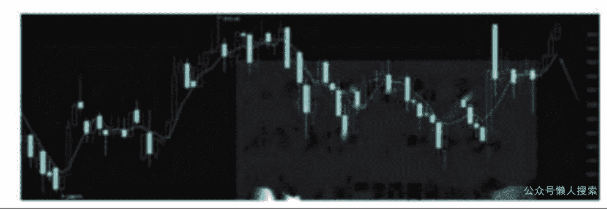
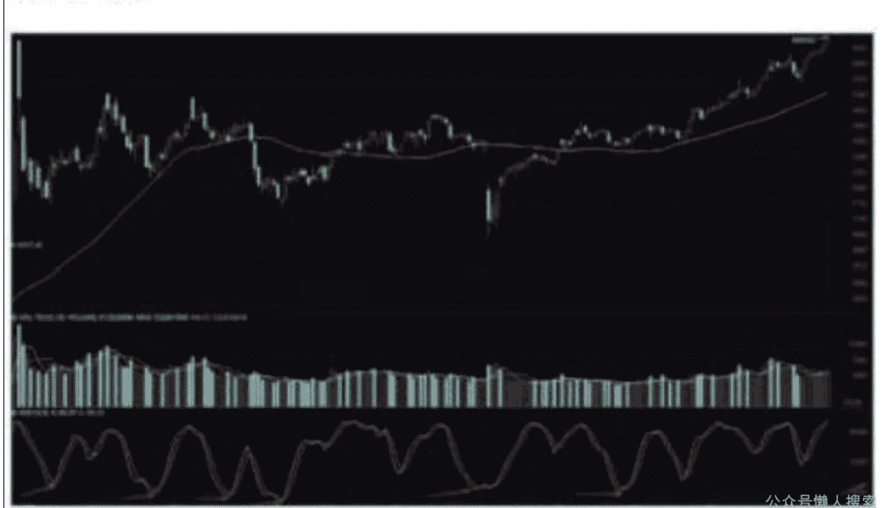
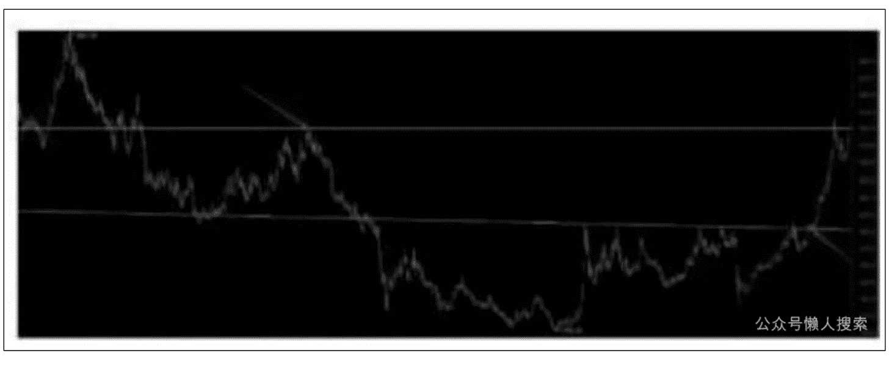
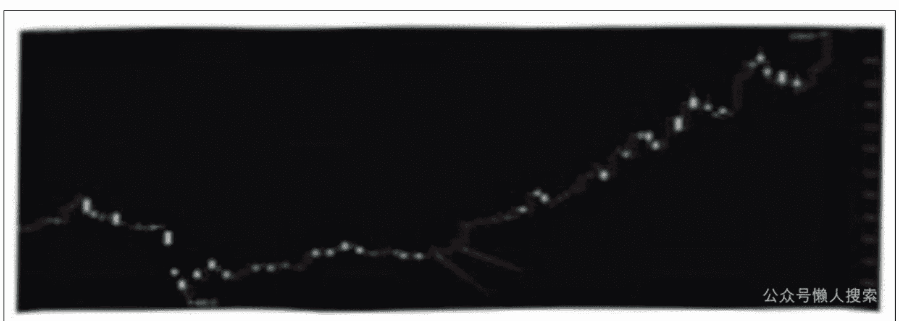
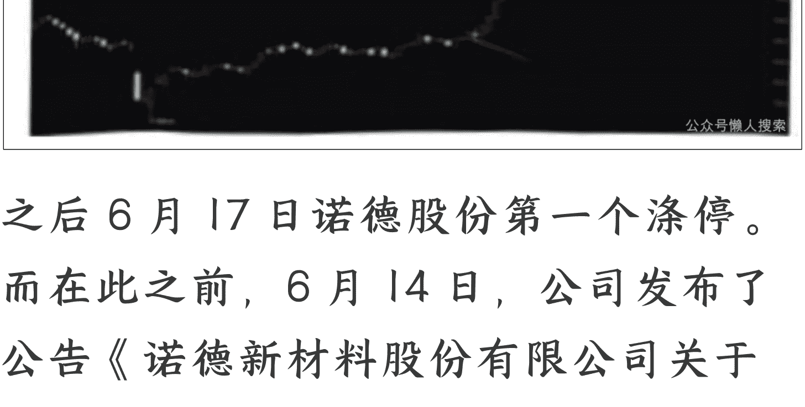
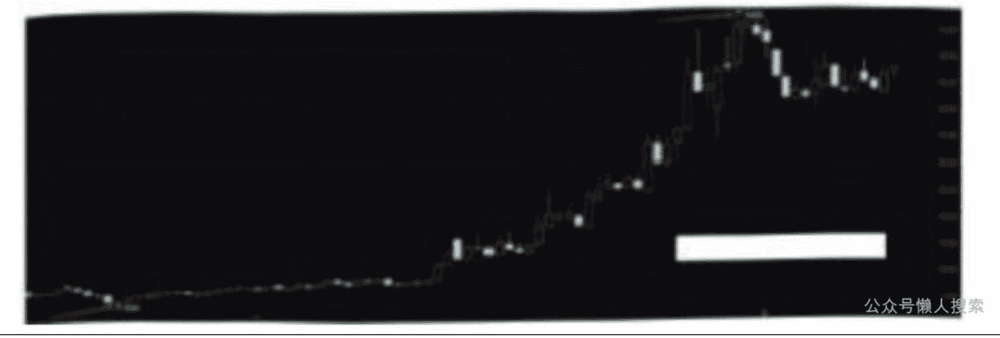
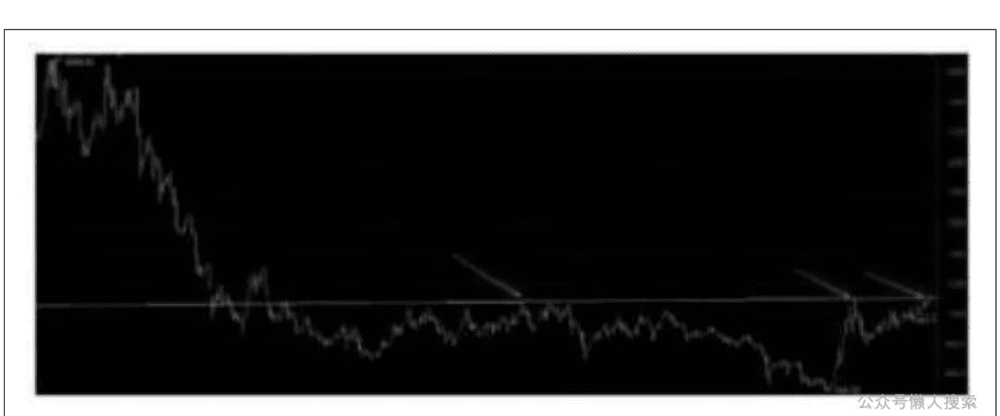

# 大盘分析6：18周预判兑现，四大原因决定各板块啥时走牛

## 250818 安民 Anmin0001 深度分析
整理：公众号懒人搜索，懒人专属群独享

行情它会如何展开，就看我们如何认识中国的未来，还有人类的未来。这句话包含着牛市行情的密码。它们将在本文第四部分呈现。

6月份我们团队应粉丝的要求，写了《新周期，新主力，大逻辑》，讲的就是宏观大势。4月份有《4月时间窗的选择决定今年投资业绩》，5月份在《中华民族将以一场巨型牛市作为进入百年盛世的一个标志性事件》，更是超宏观的视野。

其中4月份写大势的文章，现在相信那个标题的人越来越多了。正如我们回头去看去年8月份、2月份的文章，还有去年8月份、9月份的文章，现在回头去看，就很清楚地知道它们的价值。因为指数说明了一切。

但是，正如我们在今年6月份的文章中所言，5月份和6月份文章的价值，要等整个大牛市结束，那些后知后觉的人才能发现它们的价值。

懒人微信：lazyhelper

微信粉丝中就有位中医说，您去年8月份讲的“二次抄底错过了会后悔一辈子”的文章，简直就是神，太神了。但他可能并不知道我们9月初的文章，直接将这个时间点指向了9月13日和18日，然后也不知道我们在新周期的文章中讲，18周，3674点在今年4月低点后的第18周突破。

我们前期的观点很清晰，3674.40点必破，而且是4月7日低点后的第18周，这个早已经在《新周期》那篇文章中写明白了。两市能够这么明白地讲出这个观点的，我们不知道有几人，肯定一只手数得过来，很幸运，我们团队是其中之一。而且我们是准确地预判了去年2月大底、9月大底的团队，也提前公布了4月的低点周期。

可能有人会问，您当初怎么就知道18周突破呢？

像这类现象，就是文章过了很久才发现它的价值的现象，对我们而言，很正常。我们2009年就预判中国将进入又一个百年盛世，这一判断要取得社会各方面的共识，需要经受2018年中美贸易战的洗礼，到那次贸易战结束，到疫情期间美国死了100多万人可中国经济总体上平稳，疫情并没有在很大程度上影响到人们的生活和工作时，大家才似乎觉得，中国有进入百年盛世之象。

当然，我们讲了百年盛世的三个标志性事件，收回小岛，经济规模超过美国，一场巨型牛市，现在，这三个事件都没有完成，但都在缓慢的进行中。所以我们2009年的预判要能完全体现出它的价值，还需要几年时间，但最终超不过10年。

换句话说，我们2009年那篇文章的价值，可能要再过几年才能完全显现。包括收回小岛的时间窗，我们以前也讲了，基本上是二选一。

有些判断是超长期的，比如医药，我们的判断周期拉长到三四十年，不过，我们对中国老龄化人口与医药行业关系的判断，已经成为很多专业分析人士的第一逻辑，那就是人口的逻辑。有些判断是短线的，比如上上周我们讲金属制品和碳纤维，前些时讲的品牌消费电子、医院，

然后有些行业的判断是10年周期的，比如今年研究的行业二、行业三和行业四。比如近期复合铜箔一直被炒作，因为它是行业四的一个分支。然后市场在炒作行业四新一类产品生产线的总装，还有设备，还有资源，当然以后也会炒到其他。就是涉及到整个产业链的炒作，还没有怎么展开，要从炒作某个或某几个环节开始到整个产业链炒熟炒透，可能到牛市第一段结束，才有可能见到个大致的轮廓。

再如市场炒PEEK，炒改性塑料，它是行业二的一个分支，我们研究的某公司19，就有改性PEEK。所以近段时间它也在慢慢上攻。而这个分支炒下去，就有可能炒到碳纤维。因为高端产品用到碳纤维的可能性更大。这个我们后面会讲到它的内在逻辑。

我们做投资，做到最后就是做逻辑。如果逻辑不顺畅，您的投资就没有办法投。逻辑顺畅了，只要在主线，那么市场就会按照它既有的节奏向前，再曲折，也会向前。那为什么会炒特种工程塑料，为什么炒工程塑料最后会炒到碳纤维呢，我们后面也会顺逻辑来讲清楚。

所以我们的投资，还是要回到主线，还是要回到逻辑。当然，最终我们要回到十五字真言。因为它们就是一个总的概括。

其中最为典型的就是真价值，大家应该记得我们几年前写交行的文字，还有写工行、建行和招行的文字。它们已经涨了快三年了，完全改变了人们对于银行股的认知对吧。那么未来还会有啥非常明确的炒作路线？一样能够改变人们认知的那种呢？

我们认为，这条主线就是要围绕未来的中国展开，就是行情会面向未来10年的中国展开，最终会完全颠覆很多人的认知。

换句话讲，行情它会如何打开，就看我们如何认识中国的未来，还有人类的未来。

希望大家记住这几句话，记牢了，不要忘记。一旦记清楚了，到行情结束，那时我们再反过来回顾行情时，就会猛然发现，原来如此。

所以，在本文中，我们会讲到好些板块的内在逻辑，未来它们为什么会走强，到底是什么原因，逻辑是什么：包括它们为什么会涨，哪先哪后，为什么？我们会一一讲清楚的。

其实就是四大因素，决定一个板块是否走牛。后面讲到这四大原因，我们既讲现象，也更讲本质，讲清楚市场炒作的内因。

（声明：本文只为开拓视野、引导思路，并非择时，亦非荐股。股市有风险，入市需谨慎。本文不构成投资建议或意见，我们无力为大家的投资负责，请大家注意投资风险）

## 一、坚定新周期的观点和认知

《新周期》，这是我们团队今年6月份讲的，是为了回应粉丝有关牛市的问题而谈的一个观点。

粉丝的判断是，去年10月8日以来，到6月7日，他看到的是一波比一波低的波动。因此他判断是熊市。而且那位粉丝质疑我们团队的牛市说，不只是这一次，他都质疑了一年多。我们反复讲过一线分阴阳的知识，就是一条直线可以分出牛市和熊市，但他不信，而且很多粉丝跟他一样也不信，更别说大牛市了。

逻辑这一套对很多人是没有用的，多数人只相信眼前。

但问题是，很多人正因为眼前，恰恰错过了一轮又一轮的行情，因为牛市起点时，恰恰是市场最为悲观的时候。

为了回复那位粉丝的问题，我们谈了新周期的观点。当然，现在回头去看，是牛市，结论也比较简单，因为8月13日指数已到3688点，已创3年8个月的新高。可粉丝问的时候，当初只是在3385点，连2025年3月19日的高点3439点都没有被攻破；而且有很多技术派高手判断有可能跌破3040点，也有可能不破3040点才见底。

这还是当初市场上比较乐观的判断。

就是当时我们站在3385点是怎么看市场的，或者是站在今年4月是怎么看市场的，站在2635点是怎么看市场的，站在2689点是怎么看市场的对吧。在2635点和2689点，我们就看重大牛市将要诞生的观点。然后在2025年6月7日，我们当时是怎么看市场的呢？当然是牛市。

但这个牛市是怎么走的呢？能否更具体一些呢？为什么在那么悲观的情况下咱们还看好牛市呢？

总体上是，2024年2月5日、2024年9月18日，还有2025年4月7日以来，大盘运行的是一个新周期。这个周期是牛市的周期，从总体上最终要达到一个大牛市的高度；但大牛市分成ABC三段，现在是第一段。第一段分成三节，2025年4月7日以来，大盘运行的是一个新周期，是第一节的第三节。这个周期和2024年2月5日到2025年4月7日的周期有所不同。这是关于牛市第一段的一个总体的观点。总体是一个新周期，然后后一个周期和前面的周期有所不同。

先讲第一段的大的新周期，2024年2月5日以后的新周期，再讲2025年4月7日后的新周期，它们为什么是新周期，和以往有什么不同。然后最后我们要回归到牛市的主线，也就是各个板块是否大涨，是否能涨，有哪四个因素一定要注意。

在这个新周期，因为各种势力各种原因，特别是美国的金融打压，国内国际金融力量的配合，导致2024年2月5日到2025年4月7日的那个周期，尽管是牛市周期，但它们更像是熊市周期。

比如第一波上涨，从2024年2月5日到5月20日，它上涨的时间只有多少呢？65个交易日，周K线上是15根周K线，上证指数从2635.09点涨到3174.27点，涨了539.18点，这个指数还算好的，深成指的高点在2024年5月10日，只有59个交易日。更早的是国证2000，高点是2024年3月21日，还有创业板指，高点在3月18日。

所以，那波反弹，创业板只弹了25个交易日，周K线上是6周。其后的调整，上证指数是17周，深成指是20周，国证2000是26周，创业板指是24周。而上证指数及好些主要指数，去年9月18日后的反弹只有3周，日线上只有10个交易日，而且10月8日开盘就是最高点，其后的调整经历了27周。

换句话说，如果有人持有跟创业板指同步走或更弱势一些的股票，他们的持股体验会很憋屈，因为大盘涨的时间很短，但跌的时间很长，去年9月18日的低点2689.70点比2月5日的2635.09点才高出54.61点，幅度是2.07%，特别是去年10月8日到今年4月7日的27周调整，让很多投资者有生不如死的感觉。那就是一眼望不到尽头的调整，一种绵绵不绝、一再创新低的感受。

这点我们自然知道。但我们的观点依然不改牛市。再讲4月7日以来的新周期。

本波牛市新周期的第一个31+30周期，是对以前周期的重复。随着这个31+30周期的复现完毕，横盘筑底，底部大振荡的周期结束。新的周期也就来了，而新的周期是个上涨周期，时间有点长，空间应该不小。

我们现在关注的是，它会不会突破上面的压力位。当然，大家前面更加关注3674点是否突破，但我们前期的观点很清晰，3674.40点必破，而且是4月7日低点后的第18周，这个早已经写明白了。两市能够这么明白地讲出这个观点的，我们不知道有几人，肯定一只手数得过来，而我们是其中之一。

那我们关注的突破是什么？即大盘会不会突破6124点到5178点的那个月线级别的大的压力线。当然，这个是我们以后文章中有可能会探讨的内容。今天不谈这个。

简单地说，这个大的新周期，它首先出现的是31+30，这个31+30，是整个牛市筑底的一部分，因此它是一个大振荡周期。其后，今年4月7日开启的周期，才是一个上涨周期。这是关于新周期的定性。

我们在2024年的文章中，很清晰地反复讲到，去年2月份的反弹完毕，是大震荡筑大底，这个是讲得很清楚的，讲了无数次。同时去年秋冬也不止一次讲到过今年4月18日那周的低点周期。只是因为金融战，这个周期提前了一周。

其次，周期一样，内容不同。

周期一样，就是这里是上涨，这一点跟上次牛市没有大的区别。但是内容不同，就是上涨的内容不一样，板块不一样。

要明白这个，就要问自己，上一次涨的是什么，这一次涨的是什么？上一次外资是引导和主导的主力，这一次不是。它们引导不动。

如白酒，上一次牛市，白酒从2418.77点涨到13935.11点，时间是从2018年10月30日到2021年2月18日，涨了576.12%。北向资金和外资是主力，内资追逐外资的炒作标的。但本次牛市，白酒指数底部找到没有，应该说基本上已经找到了，880381白酒指数6月16日的低点6953点，基本可以认为是第二个底部。注意，我们用词是基本，可以认为，就是如果再创一个低点的话，那个低点也是底，而且不会低于2024年9月19日的6225点。这些可以在后面的跟踪中确认。

就是白酒指数如果从这里下去，即使不创6月16日的新低，只要盘住，横出来，那就是底：即使创6月16日的新低了，再止住，日线一上钩，或多盘一盘，也会成底。类似的有旅游服务，酒店，社会服务。

白酒指数还有一个右侧确认的趋势线。就是从2025年3月17日的高点8536.35点，过5月14日的高点8211.30点画条线，这条线一旦被有效突破，就可以确认白酒的第二个底。这是白酒类。

上一次有光伏、锂电，这一次光伏底是找到了，但还在大底附近，什么时候筑成大底？估计还需要些时间。锂电881263呢，比光伏快点，快筑成底部了，但暂时还没有向上突破颈线位。上次攻击了底部颈线位，没有突破。

如图，锂电池的颈线和上升趋势线的支撑。8月13日，它开始上攻到656.68点，收涨3.48%。大阳。

这次在炒的是它的分支，如复合铝箔880646，如半固态电池固态电池880742，锂电设备881265。这次炒的还有机器人，还有金融、军工军贸。上次银行是缺席的，这次银行是主力。这次炒作，还有医药，上次也有。这次还有AI产业链上的，如PCB、光模块，液冷，铜线连接，还有AI芯片存储芯片和光刻机等。上次白酒比医药强，这次医药比酒强很多。上次还有煤炭，这次能不能指望煤炭？还可以继续观察。但是有色不会缺席。黄金上次有，这次也有。然后有些月K线图上上次大底振荡的，这次多半估计是有了，比如综合，881478；类似的有水治理，大气治理，服装家纺，游戏等。当然，也还有新消费。有很多。不一一列举了。

正因为4月份以来的周期是新周期，因此它也会有一些新的表现，会有好些让人觉得出人意料的地方。在炒作中，有几点我们一定要清楚，一是板块是轮动的，就是有些暂时不涨，后面会轮动到，比如消费，下半年一定会轮动到，特别是那种有不错增长的。二是均值回归。三是逻辑顺畅。四是强者恒强。而且新周期它是一个上升周期，从时间上来讲，它不会短。这几点我们后面还会比较深入地讲到。

同时特别声明，本文中提到的个股，我们讲到它们，是为了说明问题，为了讲清楚板块如何轮动，炒作的逻辑顺序，而不是荐股，也不是个股基本面的分析。因为不提到那些行情中的典型个股，那就讲不通。因此，有些提到的涨得很好的个股，您千万别误会了意思。我们现在也不研究它们，更不会推荐它们。因此，大家没有必要去管它们。我们的做法是，可以做高低切，找躺在低位的好股票投资，特别是那种有内在逻辑的，未来有涨价题材的。

还有，我们在《新周期》的文章中讲到，一个18周周期，建议大家好好的去复习那一段。然后到8月13日，上证指数已经到3688点了，已经涨过2024年10月8日的3674点。这还是大指数压盘和洗盘的结果。尽管如此，指数的节奏就是仿照我们之前在新周期那篇文章里讲到的18周周期在走。所以，尽管这里敏感，且大小盘股有点分化，但是，周期还是在按照它自身的节奏在走。

实际上就是如我们前不久所言，根据指数上升的斜率指引，上证指数已经压不住了。

## 二、大指数短期是高位平台

看上证50，给个图。黄色的是颈线，最右边是突破颈线前做的平台。

懒人微信：lazyhelper

我们前期讲到，2021年2月18日的高点3731点和去年10月8日的高点3674点，都是大的压力位。去年的行情以来，第一次冲击3731点是10月8日，当天放量大涨，但是被下面的获利盘和上面的套牢盘给干下来了。第二次是近期。

而这个第二次，先冲击是7月30日的3636点，再次冲击是越过3636点以后，从8月7日周四开始，每天攻击向上一点点，然后下来振荡。周二最高3669点，周三3688点冲过，收3683点，第一天突破。这类冲击，都是为了把上面的套牢盘洗干净。

多方这次完成突破，启动的是科技股，如880489、880490、880952。跟金融如券商相比，科技股影响肯定要小一些，所以，这表明在多方看来，拿下来不是问题，而是要慢慢涨。而且，大家伙们要压住盘。换句话讲，他们并不急。

除了上证50指数和上证指数，我们还可以看看别的指数。我们经常用到的是多指数相互印证的思维方式，相互结合着来看，相互印证着看行情走到什么阶段了，给大家看一个更有意思的图吧：

这是国证2000指数周K线图。左边第一个箭头是2015年的最高点，那天是6月15日。第二个红箭头所指的位置，是2016年11月23日的高点，9719.59点。此前是股灾，经两波下跌，然后反弹了近10个月，国证2000指数弹到9719.59点，见反弹的最高点。第三个高点是2022年1月4日，最高9350.23点，上波牛市的最高点。然后2025年8月15日的这周，国证2000指数周二反弹到最高9194.49点，周三已经9328点了，收盘9324点。国证2000指数它就处在压力线附近，略有突破。从盘面看，8月7日和8日指数振荡了两天，12日又有振荡。这表明有些资金当时持股心态不稳。

下面是各个时间点国证2000的压力位和支撑位。压力线过了，有效站住了，后面就会是支撑。

| 时间 | 压力和支撑 | 时间 | 压力和支撑 |
|---|---|---|---|
| 8月11日 | 9091.53 | 9月17日 | 9083.52 |
| 8月12日 | 9091.23 | 9月18日 | 9083.22 |
| 8月13日 | 9090.94 | 9月19日 | 9082.93 |
| 8月14日 | 9090.64 | 9月22日 | 9082.63 |
| 8月15日 | 9090.34 | 9月23日 | 9082.33 |
| 8月18日 | 9090.05 | 9月24日 | 9082.04 |
| 8月19日 | 9089.75 | 9月25日 | 9081.74 |
| 8月20日 | 9089.45 | 9月26日 | 9081.44 |
| 8月21日 | 9089.16 | 9月29日 | 9081.15 |
| 8月22日 | 9088.86 | 9月30日 | 9080.85 |
| 8月25日 | 9088.56 | 10月9日 | 9080.55 |
| 8月26日 | 9088.27 | 10月10日 | 9080.26 |
| 8月27日 | 9087.97 | 10月13日 | 9079.96 |
| 8月28日 | 9087.67 | 10月14日 | 9079.66 |
| 8月29日 | 9087.38 | 10月15日 | 9079.37 |
| 9月1日 | 9087.08 | 10月16日 | 9079.07 |
| 9月2日 | 9086.78 | 10月17日 | 9078.77 |
| 9月3日 | 9086.49 | 10月20日 | 9078.48 |
| 9月4日 | 9086.19 | 10月21日 | 9078.18 |
| 9月5日 | 9085.89 | 10月22日 | 9077.88 |
| 9月8日 | 9085.60 | 10月23日 | 9077.59 |
| 9月9日 | 9085.30 | 10月24日 | 9077.29 |
| 9月10日 | 9085.00 | 10月27日 | 9076.99 |
| 9月11日 | 9084.71 | 10月28日 | 9076.70 |
| 9月12日 | 9084.41 | 10月29日 | 9076.40 |
| 9月15日 | 9084.11 | 10月30日 | 9076.10 |
| 9月16日 | 9083.82 | 10月31日 | 9075.81 |

大家后面可以盯着国证2000这个支撑线，跟随操作吧。一旦洗盘，站稳支撑线就是介入的点位。
需要讲清楚一点的是，国证2000这个形态是底部的大双底形态，上面的压力位是颈线的压力位。有效突破这里，就是有效突破底部颈线。当然，如果能够突破9350.23更好。因为它的大形态是一个为期10年的大双底形态。大双底一旦突破颈线，那么上涨空间才会打开了。
没有看过原《新周期》那篇文章的，建议去看看。没有别的，因为涉及到后面的周期和上升斜率啥的，建议大家对照那张周K线周期图好好想想。因为上升有斜率，斜率就是数学，是初中数学和高中数学中都会讲到的，而且数学是死的，2+3就等于5，不等于8，也不等于1。明白吗？斜率会带领处于上升周期的指数和个股，到达它该到达的地方；熊市相反。这句话以后会成为我们的炒股名言，就跟均线的方向就是财富的方向，跟选股首选行业，要么真价值，要么真成长，要么真硬核一样。
回到周期。从4月7日那周以后，到8月15日这周，一共运行了18周，国证2000指数周K线的斜率指引大致是周升146.26点，到8月8日那周是9048.73点，8月15日这周是

9194.99点。就是只用斜率指引就知道，指数压不住了。
当然，它可以假突破，也可以真突破。还可以先突破再回踩。估计是后一种。
注意，只要是有效突破，就表明这个指数从形态上正式进入牛市，这是通过右侧形态最后确认的。不过跟我们的预判相比，太晚了。我们是去年2月5日，深成指跌到7683.63点那天确认牛市到来的，当时讲原《砸锅卖铁买股票》。那天只要跌到7726点，就是我们确认牛市的低点，熊市的结束点。这种通过大形态确认的办法，比我们的方法晚了一年半。
不过，这种确认也是有价值的，因为它能确认大形态底部的颈线是否有效突破。一旦这里有效突破，就是10年一突破。而且它一旦突破，就反向证明我们以前讲的这波牛市是十年一遇的级别那个判断的正确性。而且证明了我们新周期一文中讲的18周周期的有效性。
所以这里就两种走势，一是高位短线平台，为的就是洗筹码，更稳健一点，是上证50的走势。二是直接突破，突破到10500至11500一线再回踩，洗深一些。这是国证2000的走势。
然后上证50也会补涨，被带上去的。因为指数上行时，有它的速度指引，下行时也一样。只是这个速度并不特别特别精确，它可以有点误差。
而从上证50的短线走势来看，是一种高位平台的做法，就是振荡，洗筹。洗完筹，上证50也会向上突破。而上证50会带动沪深300。这个是为新周期决定的，4月7日开启的周期是一个上升的新周期。

## 三、最坏的准备，极端的调整有多深

这里讲个极端情况，未必发生。这个极端情况是什么情况呢？即4月7日的3040点到5月14日的3417点为小级别的1浪，之后到6月23日的3347点为小级别的2浪，然后是小级别的3浪，假设上证50的前高，就是7月30日的2842.47点不被突破，然后大指数继续二次探底，带动小指数向下，假设此一极端情况发生，指数会调整到哪里？这个方案是备选方案。它也可以应对399303国证2000突破后回踩的走势。我们这里讲一讲备选方案的走势。
这个没有多深。它是月线金叉下的周线回踩或下穿，但真正要调整的是日K线的指标。日K线指标回到低位，然后盘着静待5月均线上行到位。
我们可以看看5月均线的情况：

现在月线还没有收盘，要到8月29日月K线才收盘，到时5月均线的位置才能确定。因此，现在谈5月均线还太早。但我们可以做个假设，以假设的情况来估计5月均线的运行。
假设月底收盘，5月均线就在8月12日收盘这一带，也即8月收盘时，假设指数在3665点附近，5月均线收在3462点附近，那么，到9月开盘，指数仍然开于3660点到3670点一线，此时5月均线就要上行77个点左右，就到3539点一线。也即调整可能达到3520点到3570点一线。
如果调整的最低点在上次的低点3547点，则离5月均线相差8个点，则9月份指数只要涨40个点，5月均线就能跟上。这个不会有问题。或者9月份一个低开下杀就到了。所以调整的高度，强势调整在3547点到3570点，弱一点的话就调整到3520点附近。这是根据5月均线做的一个简单的判断，毛估估。
只是它未必精确。大概齐吧。而且，要清楚它是极端情况。但重点是什么呢？日线指标回到低位。
懒人微信: lazyhelper
我们可以看看去年10月8日以来，慢速KD的6次低位情况。这次如果下来，就是第七次。
所以，接下来要判断的是，如果有极端调整，它是以时间为主，还是以空间为主。我们判断不是以空间为主，而是以时间为主。根据5月均线的大致估算，这个调整就不是以空间为主的。但因为指标要调整下来，需要时间。所以空间并不需要跌很多，靠时间磨一磨，就可以把指标调下来。而且国证2000用我们前面给的表格找支撑。高点前面也给了。
为什么以时间为主？主要的原因，在于这里是搭台子，搭的是大指数起跳的平台，那么在此情况下，平台就不能太低。
这相当于我们在翻越1000多米的高山（3731点—2635点=1096点），直接从海平面从0米起，您很难一口气翻过去的，但如果在900米到1000米的地方建个旅社，有天的住宿，您在那里稍事逗留好好休整休整，那时翻过去就要容易得多。这类似于爬珠峰时需要几个大本营。到了营地，需要好好休息，让身体得以恢复，也等天气变好。
所以，换句话说，这里指数不能打得太低。打太低了，就太浪费做多的能量了。行情会朝着能量消耗最低的方向走，大指数搭建高位平台，把不稳定和没有耐心的筹码洗出去，是最节省能量的办法。让挣钱的和套牢的在高位充分换手，让坚定者多持仓，把不坚定者洗下去，再向上一拉，所谓的高位，就能轻松拿下。这就是上证50横盘的目的。
我们还给出一个指标，就是上证指数的46天均线，上图就是。就是上证指数调整时若触及到46天线，那么调整结束。注意，46天线是47天线的一个变化。

47属于卢卡斯数列，在A股中经常出现。有不少的调整是47个交易日，我们讲前面的调整和上涨，有两次，一次是47周，就是2018年第一次贸易战时的调整。一次是48周，2020年2646点以后的上升周期。日线中，47天调整或低点的周期，也不难见到。如上图。
46天线周二在3505.25点。6月23日行情再次启动的那一天，在3348.46点，平均日上升4.36点。近20个交易日，日上升4.84点。近10个交易日，平均每天升5.49点。按平均日升5个点估算，到8月25日，它就到了3550点左右，有可能略低一点，或稍高些。此后它上升的速度就会变慢。只要近期不大跌，它最长可到8月26日，仍然可以保证每天4到5个点的上升速度，到时就上升到3555点左右。
所以如果有极端行情，指数在这里可以调整两周左右，或者一周，最长10个交易日，都没有问题。届时46天线上升到3530到3555点一线，对大盘形成支撑。
故而判断，如果发生极端情况，大盘在这里的调整，最短可能是一周，长则可以两周，10个交易日，因为那样就从容一些。一旦调整到位了，然后可以缓慢盘底。盘一盘，也可以把周线指标调整下来，就可以为后面的行情做准备。再讲一句，这个调整可以和国证2000接近或略超9719点后的那次调整吻合，但大小指数可以不一定同步。
要讲清楚的是，这是讲的一种极端的情况，最坏的情况。知道这个，是做多最坏的打算。注意，一旦国证2000短线拉到位了做回踩，回踩一定是踩到颈线，略破或不到都有可能，但上证指数是46天线。从技术上说，国证2000的调整，应该是在9719点附近展开，或者不到，或者略过一些，然后回踩颈线，受到支撑，再继续上行。注意这些只是短线的判断，它不涉及到大波动。
46均线和47均线没有多大的差别，一根早点，一根晚点。用哪根都可以。看各人喜好。

## 四、未来行情会怎么走，讲四个内在的逻辑支撑

我们前面讲了，这波牛市要解决的是未来10年的问题。它的重点就是两个，股价结构和产业结构。
股价结构，就是被西方金融资本妖魔化的股价结构，包括香港10倍市盈率是顶的股价结构，必须得到纠正。就是中国资本，特别是中国国家队要重夺中国资产的定价权。这是三年来我们一直在讲的一个核心思想。而且我们是中国资产定价权提出的第一人，在中国平安上市前就讲定价权问题，产业的股价结构，就是面对未来10年中国国内的产业发展走出相应的股价结构和走势。这是本波大牛市的核心任务。
上面是两个战略任务，跟它们相匹配的，就是四点，内在的逻辑支撑：
- 1. 强者恒强的逻辑
这在哪一轮牛市都是如此。比如两低一高，会不会走强，肯定会。因为强者恒强。
近期我们看到有些专业人士根据前10年的走势，判断银行股的行情将结束。很显然，这是刻舟求剑。在这种特殊的情况下，按历史估值讲现在，这是有问题的，包括讲10倍的市盈率就是港股的顶，都是有问题的。当然，银行毕竟不再是两三年前，投资价值和那时肯定有区别。
对中国人来讲，这世界不应存在二等公民，也不应存在二等资产，奴隶资产。我对国泰君安的研究人员讲过一句话，内容是：港股10倍市盈率就是顶，他们10倍甚至15倍市盈率就是底，凭什么？
银行股为什么能起来，大家见过我们团队两三年前的文章吗？若读过的人，应该记得，我们当时讲犹太金融资本的目标，是把内地国资银行打到净资产的30折以下，到最低25折。这是他们长期妖魔化中国资产的目标。
犹太金融资本和盎撒金融资本通过他们的定价权，话语权，再利用跟随他们的国际资金，通过20来年的内地银行股的走势定位，就给咱们的银行股定下所谓的天花板价格了，顶部的价格连净资产都不到对吧，这是他们囚禁中国金融研究员思想的一个牢笼。
大家想一想，我们入股内地银行股，一般都是什么价格？不会低于每股净资产对吧。那么为什么他们可以在20年内将内银的顶部价格弄到远低于净资产呢？这就是他们拿到定价权以后长期妖魔化中国资产的结果。他们这就给中国资产贴上了标签，是二流资产的标签，然后背后的潜台词是，你那个国家也是二流国家，你的人民是二流的人民，是一定要成为白人奴隶的人。
长期这样操作下来，最终，他们想怎么定价就能怎么定价，因为他们背后有很多的国际资金在跟着他们的定价报告操作。这就对银行股的最低价特别是最高价形成了某种控制力，这就是定价权。于是，我们的研究员就开始讲，银行股现在就涨不动了，见大顶了。
但真的见大顶了吗？我们团队认为没有。为啥？因为定价权必须拿在中国金融资本手中。如果就此见大顶，那咱们拿到定价权了吗？没有。
再比如，医药会不会走强，创新药、CXO也就是医药外包，还有减肥药会不会走强，肯定会，因为强者恒强，创新药为什么会走强，因为是真成长，特别是那些出海药企，动辄就是几十亿美元的收益预期，比以前N多年的利润之和都高。难怪大家都抢对吧。
大家也可以看看，医药股，特别是医药外包，创新药和减肥药，在这里只是做了一个短线的调整，然后8月13日就企稳反弹了。所以这里是做短差，上面抛了，到下面来低吸的地方。我们讲医药外包行业指数在550点附近，可能略高一点就会有压力，当时劝大家不要短线追高，结果它到562点，之后调整到20天线，再度向上。从562.89点到498.61点，调整了11.42%。

上图是医药外包，881249；下面的箭头是我们建议大家可以做短线的地方，上面的箭头，是我们建议大家别追的点位。
所以医药的行情没有走完。
再如硬核科技会不会走强？也会。很多军工股就是硬核科技，再如光刻机、AI、芯片股都是硬核科技。比如三种六代机对吧？还有军贸出口。军贸概念走强就是5月。5月我们文章讲的是回归《中华民族将以一场巨型牛市作为进入百年盛世的一个标志性事件》，讲的就是以军力特别是实战为后盾的国家大周期。这类文章估计只能在我们团队这里看到。
再就是与PCB相关的电子类。当然，它们背后是AI硬件产业，领头羊在美国。由PCB分支出另一个材料小行业就是复合铜箔，它也是电池产业链上的一环，就是锂电材料。常规的PCB铜箔是AI服务器上一定要用到的（所以AI服务器包括液冷就走得很牛），厚度是18到35微米，厚的PCB铜箔有50微米、70微米和105微米的，最厚的可以达到140到350微米。动力电池铜箔和PCB铜箔，两者都是铜箔，而且铜箔或复合铜箔越薄，制造难度越大。因此，动力电池铜箔现在都到3微米和3.5微米了，但好多企业亏损，凭什么做PCB铜箔的，赚得不要不要的？因此，做锂电铜箔的，转做PCB铜箔，难度不会大。这就是炒复合铜箔的内在逻辑之一。炒PCB铜箔是因为炒AI服务器，而炒复合铜箔就是炒它们是同一种类的产品。
这背后，有AI芯片就是寒武纪，有光模块就是中际旭创和新易盛，再就是PCB的代表胜宏科技，还有深南电路、沪电股份等。包括炒液冷的，炒铜缆高速接连的，都属于小类和分支。动力电池铜箔还炒的是行业的成长性。也即和PCB铜箔是同种产品加上成长性，就炒这个。这是逻辑。
而真要炒到它，还欠缺事件的刺激。在下一节，我们会讲到。
再就是材料，如PEEK、改性塑料、合成树脂、其他塑料制品，它们是几个大行业如机器人、飞行汽车、新能源汽车的材料。
再如固态电池，以及它背后的复合铜箔，还有就是锂电设备、稀土资源。还有各种有色和金属制品等，都会强者恒强。
- 2. 有逻辑的行业或板块最终会走强
有些有逻辑的板块，先显现出来，先浮出水面。有些有逻辑的板块，后浮出水面。但只要逻辑够硬，最终都会走出来。这是总体的思想。
在牛市后面的实操中，要注意一点，弱者重逻辑。就是有些行业走在前面，有些行业走在后面。那些走在后面的行业，一旦有成长逻辑或硬核逻辑，一样会走强。这方面如881287地面兵装，5月6日是875.17点，8月12日最高1694.42点，涨了93.61%，原因就是印巴战争打出了内在的硬核逻辑。也即通过事件驱动打出了内在的逻辑。
同样的道理，我们这次布局，布局了两个行业中的子行业，就是重逻辑的结果。
这方面，大家还可以看一个乘用车指数881212，上一轮牛市它的低点出现在2020年4月28日，比大盘晚1年3个半月不止，其后它用一年多的时间，到2021年10月26日止，从327.36点一路涨到了1110.02点，涨幅339.08%。

左边的第一个箭头是2019年1月7日，大盘的最低点是1月4日2440点。第二个箭头是2020年4月28日才是它的底。上证指数在2020年3月19日见到2646点的第二个低点，之后反弹。它在4月28日才见底。
更典型的是它后面的电动乘用车指数，881213，低点是2019年11月13日，比大盘晚11个月有余，后来涨了6.94倍。最低162.57点，最高1127.96点。这个就不给图了。大家可以自己去看。
晚的之所以能涨，是因为到了那个时候，板块上涨的逻辑被资金们挖掘了出来。就是注意，晚涨的，一定要逻辑够硬才成。
本波牛市，银行之能涨，与我们挖掘它的逻辑分不开的。大家应该记得我们几年前写交行的文章，还有建行与汇丰控股比较的文章，工行与美国银行比较的文章，还有招行与伯克希尔比较的文章。
比如今年8月份伯克希尔公布二季度报表，股东净利润为169.73亿美元，去年同期为430.50亿美元，下降了60.57%，降幅超6成。如果招行这样公布半年报，会是什么情况？3到5个跌停是有的，但是伯克希尔呢？第二天跌了2.65%，之后就是修复，上周才跌了1.89%，本周继续修复。招行到现在跌了5周，7月11日收盘45.64元，8月12日收盘44元，这就跌了3.59%。8月13日再跌1.05%，收盘43.54元。从股价看，外国人会想得是招行公布了比伯克希尔还差的中报。
美股为什么好挣钱，这就是原因。他们用各种理由解释，反正就是要走强。美国用工数量都修正超九成了，然后他们讲会降息，然后走强。息口高的时候，他们拿那个造假的用工数量说事，说经济好，就业好，要走强。我们这边呢，5.3%的经济增长数据，居然一批人在那里说中国宏观经济不好，走得弱，衰退。他们一点几的增长率及以前五六个点的通胀率还说经济强势，我们5.3%的增速说经济不行。这是人话吗？人嘴两张皮，懂吗？
本节的最后，补充一下，反内卷行业的背后，实际上是行业反转的逻辑。研究员都在量的面上谈反内卷，至少在目前，这个方法是有问题的。定性和定量的研究应该是相结合的。当反内卷上升到整个中国最高层，从财经委会议到政治局会议到国务院的层面之后，反内卷行业首先要做的是定性，此时定性一定重过定量。其中的主要行业主要产品，一定是行业反转的逻辑。
- 3. 板块轮动
有些板块没有很强的增长逻辑，那么它们怎么涨呢？特别是那些好久不怎么涨的板块指数。结论是，推动它们上涨的力量，叫做板块轮动。
轮动需要契机。我们现在就来讲行业启动的契机，以及板块间是怎么轮动的，把逻辑和轮动结合在一起讲。
比如PCB，是什么时候启动的，是5月29日，或者是6月4日。5月28日，它收盘1126.72点，7月31日，最高2065.80点，两个月涨了83.35%。8月13日又创新高。5月29日那天，生益科技、景旺电子、奥士康、鼎龙控股都涨得不错。6月4日和5日是技术派喜欢介入的时间。下图是881334，PCB。

那复合铜箔呢，启动时间是哪天？6月18日。它们前后有内在逻辑的关系。因为PCB涨了以后，资金就会找跟它们类似的炒作对象，刚好铜箔跟PCB产品类似，都是做铜箔的，而且技术等级要高得多，这就找到了动力电池铜箔。而且大家都等着呢，眼巴巴地看着。

之后6月17日诺德股份第一个涨停。而在此之前，6月14日，公司发布了公告《诺德新材料股份有限公司关于向2025年股票期权激励计划激励对象首次授予股票期权的公告》，行权条件是2025年销售铜箔的数量或营收增速不低于30%，2026年是第二个行权期，也是这个增速。也就是这个条件，点燃了复合铜箔的炒作。6月17日起，诺德股份出现了8个涨停。到诺德股份第二个涨停，大家就炒起了复合铜箔。
复合铜箔的背后，就是PCB行业AI产业需求的逻辑，以及固态电池的逻辑。也就是复合铜箔背后站着两个大产业。
这就是轮动。从PCB轮动到复合铜箔，而且这个轮动有内在逻辑，有事件点燃。


上图是诺德股份的 8 个涨停，第 8 个涨停打开了。第二个涨停的时候，其他铜箔个股开始启动上涨。复合铜箔有 43 只股票，里面真正做铜箔的，只有 6 只。诺德股份这么一涨，它们就都涨得不错，只是没有连续 8 个涨停。

类似的有新瀚新材，上周日的文章中讲到，但没有深讲。

它的总龙头是双林股份和肇民科技，肇民科技从去年 9 月 18 日的 16.19 元涨到今年 4 月 29 日的最高 83.33 元。用后复权，去年 2 月份最低 39.78 元，今年 4 月份最高 274.13 元，涨了 6.89 倍。双林股份在去年 2 月到今年 4 月，从最低 6.07 元到最高 82.98 元，13 倍多了。

PEEK 板块去年 8 月 27 日到 11 月 11 日领涨的是光启技术，从 15.63 元涨到 50.81 元。汉宇集团从去年 7 月 25 日到今年 2 月 27 日也是涨得极好，从 6.56 元涨到 24.58 元。类似的有富恒新材。那这个板块为什么大涨呢？真正的原因就是双林股份。那些涨得少的，都是跟随双林炒作的，因为双林也有 PEEK 材料。但炒双林股份，真正的逻辑是因为两点，一是炒业绩，去年季季高增长；二是炒机器人，它的行星滚珠丝杠有突破。这家公司是华为和特斯拉机器人的供应商。所以它涨得凶，如下图：



那为什么 PEEK 材料也涨呢？因为双林股份自研的 PEEK 材料蜗杆已长期批量应用于汽车座椅水平驱动器。公司是 2023 年 12 月 20 日以前回复，然后新闻在 12 月 20 日报道，那时双林股份已经涨了 7.06 倍。

双林这么涨，市场就开始炒 PEEK，因为双林也有 PEEK，而且 PEEK 也是机器人的上游材料，供应给机器人、飞行汽车和新能源汽车。所以 PEEK 就随人形机器人概念涨，而且每波行情，PEEK 也因不同的个股领涨而向上。那些个股被挖掘出一只，就带动整个板块指数涨一段。

今年，PEEK 在 1 月 6 日到 2 月 26 日，在 4 月 9 日到 5 月 7 日都涨得不错。1 月那波从 1013.96 点涨到 1414.90 点，涨了 39.54%。4 月从 983.66 点涨到 1490.25 点，涨了 51.5%。6 月 23 日启动的这波，从 1316.89 点涨到 8 月 11 日的 1794.02 点，已经有 36.23%，13 日又创新高，还没有涨完。总体很不错。改性塑料 881047 也是。今年 1 月的那波和 6 月 23 日启动的这波，涨幅都强于 PEEK。4 月开始这两波，机器人跟 PEEK 一样，也是前一波涨得好些。

4 月份的反弹，人形机器人涨了 40%，6 月 23 日以来，到 8 月 12 日，涨了 25.09%，13 日也创了新高。我们在 2 月份到 4 月份时讲，机器人会反复走强的，现在指数创新高，就是证明。当然，领涨个股不一定还是原来的股票。

所以 PEEK 涨得好，因为它是从机器人迁移过来的，是一个强分支。

当然，不只是这个，还有合成树脂 881045。炒的还是机器人的分支。因为智元借壳上纬新材。上纬新材原来的业务就是树脂，一样是新材料。只是它们的炒作，没有 PEEK 那么凶罢了。

再讲为什么炒 PEEK，最终会炒到碳纤维。内在逻辑是什么？

碳纤维跟特种工程塑料 PEEK 比，一个是特种工程塑料更轻，耐受力也不错，再就是价格便宜得多。因此那种不需要耐高温的低端产品，自然就用特种工程塑料，可是高端产品只会用到碳纤维。因为两者对温度的耐受力不一样，环保性能也不一样。

因为特种工程塑料在满足含氯物质+250℃以上高温+催化条件时，会释放二噁英，这是一种致癌物质。还有，苯酚本身挥发温度 40.3℃，超过即开始蒸发。在塑料中，苯酚主要存在于酚醛树脂等材料中，当温度升至 40.3℃以上时，未完全反应的苯酚或者是它的衍生物可能从塑料中挥发出来。工程塑料如聚苯醚（PPO）的改性版本，如与聚酰胺或聚苯硫醚共混，可能引入酚类添加剂，导致在较低温度如 40—60℃时，出现苯酚挥发。其他常见塑料如聚氯乙烯 PVC 在改性后，在 60℃以上释放氯乙烯单体，聚对苯二甲酸乙二醇酯 PET 在 60—70℃释放有害物质，它们主要是增塑剂、稳定剂或抗氧化剂。

要明白这个，只要想想，我们每天进私家车时，都有股怪味。为什么？

车内塑料部件，如仪表盘、座椅、内饰材料在夜间温度变化或日间升温时释放挥发性有机化合物。甲醛释放温度 -19.5℃；温度超过 40.3℃，酚醛树脂基材料或改性工程塑料中的苯酚释放；达到 80℃时，苯开始释放；甲苯的释放温度要 110.6℃。夏天汽车在外面曝晒，车内温度有可能接近或达到 80 度。

所以，如果讲健康和环保，碳纤维一定比 PEEK 安全，也更环保，更健康。而电池在充放电时，电池内部温度有时比较高，它里面有些什么化学成分会挥发呢？能明白吗？电池也好，机器人也好，车子也好，它们中的有些材料在不同温度下有可能释放不同的低分子量化合物，从而影响人们的健康。所以，用碳纤维的则完全没有这个顾虑。

工程塑料更轻，这就导致对产品重量没有严格要求的，会更多用到碳纤维，而对重量有严格要求的，或者是对成本有严格要求的，在工程塑料和改性工程塑料能够替代碳纤维的地方，就会用到工程塑料和改性工程塑料。

比如飞行汽车，最初一定是倾向于用工程塑料而不是用碳纤维，因为工程塑料轻，省电。当电池的续航时间和里程不太长时，碳纤维的使用肯定要尽量受到限制。当电池续航时间和里程完全不成问题时，碳纤维的使用量一定高于工程塑料。这些都是内在逻辑。

类似的，还有光伏产业链，比如 7 月 1 日，中央财经委员会第六次会议提出“依法依规治理企业低价无序竞争”，明确要求推动光伏等重点行业落后产能退出。次日光伏硅料板块指数涨了 10.23%。

6 月 27 日，新修订的《反不正当竞争法》通过全国人大常委会审议，首次将“低于成本价倾销”“串通操纵价格”等内卷行为定为违法，并定于今年 10 月 15 日正式实施。因此，6 月 30 日光伏硅料板块指数就涨了 7.02%。此波它从 6 月 27 日收盘 393.35 点涨到最高 7 月 23 日的 566.21 点，涨了 43.95%。如果从最低点算起，涨了 51.94%。

这是很典型的政策推动的。然后国外机构还在用供需逻辑，这个是不清楚国情的判断。供需逻辑短期要让位于反内卷的逻辑，因为反内卷之下，一定会达到产能出清。

包括锂电、碳酸锂也一样。

有网友给我发来文章，锂供需格局将在 2026 年逆转。我说写这类文章的人，没看清楚逻辑。是眼界的问题，格局的问题。这就像 1937 年 7 月 7 日以后，咱们跟国人谈全面抗战，然后伪军跟咱们谈哪一仗日本人胜了，打死了中国几多个老百姓或抗日队伍，就跟当年的湖南一样，几个扛枪的日本兵可以撵着全县的老百姓跑反对吧。但我们要讲日本人死最多的地方是哪里，就是湖南。

那我们是怎么回复的？

我们说碳酸锂期货会怎么定价？当然，最终要回归供需。但供需跟产能相关，产能跟去产能相关。如果发改委把各地方碳酸锂产能的批准权上收呢？未来这一块变化会挺大的。只能说什么都有可能。

我们团队是 8 月 9 日这么回复的，很快江西锂云母 8 万吨产能关停的信息就来了。真的，什么都有可能。

所以，此时咱们与其看供需，不如看期货。因为那里聚集着一批最聪明、最有智慧的资金，他们掌握着定价权，甚至能判断最高层的政策走向和意图。换句话说，碳酸锂期货不会再有新低。如果真的走出了新低，那就是眼瞎且心瞎的问题。

### 4. 均值回归

轮动有时需要理由，需要由头。有的事情它没有由头，那么要轮动到它，就是另外的理由，均值回归。

比如服装家纺，还有环保，都是在底下盘了很久的，不知道它们会以什么理由涨。但从指数形态来看，它们会涨的，而且至少会涨到底部颈线。如果越过底部颈线且站稳，那就形成了真正的大底，那未来它们还会有大行情。

它们为什么大涨呢？只能是均值回归。熊了 10 年，再均值回归。类似的如地产产业链上游的很多小产业，估计也是这个逻辑。这波借雅江概念涨了一把，如建材、水泥、钢铁等。



上面为大气治理的周 K 线图和颈线位。

在本文的最后，我们讲一下美国降息的时间。

大概率在 9 月和 11 月。因为美国就业统计数据下修幅度超过 90%，就业形势很不好，这是可以改变目前利率状态的唯一因素。本来以前我们就讲，美国经济数据造假，但当时没有人认真去把它当一回事。这次特朗普要下调利率，就认真了一回，把统计局局长赶跑了。美联储负责调整利率，他们盯美国通胀率和就业率。

在这其中，如果就业情况很不好，他们可以优先考虑就业，降利率。加上特朗普强力施压，美联储内部意见不统一，这样就给了美联储以巨大的压力。所以 9 月降息是大概率的事件。

另外，大家也要注意炒股的一句老话，叫做涨时重势，跌时重质。

最后再次强调，本文中提到的任何个股，不代表我们的态度，只是为了说明问题而已。希望大家不要以为我们推荐这些个股。我们对它们的基本面既没有研究，也不研究它们的技术面，总之，对它们没有发言权。请各位千万注意，它们在高位。而 A 股往往有炒高后一地鸡毛的习惯，到时只怕套您没商量。

（本文只为开拓视野、引导思路，并非择时，亦非荐股。股市有风险，入市需谨慎。本文不构成投资建议或意见，我们无力为大家的投资负责，请大家注意投资风险）

## 最后，安利小懒的付费群：

### 懒人专属群


- 📚懒人专属群持续更新中，已持续运营 6 年，整理超 3000 份各类精选付费文章 & 年费社群干货，全部开放下载。

本资料为付费群内部分享，仅供真实有需要的朋友查阅 🙏

## 懒人专属群更新记录：
```
https://lazy2025.top/blog/record2
```

## 懒人专属群更新记录（需梯子，备用）：
```
https://lazybook.fun/blog/record2
```