# 从小白到老油条的蜕变，在抖音，我是如何从3个月亏掉了50w的小白到开店第一个月做到184w营业额的老油条，实战保姆级攻略分享

250818 生财精华
公众号懒人搜索，懒人专属群独享
懒人微信：lazyhelper

大家好，我是子贤，广州人，刚加入生财117天。

目前主要深耕抖音电商，主营的赛道有：家具、女装、百货。

看到生财很少有讲抖音电商的文章，决定自己写下这篇保姆级攻略。

这篇文章主要复盘一下自己，如何从电商小白，3个月亏掉了50w的小白到开店第一个月做到180w营业额的心路历程，以及自己对当下抖音电商的一些思考，最后献上保姆级攻略。

废话不多说，下面是我近期店铺的数据：

1号店铺：

2 号店铺：

3 号店铺：

如图可以看到七月份开始起的店，截止到 8.12，跑的最好的店铺营业额跑到了 184w，其中短视频直播广告成交占比都为 0，其他两个店铺也到了 60w 以上，操作流程，全部工作均由运营助理根据 sop 流程完成。

> 引用亦仁大佬的一句话：数据可以默认是假的，但是流程是通的。

## 文章主要分为六个部分：

## 我是如何进入到抖音电商这个赛道，从小白到老油条的整个过程

2020 年大学毕业的我，校招进入了深圳的一家继电保护行业龙头公司，公司的前身是国企，后因国转私，被集团收购，主营业务是给国家电网提供继电保护装置，当时是在研发中心负责研发工作，工作了两年，代码撸到头秃，厌倦了 996，一眼望到头，一心想要自由的我，在 22 年中毅然选择了离职。

2023 年开年，因身边一个大哥是做进口红酒的，我在他的扶持下，从未想过做电商的我，进入了抖音直播这个赛道，从此命运的齿轮开始了转动。

刚进入这个行业，跟大多数小白一样，像个无头苍蝇一样，到处乱撞。

看着一些做得好的直播间一场卖几十万甚至上百万，每天做着自己一个月卖 100w 的白日梦。

在抖音上面学习怎么搭建直播团队，怎么搭建直播，怎么付费投流。

然后就风风火火的开启了招聘，购买直播设备，租场地，想着先招一个运营，边看边学，当时对这个行业的团队架构、薪资体系也没什么概念，面试的时候运营说多少就多少，当时没有一丝犹豫就答应了，月薪1.5w。

于是我的直播团队就这么搭建起来了：
- 场地400多m²，月租3.4w，押二付一
- 设备电脑直播相机采购共计7.5w
- 运营一名，月薪1.5w
- 主播3名，月薪1w
- 拍摄剪辑一名，月薪6000

没错，就这样第一个月我就花掉了20w，后续每个月的运营成本差不多在10w左右。

搭建起来的直播间：
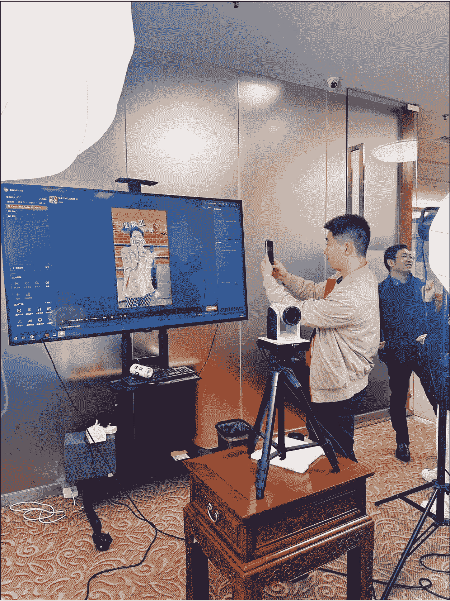

播了一个月，也都没什么效果，亏本卖都卖不出去。

每天下播回到家就在抖音看知识博主的直播入睡。

到处去线下学习，学习付费投流，学习调教主播，学习抖音小店，学习短视频。
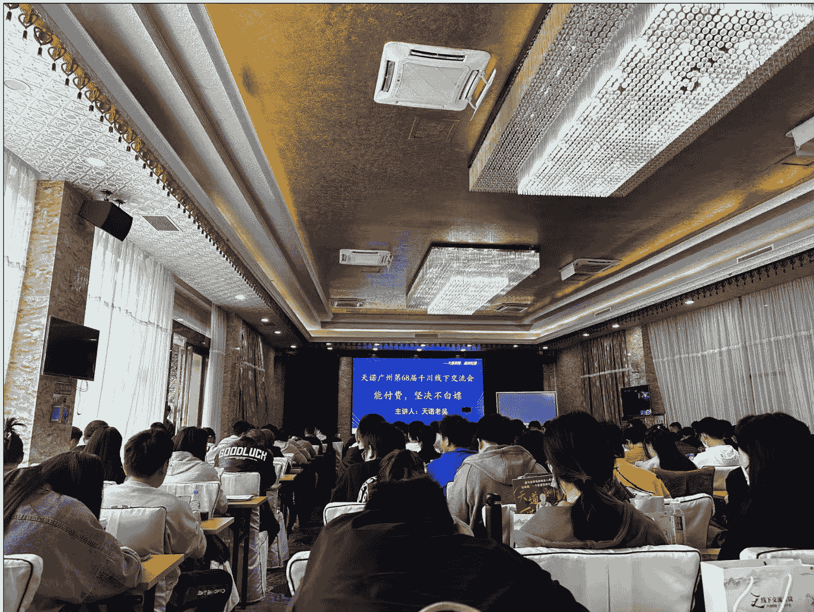
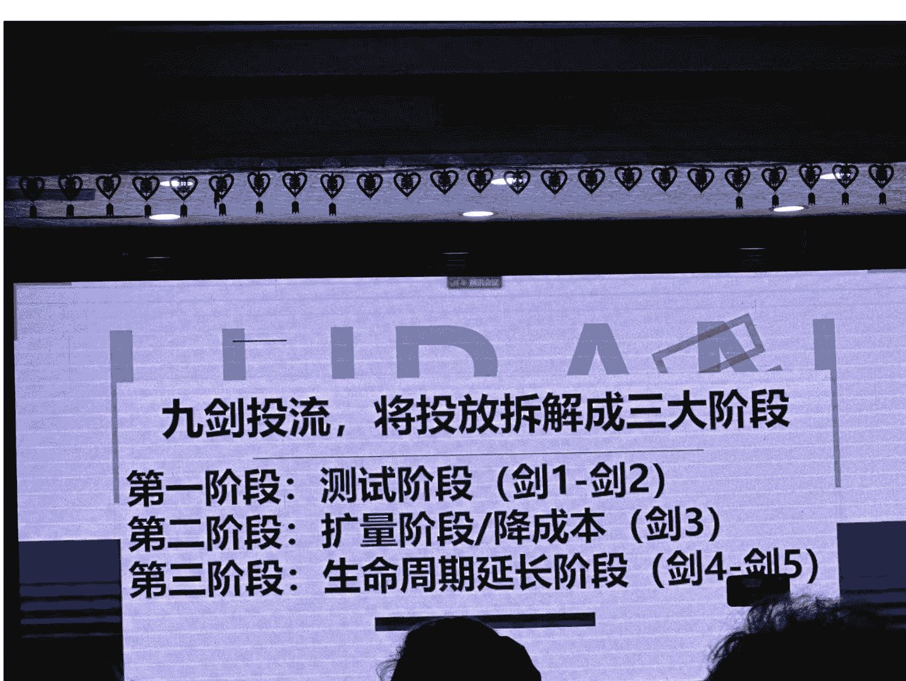
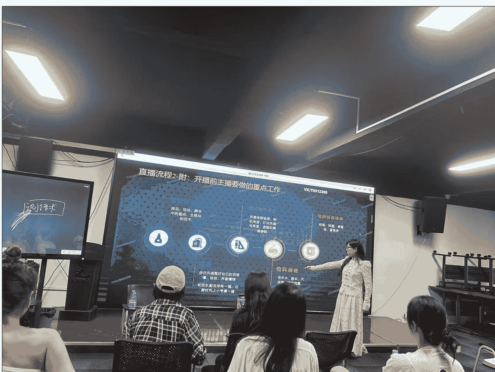
懒人微信:lazyhelper

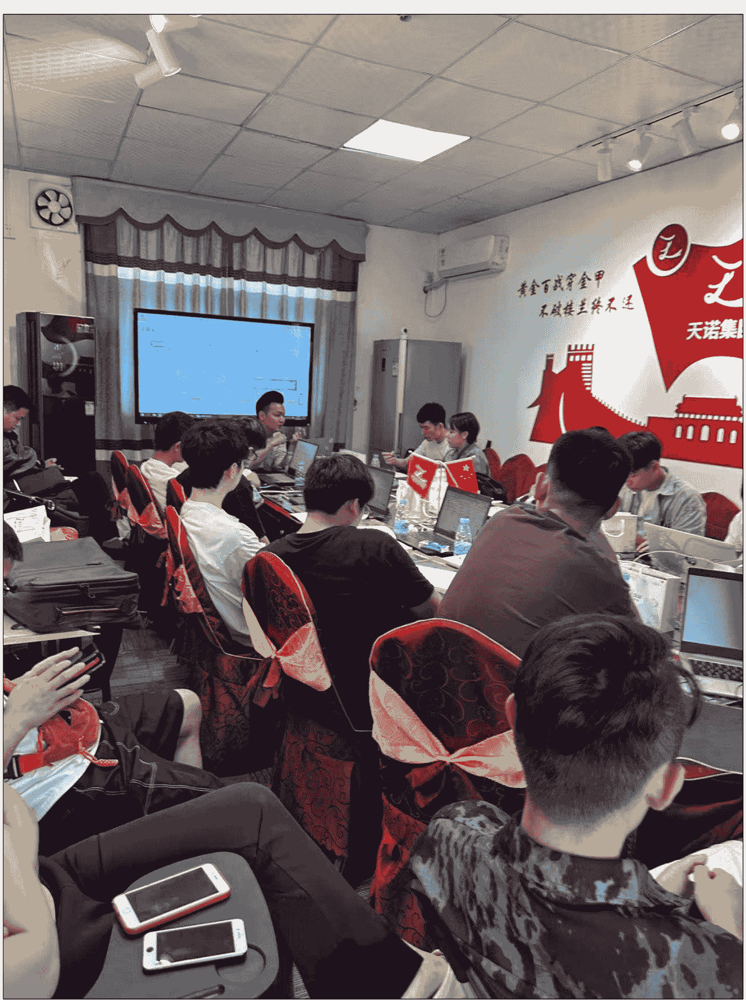
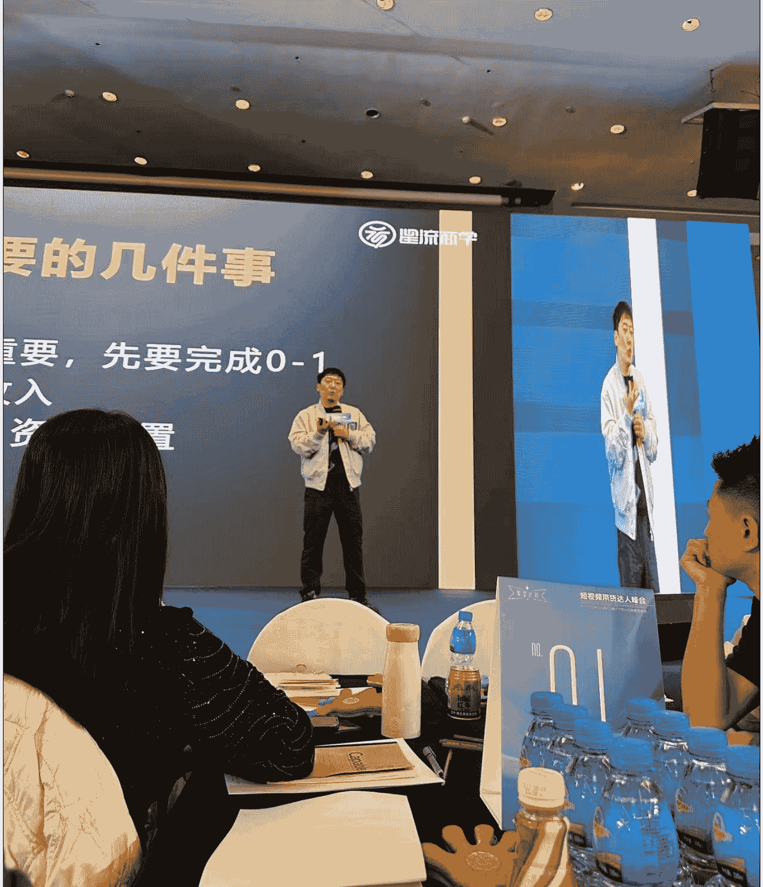

## 核心要点：重要，先完成0-1

一路下来大大小小的知识付费也花了十几万，就这样，我三个月亏掉了 50w，并且没有任何产出，大哥看到这样的情况，也开始喊停，但是我始终相信，只要不下牌桌，就永远有机会。

于是我就退掉了场地，关闭了公司，自己在家继续钻研，期间做过达人短视频带货，抖音小店商品卡，什么都学，补充自己的短板。

小白在没有任何行业经验的时候，尽量做一些几乎不需要试错成本或者成本非常低的项目，以至于你失败了还有重来的机会，创业的成功率不足 3%，很多人创业上来就投个几十万，一但失败了，将背负债务，你的后半生都将在还债的路上。

转折点在 8 月，抖音重点扶持货架电商，并且商品卡免佣，这个时候，我就知道机会来了，跟着平台政策走，肯定没错，于是便迅速入局了家具赛道，当同行都还在卷直播的时候，我在干商品卡，同行都不知道商品卡可以投放的时候，我通投拉满，当时真的没有任何技巧，直接新建计划，开始投放，随随便便都有十几的投产。

| 日期 | 明细笔数⑦ | 总收入① |
|---|---|---|
| 2024-02 | 993 | ¥1,863,441.92 |
| 2024-01 | 1843 | ¥1,579,082.29 |
| 2023-12 | 1695 | ¥1,913,509.80 |
| 2023-11 | 1475 | ¥1,732,183.56 |
| 2023-10 | 1799 | ¥1,297,749.88 |
| 2023-09 | 1310 | ¥702,556.22 |
| 2023-08 | 726 | ¥329,737.77 |

于是我的团队马上整合了，去到了江西产业带，并结识了现在的合作伙伴，他负责后端供应链发货售后客服，我负责前端运营流量，从9月份开始实现了业绩翻倍增长。

在这个项目稳定发展期间，我一直在测试别的类目，做过男装，女装，百货等，因为我知道，平台的红利期不会太久，修屋顶最好的时间是阳光明媚的时候，而不是下雨才去修屋顶。

一直持续到今年五月，抖音商品卡的一个改动：将不再支持标准计划投放，所有账户将只能投放全域计划，一轮测试下来发现，耐消品这个类目，掉量及其严重，投产直接因为这个政策影响做不起来了，出现很多空耗，秒拍秒退的情况，以前还能依靠一些投放技术，把投产稳住，现在的广告计划只有一个按钮，打开关闭，没有任何操作的空间，于是我意识到了，时代已经结束，依托于平台政策红利的生意，一旦政策出现变动，跟行业黑天鹅事件没什么区别。

但在这期间，我一直有做的女装百货等快消品类目，因这个改动，有了巨大的红利，并且开发了几套打法，效果还不错，后面有时间我会详细讲讲。

## 对于当下流量最大的平台：抖音的一些思考

抖音直到今天，依旧是一个巨额变现的平台，一些细分领域，依旧有很大红利，做一些细分领域的产品，远胜于大众型产品。

在抖音光做流量是没有用的，项目占99%，先有变现模型才是关键，先找项目，再找流量。懒人微信：lazyhelper

## 抖音+私域+社群到今天依旧是一个变现王炸组合

一个能成的项目不是想出来的，是调研出来的，投多少钱，赚多少钱，有无成功案例，是否具备可复制性，执行难度等都需要综合分析。

所有项目都要有一个核心的判断：现在是风口吗？现在是起飞的时间点吗？太早入场成为炮灰，太晚入场十倍努力一倍结果。

一定要借助平台红利，只有平台在爆发期，才容易拿到大结果。

## 抖音商品卡项目分析

- **抖音商品卡是什么**：抖音商品卡是抖音推出的货架场，简单可以理解为跟淘宝，pdd一样，不需要直播，不需要拍短视频，操作简单，把产品链接挂上去即可出单。
- **为什么做抖音商品卡**：抖音商品卡运营成本低，一张营业执照一个人一台电脑500元保证金即可开店，不像直播一样，你要有主播，运营，中控等。
- **流量大，增速快**：商品卡增速快空间大：2024年双11期间，商品卡GMV同步增长64%。

### 2025 年平台补贴再升级，商品卡免佣

25 年平台补贴再升级：全年免佣补贴金额135 亿，面向全量商家开放，并且每月仅需完成 2-3 项，即可获得免佣资格。

### 渠道多，选择多，新手友好

抖音商城可以分为：兴趣场+货架场。

有做兴趣场能力的可以做直播带货或者短视频带货，没有经验的可以选择做货架场的商品卡，上架即可出单，单量累计出来了就会有达人给你带货，实现躺赚。

### 抖音商品卡的流量渠道主要是：猜你喜欢+搜索

| 流量来源 | 商品卡曝光人数 | 商品卡点击人数 | 商品卡点击率 | 成交人数 | 点击-成交转化率 | 用户支付金额 | 操作 |
|---|---|---|---|---|---|---|---|
| 搜索 | 284.71万 | 24.28万 | 9.17% | 6,681 | 2.75% | ¥1,026,257.47 | 渠道详情 |
| 垂搜 | 245.42万 | 22.8万 | 9.29% | 6,591 | 2.89% | ¥1,012,176.00 | 渠道详情 |
| 综搜 | 22.7万 | 1.48万 | 6.51% | 92 | 0.62% | ¥14,081.47 | 渠道详情 |
| 猜你喜欢 | 124.79万 | 12.05万 | 9.66% | 2,891 | 2.4% | ¥480,928.90 | 渠道详情 |
| 合作达人 | 31.44万 | 1.08万 | 3.43% | 6 | 0.06% | ¥809.13 | 渠道详情 |
| 商城其他 | 20.95万 | 238 | 0.11% | 33 | 13.87% | ¥4,933.60 | 渠道详情 |
| 购后页面 | 14.75万 | 1.01万 | 6.83% | 548 | 5.44% | ¥91,182.52 | 渠道详情 |
| 购物车 | 2.5万 | 6,731 | 26.93% | 609 | 9.05% | ¥86,514.75 | 渠道详情 |
| 其他 | 5,721 | 315 | 5.51% | 3 | 0.95% | ¥313.33 | 渠道详情 |
| 电商频道 | 4,160 | 200 | 4.81% | 3 | 1.5% | ¥396.70 | 渠道详情 |
| 消息 | 2,833 | 240 | 8.47% | 267 | 111.25% | ¥43,765.09 | 渠道详情 |
| 顶tab-推荐 | 2,725 | 505 | 18.53% | 0 | 0% | ¥0.00 | 渠道详情 |
| 商城工具区 | 2,684 | 179 | 6.67% | 1 | 0.56% | ¥180.27 | 渠道详情 |
| 足迹 | 2,071 | 231 | 11.15% | 29 | 12.55% | ¥4,429.62 | 渠道详情 |

综上几个点，抖音商品卡是现阶段做抖音电商必做的方向，流量大，增速快，扶持大，操作简单，开店成本低，可做店群，可 sop 流程化运作。

## 保姆级开店流程，店铺基础搭建

- **入驻店铺**：店铺主体可分为三种：个人店，个体店，企业店，其中企业店可开设：企业店，专卖店，专营店，旗舰店。
  - **个人店**：身份证，银行卡
  - **个体店**：个体工商户营业执照、法人身份证正反面、法人银行卡、法人微信商户号
  - **企业店**：个人独资或者合资的公司营业执照、法人身份证正反面、对公账户、法人微信商户号
  - **专卖店**：1个或多个普通授权品牌，多个授权品牌需属于同一商标所有人
  - **专营店**：授权2个及以上自有品牌或授权品牌
  - **旗舰店**：可经营1个或多个一级独占授权品牌，多个授权品牌需属于同一商标所有人
  - **官方旗舰店**：可经营1个或多个一级独占授权品牌，多个授权品牌需属于同一商标所有人
- **缴纳保证金**：一般的常规类目都会有0元入驻，新手上来可以先不缴纳，达到100单后会要求补交保证金，现在除了特殊类目，常规类目基础保证金为：500元。
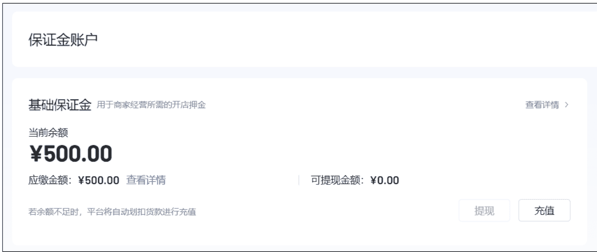
- **开通聚合账户**：绑定法人收款银行卡。微信支付开通，开通之后还需要二次签约，不开通微信支付会导致客户不能使用微信支付，影响转化率。企业店需要绑定法人对公账户/企业网商银行。
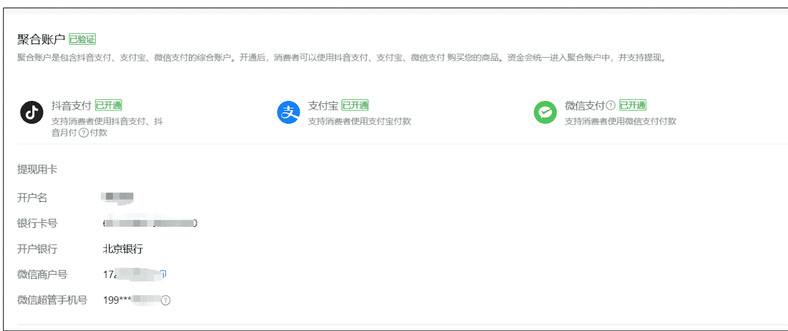
- **开通子账号**：注册一个网易邮箱，用邮箱注册子账号，开通全部权限，作用：便于运营管理，有概率规避关联。
- **新建运费模板**：设置利润款常规偏远地区限售地区：香港 澳门 台湾 内蒙古 新疆 西藏 甘肃 青海 宁夏 海南。福利款羊毛党地区：两河两山一黑 河南河北 山东山西 黑龙江。
- **设置地址库**：店铺默认发货和退货地址设置：店铺没有设置地址库会影响厂家打单发货。设置默认退货地址时，如果我们的上家不确定或者多个，可以卡一个座机售后地址，来卡平台的闪电退。
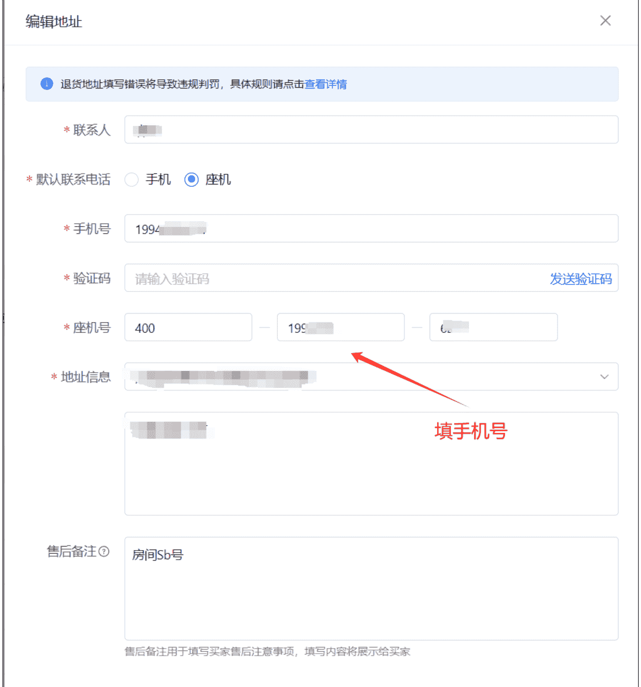

然后上架产品即可，各类目具体运营方法，运营思路，后续我会单独写一篇来讲讲。

## 开店第一个月，我是如何做到 184w 营业额的

- **我做的是女装无货源铺货**：为什么做的是这个：因为女装是抖音乃至全平台，流量最大的类目，当然竞争也非常大。同时女装属于非标品，不用担心价格高了就卖不出去，杜绝了比价。我做的是无货源铺货，通过软件选 3-5w 个链接，只要我链接足够多，就能出单，不需要任何运营技巧。
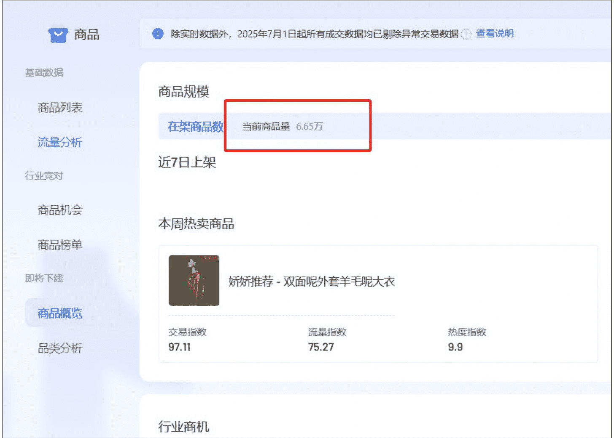
- **先出体验分**：开店完成店铺基础搭建后先出体验分。先把体验分拉到 90 分以上，因为新店铺你不出体验分是没有流量的。
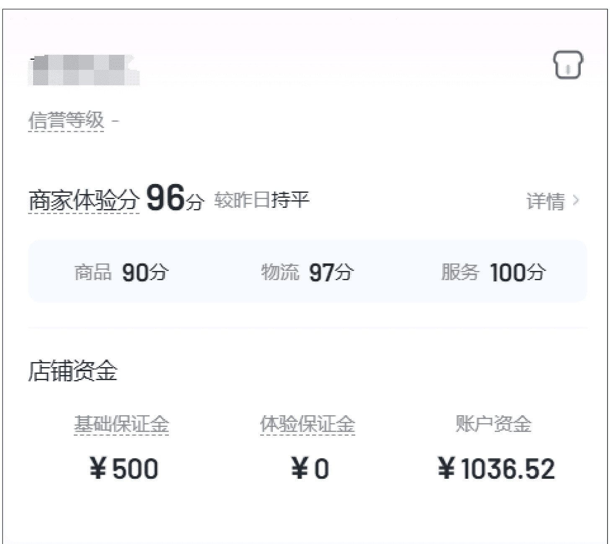
- **利用低价商品快速累计订单做出体验分**：一般我会选择 10 元以内的福利商品累计订单，因为这个客单的商品比较好出单，只要出够 30 单了你就有 70 分的体验分。这些年自己也累计下了一个货盘，有几百个低价商品，上架就能出单，有需要的兄弟我可以分享出来。可以看到我的流量曲线，这里我是为了快速拉爆店铺，没有选择慢慢跑福利品，而是直接一天拉了 500 单，直接出了体验分。
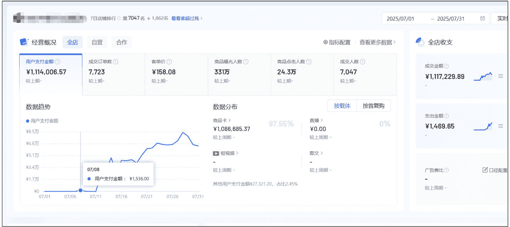
懒人微信：lazyhelper
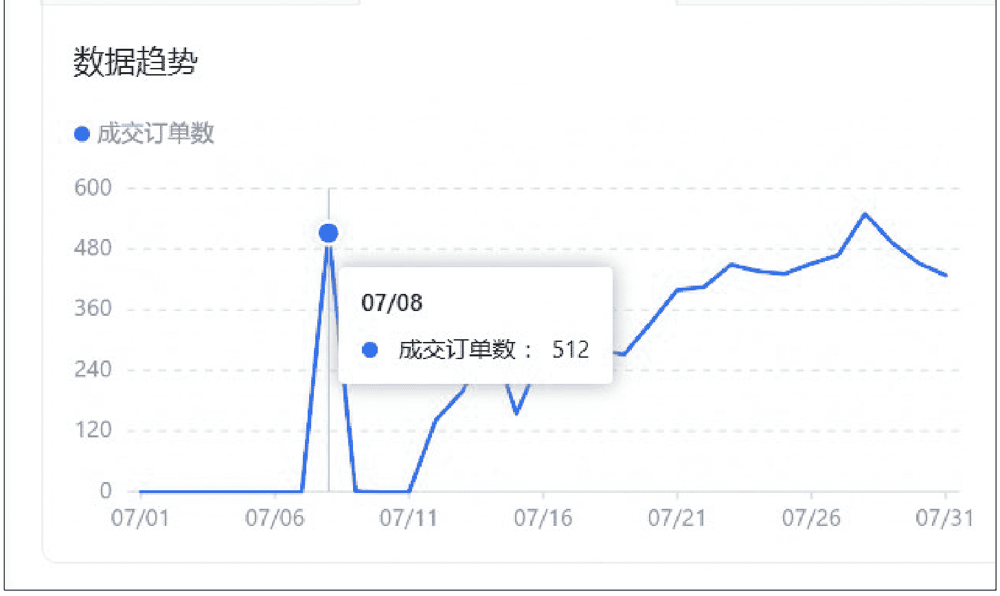
- **上架利润款**：大概在两天后我的订单陆续出了评价后，我就开始准备上架我提前准备好的利润款。
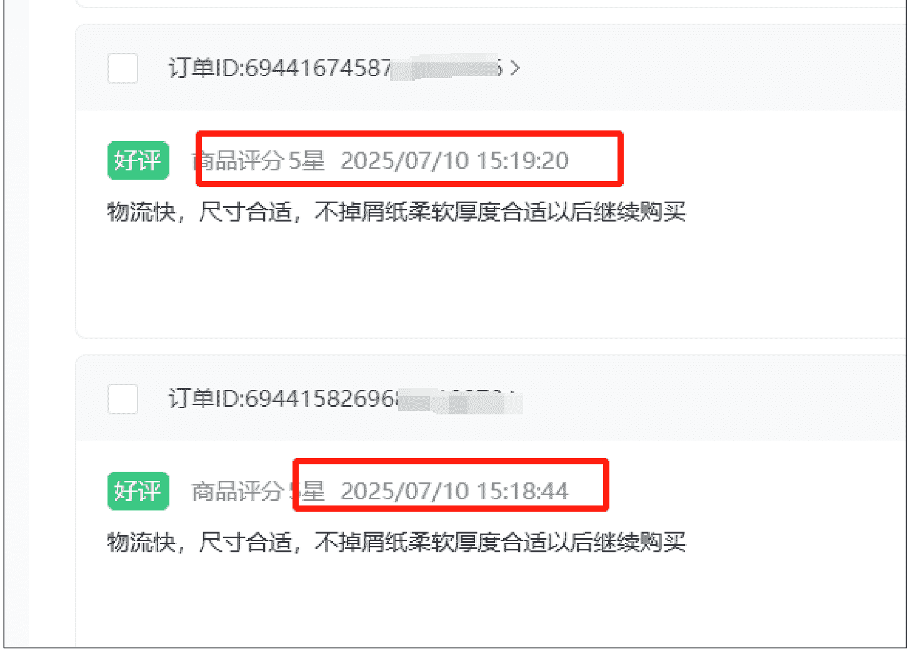
我是提前把链接上架到仓库，统一在同一天一键上架，设置好全店优惠卷坐等出单，毛利控制在 50%左右。
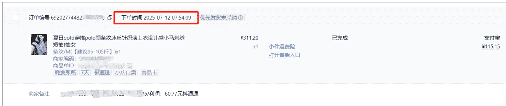
- **出单后处理**：公众号懒人搜索，懒人专属群分享。

| 质量分 | 上架时间升序 | 操作 |
|---|---|---|
| 优秀85 | 2025/07/12 00:14:29 • 售卖中 | 编辑 下架 新建渠道品 发布相似品 更多 |
| 优秀89 | 2025/07/12 00:14:30 • 售卖中 | 编辑 下架 新建渠道品 发布相似品 更多 |
| 优秀92 | 2025/07/12 00:15:14 • 售卖中 | 编辑 下架 新建渠道品 发布相似品 更多 |
| 优秀89 | 2025/07/12 00:15:50 • 售卖中 | 编辑 下架 新建渠道品 发布相似品 更多 |

出单后在淘宝以图搜款，找到合适的商家，进行拍单。可以看到当天早上开始出单，利润在 50% 左右。
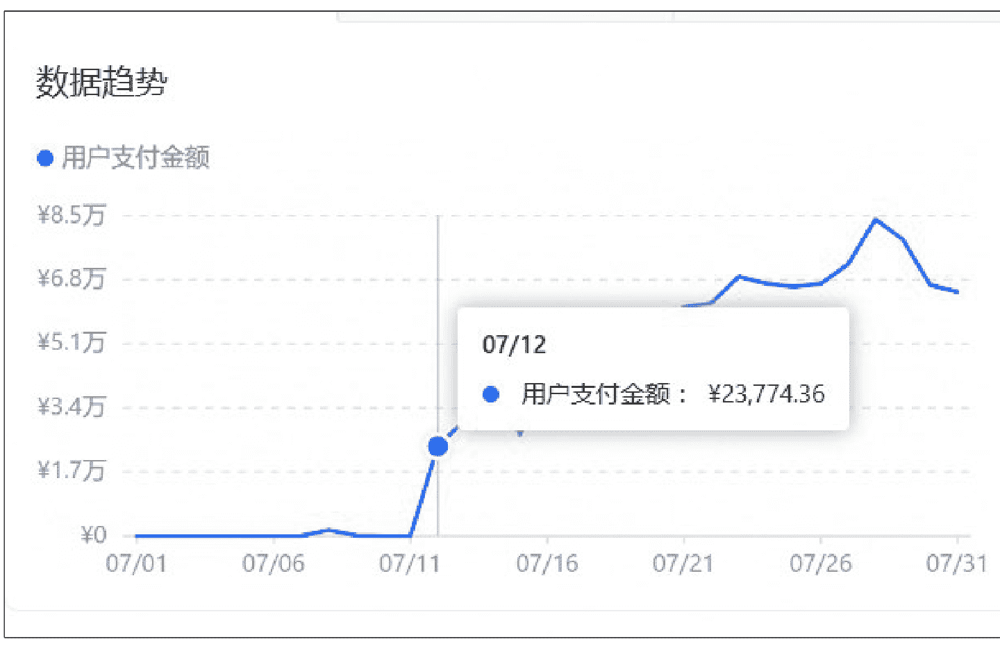
当天就卖了 2w 多，最高峰的时候一天卖了 8.4w。
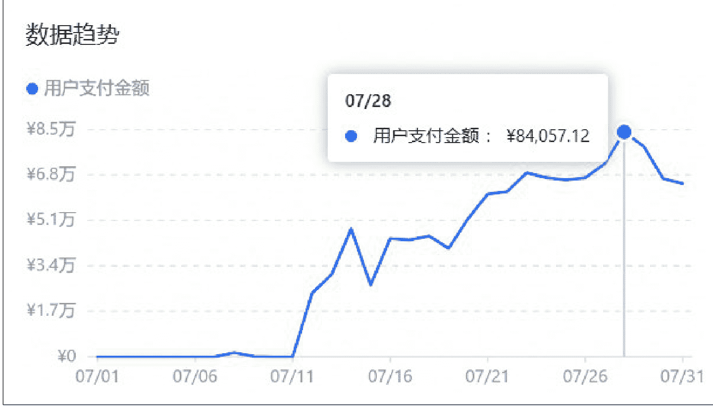
懒人微信：lazyhelper

以上就是我做这个店铺的总体思路，非常简单无脑，只要采集好链接直接上架就能出单，并且同一批链接可以给多个店铺使用，所有操作都是运营助理详细按照 sop 流程进行。

关于一些项目细节上的问题，可以在评论区留言哈。

## 项目总结

很多人都说，女装退货率这么高，狗都不做，确实，狗都不做我做。

接下来我将以财务角度来拆解我这个店铺的一个月的利润：

运营这个店铺所需要的人力：运营助理 2 名 + 售后客服 1 名（这样的人员配置可以同时做 3 个店）。
- 运营助理：负责上架链接，维护店铺，接待客服等，拍单等工作
- 售后客服：负责退货管理，接待客服，给客户打电话等工作

懒人微信：lazyhelper

运营助理月薪：3500*2
售后客服月薪：5000（这里我会选择比较有经验的，这样可以避免更多的售后损耗）多做一个店会额外给1000提成。
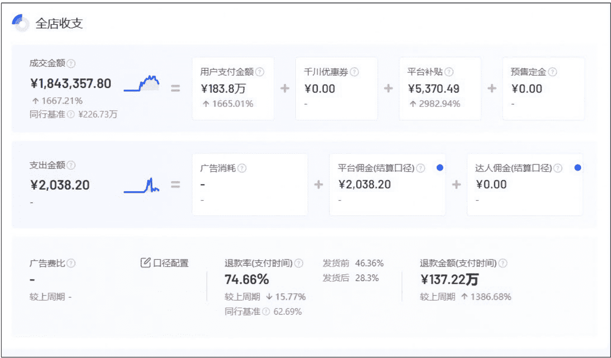

以上是我这个店铺一个月的营业额：
总体成交GMV：184w 退货率74%。

实际我按80%的退货率来算，能实际签收36w左右。
我的平均毛利在50%，36/2=18w。
扣除我的人工开支：3500*2+5000=1.2w。
场地开支：本身我就有场地，这个开支可以忽略不计。
运费险成本平均一单：4元，保障了6280单，成本共计：4*6280=25120。
平均实发一单损耗：我按5元来算：5*6280=31400。
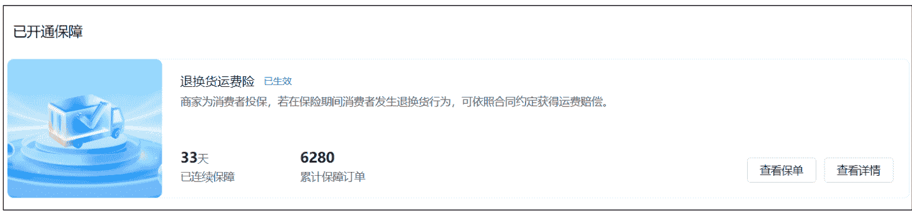
营收：18-1.2-2.5-3.14=11.16w。

最终营收：扣除一些隐性成本大概这个店铺一个月有 10w 左右的利润。

## 项目执行难度分析：

- 可复制性极强，操作难度低，新招的小白运营助理根据 sop 流程即可完成所有工作。
- 一组团队可独立运营 3 个店铺。

最后希望这篇实战分享对大家有所帮助，也欢迎大家在评论区跟我交流!

## 最后，安利小懒的付费群：

懒人专属群
懒人微信：lazyhelper

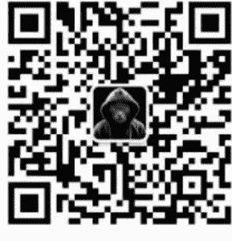

微信:lazyhelper

📖 懒人专属群持续更新中，已持续运营6年，整理超3000份各类精选付费文章&年费社群干货，全部开放下载。

本资料为付费群内部分享，仅供真实有需要的朋友查阅 🙏

懒人专属群更新记录：

https://lazy2025.top/blog/record2

懒人专属群更新记录（需梯子，备用）：

https://lazybook.fun/blog/record2