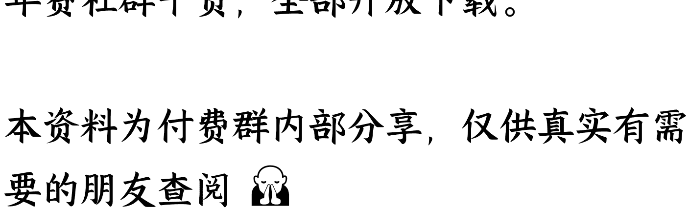

# 我知道你们这几天最想让我聊什么，我也知道什么不能聊

231029 记忆承载付费
公众号懒人搜索，懒人专属群独享
懒人微信：lazyhelper

我知道你们这几天最想让我聊什么，我也知道什么不能聊，所以很犹豫啊。
有些话怎么讲呢？
其实这个世界是分成两个阶层的，而这两个完全不同的世界之间只隔了一层膜，无非要不要捅破它……
全文将近 2 万字了，委实有些长，敢发出来，属实有些忐忑，要打开看的，请自己先保存截图，再细读。
这个话题从什么地方开头呢？
我们从一篇读者来信，引出今天的主题。
咱们有个女读者，金融机构从事交易的，写了很长的一封信，问了很多她在职场当中面对的困惑。涉及隐私，我就不转述了，直接来写我的看法。因为本来就是拿她的问题，当引子，引出我们的主题。

我给这位读者的答案非常简单，咱们来看一句经典的台词，小孩子才做选择题，成年人当然是全都要。

你觉得这句话，放在某些场景下，靠谱么？放在这个问题下，我认为就是不靠谱的。

交易员是一个职业，美女交易员，是一个标签，这两者你只能留下一个。如果你全都要，那我就认为你还是做了选择题，你实际上还是选了美女交易员。我以前写过一句话，钱少了才讲道理，钱多了，没啥道理可讲。

两个人，一个男人和一个女人，通常我们认为女士优先，我们认为男性应该有绅士风度，应该让着女性。

这基于什么？

基于很小的利益，比如让座位。

男性仅仅是让渡了一个微不足道的利益，一个座位，就换取得了两个好名声。

- 我是强者。
- 我很绅士。

这是让么？不，这是占便宜。

男性让座位给女性，本质上是男性企图通过这种事情来标榜自己，来占便宜。

所以男性十分热衷。

男性不是热衷绅士，他们只是热衷占便宜。

男人娶媳妇的时候，对于婚前全款买的房子，要不要加对方的名字，怎么不就积极了？因为利益大了呀，因为没有便宜好占，还要冒着损失的风险。

一线城市的房产动辄过千万，对方假如年入 30 万，什么时候才能赚到对等的 1000 万？

这个男性也会嘀咕，她会不会在赚到 1000 万的共同财产之前，就和自己离婚，就分走价值 500 万的一半房产，那自己岂不是亏了？

你看到了，面对大利益的时候，这个男人马上就会犹豫，不会像让座位那么轻松地显示自己所谓的绅士风度。因为没有便宜好占，还要冒着被别人洗房，被别人占便宜的风险。把这个场景，挪到工作中，是一样的。

男人肯主动让出来的东西，都是他不想要的，或者说，他能够通过这种出让，自己占到便宜。请记住我这句话，这就是真相。

我们要知道，一个团队中如果只有男性，那个交流的过程，往往是非常粗暴的。之前我们举过例子，昔日有三个高管成天被某个董事骂得狗血喷头，为什么？因为全是男的。

现场如果能有一个女的，哪怕只是个旁观者，氛围都会改善不少。可还是那个粗鄙不堪的董事，他也有绅士的一面。

有一次我在大通间和人一边聊天一边抽烟，我年轻时也是抽烟的，后来才戒了。他正好在旁边，拉着我上他屋里吸。

我还以为他有什么好烟要分享，搞这么神秘兮兮，去了才知道，他说，外面大通间里有怀孕的女员工，跟那儿抽烟不合适，还是关起门来抽的好。

一瞬间我对他刮目相看，就像看见张飞绣花，真难得。

当我们发现女性在职场上起着特殊作用的时候，就一定有人，尤其是做老板的，会发挥女性的这种改变氛围的作用。

如果全都是男的，客户也是男的，我方的成员也是男的，赚钱的时候，固然是狂欢，可赔钱的时候呢？

一群男的在一起，面对压力，损失，负面情绪，你觉得会怎样？

就像我前面说的那个董事，他和那几个高管平日里交流的方式就是只有脏话，但如果现场有一个女性，他就会收敛。

因为法律不允许。

一个男人跟另一个男人满口脏话，没有人会处理，但一个男人要是对一个女人满口脏话，就有可能被认定为性骚扰。

这件事，大家都知道。

这就是缓冲，我们发现女同事在职场中，可以起到非常强的缓冲作用，无论是内部，还是对外。于是某些事情就开始分岗打配合了。

比如一个岗位，主要的责任并不是对某件事真正负责，而是去和客户交流，那你觉得谁来做好？其实让女同事来做，更好。

因为她要面对的攻讦更少，至少明面上的，更少。

我们甚至可以不用她本人来负责内容，具体要交流什么，有别的团队替她做好，她的责任，仅仅是沟通。

因为她要面对的那个客户环境，比一个男同事要面对的客户环境，文雅多了。于是就会为此构建一种很流行的团队模式，俗称美女总经理。

这个项目，这个事业部，名义上的，对外的总经理，是女的，而且是美女，谈吐也很好，学历也很好，沟通能力一流，相貌还很出众，至少让人一看，就有亲和力，而不是咄咄逼人。

与此同时，她下面有一整套班子，都是强人，这个团队整体上是六边形战士，以确保能力无忧。你把这样组的团队拿出去与客户对接的时候，一方面客户相信你们的能力，美女背后的整体实力很强；另一方面，客户也不得不绅士，毕竟他直面的是个美女，不是一群糙老爷们。

他肚子里有些粗鲁的意见，也不方便直说。

这个模式很流行的，并不是只有今天，只有金融行业，其实很多年前，其他行业也是一样的，计算机行业也是一样的。

我曾经讲述过一个十多年前的例子，一个昔日的同事，美女总经理。当然我那次讲的不是这个内容，是婚恋。

她和我同龄，对女性而言，当时已是大龄，高管集体出游，在某个旅游景点，团建结束后，我作为同事，作为老朋友，也作为男性，跟她讲了一个很朴素的道理。

你要二选一。

总经理和美女总经理，你到底要哪个？你不能都要，那是周星驰台词搞笑的，现实当中，你就是得选。有舍才有得。

如果你始终认为你自己是美女总经理，那么你就要赶紧嫁人了，不要再拖，拖不起的。因为美女总经理实际上做的事情就是我前面描述的那种。

她不是真实的总经理，她不是真实的幕后负责人，她实际上是替真实负责人站在前台，与客户沟通交流的缓冲。

很多年前，咱们那位曾经让人递话给赫鲁晓夫，建议说，作为一把手，你不要每件事都先表态。这是句委婉的劝告。

开会的时候，一把手都是最后一个发言的，俗称总结性发言。

如果你第一个发言，那就没有必要开会，直接发个会议通知，告诉大家执行什么就行了。你是一把手，你第一个发言，你的倾向被大家看到了，那接下来当然是一面倒的附和。

所以一把手都是像孙权那样最后一个发言，他让大家先各自陈述，让张昭去讲他的投降论，让周瑜去讲他的开战论，最后自己来做结案陈词，拔剑砍掉桌角，表示，讨论结束，决定已经形成，后面大家一条心，执行吧。

像赫鲁晓夫这种，每次都第一个发言，而且总是拿着鞋子拍桌子，那就没有转圜余地了。二把手说往东，一把手还可以纠偏一下，后面到底东南西北具体哪里，都还可以商量。一把手上来就说往东，以后还怎么纠偏？

所以有个美女总经理，缓冲效果很好的，客户跟美女总经理的前期沟通，如果有大的分歧。以后都可以有真正的幕后老板出来纠正，不会影响合作。

往后做了。因为往后，你就得做那个真的总经理，而不仅仅是个缓冲。

可如果你要做那个真的总经理，从此可就没人把你当女人看了，明白我这句话么？

你发挥的作用变了，现在考核的，是你到底能不能打，而不是说你才能让现场变得文雅。华尔街很多交易员都热衷于健身，真去比铁人五项，他们都是吊打健身房教练的存在。

他们当中有没有人把自己称作，或者被称作猛男交易员呢？你想想看？为啥不强调这个？因为不考这个呀。

基金经理是一样的，你到底是要做个基金经理，是完全以你带队伍的能力，以你的投资回报率来考核的那种没人把你当女人看的基金经理。

还是要做一个主要起到与客户沟通当中，缓冲作用的美女基金经理？

这实际上是两种不同的职业，一个人在很早的时候就要弄清楚，自己的定位是什么。因为这两种差事对人的要求，是不一样的。

前者是诸葛亮，那是假节的，操生杀大权的权臣，独当一面的。后者类似于糜竺，主要从事的是亲信，使者的工作。

糜竺的名义官位还在诸葛亮之上，那只是因为大家都知道你是刘备的大舅子，你出使，人家对你客客气气实际上是对刘备客客气气。

人家有话让你帮着传一下，万一你把事情搞砸了，刘备还可以现身，作为一把手重新定位，纠偏。问题在于，现实中，你和糜竺不一样，你做不了。

老板安排这种岗位一方面是希望强烈对抗的商业环境，变得文雅一些，注意礼节一些。

另一方面，也是觉得女的，比男的，好控制。

俗称我给诸葛亮的权力那就真的给出去了，但是我给糜竺的权力，等于没给，还是我自己的。你品，你仔细品。

再者，很多老板也不喜欢走到台前，俗称我有办法控制这家公司就行了，我为啥非得自己当董事长，自己沾染因果呢？

那么这个代理人，也需要糜竺使者型的，听话，容易控制，客户也待见，不容易造反。所以要想清楚，交易的办法，就是被蛇吃掉，吃掉的同时还保留了自己的记忆，从而达到人兽共生，自此之后，那条蛇活了多久，就等于你活了多久。

我引用这个小说里的脑洞，就是要用蛇，来比喻很多东西。

我们来想想看，一个人，比如是个码农，你想要延长自己的职业寿命，多干那么五六年，最好的办法是什么？
很简单，做部门经理。

一个部门的工作范畴肯定比一个人的工作范畴要大。

你，是一个网络驱动工程师，公司的网络模块开发期间，你是主力，公司的网络模块成熟之后，你就只是维护。

如果成熟多年，不需要进一步开发，那你就得转岗，否则你的价值是很低的，花那么多钱养一个闲人，是不值得的。

你当然可以跳槽，可是你去任何一家新公司，都意味着除了技术之外的能力，清零。

你在A 公司做研发做了 3 年，A 公司上上下下你都熟，不仅流程熟，人头也熟，不仅项目熟，各方面的预判也熟。

也就是说，你发挥的不仅仅是一个技术力量，同时也有那种对环境谙熟之后的调动资源的能力和判断能力。

这一点，去新公司，是没法保留的，去了你就是新人。

作为一个新人，如果你仍然在做网络驱动，你能和别人比什么呢？比加班时间长？还是比技术好？

比加班时间长，随着年龄增长肯定是没有优势的，比技术好，这件事是有前提的。前提就是你们行业关于这一块，真的需要技术好。

市场愿意为了寿司之神 60 年的功力买单，有人买单才叫寿司之神，如果市场根本不愿意为此买单，那就卖不出去。

这就是为什么理论上讲码农可以无限跳槽，这家做不下去，还可以去下家，实际上，真实在一线编程的，很少有人能做过 40。

但是部门经理可以多做几年，做到 45。

而且你去观察，这帮人往往是在某一家公司做到这么久的，他可能是 35 的 时候在这家公司被提拔为经理，然后熬到 45。

靠什么？

就是我前面说的那句话，不是你吃蛇，而是蛇吃你。不是你吞了部门，而是部门，把你给吃了。

我吃部门是什么意思？

我还是我，就像我吃蛇，我还是我，只是新添了点东西，比如那条蛇，比如那个部门。部门把你吃掉的，是说你已经不是你了，你消失了，你化身成了部门本身。

我们去看公司考核，码农都会强调说，这个网络驱动，是我写的。部门经理会怎么说？

他会说，无论网络驱动，还是 USB 驱动，不管什么，都是他们驱动部门写的。考核对象变了，你们部门做得怎么样，才是对这个经理的考核。

也就是说，部门的 KPI，就是这个部门经理的 KPI。

部门有功，经理有功，部门有错，无论谁犯的错，在经理的上司看来，都是这个经理的问题。这个经理的个人属性在消失。

你不可能去跟上司辩驳，说虽然我的手下编程技术不行，但我只是个写代码的高手。这种话没价值。

历史上李广是个大侠，回回都能在匈奴人手里死里逃生，堪称传奇。为什么李广难封呢？

因为汉武帝不管你个人武功如何，他要知道的是你带的这支队伍，赢没赢？李广打仗很少赢的，败多胜少，几乎都是全军覆没，回头自己传奇回归。那这个业绩，在汉武帝看来，就是零嘛。

我们把这个话题延申一下，如果你想要做得比那个部门经理更久，你觉得职业寿命延长到 45 还是不太够，怎么做？

那你就只能做老板，俗称公司活多久，你就能活多久。

作为老板，本质上不是他拥有了公司，而是公司拥有了他。不是他把公司吃了，而是公司把他给吃了。

公司把他吃了，从此之后，上班时间就是下班时间，生活时间就是工作时间。公司倒了，就意味着老板的生命终结。

因为公司倒了，老板也就不再是老板了呀？老板这个身份，本来就是随公司始终，公司消失，老板也消失，他也只能像员工一样，去应聘，去打工。

那老板不就消失了么？

你还想再久一些，怎么做？把自己变成资本。

资本家不是一种人，不是哪个人拥有了资本，他就能变成资本家，没这种人。没有人能够拥有资本。

但是资本可以拥有资本家。

资本就是那条蛇，资本家就是那个选择被蛇吃掉的人，你被蛇吃掉了，你就和吃掉你的那条资本，共生了。

从此它就是你，你就是它，它的寿命，就成了你的职业寿命。

这就是为啥资本家可以做到很老很老，做到 90 岁都可以，只要你能活得到，就能做得到，就可以不退休。

你看着很多资本家早已不活跃在舞台上，但继续在幕后操盘。

所以看懂了这件事，很简单，你只需要问自己，我愿意被什么吃掉。

注意，首先是你愿意被什么吃掉。

其次是即便你愿意，那也得看看对方愿不愿意吃你。

资本择食的，并不是什么人都愿意吃的，你不能让它有足够增值速度，它不愿意吃你的。

在一个小资本，一条小蛇的择食范围内，如果你是那个最能够让它增值的人，它就会愿意吃掉你。但是进阶成大资本，大资本觉得你没这能力，看不上你，那它就不愿意吃你。

所以我讲你要什么？你有什么？你愿意放弃什么？

你要什么，是问，你到底要被什么吃掉，而不是问你要吃什么。

吃什么都不会让你长生的，都不会延长你在舞台上的时间，只有被吃，才能。你有什么，是问，你到底有什么值得被吃的地方？

蛇的选择很大的，每天面前无数个人排着队让它吃，都是非常优秀的人才。你自己好吃不好吃，这是你要提供的竞争力。

最后一项，你要放弃什么。这整个过程都是在放弃。

一个码农明天要做经理了，这是做加法么？不，这是做减法。

做经理就意味着没有时间去编程了；
做经理就意味着自己此前积累多年的经验，开始荒疏；做经理就意味着一旦做不好，经理没得做，别家公司码农也没得做，竹篮打水一场空。
做老板更是如此，公司倒闭了，他去找工作，之前老板时期的简历有人认么？做资本家的如果破产了，他还能干啥？上街去卖卤鸭饭？
这个过程全都是放弃，全都是做减法。

好，我们现在回到前面的引言部分，还记得那个美女交易员读者么？我问她，美女交易员和交易员，你到底要哪个，这是选择题么？

不，这是一道放弃题。

你只有放弃美女这两个字，你才能变成后者。

放弃不是让你变丑，不是说你把自己脸抹黑就叫放弃了，放弃的意思是，摆脱依赖，摆脱路径依赖，从脑子里，从自己的字典里，删掉那个词。

每一个部门经理都要放弃自己曾经是一个优秀的码农这件事。因为你不被蛇吃掉，你就没法像它那么长生。

被吃掉的过程，就是放弃。

当你变成蛇的时候，你通过蛇的眼睛凝视地上那具曾经的尸体，那是你么？不，那是你的前生。

就像你去问一个资本家，你以前是不是一个学霸，是不是一个好员工，是不是一个优秀的管理层，这些事儿有意义么？

这些在资本家看来，都是自己的前生，前生留下的尸体。

铁拐李曾经是个美男子，他的师父让他放弃了那副俊美书生的身体，附在一个瘸腿的乞丐身上。这就是告诉他，成仙的过程，是无我相、无人相、无众生相的。

那副跟了你几十年的俊美书生躯体，只是尸体。你要丢弃它，你要主动被蛇吃掉，从此之后，蛇眼就是你眼，蛇眼看到的，才是你看到的。

一个人从学霸员工到管理层，到老板，到资方，这个过程，已经被蛇吃掉很多次了。

巴菲特年轻的时候也曾经是学霸，是这那那这的，问题是，到后来，他是，且仅是，资本的化身。那些过往的云烟，都是他被蛇吃掉的过程中，留在历史当中的尸体。

所以你问佛，你是人么？佛说，我不是人。你问佛，你来过么？佛说，如来。

如来，你觉得来过没有？

他从王子成佛陀，不是王子吃掉了佛陀，而是佛陀吃掉了王子。

这就是为什么当已经成为佛陀的时候，从什么成为的佛陀，并不重要。

你是王子变佛陀还是蟑螂变佛陀，都是同一个佛陀。

本质上不是王子变成 A 佛陀，蟑螂变成 B 佛陀，而是佛陀上顿吃了王子，下顿吃了蟑螂。神话传说里非要编造出那么多佛陀名，甚至编出斗战胜佛，只是为了方便人们理解。当然这个比方听着有些粗俗，但事儿就那么个事儿。

好，到这里，我相信部门经理的那个比方，老板的那个比方，资本家的那个比方，甚至铁拐李修道成仙，王子变佛陀的比方，读者已经能够串联起来了。

那么还有一个问题，如果这个女读者，想要的不是这些，她想要的是嫁人，那本质是什么？我们举的这些个例子，不过是各种场景下的诸葛亮，那么糜竺，到底是什么？

如果你把嫁人当作自己的事业，那我相信你肯定不是来问我，如何嫁给一个基层码农的。

作为一个美女交易员，你比他赚的还多，你还比他好看，我相信只要你愿意抛绣球，门口的男人排大队。

所以这类问题只有一个倾向，就是你们是来问我，如何嫁给大佬的。答案很简单，还是被蛇吃掉。

我前面有句话很清晰，我开头就下了一个定义，我说，男人的本质，是什么？是占便宜。

俗称有便宜不占，什么什么蛋。

没有一个大佬是说，我有钱，所以我要给你钱，没有这种有钱人。人要是这种性格，他就不会变得有钱。

有钱人比没钱的人，更贪婪，正因为贪婪，所以才有可能有钱。

你要嫁给一个不和自己同数量级的大佬，本质上不是你想从他身上占什么便宜，而是要让他理解，他能从你身上占什么便宜。

注意，你是要嫁给他的，并不只是当女朋友。

答案只有一个，只有一种情况下，他有可能同意，那就是他能够吃掉你。明白这意思了么？

即便你能够嫁给他，你也不会真的拥有什么财富，当然你名义上可能拥有。

钱和钱的控制权，是两码事。

你觉得你名下的钱就是你的，那是因为你是工薪阶层，你老公也是，家里的财产就几套房。就像我前面说的，钱少了，道理起主要作用。

当你的老公是大佬的时候，名义上的钱，和钱真正的控制权，就分开了。好比汉献帝名义上还拥有汉帝国呢，你去看房本，每本都写着汉献帝的名字，有什么意义呢。但是你想要嫁给一个远超自己的大佬，本质上就是汉献帝主动投靠曹操。

曹操肯吃掉汉献帝是觉得自己能占便宜，而不是觉得自己会被占便宜。大佬如果愿意娶一个各方面都远不如自己的女人，那就是因为好控制呀。而女人愿意嫁，原因也很简单，自己的孩子会成为继承人呀。

当你理解不了，长生的本质是你被蛇吃掉，而不是你吃掉蛇的时候。大佬是不会选择你的。他不会娶你的。

因为大佬本身也是通过让自己被蛇吃掉，从而完成的长生。这是一个进阶的过程中，所谓穿越阶层，人人必经的秘密。这个秘密就是阶层之间的隔膜。

在这个隔膜之上，和之下，是完全不同的两种世界。

是我具备什么，我的属性是什么。我是一个帅哥，我是一个靓妹，我读书很好，我是帅哥码农，我是美女总经理，这些都是隔膜之下的世界里形成的价值观。

所以大家为什么好好读书？具体为什么？

为了找一份好工作，要么去电力系统，要么去大厂，是这个目的，对吧？那么接下来怎么办呢？

鸡娃。

只有娃具备了自己这么强的属性，才能够再次从选拔当中脱颖而出，继续找到好工作。于是当娃鸡不出的时候，就很焦虑。焦虑自己的后代要被打回原形了。

这层隔膜之上的世界，他们强调的是是什么？是生态位，我的生态位是什么？

什么叫生态位？

就是我被哪条蛇吃了。

我的属性是什么？我没有属性。

当然我也可以是帅哥，是学霸，是这又是那，但那都不是关键。关键是生态位，关键是被哪条蛇吃了。

所以你看到了？

当一个隔膜之下的人，想要嫁给，或者娶一个隔膜之上的人，首先要面对的冲突，还不是财富之间的不对等，而是价值观冲突。

隔膜之下的人，以为钱是你的，隔膜之上的人知道，我是钱的。

隔膜之下的人，以为你是一个更强大的人类，隔膜之上的人知道，没有人类可以那么强大，之所以让你看起来那么强大，是因为已经不是人了，被蛇吃了，自我已经消失了。

所以即便两个生物意义上的人相爱，第一个阻挡在那里的是什么？是你能不能融入。

你能不能从根子上，从底层逻辑上，跟隔膜之上的人是同样的思路呢？这个点很难的。

因为大部分人终其一生，没有人会告诉你今天这些内容，这道题在现实生活中，是闭卷的。我们今天把它变成开卷，即便开卷，依然是很难的。

我问大家一个问题，很简单的问题。

农民进城之后，是不是都想过，万一做不下去，找不到工作了，还可以回老家种地？想没想过？

那想过没有，世世代代都在城市里，没有地的人，他们怎么办呢？

一个人，别说做老板，哪怕让他做部门经理，最初的时候他都会担心，担心自己成天开会，编程技术荒疏了，以后部门解散，自己去哪儿找饭碗呢。

那想没想过，唐顿庄园里面伯爵那家人，他们世世代代都没有给别人打过工，他们从来没有具备过，也不知道培养孩子们打工的技能，那他们如果失业了，又该去哪儿找饭辙呢？

答案很简单，没有这个问题。

明白我的意思么？没有这个问题，根本不存在这个问题。

你之所以觉得存在，是因为你一出生就在隔膜之下，俗称你总得老家有块地，你才能那么想退路对吧？

你要是一生下来就没有呢，你会这么想退路么？你根本不会往这个方面想。

唐顿一家人根本不会想万一哪天要打工了怎么办，不会的，伯爵才是他们的生命。你注意，伯爵不是一个人，伯爵是一条蛇。

伯爵一家人，世世代代都被伯爵这条蛇吃掉，才有了那么长的寿命。伯爵是一条蛇，伯爵是一个生态位。

所以隔膜之上的人，他们世世代代只在做一件事，被蛇吃，守护蛇。蛇生即我生，蛇死即我死。为什么愿意被蛇吃呢？就是因为蛇比你长寿得多呀。

伯爵那家人如果不是被伯爵这条蛇吃了，可能一千年前就死于某次饥荒了。谁告诉你老家有块地很安全？那只是短期看很安全。

所以唐顿庄园里，伯爵家的孩子从一开始，他们接受的教育就是熟悉生态系统，守护生态位，升级生态位。

就这点事儿，小时候学习整个世界是怎样的生态系统构建的，长大后守护生态位，如果能力很强，运气很好，尝试能否升级，能否被更高阶的蛇吞了，比如变成侯爵一家人。

我这都只是在打比方，就像蛇借指了很多东西，伯爵，侯爵，也不过是个比方。

而一个隔膜之下的人，在试图进入隔膜之上的过程中，面对的第一个问题恰恰在于，对不对得上暗号。

人家上联出天王盖地虎，你到底是对宝塔镇河妖，还是小鸡炖蘑菇。对不上，那就不是自己人，隔膜之上的人，最担心的是什么？

是遇到一个麻瓜。

这个麻瓜不理解隔膜之上的世界里，大家都只是蛇的口粮，非但不理解，反而试图把蛇给炖了，所谓鹏之大，一锅炖不下，需要两个烧烤架，还想着带回老家。

找到矛盾点了么？

大佬之所以要你被他吃了才肯娶，要你绝对听话，并不是排斥你。

而是他觉得，此时的你，还是个麻瓜，你不理解隔膜之上的魔法世界到底有多怎么个运行规律。他要是真的彻底排斥，他就压根儿不会娶。

而如果你真的像武则天，像仁宗朝的太后刘娥那样懂了，你一样可以是大佬的。

武则天最初只是个在厕所里服侍的婢女，刘娥出身是娼，一个做到女皇，一个做到垂帘的太后。又验证了前面的话题，蛇，并不关心它吃的是什么，到底是吃了一个王子，还是吃了一个乞丐铁拐李。

那都是前生，那些过往没意义，也没区别，当你变成那条蛇，都一样滴。蛇才是你，过去的你已经消失了。

你觉得上面这段话，是在解读嫁给大佬么？不，我只是在打比方，试图让读者开悟。

今天全文都是在打比方，如果你只能看到比方本身，那我也没辙，俗称你的根器，就只有那么大，就只能容那么多。

如果你能看到比方背后的，那你就知道其实换成什么领域，都跳不出这点事儿。一个隔膜之下的孩子，从步入社会开始，各种摸爬滚打，真正阻隔他的是什么？是他不够勤奋还是他不够勇敢？

都不是。

阻隔他的是，他就不知道隔膜之上的世界，到底在玩什么。俗称知道做什么，比知道怎么做，重要多了。

这个战场其实有两层。

怎么去理解这件事呢？其实很简单。

人分两种，一种带着 VR 眼镜的，一种没戴的。

隔膜之下的人，生来都带着 VR 眼镜，你看到的，都是 VR 眼镜给你虚拟出来的战场。俗称你知道的，都是让你知道的，你以为的，都是让你以为的。

那不是真实战场，那是 VR 眼镜让你以为的战场。真实战场，要摘掉那副眼镜。

所以咱们假设你身处隔膜之上，那么你自己，到底该怎么相信那个戴着 VR 眼镜的人呢？你也没法信他的，明白不？

因为你们之间的信息是完全不对称的，你可能利用他，你可能忽悠他，但你不可能信任他。

因为隔膜之上的世界，你的对手是那些同样没有戴 VR 眼镜的，你怎么可能把自己的后背，交给一个还戴着 VR 眼镜的人呢？

你知道他能看到啥？你觉得他拿什么东西来守护你的背面？

这就是为什么在职场上，大多数人终其一生，都不会被提拔呀。想通了吗？

嫁大佬，被提拔，有一个前置条件是一模一样的。摘掉 VR 眼镜，这个前提，是一样的。

就像我们在引子里面讲的那两个名词儿，总经理和美女总经理，是两个概念。一个人可用，与可控，是两个概念。

一个不戴 VR 眼镜的人，想要利用一个戴着 VR 眼镜的人，很容易呀。后者等于是蒙着眼睛的，你很容易利用信息不对称，操控对方。但是你没法指望他。

因为别的不戴 VR 眼镜的人，同样很容易就能摆弄他。

所以美女总经理和总经理是不一样的岗位，美女总经理只是个被利用，被操控的岗位，总经理需要摘掉 VR 眼镜，需要站到董事长背后，俗称背靠背，防守自己的背面。

摘不摘呢？

摘的过程是一个放弃的过程，是一个被蛇吃的过程，这个过程当然很痛苦。怎么克服这种痛苦？

我讲过的，来到这里都是老读者了，我相信你们每篇付费都看过的，还记得放下我执么？还记得那个四维空间的眼睛，注视着三维空间里的你的比喻么？

还记得那个真我与假我的区别么？

这个世界的你，不是你，这个世界的你，只是个游戏人物。

那个真正的你不在这个空间里，他在更高的维度，在操盘这盘游戏，那个玩游戏的，才是真的你。既然这个空间里的你，只是一个被真我操控的游戏人物，那么让蛇吃掉有什么问题呢？

没有问题的对吧？

被蛇吃掉就等于游戏人物变身，就等于延长游戏时间，是不是容易接受多了？我在读者心中埋下的每颗种子，都是有用意的。没有哪颗是多余的。

好，通过一系列的脑洞，已经建立起全新视角的读者，咱们一同来看一个小说人物，以前提到过的，西游记的主人公，孙悟空。

悟空的人生，或者叫猴生，分前半段与后半段。前半段它是戴着 VR 眼镜的，后半段，它才摘掉。当它戴着 VR 眼镜时，它是怎么样理解这个世界的？

它是站在我的角度去理解这个世界的，俗称我要长生。美猴王看到一个老猴子死在自己面前，不甘于同样的下场，于是飘洋过海去寻师。

彼时彼刻，它知不知道一切是个局？知不知道当年把魂魄放在废弃八卦炉，也就是风化石内部的，就是如来？知不知道所谓菩提祖师，还是如来？知不知道如来做这件事，是玉帝安排的，就是为了让自已上天去祸害蟠桃园？

它不知道。

那时候它没有这些想法，它只是觉得生命太短，束缚了自己，俗称我命由我不由天，我要努力，我要上进，我要突破，我要自我实现。

你怎么看那只猴儿，都是上进猴，都是学霸猴，都是优秀员工猴，在它身上，能够看到我们几乎所有人的影子。

它的想法非常简单，俗称我努力了么？

我没有长生，那一定是我还不够努力，所以我去努力学习，山前山后的桃子，我已经饱饱的吃过七回了，七年寒窗苦，猴子学艺忙。

学艺归来之后，猴子发现，我就是牛呀，什么满天神仙，二十八星宿，十万天兵，甚至托塔李天王，都不是自己的对手。

那你凭什么让我当个弼马温呢？我不是该仙福永享，寿与天齐？

猴子在这个阶段有没有想过一种可能，那就是在对战的过程中，大家都在放水。有没有想过？

没有。

因为此时此刻的它，还根本无法理解，为啥要放水。

这时候的猴子，它的世界观建立在的一切回报，都源自我的努力上。

这时候的它，还理解不了我前文分享的那句话，知道做什么，比知道怎么做，更重要。李天王不是打不过它，而是李天王在琢磨，到底要不要打过它。

李天王在琢磨，玉帝安排这场戏，是为了什么？此时此刻发挥的作用，应该是什么？现在这场戏，演到这个步骤，到底是需要赢，还是需要输呢？

这是李天王在思考的问题。

二十八星宿，十万天兵，看到李天王都不出力，他们即便出于信息不对称原理，距离玉帝太远，弄不清第一手信息，但是，有样学样，也知道按兵不动的道理。

俗称他们在等，等上面给个明确的意思，到底要不要真赢，真要了，再动手也不迟，总好过领会错意思，捅娄子。

你去看西游记后面，二十八星宿战力极强，一个奎木狼下界为妖，可以打几十个猪八戒。

等到猴子打不过犀牛精的时候，去请二十八星宿，这些人很坦然的告诉他，根本不需要都去，随便去一个，都能给你解决了。

猴子这时候才大惊，重新审视这些昔日的手下败将。

这些人不是打不过它，而是成熟了，摘掉 VR 眼镜了，他们不觉得打败这只猴有什么重要的，他们觉得知道要做什么，比知道怎么做，更重要。

抓犀牛精，割犀牛角，回头交给玉帝，交给如来，这种邀功的事情，他们就很积极，真实战力显露出来之后，十分惊人。

晦暗不明的事情，就很圆滑，你比如抓猴子，再比如帮助猴子抓黄眉大王。

那黄眉大王可是东来佛祖身边的，东来佛祖的信众本就在东边，如来佛祖扩充地盘，让唐僧取经，是不利于东来佛祖的。

而且东来佛祖是弥勒佛，是未来佛，如来佛祖是现在佛，这就像胤礽与康熙的关系。二十八星宿作为玉帝的手下，被派去帮猴子，他们也嘀咕，该帮到什么程度？

亢金龙用他头上的角在金钹上钻了个小洞，把猴子救出来，这就算完成任务了。过度完成任务，也许等于把事儿办砸了。

换句话说，到了二十八星宿这会儿，无论是奎木狼还是亢金龙，他们都曾经是早年的孙悟空，牛魔王。

或者说，他们才是修成正果之后的孙悟空，牛魔王的样子。

当他们摘掉 VR 眼镜的时候，就开始意识到，自己早年那种横冲直撞，野蛮生长的打法，根本不可能实现长生。因为没有长生，绝对的长生是假的。西游世界里是以元和会来计年的，过了多少个元多少个会，整个西游宇宙都要重启的。那么在重启的这个范围内，你能够找到一个怎样的生态位，你就能相对的，延长自己的存在周期。玉帝有玉帝的生态位，如来跟猴子说，玉帝渡过 1750 劫，每劫该 129600 年，所以他才坐得这个位置。你凭什么？

猴子戴着 VR 眼镜，说，我有筋斗云，一个跟头可以翻十万八千里。这就叫鸡同鸭讲，俩人根本不在一个频道上。

如来探出手掌心，说，你翻个我看看，结果翻不出。

因为筋斗云是如来教给猴子的，暗置了定位系统，就像扫地机器人，扫到哪里，它都会自动回基站充电洗拖把。

如来的手掌心，就是筋斗云的基站。如来知道什么是功，造出猴子是功，教会猴子本事让它背上偷蟠桃的冤案是功，当众收回猴子也是功。棍子耍得好，那不是功，为了什么耍棍子，什么时候才需要你耍棍子？到底需要你耍赢还是耍输？后者才是功。

一个物业保安队长王灵官，都能把猴子拦住，打个平手。

猴子那会儿如果有悟性，被王灵官拦下的时候，它就应该想到这是一个局了。

但它要被压在五行山下五百年，才能慢慢回味起自己套路满满的前半生。

发出，玉帝，我被骗了，如来，我被骗了的感慨。

其实不是玉帝如来骗了它，而是 VR 眼镜骗了它。

它的前半生都是围绕我，俗称我要怎么样，我要做齐天大圣，我要。

事实上这个我，本身是虚假的概念，没有我。

西游世界里，根本就没有我，我，是不存在的，我，是虚假的，我，是没法长生的。

那些曾经做过悟空，做过牛魔王的奎木狼，亢金龙前辈们非常清楚，只有不懂行的傻妖精，比如白骨精这种，才会傻到误以为吃了唐僧肉，就能长生。

长生不是你要吃什么，而是你被什么吃。

你要被某个生态位吃，那么生态位存在多久，你就能借助这条蛇，存在多久。

他们在二十八星宿的位置上坐了好久，才发现这才是西游世界的秘密。

如来要扩大地盘，老君要扩大地盘，玉帝还是要扩大地盘，为什么？因为信众的多寡，影响了一个生态位的存在时间，而自己的寿命，恰恰取决于那个生态位的寿命。你说玉帝来 了吗？如来。你说如来来了吗？如来。

到底来没来？你还知道这个词儿，就来了，等哪天没人知道了，就没来。

如果大家都不知道玉帝，那么玉帝这个生态位就消失了。

你要知道 新旧约全书 里面记载的，与上帝耶和华这个概念同时期存在的神仙名字多了去。现在呢？那些消失在历史尘埃里的名字，还有人知道么？

那些神仙，那些没有被人们记住的神仙，就是消失的上帝。神也是会死的，没人记得，就等于死了。

你现在知道为什么西游世界里三大佬都在抢夺信众了？

因为当他被蛇吞噬的时候，当他化身为蛇的时候，当他自己就是生态位的时候，从此蛇生就成了自己的人生，从此生态位的命运起伏，就成了自己的命运起伏。

每一个老板都在延续公司的寿命，每一个资本家都在延续资本的寿命，这是一种本能。

《是，大臣》里面有句台词，一个部门无论成立之初是为了什么，到最后，部门都会想尽办法证明自己的存在是必要的。

据说当年撒切尔夫人看到这段话的时候，笑了。她果然好懂。

就这点事儿呀，一个人一旦被任命为部门经理，他天然就有不断招人，扩大自己部门的倾向。

如来，搞出猴子这么个东西，无非想要配合玉帝，从而使得自己从与观音平起平坐的五方五老之一，从佛老，升级为佛祖。

玉帝，执意要让猴子背上蟠桃都被吃光了的黑锅，就是要约束神仙们，从自助餐随便吃，变成绩效考核。

今年的年终奖，蟠桃，到底还发不发，那要看你表现了。

毕竟名义上是可以不发的，因为理论上都被猴子吃掉了，不服气你可以去吃猴子。

整个西游记取经的十四年，就是老君，玉帝，如来三大佬交手，各路菩萨等中高层博弈的过程。

俗称什么是要被打的，什么是要被扶的。

所以猴子，开窍了，VR 眼镜去掉了，它明白了，明白什么了？要靠拢，要进步。要向生态位靠拢，要放弃我这个概念。

猴子从原定的一个类似于八戒一样的菩萨果位，升级到佛位，这就是它自己积极进步，努力靠拢，争取的结果。

有什么因，造什么果。悟空悟空，终于领悟到，自己本为空。无我，没有我。

这时候，大家才会接纳你，好大圣，欢迎你加入，龙中亢金龙，狼中奎木狼，猴中孙悟空。说明什么？

那么多龙里，也就出了一条亢金龙，那么多狼里，也就出了一条奎木狼，那么多猴里也就出了一只孙悟空。

剩下哪儿去了？去看白骨精。

......

离开西游世界，回到现实。

我曾经举过一个例子，我说某个前同事，一个码农，他当年跟大家说，他是做底层软件的，主要工作是配合芯片验证，希望往上转，做驱动，做中间层，继而做项目的应用开发，等他把软件这条线从下到上一气儿打通之后，他就会成为软件最牛的人，那时，他不做 CTO，舍我其谁哉？

我当时听到这句话，一口饮料差点儿喷出来。

我心里就在琢磨，真要是被你这么干成了，只怕等待你的不是 CTO，而是去开滴滴。说到底，这就是戴着 VR 眼镜时期的孙悟空，你还是不理解生态位是怎么坐上去的。

你总是在讲你的棍子耍得好，你扫地机器人开得溜，能开十万八千里。这个活儿，做到头，就是保安队长王灵官，再无寸进。

官的战斗力根本不亚于孙悟空，为什么升不上去？因为那些个生态位，考核的不是这一点呀。

你见过现实中哪个 CTO，是这么升上去的呢？

如果现实中你没见过，那说明你的基础想法已经跑偏了，你看到的世界是假的，是 VR 眼镜误导你的。所以当猴子连一个小小的王灵官都打不赢的时候，它就该起疑心了，自己看到的世界是真的么？

李天王，二十八星宿，十万天兵加起来都打不过自己，是真的么？

会不会别人都摘了眼镜，看到的是另一个世界，他们笑着，看那个戴着 VR 眼镜的自己，对着空气一通乱舞，在耍猴呢？

起疑，是开悟的标志之一。

你观察过现实就会发现，董事长们都在琢磨，自己公司在这个行业里的生态位，究竟是什么。

就像我曾经分享给读者的那句话，很多年前，某个甲方当着我的面，训另一个商人，就说了一句话。容易赚的钱，凭什么轮到你赚呢？

他只是反问凭什么。这句话就是让自己的生态位，你要审视自己公司存在的原因。

我作为一个商人，当鞭子抽在别的马身上的时候，自己先疼了起来。这就叫有悟性的马。

那个没有悟性的马，一定要鞭子把自己抽个半死不活，再压在五行山下五百年，才开始反思，我的生态位是什么呀？

做部门经理也是一样的。

你担心部门经理做不好，回去连码农也做不成，我问你，难道码农能做一辈子么？码农做着做着，不也一样让你去社会上当人才？

能理解这意思么？

人生不是让你在一个根本不存在的，你的 VR 眼镜给你胡扯出来的完美答案与一堆不完美答案之间做选择。

人生是在一堆不完美的答案之间，做选择。

你以为 1 和 100 让你挑，不是的，那个 100 从来也没有存在过，人生就是在 1 234 里面挑。有什么好挑呢？当然挑大的呀。

部门经理做不下去，连码农也没得做，so what？部门经理的平均职业寿命，比码农高了 5 年。

2 大于 1，就这么简单。

他没有回避说这个世界上没有容易赚钱的。

你要不要嘛，你不要马上有人要。

盗墓笔记里面西王母部落难道不知道蛇也会死么？知道，又如何？蛇比人活得久一点，这就够了呀。

整个西游宇宙都会重启的，哪儿有什么完美答案呢。如来也不过是坐着 3，望着 4，哪儿来的 100 呢。被蛇吃掉，所求的无非是蛇生长，而人生短。

从此之后并不是无忧无虑，而是在新的岗位上继续努力。否则西游里的菩萨上窜下跳，搞东搞西做什么？

她不就是因为 500 年前，被同事如来抢了先机，成了自己的顶头上司，所以要奋起直追么？只不过在这个过程中，思路要打开。

我前面就提醒过读者，今天全文都是比喻，如果你囿于比喻，就很遗憾。西游的价值在于重复，作者重复了一百个故事，企图让你醒来。

我的价值在于不重复，我试图用一个比喻，去借代一百个故事。所以西游是牛叉的小说，而我，是在指望自己的读者们足够牛叉。你能够通过这短短两万字，自己补全整套画面。

西游当中只有神仙，那是一个固定的小说，是一个死画面。现实是活的，是复杂多维的。

西游里面占住一个二十八星宿的生态位，就可以长生不老了。现实中占住一个部门经理的位置，很可能明天就部门重组了。完全不能这么死板套用的。

## 什么是生态位？

生态位在现实生活中，并不是西游记世界里的一个死板的岗位。

因为西游记的作者活在农耕时代，和你生活的商业社会完全不一样。

他的智慧可以借鉴，但他解的是一元一次方程，你要解的是 N 元 M 次方程。俗称你要构建的，并不是一个生态位，而是一个生态位体系。

## 我们怎么去理解一个体系？

用投资的模式很容易想通，当你持有的 A 因为意外而暴跌的时候，你持有的 B，会不会暴涨？中秋夜，我曾经评价过一个国内的投资人，我说他那种模式不叫投资，如果叫，也是过气的。

他把所有的仓位都压在类似于恒大，碧桂园之上，触雷不是问题，问题是当触雷以后，我没有看到你的另一张单子呀。

如果没有意外就能赚钱，有了意外就赶在中秋夜跳天台，那这叫什么投资？哪怕西游这个农耕世界，也不是这样玩的呀。

二十八星宿是玉帝的人，玉帝派他们去支持如来，对付弥勒派去的黄眉大王。他们尽力了吗？没有。为什么没有？犯不着呀。

你把事儿做绝了，下回玉帝派你帮弥勒对付如来，怎么处理？凡事留一线，日后好相见。

什么事儿要留一线？什么事儿像白骨精一样不用留？

哪怕就只是做一个部门经理，你见过哪个经理是一根筋的？像李天王一样揣摩上司到底要做什么，这只是一个基本功。俗称马步都蹲不稳，打什么架呢？

那么反过来，只会蹲马步，能打架么？

上司要做的事情，就一定要做成么？做成了自己真的就一定有好结果么？要知道靶子并不是固定的，靶子是变的，只有学生时代考什么才会告诉你。我们回想下，都告诉你要考什么了，多数人连个名校都考不上....

那如果不告诉你呢？

如果上司是变的呢？今天上司让你对付的那个人，可能明天就是你的上司，如何处理？

上司与上司的上司想法并不一致，上司让你做的事情，也许是上司的上司不想有人去做的，等你做成了之后，上司拿你祭旗，给上司的上司一个交代，又如何处理？

你可以不做么？

那么对不起，先处理你。觉得头疼了吧？

如果真这么简单的话，就不会有那么多人 在一个部门经理的位置上搞得焦头烂额，依然搞不下去。而且现代社会不比农耕社会，问题没有这么简单。

已经从单一的生态位升级成生态位体系了。

资本市场里做涨跌，押宝涨跌已经很难了，何况不押涨跌呢？

你想让自己的风险下降，可是，随着风险的下降，难度也在上升。我们之前借助有读者问黄金这个话题，聊过对冲。

有相当一部分读者反映，每个字都看得懂，就是合在一起，看不懂啊。

不押涨跌，这四个字都认得，合在一起，当一个简单的押方向，赌大小的游戏变成一堆复杂的操作的时候，他就抓瞎了。

你把操作步骤 12345 摆在他面前，他每个字都认得，就是不懂呀。很正常，人不是一天长大的，谁也不是吃了一顿饭就蹿到一米八了。这个懂的过程，很漫长。

摘掉 VR 眼镜这件事，猴子已经花了 500 年了。

相信自己看到的世界是假的，起了疑心，猴子已经花了 500 年了，你有几个 500 年呢？多数人终其一生，到临终的那一刻，都没活明白过，眼镜都没摘下来过。

但现实的世界可不等，时间不等人。

你把部门经理那套玩得超熟，回头公司不在了，回头行业变了。你们行业变成土木了，土木土木，提桶跑路。

像《新仙鹤神针》里面的点苍派，自己的那套搞得很溜儿，回头门派就剩下俩人了。如来好不容易扩大了东土市场，回头一看，佛教没了。

这就是现代社会，游戏难就难在这里。

何况我提及的是侠义的对冲，真正的对冲概念是广义的。

你想想看为什么金融与传媒是一家呢？为什么你知道的都是让你知道的呢？为什么要这么做呢？

为什么大地主往往也是大善人呢？或者说，是你以为的大善人呢？这本身是不是另一种形式的对冲呢？

你自己品。

有些东西，是一直到现在，有些东西，则是不断演进的。俗称看懂古人怎么做的已经很难了，今人的操作，更复杂。

几年前有部分读者和我抬杠，他们非要说，死了也不卖，对抗铸币税。

我没有否定你们崇拜的这些思路，搁在古代不失为高手。问题是，现在不是古代了，游戏升级了。投资的本质就是退出，我数年前就讲过了，不研究退出方案，就没必要投资。

俗称每条蛇的寿命，都变短了。

唐顿庄园里的伯爵这种蛇，没有了，如果还有新的伯爵，那么它是一种组合蛇，是一种蛇体系。所以我讲生态位体系。

你不是要被一条蛇给吃了，你是要被一个组合给吃了。

这个组合之间还得有对冲，不然你这条组合蛇的生命周期是通不过行业周期颠簸的考验的。

我当年一起做过部门经理的同事，今天相当一部分都去开滴滴了。我当年一起做过老板的朋友，今天相当一部分，不再是老板了。我当年一起进入资本市场的投资人，今天相当一部分，算总账，是亏的。

1942 里面张国立说，给我 10 年，你大爷还是你大爷。真的么？

再过 10 年是哪一年？

咱们今天的很多人，搁在古代都是人才，今天拉个部门经理搁在春秋战国，说不定你能当相。可问题在于，今天不是古代。

可是我们想想看，有多少人，他连最基本的，摘掉 VR 眼镜都做不到，甚至，都还没有意识到呢？所以如今这个年代，人与人的差距，不是在缩小，而是被拉得极大极大。

很多现代人的思维模式其实和古代最弱的那批人，是一样的，除了会操作手机，并无其他进展。而最强的现代人的思维模式要比古代最强的那批人，强很多。

俗称戴上 VR 眼镜的这批人看到的世界，千百年没有过变化，都是人家让你以为的。而摘掉后的那个真实世界，那里面的竞争，比之前，激烈太多了。

摘，还是不摘，to be or not to be，从来都是个问题。

> 你的问题。

最后，安利小懒的付费群：
[懒人专属群（介绍）](https://lazy2025.top)

懒人专属群持续更新中，已持续运营 6 年，整理超 3000 份各类精选付费文章&年费社群干货，全部开放下载。

## **懒人专属群更新记录**：

[https://lazy2025.top/blog/record2](https://lazy2025.top/blog/record2)

## **懒人专属群更新记录（需梯子，备用）**：

[https://lazybook.fun/blog/record2](https://lazybook.fun/blog/record2)