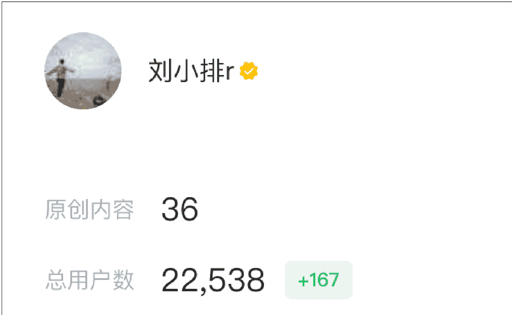
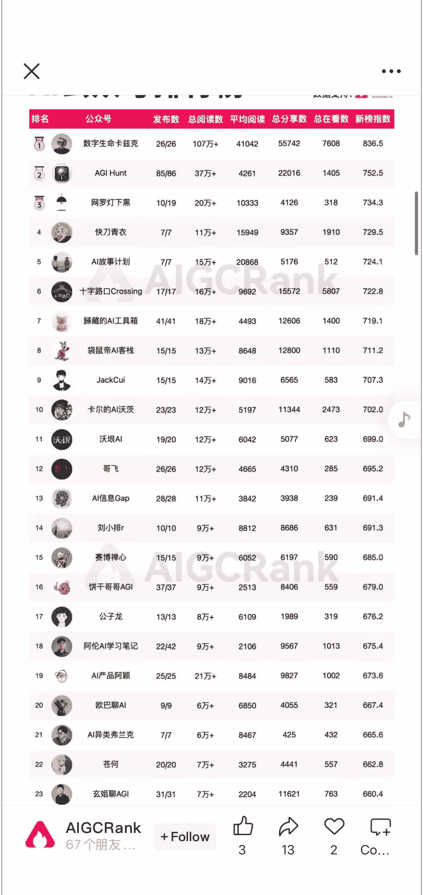
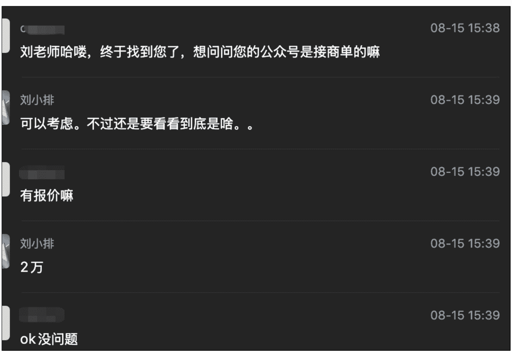
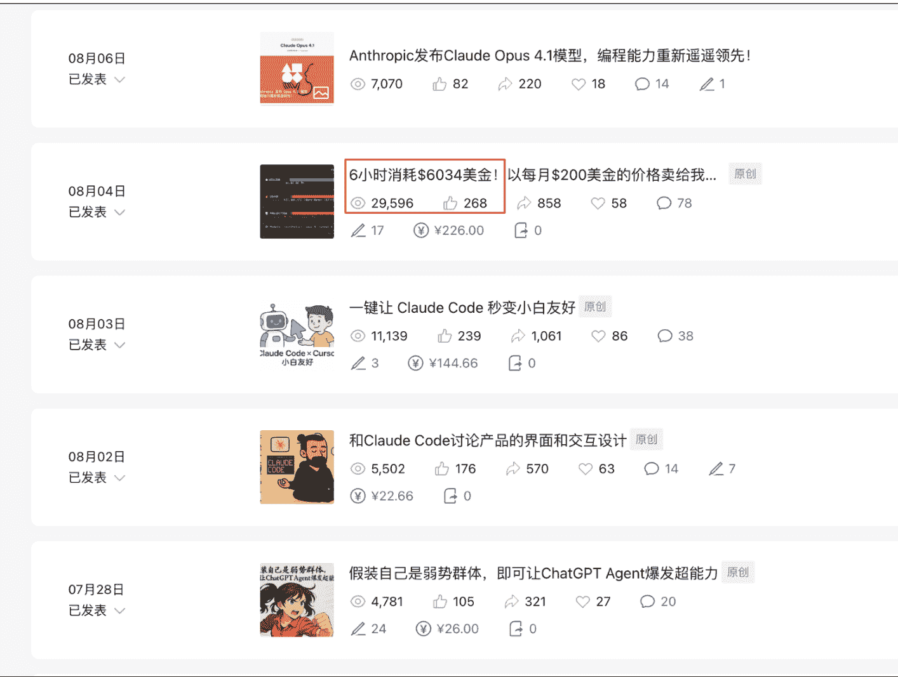
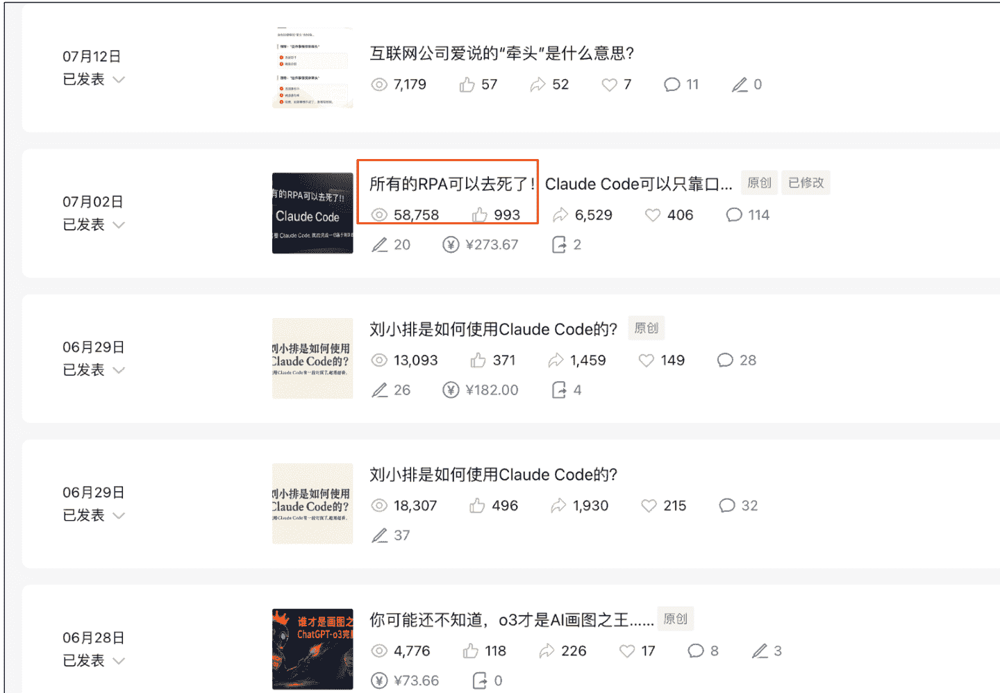
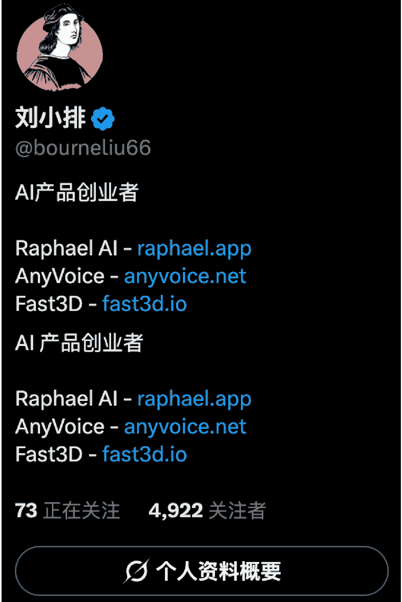
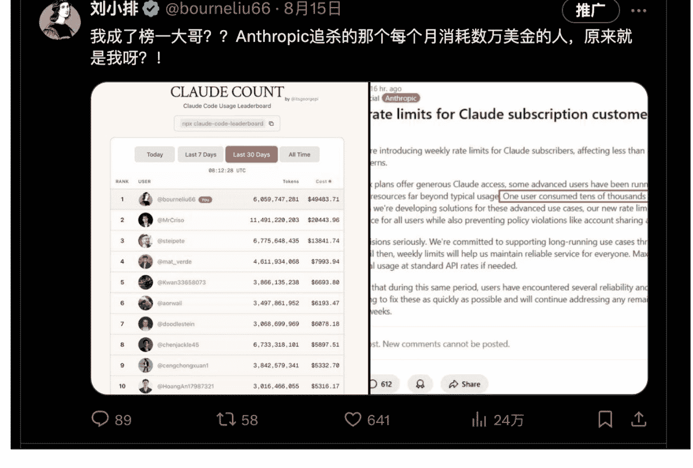
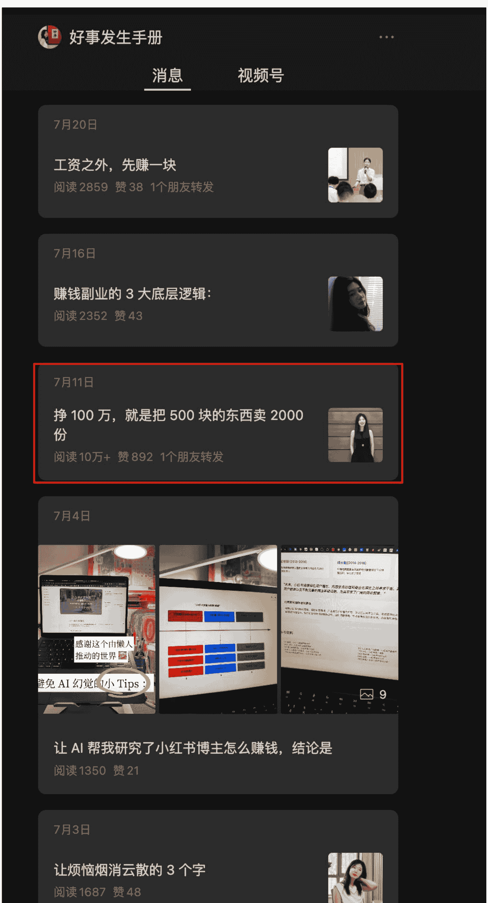

# 怎样做公众号？

250826 生财精华

整理：公众号懒人搜索，懒人专属群独享

懒人微信：lazyhelper


哈喽，大家好，我是刘小排。

在今年的「超级赛道」当中，垂直品类公众号是最蓝海的一个，亦仁亲自下场推荐：如果只选一个，就选它。

不仅如此，亦仁自己已经开始写公众号了，足以看到这条超级赛道的潜力。

既然如此，本月我的作业在生财有术，没有太多选择，只能讲它了。

这一篇内容，不会发布我的公众号，只在生财有术内分享。

我从 6 月底开始认真写公众号，属于一个比较小众的领域——AI。Claude Code，现在已经有了 2.25 万粉丝。

据说到了 AI 类微信公众号 7 月榜单的 14 名。





下个月排名应该更高一些，因为 8 月还没过完，8 月的数据比 7 月更好。

对了，从功利角度说，做公众号接商单也很香，只是我并不怎么喜欢接。我喜欢分享自己真的觉得好的东西。



下面分享一些我的观察和思考。

我说得可能不对，而且充满偏见，毕竟我也是个新人。咱们可以共同讨论。

## 原理

我们先从原理层面讲，我相信：

- 1. 世界是幂次分布的。一篇爆款内容，顶百篇平庸内容。

- 2. 羊群效应。如果你看到一篇文章已经有 1000 人转发了，你会很愿意去做第 1001 个转发的人；如果一篇文章只有 10 人转发，你并不愿意去做第 11 个转发的人，因为你会怀疑自己：别人都不喜欢，我为啥喜欢，是不是自己品味有问题？

- 3. 选题决定 80%；选题后，标题决定剩下的 20%。一篇文章到底会不会爆，其实，你在发出去之前，你已经知道了。如果你不知道？那可能在你所在的领域，你还需要更多的网感。下面展开讲。

## 推论

- 1. 不要追求文章数量，先追求质量

> 懒人微信：lazyhelper

# 公众号懒人搜索，懒人专属群分享

一个显而易见的事实：一篇爆款文章，顶百篇平庸文章。

我的几次大规模涨粉，都是因为发出来了单篇 3～5 万阅读左右的文章，从而单日涨粉 2000 以上。

对比之下，很多朋友和我同时间起步，每天很辛勤地研究 AI 自动化发文章，结果两个过去啥也没有。那么，AI 到底是在帮他省时间，还是浪费时间呢？

- 实战心得：专注于倾注诚意，写爆款，不要轻易考虑批量化、自动化

- 2. 选题决定 80%；发出文章之前，你已经知道它会爆

直接看我的数据。

8 月 4 日这篇，当我想好了选题和标题，我已经知道它会爆了。

因为这件事情非常稀缺，很少有人能做到，别说做到，甚至都没见到过有人做到。



懒人微信：lazyhelper

而在那篇 7 月 2 日发的文章也是一样，我发出去之前就知道它肯定能到 3 万阅读以上（现在是 5.87 万）。

因为在 7 月 2 日，用户根本没见过，有人把 Claude Code 当成 RPA 来用。现在你可能已经见过了，对吗？我看了几篇，基本上要么是洗我的稿，要么是从我这里得到启发，做了一些有用的延展。



- 实操心得：培养自己的网感，多和 AI 讨论选题。没有好的选题，宁愿不写。

## 3. 选题完成后，标题决定剩下的 20%

就拿刚才的「把 Claude Code 当成 RPA 来使用」选题来说，如果我标题真的叫「把 Claude Code 当成 RPA 来使用」，恐怕阅读量没那么高吧？我为什么要使用「所有的 RPA 可以去死了！Claude Code 可以只靠口喷完成一切」这个标题呢？因为带了情绪、带了鲜明的观点。

文章内容是有干货的，但是标题不需要有干货。

当然，这个标题，我也是和 AI 讨论过的。我把文章全文发给 ChatGPT，和它讨论了一会儿。

**实操心得**：把文章全文发给 AI，和 AI 讨论标题。

## 4. 成为垂直赛道真专家，培养核心受众

上面我们提到了羊群效应。如果你看到一篇文章已经有 1000 人转发了，你会很愿意去做第 1001 个转发的人；如果一篇文章只有 10 人转发，你并不愿意去做第 11 个转发的人，因为你会怀疑自己：别人都不喜欢，我为啥喜欢，是不是自己品味有问题？

解法也是显而易见的：你需要培养核心受众。

你最核心的受众，愿意承担风险去做最早转发的 10 人；路人，只愿意做第 1001 个转发的人。

- **实操心得**：

  - 1. 想办法培养自己的核心受众。不能是朋友，因为你的朋友大概率不在你所选的垂直赛道；

  - 2. 你需要成为垂直赛道的真专家。

## 5. 零帧起手的爆款

如果你还没有核心受众，怎么零帧起手做爆款呢？

你需要创造的是：稀缺 + 有趣。

没多少人喜欢看干货。面对干货文章，普通用户给它的待遇是「收藏」「稍后阅读」「转发给别人读」。

普通人只对「有趣」的东西欲罢不能，必须马上读。

上面展示了我的两条公众号，它都满足：有趣、稀缺。

对了，正好我有一个零帧起手的爆款案例。我的 Twitter 账号是 3 天内从 60 粉涨到 4922 粉的。现在还在增长中。等你看到本文的时候，我的粉丝数字应该更高一些了。

Twitter 账号是@burneliu66

https://x.com/burneliu66



涨 5000 粉，只靠了下面这一条推，24 万阅读。

为啥？因为在全世界范围内，这个选题都满足：稀缺 + 有趣。

我说啥干货了吗？完全没有。

现在复盘，唯一比较遗憾的是当时没发英文推，否则应该还可以翻几倍。



- 实操心得：创造稀缺 + 有趣的东西。

## 6. 脑袋一团浆糊，选题怎么做？

有一个方法：看对标账号。

此处引用一个其他领域的黑话：看低粉爆款。

你需要去找到这样的公众号：它的长期阅读数量是稳定的，但是偶尔有一两篇爆款。然后让 AI 去分析，为什么爆？

这里我们先看看我的朋友王梦珂的公众号。长期阅读量都是稳定的，偶尔有 10 万+。这就是很好的研究案例。

那一篇为什么会有 10 万+？

你先自己去看一看，想一想。当你看得足够多，有了网感，大概率你可以得到答案。

然后你去问 AI，让 AI 帮你补充。



懒人微信：lazyhelper

| 日期 | 文章标题 | 阅读 | 赞 |
| :--- | :--- | :--- | :--- |
| 6 月 3 日 | 2025 年做产品必须知道的 3 件事 | 2996 | 79 |
| 5 月 27 日 | 打起精神，像个公主 | 2743 | 77 |
| 4 月 27 日 | 搜尽奇峰打草稿 | 1195 | 29 |
| 4 月 17 日 | 三十多岁，啥也不会 | 3677 | 109 |
| 4 月 13 日 | 保持精力旺盛的 3 个方法 | 10 万+ | 451 |
| 4 月 1 日 | 那些赚钱最该学的东西，根本没人教 | 2500 | 58 |
| 3 月 18 日 | 让 AI 帮你—实现那些难以启齿的野心 | | |

我掏出了 Claude Code，把截图扔给它，简单试试。下面是一个大致的示例。

```
**Welcome to Claude Code!**

/help for help, /status for your current setup

cwd: /Users/liuxiaopai/Documents/GitHub/raphael-nextjs

> [Image #1][Image #2] 你看看我朋友的公众号的选题，为什么这两篇阅读量突然这么高？可以给我的选题有哪些启发？
如果我也可以做她这个领域的公众号，你建议我避开什么选题，尽量选择什么选题

* 看了这两篇高阅读量文章，我发现了几个关键点：

**爆款原因分析**

共同特征:
1. 具体数字 + 强对比：两篇都用了精确数字制造反差 (100 万挣 500 块 / 10 万 + 阅读)
2. 痛点精准：直击副业焦虑和精力管理难题
3. "3 个" 法则：简单易记，降低阅读门槛

对你的选题启发

可以借鉴的方向:

- 真实案例 + 数据：用具体数字说话，如"月入 3 万的设计师，为什么还在焦虑"
- 反常识内容：打破固有认知，如"为什么努力的人反而赚不到钱"
- 实用方法论：给出具体可执行的步骤

建议避开的选题:

- 纯鸡汤励志文 ( "相信自己"类)
- 过于宽泛的话题 ( "如何成功")
- 已经被写烂的内容 ( "自律的重要性")

推荐选题方向:

1. 职场真相类： "大厂裁员后，那些转行的人现在怎么样了"
2. 技能变现类：
"把 PPT 做到极致，我一年多赚 20 万"
3. 时间管理类： "每天只工作 4 小时，我是如何月入 5 万的"
4. 认知突破类：
"30 岁才明白，努力方向错了比不努力更可怕"

记住：数据 + 故事 + 方法是爆款三要素。
```

更严谨的方法，SCAI 已经有同学实现了，需要一些编程功底。我可以简单说一下思路：

- 1. 找到同领域的 50 个号，抓取它们全部的文章 (包括标题、内容、内容配图、评论等全面信息)

- 2. 将它们分为两组，爆款组和普通组。

- 实操心得：培养自己在垂直领域的网感，和 AI 共同探究「低粉爆款」选题背后的原因。

总结

- 1. 和 AI 共同探究「低粉爆款」选题背后的原因
- 2. 倾注诚意，不要轻易用 AI 做批量化
- 3. 成为垂直领域的真专家
- 4. 稀缺 + 有趣

# 最后，安利小懒的付费群：

## 懒人专属群


📕 懒人专属群持续更新中，已持续运营 6 年，整理超 3000 份各类精选付费文章 & 年费社群干货，全部开放下载。

本资料为付费群内部分享，仅供真实有需要的朋友查阅 🙏

## 懒人专属群更新记录：

https://lazy2025.top/blog/record2

## 懒人专属群更新记录（需梯子，备用）:
https://lazybook.fun/blog/record2