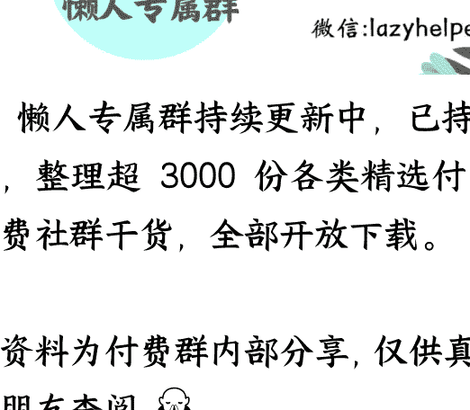

# 史上“最长学期”到来，别让“过度关心”成为孩子的负担

2025.09.01

整理：公众号懒人搜索，懒人专属群独享

懒人微信：lazyhelper

今天是全国中小学开学的第一天，不论你是老师、学生，还是家长，这个学期都有点特别。因为这是近十年以来，全国中小学最长的一个学期。

为什么？因为 2025 年是农历闰年，有两个农历六月，这一年的农历日期比往年多 19 天。这意味着 2026 年的春节延迟到了 2 月 17 日。按照惯例，寒假一般提前春节 15 天。于是，一来二去，学期也就延长了。很多地方已经正式宣布，寒假从 1 月底或者 2 月初开始。

学期更长，意味着孩子的压力可能变大，家长也会变得更敏感，因为大家都担心孩子在这个超长学期中掉队。

换句话说，最长的学期，最大压力的学生，最敏感的家长，这三者从今天起，就算正式会合了。因为咱们得到同学里有不少家长，因此，咱们今天就站在家长的角度来看看这件事。

按照通常的设想，孩子压力大，肯定得关心啊。但很多时候，你可能也发现了，有时越是关心，反而容易起反效果。比如，对学业的频繁询问，对学校生活的刨根问底，对同学关系的侦探式调查，这些都属于过度关心。

但问题是，作为家长，我们对孩子也不可能不过问。那么，怎么拿捏这个尺度，给孩子恰到好处的关心呢？

关于这个问题，著名的教育家，李希贵校长提出过一个方法，叫把“权力思维”转换成“规则思维”。

传统的家庭教育中，父母动用的更多是权力思维。面对孩子，家长是权威，有大事小事的决定权，所以要求孩子听话。“我是家长，你必须听我的”，这就是典型的权力思维。

权力思维在孩子小的时候可能有效，但孩子长大一点，比如到了青春期，情况就完全不同了。青春期孩子的核心任务就是形成自我认同，他们特别希望能掌控自己的生活。这时候，你越是想要用权力管束他，他反而越容易反抗。

因此，李希贵校长有个叮嘱，家长在教育中，要遵守一条原则，叫做，少动用权力，多动用规则。

什么是规则思维呢？它说的是，不用权力来强制要求孩子。而是用明确的、双方都认可的规则来约束行为。

比如，督促孩子写作业，动用权力思维的家长会说，“我要求你 9 点半前必须写完作业，这事儿没商量。”而动用规则思维的家长会说，“咱们约定好的规则是 9 点前完成作业，这样你能多出半小时的娱乐时间，并且也能保证充足的睡眠。”

你看，同一件事，两种表达完全不同，权力思维强调的是服从，而规则思维，强调的是共同遵守。换句话说，权力思维是“我说了算”，规则思维是“咱们说了算”。

那么，从权力思维转向规则思维，具体应该怎么操作？在研究这个问题的过程中，我发现关系专家熊太行老师根据多年的实践经验，总结出了三个非常好上手的操作方法。分别是，谈交易、开会议、签协议。这三招是递进关系，从易到难。

咱们先来看最容易执行，也是对孩子激励最明显的方法，谈交易。

家长大概率都经历过这种场景，孩子放学回家，书包一扔就坐到沙发上玩手机，你催他快去写作业，他答应了你一声，但一点儿没有行动的意思。怎么办？传统做法就是不停催促，但这样一来，双方就可能形成一次小冲突。这时候，更好的方式，是跟孩子“谈交易”。当然，这个交易打了引号，实际上是双方约定一个写作业的规则。

注意，重点来了。**谈交易的核心就是要让孩子觉得自己有选择，而不是被迫接受家长的安排**。

首先，不要直接下命令，而是跟孩子商量，“你觉得怎样安排作业和娱乐比较合理？”其次，针对规则设计奖励。奖励必须是孩子真实想要的，而且要奖励“做得好”而不只是“做完了”。比如，不要说“你做完作业，就能看电视”，而要说，“要是你连续一周按时完成作业，那我们就能多看一集电视”。

换句话说，用“咱们约定”而不是“我要求”，这就是让孩子感受到选择权的关键。

谈交易这个方法，特别建议你在孩子习惯还没养成的时候用。等孩子的习惯养成了，可以慢慢减少奖励，让孩子从外部驱动转向内部驱动，靠自己的满足感坚持下去。

假如第一招，“谈交易”的方法你已经用得很熟练了，接下来，咱们升级到第二招，开家庭会议。

注意，这一招的核心在于什么？让孩子从被管理的对象，变成规则的共同制定者。换句话说，不是你管他，而是咱们一起管这个家。

家庭会议可以这么开。首先，务虚的方面，家人之间要相互表达感谢，分享其他人做得好的事，先奠定一个感情充沛的基调。其次，务实的方面，就是要解决问题，全家人把需要讨论的问题写在小白板上，挨个讨论解决方案，每一项方案都必须全体通过，假如不能，就修改条款、互相妥协，直到全体通过为止。

这样开家庭会议的好处，在很多人那里都获得过验证。比如说，有位管理学专家和妻子原本特别苦恼怎么管理孩子们看电视的时间。一开始他们也会定规则，和孩子约好一起遵守，但孩子总能找到理由打破规则，每次谈到看电视都是一场拉锯战。

后来，他们开了一次家庭会议。这回不再是家长直接宣布奖惩规则，而是全家坐下来一起讨论，究竟看多长时间电视合适，以及成员之间怎么监督。在会上讨论了一个多小时后，孩子们果然逐渐统一思想，一致同意每星期看 7 个小时电视，并且还选出了一名孩子担任“电视监督员”。

你看，这就算是一次有效的家庭会议。孩子们在“会议桌”上一起谈规则，寻找解决方案，成为规则的共同制定者。

换句话说，**开会议的关键就是让孩子感受到，他不是被管理的对象，而是家庭的决策者之一**。

当然，开会确定共识，有时候还不够。作为父母，你可能和孩子无数次口头达成一致，但真遇到事儿了，矛盾还是很难避免。毕竟，“口头承诺”的效力难免有限。

这时候，咱们就要采用一种约束力更强的方法，“签协议”。签协议的核心就是让承诺更有约束力，孩子会觉得这是自己参与制定的正式承诺，不能随意违约。

心理学上有个概念，叫“承诺一致性原理”，说的是当一个人公开承诺了要做一件事，他就会强烈的动机去履行这个承诺。换句话说，**人们更愿意遵守自己参与制定的规则**。这就好比网上说的，自己选的路，跪着也要走完。

比如，压岁钱放在谁那里？这个问题怎么解决？可以试试签协议。比如，熊太行老师自己，小时候就和父亲签过一份协议。协议约定，把 500 元压岁钱借给父亲投资，一年后还 600 元。双方通过这个协议，解决了“要不要把压岁钱交给父母”的问题。

再比如，孩子平时能不能玩手机？这个问题也可以签协议。可以和孩子们一起，制定一套家庭电子产品使用规则。规则中约定每天使用手机的时间，并且把规则贴在墙上，全家人一起遵守。其次，每天固定时间，去参加户外活动。假如违反规则，作为惩罚，一周的时间都不能在家看手机。当然，最重要的是，这套规则必须有平等的约束力，家长孩子都必须遵守。

咱们得到的 CEO 脱不花老师就试过这套方法，据说效果很好。

换句话说，签协议就是把口头约定变成白纸黑字，让孩子对自己的承诺更负责。

好，到这儿，用规则思维和孩子相处的三个方法，咱们就介绍完了。你看，从这三招背后，咱们能看到一个更普遍的道理，权力思维的本质是控制，而规则思维的本质是赋能。

权力思维中，认为孩子不听话是因为管得不够严，提醒得不够多，就应该多控制、多提醒、多关心。这就相当于只把孩子当成被动的执行者，而不是主动的参与者。而规则思维是什么？家长意识到，孩子不愿意听自己的话，其实是因为缺乏参与感和掌控感。所以解决方案就变成了，家长让孩子参与到规则制定中来，让他们感受到自己也是家庭的决策者之一，而不是被管理的对象。

权力思维是“我管你”，规则思维是“咱们一起管”。就像李希贵校长说的，“教育学首先是关系学”。当关系对了，很多问题就迎刃而解了。

最后，我把今天说的三个方法，总结成三句简单的口头禅，希望你听完能记住带走。

- **第一句**，“你觉得怎么安排比较好？”这是谈交易的核心，让孩子有选择感。
- **第二句**，“咱们开个会商量商量。”这是开会议的精髓，让孩子有参与感。
- **第三句**，“咱们把这个写下来。”这是签协议的要点，让承诺有约束力。

这三句话送给你，也希望你看完之后，转发给身边家里有娃的朋友。

关于这个话题，咱们先说到这。

最后，安利小懒的付费群：

🏆 懒人专属群持续更新中，已持续运营 6 年，整理超 3000 份各类精选付费文章 & 年费社群干货，全部开放下载。

本资料为付费群内部分享，仅供真实有需要的朋友查阅 🙈

懒人专属群更新记录：
https://lazy2025.top/blog/record2
懒人专属群更新记录（需梯子，备用）：
https://lazybook.fun/blog/record2